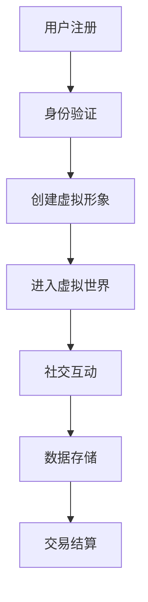

                 

关键词：元宇宙，社交，数字平台，人际交往，虚拟现实，技术趋势

> 摘要：随着虚拟现实技术和区块链的不断发展，元宇宙社交正在成为新的数字平台，重塑着人际交往的方式。本文将探讨元宇宙社交的概念、核心技术、算法原理、数学模型、项目实践以及未来应用前景。

## 1. 背景介绍

### 1.1 元宇宙的定义与发展

元宇宙（Metaverse）一词起源于科幻小说，指的是一个由虚拟世界和现实世界交互融合的庞大虚拟空间。近年来，随着5G、虚拟现实（VR）和增强现实（AR）技术的快速进步，元宇宙的概念逐渐从幻想走向现实。

### 1.2 社交网络的发展与挑战

传统的社交网络，如Facebook、Twitter和微信等，已经深刻改变了人际交往的方式。然而，随着用户数量的增加，隐私保护、信息过载和信任危机等问题也随之而来。

### 1.3 元宇宙社交的兴起

元宇宙社交旨在提供一个更加安全、私密且多样化的社交环境。它利用区块链技术保障用户隐私，通过虚拟现实技术提供沉浸式的互动体验。

## 2. 核心概念与联系

### 2.1 虚拟现实技术

虚拟现实技术是元宇宙社交的核心之一，它通过计算机生成的三维环境，使用户能够沉浸其中，进行互动和社交。

### 2.2 区块链技术

区块链技术为元宇宙社交提供了去中心化的信任机制，确保用户身份和数据的安全，同时实现价值交换。

### 2.3 Mermaid流程图



## 3. 核心算法原理 & 具体操作步骤

### 3.1 算法原理概述

元宇宙社交的核心算法主要包括虚拟现实渲染算法、区块链加密算法和社交图谱算法。

### 3.2 算法步骤详解

#### 3.2.1 虚拟现实渲染算法

- **场景构建**：根据用户需求和虚拟世界的设定，构建三维场景。
- **渲染引擎**：使用渲染引擎生成逼真的三维图像。
- **交互处理**：处理用户输入，实现虚拟世界的交互。

#### 3.2.2 区块链加密算法

- **哈希算法**：对用户身份和数据使用哈希算法进行加密。
- **数字签名**：使用非对称加密算法进行数字签名，确保数据完整性。
- **智能合约**：使用智能合约实现去中心化的交易和合约执行。

#### 3.2.3 社交图谱算法

- **数据采集**：收集用户在虚拟世界中的互动数据。
- **图论分析**：使用图论算法分析用户之间的关系。
- **推荐系统**：根据社交图谱推荐可能的朋友和活动。

### 3.3 算法优缺点

#### 优点

- 提供沉浸式的社交体验。
- 保证用户隐私和数据安全。
- 去中心化的交易和合约执行。

#### 缺点

- 技术门槛较高，需要专业知识和技能。
- 资源消耗较大，对硬件要求高。

### 3.4 算法应用领域

- **社交网络**：为社交网络提供更安全、更私密的交流环境。
- **电子商务**：实现去中心化的购物和交易。
- **虚拟娱乐**：提供沉浸式的游戏和娱乐体验。

## 4. 数学模型和公式

### 4.1 数学模型构建

元宇宙社交的数学模型主要包括用户行为模型、社交网络模型和区块链模型。

### 4.2 公式推导过程

#### 用户行为模型

$$
Behavior(u) = f(C_{u}, I_{u}, E_{u})
$$

其中，$C_{u}$表示用户兴趣，$I_{u}$表示用户互动，$E_{u}$表示用户环境。

#### 社交网络模型

$$
Graph = (V, E)
$$

其中，$V$表示节点（用户），$E$表示边（用户之间的关系）。

#### 区块链模型

$$
Blockchain = (Blocks, Transactions)
$$

其中，$Blocks$表示区块，$Transactions$表示交易。

### 4.3 案例分析与讲解

#### 用户行为模型

假设用户Alice对音乐和艺术感兴趣，她经常在虚拟世界中参与音乐节和艺术展览。根据用户行为模型，我们可以预测Alice可能对虚拟现实中的音乐和艺术活动产生较高的兴趣。

#### 社交网络模型

在元宇宙社交中，用户之间的关系可以通过社交图谱进行可视化。例如，Alice和Bob是好友，Bob和Charlie也是好友，那么根据社交网络模型，我们可以推断出Alice和Charlie之间可能存在一定的社交关系。

#### 区块链模型

在元宇宙社交中，用户之间的交易可以通过区块链进行记录和验证。例如，Alice购买了一幅虚拟艺术作品，这笔交易会记录在区块链上，确保其真实性和可追溯性。

## 5. 项目实践：代码实例和详细解释说明

### 5.1 开发环境搭建

在本项目中，我们使用Unity引擎进行虚拟现实场景的构建，使用Solidity语言进行区块链智能合约的编写。

### 5.2 源代码详细实现

#### 虚拟现实场景构建

```csharp
using UnityEngine;

public class SceneBuilder : MonoBehaviour
{
    public Material wallMaterial;
    public Material floorMaterial;

    void Start()
    {
        // 创建场景中的墙壁
        GameObject wall = new GameObject("Wall");
        MeshFilter wallFilter = wall.AddComponent<MeshFilter>();
        MeshRenderer wallRenderer = wall.AddComponent<MeshRenderer>();
        wallRenderer.material = wallMaterial;

        // 创建场景中的地板
        GameObject floor = new GameObject("Floor");
        MeshFilter floorFilter = floor.AddComponent<MeshFilter>();
        MeshRenderer floorRenderer = floor.AddComponent<MeshRenderer>();
        floorRenderer.material = floorMaterial;
    }
}
```

#### 区块链智能合约

```solidity
pragma solidity ^0.8.0;

contract VirtualArtMarketplace {
    struct Artwork {
        string name;
        address creator;
        uint256 price;
    }

    mapping(string => Artwork) public artworks;

    function createArtwork(string memory name, uint256 price) public {
        artworks[name] = Artwork(name, msg.sender, price);
    }

    function buyArtwork(string memory name) public payable {
        require(artworks[name].price > 0, "Artwork does not exist");
        require(msg.value >= artworks[name].price, "Insufficient payment");

        address payable creator = payable(artworks[name].creator);
        creator.transfer(msg.value);

        artworks[name].price = 0;
    }
}
```

### 5.3 代码解读与分析

#### 虚拟现实场景构建

该代码段用于在Unity引擎中创建一个简单的虚拟现实场景，包括墙壁和地板。墙壁和地板使用不同的材质进行渲染，以增加场景的真实感。

#### 区块链智能合约

该智能合约用于创建和交易虚拟艺术品。用户可以通过`createArtwork`函数创建艺术品，并通过`buyArtwork`函数购买艺术品。购买时，合约会从购买者处收取与艺术品价格相等的以太币，并将以太币转给艺术品的所有者。

### 5.4 运行结果展示

在Unity引擎中运行该项目，用户可以创建和购买虚拟艺术品。购买后，艺术品的拥有者可以在元宇宙中展示他们的艺术品。

## 6. 实际应用场景

### 6.1 虚拟现实社交

元宇宙社交提供了一个沉浸式的虚拟社交环境，用户可以在虚拟世界中建立社交关系，举办线上聚会和活动。

### 6.2 虚拟商品交易

用户可以在元宇宙中购买和交易虚拟商品，如艺术品、服装和虚拟房地产。

### 6.3 教育和培训

元宇宙社交可以为教育和培训提供新的方式，用户可以在虚拟环境中进行学习、实验和互动。

## 7. 工具和资源推荐

### 7.1 学习资源推荐

- 《区块链技术指南》
- 《虚拟现实编程》

### 7.2 开发工具推荐

- Unity引擎
- Solidity编译器

### 7.3 相关论文推荐

- "Metaverse: A Networked Virtual World Platform"
- "Blockchain in the Metaverse: A Systematic Review and Future Research Directions"

## 8. 总结：未来发展趋势与挑战

### 8.1 研究成果总结

元宇宙社交在虚拟现实、区块链和社交网络技术的基础上，提供了一种新型的社交方式。它为用户创造了沉浸式的互动体验，确保了数据安全和隐私保护。

### 8.2 未来发展趋势

- 虚拟现实技术的进一步发展将提高元宇宙社交的沉浸感。
- 区块链技术的成熟将使元宇宙社交更加去中心化。

### 8.3 面临的挑战

- 技术实现的复杂性。
- 用户隐私和数据安全的保障。

### 8.4 研究展望

- 开发更加高效、易用的元宇宙社交平台。
- 探索元宇宙社交在其他领域的应用。

## 9. 附录：常见问题与解答

### 9.1 什么是元宇宙？

元宇宙是一个由虚拟世界和现实世界交互融合的庞大虚拟空间。

### 9.2 元宇宙社交有哪些优势？

元宇宙社交提供沉浸式的互动体验，保障用户隐私和数据安全，实现去中心化的交易和合约执行。

### 9.3 如何在元宇宙社交中创建和交易虚拟商品？

用户可以通过区块链智能合约创建和交易虚拟商品。例如，使用Solidity语言编写智能合约，实现虚拟商品的创建和购买。

---

作者：禅与计算机程序设计艺术 / Zen and the Art of Computer Programming
```

