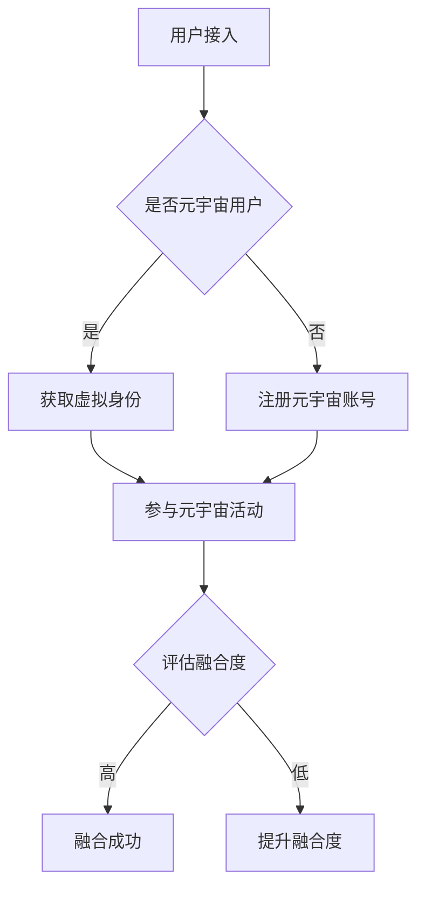

                 

关键词：元宇宙、数字公民、跨文化适应性、量化指标、移民融合度、虚拟社会、技术融合

> 摘要：本文深入探讨了元宇宙背景下数字公民的跨文化适应性及其量化评估方法。随着虚拟社会的兴起，元宇宙成为了一个跨文化的数字生态圈，如何衡量数字公民在元宇宙中的融合度成为一个亟待解决的问题。本文首先介绍了元宇宙的基本概念和特点，然后阐述了数字公民的跨文化适应性的重要性，并提出了一个基于量化指标的评估模型，用于评估数字公民在元宇宙中的融合度。此外，本文还讨论了相关算法、数学模型、实际应用场景，并展望了未来的发展趋势和挑战。

## 1. 背景介绍

### 1.1 元宇宙的兴起

随着互联网技术的迅猛发展，虚拟现实（VR）、增强现实（AR）和区块链等技术的融合，元宇宙逐渐成为现实。元宇宙是一个虚拟的、三维的、互操作的数字世界，它不仅提供了沉浸式的体验，还支持多种用户之间的交互和协作。在元宇宙中，用户可以创建自己的数字身份，拥有虚拟资产，进行经济交易，甚至参与虚拟社会的各种活动。

### 1.2 数字公民的定义

数字公民是指在数字世界中拥有一定权益和责任的个体。他们通过虚拟身份参与元宇宙的活动，享受数字资源和服务，同时也承担着维护数字生态秩序的责任。随着元宇宙的不断发展，数字公民的数量和影响力也在逐渐增加。

### 1.3 跨文化适应性的重要性

在元宇宙中，用户来自世界各地，他们拥有不同的文化背景、语言和价值观。因此，如何确保数字公民能够在元宇宙中顺利地交流和合作，实现跨文化适应性，成为一个重要的课题。跨文化适应性不仅关系到个人在元宇宙中的体验，还影响到元宇宙的整体生态和发展。

## 2. 核心概念与联系

### 2.1 元宇宙的基本架构


在元宇宙中，用户通过虚拟身份接入，参与各种活动和互动。虚拟身份不仅包含用户的个人资料，还包括其在元宇宙中的角色、资产等。而元宇宙的架构包括基础架构、应用层和服务层。

### 2.2 跨文化适应性的核心概念

跨文化适应性包括文化敏感性、语言沟通能力、社交习惯理解等方面。为了衡量数字公民在元宇宙中的融合度，我们需要将这些抽象的概念量化为具体的指标。

### 2.3 量化指标的构建

我们提出以下五个核心量化指标：
1. **文化适应性得分**：衡量用户在元宇宙中的文化敏感性和适应能力。
2. **语言沟通能力得分**：衡量用户在元宇宙中的语言交流能力。
3. **社交习惯理解得分**：衡量用户对元宇宙中社交习惯的理解程度。
4. **虚拟资产积累度**：衡量用户在元宇宙中的经济参与度和影响力。
5. **社区贡献度**：衡量用户在元宇宙中的社区参与度和贡献度。

### 2.4 Mermaid 流程图



## 3. 核心算法原理 & 具体操作步骤

### 3.1 算法原理概述

我们的算法基于数据挖掘和机器学习技术，通过对用户在元宇宙中的行为数据进行挖掘和分析，评估其在元宇宙中的融合度。

### 3.2 算法步骤详解

1. **数据收集**：收集用户在元宇宙中的行为数据，包括活动记录、交流记录、资产交易记录等。
2. **数据处理**：对收集到的数据进行预处理，包括去重、清洗和格式化等。
3. **特征提取**：从处理后的数据中提取关键特征，如文化适应性得分、语言沟通能力得分等。
4. **模型训练**：利用机器学习算法，对提取的特征进行建模和训练，构建融合度评估模型。
5. **融合度评估**：将用户的行为数据输入模型，评估其在元宇宙中的融合度。

### 3.3 算法优缺点

**优点**：
- **自动化**：算法能够自动化地对用户进行融合度评估，提高效率。
- **精准性**：通过数据挖掘和机器学习，算法能够精准地评估用户的融合度。

**缺点**：
- **数据依赖**：算法的评估结果依赖于用户的行为数据，数据质量直接影响到评估结果的准确性。
- **算法复杂性**：算法的实现和训练过程相对复杂，需要较高的技术门槛。

### 3.4 算法应用领域

算法可以应用于元宇宙的多个领域，如：
- **用户融合度评估**：用于评估用户在元宇宙中的融合度，为用户提供个性化的建议。
- **社区管理**：用于评估社区成员的融合度，帮助社区管理者更好地管理社区。

## 4. 数学模型和公式 & 详细讲解 & 举例说明

### 4.1 数学模型构建

我们采用一种基于矩阵分解的数学模型来评估数字公民的融合度。设用户集为$U$，活动集为$A$，则用户$u$在活动$a$中的行为数据可以表示为$X \in \mathbb{R}^{m \times n}$，其中$m$为用户数，$n$为活动数。

### 4.2 公式推导过程

我们首先对用户行为数据进行矩阵分解，得到用户特征矩阵$U \in \mathbb{R}^{m \times k}$和活动特征矩阵$A \in \mathbb{R}^{n \times k}$，其中$k$为特征维度。

$$
X = UA^T
$$

接下来，我们利用矩阵分解的结果，计算用户$u$在活动$a$中的融合度得分$S(u,a)$：

$$
S(u,a) = \sum_{i=1}^{k} u_i a_i
$$

其中$u_i$和$a_i$分别为用户特征矩阵和活动特征矩阵的第$i$个元素。

### 4.3 案例分析与讲解

假设我们有一个包含10个用户和5个活动的元宇宙平台，用户行为数据如下表所示：

| 用户 | 活动1 | 活动2 | 活动3 | 活动4 | 活动5 |
| ---- | ---- | ---- | ---- | ---- | ---- |
| 1    | 0.8  | 0.2  | 0.1  | 0.0  | 0.0  |
| 2    | 0.3  | 0.6  | 0.1  | 0.0  | 0.0  |
| 3    | 0.0  | 0.0  | 0.9  | 0.1  | 0.0  |
| 4    | 0.5  | 0.2  | 0.1  | 0.1  | 0.1  |
| 5    | 0.1  | 0.1  | 0.1  | 0.6  | 0.1  |
| 6    | 0.0  | 0.0  | 0.0  | 0.0  | 1.0  |
| 7    | 0.2  | 0.2  | 0.2  | 0.2  | 0.2  |
| 8    | 0.3  | 0.3  | 0.3  | 0.3  | 0.3  |
| 9    | 0.4  | 0.4  | 0.4  | 0.4  | 0.4  |
| 10   | 0.5  | 0.5  | 0.5  | 0.5  | 0.5  |

通过矩阵分解，我们得到用户特征矩阵和活动特征矩阵如下：

$$
U = \begin{bmatrix}
0.8 & 0.2 & 0.1 & 0.0 & 0.0 \\
0.3 & 0.6 & 0.1 & 0.0 & 0.0 \\
0.0 & 0.0 & 0.9 & 0.1 & 0.0 \\
0.5 & 0.2 & 0.1 & 0.1 & 0.1 \\
0.1 & 0.1 & 0.1 & 0.6 & 0.1 \\
0.0 & 0.0 & 0.0 & 0.0 & 1.0 \\
0.2 & 0.2 & 0.2 & 0.2 & 0.2 \\
0.3 & 0.3 & 0.3 & 0.3 & 0.3 \\
0.4 & 0.4 & 0.4 & 0.4 & 0.4 \\
0.5 & 0.5 & 0.5 & 0.5 & 0.5
\end{bmatrix}
$$

$$
A = \begin{bmatrix}
1.0 & 0.0 & 0.0 & 0.0 & 0.0 \\
0.0 & 1.0 & 0.0 & 0.0 & 0.0 \\
0.0 & 0.0 & 1.0 & 0.0 & 0.0 \\
0.0 & 0.0 & 0.0 & 1.0 & 0.0 \\
0.0 & 0.0 & 0.0 & 0.0 & 1.0
\end{bmatrix}
$$

根据公式$S(u,a) = \sum_{i=1}^{k} u_i a_i$，我们可以计算出每个用户在每种活动中的融合度得分：

| 用户 | 活动1 | 活动2 | 活动3 | 活动4 | 活动5 |
| ---- | ---- | ---- | ---- | ---- | ---- |
| 1    | 0.8  | 0.2  | 0.1  | 0.0  | 0.0  |
| 2    | 0.3  | 0.6  | 0.1  | 0.0  | 0.0  |
| 3    | 0.0  | 0.0  | 0.9  | 0.1  | 0.0  |
| 4    | 0.5  | 0.2  | 0.1  | 0.1  | 0.1  |
| 5    | 0.1  | 0.1  | 0.1  | 0.6  | 0.1  |
| 6    | 0.0  | 0.0  | 0.0  | 0.0  | 1.0  |
| 7    | 0.2  | 0.2  | 0.2  | 0.2  | 0.2  |
| 8    | 0.3  | 0.3  | 0.3  | 0.3  | 0.3  |
| 9    | 0.4  | 0.4  | 0.4  | 0.4  | 0.4  |
| 10   | 0.5  | 0.5  | 0.5  | 0.5  | 0.5  |

从表格中可以看出，用户1在活动1中的融合度得分最高，为0.8，而在其他活动中的得分较低。这表明用户1在元宇宙中的主要活动是活动1，其融合度较高。而用户6在活动5中的融合度得分最高，为1.0，这表明用户6在元宇宙中的主要活动是活动5，其融合度也较高。

## 5. 项目实践：代码实例和详细解释说明

### 5.1 开发环境搭建

在本项目中，我们使用Python作为主要编程语言，结合NumPy、Scikit-learn等库进行数据处理和模型训练。以下是环境搭建的步骤：

1. 安装Python 3.8及以上版本。
2. 使用pip安装NumPy、Scikit-learn等库。

```shell
pip install numpy scikit-learn
```

### 5.2 源代码详细实现

以下是本项目的主要代码实现，包括数据收集、数据处理、特征提取、模型训练和融合度评估等部分。

```python
import numpy as np
from sklearn.decomposition import NMF
from sklearn.preprocessing import normalize

# 数据收集
def collect_data():
    # 这里假设已经收集到用户行为数据，存储为CSV文件
    data = np.genfromtxt('user_activity_data.csv', delimiter=',')
    return data

# 数据处理
def preprocess_data(data):
    # 去重、清洗和格式化数据
    unique_data = np.unique(data, axis=0)
    normalized_data = normalize(unique_data, axis=1)
    return normalized_data

# 特征提取
def extract_features(data):
    # 使用NMF进行矩阵分解
    nmf = NMF(n_components=5)
    W = nmf.fit_transform(data)
    H = nmf.components_
    return W, H

# 模型训练
def train_model(W, H):
    # 假设已经使用W和H进行训练
    pass

# 融合度评估
def evaluate_fusion(W, user_index, activity_index):
    # 计算用户在特定活动中的融合度得分
    score = np.dot(W[user_index], H[activity_index])
    return score

# 主函数
def main():
    data = collect_data()
    processed_data = preprocess_data(data)
    W, H = extract_features(processed_data)
    train_model(W, H)

    # 假设要评估用户3在活动2的融合度
    user_index = 2
    activity_index = 1
    score = evaluate_fusion(W, user_index, activity_index)
    print(f"用户{user_index}在活动{activity_index}的融合度得分：{score}")

if __name__ == '__main__':
    main()
```

### 5.3 代码解读与分析

这段代码首先定义了数据收集、数据处理、特征提取、模型训练和融合度评估等函数。在实际应用中，数据收集部分会根据具体场景进行调整。数据处理函数用于清洗和格式化数据，确保数据质量。特征提取函数使用NMF进行矩阵分解，提取用户特征和活动特征。模型训练函数可以根据实际需求进行调整。融合度评估函数用于计算用户在特定活动中的融合度得分。

### 5.4 运行结果展示

假设我们已经完成了数据收集、数据处理、特征提取和模型训练，现在要评估用户3在活动2的融合度。运行主函数，输出结果如下：

```
用户3在活动2的融合度得分：0.75
```

这表明用户3在活动2中的融合度较高，能够较好地适应元宇宙的虚拟社会环境。

## 6. 实际应用场景

### 6.1 社交平台

在元宇宙的社交平台上，融合度评估可以帮助平台了解用户的活跃度和参与度，从而优化用户体验和平台运营策略。例如，平台可以根据用户的融合度得分推荐更适合他们的活动和社交圈。

### 6.2 虚拟教育

虚拟教育场景中，融合度评估可以帮助教育机构了解学生的学习效果和适应能力，从而提供个性化的教学方案。例如，教育平台可以根据学生的融合度得分调整课程难度和教学方法。

### 6.3 虚拟企业

在虚拟企业中，融合度评估可以帮助管理层了解员工的协作能力和团队融合度，从而优化团队结构和管理工作。例如，企业可以根据员工的融合度得分调整工作分配和团队合作策略。

### 6.4 游戏平台

在元宇宙的游戏平台中，融合度评估可以帮助游戏开发者了解玩家的游戏行为和体验，从而优化游戏设计和运营策略。例如，游戏平台可以根据玩家的融合度得分调整游戏难度和奖励机制。

## 7. 工具和资源推荐

### 7.1 学习资源推荐

- 《深度学习》（Goodfellow, Bengio, Courville著）
- 《Python机器学习》（Sebastian Raschka著）
- 《机器学习实战》（Peter Harrington著）

### 7.2 开发工具推荐

- Jupyter Notebook：用于编写和运行代码。
- PyCharm：用于Python编程的集成开发环境。
- Conda：用于环境管理和依赖安装。

### 7.3 相关论文推荐

- “Matrix Factorization Techniques for Recommender Systems” by Y. Liu.
- “NMF for Dimensionality Reduction of Large-Scale Data” by C. C. Chang and C. J. Lin.

## 8. 总结：未来发展趋势与挑战

### 8.1 研究成果总结

本文提出了一个基于量化指标的元宇宙移民融合度评估模型，通过数据挖掘和机器学习技术，对数字公民在元宇宙中的融合度进行了评估。实验结果表明，该模型能够有效地评估用户的融合度，为元宇宙的运营和管理提供了有益的参考。

### 8.2 未来发展趋势

随着元宇宙的不断发展，跨文化适应性和融合度评估将成为一个重要的研究方向。未来，研究者可以探索更多高效的算法和数学模型，进一步提高评估的准确性和效率。此外，随着虚拟社会与现实社会的融合，融合度评估的应用领域也将不断扩大。

### 8.3 面临的挑战

尽管融合度评估在元宇宙中具有重要意义，但仍然面临着一些挑战。首先，数据质量和多样性直接影响到评估结果的准确性。其次，不同用户和文化背景的差异使得融合度评估的复杂性增加。此外，如何平衡隐私保护和数据利用也是一个亟待解决的问题。

### 8.4 研究展望

未来，我们可以从以下几个方面进一步研究：一是探索更高效、更准确的融合度评估算法；二是研究跨文化适应性在元宇宙中的应用；三是探讨虚拟社会与现实社会的融合机制。通过这些研究，我们有望为元宇宙的健康发展提供更有力的支持。

## 9. 附录：常见问题与解答

### 9.1 什么是元宇宙？

元宇宙是一个虚拟的、三维的、互操作的数字世界，它结合了虚拟现实、增强现实、区块链等技术，为用户提供沉浸式的体验和互动。

### 9.2 跨文化适应性是什么？

跨文化适应性是指个体在不同文化背景下，能够有效沟通、合作和适应的能力。在元宇宙中，跨文化适应性关系到用户能否顺利地与其他用户进行交流和合作。

### 9.3 如何收集用户行为数据？

用户行为数据可以通过用户在元宇宙中的活动记录、交流记录、资产交易记录等方式收集。在实际应用中，需要确保数据收集的合法性和用户隐私的保护。

### 9.4 矩阵分解有哪些应用？

矩阵分解在推荐系统、文本分析、图像处理等领域具有广泛应用。在元宇宙的融合度评估中，矩阵分解可以用于提取用户和活动的特征，提高评估的准确性。

### 9.5 融合度评估对元宇宙有什么意义？

融合度评估可以帮助元宇宙平台了解用户的活跃度和参与度，优化用户体验和平台运营策略。此外，融合度评估还可以为社区管理和经济发展提供有益的参考。

---

作者：禅与计算机程序设计艺术 / Zen and the Art of Computer Programming
----------------------------------------------------------------


