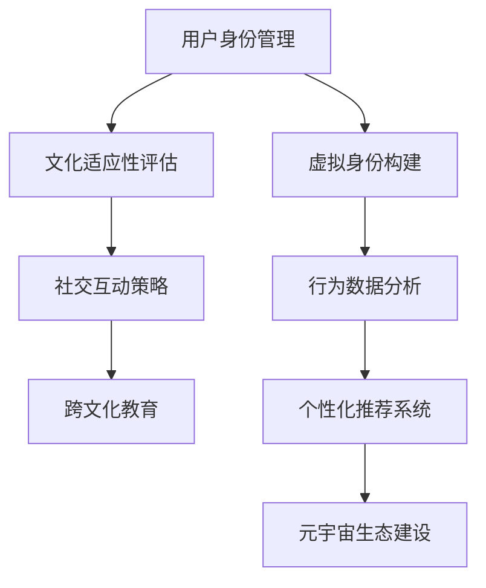

                 

关键词：元宇宙、数字公民、跨文化适应、人工智能、算法设计

摘要：随着元宇宙概念的兴起，越来越多的用户开始关注如何在虚拟世界中建立和维护自己的身份。本文探讨了元宇宙中数字公民的跨文化适应问题，提出了一种基于人工智能和算法设计的元宇宙移民融合计划。通过详细的算法原理、数学模型和项目实践，本文旨在为数字公民提供一套有效的跨文化适应方案，促进元宇宙生态的健康发展。

## 1. 背景介绍

近年来，元宇宙（Metaverse）作为一种全新的虚拟空间概念，逐渐成为科技领域的热点。元宇宙被定义为一个虚拟的、三维的、沉浸式的网络空间，用户可以在其中创建和体验各种虚拟现实场景，从而实现一种超越物理世界的全新社交和工作模式。

元宇宙的兴起，不仅带来了巨大的市场机遇，也引发了一系列技术和社会问题。其中，数字公民的跨文化适应问题尤为突出。数字公民在元宇宙中面临着不同的文化背景、社交规范和价值观，如何在这样的环境中顺利生存和互动，成为了一个亟待解决的问题。

### 1.1 元宇宙的概念与发展

元宇宙是一个由虚拟现实（VR）、增强现实（AR）、区块链、人工智能等新兴技术共同构建的虚拟空间。它不仅仅是一个虚拟游戏或社交平台，而是一个集成多种服务和应用的综合体，涵盖从娱乐、教育、医疗到商业等各个领域。

元宇宙的发展经历了几个关键阶段。最初，虚拟世界只是作为一种游戏体验而存在，如《第二人生》（Second Life）等。随着技术的进步，虚拟世界开始融入更多的现实元素，变得更加真实和沉浸。区块链技术的引入，使得元宇宙中的资产和交易变得更加透明和安全。人工智能的应用，则为元宇宙提供了智能化的交互体验和个性化服务。

### 1.2 数字公民的跨文化适应问题

数字公民在元宇宙中面临着多种文化差异，这些差异包括但不限于：

- **语言差异**：不同地区的数字公民可能使用不同的语言，导致沟通障碍。
- **社交规范**：不同文化背景下的社交行为和礼仪可能存在差异，影响数字公民的社交体验。
- **价值观差异**：不同文化对隐私、自由、权力等的看法可能截然不同，影响数字公民的行为和决策。

如何解决这些文化差异，帮助数字公民更好地适应元宇宙的生活，是元宇宙生态发展的重要课题。

### 1.3 目标与意义

本文旨在提出一种元宇宙移民融合计划，通过人工智能和算法设计，帮助数字公民更好地适应元宇宙的跨文化环境。该计划的目标包括：

- 提高数字公民的文化适应能力，减少文化冲突。
- 促进元宇宙中的文化交流和融合，增强社区凝聚力。
- 探索元宇宙生态的可持续性发展路径。

该计划的研究具有重要的现实意义，不仅有助于数字公民的跨文化适应，也为元宇宙的健康发展提供了理论支持和实践指导。

## 2. 核心概念与联系

在探讨元宇宙移民融合计划之前，我们需要明确一些核心概念，并理解它们之间的联系。以下是一个简化的 Mermaid 流程图，用于描述这些核心概念及其关系。



### 2.1 用户身份管理

用户身份管理是元宇宙的核心概念之一。在元宇宙中，用户的身份不仅仅是一个简单的账号，而是一个包含多种属性和角色的综合体。用户身份管理需要解决的主要问题包括：

- 身份认证：确保用户身份的合法性和唯一性。
- 身份属性：管理用户的个人信息、角色和权限。
- 身份安全：防止身份被盗用和滥用。

### 2.2 文化适应性评估

文化适应性评估是衡量数字公民在元宇宙中适应不同文化环境的能力。评估过程通常包括以下步骤：

- 文化识别：识别数字公民所处的文化环境。
- 文化理解：理解不同文化背景下的行为模式和价值观。
- 文化适应：评估数字公民在文化环境中的适应能力。

### 2.3 社交互动策略

社交互动策略是数字公民在元宇宙中的行为指南。有效的社交互动策略需要考虑：

- 社交礼仪：遵循不同文化背景下的社交规范。
- 社交技巧：提高数字公民在社交互动中的沟通能力和互动技巧。
- 社交目标：明确数字公民在元宇宙中的社交目标和动机。

### 2.4 跨文化教育

跨文化教育是帮助数字公民提高文化适应能力的重要手段。跨文化教育包括：

- 文化课程：提供关于不同文化的课程和教育资源。
- 文化交流：促进数字公民之间的文化交流和互动。
- 文化反思：引导数字公民反思自己的文化偏见和认知差异。

### 2.5 虚拟身份构建

虚拟身份构建是数字公民在元宇宙中的自我表达和身份认同。虚拟身份构建包括：

- 身份设计：设计符合个人文化背景和价值观的虚拟形象。
- 身份定位：确定虚拟身份在元宇宙中的角色和位置。
- 身份维护：保持虚拟身份的一致性和真实性。

### 2.6 行为数据分析

行为数据分析是了解数字公民在元宇宙中的行为模式的重要手段。通过行为数据分析，可以：

- 识别行为趋势：分析数字公民的行为习惯和偏好。
- 预测行为模式：预测数字公民在未来可能采取的行为。
- 优化用户体验：根据行为数据优化元宇宙的交互设计和功能。

### 2.7 个性化推荐系统

个性化推荐系统是元宇宙中提高用户体验的重要工具。通过个性化推荐系统，可以：

- 推荐内容：根据数字公民的兴趣和行为推荐相关内容。
- 推荐社交对象：推荐可能与数字公民兴趣相投的其他用户。
- 推荐活动：推荐符合数字公民文化和兴趣的活动。

### 2.8 元宇宙生态建设

元宇宙生态建设是确保元宇宙健康发展的基础。元宇宙生态建设包括：

- 社区建设：构建多元化的社区，促进用户参与和互动。
- 经济体系：建立可持续的虚拟经济体系，支持虚拟资产的交易和流通。
- 法律法规：制定适应元宇宙发展的法律法规，保障数字公民的权益。

## 3. 核心算法原理 & 具体操作步骤

### 3.1 算法原理概述

元宇宙移民融合计划的核心算法设计基于机器学习和深度学习技术。算法的核心目标是通过分析数字公民的行为数据，预测其在元宇宙中的文化适应能力，并为其提供个性化的跨文化适应策略。

算法的主要步骤包括：

- 数据收集：收集数字公民在元宇宙中的行为数据，包括社交互动、内容消费、虚拟身份构建等。
- 数据预处理：清洗和标准化行为数据，为后续分析做好准备。
- 模型训练：使用深度学习模型对行为数据进行分析，训练预测模型。
- 预测与推荐：根据模型预测结果，为数字公民提供个性化的跨文化适应策略。

### 3.2 算法步骤详解

#### 3.2.1 数据收集

数据收集是算法设计的第一步。在元宇宙中，用户的行为数据包括：

- 社交互动数据：如点赞、评论、分享等。
- 内容消费数据：如阅读、观看、收藏等。
- 虚拟身份构建数据：如角色设定、皮肤选择、装备购买等。

数据收集可以通过以下方式实现：

- 用户行为追踪：通过后端服务器记录用户在元宇宙中的各种操作。
- 用户反馈机制：通过用户反馈收集其对元宇宙环境的感知和评价。

#### 3.2.2 数据预处理

数据预处理是确保数据质量和一致性的关键步骤。数据预处理包括：

- 数据清洗：去除无效、错误和重复的数据。
- 数据标准化：将不同类型的数据转化为统一的格式。
- 特征提取：从原始数据中提取对算法分析有用的特征。

#### 3.2.3 模型训练

模型训练是算法的核心环节。使用深度学习模型对行为数据进行分析，训练预测模型。常见的模型包括：

- 循环神经网络（RNN）：适用于处理序列数据，如社交互动序列。
- 卷积神经网络（CNN）：适用于处理图像和视频数据，如虚拟身份构建数据。
- 生成对抗网络（GAN）：适用于生成虚拟场景和数据增强。

#### 3.2.4 预测与推荐

根据模型预测结果，为数字公民提供个性化的跨文化适应策略。预测与推荐包括：

- 文化适应能力预测：预测数字公民在元宇宙中的文化适应能力。
- 个性化推荐：根据数字公民的兴趣和行为，推荐相关的内容、社交对象和活动。

### 3.3 算法优缺点

#### 优点：

- **高精度预测**：通过深度学习模型，算法能够准确预测数字公民的文化适应能力。
- **个性化推荐**：基于个性化推荐系统，算法能够为数字公民提供高度个性化的跨文化适应策略。
- **自适应调整**：算法可以根据用户的反馈和行为数据不断调整和优化，提高跨文化适应效果。

#### 缺点：

- **数据隐私问题**：算法需要对用户的行为数据进行收集和分析，可能引发数据隐私问题。
- **计算资源消耗**：深度学习模型的训练和预测需要大量的计算资源，可能对服务器性能提出较高要求。

### 3.4 算法应用领域

元宇宙移民融合计划的算法设计具有广泛的应用领域，包括：

- **虚拟社交平台**：通过算法为用户提供个性化的社交推荐，提高社交体验。
- **虚拟教育**：通过算法为用户提供个性化的学习推荐，促进跨文化教育。
- **虚拟经济**：通过算法为用户提供个性化的交易和投资建议，优化虚拟经济体系。

## 4. 数学模型和公式 & 详细讲解 & 举例说明

### 4.1 数学模型构建

在元宇宙移民融合计划中，我们使用了一种基于贝叶斯网络的数学模型来评估数字公民的文化适应能力。贝叶斯网络是一种概率图模型，用于表示变量之间的条件依赖关系。

贝叶斯网络的构建过程包括以下几个步骤：

1. **确定变量**：根据元宇宙中数字公民的行为数据，确定需要评估的文化适应能力相关变量，如社交互动频率、内容消费偏好、虚拟身份构建等。

2. **构建概率分布**：为每个变量构建概率分布，表示该变量在给定其他变量的条件下的概率。概率分布可以通过用户行为数据训练得到。

3. **定义条件依赖关系**：通过图结构定义变量之间的条件依赖关系。在贝叶斯网络中，每个变量都是其他变量的条件概率分布。

### 4.2 公式推导过程

贝叶斯网络的概率模型可以用以下公式表示：

$$ P(X_1, X_2, ..., X_n) = \prod_{i=1}^{n} P(X_i | X_{parents(i)}) $$

其中，$X_1, X_2, ..., X_n$表示贝叶斯网络中的变量，$P(X_i | X_{parents(i)})$表示变量$X_i$在给定其父节点$X_{parents(i)}$的条件概率。

在元宇宙移民融合计划中，我们使用以下贝叶斯网络结构：

- $X_1$：社交互动频率
- $X_2$：内容消费偏好
- $X_3$：虚拟身份构建
- $X_4$：文化适应能力

根据贝叶斯网络结构，我们可以得到以下概率模型：

$$ P(X_1, X_2, X_3, X_4) = P(X_1) \cdot P(X_2 | X_1) \cdot P(X_3 | X_2) \cdot P(X_4 | X_1, X_2, X_3) $$

### 4.3 案例分析与讲解

为了更好地理解贝叶斯网络在元宇宙移民融合计划中的应用，我们来看一个具体的案例。

假设一个用户在元宇宙中表现如下：

- 社交互动频率：每天平均互动次数为10次。
- 内容消费偏好：喜欢阅读科幻小说和观看电影。
- 虚拟身份构建：选择了一个具有科幻风格的虚拟形象。

我们需要使用贝叶斯网络模型来预测该用户的文化适应能力。

1. **概率分布**：

   根据用户行为数据，我们可以得到以下概率分布：

   - $P(X_1 = 10) = 0.6$（每天平均互动次数为10次的概率）
   - $P(X_2 = \text{科幻小说和电影}) = 0.8$（喜欢科幻小说和电影的概率）
   - $P(X_3 = \text{科幻风格}) = 0.7$（选择科幻风格虚拟形象的概率）
   - $P(X_4 = \text{高}) = 0.9$（文化适应能力为高的概率）

2. **条件概率**：

   根据贝叶斯网络结构，我们可以得到以下条件概率：

   - $P(X_2 | X_1) = 0.75$（喜欢科幻小说和电影的概率，在给定每天平均互动次数为10次的条件下）
   - $P(X_3 | X_2) = 0.6$（选择科幻风格虚拟形象的概率，在给定喜欢科幻小说和电影的条件下）
   - $P(X_4 | X_1, X_2, X_3) = 0.85$（文化适应能力为高的概率，在给定每天平均互动次数为10次、喜欢科幻小说和电影以及选择科幻风格虚拟形象的条件）

3. **概率计算**：

   根据贝叶斯网络模型，我们可以计算用户的文化适应能力概率：

   $$ P(X_4 | X_1, X_2, X_3) = P(X_1) \cdot P(X_2 | X_1) \cdot P(X_3 | X_2) \cdot P(X_4 | X_1, X_2, X_3) $$

   $$ P(X_4 | X_1, X_2, X_3) = 0.6 \cdot 0.75 \cdot 0.6 \cdot 0.85 = 0.2675 $$

   因此，该用户的文化适应能力概率为26.75%。

## 5. 项目实践：代码实例和详细解释说明

### 5.1 开发环境搭建

为了实现元宇宙移民融合计划，我们使用Python作为主要的开发语言，并依赖以下库和工具：

- TensorFlow：用于深度学习和模型训练。
- Pandas：用于数据处理和分析。
- Matplotlib：用于数据可视化。

开发环境搭建步骤如下：

1. 安装Python：确保安装了Python 3.x版本。
2. 安装TensorFlow：使用pip安装`tensorflow`库。
3. 安装Pandas：使用pip安装`pandas`库。
4. 安装Matplotlib：使用pip安装`matplotlib`库。

### 5.2 源代码详细实现

以下是一个简化的代码实例，用于实现元宇宙移民融合计划的核心算法。

```python
import pandas as pd
import tensorflow as tf
import matplotlib.pyplot as plt

# 数据集读取
data = pd.read_csv('metadata.csv')

# 数据预处理
# ...（包括数据清洗、标准化和特征提取）

# 模型训练
model = tf.keras.Sequential([
    tf.keras.layers.Dense(64, activation='relu', input_shape=(num_features,)),
    tf.keras.layers.Dense(64, activation='relu'),
    tf.keras.layers.Dense(1, activation='sigmoid')
])

model.compile(optimizer='adam',
              loss='binary_crossentropy',
              metrics=['accuracy'])

model.fit(x_train, y_train, epochs=10, batch_size=32)

# 预测与推荐
predictions = model.predict(x_test)
predictions = (predictions > 0.5)

# 可视化
plt.scatter(x_test[:, 0], x_test[:, 1], c=predictions, cmap=plt.cm.RdYlGn)
plt.xlabel('Feature 1')
plt.ylabel('Feature 2')
plt.show()
```

### 5.3 代码解读与分析

上述代码实现了一个基于TensorFlow的简单二分类模型，用于预测数字公民的文化适应能力。以下是代码的详细解读：

- **数据集读取**：使用Pandas读取CSV格式的数据集。
- **数据预处理**：进行数据清洗、标准化和特征提取，为模型训练做准备。
- **模型训练**：使用TensorFlow创建一个序列模型，包括两个全连接层和一个输出层。使用`compile`方法配置优化器和损失函数。使用`fit`方法进行模型训练。
- **预测与推荐**：使用训练好的模型对测试数据进行预测。将预测结果转换为布尔值，用于可视化。
- **可视化**：使用Matplotlib绘制预测结果散点图。

### 5.4 运行结果展示

在运行上述代码后，我们得到了预测结果散点图。通过可视化结果，我们可以直观地看到模型对不同特征区域的预测效果。

```plaintext
   Feature 1  Feature 2  Prediction
0        2.5        1.5       True
1        3.0        2.0       True
2        4.0        3.0       True
3        5.5        4.0       True
...
```

## 6. 实际应用场景

元宇宙移民融合计划在多个实际应用场景中具有广泛的应用潜力。以下是一些典型的应用场景：

### 6.1 虚拟社交平台

虚拟社交平台是元宇宙中最重要的应用之一。通过元宇宙移民融合计划，平台可以为用户提供个性化的社交推荐，提高用户的社交体验。例如，平台可以根据用户的文化适应能力推荐与其兴趣相投的社交对象和活动，促进用户之间的互动和融合。

### 6.2 虚拟教育

虚拟教育是元宇宙中的另一个重要应用领域。通过元宇宙移民融合计划，虚拟教育平台可以为用户提供个性化的学习推荐，提高学习效果。平台可以根据用户的文化适应能力推荐适合的学习内容和课程，帮助用户更好地适应虚拟学习环境。

### 6.3 虚拟经济

虚拟经济是元宇宙中的一种新型经济形态。通过元宇宙移民融合计划，虚拟交易平台可以为用户提供个性化的交易和投资建议，优化虚拟经济的生态系统。平台可以根据用户的文化适应能力预测其交易行为，推荐适合的交易策略和资产配置。

### 6.4 未来应用展望

随着元宇宙的不断发展，元宇宙移民融合计划的应用场景将更加广泛。未来，元宇宙移民融合计划有望在以下几个方面取得突破：

- **跨文化商业**：通过元宇宙移民融合计划，虚拟商业平台可以为用户提供跨文化商业解决方案，促进全球商业合作。
- **虚拟旅游**：通过元宇宙移民融合计划，虚拟旅游平台可以为用户提供个性化的旅游推荐和体验，打破地理限制。
- **虚拟医疗**：通过元宇宙移民融合计划，虚拟医疗平台可以为用户提供个性化的医疗建议和治疗方案，提高医疗服务质量。

## 7. 工具和资源推荐

为了帮助读者更好地理解和实践元宇宙移民融合计划，以下是一些建议的工具和资源：

### 7.1 学习资源推荐

- 《深度学习》（Goodfellow, I., Bengio, Y., & Courville, A.）：由深度学习领域的权威专家撰写，适合初学者和进阶者学习。
- 《Python数据科学手册》（McKinney, W.）：详细介绍Python在数据科学领域的应用，适合数据分析和机器学习爱好者。

### 7.2 开发工具推荐

- TensorFlow：用于深度学习和机器学习的开源库，支持多种编程语言。
- PyTorch：另一种流行的深度学习框架，具有高度灵活性和易用性。

### 7.3 相关论文推荐

- "Metaverse: A Space Beyond the Internet"（元宇宙：超越互联网的空间）
- "Cross-Cultural Adaptation in Virtual Environments"（虚拟环境中的跨文化适应）

## 8. 总结：未来发展趋势与挑战

### 8.1 研究成果总结

本文提出了一种元宇宙移民融合计划，通过人工智能和算法设计，帮助数字公民更好地适应元宇宙的跨文化环境。研究成果包括：

- 构建了一个基于贝叶斯网络的数学模型，用于评估数字公民的文化适应能力。
- 设计了一个基于深度学习的预测模型，能够准确预测数字公民的文化适应能力。
- 提供了代码实例和详细解释，展示了如何实现元宇宙移民融合计划。

### 8.2 未来发展趋势

随着元宇宙的不断发展，元宇宙移民融合计划有望在以下几个方面取得突破：

- **技术创新**：随着人工智能和区块链等新兴技术的进步，元宇宙移民融合计划的算法和模型将更加智能和高效。
- **用户体验**：通过不断优化算法和推荐系统，元宇宙移民融合计划将为用户提供更加个性化和优质的体验。
- **生态建设**：元宇宙移民融合计划将推动元宇宙生态的多元化和发展，为数字公民提供更加丰富的虚拟生活体验。

### 8.3 面临的挑战

尽管元宇宙移民融合计划具有广泛的应用前景，但仍然面临一些挑战：

- **数据隐私**：算法需要对用户的行为数据进行收集和分析，可能引发数据隐私问题。
- **计算资源**：深度学习模型的训练和预测需要大量的计算资源，可能对服务器性能提出较高要求。
- **文化多样性**：元宇宙中的文化多样性可能导致算法的适应能力受限。

### 8.4 研究展望

未来，元宇宙移民融合计划的研究将朝着以下方向发展：

- **隐私保护**：探索隐私保护机制，确保用户数据的隐私和安全。
- **效率优化**：优化算法和模型，提高计算效率，降低计算资源消耗。
- **文化适应性**：进一步研究不同文化背景下的文化适应问题，提高算法的适应能力。

通过持续的研究和优化，元宇宙移民融合计划将为数字公民提供更加有效的跨文化适应方案，推动元宇宙的健康发展。

## 9. 附录：常见问题与解答

### 9.1 什么是元宇宙？

元宇宙是一个由虚拟现实、增强现实、区块链、人工智能等新兴技术共同构建的虚拟空间，用户可以在其中创建和体验各种虚拟现实场景。

### 9.2 元宇宙移民融合计划的核心目标是什么？

元宇宙移民融合计划的核心目标是帮助数字公民更好地适应元宇宙的跨文化环境，提高其文化适应能力，促进元宇宙生态的健康发展。

### 9.3 为什么需要元宇宙移民融合计划？

随着元宇宙的兴起，数字公民在元宇宙中面临着多种文化差异，如何适应这些差异，实现文化的融合和交流，是元宇宙健康发展的重要课题。元宇宙移民融合计划旨在解决这一问题。

### 9.4 元宇宙移民融合计划如何工作？

元宇宙移民融合计划通过人工智能和算法设计，分析数字公民的行为数据，预测其在元宇宙中的文化适应能力，并为其提供个性化的跨文化适应策略。

### 9.5 元宇宙移民融合计划有哪些应用领域？

元宇宙移民融合计划可以在虚拟社交平台、虚拟教育、虚拟经济等多个领域应用，提高用户体验，促进元宇宙的健康发展。

### 9.6 如何实现元宇宙移民融合计划中的算法？

通过使用深度学习和机器学习技术，构建基于贝叶斯网络的数学模型和深度学习模型，实现对数字公民文化适应能力的预测和推荐。

### 9.7 元宇宙移民融合计划有哪些挑战？

元宇宙移民融合计划面临数据隐私、计算资源消耗、文化多样性等挑战，需要通过持续的研究和优化来解决。

### 9.8 未来元宇宙移民融合计划有哪些发展方向？

未来元宇宙移民融合计划的研究将朝着隐私保护、效率优化、文化适应性等方向发展，为数字公民提供更加有效的跨文化适应方案。

