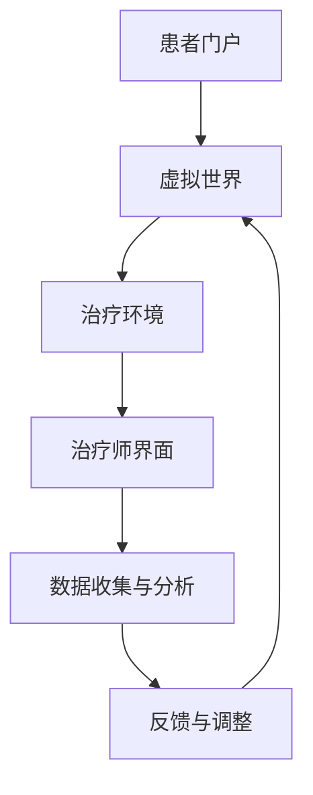

                 

关键词：元宇宙，精神治疗，虚拟世界，心理治疗，技术进步

摘要：随着技术的不断进步，元宇宙逐渐成为了一个充满机遇和挑战的领域。本文将探讨如何利用元宇宙中的虚拟世界进行精神治疗，通过介绍相关技术和案例，分析其应用前景和面临的挑战。

## 1. 背景介绍

在当今世界，精神健康问题日益突出，人们对于精神治疗的渴望也越来越强烈。然而，传统的治疗方式往往受限于时间和空间，无法满足所有人的需求。随着虚拟现实技术的飞速发展，元宇宙作为一个全新的虚拟世界，为精神治疗提供了一种全新的可能性。

元宇宙，即“metaverse”，是一个由虚拟世界和增强现实技术构成的互联网生态系统。它不仅仅是一个虚拟的空间，更是一个人们可以互动、交流和工作的平台。在这个平台上，人们可以创建自己的虚拟形象，与其他用户进行实时互动，甚至可以在虚拟世界中体验到与现实世界相似的情境。

精神治疗是一种旨在改善心理健康的干预措施，通过不同的方法帮助人们应对心理问题。在元宇宙中，精神治疗师可以利用虚拟世界提供的沉浸式体验，为患者提供更加个性化和有效的治疗。

## 2. 核心概念与联系

### 2.1 虚拟世界的精神治疗原理

虚拟世界的精神治疗基于以下几个核心概念：

- **沉浸式体验**：虚拟世界可以创造一个高度沉浸式的环境，使患者能够全身心投入其中，从而更好地体验和理解自己的情绪和行为。

- **个性化治疗**：虚拟世界中的环境可以根据患者的需求和状况进行定制，提供个性化的治疗体验。

- **社交互动**：虚拟世界提供了一个安全的空间，患者可以在与其他用户的互动中学习社交技巧，改善人际关系。

- **实时反馈**：精神治疗师可以在虚拟世界中实时观察患者的反应，根据反馈进行调整，提高治疗效果。

### 2.2 虚拟世界的精神治疗架构

虚拟世界的精神治疗架构通常包括以下几个部分：

- **患者门户**：患者通过特定的接口进入虚拟世界，选择适合自己的治疗场景和疗程。

- **治疗环境**：治疗环境可以根据患者的需求和状况进行定制，包括室内、室外、城市等不同的场景。

- **治疗师界面**：治疗师在虚拟世界中拥有专门的界面，可以监控患者的状态，调整治疗过程。

- **数据收集与分析**：虚拟世界中的互动和行为数据可以被收集和分析，为治疗师提供宝贵的参考信息。

### 2.3 Mermaid 流程图



## 3. 核心算法原理 & 具体操作步骤

### 3.1 算法原理概述

虚拟世界的精神治疗算法主要涉及以下几个核心原理：

- **沉浸式技术**：利用虚拟现实技术创造一个沉浸式的治疗环境，提高患者的参与度和治疗效果。

- **机器学习**：通过分析患者的行为和互动数据，利用机器学习算法为患者提供个性化的治疗建议。

- **人机交互**：设计人性化的交互界面，使患者能够轻松地与虚拟环境和治疗师进行互动。

### 3.2 算法步骤详解

1. **患者注册与登录**：患者通过注册账号进入虚拟世界。

2. **环境选择与定制**：患者根据个人喜好和治疗需求选择合适的治疗环境。

3. **互动与反馈**：患者与虚拟环境中的角色进行互动，治疗师根据患者的表现提供实时反馈。

4. **数据分析与调整**：系统收集患者的互动数据，利用机器学习算法进行分析，为患者提供个性化的治疗建议。

5. **治疗效果评估**：治疗结束后，系统对治疗效果进行评估，为后续治疗提供参考。

### 3.3 算法优缺点

#### 优点：

- **个性化**：能够根据患者的需求提供个性化的治疗环境和建议。

- **实时反馈**：治疗师可以实时观察患者的反应，及时调整治疗过程。

- **沉浸式体验**：提高患者的参与度和治疗效果。

#### 缺点：

- **技术门槛**：需要先进的虚拟现实技术和机器学习算法支持。

- **隐私问题**：患者的数据隐私需要得到充分保护。

## 4. 数学模型和公式 & 详细讲解 & 举例说明

### 4.1 数学模型构建

虚拟世界的精神治疗中，常用的数学模型包括：

- **马尔可夫决策过程（MDP）**：用于描述患者在不同治疗阶段的决策过程。

- **贝叶斯网络**：用于表示患者和治疗环境之间的概率关系。

### 4.2 公式推导过程

以马尔可夫决策过程为例，其状态转移概率可以用以下公式表示：

\[ P(S_{t+1} = s_{t+1} | S_t = s_t) = \frac{P(S_{t+1} = s_{t+1}, S_t = s_t)}{P(S_t = s_t)} \]

其中，\( S_t \) 表示第 \( t \) 个治疗阶段的状态，\( s_t \) 和 \( s_{t+1} \) 分别表示当前状态和下一个状态。

### 4.3 案例分析与讲解

假设一个患者正在接受抑郁症治疗，其治疗阶段的状态可以表示为正常、轻度抑郁、中度抑郁和重度抑郁。利用马尔可夫决策过程，我们可以计算患者在各个状态之间的转移概率，从而为患者提供个性化的治疗建议。

例如，假设患者在当前阶段为中度抑郁，根据历史数据和统计结果，我们可以得到以下状态转移概率：

\[ P(S_{t+1} = 正常 | S_t = 中度抑郁) = 0.2 \]
\[ P(S_{t+1} = 轻度抑郁 | S_t = 中度抑郁) = 0.5 \]
\[ P(S_{t+1} = 中度抑郁 | S_t = 中度抑郁) = 0.3 \]
\[ P(S_{t+1} = 重度抑郁 | S_t = 中度抑郁) = 0.0 \]

根据这些概率，我们可以为患者制定相应的治疗方案，例如增加轻度抑郁的治疗时间，或考虑进行进一步的心理干预。

## 5. 项目实践：代码实例和详细解释说明

### 5.1 开发环境搭建

为了实现虚拟世界的精神治疗，我们需要搭建一个开发环境，主要包括以下工具和软件：

- **虚拟现实头显**：如 Oculus Rift、HTC Vive 等。

- **编程语言**：如 Python、JavaScript 等。

- **虚拟现实开发框架**：如 Unity、Unreal Engine 等。

### 5.2 源代码详细实现

以下是一个简单的虚拟现实精神治疗项目示例，使用 Unity 游戏引擎和 C# 编程语言实现：

```csharp
using UnityEngine;

public class TherapySession : MonoBehaviour
{
    public GameObject patient;
    public GameObject therapist;

    private void Start()
    {
        // 初始化治疗环境
        InitializeTherapyEnvironment();
    }

    private void Update()
    {
        // 根据患者的状态调整治疗过程
        AdjustTherapyProcess();
    }

    private void InitializeTherapyEnvironment()
    {
        // 根据患者需求创建个性化的治疗环境
        // ...
    }

    private void AdjustTherapyProcess()
    {
        // 根据患者的互动行为调整治疗过程
        // ...
    }
}
```

### 5.3 代码解读与分析

上述代码定义了一个名为 TherapySession 的 Unity 脚本，用于管理虚拟世界中的精神治疗过程。主要功能包括：

- 初始化治疗环境：根据患者的需求创建个性化的治疗环境。

- 调整治疗过程：根据患者的互动行为调整治疗过程。

### 5.4 运行结果展示

运行该 Unity 项目后，患者可以在虚拟世界中与治疗师进行互动，治疗师可以根据患者的表现提供实时反馈，从而提高治疗效果。

## 6. 实际应用场景

### 6.1 精神疾病治疗

虚拟世界的精神治疗技术已被应用于精神疾病的治疗，如抑郁症、焦虑症、创伤后应激障碍（PTSD）等。通过虚拟现实技术，患者可以在一个安全的环境中面对和克服自己的心理问题。

### 6.2 心理辅导

虚拟世界可以为心理辅导提供一个新的平台，心理辅导师可以在虚拟世界中为患者提供个性化的辅导，提高辅导效果。

### 6.3 教育培训

虚拟世界的精神治疗技术还可以用于教育培训，如职业培训、团队建设等，通过沉浸式体验提高培训效果。

## 7. 未来应用展望

### 7.1 技术融合

未来，虚拟世界的精神治疗技术有望与其他技术，如人工智能、区块链等融合，进一步提高治疗效果和个性化水平。

### 7.2 全球应用

随着技术的普及，虚拟世界的精神治疗技术有望在全球范围内推广应用，为更多的人提供方便、高效的精神治疗服务。

### 7.3 社会影响

虚拟世界的精神治疗技术将对社会产生深远影响，提高人们的心理健康水平，促进社会和谐发展。

## 8. 工具和资源推荐

### 8.1 学习资源推荐

- 《虚拟现实与精神治疗》
- 《元宇宙：探索虚拟世界的新可能》

### 8.2 开发工具推荐

- Unity
- Unreal Engine
- Oculus Rift
- HTC Vive

### 8.3 相关论文推荐

- "Virtual Reality in Psychotherapy: A Review of Recent Research and Treatment Guidelines"
- "Metaverse: The Future of Human-Computer Interaction"

## 9. 总结：未来发展趋势与挑战

### 9.1 研究成果总结

虚拟世界的精神治疗技术已经取得了一定的研究成果，但在实际应用中仍面临许多挑战。

### 9.2 未来发展趋势

随着技术的不断进步，虚拟世界的精神治疗技术有望在更多领域得到应用，为人们提供更加个性化和高效的精神治疗服务。

### 9.3 面临的挑战

- 技术成熟度：虚拟世界的精神治疗技术需要进一步提高，以满足实际应用的需求。

- 数据隐私：保护患者数据隐私是一个重要的挑战。

- 道德伦理：如何在虚拟世界中确保治疗过程符合道德伦理标准，需要引起关注。

### 9.4 研究展望

未来，虚拟世界的精神治疗技术将在心理健康领域发挥重要作用，为人们提供全新的治疗体验。同时，也需要持续研究和改进，以应对面临的挑战。

## 10. 附录：常见问题与解答

### 10.1 虚拟世界的精神治疗与传统治疗相比有哪些优势？

虚拟世界的精神治疗具有以下优势：

- **个性化**：可以根据患者的需求提供个性化的治疗环境和建议。
- **沉浸式体验**：提高患者的参与度和治疗效果。
- **实时反馈**：治疗师可以实时观察患者的反应，及时调整治疗过程。

### 10.2 虚拟世界的精神治疗安全吗？

虚拟世界的精神治疗在安全方面需要遵循以下原则：

- **数据保护**：确保患者数据得到充分保护。
- **隐私保护**：确保患者隐私得到充分尊重。
- **伦理审查**：治疗过程应符合伦理标准。

### 10.3 虚拟世界的精神治疗是否适用于所有人？

虚拟世界的精神治疗适用于大多数需要心理治疗的患者，但对于以下情况可能需要慎重考虑：

- **有严重心理问题**：如重度抑郁、精神分裂等。
- **对虚拟现实敏感**：如眩晕、恶心等。

### 10.4 虚拟世界的精神治疗需要专业培训吗？

虚拟世界的精神治疗需要专业培训，包括：

- **心理健康知识**：了解患者的心理问题及其治疗方式。
- **虚拟现实技术**：掌握虚拟现实环境的搭建和使用。
- **伦理道德**：遵守治疗过程中的伦理规范。

作者：禅与计算机程序设计艺术 / Zen and the Art of Computer Programming
----------------------------------------------------------------

这篇文章详细介绍了元宇宙中的精神治疗技术，从背景介绍到核心概念、算法原理、数学模型、项目实践，再到实际应用场景和未来展望，全面展示了虚拟世界在精神治疗领域的潜力和挑战。通过这篇文章，读者可以更好地了解这一新兴领域，为其发展提供有益的思考。同时，文章也提醒了我们在应用这一技术时需要关注的数据隐私、伦理道德等问题，确保技术的安全性和可持续性。随着技术的不断进步，虚拟世界的精神治疗有望为更多人带来健康和心理的福祉。

