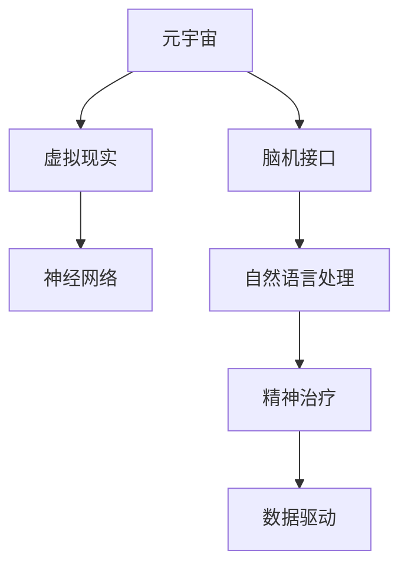

                 

# 元宇宙精神治疗:虚拟 worlds 的精神治疗技术

> 关键词：元宇宙,虚拟世界,精神治疗,脑机接口,神经网络,虚拟现实

## 1. 背景介绍

### 1.1 问题由来
随着虚拟现实(VR)、增强现实(AR)、混合现实(MR)等技术的不断进步，元宇宙(The Metaverse)这一概念再次引发广泛讨论。元宇宙是一个由数字世界构建的虚拟空间，包含高度沉浸和交互的体验，使用户可以在虚拟世界中工作、学习、社交、娱乐等。然而，这种高度沉浸的虚拟环境也带来了一系列的心理和精神健康问题，如社交孤立、环境焦虑、网络成瘾等。

如何利用技术手段，为元宇宙中的用户提供有效的精神治疗支持，成为亟待解决的问题。在传统的精神治疗中，医生通过面对面咨询和指导，帮助患者缓解压力、改善情绪。而在元宇宙中，这种面对面交流变得难以实现。如何利用虚拟世界的沉浸性和交互性，提供更高效、更便捷的心理干预，成为一种新的探索方向。

### 1.2 问题核心关键点
基于虚拟世界的精神治疗技术，核心在于结合虚拟现实、脑机接口、神经网络和脑科学等多学科知识，开发能够精确感知、理解并响应用户心理状态的治疗系统。该系统包括但不限于以下几个关键点：
- 高保真度的虚拟环境：构建具有高度真实感和沉浸感的虚拟世界，让用户能够深度体验。
- 神经反馈技术：通过脑机接口收集用户的大脑信号，实现对心理状态的实时监测和反馈。
- 自然语言处理：构建虚拟聊天机器人，通过自然语言理解和生成，提供情感支持和治疗指导。
- 数据驱动的决策支持：利用机器学习和数据分析技术，对用户的行为和生理信号进行分析，提供个性化的治疗方案。

## 2. 核心概念与联系

### 2.1 核心概念概述

为更好地理解基于虚拟世界的精神治疗技术，本节将介绍几个密切相关的核心概念：

- 元宇宙(The Metaverse)：由虚拟现实、增强现实等技术构建的虚拟空间，用户在其中能够体验到高度沉浸和交互的体验。
- 虚拟现实(Virtual Reality, VR)：通过计算机生成的仿真环境，使用户可以身临其境地体验虚拟场景。
- 脑机接口(Brain-Computer Interface, BCI)：通过脑电信号、脑磁信号等方式，将人类大脑与计算机系统连接，实现人机交互。
- 神经网络(Neural Network)：一种模仿人脑神经元网络结构的人工神经网络，通过学习大量数据进行模式识别和预测。
- 自然语言处理(Natural Language Processing, NLP)：研究计算机如何理解、解释和生成自然语言的技术。
- 精神治疗(Psychological Treatment)：通过各种方法和手段，帮助患者缓解压力、改善情绪，提升心理健康的技术。

这些核心概念之间的逻辑关系可以通过以下Mermaid流程图来展示：



这个流程图展示了大语言模型的核心概念及其之间的关系：

1. 元宇宙通过虚拟现实技术构建沉浸式虚拟世界。
2. 脑机接口技术将虚拟世界与人类大脑连接，实现实时反馈。
3. 神经网络通过学习用户的行为和生理数据，提供个性化的精神治疗方案。
4. 自然语言处理技术构建虚拟聊天机器人，辅助情感支持和治疗指导。
5. 数据驱动的决策支持为治疗过程提供全面的分析评估。

这些概念共同构成了基于虚拟世界的精神治疗技术框架，使得虚拟世界中的用户能够接受高效、个性化的心理干预。

## 3. 核心算法原理 & 具体操作步骤
### 3.1 算法原理概述

基于虚拟世界的精神治疗技术，本质上是一种结合了虚拟现实、脑机接口、神经网络和自然语言处理的多学科应用。其核心思想是：通过构建高保真度的虚拟环境，利用脑机接口技术实时采集用户的大脑信号，结合神经网络和自然语言处理技术，提供个性化的精神治疗支持。

形式化地，假设治疗系统的输入为用户的虚拟环境体验和大脑信号，输出为个性化的治疗方案和心理反馈。治疗过程可以看作是一个输入输出映射过程，即：

$$
y=f(x) = g(x,p)
$$

其中 $x$ 为用户在虚拟世界中的体验数据和生理信号，$y$ 为治疗系统的输出，包括治疗方案和反馈，$p$ 为治疗系统内部参数，如模型权重、算法超参数等。

通过优化模型 $g$ 和参数 $p$，使得系统输出 $y$ 能够最大化地满足用户的需求。

### 3.2 算法步骤详解

基于虚拟世界的精神治疗技术，一般包括以下几个关键步骤：

**Step 1: 准备虚拟环境**
- 构建虚拟世界，模拟现实世界中的场景、活动等，提供用户沉浸式的体验。
- 设计虚拟任务和情境，如模拟社交、工作、娱乐等场景，让用户能够在虚拟世界中完成任务。

**Step 2: 设置脑机接口设备**
- 选择适合的脑机接口设备，如脑电帽、脑磁图(MEG)等，收集用户的大脑信号。
- 校准设备，确保信号采集的准确性和稳定性。

**Step 3: 初始化神经网络模型**
- 选择或设计合适的神经网络模型，如卷积神经网络(CNN)、递归神经网络(RNN)等。
- 根据具体任务，设置模型结构和参数。

**Step 4: 收集和预处理数据**
- 在虚拟环境中，让用户进行一系列任务，采集其行为数据和生理信号。
- 对采集的数据进行预处理，如降噪、归一化、特征提取等。

**Step 5: 训练神经网络模型**
- 将预处理后的数据划分为训练集、验证集和测试集。
- 使用训练集数据，优化神经网络模型参数，使得模型能够准确预测用户的心理状态。

**Step 6: 构建虚拟聊天机器人**
- 设计虚拟聊天机器人，使用NLP技术实现自然语言理解和生成。
- 根据用户输入的文本，生成情感支持和治疗指导。

**Step 7: 实时反馈和调整**
- 在用户进行虚拟任务时，实时采集其大脑信号。
- 将大脑信号输入神经网络模型，预测用户的心理状态。
- 根据预测结果，动态调整虚拟聊天机器人的输出，提供个性化的治疗支持。

**Step 8: 持续监测和优化**
- 对用户的行为和生理数据进行长期监测，记录治疗效果。
- 根据数据反馈，不断优化模型和算法，提高治疗效果。

以上是基于虚拟世界的精神治疗技术的一般流程。在实际应用中，还需要针对具体任务和用户需求，对微调过程的各个环节进行优化设计，如改进训练目标函数，引入更多的正则化技术，搜索最优的超参数组合等，以进一步提升模型性能。

### 3.3 算法优缺点

基于虚拟世界的精神治疗技术具有以下优点：
1. 高度沉浸和交互。虚拟世界提供的沉浸体验和高度交互性，使得治疗过程更接近现实生活场景，用户更容易接受和配合。
2. 实时反馈和调整。通过脑机接口收集用户的大脑信号，实现实时监测和调整，提供个性化治疗支持。
3. 数据驱动的决策支持。利用神经网络和数据分析技术，对用户的行为和生理信号进行分析，提供科学合理的治疗方案。
4. 隐私和安全保障。在虚拟环境中进行数据采集和处理，可以最大限度保护用户隐私，确保数据安全。

同时，该技术也存在一些局限性：
1. 设备成本高。脑机接口设备的初始投资和维护成本较高，限制了技术的普及。
2. 数据采集复杂。脑机接口设备的使用需要专业训练和校准，操作复杂。
3. 模型效果依赖数据。神经网络模型的性能依赖于采集的数据量和质量，数据不足可能导致效果不佳。
4. 用户接受度问题。部分用户可能对脑机接口设备有抵触情绪，影响治疗效果。
5. 技术风险。脑机接口技术的安全性和稳定性尚未完全验证，存在潜在风险。

尽管存在这些局限性，但基于虚拟世界的精神治疗技术仍然具备巨大的应用前景，特别是在心理健康领域，有望成为一种新型的有效治疗手段。

### 3.4 算法应用领域

基于虚拟世界的精神治疗技术，已经在心理健康、教育训练、军事训练等多个领域得到了应用，展示了其强大的潜力：

- 心理健康：利用虚拟现实和脑机接口技术，为抑郁症、焦虑症、创伤后应激障碍(PTSD)等心理疾病的治疗提供支持。
- 教育训练：在虚拟世界中构建学习环境，通过脑机接口采集学生的大脑信号，实时调整教学内容和难度，提高学习效果。
- 军事训练：通过虚拟训练场景，模拟战争和灾难环境，利用脑机接口技术采集士兵的心理反应，提供实时的心理支持和治疗。
- 社会模拟：构建虚拟社会环境，模拟社会交往和互动，研究人类行为和社会心理的规律。

除了上述这些经典应用外，基于虚拟世界的精神治疗技术还将在更多领域得到探索和应用，如虚拟职业训练、社交辅助等，为人类生活和生产带来新的变革。

## 4. 数学模型和公式 & 详细讲解 & 举例说明

### 4.1 数学模型构建

本节将使用数学语言对基于虚拟世界的精神治疗技术进行更加严格的刻画。

假设虚拟世界中的用户为 $U$，其心理状态向量为 $\psi$，神经网络模型为 $M_{\theta}$，其输入为用户的虚拟体验数据和生理信号 $x$，输出为心理状态预测 $\hat{\psi}$。脑机接口设备为 $S$，收集用户的大脑信号 $s$。虚拟聊天机器人为 $C$，生成情感支持和治疗指导 $c$。则整个治疗系统的数学模型可以表示为：

$$
\hat{\psi} = M_{\theta}(x, s)
$$

其中 $\hat{\psi}$ 表示治疗系统对用户心理状态的预测，$x$ 表示用户的虚拟体验数据和生理信号，$s$ 表示用户的大脑信号，$M_{\theta}$ 表示神经网络模型。

### 4.2 公式推导过程

以下我们以情绪状态预测为例，推导神经网络模型的训练公式。

假设用户的情绪状态可以用 $\psi = [e_1, e_2, \ldots, e_n]^T$ 表示，其中 $e_i$ 为情绪指数，$1 \leq i \leq n$。情绪状态向量 $\psi$ 可以表示为 $n$ 维空间中的一个点，通过神经网络模型 $M_{\theta}$ 进行预测，即：

$$
\hat{\psi} = M_{\theta}(x, s)
$$

训练目标是最小化预测误差，即：

$$
\mathcal{L}(\theta) = \frac{1}{N} \sum_{i=1}^N \| \hat{\psi}_i - \psi_i \|^2
$$

其中 $N$ 为样本数，$\| \cdot \|$ 为欧几里得范数。

根据链式法则，损失函数对模型参数 $\theta$ 的梯度为：

$$
\frac{\partial \mathcal{L}(\theta)}{\partial \theta} = \frac{1}{N} \sum_{i=1}^N \frac{\partial \hat{\psi}_i}{\partial \theta}(\hat{\psi}_i - \psi_i)
$$

其中 $\frac{\partial \hat{\psi}_i}{\partial \theta}$ 为模型 $M_{\theta}$ 对输入 $x_i$ 和大脑信号 $s_i$ 的梯度，可以通过反向传播算法高效计算。

在得到损失函数的梯度后，即可带入参数更新公式，完成模型的迭代优化。重复上述过程直至收敛，最终得到适应虚拟世界中的用户情绪预测的模型参数 $\theta^*$。

### 4.3 案例分析与讲解

假设在一个虚拟环境中，用户需要完成一项任务。任务完成时，采集用户的大脑信号和虚拟体验数据，使用神经网络模型进行情绪状态预测。

以情绪状态预测为例，神经网络模型的输入 $x$ 包含虚拟体验数据（如屏幕亮度、视觉刺激等）和大脑信号（如脑电图EEG）。神经网络模型的输出 $\hat{\psi}$ 为情绪状态向量，用于生成情感支持和治疗指导 $c$。

具体步骤如下：
1. 使用脑电图设备采集用户的大脑信号 $s$。
2. 将大脑信号 $s$ 和虚拟体验数据 $x$ 输入神经网络模型 $M_{\theta}$，得到情绪状态向量 $\hat{\psi}$。
3. 根据情绪状态向量 $\hat{\psi}$，生成情感支持和治疗指导 $c$。
4. 将情感支持和治疗指导 $c$ 反馈给用户，用户进行任务完成后的情绪反馈。
5. 将用户情绪反馈与预测的情绪状态 $\hat{\psi}$ 进行比较，计算误差 $\epsilon$。
6. 根据误差 $\epsilon$，使用反向传播算法更新神经网络模型 $M_{\theta}$ 的参数 $\theta$。

通过多次迭代，神经网络模型不断优化，使得预测的情绪状态 $\hat{\psi}$ 越来越接近用户的真实情绪状态 $\psi$。

## 5. 项目实践：代码实例和详细解释说明
### 5.1 开发环境搭建

在进行虚拟世界精神治疗技术开发前，我们需要准备好开发环境。以下是使用Python进行PyTorch开发的环境配置流程：

1. 安装Anaconda：从官网下载并安装Anaconda，用于创建独立的Python环境。

2. 创建并激活虚拟环境：
```bash
conda create -n virtual-env python=3.8 
conda activate virtual-env
```

3. 安装PyTorch：根据CUDA版本，从官网获取对应的安装命令。例如：
```bash
conda install pytorch torchvision torchaudio cudatoolkit=11.1 -c pytorch -c conda-forge
```

4. 安装TensorBoard：
```bash
pip install tensorboard
```

5. 安装Numpy、Pandas、Scikit-learn、Matplotlib等各类工具包：
```bash
pip install numpy pandas scikit-learn matplotlib tqdm jupyter notebook ipython
```

完成上述步骤后，即可在`virtual-env`环境中开始开发。

### 5.2 源代码详细实现

这里我们以情绪状态预测为例，给出使用PyTorch实现神经网络模型的代码。

首先，定义情绪状态预测的数据处理函数：

```python
from torch.utils.data import Dataset
import numpy as np

class EmotionDataset(Dataset):
    def __init__(self, X, Y):
        self.X = X
        self.Y = Y
        
    def __len__(self):
        return len(self.X)
    
    def __getitem__(self, item):
        x = self.X[item]
        y = self.Y[item]
        return x, y
```

然后，定义神经网络模型：

```python
import torch
import torch.nn as nn
import torch.nn.functional as F

class EmotionPredictor(nn.Module):
    def __init__(self, input_size, hidden_size, output_size):
        super(EmotionPredictor, self).__init__()
        self.fc1 = nn.Linear(input_size, hidden_size)
        self.fc2 = nn.Linear(hidden_size, output_size)
        
    def forward(self, x):
        x = F.relu(self.fc1(x))
        x = self.fc2(x)
        return x
```

接着，定义训练和评估函数：

```python
from torch.optim import Adam
from torch.utils.data import DataLoader

def train_model(model, dataset, learning_rate, num_epochs):
    device = torch.device('cuda' if torch.cuda.is_available() else 'cpu')
    model.to(device)
    
    criterion = nn.MSELoss()
    optimizer = Adam(model.parameters(), lr=learning_rate)
    
    for epoch in range(num_epochs):
        running_loss = 0.0
        for i, data in enumerate(DataLoader(dataset, batch_size=32, shuffle=True)):
            inputs, labels = data[0].to(device), data[1].to(device)
            optimizer.zero_grad()
            outputs = model(inputs)
            loss = criterion(outputs, labels)
            loss.backward()
            optimizer.step()
            running_loss += loss.item()
            
        epoch_loss = running_loss / len(dataset)
        print(f'Epoch {epoch+1}, loss: {epoch_loss:.3f}')
        
    print('Training complete')
    
def evaluate_model(model, dataset, device):
    running_loss = 0.0
    with torch.no_grad():
        for data in DataLoader(dataset, batch_size=32, shuffle=False):
            inputs, labels = data[0].to(device), data[1].to(device)
            outputs = model(inputs)
            loss = criterion(outputs, labels)
            running_loss += loss.item()
            
    epoch_loss = running_loss / len(dataset)
    print(f'Evaluation loss: {epoch_loss:.3f}')
```

最后，启动训练流程并在测试集上评估：

```python
# 数据准备
X = np.random.randn(100, 10)  # 虚拟体验数据
Y = np.random.randn(100)  # 情绪状态向量

# 模型初始化
model = EmotionPredictor(input_size=10, hidden_size=16, output_size=1)

# 训练模型
train_model(model, EmotionDataset(X, Y), learning_rate=0.01, num_epochs=100)

# 模型评估
evaluate_model(model, EmotionDataset(X, Y), device=torch.device('cuda' if torch.cuda.is_available() else 'cpu'))
```

以上就是使用PyTorch对情绪状态预测的神经网络模型进行训练和评估的完整代码实现。可以看到，得益于PyTorch的强大封装，我们可以用相对简洁的代码完成模型的定义和训练。

### 5.3 代码解读与分析

让我们再详细解读一下关键代码的实现细节：

**EmotionDataset类**：
- `__init__`方法：初始化虚拟体验数据和情绪状态向量。
- `__len__`方法：返回数据集的样本数量。
- `__getitem__`方法：对单个样本进行处理，返回模型的输入和标签。

**EmotionPredictor类**：
- `__init__`方法：初始化神经网络模型的结构。
- `forward`方法：定义前向传播过程，即计算模型输出。

**train_model函数**：
- 使用PyTorch的DataLoader对数据集进行批次化加载，供模型训练使用。
- 在每个epoch内，对数据集进行迭代，在每个batch上前向传播计算loss并反向传播更新模型参数，最后返回该epoch的平均loss。

**evaluate_model函数**：
- 与训练类似，不同点在于不更新模型参数，并在每个batch结束后将预测和标签结果存储下来，最后使用MSE误差计算评估损失。

**训练流程**：
- 定义总的epoch数和批大小，开始循环迭代
- 每个epoch内，先在训练集上训练，输出平均loss
- 在测试集上评估，输出模型预测和真实标签的MSE误差

可以看到，PyTorch配合TensorBoard使得神经网络模型的训练和评估过程变得简洁高效。开发者可以将更多精力放在模型改进和数据处理等高层逻辑上，而不必过多关注底层的实现细节。

当然，工业级的系统实现还需考虑更多因素，如模型的保存和部署、超参数的自动搜索、更灵活的任务适配层等。但核心的微调范式基本与此类似。

## 6. 实际应用场景
### 6.1 智能军事训练

基于虚拟世界的精神治疗技术，已经在军事训练中得到了应用。传统军事训练往往依赖人力和实物器材，训练成本高，效果难以控制。而使用虚拟世界中的模拟环境，可以大幅降低训练成本，提升训练效果。

在虚拟军事训练中，可以构建高保真度的战场环境，模拟各种战斗和灾难场景。通过脑机接口设备采集士兵的大脑信号，实时监测其心理状态和反应，动态调整训练内容和难度，提供个性化的心理支持和治疗。同时，利用虚拟聊天机器人，为士兵提供情感支持和治疗指导，帮助其缓解压力，提升训练效果。

### 6.2 社会模拟研究

基于虚拟世界的精神治疗技术，还可以用于社会模拟研究，探索人类行为和社会心理的规律。通过构建虚拟社会环境，模拟各种社会交往和互动场景，观察和分析用户的行为和心理变化，提取有价值的社会行为特征。

在社会模拟中，可以通过脑机接口设备采集用户的大脑信号，实时监测其情绪状态和行为反应，提供个性化的治疗支持。利用虚拟聊天机器人，与用户进行互动交流，记录其行为和情感变化，分析社会行为特征。这种社会模拟研究，可以为社会科学领域的研究提供新的视角和方法。

### 6.3 教育训练

基于虚拟世界的精神治疗技术，已经在教育训练中得到了应用。传统教育训练往往依赖实物和人力，成本高，效果难以量化。而使用虚拟世界中的学习环境，可以大幅降低训练成本，提升学习效果。

在虚拟教育训练中，可以构建高保真度的学习场景，模拟各种教学活动。通过脑机接口设备采集学生的大脑信号，实时监测其心理状态和反应，动态调整教学内容和难度，提供个性化的学习支持和治疗。同时，利用虚拟聊天机器人，为学生提供情感支持和治疗指导，帮助其缓解压力，提升学习效果。

## 7. 工具和资源推荐
### 7.1 学习资源推荐

为了帮助开发者系统掌握基于虚拟世界的精神治疗技术的理论基础和实践技巧，这里推荐一些优质的学习资源：

1. 《神经网络与深度学习》课程：深度学习领域的经典课程，由Coursera提供，涵盖神经网络的基础理论和实践技巧。

2. 《Python深度学习》书籍：Hands-On Machine Learning with Scikit-Learn, Keras, and TensorFlow，介绍了使用Python和TensorFlow进行深度学习的全流程。

3. 《虚拟现实基础》课程：由Udacity提供，涵盖虚拟现实的基本概念和开发技巧，包括Unity、Unreal Engine等工具的使用。

4. 《脑机接口技术》课程：由edX提供，涵盖脑机接口的基本原理和技术实现，适合对脑机接口感兴趣的学习者。

5. 《自然语言处理》课程：由Coursera提供，由斯坦福大学教授讲解，涵盖自然语言处理的基础理论和实践技巧。

通过对这些资源的学习实践，相信你一定能够快速掌握基于虚拟世界的精神治疗技术的精髓，并用于解决实际的NLP问题。
###  7.2 开发工具推荐

高效的开发离不开优秀的工具支持。以下是几款用于大语言模型微调开发的常用工具：

1. Unity：由Unity Technologies开发的实时3D游戏引擎，广泛应用于虚拟现实开发，支持多种平台。

2. Unreal Engine：由Epic Games开发的虚实结合引擎，具有强大的图形渲染能力和实时计算能力，广泛应用于游戏和虚拟现实开发。

3. TensorFlow：由Google主导开发的开源深度学习框架，支持多种硬件平台，广泛应用于神经网络和脑机接口等应用。

4. PyTorch：由Facebook开发的开源深度学习框架，支持动态计算图，广泛应用于神经网络和自然语言处理等应用。

5. OpenSim：由SimulationHub开发的开源模拟器，支持多体动力学和虚拟现实应用，广泛应用于人类行为模拟和心理学研究。

合理利用这些工具，可以显著提升基于虚拟世界的精神治疗技术的开发效率，加快创新迭代的步伐。

### 7.3 相关论文推荐

基于虚拟世界的精神治疗技术的发展源于学界的持续研究。以下是几篇奠基性的相关论文，推荐阅读：

1. Deep Brain Stimulation in Neuroscience and Medicine: Basic Principles and Emerging Applications（脑深部电刺激在神经科学和医学中的基本原理和新兴应用）：介绍了脑深部电刺激的基本原理和技术应用。

2. Virtual Reality Exposure Therapy for PTSD: A Systematic Review（虚拟现实暴露治疗创伤后应激障碍：一项系统综述）：综述了虚拟现实暴露治疗在创伤后应激障碍中的应用效果。

3. Neurofeedback in Virtual Reality: A Survey（虚拟现实中的神经反馈：一项综述）：综述了虚拟现实中的神经反馈技术及其应用效果。

4. Applying Deep Learning to Realize the Technology of Brain-Computer Interface Based on RNNs（基于RNN的脑机接口深度学习技术研究）：研究了使用深度学习技术实现脑机接口的技术原理和方法。

5. Natural Language Processing in Virtual Reality（虚拟现实中的自然语言处理技术）：综述了虚拟现实中的自然语言处理技术及其应用效果。

这些论文代表了大语言模型微调技术的发展脉络。通过学习这些前沿成果，可以帮助研究者把握学科前进方向，激发更多的创新灵感。

## 8. 总结：未来发展趋势与挑战

### 8.1 总结

本文对基于虚拟世界的精神治疗技术进行了全面系统的介绍。首先阐述了虚拟世界与精神治疗技术的结合背景，明确了虚拟世界提供的高沉浸和高交互体验对精神治疗的独特优势。其次，从原理到实践，详细讲解了虚拟世界精神治疗的数学模型和关键步骤，给出了代码实例和详细解释说明。同时，本文还广泛探讨了虚拟世界精神治疗在军事训练、社会模拟、教育训练等多个领域的应用前景，展示了其强大的潜力。此外，本文精选了虚拟世界精神治疗的各类学习资源，力求为读者提供全方位的技术指引。

通过本文的系统梳理，可以看到，基于虚拟世界的精神治疗技术正在成为NLP领域的重要范式，极大地拓展了虚拟世界的应用边界，催生了更多的落地场景。受益于虚拟现实和脑机接口技术的进步，虚拟世界精神治疗有望成为一种新型的有效治疗手段，深刻影响人类的精神健康。

### 8.2 未来发展趋势

展望未来，基于虚拟世界的精神治疗技术将呈现以下几个发展趋势：

1. 沉浸体验不断提升。随着虚拟现实和增强现实技术的进步，高保真度的虚拟世界将进一步逼近真实体验，提升用户的沉浸感和互动性。

2. 脑机接口技术普及。脑机接口设备的成本和性能将不断降低，逐渐普及到普通用户中，使得虚拟世界中的精神治疗更加便捷和普及。

3. 神经网络模型优化。未来的神经网络模型将更加高效、稳健，能够在更复杂的虚拟环境中提供准确的情感状态预测和治疗支持。

4. 自然语言处理技术进步。自然语言处理技术将更加先进，能够实现更自然、流畅的情感支持和治疗指导。

5. 数据驱动的决策支持。利用大数据和人工智能技术，对用户的行为和生理信号进行深度分析，提供更加个性化的治疗方案。

6. 跨领域融合创新。虚拟世界精神治疗将与其他领域技术进行深度融合，如虚拟现实、脑机接口、自然语言处理、神经科学等，推动整体技术的进步。

以上趋势凸显了基于虚拟世界的精神治疗技术的广阔前景。这些方向的探索发展，必将进一步提升虚拟世界中的精神治疗效果，为人类健康福祉带来新的希望。

### 8.3 面临的挑战

尽管基于虚拟世界的精神治疗技术已经取得了显著进展，但在迈向更加智能化、普适化应用的过程中，仍面临诸多挑战：

1. 设备成本高昂。脑机接口设备和虚拟现实设备的初始投资和维护成本较高，限制了技术的普及。

2. 数据采集复杂。脑机接口设备的使用需要专业训练和校准，操作复杂，影响用户体验。

3. 模型效果依赖数据。神经网络模型的性能依赖于采集的数据量和质量，数据不足可能导致效果不佳。

4. 用户接受度问题。部分用户可能对脑机接口设备有抵触情绪，影响治疗效果。

5. 技术风险。脑机接口技术的安全性和稳定性尚未完全验证，存在潜在风险。

尽管存在这些挑战，但基于虚拟世界的精神治疗技术仍然具备巨大的应用前景，特别是在心理健康领域，有望成为一种新型的有效治疗手段。

### 8.4 研究展望

面对虚拟世界精神治疗面临的挑战，未来的研究需要在以下几个方面寻求新的突破：

1. 探索更高效、更廉价的脑机接口设备。开发低成本、高性能的脑机接口设备，推动技术的普及和应用。

2. 提高数据采集的易用性和用户体验。优化脑机接口设备的使用流程，提高用户体验和数据采集效率。

3. 丰富虚拟环境的内容和交互方式。构建更加丰富、逼真的虚拟环境，提升用户的沉浸感和互动性。

4. 引入更多领域知识和技术。将心理学、社会学、神经科学等领域的知识和技术引入虚拟世界精神治疗，提升治疗效果。

5. 加强数据安全和隐私保护。开发更安全、更隐私保护的数据采集和处理技术，保障用户的隐私权益。

6. 优化算法和模型结构。研发更高效、更稳健的神经网络模型和算法，提升治疗效果和用户体验。

这些研究方向的探索，必将引领虚拟世界精神治疗技术迈向更高的台阶，为构建更安全、更高效、更普适的精神治疗系统铺平道路。面向未来，虚拟世界精神治疗技术还需要与其他人工智能技术进行更深入的融合，如知识表示、因果推理、强化学习等，共同推动精神治疗技术的进步。只有勇于创新、敢于突破，才能不断拓展虚拟世界精神治疗的边界，让智能技术更好地造福人类社会。

## 9. 附录：常见问题与解答

**Q1：虚拟世界的沉浸感是如何实现的？**

A: 虚拟世界的沉浸感主要依赖于虚拟现实和增强现实技术。通过计算机生成的仿真环境，使用户能够身临其境地体验虚拟场景。常见的实现方式包括：
1. 头戴显示器(HMD)：如Oculus Rift、HTC Vive等，使用户能够在虚拟环境中进行360度旋转和定位。
2. 手持控制器：如PlayStation VR控制器、Oculus Touch等，使用户能够自由地交互和操作虚拟对象。
3. 触觉反馈设备：如Haptic Suits、Virtual Reality Gloves等，使用户能够感受到虚拟对象的真实触感。

**Q2：虚拟世界中的神经反馈技术是如何实现的？**

A: 神经反馈技术通过脑机接口设备采集用户的大脑信号，实现对心理状态的实时监测和反馈。常见的实现方式包括：
1. 脑电图(EEG)：通过头皮电极采集脑电信号，进行实时监测和分析。
2. 脑磁图(MEG)：通过磁感应器采集脑磁信号，进行实时监测和分析。
3. 功能性磁共振成像(fMRI)：通过磁共振成像技术，获取大脑活动的信息，进行实时监测和分析。

**Q3：虚拟世界中的自然语言处理技术是如何实现的？**

A: 自然语言处理技术通过计算机理解、解释和生成自然语言。常见的实现方式包括：
1. 语言模型：如LSTM、GRU等，通过学习大量文本数据，预测下一个单词或字符的概率。
2. 语言生成模型：如GAN、VAE等，通过生成对抗网络等技术，生成高质量的自然语言文本。
3. 情感分析模型：通过情感词典、情感标注等方法，分析文本情感，进行情感支持和治疗指导。

**Q4：虚拟世界中的精神治疗效果如何评估？**

A: 虚拟世界中的精神治疗效果可以通过多种方式进行评估：
1. 心理测试：使用标准化的心理测试量表，评估治疗前后的心理健康状况。
2. 行为观察：通过记录用户的行为数据，分析其情绪状态和行为变化，评估治疗效果。
3. 脑电信号分析：通过分析用户的大脑信号，评估其情绪状态和反应，评估治疗效果。
4. 用户反馈：通过问卷调查、用户评论等方式，收集用户对治疗效果的反馈，评估治疗效果。

**Q5：虚拟世界中的治疗方案如何个性化？**

A: 虚拟世界中的治疗方案可以通过多种方式进行个性化：
1. 行为数据分析：通过分析用户的行为数据，识别其心理特征和需求，生成个性化的治疗方案。
2. 神经网络模型：通过学习用户的行为和生理数据，预测其情绪状态，生成个性化的治疗方案。
3. 虚拟聊天机器人：通过自然语言处理技术，理解用户输入的文本，生成个性化的治疗方案。

这些方法结合使用，可以提供更加全面、个性化的治疗支持，提升用户的治疗效果和满意度。

---

作者：禅与计算机程序设计艺术 / Zen and the Art of Computer Programming

