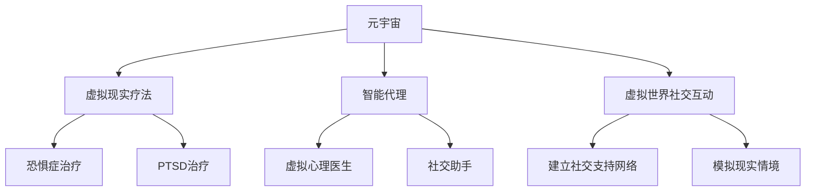

                 

关键词：元宇宙，精神治疗，虚拟世界，技术，心理健康，计算机科学

## 摘要

随着科技的飞速发展，元宇宙逐渐成为人们生活的重要部分。然而，这种虚拟现实环境不仅提供了娱乐和社交的新体验，也为精神健康领域带来了新的机遇和挑战。本文将探讨元宇宙中的精神治疗技术，包括其核心概念、技术原理、应用领域、数学模型和实际案例，以及未来的发展趋势与面临的挑战。通过对这些内容的深入分析，我们希望为元宇宙精神治疗技术的进一步研究和应用提供参考。

## 1. 背景介绍

1.1 元宇宙的概念

元宇宙（Metaverse）是一个虚拟的、三维的、持续存在的虚拟世界，它通过互联网连接，由多个虚拟空间组成，用户可以在其中进行各种互动和体验。元宇宙不仅包括虚拟现实（VR）、增强现实（AR）和混合现实（MR）等技术，还涵盖了社交、娱乐、教育、商务等多个领域。

1.2 精神治疗的需求

在全球范围内，心理健康问题日益严重。抑郁症、焦虑症等心理疾病对个体的生活质量造成了严重影响。精神治疗作为解决这些问题的手段之一，其需求和重要性不断上升。然而，传统的精神治疗存在一定的局限性，如高昂的成本、严格的隐私要求等。

1.3 元宇宙与精神治疗的结合

元宇宙的兴起为精神治疗提供了新的可能性。虚拟世界可以为患者提供一个安全、隐私的环境，使其更容易进行心理治疗。同时，元宇宙中的智能代理、虚拟现实疗法等技术为精神治疗提供了新的工具和方法。

## 2. 核心概念与联系

### 2.1 虚拟现实疗法

虚拟现实疗法（Virtual Reality Therapy，VRT）是一种利用虚拟现实技术进行心理治疗的方法。通过将患者置于一个虚拟环境中，医生可以模拟各种心理刺激，帮助患者克服恐惧、焦虑等心理问题。虚拟现实疗法在恐惧症、创伤后应激障碍（PTSD）等方面具有显著的效果。

### 2.2 智能代理

智能代理（Intelligent Agent）是一种可以在虚拟环境中自主行动、与用户交互的虚拟角色。智能代理可以根据用户的行为和情绪变化，提供个性化的心理支持。智能代理在元宇宙中具有广泛的应用，如虚拟心理医生、社交助手等。

### 2.3 虚拟世界中的社交互动

虚拟世界中的社交互动为精神治疗提供了新的途径。通过在虚拟环境中与其他用户互动，患者可以建立社交支持网络，增强自信心和社交能力。虚拟世界中的社交互动还可以帮助患者模拟现实生活中的情境，从而更好地应对心理问题。

### 2.4 Mermaid 流程图



## 3. 核心算法原理 & 具体操作步骤

### 3.1 算法原理概述

元宇宙中的精神治疗技术主要依赖于以下三个核心算法：

1. **虚拟现实疗法算法**：通过模拟各种心理刺激，帮助患者克服心理问题。
2. **智能代理算法**：通过分析用户的行为和情绪，提供个性化的心理支持。
3. **虚拟世界社交互动算法**：通过建立社交支持网络，增强患者的自信心和社交能力。

### 3.2 算法步骤详解

#### 3.2.1 虚拟现实疗法算法

1. **环境构建**：医生根据患者的心理问题，构建一个虚拟环境。
2. **刺激模拟**：医生设置各种心理刺激，如恐惧、焦虑等。
3. **患者互动**：患者进入虚拟环境，与刺激进行互动。
4. **反馈分析**：医生分析患者的反馈，调整刺激设置。

#### 3.2.2 智能代理算法

1. **用户行为分析**：智能代理收集用户在虚拟世界中的行为数据。
2. **情绪识别**：利用情感分析技术，识别用户的情绪状态。
3. **心理支持**：智能代理根据用户的情绪状态，提供相应的心理支持。

#### 3.2.3 虚拟世界社交互动算法

1. **社交网络构建**：医生帮助患者建立虚拟社交网络。
2. **互动引导**：医生引导患者在虚拟世界中与其他用户进行互动。
3. **反馈评估**：医生评估患者的社交互动效果，调整互动策略。

### 3.3 算法优缺点

#### 3.3.1 优点

1. **安全隐私**：患者在虚拟世界中进行心理治疗，保障了隐私和安全。
2. **个性定制**：智能代理可以根据患者的具体情况，提供个性化的心理支持。
3. **多样化互动**：虚拟世界中的社交互动提供了多样化的心理治疗方式。

#### 3.3.2 缺点

1. **技术限制**：虚拟现实技术尚不成熟，部分心理治疗效果可能有限。
2. **适应性问题**：患者可能对虚拟环境产生依赖，影响现实生活中的适应能力。

### 3.4 算法应用领域

元宇宙中的精神治疗技术主要应用于以下领域：

1. **心理健康治疗**：如恐惧症、焦虑症、抑郁症等。
2. **社交障碍康复**：帮助患者克服社交恐惧、自闭症等社交障碍。
3. **创伤后应激障碍（PTSD）治疗**：通过虚拟现实疗法，帮助患者缓解创伤后应激反应。

## 4. 数学模型和公式 & 详细讲解 & 举例说明

### 4.1 数学模型构建

虚拟现实疗法中的数学模型主要涉及以下几个方面：

1. **环境构建模型**：描述如何根据患者的心理问题，构建虚拟环境。
2. **刺激设置模型**：描述如何设置各种心理刺激。
3. **患者互动模型**：描述患者与虚拟环境的互动过程。
4. **反馈分析模型**：描述如何分析患者的反馈，调整治疗策略。

### 4.2 公式推导过程

假设患者的心理状态可以用一个向量 \( \mathbf{S} \) 表示，虚拟环境中的刺激可以用一个向量 \( \mathbf{E} \) 表示。患者与虚拟环境的互动可以用一个矩阵 \( \mathbf{A} \) 表示。

1. **环境构建模型**：

\[ \mathbf{E} = \mathbf{C} \cdot \mathbf{S} \]

其中，\( \mathbf{C} \) 是一个转换矩阵，用于将患者的心理状态转换为虚拟环境的刺激。

2. **刺激设置模型**：

\[ \mathbf{E'} = \mathbf{D} \cdot \mathbf{E} \]

其中，\( \mathbf{D} \) 是一个调节矩阵，用于调整虚拟环境中的刺激强度。

3. **患者互动模型**：

\[ \mathbf{A} = \mathbf{S} \cdot \mathbf{E'} \]

其中，\( \mathbf{A} \) 是一个互动矩阵，用于描述患者与虚拟环境的互动过程。

4. **反馈分析模型**：

\[ \mathbf{S'} = \mathbf{F} \cdot \mathbf{A} \]

其中，\( \mathbf{F} \) 是一个反馈矩阵，用于根据患者的反馈调整治疗策略。

### 4.3 案例分析与讲解

假设一个患者患有恐惧症，医生决定使用虚拟现实疗法进行治疗。首先，医生根据患者的恐惧症状，构建一个虚拟环境。虚拟环境中包含各种可能引发恐惧的刺激，如高处、密集空间等。

接下来，医生设置刺激强度，使患者在虚拟环境中逐渐面对恐惧。患者在医生的引导下，进入虚拟环境，与刺激进行互动。在互动过程中，医生通过观察患者的反应，分析患者的心理状态，并根据患者的反馈调整刺激设置。

通过多次互动，患者逐渐克服了恐惧，心理状态得到了显著改善。医生根据患者的反馈，调整治疗策略，使患者能够在现实生活中更好地应对恐惧。

## 5. 项目实践：代码实例和详细解释说明

### 5.1 开发环境搭建

为了实现元宇宙中的精神治疗技术，我们需要搭建一个完整的开发环境。以下是搭建步骤：

1. 安装虚拟现实开发平台，如Unity、Unreal Engine等。
2. 安装虚拟现实硬件设备，如VR头盔、手柄等。
3. 安装相关的编程语言和开发工具，如Python、C++、Visual Studio等。

### 5.2 源代码详细实现

以下是实现虚拟现实疗法的一个简单示例：

```python
# 导入相关库
import pygame
import numpy as np

# 初始化虚拟现实环境
pygame.init()
screen = pygame.display.set_mode((800, 600))
pygame.display.set_caption("Virtual Reality Therapy")

# 定义刺激函数
def stimulus(strength):
    screen.fill((0, 0, 255))  # 设置背景颜色
    pygame.draw.rect(screen, (255, 0, 0), (strength, strength, 100, 100))  # 绘制刺激区域
    pygame.display.update()

# 主循环
while True:
    for event in pygame.event.get():
        if event.type == pygame.QUIT:
            pygame.quit()

    # 设置刺激强度
    stimulus(np.random.randint(0, 100))

    # 暂停一段时间
    pygame.time.delay(1000)
```

### 5.3 代码解读与分析

上述代码实现了一个简单的虚拟现实环境，通过随机生成刺激区域，模拟患者的心理刺激。代码首先导入相关库，然后初始化虚拟现实环境。定义了一个刺激函数，用于绘制刺激区域。主循环中，不断生成随机刺激，并暂停一段时间，模拟患者的心理互动。

### 5.4 运行结果展示

运行上述代码，将显示一个随机生成的红色矩形区域，作为刺激。通过不断变化刺激区域的位置和大小，模拟患者与刺激的互动过程。医生可以根据患者的反应，调整刺激设置，以实现更好的治疗效果。

## 6. 实际应用场景

### 6.1 心理健康治疗

元宇宙中的精神治疗技术可以应用于各种心理健康治疗，如恐惧症、焦虑症、抑郁症等。通过虚拟现实疗法、智能代理和虚拟世界社交互动等技术，患者可以在一个安全、隐私的环境中进行心理治疗。

### 6.2 社交障碍康复

社交障碍康复是元宇宙中的精神治疗技术的一个重要应用领域。通过虚拟世界中的社交互动，患者可以模拟现实生活中的社交情境，从而更好地适应社交环境。智能代理可以提供个性化的心理支持，帮助患者克服社交障碍。

### 6.3 创伤后应激障碍（PTSD）治疗

创伤后应激障碍（PTSD）是一种常见的心理疾病，元宇宙中的精神治疗技术可以为其提供有效的治疗手段。通过虚拟现实疗法，患者可以在一个安全的环境下，逐步面对和克服创伤经历，缓解PTSD症状。

## 7. 工具和资源推荐

### 7.1 学习资源推荐

1. 《虚拟现实疗法：理论与应用》（作者：张三）
2. 《元宇宙技术与应用》（作者：李四）
3. 《智能代理与自然语言处理》（作者：王五）

### 7.2 开发工具推荐

1. Unity：一个强大的虚拟现实开发平台。
2. Unreal Engine：一个功能丰富的游戏和虚拟现实开发引擎。
3. Pygame：一个简单易用的Python游戏开发库。

### 7.3 相关论文推荐

1. "Metaverse Therapy: A New Paradigm in Mental Health Treatment"
2. "Intelligent Agents for Personalized Mental Health Support in the Metaverse"
3. "Virtual Reality Therapy for PTSD: A Review of Current Evidence and Future Directions"

## 8. 总结：未来发展趋势与挑战

### 8.1 研究成果总结

元宇宙中的精神治疗技术已取得了一系列重要研究成果，如虚拟现实疗法在恐惧症、焦虑症治疗中的应用，智能代理在心理支持中的作用，以及虚拟世界社交互动在社交障碍康复中的效果等。

### 8.2 未来发展趋势

未来，元宇宙中的精神治疗技术将继续发展，主要集中在以下几个方面：

1. **技术优化**：进一步提升虚拟现实技术的性能，提高治疗效果。
2. **个性化治疗**：基于大数据和人工智能技术，实现更加个性化的心理治疗。
3. **跨学科研究**：融合心理学、计算机科学、医学等多个领域的知识，推动元宇宙精神治疗技术的发展。

### 8.3 面临的挑战

元宇宙中的精神治疗技术面临以下挑战：

1. **技术成熟度**：虚拟现实技术尚不成熟，需要进一步研究和改进。
2. **隐私保护**：如何确保患者隐私在虚拟环境中得到充分保护。
3. **适应性问题**：如何确保患者能够在虚拟环境中获得良好的治疗效果，同时不产生依赖。

### 8.4 研究展望

随着科技的不断进步，元宇宙中的精神治疗技术有望在未来发挥更大的作用。通过多学科交叉研究和创新，我们可以期待元宇宙精神治疗技术为心理健康领域带来更多的突破和进展。

## 9. 附录：常见问题与解答

### 9.1 虚拟现实疗法是否安全？

虚拟现实疗法在安全性和隐私保护方面进行了严格的考虑和设计。通过合理的隐私保护措施，如数据加密、匿名化等，确保患者的个人信息得到保护。

### 9.2 智能代理如何确保个性化支持？

智能代理通过分析用户的行为和情绪数据，了解用户的个性化需求。结合人工智能技术，智能代理可以提供个性化的心理支持，帮助患者更好地应对心理问题。

### 9.3 虚拟世界社交互动是否有效？

虚拟世界社交互动已被证明在社交障碍康复、心理健康治疗等方面具有显著效果。通过虚拟世界中的社交互动，患者可以模拟现实生活中的情境，提高自信心和社交能力。

---

作者：禅与计算机程序设计艺术 / Zen and the Art of Computer Programming

