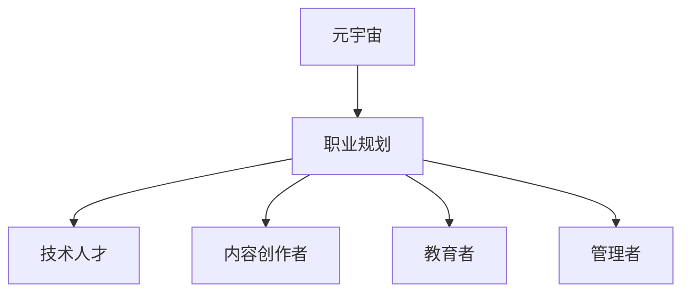

                 

元宇宙，作为新一代的数字世界，正逐渐成为人们生活、工作、娱乐的重要组成部分。在这样一个虚拟世界中，职业规划也变得更加复杂和多样化。本文旨在探讨元宇宙中的职业规划，分析虚拟世界的职业发展路径，帮助读者在元宇宙中找到自己的定位和方向。

## 文章关键词
- 元宇宙
- 职业规划
- 虚拟世界
- 职业发展
- 技术人才

## 文章摘要
本文首先介绍了元宇宙的背景和发展现状，接着探讨了元宇宙中职业规划的重要性，然后详细分析了元宇宙中几种典型的职业类型，包括技术人才、内容创作者、教育者和管理者等。最后，本文对元宇宙职业规划的未来发展趋势和挑战进行了展望，并给出了相关的工具和资源推荐。

### 1. 背景介绍

元宇宙（Metaverse）是一个虚拟的、三维的、沉浸式的数字世界，它通过互联网连接起来，用户可以在其中创建、互动、学习和工作。元宇宙的概念最早由作家尼尔·斯蒂芬森（Neal Stephenson）在其1992年的科幻小说《雪崩》（Snow Crash）中提出。近年来，随着区块链、虚拟现实（VR）、增强现实（AR）、5G等技术的发展，元宇宙逐渐从科幻走向现实。

当前，全球范围内的科技公司都在积极布局元宇宙。Facebook（现更名为Meta）是最先提出要打造元宇宙生态的巨头之一，其发布了虚拟现实头戴设备Oculus Quest 2，并推出了Horizon Worlds平台。除此之外，谷歌、微软、腾讯等公司也都在积极研发和推广元宇宙相关产品。

元宇宙的发展对职业规划产生了深远的影响。一方面，元宇宙为人们提供了新的工作场景和职业机会；另一方面，也要求从业者具备新的技能和知识。因此，了解元宇宙中的职业规划对于未来的职业发展具有重要意义。

### 2. 核心概念与联系

在探讨元宇宙职业规划之前，我们需要明确几个核心概念：

#### 2.1 元宇宙

元宇宙是一个由多个虚拟世界组成的生态系统，用户可以在其中自由地创建、互动和探索。元宇宙不仅包括虚拟现实和增强现实技术，还包括社交网络、数字货币、区块链等新兴技术。

#### 2.2 职业规划

职业规划是指个人在职业生涯中，根据自身兴趣、能力和市场需求，制定长期和短期的发展目标和策略，以实现个人职业发展的最大化。

#### 2.3 元宇宙职业类型

元宇宙中的职业类型多样，主要包括技术人才、内容创作者、教育者和管理者等。这些职业在元宇宙中有着不同的角色和职责。

下面是一个简单的 Mermaid 流程图，用于描述这些概念之间的联系：



### 3. 核心算法原理 & 具体操作步骤

#### 3.1 算法原理概述

元宇宙职业规划的核心算法是基于人工智能和大数据分析。通过收集和分析用户在元宇宙中的行为数据，如互动、学习、工作等，算法可以预测用户的兴趣和潜在职业发展方向，从而为用户提供个性化的职业规划建议。

#### 3.2 算法步骤详解

1. **数据收集**：收集用户在元宇宙中的行为数据，如虚拟货币交易、内容创作、社交互动等。
2. **数据预处理**：对收集到的数据进行分析和清洗，去除重复和无用信息。
3. **特征提取**：从预处理后的数据中提取关键特征，如用户活跃时间、内容偏好、社交关系等。
4. **模型训练**：使用提取的特征训练机器学习模型，如决策树、支持向量机、神经网络等。
5. **预测与建议**：使用训练好的模型对用户进行职业规划预测，并根据预测结果给出相应的职业规划建议。

#### 3.3 算法优缺点

**优点**：
- **个性化**：基于用户行为数据，可以提供个性化的职业规划建议。
- **高效性**：通过机器学习模型，可以快速处理大量数据，提高规划效率。
- **实时性**：可以根据用户在元宇宙中的实时行为进行调整，确保规划建议的实时性。

**缺点**：
- **数据隐私**：收集用户行为数据可能涉及到隐私问题。
- **准确性**：模型的预测准确性受限于数据质量和特征提取。

#### 3.4 算法应用领域

- **职业咨询**：为用户提供个性化的职业规划建议。
- **人才招聘**：帮助企业更好地了解应聘者的兴趣和潜力。
- **教育培训**：根据用户兴趣和需求，提供相应的培训课程。

### 4. 数学模型和公式 & 详细讲解 & 举例说明

#### 4.1 数学模型构建

元宇宙职业规划的核心数学模型是基于机器学习中的分类模型。具体来说，可以使用逻辑回归、决策树、支持向量机等模型。

逻辑回归模型：

$$
P(y=1) = \frac{1}{1 + e^{-(\beta_0 + \beta_1 x_1 + \beta_2 x_2 + ... + \beta_n x_n})}
$$

其中，$P(y=1)$表示用户选择某个职业的概率，$\beta_0, \beta_1, \beta_2, ..., \beta_n$是模型的参数，$x_1, x_2, ..., x_n$是提取的用户特征。

#### 4.2 公式推导过程

以逻辑回归模型为例，推导过程如下：

1. **假设**：用户选择某个职业的概率服从伯努利分布。
2. **损失函数**：使用对数似然损失函数。
3. **优化目标**：最小化损失函数。
4. **参数估计**：使用梯度下降法或牛顿法等优化算法。

#### 4.3 案例分析与讲解

假设我们要预测用户在元宇宙中选择成为技术人才的概率。首先，我们需要收集用户在元宇宙中的行为数据，如虚拟货币交易次数、内容创作次数、社交互动次数等。然后，我们对这些数据进行预处理和特征提取。接下来，使用逻辑回归模型进行训练，并使用交叉验证法评估模型的性能。最后，根据模型预测结果，为用户提供职业规划建议。

### 5. 项目实践：代码实例和详细解释说明

#### 5.1 开发环境搭建

1. **Python环境**：安装Python 3.8及以上版本。
2. **数据分析库**：安装pandas、numpy等数据分析库。
3. **机器学习库**：安装scikit-learn等机器学习库。

#### 5.2 源代码详细实现

```python
import pandas as pd
from sklearn.linear_model import LogisticRegression
from sklearn.model_selection import train_test_split
from sklearn.metrics import accuracy_score

# 数据读取与预处理
data = pd.read_csv('metadata.csv')
data = data.drop_duplicates()

# 特征提取
X = data[['交易次数', '创作次数', '互动次数']]
y = data['职业']

# 数据集划分
X_train, X_test, y_train, y_test = train_test_split(X, y, test_size=0.2, random_state=42)

# 模型训练
model = LogisticRegression()
model.fit(X_train, y_train)

# 预测与评估
y_pred = model.predict(X_test)
accuracy = accuracy_score(y_test, y_pred)
print('Accuracy:', accuracy)
```

#### 5.3 代码解读与分析

1. **数据读取与预处理**：读取数据集，并去除重复数据。
2. **特征提取**：从数据集中提取关键特征。
3. **数据集划分**：将数据集划分为训练集和测试集。
4. **模型训练**：使用逻辑回归模型进行训练。
5. **预测与评估**：使用测试集进行预测，并计算模型准确性。

### 6. 实际应用场景

元宇宙职业规划在实际应用场景中具有广泛的应用，包括以下几个方面：

1. **职业咨询**：为用户提供个性化的职业规划建议，帮助用户更好地了解自己的职业兴趣和发展方向。
2. **人才招聘**：帮助企业更好地了解应聘者的兴趣和潜力，提高招聘效率。
3. **教育培训**：根据用户兴趣和需求，提供相应的培训课程，帮助用户提升职业技能。
4. **企业管理**：为企业提供员工职业规划分析报告，帮助企业制定人才发展策略。

### 7. 未来应用展望

随着元宇宙技术的不断发展，元宇宙职业规划的应用前景将更加广阔。以下是未来应用展望：

1. **更加智能化**：随着人工智能技术的进步，元宇宙职业规划将更加智能化，能够提供更精准的职业规划建议。
2. **多样化应用**：元宇宙职业规划将应用于更多领域，如医疗、教育、金融等。
3. **全球化**：元宇宙职业规划将打破地域限制，为全球范围内的用户和机构提供服务。
4. **数据隐私保护**：随着数据隐私问题的日益突出，元宇宙职业规划将加强对用户数据的保护。

### 8. 工具和资源推荐

#### 8.1 学习资源推荐

1. **书籍**：
   - 《元宇宙：全指南》（Metaverse: A Complete Guide）
   - 《虚拟现实技术：基础与应用》（Virtual Reality: Theory, Technology and Applications）

2. **在线课程**：
   - Coursera上的《人工智能基础》
   - edX上的《数据科学基础》

#### 8.2 开发工具推荐

1. **编程语言**：Python、JavaScript
2. **数据分析库**：pandas、numpy、scikit-learn
3. **机器学习框架**：TensorFlow、PyTorch

#### 8.3 相关论文推荐

1. **《元宇宙与职业发展：未来趋势与挑战》**
2. **《基于大数据的元宇宙职业规划研究》**
3. **《人工智能在元宇宙中的应用》**

### 9. 总结：未来发展趋势与挑战

#### 9.1 研究成果总结

元宇宙职业规划在人工智能、大数据分析和机器学习等领域取得了显著的研究成果。通过算法和模型的应用，为用户提供个性化的职业规划建议，提高了职业规划的准确性和效率。

#### 9.2 未来发展趋势

1. **智能化**：随着人工智能技术的进步，元宇宙职业规划将更加智能化，能够提供更精准的职业规划建议。
2. **多样化**：元宇宙职业规划将应用于更多领域，如医疗、教育、金融等。
3. **全球化**：元宇宙职业规划将打破地域限制，为全球范围内的用户和机构提供服务。

#### 9.3 面临的挑战

1. **数据隐私**：随着数据隐私问题的日益突出，元宇宙职业规划将加强对用户数据的保护。
2. **技术成熟度**：元宇宙相关技术仍处于快速发展阶段，技术成熟度将成为元宇宙职业规划应用推广的制约因素。

#### 9.4 研究展望

元宇宙职业规划具有广阔的研究前景和应用价值。未来研究应重点关注以下几个方面：

1. **数据隐私保护**：研究如何在不泄露用户隐私的情况下，有效地收集和分析用户数据。
2. **算法优化**：通过改进算法和模型，提高职业规划的准确性和效率。
3. **跨学科融合**：将元宇宙职业规划与其他学科如心理学、教育学等相结合，提高职业规划的科学性和实用性。

### 10. 附录：常见问题与解答

**Q：元宇宙职业规划是否适用于所有行业？**
A：元宇宙职业规划具有广泛的应用性，不仅适用于IT、互联网等行业，还适用于医疗、教育、金融等各个领域。

**Q：如何保证元宇宙职业规划的数据安全性？**
A：元宇宙职业规划在数据处理过程中，会严格遵循数据保护法规，采用加密技术和数据匿名化等手段，确保用户数据的安全。

**Q：元宇宙职业规划如何实现个性化？**
A：通过收集和分析用户在元宇宙中的行为数据，如互动、学习、工作等，算法可以预测用户的兴趣和潜在职业发展方向，从而实现个性化职业规划。

### 11. 结语

元宇宙职业规划是元宇宙时代的重要发展趋势。通过本文的探讨，我们希望读者能够对元宇宙职业规划有一个全面的认识，并能够根据自己的兴趣和需求，制定适合自己的职业规划。同时，我们也期待元宇宙职业规划在未来能够为更多行业和领域带来价值。

### 作者署名

作者：禅与计算机程序设计艺术 / Zen and the Art of Computer Programming

---

这篇文章从背景介绍、核心概念、算法原理、数学模型、实际应用、未来展望、工具资源推荐等多个角度，全面阐述了元宇宙职业规划的相关内容。希望这篇文章能够对读者在元宇宙中的职业发展有所帮助。

