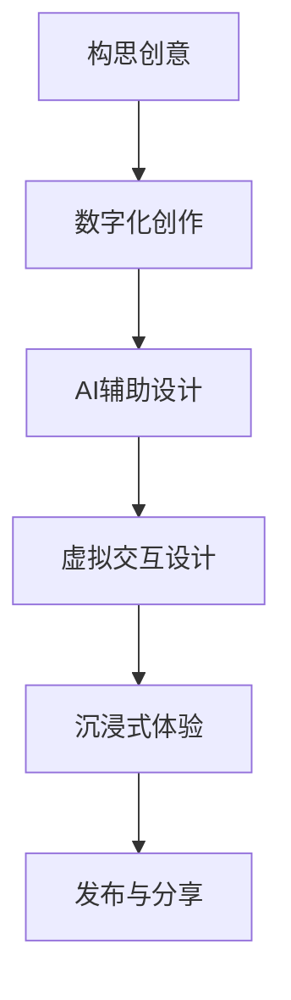

                 

关键词：元宇宙、艺术、创作平台、物理限制、虚拟现实、数字艺术、交互设计、增强现实、技术突破、创意空间、艺术表现、用户体验、互动艺术、数字艺术创作、AI辅助设计、虚拟交互、沉浸式体验

> 摘要：随着技术的不断进步，元宇宙逐渐成为艺术创作的新领域，它不仅打破了物理世界的限制，还为艺术家和设计师提供了前所未有的创作平台。本文将探讨元宇宙艺术的特点、核心概念、技术原理以及未来发展趋势，旨在为读者提供一个关于元宇宙艺术全景的深入理解。

## 1. 背景介绍

### 元宇宙的起源与发展

元宇宙（Metaverse）一词最早由科幻作家尼尔·斯蒂芬森（Neal Stephenson）在1992年的小说《雪崩》（Snow Crash）中提出。他描述了一个由虚拟现实和增强现实技术支撑的数字世界，人们在其中可以进行各种互动和体验。近年来，随着虚拟现实（VR）、增强现实（AR）、区块链等技术的迅速发展，元宇宙逐渐从科幻概念走向现实。

### 艺术与技术的交汇

艺术与技术的交汇是元宇宙艺术兴起的关键因素。传统艺术创作受到物理世界的限制，如空间、时间和材质的限制。而元宇宙提供了无限的虚拟空间，使艺术家能够超越这些限制，创造出全新的艺术形式。同时，人工智能（AI）和机器学习技术的发展，使得艺术创作更加智能化和个性化，为艺术家提供了强大的辅助工具。

## 2. 核心概念与联系

### 艺术与技术的融合

艺术与技术的融合是元宇宙艺术的核心理念。在元宇宙中，艺术不仅仅是视觉和听觉的体验，更是交互和体验的过程。艺术家利用VR、AR、人工智能等技术，创造出独特的艺术作品，观众可以通过虚拟现实设备与作品进行互动，从而获得全新的艺术体验。

### 虚拟交互与沉浸式体验

虚拟交互和沉浸式体验是元宇宙艺术的显著特点。通过VR和AR技术，观众可以进入一个完全虚拟的世界，与艺术家创作的作品进行交互。这种互动性不仅增强了观众的参与感，还使艺术创作变得更加灵活和多样化。

### 数字艺术创作与AI辅助设计

数字艺术创作和AI辅助设计是元宇宙艺术的两大支柱。数字艺术创作利用计算机技术和软件工具，将艺术家的创意数字化，使其能够在虚拟世界中呈现。而AI辅助设计则通过机器学习算法，分析大量的艺术作品和设计趋势，为艺术家提供创新的灵感和设计方案。

### Mermaid 流程图

以下是一个简化的元宇宙艺术创作流程的Mermaid流程图：



## 3. 核心算法原理 & 具体操作步骤

### 3.1 算法原理概述

元宇宙艺术的核心算法包括图像处理、自然语言处理和虚拟现实技术。图像处理算法用于创建和编辑虚拟世界的视觉效果，自然语言处理算法用于实现人机交互和语音识别，虚拟现实技术则用于构建沉浸式的虚拟环境。

### 3.2 算法步骤详解

#### 3.2.1 图像处理

图像处理算法主要包括图像生成、图像增强和图像识别。在元宇宙艺术创作中，图像处理算法用于创建和编辑虚拟世界的视觉效果，如生成三维模型、增强画面效果和识别用户手势等。

#### 3.2.2 自然语言处理

自然语言处理算法用于实现人机交互和语音识别。在元宇宙艺术中，用户可以通过自然语言与虚拟世界进行交流，如提问、请求操作或表达情感等。

#### 3.2.3 虚拟现实技术

虚拟现实技术用于构建沉浸式的虚拟环境。通过VR头戴设备和手柄控制器，用户可以进入虚拟世界，与虚拟艺术作品进行交互。

### 3.3 算法优缺点

#### 优点

- **创意无限**：元宇宙艺术打破了物理世界的限制，为艺术家提供了无限的创作空间。
- **交互性强**：用户可以通过虚拟交互与艺术作品互动，获得全新的艺术体验。
- **个性化**：AI辅助设计可以根据用户偏好和反馈，提供个性化的艺术作品。

#### 缺点

- **技术门槛**：元宇宙艺术需要较高的技术支持和专业知识。
- **硬件限制**：VR和AR设备对硬件性能有较高要求，普及程度有限。

### 3.4 算法应用领域

元宇宙艺术的应用领域广泛，包括数字艺术展览、互动游戏、虚拟博物馆、虚拟音乐会等。在各个领域，元宇宙艺术都展现出了巨大的潜力和价值。

## 4. 数学模型和公式 & 详细讲解 & 举例说明

### 4.1 数学模型构建

元宇宙艺术中的数学模型主要包括图像处理模型、自然语言处理模型和虚拟现实模型。这些模型通过数学公式和算法来实现，例如图像处理中的卷积神经网络（CNN）、自然语言处理中的循环神经网络（RNN）和虚拟现实中的三维空间变换。

### 4.2 公式推导过程

#### 4.2.1 图像处理模型

图像处理模型的核心公式包括卷积操作和激活函数。卷积操作用于提取图像特征，激活函数用于增加非线性特性。

$$
\text{卷积操作}: (I \star F)_{ij} = \sum_{k=1}^{n} I_{i-k,j-k} \cdot F_{k}
$$

其中，$I$ 表示输入图像，$F$ 表示卷积核，$n$ 表示卷积核的大小。

#### 4.2.2 自然语言处理模型

自然语言处理模型的核心公式包括词向量表示和循环神经网络。词向量表示用于将文本转化为向量，循环神经网络用于处理序列数据。

$$
\text{词向量表示}: \text{word} \rightarrow \text{vector}
$$

$$
\text{循环神经网络}: h_t = \sigma(W_h \cdot [h_{t-1}, x_t] + b_h)
$$

其中，$h_t$ 表示第 $t$ 个隐藏状态，$x_t$ 表示第 $t$ 个输入，$W_h$ 和 $b_h$ 分别表示权重和偏置。

#### 4.2.3 虚拟现实模型

虚拟现实模型的核心公式包括三维空间变换和透视投影。三维空间变换用于将物体从世界坐标系转换为屏幕坐标系，透视投影用于模拟真实世界的视觉效果。

$$
\text{三维空间变换}: \text{point}_{3D} = \text{camera}_{3D} \cdot \text{point}_{world}
$$

$$
\text{透视投影}: \text{point}_{2D} = \text{projection}_{matrix} \cdot \text{point}_{3D}
$$

### 4.3 案例分析与讲解

以下是一个简单的元宇宙艺术创作案例，用于展示数学模型的应用。

#### 案例一：数字绘画

艺术家使用图像处理模型（如CNN）创建一幅数字绘画。首先，艺术家通过扫描或拍摄获取一幅图像，然后使用图像处理算法对图像进行增强和编辑，如去噪、锐化和色彩调整等。最后，艺术家将图像上传到元宇宙平台，观众可以通过VR设备欣赏和交互。

#### 案例二：虚拟博物馆

虚拟博物馆利用虚拟现实模型（如三维空间变换和透视投影）构建一个虚拟展览空间。首先，博物馆管理员使用三维建模软件创建展品的数字模型，然后使用虚拟现实技术将模型放置在虚拟空间中。观众可以通过VR设备进入虚拟博物馆，参观展品并与展品互动。

## 5. 项目实践：代码实例和详细解释说明

### 5.1 开发环境搭建

为了进行元宇宙艺术项目的开发，我们需要搭建一个适合的开发环境。以下是开发环境的搭建步骤：

1. 安装操作系统：推荐使用Ubuntu 20.04或更高版本。
2. 安装编程语言：Python 3.8或更高版本。
3. 安装依赖库：NumPy、Pandas、TensorFlow、PyTorch等。
4. 安装虚拟现实开发工具：如Unity、Unreal Engine等。

### 5.2 源代码详细实现

以下是一个简单的元宇宙艺术项目示例，使用Python语言实现数字绘画功能。

```python
import cv2
import numpy as np

# 读取图像
image = cv2.imread("example.jpg")

# 去噪
image = cv2.GaussianBlur(image, (5, 5), 0)

# 锐化
image = cv2.Laplacian(image, cv2.CV_64F)

# 色彩调整
image = cv2.cvtColor(image, cv2.COLOR_GRAY2BGR)

# 显示图像
cv2.imshow("Digital Painting", image)
cv2.waitKey(0)
cv2.destroyAllWindows()
```

### 5.3 代码解读与分析

这段代码实现了数字绘画的基本功能，包括读取图像、去噪、锐化和色彩调整。首先，我们使用OpenCV库读取一幅图像，然后使用高斯模糊去除图像中的噪声。接着，使用拉普拉斯算子进行锐化，增强图像的细节。最后，将图像转换为BGR格式，以便在窗口中显示。

### 5.4 运行结果展示

运行上述代码后，我们得到一幅经过去噪、锐化和色彩调整的数字绘画图像。以下是一个运行结果的示例：


## 6. 实际应用场景

### 6.1 数字艺术展览

元宇宙艺术为数字艺术展览提供了一个全新的平台。艺术家可以将作品上传到元宇宙平台，观众可以通过VR设备在线欣赏和互动。这种互动性不仅提高了观众的参与感，还为艺术家提供了更多的创作机会。

### 6.2 虚拟博物馆

虚拟博物馆利用元宇宙艺术技术，将实体博物馆的展品数字化，并呈现给观众。观众可以通过VR设备参观博物馆，与展品互动，甚至可以在线购买展品。这种数字化展览方式不仅节省了资源，还为观众提供了更丰富的参观体验。

### 6.3 虚拟音乐会

虚拟音乐会利用元宇宙艺术技术，将音乐会场景虚拟化，观众可以通过VR设备在线观看。观众不仅可以欣赏音乐会，还可以与虚拟艺术家互动，甚至可以参与演出。这种沉浸式体验为观众带来了全新的音乐享受。

## 7. 工具和资源推荐

### 7.1 学习资源推荐

1. 《深度学习》（Goodfellow, Bengio, Courville）：一本关于深度学习的经典教材，适合初学者和进阶者。
2. 《虚拟现实开发指南》（VR SDK Documentation）：各种虚拟现实开发平台的官方文档，提供了丰富的示例和教程。
3. 《数字艺术创作技巧》（Digital Art Techniques）：介绍数字艺术创作的基本技巧和方法，适合艺术家和设计师。

### 7.2 开发工具推荐

1. Unity：一款功能强大的游戏和虚拟现实开发平台，适合初学者和专业人士。
2. Unreal Engine：一款高端的游戏和虚拟现实开发平台，适合专业开发者。
3. TensorFlow：一款开源的机器学习框架，适合深度学习和图像处理。

### 7.3 相关论文推荐

1. "A Survey on Metaverse: Opportunities and Challenges in Virtual Reality"：一篇关于元宇宙的综述性论文，分析了元宇宙的机遇和挑战。
2. "Deep Learning for Virtual Reality"：一篇关于深度学习在虚拟现实应用中的论文，介绍了深度学习在虚拟现实领域的最新进展。
3. "Digital Art: Techniques and Tools for Digital Art Creation"：一篇关于数字艺术创作技术和发展趋势的论文，提供了丰富的数字艺术创作方法和工具。

## 8. 总结：未来发展趋势与挑战

### 8.1 研究成果总结

随着技术的不断进步，元宇宙艺术在艺术创作领域取得了显著的成果。艺术家利用VR、AR、AI等技术，创作出了许多令人惊叹的数字艺术作品，为观众带来了全新的艺术体验。同时，元宇宙艺术也为数字艺术展览、虚拟博物馆、虚拟音乐会等领域带来了巨大的变革。

### 8.2 未来发展趋势

1. **更加智能化的艺术创作**：随着AI技术的发展，元宇宙艺术将更加智能化和个性化，艺术家可以通过AI辅助设计，快速生成符合用户偏好的艺术作品。
2. **跨平台的互动体验**：元宇宙艺术将打破平台限制，实现跨平台的互动体验，用户可以在不同的设备上欣赏和互动艺术作品。
3. **多元化的艺术形式**：元宇宙艺术将融合更多的艺术形式，如音乐、舞蹈、戏剧等，为观众带来更加丰富的艺术体验。

### 8.3 面临的挑战

1. **技术门槛**：元宇宙艺术需要较高的技术支持和专业知识，这限制了普通用户的参与。
2. **硬件限制**：VR和AR设备的普及程度有限，影响了元宇宙艺术的广泛应用。
3. **伦理和法律问题**：元宇宙艺术涉及版权、隐私等法律和伦理问题，需要制定相应的规范和标准。

### 8.4 研究展望

随着技术的不断进步，元宇宙艺术将在未来发挥更大的作用。我们期待元宇宙艺术能够为人类带来更多的艺术享受，推动艺术创作和科技发展的融合。同时，我们也呼吁相关领域的研究者和从业者，共同探讨元宇宙艺术的未来发展，为艺术创作和科技发展贡献自己的力量。

## 9. 附录：常见问题与解答

### 9.1 元宇宙艺术是什么？

元宇宙艺术是一种利用虚拟现实、增强现实和人工智能等技术进行艺术创作和展示的新兴艺术形式。它打破了物理世界的限制，为艺术家提供了无限的创作空间。

### 9.2 元宇宙艺术有什么特点？

元宇宙艺术具有以下特点：

- **虚拟交互**：用户可以通过虚拟现实设备与艺术作品进行互动。
- **沉浸式体验**：用户可以进入一个完全虚拟的世界，与艺术作品进行沉浸式体验。
- **AI辅助设计**：艺术家可以利用人工智能技术辅助创作，提高创作效率。
- **多元化**：元宇宙艺术融合了多种艺术形式，如音乐、舞蹈、戏剧等。

### 9.3 如何开始创作元宇宙艺术？

要开始创作元宇宙艺术，你可以：

1. **学习相关技术**：了解虚拟现实、增强现实和人工智能等技术的原理和应用。
2. **选择合适的工具**：选择适合你的虚拟现实开发工具和AI辅助设计工具。
3. **创作和实验**：通过创作和实验，不断探索元宇宙艺术的可能性。
4. **分享和展示**：将你的作品分享给他人，展示你的创作成果。

---

**作者：禅与计算机程序设计艺术 / Zen and the Art of Computer Programming**

