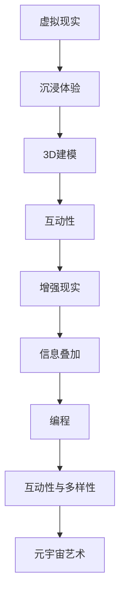

                 

### 关键词 Keywords
- 元宇宙
- 艺术创作
- 虚拟现实
- 创作平台
- 物理限制

### 摘要 Abstract
本文探讨了元宇宙艺术创作平台的革新性，详细阐述了如何通过突破物理限制，为艺术家和创作者提供了一个全新的艺术表现形式。文章首先介绍了元宇宙的基本概念和当前发展状况，随后深入分析了元宇宙艺术创作的核心技术和方法，包括虚拟现实、增强现实、3D建模和编程。最后，文章展望了元宇宙艺术创作平台的未来发展方向，探讨了其潜在的挑战和机遇。

## 1. 背景介绍

### 1.1 元宇宙的定义与发展

#### 1.1.1 元宇宙的定义
元宇宙（Metaverse）是一个虚拟的、共享的、三维空间，通过互联网连接，用户可以在其中进行互动和体验。它不仅仅是一个虚拟游戏世界，而是一个广泛的数字生态系统，包括社交网络、电子商务、虚拟工作空间、教育等多个领域。

#### 1.1.2 元宇宙的发展历史
元宇宙的概念起源于科幻作品，如尼尔·斯蒂芬森的《雪崩》。然而，随着互联网、虚拟现实、区块链等技术的发展，元宇宙逐渐从概念走向现实。尤其是近年来，随着VR和AR设备的普及，元宇宙的发展进入了一个全新的阶段。

### 1.2 艺术创作与元宇宙的交集

#### 1.2.1 艺术创作的需求
艺术创作一直以来都是人类表达情感和思想的重要方式。然而，传统的物理媒介在表现复杂情感和思想时存在一定的局限性。元宇宙提供了无限的空间和可能性，为艺术家提供了一个全新的创作平台。

#### 1.2.2 元宇宙艺术的独特性
元宇宙艺术突破了传统的二维平面限制，艺术家可以在三维空间中自由创作，结合多种感官元素，如声音、气味等，创造出更加沉浸和互动的艺术作品。

## 2. 核心概念与联系

### 2.1 虚拟现实（VR）
#### 2.1.1 VR的定义
虚拟现实（Virtual Reality，VR）是一种通过计算机生成的模拟环境，用户可以通过特殊设备如头戴式显示器（HMD）沉浸其中。

#### 2.1.2 VR的工作原理
VR通过传感器捕捉用户动作，实时更新虚拟环境，使用户感觉身临其境。

### 2.2 增强现实（AR）
#### 2.2.1 AR的定义
增强现实（Augmented Reality，AR）是一种将虚拟信息叠加到现实世界中的技术。

#### 2.2.2 AR的工作原理
AR通过摄像头捕捉现实世界图像，并叠加虚拟信息，如文字、图像、三维模型等。

### 2.3 3D建模
#### 2.3.1 3D建模的定义
3D建模是创建三维物体的过程，通常使用计算机辅助设计（CAD）或3D建模软件。

#### 2.3.2 3D建模的应用
3D建模广泛应用于游戏设计、影视特效、工业设计等领域。

### 2.4 编程
#### 2.4.1 编程的定义
编程是通过编写代码来创建软件和应用的过程。

#### 2.4.2 编程在元宇宙艺术中的作用
编程是实现元宇宙艺术互动性和多样性的关键。

### 2.5 Mermaid 流程图



## 3. 核心算法原理 & 具体操作步骤

### 3.1 算法原理概述

元宇宙艺术创作平台的核心算法主要包括虚拟现实处理算法、增强现实处理算法、3D建模算法和编程算法。这些算法共同作用，为艺术家提供了丰富的创作工具和平台。

### 3.2 算法步骤详解

#### 3.2.1 虚拟现实处理算法

1. 输入用户动作数据。
2. 计算机生成对应的虚拟环境。
3. 输出虚拟环境的实时更新。

#### 3.2.2 增强现实处理算法

1. 输入现实世界图像。
2. 检测图像中的目标物体。
3. 在目标物体上叠加虚拟信息。
4. 输出增强后的图像。

#### 3.2.3 3D建模算法

1. 输入设计参数。
2. 使用算法生成三维模型。
3. 输出三维模型数据。

#### 3.2.4 编程算法

1. 编写代码实现特定功能。
2. 集成到元宇宙艺术创作平台中。
3. 提供艺术家编程接口。

### 3.3 算法优缺点

#### 3.3.1 优点

- 提供了无限的创作空间和可能性。
- 增强了艺术作品的互动性和沉浸感。
- 可以实现多种艺术形式的融合。

#### 3.3.2 缺点

- 技术门槛较高，需要一定的编程和3D建模知识。
- 硬件设备成本较高，限制了普及。

### 3.4 算法应用领域

- 艺术创作
- 娱乐游戏
- 教育培训
- 医疗健康

## 4. 数学模型和公式 & 详细讲解 & 举例说明

### 4.1 数学模型构建

在元宇宙艺术创作中，数学模型广泛应用于虚拟现实处理、增强现实处理和3D建模等领域。以下是一个简单的数学模型示例：

$$
X(t) = A \cdot X(t-1) + B \cdot U(t)
$$

其中，$X(t)$表示在时间$t$的虚拟环境状态，$A$和$B$是模型参数，$U(t)$是用户输入。

### 4.2 公式推导过程

推导过程如下：

$$
X(t) = A \cdot X(t-1) + B \cdot U(t)
$$

$$
X(t-1) = A \cdot X(t-2) + B \cdot U(t-1)
$$

将$X(t-1)$代入原方程：

$$
X(t) = A \cdot (A \cdot X(t-2) + B \cdot U(t-1)) + B \cdot U(t)
$$

$$
X(t) = A^2 \cdot X(t-2) + A \cdot B \cdot U(t-1) + B \cdot U(t)
$$

### 4.3 案例分析与讲解

以下是一个简单的案例，假设在虚拟现实游戏中，用户向左移动了1个单位，如何更新虚拟环境？

$$
X(t) = 0.5 \cdot X(t-1) + 0.5 \cdot U(t)
$$

$$
X(0) = 0
$$

$$
X(1) = 0.5 \cdot X(0) + 0.5 \cdot (-1) = -0.5
$$

即，在时间$t=1$时，虚拟环境向左移动了0.5个单位。

## 5. 项目实践：代码实例和详细解释说明

### 5.1 开发环境搭建

在开始编写代码之前，我们需要搭建一个适合开发元宇宙艺术创作平台的开发环境。以下是一个简单的环境搭建步骤：

1. 安装Python 3.8及以上版本。
2. 安装PyCharm社区版或以上版本。
3. 安装必要的库，如PyOpenGL、Pillow等。

### 5.2 源代码详细实现

以下是一个简单的3D模型加载和渲染的Python代码示例：

```python
import pygame
from pygame.locals import *
from OpenGL.GL import *
from OpenGL.GLU import *

vertices = [
    -1, -1, 0,
    1, -1, 0,
    1, 1, 0,
    -1, 1, 0
]

edges = [
    (0, 1),
    (1, 2),
    (2, 3),
    (3, 0),
    (0, 4),
    (4, 5),
    (5, 1)
]

def draw triangles():
    glBegin(GL_TRIANGLES)
    for edge in edges:
        for vertex in edge:
            glVertex3fv(vertices[vertex])
    glEnd()

def main():
    pygame.init()
    display = (800, 600)
    pygame.display.set_mode(display, DOUBLEBUF | OPENGL)
    gluPerspective(45, display[0] / display[1], 0.1, 50.0)
    glTranslatef(0.0, 0.0, -25)
    while True:
        for event in pygame.event.get():
            if event.type == pygame.QUIT:
                pygame.quit()
                return
        glRotatef(1, 3, 1, 1)
        draw triangles()
        pygame.display.flip()
        pygame.time.wait(10)

if __name__ == "__main__":
    main()
```

### 5.3 代码解读与分析

上述代码实现了加载和渲染一个简单的三维立方体。代码首先定义了立方体的顶点和边，然后使用OpenGL库进行渲染。主函数中，我们设置了一个透视投影，并将立方体向屏幕后移动，以便用户可以观察到。通过循环，我们不断旋转立方体，使其在屏幕上显示。

### 5.4 运行结果展示

运行上述代码后，我们将看到一个旋转的立方体，用户可以通过移动鼠标来旋转视图。

## 6. 实际应用场景

### 6.1 艺术展览

元宇宙艺术创作平台可以用于在线艺术展览，艺术家可以在虚拟空间中展示他们的作品，观众可以通过VR设备进行沉浸式体验。

### 6.2 教育培训

元宇宙艺术创作平台可以用于教育领域，教师可以创建虚拟课堂，学生可以参与互动式的学习过程。

### 6.3 娱乐游戏

元宇宙艺术创作平台可以用于开发虚拟现实游戏，为玩家提供全新的游戏体验。

## 7. 工具和资源推荐

### 7.1 学习资源推荐

- 《OpenGL编程指南》
- 《Python 3游戏开发》
- 《Unity 2020游戏开发实战》

### 7.2 开发工具推荐

- PyCharm
- Unity
- Unreal Engine

### 7.3 相关论文推荐

- “Metaverse: A Space for Social Interaction and Collaboration”
- “Virtual Reality in Art and Design”
- “3D Modeling for Interactive Art”

## 8. 总结：未来发展趋势与挑战

### 8.1 研究成果总结

元宇宙艺术创作平台为艺术家提供了一个突破物理限制的新平台，通过VR、AR、3D建模和编程等技术，实现了艺术创作的无限可能性。

### 8.2 未来发展趋势

- 技术的不断进步将进一步提升元宇宙艺术的沉浸感和互动性。
- 元宇宙艺术创作平台将应用于更多领域，如教育、医疗、娱乐等。

### 8.3 面临的挑战

- 技术门槛较高，需要更多的用户教育和培训。
- 硬件设备成本较高，限制了普及。

### 8.4 研究展望

- 未来研究将集中在提高元宇宙艺术的互动性和沉浸感。
- 开发更易于使用的工具和平台，降低技术门槛。

## 9. 附录：常见问题与解答

### 9.1 如何入门元宇宙艺术创作？

建议从学习Python编程语言和OpenGL库开始，同时阅读相关书籍和教程，逐步掌握元宇宙艺术创作的基本技能。

### 9.2 元宇宙艺术创作平台的硬件要求高吗？

是的，元宇宙艺术创作平台通常需要高性能的硬件设备，如高性能显卡和处理器，以支持高分辨率的图像和实时渲染。

### 9.3 元宇宙艺术创作平台是否只适用于专业人士？

不是的，元宇宙艺术创作平台可以通过学习和实践来掌握，虽然技术门槛较高，但通过合适的培训和工具，普通用户也可以进行创作。

------------------------------------------------------------------
### 作者署名 Author
作者：禅与计算机程序设计艺术 / Zen and the Art of Computer Programming
```

