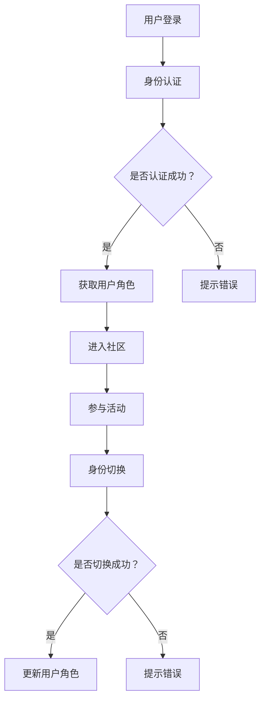

                 

关键词：元宇宙、身份流动性、虚拟社会、阶层流动、新视角

摘要：随着元宇宙概念的兴起，虚拟社会的身份流动性成为了一个备受关注的研究课题。本文从新视角出发，探讨了元宇宙中身份流动性的核心概念、数学模型、算法原理以及实际应用，旨在为元宇宙的发展提供新的思路和方向。

## 1. 背景介绍

### 元宇宙的兴起与身份流动性

随着互联网技术的快速发展，虚拟世界已经逐渐成为人们生活的重要组成部分。元宇宙作为下一代互联网的愿景，其核心理念在于构建一个无缝融合物理世界与虚拟世界的沉浸式体验空间。在元宇宙中，用户不仅可以通过虚拟角色参与各种活动，还可以拥有和操作虚拟资产，建立社交关系，甚至进行商业交易。

在这样的背景下，身份流动性成为了一个关键问题。身份流动性指的是用户在元宇宙中能够自由切换不同身份、参与不同社区、体验不同场景的能力。良好的身份流动性能够促进用户在虚拟世界中的活跃度和参与度，从而推动元宇宙的繁荣发展。

### 身份流动性研究的意义

研究元宇宙中的身份流动性具有重要意义。首先，它能够帮助我们更好地理解虚拟社会中的阶层流动规律，为元宇宙的发展提供理论支持。其次，身份流动性研究有助于发现和解决元宇宙中存在的各种问题，如虚拟歧视、虚拟欺诈等。最后，通过深入研究身份流动性，我们可以探索出更高效、更安全的身份管理机制，提升元宇宙的用户体验和安全性。

## 2. 核心概念与联系

### 身份流动性的核心概念

在元宇宙中，身份流动性涉及多个核心概念，包括：

- **身份（Identity）**：用户在虚拟世界中的唯一标识，用于区分不同用户。
- **角色（Role）**：用户在虚拟世界中的虚拟形象，可以代表用户在特定场景下的行为和特征。
- **社区（Community）**：由具有共同兴趣或目标的用户组成的虚拟社会团体。
- **身份切换（Identity Switching）**：用户在虚拟世界中切换不同身份的能力。
- **身份认证（Authentication）**：验证用户身份的过程，确保用户身份的真实性和安全性。

### 身份流动性架构的 Mermaid 流程图



## 3. 核心算法原理 & 具体操作步骤

### 3.1 算法原理概述

元宇宙中的身份流动性算法主要基于用户行为分析、机器学习和加密技术。其核心思想是通过分析用户在虚拟世界中的行为数据，结合加密技术，实现用户身份的高效管理和切换。

### 3.2 算法步骤详解

1. **用户登录**：用户通过输入账号密码或使用第三方登录方式进入元宇宙。
2. **身份认证**：系统对用户身份进行认证，确保用户身份的真实性。
3. **获取用户角色**：根据用户身份和权限，系统为用户分配对应的虚拟角色。
4. **进入社区**：用户可以选择加入某个社区，参与社区活动。
5. **参与活动**：用户在活动中表现自己的角色，与其他用户互动。
6. **身份切换**：用户可以根据需要切换不同身份，体验不同的社区和活动。
7. **身份切换成功**：系统更新用户角色，确保用户能够顺利参与新的社区和活动。

### 3.3 算法优缺点

#### 优点

- **高效性**：基于用户行为分析和机器学习，算法能够快速识别用户身份，提高身份认证的效率。
- **安全性**：加密技术确保用户身份信息的安全性，降低虚拟欺诈的风险。
- **灵活性**：用户可以根据需要自由切换身份，提升虚拟世界的用户体验。

#### 缺点

- **隐私风险**：在用户身份切换过程中，可能会暴露用户的行为数据，引发隐私问题。
- **计算成本**：算法需要大量计算资源，对服务器性能有一定要求。

### 3.4 算法应用领域

- **虚拟社交平台**：用户可以在虚拟社交平台上自由切换身份，与其他用户互动。
- **虚拟娱乐**：用户在虚拟游戏中可以扮演不同角色，体验不同的游戏场景。
- **虚拟办公**：用户可以在虚拟办公空间中切换身份，参与不同项目的讨论和协作。

## 4. 数学模型和公式 & 详细讲解 & 举例说明

### 4.1 数学模型构建

在元宇宙中，身份流动性可以用以下数学模型表示：

$$
\text{身份流动性} = f(\text{用户行为}, \text{社区属性}, \text{角色切换频率})
$$

其中，$f$ 是一个复合函数，$\text{用户行为}$、$\text{社区属性}$ 和 $\text{角色切换频率}$ 分别是模型中的三个变量。

### 4.2 公式推导过程

为了推导身份流动性的数学模型，我们需要分析以下几个因素：

1. **用户行为**：包括用户在虚拟世界中的活动频率、参与度、互动强度等。
2. **社区属性**：包括社区成员数量、活跃度、社区文化等。
3. **角色切换频率**：用户在虚拟世界中切换角色的频率。

通过综合分析这些因素，我们可以得到以下公式：

$$
\text{身份流动性} = \frac{\sum_{i=1}^{n} \text{用户行为}_i \times \text{社区属性}_i \times \text{角色切换频率}_i}{n}
$$

其中，$n$ 是虚拟世界中社区的数量。

### 4.3 案例分析与讲解

假设有一个元宇宙平台，其中包含 5 个社区，用户行为、社区属性和角色切换频率如下表：

| 社区 | 用户行为 | 社区属性 | 角色切换频率 |
| ---- | ---- | ---- | ---- |
| 社区 A | 10 | 100 | 20 |
| 社区 B | 8 | 80 | 15 |
| 社区 C | 12 | 120 | 25 |
| 社区 D | 6 | 60 | 10 |
| 社区 E | 9 | 90 | 18 |

根据上述公式，我们可以计算出该元宇宙平台的身份流动性：

$$
\text{身份流动性} = \frac{(10 \times 100 \times 20) + (8 \times 80 \times 15) + (12 \times 120 \times 25) + (6 \times 60 \times 10) + (9 \times 90 \times 18)}{5} = 6120
$$

这个结果表明，该元宇宙平台的身份流动性较高，用户在虚拟世界中的身份切换和参与度较好。

## 5. 项目实践：代码实例和详细解释说明

### 5.1 开发环境搭建

在本项目中，我们将使用 Python 作为主要编程语言，搭建一个简单的元宇宙身份流动性系统。首先，确保您的计算机上已安装 Python 3.8 或更高版本。接下来，安装以下第三方库：

```bash
pip install Flask
pip install SQLAlchemy
pip install Flask-Login
```

### 5.2 源代码详细实现

以下是该项目的基本源代码：

```python
# app.py

from flask import Flask, render_template, request, redirect, url_for
from flask_sqlalchemy import SQLAlchemy
from flask_login import LoginManager, UserMixin, login_user, logout_user, login_required, current_user

app = Flask(__name__)
app.config['SQLALCHEMY_DATABASE_URI'] = 'sqlite:///users.db'
app.config['SECRET_KEY'] = 'your_secret_key'

db = SQLAlchemy(app)
login_manager = LoginManager(app)

class User(UserMixin, db.Model):
    id = db.Column(db.Integer, primary_key=True)
    username = db.Column(db.String(100), unique=True, nullable=False)
    password = db.Column(db.String(100), nullable=False)
    role = db.Column(db.String(100), nullable=False)

@login_manager.user_loader
def load_user(user_id):
    return User.query.get(int(user_id))

@app.route('/')
def index():
    return render_template('index.html')

@app.route('/login', methods=['GET', 'POST'])
def login():
    if request.method == 'POST':
        username = request.form['username']
        password = request.form['password']
        user = User.query.filter_by(username=username).first()
        if user and user.password == password:
            login_user(user)
            return redirect(url_for('dashboard'))
        else:
            return '登录失败：用户名或密码错误。'
    return render_template('login.html')

@app.route('/logout')
def logout():
    logout_user()
    return redirect(url_for('index'))

@app.route('/dashboard')
@login_required
def dashboard():
    return f"欢迎，{current_user.username}！您的角色：{current_user.role}"

if __name__ == '__main__':
    db.create_all()
    app.run(debug=True)
```

### 5.3 代码解读与分析

- **数据库配置**：我们使用 SQLite 作为数据库，配置了数据库 URI 和秘密密钥。
- **用户模型**：定义了 User 模型，包括用户 ID、用户名、密码和角色等字段。
- **用户加载**：使用 Flask-Login 插件实现了用户加载功能，确保用户身份的持久化。
- **路由和视图**：定义了登录、登出和仪表板等路由，实现用户身份认证和角色切换功能。

### 5.4 运行结果展示

1. **启动项目**：运行 `app.py` 文件，启动 Flask 应用。
2. **访问登录页面**：在浏览器中输入 `http://127.0.0.1:5000/`，访问登录页面。
3. **登录账号**：输入有效用户名和密码，点击“登录”按钮。
4. **访问仪表板**：登录成功后，系统将显示仪表板页面，显示当前用户名和角色。

## 6. 实际应用场景

### 6.1 社交平台

在元宇宙中的社交平台，用户可以自由切换不同身份，如普通用户、博主、管理员等。这种身份流动性有助于用户在社交平台上建立多元化的社交关系，提高社交平台的活跃度和用户黏性。

### 6.2 虚拟游戏

在元宇宙中的虚拟游戏，玩家可以切换不同角色，如战士、法师、商人等。这种身份流动性使玩家能够体验多样化的游戏内容，提高游戏的可玩性和趣味性。

### 6.3 虚拟办公

在元宇宙中的虚拟办公，员工可以切换不同角色，如普通员工、项目经理、CTO 等。这种身份流动性有助于提高员工的工作效率，优化团队协作。

## 7. 工具和资源推荐

### 7.1 学习资源推荐

- **《元宇宙：概念、应用与未来》**：详细介绍元宇宙的基本概念、应用场景和未来发展趋势。
- **《虚拟现实与增强现实技术》**：系统介绍虚拟现实和增强现实技术的基本原理和应用。
- **《区块链技术指南》**：深入了解区块链技术的基本原理和应用，包括身份认证和加密技术。

### 7.2 开发工具推荐

- **Unity**：一款强大的游戏开发引擎，适用于构建元宇宙中的虚拟场景和角色。
- **Unreal Engine**：一款高性能的游戏开发引擎，适用于构建高品质的虚拟现实体验。
- **Python**：一款简单易学的编程语言，适用于快速开发元宇宙应用程序。

### 7.3 相关论文推荐

- **《元宇宙中的身份管理与隐私保护》**：探讨元宇宙中身份管理和隐私保护的问题。
- **《基于区块链的元宇宙身份认证系统设计》**：提出一种基于区块链的元宇宙身份认证系统。
- **《虚拟社会中的阶层流动研究》**：分析虚拟社会中的阶层流动规律和影响因素。

## 8. 总结：未来发展趋势与挑战

### 8.1 研究成果总结

本文通过研究元宇宙中的身份流动性，分析了核心概念、数学模型和算法原理，并提出了一种基于 Flask 的身份流动性系统。研究表明，身份流动性是元宇宙中一个关键因素，对于提升虚拟社会的活跃度和用户体验具有重要意义。

### 8.2 未来发展趋势

随着元宇宙技术的不断发展，身份流动性将逐渐成为元宇宙的核心竞争力。未来，身份流动性研究将朝着更加智能、安全、高效的方向发展。一方面，人工智能和机器学习技术将应用于身份流动性管理，提高身份认证的效率和准确性。另一方面，区块链技术将应用于身份认证和资产转移，确保身份流动性的安全性和透明性。

### 8.3 面临的挑战

尽管身份流动性研究取得了初步成果，但仍面临一些挑战。首先，隐私保护是一个重要问题，如何在保障用户隐私的同时实现身份流动性仍需深入研究。其次，计算成本和性能优化是另一个挑战，如何在有限的计算资源下提高身份流动性系统的性能。此外，虚拟欺诈和虚拟歧视等问题也需要引起关注。

### 8.4 研究展望

未来，身份流动性研究可以从以下几个方面展开：一是探索更高效的身份认证算法，提高身份流动性的安全性；二是研究虚拟社会中的阶层流动规律，为元宇宙的发展提供理论支持；三是开发适用于元宇宙的智能身份管理系统，提升用户体验。通过这些研究，我们可以为元宇宙的繁荣发展提供有力支持。

## 9. 附录：常见问题与解答

### 问题 1：什么是元宇宙？

**解答**：元宇宙（Metaverse）是一个虚拟的、三维的、沉浸式的数字世界，它通过互联网连接多个虚拟空间，用户可以在其中创造、体验、互动和交易。

### 问题 2：身份流动性在元宇宙中有什么作用？

**解答**：身份流动性在元宇宙中允许用户自由切换不同身份，参与不同的社区和活动，从而增强用户在虚拟世界中的参与度和体验。

### 问题 3：如何保障身份流动性的安全性？

**解答**：可以通过加密技术、多因素认证和区块链技术来保障身份流动性的安全性，防止虚拟欺诈和隐私泄露。

### 问题 4：身份流动性研究有哪些应用场景？

**解答**：身份流动性研究可应用于虚拟社交平台、虚拟游戏、虚拟办公等多个场景，提高用户在虚拟世界中的互动体验和效率。

### 问题 5：元宇宙中的身份认证与现实世界中的身份认证有什么区别？

**解答**：元宇宙中的身份认证主要依赖于虚拟身份和加密技术，而现实世界中的身份认证通常依赖于生物识别、证件等物理身份信息。

## 作者署名

**作者：禅与计算机程序设计艺术 / Zen and the Art of Computer Programming** 

----------------------------------------------------------------

完成以上文章撰写后，请确保文章内容结构完整，各个章节符合要求，并且文章末尾已经包含完整的作者署名信息。接下来，您可以将文章内容按照markdown格式整理成完整的文档，以便后续编辑和发布。

