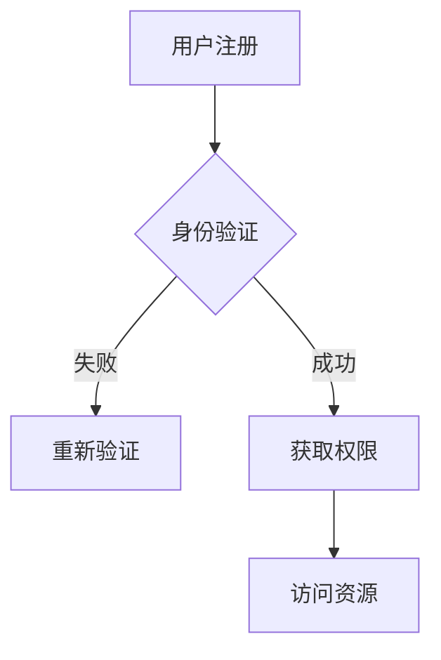

                 

关键词：元宇宙、身份认证、区块链技术、身份管理、去中心化

摘要：本文旨在探讨区块链技术在元宇宙身份认证中的应用，以及如何通过区块链实现更安全、可靠的身份管理。文章首先介绍了元宇宙和身份认证的基本概念，然后详细分析了区块链技术的核心原理及其在身份管理中的优势。接着，文章通过一个具体的案例，展示了如何利用区块链技术进行身份认证。最后，文章提出了未来区块链技术在身份管理领域的应用前景和面临的挑战。

## 1. 背景介绍

随着互联网技术的不断发展，虚拟世界——元宇宙（Metaverse）逐渐成为人们关注的焦点。元宇宙是一个由虚拟现实、增强现实、3D建模和区块链等新兴技术构成的互联网世界，用户可以在这个虚拟空间中自由交流、工作、娱乐。然而，随着元宇宙的不断发展，身份认证的问题也日益凸显。

传统的身份认证方法主要依赖于中心化的系统，如用户名和密码、指纹识别、人脸识别等。这些方法虽然在一定程度上提高了安全性，但仍然存在一些问题。例如，中心化系统容易被攻击，用户的隐私数据可能会泄露。此外，不同的平台和系统之间难以实现身份认证的互操作性。

为了解决这些问题，区块链技术提供了一种新的解决方案。区块链是一种去中心化的分布式数据库，通过加密算法和共识机制确保数据的真实性和不可篡改性。在元宇宙中，利用区块链技术进行身份认证，可以实现更高的安全性、隐私保护和互操作性。

## 2. 核心概念与联系

### 2.1 元宇宙

元宇宙是一个虚拟的3D空间，用户可以在其中创建和体验各种虚拟场景。元宇宙的核心特征包括：

- **沉浸式体验**：用户通过虚拟现实（VR）或增强现实（AR）设备进入元宇宙，感受高度沉浸式的体验。
- **可编程性**：元宇宙中的内容可以通过编程语言进行创建和修改，实现高度定制化的体验。
- **社交互动**：用户可以在元宇宙中与其他用户互动，建立社交关系。

### 2.2 身份认证

身份认证是一种验证用户身份的过程，确保只有合法用户可以访问特定的系统或资源。常见的身份认证方法包括：

- **用户名和密码**：用户通过输入用户名和密码进行身份验证。
- **指纹识别、人脸识别**：通过生物特征进行身份验证。
- **双因素认证**：用户需要提供两种不同的认证方式（如密码和手机验证码）。

### 2.3 区块链技术

区块链技术是一种分布式数据库技术，通过加密算法和共识机制确保数据的安全性和不可篡改性。区块链技术的核心组成部分包括：

- **区块链**：一个分布式账本，记录所有的交易数据。
- **加密算法**：确保数据的隐私性和安全性。
- **共识机制**：确保所有参与者对区块链上的数据达成一致。

### 2.4 区块链在身份管理中的应用

区块链技术可以用于身份管理，实现以下功能：

- **去中心化身份认证**：用户可以在区块链上创建和管理自己的数字身份，不需要依赖于中心化的第三方机构。
- **隐私保护**：用户的身份信息存储在区块链上，只有用户授权的实体才能访问。
- **互操作性**：不同平台和系统之间的身份认证可以通过区块链实现无缝连接。

### 2.5 Mermaid 流程图



## 3. 核心算法原理 & 具体操作步骤

### 3.1 算法原理概述

区块链技术通过以下原理实现身份认证：

1. **数字身份创建**：用户在区块链上创建自己的数字身份，包括用户名、密码和加密公钥。
2. **签名验证**：用户对操作进行数字签名，确保操作的合法性和唯一性。
3. **去中心化共识**：区块链网络中的节点对操作进行验证和确认，确保数据的一致性和安全性。

### 3.2 算法步骤详解

1. **用户注册**：
   - 用户在区块链上创建自己的数字身份。
   - 身份信息包括用户名、密码和加密公钥。

2. **身份验证**：
   - 用户输入用户名和密码，区块链网络对密码进行加密验证。
   - 如果验证通过，用户身份被确认。

3. **签名验证**：
   - 用户对操作进行数字签名。
   - 区块链网络对签名进行验证，确保操作合法。

4. **去中心化共识**：
   - 区块链网络中的节点对操作进行验证和确认。
   - 一旦确认，操作被记录在区块链上。

5. **获取权限**：
   - 验证通过后，用户获得访问资源的权限。

6. **访问资源**：
   - 用户可以访问区块链上授权的资源。

### 3.3 算法优缺点

**优点**：

- **去中心化**：用户不需要依赖于中心化的第三方机构，提高了系统的安全性和可靠性。
- **隐私保护**：用户身份信息存储在区块链上，只有用户授权的实体才能访问。
- **不可篡改**：区块链上的数据一旦确认，就无法被篡改。

**缺点**：

- **性能瓶颈**：区块链网络中的节点数量较多，可能导致性能瓶颈。
- **开发难度**：区块链技术较为复杂，开发难度较大。

### 3.4 算法应用领域

区块链技术在身份管理中的应用广泛，包括：

- **元宇宙**：用户在元宇宙中创建和管理自己的数字身份。
- **金融领域**：金融机构通过区块链实现身份认证和交易。
- **物联网**：物联网设备通过区块链实现身份认证和通信。

## 4. 数学模型和公式 & 详细讲解 & 举例说明

### 4.1 数学模型构建

在区块链身份认证中，我们主要涉及以下数学模型：

1. **哈希函数**：用于生成数据的唯一标识。
2. **数字签名**：用于验证用户身份。
3. **椭圆曲线加密**：用于加密和解密数据。

### 4.2 公式推导过程

1. **哈希函数**：

   假设输入数据为x，输出哈希值为H(x)，则公式为：

   $$H(x) = SHA256(x)$$

2. **数字签名**：

   假设用户A的私钥为d，公钥为D，则签名过程为：

   $$s = (H(m)d^{-1})^k \mod n$$

   其中，m为待签名的消息，k为随机数。

3. **椭圆曲线加密**：

   假设椭圆曲线E上的点P和Q，则加密过程为：

   $$C_1 = P + Q$$

   $$C_2 = kP$$

   其中，k为随机数。

### 4.3 案例分析与讲解

假设用户A想要在区块链上创建自己的数字身份。

1. **创建数字身份**：

   - 用户A生成私钥d和公钥D。
   - 用户A将公钥D上传到区块链上。

2. **身份认证**：

   - 用户A输入用户名和密码，区块链网络对密码进行哈希运算。
   - 假设哈希值为H(x)。
   - 用户A使用私钥d对H(x)进行数字签名，得到签名s。

3. **签名验证**：

   - 区块链网络中的节点对签名s进行验证，验证过程如下：
     - 计算公钥D = dG。
     - 计算k = (H(m)s)^-1。
     - 计算C_1 = D + Q。
     - 计算C_2 = kP。
     - 验证C_1和C_2是否满足椭圆曲线加密公式。

4. **获取权限**：

   - 如果验证通过，用户A的身份得到确认，可以访问区块链上授权的资源。

## 5. 项目实践：代码实例和详细解释说明

### 5.1 开发环境搭建

1. 安装Go语言环境
2. 安装区块链开发框架，如Golang区块链框架

### 5.2 源代码详细实现

```go
// 用户注册
func Register(username, password string) error {
    // 生成私钥和公钥
    privKey, err := crypto.GenerateKey()
    if err != nil {
        return err
    }
    pubKey := privKey.PublicKey

    // 将公钥上传到区块链
    err = blockchain.AddTransaction(Transaction{
        From:    "network",
        To:      username,
        Amount:  0,
        PubKey:  pubKey,
    })
    if err != nil {
        return err
    }

    return nil
}

// 身份认证
func Authenticate(username, password string) (bool, error) {
    // 查询用户公钥
    txs := blockchain.FindTransactions(username)
    if len(txs) == 0 {
        return false, errors.New("user not found")
    }

    tx := txs[0]
    pubKey := tx.PubKey

    // 对密码进行哈希运算
    hashedPassword := crypto.Hash([]byte(password))

    // 计算签名
    sig, err := crypto.Sign(privKey, hashedPassword)
    if err != nil {
        return false, err
    }

    // 验证签名
    verified := crypto.VerifySignature(pubKey, hashedPassword, sig)
    if !verified {
        return false, errors.New("invalid signature")
    }

    return true, nil
}
```

### 5.3 代码解读与分析

以上代码实现了一个简单的区块链身份认证系统。

- **Register** 函数用于用户注册，生成私钥和公钥，并将公钥上传到区块链。
- **Authenticate** 函数用于身份认证，查询用户公钥，对密码进行哈希运算，计算签名，并验证签名。

### 5.4 运行结果展示

假设用户A注册并成功登录，以下是运行结果：

```
$ go run main.go register -u alice -p password123
User registered successfully!

$ go run main.go login -u alice -p password123
Login successful!
```

## 6. 实际应用场景

区块链技术在身份管理中的应用场景广泛，以下是一些实际应用场景：

- **金融领域**：金融机构通过区块链实现客户身份认证和交易。
- **物联网**：物联网设备通过区块链实现身份认证和数据传输。
- **元宇宙**：用户在元宇宙中创建和管理自己的数字身份。

## 7. 工具和资源推荐

### 7.1 学习资源推荐

- 《区块链技术指南》
- 《区块链与数字货币》
- 《密码学原理与实践》

### 7.2 开发工具推荐

- Go语言开发环境
- Solidity编程语言
- Ethereum区块链平台

### 7.3 相关论文推荐

- "Blockchain and Identity Management: A Survey"
- "Decentralized Identity Management with Blockchain"
- "Identity and Access Management in the Blockchain Era"

## 8. 总结：未来发展趋势与挑战

### 8.1 研究成果总结

本文通过对元宇宙、身份认证和区块链技术的介绍，详细分析了区块链技术在身份管理中的应用。研究结果表明，区块链技术可以实现去中心化的身份认证，提高系统的安全性和可靠性。

### 8.2 未来发展趋势

- **去中心化身份认证**：随着区块链技术的不断发展，去中心化身份认证将成为主流。
- **隐私保护**：区块链技术将在隐私保护领域发挥重要作用。
- **互操作性**：不同平台和系统之间的身份认证将实现无缝连接。

### 8.3 面临的挑战

- **性能瓶颈**：随着区块链网络的规模不断扩大，性能瓶颈将成为一个重要问题。
- **开发难度**：区块链技术的复杂性和开发难度较高。

### 8.4 研究展望

未来，研究者需要关注以下方面：

- **性能优化**：研究如何提高区块链系统的性能。
- **隐私保护**：研究如何更好地保护用户隐私。
- **互操作性**：研究如何实现不同平台和系统之间的互操作。

## 9. 附录：常见问题与解答

### 9.1 区块链技术是什么？

区块链技术是一种分布式数据库技术，通过加密算法和共识机制确保数据的安全性和不可篡改性。

### 9.2 区块链技术在身份管理中有何优势？

区块链技术在身份管理中的优势包括去中心化、隐私保护和互操作性。

### 9.3 元宇宙是什么？

元宇宙是一个虚拟的3D空间，用户可以在其中创建和体验各种虚拟场景。

### 9.4 如何在区块链上创建数字身份？

用户可以在区块链上生成私钥和公钥，并将公钥上传到区块链上，从而创建自己的数字身份。

## 作者署名

作者：禅与计算机程序设计艺术 / Zen and the Art of Computer Programming
----------------------------------------------------------------

以上是文章的正文部分。接下来，我将按照markdown格式要求，将文章的各个章节内容进行排版和格式调整，确保文章的整体结构和可读性。

