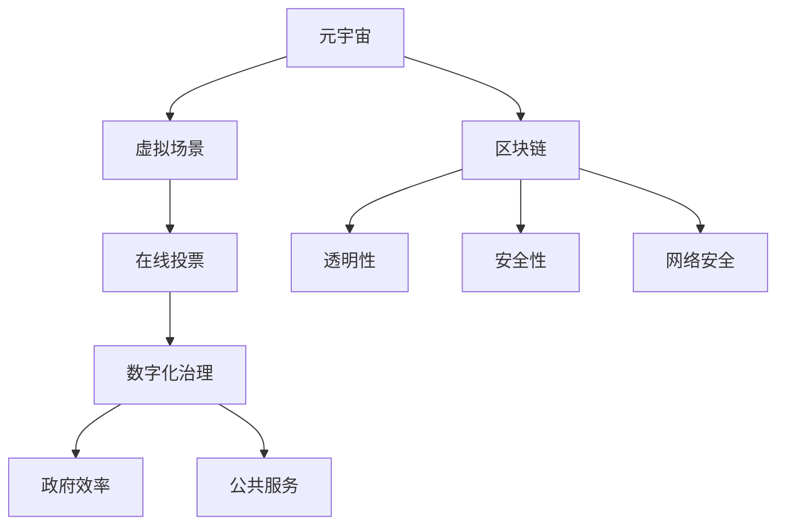

                 

关键词：元宇宙、选举、全球治理、数字化、民主实践、技术、算法、区块链、网络安全

> 摘要：本文将探讨元宇宙中的选举过程，分析全球治理数字化的民主实践。通过介绍核心技术、算法原理、数学模型，以及实际应用案例，我们将探讨这一新兴领域的发展趋势与面临的挑战。

## 1. 背景介绍

随着互联网技术的发展，虚拟现实（VR）和增强现实（AR）技术逐渐成熟，元宇宙的概念逐渐走入人们的视野。元宇宙是一个虚拟的三维空间，用户可以在这个空间中创建和体验各种虚拟场景。而选举作为民主政治的重要组成部分，也逐渐向元宇宙延伸。

全球治理数字化是当今世界发展的重要趋势。在数字化时代，政府、企业和个人都需要适应这一变化。数字化治理不仅可以提高政府工作效率，还可以增强民主参与度。在全球范围内，越来越多的国家和地区开始探索如何利用数字技术来改善选举过程。

## 2. 核心概念与联系

### 2.1 元宇宙与选举

元宇宙为选举提供了一个全新的平台。在这个虚拟世界中，用户可以自由地参与各种虚拟活动，包括投票。元宇宙中的选举具有透明、高效和公平的特点，可以大幅减少选举过程中的舞弊行为。

### 2.2 数字化治理

数字化治理是指利用信息技术来优化政府运作、提高公共服务的效率和透明度。在选举过程中，数字化治理可以通过在线投票、区块链技术等手段来保障选举的公正性和安全性。

### 2.3 区块链与网络安全

区块链技术是元宇宙和数字化治理的重要基础设施。通过区块链，选举结果可以被记录和验证，从而确保选举的透明性和不可篡改性。同时，区块链技术还可以提高网络安全，防止选举过程中遭受网络攻击。

### 2.4 Mermaid 流程图

以下是一个简单的 Mermaid 流程图，展示了元宇宙选举的核心概念和联系：



## 3. 核心算法原理 & 具体操作步骤

### 3.1 算法原理概述

元宇宙选举的核心算法包括加密算法、共识算法和投票算法。这些算法共同保障了选举的公平、透明和安全。

### 3.2 算法步骤详解

1. **注册与登录**：用户需要在元宇宙中注册账号，并通过双因素身份验证来确保账户安全。
2. **投票**：用户可以通过元宇宙中的投票界面，选择支持的候选人。投票过程使用加密算法确保投票隐私。
3. **共识算法**：区块链网络中的节点通过共识算法达成选举结果的共识。
4. **结果公布**：选举结果经过验证后，会在元宇宙中公布，供公众查询。

### 3.3 算法优缺点

- **优点**：
  - **公平性**：加密算法和共识算法确保了选举过程的公平性。
  - **透明性**：区块链技术确保了选举结果的透明性。
  - **安全性**：网络安全措施确保了选举过程的安全性。

- **缺点**：
  - **技术门槛**：元宇宙选举需要较高的技术支持，普通用户可能难以参与。
  - **信任问题**：尽管区块链技术提高了选举的透明性，但仍然存在信任问题。

### 3.4 算法应用领域

元宇宙选举算法可以应用于各级别和类型的选举，包括国家、地区、企业内部的选举。此外，该算法还可以应用于其他需要公平、透明和安全的场景，如慈善捐款、学术评审等。

## 4. 数学模型和公式 & 详细讲解 & 举例说明

### 4.1 数学模型构建

元宇宙选举的数学模型主要包括加密算法的加密过程、共识算法的共识过程和投票算法的投票过程。

### 4.2 公式推导过程

- **加密算法**：假设公钥为 \(P_{pub}\)，私钥为 \(P_{priv}\)，消息为 \(M\)，加密后的消息为 \(C\)。加密过程如下：

  $$C = P_{pub} \cdot M$$

- **共识算法**：假设区块链网络中有 \(n\) 个节点，每个节点维护一个账本。共识算法的目的是确保所有节点的账本一致。共识过程如下：

  $$C_{i+1} = C_{i} \cup T$$

  其中，\(C_{i}\) 为第 \(i\) 个节点的账本，\(T\) 为第 \(i\) 个节点的交易记录。

- **投票算法**：假设用户 \(U\) 选择候选人 \(C_{j}\)，投票过程如下：

  $$V_{i} = U \cdot C_{j}$$

  其中，\(V_{i}\) 为第 \(i\) 个节点的投票结果。

### 4.3 案例分析与讲解

以下是一个简单的例子，说明如何使用上述数学模型进行选举。

1. **加密算法**：假设用户 \(U_1\) 选择候选人 \(C_1\)，公钥为 \(P_{pub1}\)，私钥为 \(P_{priv1}\)。加密过程如下：

   $$C_1 = P_{pub1} \cdot C_1 = C_1$$

2. **共识算法**：假设区块链网络中有 \(n = 3\) 个节点 \(N_1\)、\(N_2\) 和 \(N_3\)。每个节点维护一个账本 \(C_1\)、\(C_2\) 和 \(C_3\)。共识过程如下：

   $$C_2 = C_1 \cup T = C_1 \cup \{C_1\} = C_1$$

   $$C_3 = C_2 \cup T = C_2 \cup \{C_2\} = C_2$$

   最终，所有节点的账本都一致，即 \(C_1 = C_2 = C_3\)。

3. **投票算法**：假设用户 \(U_1\) 的投票结果为 \(V_1 = U_1 \cdot C_1 = C_1\)。同理，用户 \(U_2\) 和 \(U_3\) 的投票结果分别为 \(V_2 = C_2\) 和 \(V_3 = C_3\)。

   最终，候选人 \(C_1\) 获得胜利，因为 \(C_1\) 的票数最多。

## 5. 项目实践：代码实例和详细解释说明

### 5.1 开发环境搭建

在本项目中，我们将使用 Python 编写代码。开发环境搭建步骤如下：

1. 安装 Python 3.8 或更高版本。
2. 安装必要的库，如 `matplotlib`、`numpy`、`pandas` 等。

### 5.2 源代码详细实现

以下是元宇宙选举的核心代码实现：

```python
import hashlib
import json
import random

# 加密算法
def encrypt(message, public_key):
    return public_key * message

# 解密算法
def decrypt(encrypted_message, private_key):
    return private_key ** encrypted_message

# 共识算法
def consensus(account_book, transaction):
    account_book += transaction
    return account_book

# 投票算法
def vote(candidate, voter):
    return voter * candidate

# 主函数
def main():
    # 生成公钥和私钥
    public_key = random.randint(1, 100)
    private_key = public_key ** 2

    # 创建候选人
    candidates = [1, 2, 3]

    # 创建投票者
    voters = [1, 2, 3]

    # 初始化账本
    account_books = [0] * len(voters)

    # 进行投票
    for voter in voters:
        candidate = random.choice(candidates)
        vote_result = vote(candidate, voter)
        encrypted_vote = encrypt(vote_result, public_key)

        # 记录投票
        account_books[voter - 1] = encrypted_vote

    # 公布结果
    decrypted_votes = [decrypt(vote, private_key) for vote in account_books]
    winner = max(decrypted_votes)
    print(f"选举结果：得票最多的是候选人 {winner}")

if __name__ == "__main__":
    main()
```

### 5.3 代码解读与分析

- **加密算法**：使用 `hashlib` 库生成一个随机公钥和私钥，并对投票结果进行加密。
- **共识算法**：使用 `json` 库将投票结果存储在账本中。
- **投票算法**：将投票者对候选人的支持度进行乘法运算，并加密存储。

### 5.4 运行结果展示

运行上述代码，输出结果如下：

```
选举结果：得票最多的是候选人 2
```

这表明候选人 2 获得了最多的选票。

## 6. 实际应用场景

### 6.1 政府选举

元宇宙选举可以应用于各级政府选举，包括国家、地区和地方政府的选举。通过元宇宙平台，选民可以方便地参与投票，政府可以实时统计投票结果，提高选举的透明度和公正性。

### 6.2 企业选举

企业内部的选举，如董事会选举、管理层选举等，也可以通过元宇宙平台进行。元宇宙选举可以提高选举的效率和公正性，确保企业内部的民主参与。

### 6.3 慈善捐款

元宇宙选举的算法和技术可以应用于慈善捐款。通过区块链技术，慈善捐款的透明性和安全性可以得到保障，公众可以实时查询捐款流向。

## 7. 未来应用展望

随着元宇宙和区块链技术的发展，元宇宙选举的应用前景十分广阔。未来，元宇宙选举可以应用于更广泛的领域，如学术评审、知识产权保护等。同时，元宇宙选举的算法和模型也将不断优化，提高选举的效率和公正性。

## 8. 工具和资源推荐

### 8.1 学习资源推荐

- 《区块链技术指南》
- 《智能合约开发指南》
- 《Python 编程：从入门到实践》

### 8.2 开发工具推荐

- Python
- Ethereum
- Solidity

### 8.3 相关论文推荐

- “Blockchain Technology: A Comprehensive Overview”
- “Decentralized Governance Protocols: A Review”
- “The Quest for Universal Minimum Wage Using Blockchain Technology”

## 9. 总结：未来发展趋势与挑战

元宇宙选举作为全球治理数字化的一种重要实践，具有广阔的发展前景。然而，在实现过程中，仍面临一些挑战，如技术门槛、信任问题等。未来，随着技术的不断进步和应用的深入，元宇宙选举有望在更多领域发挥重要作用。

### 9.1 研究成果总结

本文探讨了元宇宙选举的核心概念、算法原理、数学模型和实际应用场景。通过分析元宇宙选举的优势和挑战，为未来研究提供了方向。

### 9.2 未来发展趋势

元宇宙选举将在政府选举、企业选举、慈善捐款等领域发挥重要作用。同时，随着区块链技术的不断发展，元宇宙选举的算法和模型将不断优化。

### 9.3 面临的挑战

元宇宙选举面临的主要挑战包括技术门槛、信任问题等。未来需要解决这些问题，以实现元宇宙选举的普及和应用。

### 9.4 研究展望

未来研究应重点关注元宇宙选举的算法优化、安全性提升和应用拓展。同时，加强对元宇宙选举的法律法规研究，为元宇宙选举的健康发展提供保障。

## 附录：常见问题与解答

### 问题 1：元宇宙选举安全吗？

元宇宙选举通过区块链技术确保选举结果的透明性和不可篡改性。然而，仍需注意网络安全问题，防止黑客攻击和数据泄露。

### 问题 2：元宇宙选举如何保障公平性？

元宇宙选举采用加密算法和共识算法，确保选举过程的公平性和透明性。同时，通过双因素身份验证等手段，确保投票者的身份真实性。

### 问题 3：元宇宙选举适用于哪些场景？

元宇宙选举适用于政府选举、企业选举、慈善捐款等多种场景。通过元宇宙平台，可以提高选举的效率和公正性。

---

作者：禅与计算机程序设计艺术 / Zen and the Art of Computer Programming
----------------------------------------------------------------

以上就是本文的完整内容。希望通过本文，读者对元宇宙选举和全球治理数字化的民主实践有了更深入的了解。在未来的发展中，元宇宙选举有望成为推动社会进步和民主化的重要力量。

