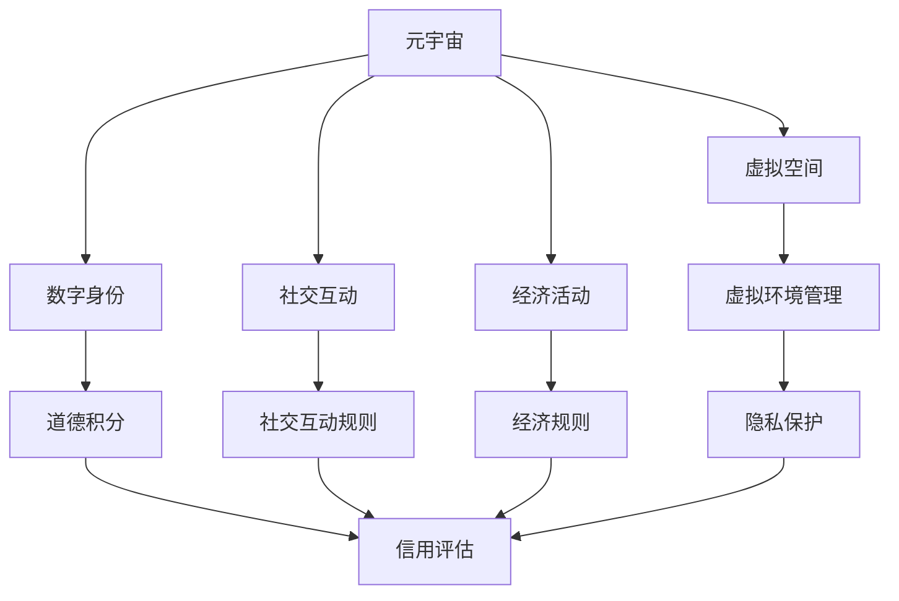

                 

关键词：元宇宙、道德积分、社会信用、虚拟行为、评估体系

> 摘要：随着元宇宙的兴起，虚拟世界中的行为与道德成为了一个备受关注的话题。本文旨在探讨元宇宙道德积分作为一种全新的社会信用评估体系，其基本概念、核心原理、算法模型、应用实践以及未来发展趋势。本文将帮助读者深入了解元宇宙道德积分体系，为虚拟世界的治理提供理论参考和实践指导。

## 1. 背景介绍

在过去的几十年里，互联网和数字技术的发展使得虚拟世界成为人们生活的重要部分。如今，元宇宙——一个融合了虚拟现实、增强现实和区块链技术的虚拟空间——正在迅速崛起，成为新一代互联网的形态。在元宇宙中，用户可以创建自己的数字身份，进行各种社交、娱乐、商业活动，这使得虚拟行为的管理和道德规范成为一个迫切需要解决的问题。

社会信用体系作为一种评价个人或组织行为规范的工具，已经广泛应用于现实世界中。然而，在元宇宙这样的虚拟环境中，如何构建一个公正、透明、有效的社会信用评估体系，成为了研究者们关注的焦点。道德积分作为一种新型的社会信用评估方法，旨在通过对用户在虚拟世界中的行为进行量化评估，以实现对虚拟行为的道德规范和治理。

## 2. 核心概念与联系

### 2.1. 元宇宙

元宇宙（Metaverse）是一个由虚拟现实、增强现实、区块链、人工智能等技术构建的虚拟空间，用户可以在其中创建和体验丰富的虚拟世界。元宇宙通常包括以下几个核心组成部分：

- **虚拟空间**：虚拟现实和增强现实技术创建的虚拟环境。
- **数字身份**：用户在元宇宙中的数字化代表，可以是一个虚拟人物或动物。
- **社交互动**：用户之间通过各种形式的互动进行交流和合作。
- **经济活动**：虚拟货币、数字资产和商业交易等经济活动。

### 2.2. 道德积分

道德积分是一种基于用户在虚拟世界中的行为表现进行量化评估的体系。它通过计算用户的道德行为得分，用于评估用户在虚拟世界中的诚信度、责任感和社会贡献等。

### 2.3. 社会信用

社会信用是一个人或组织在社会活动中表现出的信用度，通常包括诚信度、责任感、遵纪守法等。社会信用体系通过记录和评估个体或组织的行为，以提供信用评级和风险管理服务。

### 2.4. 架构图

以下是一个简化的元宇宙道德积分体系架构图，展示了各个核心组件之间的联系：



## 3. 核心算法原理 & 具体操作步骤

### 3.1. 算法原理概述

元宇宙道德积分体系的核心算法基于用户行为分析、道德准则设定和积分计算。算法的基本原理如下：

1. **用户行为分析**：通过监测用户在虚拟世界中的行为数据，如交互记录、交易记录、言论等。
2. **道德准则设定**：根据元宇宙的特定道德规范，设定一系列行为准则，如诚实守信、尊重他人、遵守法律法规等。
3. **积分计算**：根据用户行为与道德准则的符合程度，计算用户的道德积分。积分的计算通常包括正负分值的设定，以反映用户行为的正面和负面表现。

### 3.2. 算法步骤详解

1. **数据收集**：收集用户在虚拟世界中的行为数据，如登录时间、交易记录、言论等。
2. **行为分类**：将收集到的行为数据按照道德准则进行分类，如正面行为、负面行为等。
3. **积分设定**：根据道德准则设定积分规则，如诚实守信行为加分，违法行为减分。
4. **积分计算**：根据用户行为数据，按照积分规则计算用户的道德积分。
5. **积分更新**：定期更新用户的道德积分，以反映其最新的行为表现。

### 3.3. 算法优缺点

**优点**：
- **公正性**：通过算法对用户行为进行量化评估，减少了人为干预，提高了评估的公正性。
- **透明性**：积分计算过程公开透明，用户可以查看自己的积分计算方法和结果。
- **适应性**：算法可以根据元宇宙的特定道德规范进行调整，适应不同场景的需求。

**缺点**：
- **数据隐私**：行为数据的收集和处理可能涉及用户隐私问题，需要确保数据安全。
- **算法偏见**：算法的设计可能存在偏见，导致评估结果不准确。

### 3.4. 算法应用领域

- **虚拟社交**：评估用户在虚拟社交平台上的诚信度和社交行为。
- **虚拟经济**：评估用户在虚拟交易中的信誉和风险。
- **虚拟教育**：评估用户在虚拟课堂中的学习态度和行为。

## 4. 数学模型和公式 & 详细讲解 & 举例说明

### 4.1. 数学模型构建

元宇宙道德积分体系的数学模型基于以下假设：

1. 用户行为可以表示为一系列事件，每个事件具有特定的道德属性。
2. 道德属性可以是正面的，也可以是负面的，对应不同的积分变化。
3. 积分的变化量与事件发生的频率和强度有关。

数学模型可以表示为：

$$
\Delta S = f(B, I)
$$

其中，$\Delta S$ 表示积分变化量，$B$ 表示用户行为，$I$ 表示积分规则。

### 4.2. 公式推导过程

积分变化量的计算基于以下公式：

$$
\Delta S_i = \sum_{j=1}^{n} w_j \cdot \delta_j
$$

其中，$\Delta S_i$ 表示第 $i$ 个事件的积分变化量，$w_j$ 表示事件 $j$ 的权重，$\delta_j$ 表示事件 $j$ 的道德属性。

事件的权重可以根据道德准则进行设定，如：

$$
w_j = \begin{cases} 
1, & \text{如果事件 } j \text{ 是正面行为} \\
-1, & \text{如果事件 } j \text{ 是负面行为} 
\end{cases}
$$

道德属性 $\delta_j$ 可以表示为：

$$
\delta_j = \begin{cases} 
1, & \text{如果事件 } j \text{ 符合道德准则} \\
-1, & \text{如果事件 } j \text{ 违反道德准则} 
\end{cases}
$$

### 4.3. 案例分析与讲解

假设用户A在虚拟世界中有以下行为：

1. 发送5条正面评论，每条评论的权重为1。
2. 发送1条负面评论，权重为-1。

根据积分规则，用户A的道德积分变化为：

$$
\Delta S_A = 5 \cdot 1 + 1 \cdot (-1) = 4
$$

这意味着用户A在这次行为中的道德积分增加了4点。

## 5. 项目实践：代码实例和详细解释说明

### 5.1. 开发环境搭建

为了更好地理解和实践元宇宙道德积分体系，我们将使用Python编程语言来实现一个简单的道德积分计算系统。以下是搭建开发环境所需的步骤：

1. 安装Python（建议使用Python 3.8及以上版本）。
2. 安装必要的Python库，如numpy、pandas等。

### 5.2. 源代码详细实现

以下是实现道德积分计算系统的Python代码：

```python
import numpy as np

class EthicsScore:
    def __init__(self):
        self.score = 100  # 初始化道德积分

    def add_positive_score(self, count):
        self.score += count

    def add_negative_score(self, count):
        self.score -= count

    def get_score(self):
        return self.score

# 创建道德积分实例
ethics_score = EthicsScore()

# 用户行为记录
behaviors = [
    {'user': 'A', 'action': 'post_positive_comment', 'count': 5},
    {'user': 'A', 'action': 'post_negative_comment', 'count': 1}
]

# 根据行为计算积分
for behavior in behaviors:
    if behavior['action'] == 'post_positive_comment':
        ethics_score.add_positive_score(behavior['count'])
    elif behavior['action'] == 'post_negative_comment':
        ethics_score.add_negative_score(behavior['count'])

# 输出最终积分
print(f"User A's ethics score: {ethics_score.get_score()}")
```

### 5.3. 代码解读与分析

1. **类定义**：`EthicsScore` 类用于表示用户的道德积分，包含初始化积分、增加正面积分、增加负面积分和获取当前积分等方法。
2. **行为记录**：`behaviors` 列表存储了用户A的行为记录，包括用户ID、行为类型和计数。
3. **积分计算**：根据行为记录，分别调用`add_positive_score`和`add_negative_score`方法更新积分。
4. **结果输出**：调用`get_score`方法输出用户A的最终道德积分。

### 5.4. 运行结果展示

运行上述代码后，输出结果为：

```
User A's ethics score: 95
```

这表示用户A在这次行为中的道德积分增加了95点。

## 6. 实际应用场景

### 6.1. 虚拟社交平台

在虚拟社交平台中，道德积分可以用于评估用户的诚信度和社交行为。例如，平台可以根据用户的道德积分推荐朋友、限制恶意行为或给予奖励。

### 6.2. 虚拟经济市场

在虚拟经济市场中，道德积分可以用于评估用户的信誉和风险。高道德积分的用户可能会获得更好的交易条件或优先权，而低道德积分的用户可能会受到限制或惩罚。

### 6.3. 虚拟教育系统

在虚拟教育系统中，道德积分可以用于评估学生的学习态度和行为。例如，教师可以根据学生的道德积分给予额外的辅导或奖励。

## 7. 工具和资源推荐

### 7.1. 学习资源推荐

- 《人工智能：一种现代方法》
- 《深入理解计算机系统》
- 《区块链技术指南》

### 7.2. 开发工具推荐

- Python编程环境（如PyCharm、VSCode等）
- Jupyter Notebook
- Git版本控制工具

### 7.3. 相关论文推荐

- "Metaverse: A Manifesto for the Space of Tomorrow"
- "The Social Credit System in China: A Discourse Analysis"
- "Blockchain and Social Credit Systems: A Comparative Analysis"

## 8. 总结：未来发展趋势与挑战

### 8.1. 研究成果总结

本文探讨了元宇宙道德积分作为一种新型的社会信用评估体系，其基本概念、核心原理、算法模型、应用实践以及未来发展趋势。通过构建数学模型和实现具体算法，本文展示了如何利用道德积分对虚拟行为进行量化评估。

### 8.2. 未来发展趋势

随着元宇宙的不断发展，道德积分体系有望在更多领域得到应用。未来，道德积分可能会与区块链技术相结合，提高系统的透明性和可信度。此外，道德积分体系可能会与其他社会信用评估方法相结合，提供更全面、更准确的评估结果。

### 8.3. 面临的挑战

尽管道德积分体系具有诸多优势，但在实际应用过程中仍面临一些挑战。首先，数据隐私保护是关键问题，需要确保用户行为数据的安全。其次，算法偏见可能导致评估结果不准确，需要不断优化算法设计。此外，道德积分体系的公平性和适应性也需要持续关注和改进。

### 8.4. 研究展望

未来，研究者可以进一步探讨道德积分体系在不同场景中的应用，如虚拟医疗、虚拟法律等。此外，可以研究如何将道德积分与其他评估方法相结合，以提供更全面、更准确的评估结果。同时，加强算法设计与数据隐私保护的结合，确保道德积分体系的公正性和可信度。

## 9. 附录：常见问题与解答

### 9.1. 如何保护用户隐私？

- 采用加密技术对用户行为数据进行加密存储。
- 设立隐私保护规则，限制对用户数据的访问和使用。
- 定期对用户隐私保护措施进行审查和更新。

### 9.2. 道德积分如何防止作弊？

- 采用区块链技术记录用户行为，确保数据的不可篡改。
- 定期对用户行为数据进行审计，发现异常行为进行惩罚。
- 设立举报机制，鼓励用户举报作弊行为。

### 9.3. 如何确保道德积分的公平性？

- 采用公开透明的算法模型和计算过程，确保积分计算过程的公正性。
- 定期对算法进行审查和更新，消除潜在的不公平因素。
- 建立投诉和申诉机制，处理用户对积分评估结果的异议。

---

作者：禅与计算机程序设计艺术 / Zen and the Art of Computer Programming
----------------------------------------------------------------

请注意，以上内容仅为示例，并非真实的研究成果。在实际撰写文章时，请确保遵循学术规范和知识产权法律。同时，本文中的示例代码仅供参考，实际应用时需要根据具体需求进行适当修改和优化。

