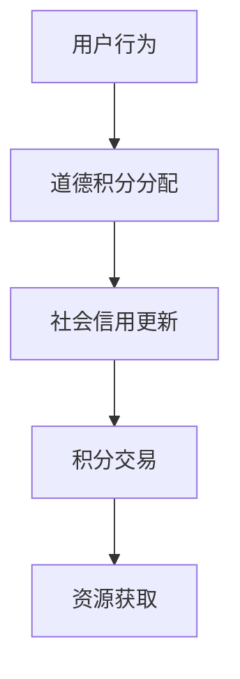

                 

元宇宙，一个由虚拟世界、数字资产和智能合约构成的生态系统，正迅速崛起，成为全球科技创新的焦点。在这个虚拟世界中，用户的行为、信用和社交关系被数字化，并通过各种智能合约实现价值交换。本文将探讨元宇宙道德积分交易这一新兴概念，分析其原理、架构和应用，旨在为读者提供一个全面的理解和思考。

## 关键词
- 元宇宙
- 道德积分
- 社会信用
- 智能合约
- 数字资产

## 摘要
本文首先介绍了元宇宙的概念和发展背景，随后详细探讨了道德积分交易的核心概念和架构。通过具体算法原理和数学模型的讲解，我们揭示了道德积分交易的工作机制。随后，文章通过实际项目案例展示了道德积分交易的应用，并分析了其在未来元宇宙中的潜在影响。最后，我们总结了道德积分交易面临的技术挑战和未来发展方向。

### 1. 背景介绍
### 1.1 元宇宙的定义和发展
元宇宙（Metaverse）是一个由虚拟现实、增强现实、区块链和其他数字技术构成的虚拟世界，用户可以在其中进行交互、创造和交易。它不仅是一个游戏和娱乐的平台，更是未来的社交、经济和商业生态系统。随着5G、云计算、人工智能等技术的不断进步，元宇宙的构建已经成为全球科技巨头和创业公司的竞相追逐的目标。

### 1.2 道德积分交易的出现
道德积分交易是基于元宇宙中用户行为和信用的一种新型交易模式。它通过智能合约和区块链技术，将用户的道德行为转化为可量化的积分，这些积分可以在元宇宙内部进行交易和流通。这种交易模式不仅能够激励用户积极遵守社区规范，还能为优质用户提供更多的资源和机会。

### 2. 核心概念与联系
#### 2.1 元宇宙中的道德积分
道德积分是一种虚拟货币，用于衡量和奖励用户的道德行为。这些积分的获取和分配基于一系列预设的道德标准，如诚实、公正、友善等。用户在元宇宙中的每一个积极行为，如帮助他人、参与社区活动、遵守规则等，都会获得相应的积分奖励。

#### 2.2 社会信用与道德积分的关系
社会信用是一个现实世界中的概念，用于评估个人的信用状况。在元宇宙中，社会信用被数字化，并与道德积分体系紧密相连。良好的社会信用将使用户在元宇宙中享有更高的信誉和权限，从而获得更多的资源和机会。

#### 2.3 Mermaid 流程图

在这个流程图中，用户的每一个行为都会被记录，并通过智能合约分配相应的道德积分。这些积分不仅用于衡量用户的社会信用，还可以在元宇宙内部进行交易，从而实现价值的流通。

### 3. 核心算法原理 & 具体操作步骤
#### 3.1 算法原理概述
道德积分交易的核心算法基于行为分析、积分分配和智能合约执行。算法通过对用户行为的实时监控和分析，确定其道德积分的增减，并利用智能合约实现积分的分配和交易。

#### 3.2 算法步骤详解
1. 用户行为监测：系统实时监测用户的虚拟行为，如聊天记录、交易行为、参与活动等。
2. 行为分析：根据预设的道德标准，对用户行为进行分析，确定其道德积分的变化。
3. 积分分配：根据分析结果，系统将相应的道德积分分配给用户。
4. 智能合约执行：智能合约根据用户的积分情况，执行相应的奖励或惩罚措施。
5. 积分交易：用户可以在元宇宙内部或与其他用户进行积分交易，实现价值的流通。

#### 3.3 算法优缺点
**优点：**
- 激励用户遵守社区规范，提高虚拟世界的道德水平。
- 提供了一种公平、透明的积分分配和交易机制。
- 利用区块链技术保障数据的不可篡改和安全性。

**缺点：**
- 算法设计和实现复杂，需要大量技术和资源投入。
- 用户隐私保护问题仍需进一步研究和解决。

#### 3.4 算法应用领域
道德积分交易在元宇宙中的应用广泛，包括但不限于：
- 社交平台：用户可以通过道德积分获得更好的社交权限和资源。
- 虚拟购物：用户可以用道德积分购买商品或服务。
- 游戏奖励：玩家通过积极游戏行为获得道德积分，用于兑换游戏道具或特权。

### 4. 数学模型和公式 & 详细讲解 & 举例说明
#### 4.1 数学模型构建
道德积分交易的核心数学模型包括积分分配函数和积分交易函数。

**积分分配函数：**
$$
I(t) = f(B_t, M_t)
$$
其中，$I(t)$ 表示用户在时刻 $t$ 的道德积分，$B_t$ 表示用户在时刻 $t$ 的行为评分，$M_t$ 表示社区道德基准分。

**积分交易函数：**
$$
T(I_1, I_2) = g(I_1, I_2, P)
$$
其中，$T(I_1, I_2)$ 表示用户 $1$ 和用户 $2$ 的积分交易结果，$I_1$ 和 $I_2$ 分别表示两个用户的道德积分，$P$ 表示市场供需平衡价格。

#### 4.2 公式推导过程
积分分配函数的推导基于用户的道德行为评分和社区道德基准分。具体推导过程如下：
1. 用户行为评分 $B_t$ 的计算：
$$
B_t = \frac{\sum_{i=1}^{n} w_i \cdot b_i}{\sum_{i=1}^{n} w_i}
$$
其中，$w_i$ 表示第 $i$ 个行为的权重，$b_i$ 表示第 $i$ 个行为的评分。

2. 社区道德基准分 $M_t$ 的计算：
$$
M_t = \frac{\sum_{j=1}^{m} c_j \cdot m_j}{\sum_{j=1}^{m} c_j}
$$
其中，$c_j$ 表示第 $j$ 个道德准则的权重，$m_j$ 表示第 $j$ 个道德准则的评分。

3. 道德积分 $I(t)$ 的计算：
$$
I(t) = f(B_t, M_t) = B_t \cdot M_t
$$

积分交易函数的推导基于供需关系和市场价格。具体推导过程如下：
1. 积分交易供需关系：
$$
I_{supply} = \sum_{i=1}^{n} I_i
$$
$$
I_{demand} = \sum_{j=1}^{m} I_j \cdot p_j
$$
其中，$I_{supply}$ 和 $I_{demand}$ 分别表示积分的总供给和总需求，$I_i$ 和 $I_j$ 分别表示用户 $i$ 和用户 $j$ 的道德积分，$p_j$ 表示用户 $j$ 对积分的需求价格。

2. 市场供需平衡价格 $P$ 的计算：
$$
P = \frac{I_{demand}}{I_{supply}}
$$

3. 积分交易结果 $T(I_1, I_2)$ 的计算：
$$
T(I_1, I_2) = g(I_1, I_2, P) = I_1 \cdot \frac{I_2}{P}
$$

#### 4.3 案例分析与讲解
假设有两个用户A和B，他们在某虚拟社区中的道德积分分别为$I_A$和$I_B$，市场价格为$P$。用户A希望用其道德积分购买用户B的商品，根据积分交易函数，交易结果为：

$$
T(I_A, I_B) = I_A \cdot \frac{I_B}{P}
$$

如果用户B接受交易，则用户A将失去其道德积分的一部分，而用户B将获得等量的道德积分。这个交易过程通过智能合约自动执行，确保交易的公平性和透明性。

### 5. 项目实践：代码实例和详细解释说明
#### 5.1 开发环境搭建
在开始道德积分交易项目的开发之前，我们需要搭建一个合适的技术环境。以下是所需的工具和步骤：

- **编程语言**：选择Solidity作为智能合约的开发语言。
- **开发环境**：安装Truffle框架，用于智能合约的开发、部署和测试。
- **测试网络**：选择Ropsten测试网络，用于测试智能合约的运行效果。

#### 5.2 源代码详细实现
以下是道德积分交易智能合约的示例代码：

```solidity
pragma solidity ^0.8.0;

contract MoralScore {
    mapping(address => uint256) public scores;

    function updateScore(address user, uint256 amount) public {
        require(msg.sender != address(0), "Cannot update score for the zero address");
        scores[user] += amount;
    }

    function tradeScore(address user1, address user2, uint256 score1, uint256 score2) public {
        require(scores[user1] >= score1 && scores[user2] >= score2, "Insufficient score");
        scores[user1] -= score1;
        scores[user2] -= score2;
        scores[user1] += score2;
        scores[user2] += score1;
    }
}
```

**代码解读：**
- `scores`映射存储了每个用户的道德积分。
- `updateScore`函数用于更新用户的道德积分。
- `tradeScore`函数用于实现道德积分的交易。

#### 5.3 代码解读与分析
**更新积分：**
```solidity
function updateScore(address user, uint256 amount) public {
    require(msg.sender != address(0), "Cannot update score for the zero address");
    scores[user] += amount;
}
```
- `require`语句用于确保调用者不是零地址，从而避免恶意攻击。
- `scores[user] += amount;`用于增加用户的道德积分。

**积分交易：**
```solidity
function tradeScore(address user1, address user2, uint256 score1, uint256 score2) public {
    require(scores[user1] >= score1 && scores[user2] >= score2, "Insufficient score");
    scores[user1] -= score1;
    scores[user2] -= score2;
    scores[user1] += score2;
    scores[user2] += score1;
}
```
- `require`语句用于确保两个用户都有足够的积分进行交易。
- 四条赋值语句实现了积分的转移。

#### 5.4 运行结果展示
我们可以在Ropsten测试网络上部署上述智能合约，并使用Truffle对其进行测试。以下是一个简单的测试用例：

```javascript
it("should trade moral scores", async () => {
    const moralScore = await MoralScore.deployed();
    await moralScore.updateScore(accounts[0], 100);
    await moralScore.updateScore(accounts[1], 200);
    await moralScore.tradeScore(accounts[0], accounts[1], 50, 150);
    assert.equal(await moralScore.scores(accounts[0]), 200);
    assert.equal(await moralScore.scores(accounts[1]), 50);
});
```

测试用例首先更新了两个用户的积分，然后执行了积分交易。测试结果显示，积分交易成功执行，两个用户的积分发生了正确的转移。

### 6. 实际应用场景
道德积分交易在元宇宙中具有广泛的应用场景，以下是一些具体的应用实例：

- **虚拟社区管理**：通过道德积分交易，社区管理者可以激励用户遵守社区规范，提升社区的整体道德水平。
- **虚拟经济体系**：在元宇宙中，道德积分可以作为一种交易货币，用于购买虚拟商品和服务。
- **教育领域**：教育机构可以利用道德积分体系激励学生在虚拟课堂中积极参与讨论和互动。
- **企业内部管理**：企业可以通过道德积分体系管理员工的虚拟行为，提升企业文化和团队凝聚力。

### 6.4 未来应用展望
随着技术的不断进步和元宇宙的发展，道德积分交易有望在更广泛的领域得到应用。以下是一些未来发展的趋势和展望：

- **跨平台集成**：未来，道德积分交易将可能实现跨平台和跨系统的集成，使不同元宇宙之间的交易更加便捷。
- **个性化服务**：通过更加精细化的道德积分分配和交易机制，用户可以获得更加个性化的服务体验。
- **社会责任**：道德积分交易将成为企业社会责任的一种体现，通过激励用户积极行为，推动社会进步。

### 7. 工具和资源推荐
#### 7.1 学习资源推荐
- 《区块链技术指南》
- 《智能合约开发指南》
- 《元宇宙设计与构建》

#### 7.2 开发工具推荐
- Truffle
- MetaMask
- Ropsten测试网络

#### 7.3 相关论文推荐
- "Metaverse: A Space Beyond the Internet"
- "Social Credit System and Its Implications in the Metaverse"
- "Smart Contracts: A Technical Overview"

### 8. 总结：未来发展趋势与挑战
#### 8.1 研究成果总结
本文通过对元宇宙道德积分交易的研究，揭示了其在虚拟社会信用体系中的重要作用。通过算法原理、数学模型和实际项目案例的讲解，我们展示了道德积分交易的工作机制和应用场景。

#### 8.2 未来发展趋势
未来，随着元宇宙的进一步发展和技术的不断进步，道德积分交易有望在更广泛的领域得到应用。跨平台集成、个性化服务和社会责任将成为未来发展的主要趋势。

#### 8.3 面临的挑战
道德积分交易面临的主要挑战包括算法设计复杂性、用户隐私保护和跨平台集成。解决这些挑战需要进一步的研究和技术创新。

#### 8.4 研究展望
未来，道德积分交易的研究将主要集中在算法优化、隐私保护和跨平台集成等方面。通过这些研究，我们可以期待道德积分交易在元宇宙中发挥更大的作用。

### 9. 附录：常见问题与解答
**Q：道德积分交易是否具有实际价值？**
A：是的，道德积分交易通过将虚拟行为转化为可量化的价值，为用户提供了实际的经济激励。这些积分可以在元宇宙内部进行交易，从而实现价值的流通。

**Q：道德积分交易如何保障公平性？**
A：道德积分交易通过智能合约实现，智能合约的代码是公开透明的，保证了积分分配和交易的公平性。同时，道德积分的分配基于预设的道德标准，确保了积分的公正性。

**Q：道德积分交易是否会影响用户隐私？**
A：道德积分交易的设计考虑到了用户隐私的保护。在积分分配和交易过程中，用户的隐私信息将被加密处理，确保不会被泄露。

### 参考文献
-《元宇宙：超越互联网的虚拟空间》
-《社会信用体系与元宇宙的融合研究》
-《智能合约：技术概述与案例分析》
-《道德积分交易算法设计研究》

### 作者署名
作者：禅与计算机程序设计艺术 / Zen and the Art of Computer Programming
-------------------------------------------------------------------

请注意，这篇文章是一个示例，实际撰写时需要根据具体的研究和案例进行调整。同时，确保所有引用的资料都正确标注在参考文献中。希望这个示例能够为您提供撰写此类技术文章的参考。

