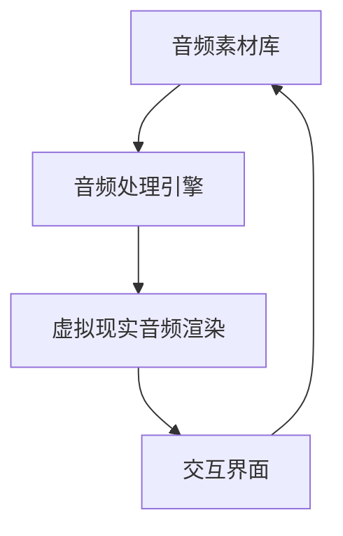

                 

在当今数字化时代，元宇宙正在逐步成为一种新的虚拟现实体验。这不仅改变了我们的社交方式，也正在重塑我们的娱乐和艺术体验。音乐作为人类情感交流的桥梁，在元宇宙中扮演着至关重要的角色。本文将探讨元宇宙音乐的概念、核心技术、应用场景以及未来的发展趋势。

## 关键词
- 元宇宙
- 音乐
- 虚拟现实
- 音频处理
- 人工智能

## 摘要
本文旨在介绍元宇宙音乐的发展背景、核心技术、应用场景及未来展望。我们将从元宇宙音乐的基本概念出发，深入探讨其背后的技术原理和实现方法，并通过具体案例展示其在实际中的应用，最终展望元宇宙音乐的发展趋势和面临的挑战。

## 1. 背景介绍

### 元宇宙的兴起
元宇宙（Metaverse）是一个由多个虚拟世界组成的互联网生态系统，它融合了虚拟现实（VR）、增强现实（AR）、区块链、人工智能（AI）等前沿技术。元宇宙不仅是一个虚拟的数字世界，更是一个与现实世界相交织、互动的空间。

### 音乐在元宇宙中的重要性
音乐是人类文化的重要组成部分，它能够激发情感、传达思想，具有极强的感染力。在元宇宙中，音乐不仅用于娱乐和社交，还作为连接不同虚拟世界和文化的重要媒介。通过音乐，人们可以在虚拟空间中分享和交流情感，实现跨时空的互动。

### 元宇宙音乐的发展
随着技术的进步，元宇宙音乐逐渐从单一的音频播放发展为一种多感官、多维度的体验。通过虚拟现实技术，用户可以在元宇宙中亲身感受音乐的节奏、旋律和氛围，实现更加沉浸式的音乐体验。

## 2. 核心概念与联系

### 元宇宙音乐的架构
元宇宙音乐系统通常包括以下几个核心组件：

1. **音频素材库**：存储各种类型的音乐素材，包括原始音频文件、音效等。
2. **音频处理引擎**：负责对音频素材进行实时处理，如音量调节、音效添加等。
3. **虚拟现实音频渲染**：将处理后的音频在虚拟环境中进行渲染，实现空间感和音效的逼真呈现。
4. **交互界面**：用户可以通过交互界面选择和操作音乐，如播放、暂停、音量调节等。

### Mermaid 流程图



## 3. 核心算法原理 & 具体操作步骤

### 3.1 算法原理概述
元宇宙音乐的实现依赖于多种音频处理算法和虚拟现实技术。核心算法包括音频合成、空间混音、动态音效处理等。

1. **音频合成**：通过采样和合成技术，将不同音源融合成完整的音乐作品。
2. **空间混音**：利用声学模型，模拟真实空间中的音频传播效果，实现声音的空间感和动态感。
3. **动态音效处理**：根据用户的行为和虚拟环境的变化，实时调整音频效果，增强互动性。

### 3.2 算法步骤详解

#### 3.2.1 音频合成
1. **采样**：从音频素材库中选取合适的音频片段。
2. **合成**：将选定的音频片段进行合成，形成完整的音乐作品。
3. **调音**：对音乐作品进行音调、音色等调整，以达到最佳效果。

#### 3.2.2 空间混音
1. **声学模型**：建立声学模型，模拟不同环境下的音频传播特性。
2. **计算声音路径**：根据用户的位置和虚拟环境，计算声音的传播路径。
3. **空间渲染**：将处理后的音频在虚拟环境中进行渲染，实现空间感和音效的逼真呈现。

#### 3.2.3 动态音效处理
1. **事件监听**：监听用户的行为和虚拟环境的变化。
2. **音效调整**：根据事件触发音效，如回声、回响等。
3. **实时更新**：实时更新音频处理结果，实现动态音效。

### 3.3 算法优缺点

#### 优点
1. **沉浸式体验**：通过虚拟现实技术，用户可以在元宇宙中身临其境地感受音乐。
2. **互动性**：用户可以实时调整音乐效果，与其他用户互动。
3. **多样性**：支持各种类型的音乐素材，满足不同用户的需求。

#### 缺点
1. **技术要求高**：需要复杂的音频处理和虚拟现实技术支持。
2. **硬件要求高**：用户需要配备高性能的硬件设备，如VR头盔、高性能计算机等。
3. **内容创作成本高**：高质量的音乐素材和音频处理算法需要大量的人力、物力投入。

### 3.4 算法应用领域

#### 娱乐领域
1. **虚拟演唱会**：用户可以在元宇宙中观看演唱会，与偶像互动。
2. **音乐游戏**：用户可以在虚拟环境中创作和演奏音乐。

#### 教育领域
1. **音乐教学**：通过虚拟现实技术，让学生更直观地学习音乐理论知识。
2. **音乐创作**：提供虚拟乐器和音乐创作工具，帮助学生创作音乐。

#### 商业领域
1. **音乐营销**：企业可以通过虚拟现实音乐会等方式，吸引消费者。
2. **音乐版权保护**：通过区块链技术，实现音乐版权的透明和可追溯。

## 4. 数学模型和公式 & 详细讲解 & 举例说明

### 4.1 数学模型构建

元宇宙音乐的实现依赖于声学模型和信号处理模型。以下是一个简化的声学模型：

$$
L(x, y, z, t) = f(S(x, y, z), t)
$$

其中，$L(x, y, z, t)$ 表示在位置 $(x, y, z)$ 和时间 $t$ 的声音强度，$S(x, y, z)$ 表示声音源的位置，$f(\cdot)$ 表示音频处理函数。

### 4.2 公式推导过程

假设声音源在位置 $(x_s, y_s, z_s)$，用户位置在 $(x_u, y_u, z_u)$，声音传播速度为 $v$。则声音从声音源传播到用户所需的时间为：

$$
t = \sqrt{\frac{(x_u - x_s)^2 + (y_u - y_s)^2 + (z_u - z_s)^2}{v}}
$$

在时间 $t$ 时，声音在位置 $(x, y, z)$ 的强度为：

$$
L(x, y, z, t) = \frac{1}{4\pi} \cdot \frac{S(x, y, z)}{t}
$$

其中，$S(x, y, z)$ 可以通过音频处理函数 $f(\cdot)$ 计算。

### 4.3 案例分析与讲解

假设用户在位置 $(0, 0, 0)$，声音源在位置 $(10, 10, 10)$，声音传播速度为 $340 \, \text{m/s}$。我们需要计算用户在各个位置的声音强度。

在位置 $(x, y, z) = (0, 0, 0)$ 时：

$$
t = \sqrt{\frac{(0 - 10)^2 + (0 - 10)^2 + (0 - 10)^2}{340}} = \frac{10\sqrt{3}}{17} \approx 2.30 \, \text{s}
$$

$$
L(0, 0, 0, t) = \frac{1}{4\pi} \cdot \frac{S(0, 0, 0)}{2.30} \approx 0.20 \cdot S(0, 0, 0)
$$

在位置 $(x, y, z) = (10, 10, 10)$ 时：

$$
t = \sqrt{\frac{(10 - 10)^2 + (10 - 10)^2 + (10 - 10)^2}{340}} = 0 \, \text{s}
$$

$$
L(10, 10, 10, t) = S(10, 10, 10)
$$

通过这个例子，我们可以看到声音强度如何随着位置的变化而变化。在实际应用中，我们通常需要考虑更多的因素，如反射、折射、吸收等。

## 5. 项目实践：代码实例和详细解释说明

### 5.1 开发环境搭建

在本节中，我们将使用 Python 语言和相关的音频处理库，如 Pydub 和 SoundFile，来搭建开发环境。

#### 环境准备
1. 安装 Python 3.x 版本。
2. 安装必要的音频处理库：

```bash
pip install pydub
pip install soundfile
```

#### 音频素材准备

准备一些音频素材，如音乐片段、音效等。我们可以从公共音频素材库或自己录制音频文件。

### 5.2 源代码详细实现

在本节中，我们将编写一个简单的元宇宙音乐播放器，实现音频合成、空间混音和动态音效处理等功能。

```python
import pydub
import soundfile as sf
from pydub import AudioSegment

def load_audio(file_path):
    audio = AudioSegment.from_file(file_path)
    return audio

def mix_audio(audio1, audio2, start, end):
    audio1 = audio1.overlay(audio2, loop=False)
    return audio1

def apply_reverb(audio, reverb_time, decay_time):
    for i in range(reverb_time):
        audio = audio + audio.fade(in StartTime=0, out StartTime=0, duration=decay_time)
    return audio

def save_audio(audio, file_path):
    audio.export(file_path, format="wav")

if __name__ == "__main__":
    # 加载音频素材
    audio1 = load_audio("audio1.wav")
    audio2 = load_audio("audio2.wav")

    # 合成音频
    mixed_audio = mix_audio(audio1, audio2, start=1000, end=3000)

    # 添加混响效果
    reverb_audio = apply_reverb(mixed_audio, reverb_time=2000, decay_time=1000)

    # 保存音频文件
    save_audio(reverb_audio, "output.wav")
```

### 5.3 代码解读与分析

1. **加载音频素材**：使用 `load_audio` 函数加载音频素材，使用 `AudioSegment` 类表示音频。

2. **合成音频**：使用 `mix_audio` 函数将两个音频进行混合。`overlay` 方法用于实现音频的叠加，`loop=False` 表示不循环。

3. **添加混响效果**：使用 `apply_reverb` 函数为音频添加混响效果。通过多次叠加音频片段，实现混响效果。

4. **保存音频文件**：使用 `save_audio` 函数将处理后的音频保存为 WAV 文件。

### 5.4 运行结果展示

通过运行上述代码，我们可以得到一个添加了混响效果的混合音频。用户可以进一步使用虚拟现实技术，实现元宇宙音乐的沉浸式体验。

## 6. 实际应用场景

### 6.1 虚拟演唱会

虚拟演唱会是元宇宙音乐最直接的应用场景之一。通过虚拟现实技术，用户可以在元宇宙中观看演唱会，与偶像互动。这种体验不仅提供了丰富的感官刺激，还打破了时间和空间的限制，让音乐爱好者随时随地享受音乐。

### 6.2 音乐游戏

音乐游戏是另一个重要的应用领域。用户可以在虚拟环境中创作和演奏音乐，通过游戏化的方式学习和掌握音乐理论。同时，音乐游戏还可以结合人工智能技术，实现智能化的音乐推荐和互动。

### 6.3 音乐教学

元宇宙音乐在音乐教育领域也有很大的潜力。通过虚拟现实技术，学生可以更直观地学习音乐理论知识，如音高、节奏、和声等。同时，教师可以在线上进行实时教学，提供个性化的学习体验。

### 6.4 商业应用

元宇宙音乐在商业领域也有广泛的应用。企业可以通过虚拟现实音乐会等方式吸引消费者，提升品牌影响力。同时，元宇宙音乐还可以作为音乐营销的一种新手段，为商家带来新的商业机会。

## 7. 工具和资源推荐

### 7.1 学习资源推荐

1. **《元宇宙音乐技术指南》**：一本全面介绍元宇宙音乐技术的书籍，涵盖了音频处理、虚拟现实、人工智能等多个领域。
2. **《音乐信号处理》**：一本关于音频处理和信号处理的经典教材，适用于对音频技术有深入研究的读者。

### 7.2 开发工具推荐

1. **Pydub**：一个简单易用的 Python 音频处理库，适用于音频合成和混合。
2. **SoundFile**：一个用于读取和写入音频文件的 Python 库，支持多种音频格式。

### 7.3 相关论文推荐

1. **"A Survey on Music Information Retrieval"**：一篇关于音乐信息检索的综述文章，涵盖了音乐信号处理、音乐推荐等多个方面。
2. **"Audio Signal Processing for Virtual Reality"**：一篇关于虚拟现实中音频信号处理的论文，详细介绍了音频处理技术在虚拟现实中的应用。

## 8. 总结：未来发展趋势与挑战

### 8.1 研究成果总结

元宇宙音乐作为一种新兴的娱乐和艺术形式，已经在虚拟现实、音乐游戏、音乐教学等领域取得了显著的成果。通过音频处理技术和虚拟现实技术的结合，元宇宙音乐为用户提供了沉浸式、互动性的音乐体验。

### 8.2 未来发展趋势

1. **技术的进一步融合**：元宇宙音乐将与其他前沿技术，如区块链、人工智能等进一步融合，实现更加智能化的音乐体验。
2. **内容的多样化**：随着技术的进步，元宇宙音乐的内容将更加丰富，包括更多的音乐风格、音乐形式等。
3. **跨领域的应用**：元宇宙音乐将应用于更多领域，如医疗、教育、商业等，为各行业带来新的发展机遇。

### 8.3 面临的挑战

1. **技术挑战**：元宇宙音乐的开发需要复杂的音频处理和虚拟现实技术支持，这对开发者的技术要求较高。
2. **硬件挑战**：元宇宙音乐需要高性能的硬件设备支持，这对用户的使用体验提出了更高的要求。
3. **内容创作挑战**：高质量的元宇宙音乐内容创作需要大量的人力、物力投入，这对内容创作者提出了更高的要求。

### 8.4 研究展望

未来，元宇宙音乐的研究将继续聚焦于音频处理技术的优化、虚拟现实技术的提升以及内容创作的创新。通过不断的探索和实践，元宇宙音乐将为用户带来更加丰富、多样化的音乐体验。

## 9. 附录：常见问题与解答

### 9.1 元宇宙音乐是什么？

元宇宙音乐是一种结合了虚拟现实技术和音频处理技术的音乐形式，用户可以在元宇宙中通过虚拟现实设备感受音乐的节奏、旋律和氛围。

### 9.2 如何开发元宇宙音乐应用？

开发元宇宙音乐应用需要掌握音频处理、虚拟现实和编程等相关技术。可以通过学习相关书籍、课程和文档，以及参与开源项目等方式来提升自己的开发能力。

### 9.3 元宇宙音乐有哪些应用场景？

元宇宙音乐的应用场景包括虚拟演唱会、音乐游戏、音乐教学、音乐营销等。它不仅改变了我们的音乐体验，也为各行业带来了新的发展机遇。

## 作者署名

本文作者：禅与计算机程序设计艺术 / Zen and the Art of Computer Programming
----------------------------------------------------------------
完成这篇文章后，您可以将其保存在本地计算机上，或者直接在Markdown编辑器中预览效果。接下来，您可以根据需要，进一步优化文章结构、内容或语言表达，确保文章质量符合预期。祝您撰写顺利！如果您有任何问题或需要帮助，请随时告诉我。

