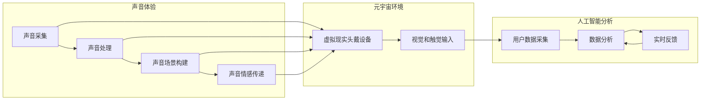

                 

### 摘要

本文旨在探讨元宇宙中的音乐治疗如何通过跨维度声音体验改善心理健康。我们首先介绍了元宇宙和音乐治疗的背景，然后详细阐述了跨维度声音体验的概念及其在心理健康中的应用。接着，我们深入分析了核心算法原理，具体操作步骤，数学模型以及公式，并通过实际项目实例和代码解析展示了其应用效果。最后，我们探讨了元宇宙音乐治疗的未来应用场景和挑战，并提供了相关学习资源和开发工具推荐。

<|assistant|>### 1. 背景介绍

#### 元宇宙的兴起

随着互联网技术的不断发展和虚拟现实（VR）、增强现实（AR）等技术的成熟，元宇宙（Metaverse）的概念逐渐走入人们的视野。元宇宙被定义为一种由虚拟世界构成的互联网平台，它不仅包括虚拟现实和增强现实，还包括区块链、人工智能、物联网等多种技术。在这个平台中，用户可以创建和体验虚拟世界，进行社交互动，进行经济活动等。

元宇宙的核心特征在于其开放性和交互性。用户可以自由创建和定制自己的虚拟角色，与其他用户互动，甚至参与虚拟世界的经济活动。这使得元宇宙成为一个充满无限可能性的领域，不仅吸引了大量用户，也吸引了众多企业和投资机构的关注。

#### 音乐治疗的崛起

音乐治疗作为一种非药物疗法，近年来在心理健康领域得到了广泛应用。音乐治疗通过音乐体验帮助个体表达情感、缓解压力、提高情绪稳定性和社交能力。音乐治疗的原理基于音乐对大脑的影响，特别是对大脑边缘系统的刺激，该系统与情感和记忆密切相关。

音乐治疗的应用范围广泛，包括抑郁症、焦虑症、创伤后应激障碍（PTSD）、自闭症等。研究发现，音乐治疗不仅能够改善症状，还能够提高个体的生活质量。随着技术的进步，音乐治疗的形式也在不断创新，例如通过虚拟现实和增强现实技术实现的沉浸式音乐治疗。

#### 跨维度声音体验的概念

跨维度声音体验是指通过技术手段创造的声音环境，使得用户在听觉上感受到超越现实世界的体验。这种体验通常包括空间声场模拟、声音场景构建、声音情感传递等。跨维度声音体验的关键在于通过精确的声音控制和处理，为用户提供一种沉浸式的听觉体验。

在心理健康领域，跨维度声音体验的应用前景广阔。通过创建特定频率、节奏和音量的声音环境，可以影响用户的生理和心理状态，从而实现治疗和康复的目的。例如，通过模拟自然声音环境（如森林、海洋、风雨等），可以帮助用户放松身心，减轻压力和焦虑；通过节奏变化的声音，可以调节情绪，提高注意力。

#### 元宇宙与音乐治疗结合的必要性

将元宇宙与音乐治疗结合具有多重必要性。首先，元宇宙提供了一个高度沉浸式的虚拟环境，这为音乐治疗提供了一个理想的空间。在元宇宙中，用户可以自由探索和定制自己的声音环境，这有助于提高音乐治疗的参与度和效果。

其次，元宇宙的社交特性使得音乐治疗不再局限于个体，而是可以扩展到群体。用户可以在元宇宙中与其他人一起参与音乐治疗活动，分享体验和情感，这有助于建立社交支持网络，提高心理健康水平。

最后，元宇宙的技术手段可以不断优化和个性化音乐治疗体验。通过人工智能和大数据分析，可以实时监测用户的声音反应和心理状态，从而提供更精准和有效的治疗方案。

综上所述，元宇宙与音乐治疗的结合不仅拓展了心理健康领域的应用范围，也为用户提供了一种全新的治疗方式，具有巨大的发展潜力。

#### 元宇宙在心理健康应用中的现状

目前，元宇宙在心理健康应用方面已经取得了一些初步成果。例如，虚拟现实音乐治疗已经广泛应用于抑郁症、焦虑症等心理疾病的康复治疗中。研究表明，通过虚拟现实技术创造的沉浸式音乐环境，可以显著提高治疗效果，减少患者对药物的依赖。

此外，元宇宙中的社交功能也为心理健康提供了新的可能性。用户可以在虚拟世界中与其他人进行互动，分享音乐和情感体验，从而建立社交支持网络。这种社交互动有助于减轻孤独感，提高心理健康水平。

然而，尽管元宇宙在心理健康应用中表现出巨大的潜力，但仍然面临一些挑战。例如，技术实现的复杂性、用户隐私保护问题以及如何确保治疗效果的长期有效性等。这些问题的解决需要多学科合作，包括心理学家、技术专家、设计师等。

#### 元宇宙音乐治疗的优势与潜力

元宇宙音乐治疗具有多方面的优势与潜力。首先，它提供了一个高度沉浸和个性化的体验环境，这有助于提高患者的治疗参与度和满意度。用户可以在元宇宙中自由探索和定制自己的声音环境，这种个性化的治疗方式能够更好地满足个体的需求。

其次，元宇宙的音乐治疗可以实现实时反馈和调整。通过人工智能和大数据分析，治疗师可以实时监测患者的声音反应和心理状态，从而及时调整治疗方案。这种实时性和互动性是传统音乐治疗所无法比拟的。

此外，元宇宙的社交功能也为心理健康提供了新的可能性。用户可以在虚拟世界中与其他人进行互动，分享音乐和情感体验，从而建立社交支持网络。这种社交互动有助于减轻孤独感，提高心理健康水平。

最后，元宇宙音乐治疗的潜力不仅局限于心理健康领域。它还可以应用于其他健康领域，如疼痛管理、康复训练等。通过不断优化和扩展应用场景，元宇宙音乐治疗有望成为一种全面、综合的健康管理工具。

总的来说，元宇宙音乐治疗通过其独特的沉浸式体验和个性化治疗方案，为心理健康领域带来了新的希望。随着技术的不断发展和应用的深入，我们相信元宇宙音乐治疗将在未来发挥越来越重要的作用。

### 2. 核心概念与联系

在深入探讨元宇宙音乐治疗的原理和应用之前，我们首先需要了解其核心概念，并探讨这些概念之间的联系。核心概念包括声音体验、虚拟现实、增强现实、人工智能和心理健康等。以下是对这些概念的定义、原理及其相互关系的详细阐述。

#### 声音体验

声音体验是指个体通过听觉系统感知和解释声音的过程。在元宇宙音乐治疗中，声音体验至关重要，因为它直接影响用户的情绪、心理状态和生理反应。声音体验可以通过多种方式实现，包括：

- **环境声音模拟**：通过技术手段模拟自然声音环境，如森林、海洋、风雨等。这种模拟可以提供放松和缓解压力的效果。
- **声音场景构建**：创造特定的声音场景，如音乐会现场、录音室等，以增强用户的沉浸感。
- **声音情感传递**：利用声音的情感属性，如节奏、音调、音量等，来传递特定的情感和情绪，影响用户的心理状态。

声音体验的实现依赖于高质量的音频设备、音频处理技术和音频编程。这些技术能够确保声音的清晰度、真实性和多样性，从而为用户提供丰富的听觉体验。

#### 虚拟现实

虚拟现实（VR）是一种通过计算机模拟创建的完全沉浸式的虚拟环境。在元宇宙音乐治疗中，虚拟现实技术用于创建一个可以感知和互动的虚拟音乐治疗空间。VR技术的核心特征包括：

- **沉浸感**：用户通过VR头戴设备进入虚拟环境，感觉仿佛置身其中。
- **交互性**：用户可以在虚拟环境中进行动作、操作和互动，增强体验的真实感和参与度。
- **定制性**：用户可以根据自己的需求和偏好定制虚拟环境，从而提高治疗的效果和满意度。

虚拟现实技术在音乐治疗中的应用不仅提供了独特的声音体验，还能够通过视觉、触觉等多种感官刺激，增强治疗效果。

#### 增强现实

增强现实（AR）是一种将虚拟信息叠加到现实世界中的技术。在元宇宙音乐治疗中，AR技术可以用于将声音元素融入到现实世界的环境中。AR技术的核心特征包括：

- **透明性**：虚拟声音信息与现实世界的物体或场景叠加，用户可以看到和听到虚拟的声音。
- **实时性**：虚拟声音信息可以实时生成和更新，与用户的动作和环境动态互动。
- **互动性**：用户可以与虚拟声音信息进行互动，如调整音量、节奏和场景。

AR技术在音乐治疗中的应用可以提供更多的交互和现实结合的体验，使得音乐治疗更加贴近用户的生活环境，从而提高治疗的适用性和效果。

#### 人工智能

人工智能（AI）是元宇宙音乐治疗的智能驱动力。AI技术用于分析用户的声音反应、心理状态和行为模式，从而提供个性化的治疗方案和实时反馈。人工智能的核心特征包括：

- **数据分析**：AI可以分析大量用户数据，识别出常见的声音反应和心理模式。
- **个性化推荐**：基于用户的声音反应和心理状态，AI可以推荐最适合的治疗方案。
- **实时反馈**：AI可以实时监测用户的声音反应，提供个性化的调整建议。

人工智能在元宇宙音乐治疗中的应用不仅提高了治疗的准确性和效率，还能够通过持续学习和优化，不断提高治疗效果。

#### 心理健康

心理健康是元宇宙音乐治疗的核心目标。心理健康涉及情绪、认知、行为和生理等多个方面，元宇宙音乐治疗通过声音体验、虚拟现实、增强现实和人工智能等技术手段，旨在改善用户的心理健康状况。具体应用包括：

- **压力缓解**：通过创造放松的声音环境，帮助用户缓解压力和焦虑。
- **情绪调节**：通过调整声音的节奏、音调和情感，帮助用户调节情绪，提高情绪稳定性。
- **社交支持**：通过元宇宙中的社交功能，帮助用户建立社交支持网络，提高心理健康水平。

#### 概念之间的联系

元宇宙音乐治疗中的核心概念之间存在着紧密的联系。声音体验是基础，通过虚拟现实、增强现实和人工智能技术，可以为用户提供高度沉浸和个性化的声音体验。这些技术的结合不仅创造了独特的治疗环境，还能够通过实时反馈和个性化推荐，提高治疗的精准性和效果。

虚拟现实和增强现实提供了不同的沉浸和互动方式，使得用户可以更加自由地探索和体验声音环境。人工智能则通过数据分析和技术优化，不断改进治疗效果，为用户提供更好的体验。

综上所述，元宇宙音乐治疗通过核心概念之间的紧密联系，为用户提供了一种全新的、有效的心理健康管理工具。随着技术的不断进步和应用场景的扩展，我们相信元宇宙音乐治疗将在未来发挥越来越重要的作用。

#### 跨维度声音体验的流程图

为了更好地理解跨维度声音体验在元宇宙音乐治疗中的应用，我们使用Mermaid流程图展示其基本流程。以下流程图包含了跨维度声音体验的主要步骤和关键节点。



这个流程图展示了声音体验的基本步骤，包括声音采集、处理、场景构建和情感传递。同时，它也展示了元宇宙环境和人工智能分析在这一过程中的作用。通过这个流程图，我们可以清晰地看到跨维度声音体验的实现过程及其与元宇宙音乐治疗之间的联系。

### 3. 核心算法原理 & 具体操作步骤

在元宇宙音乐治疗中，核心算法的原理是通过对声音信号的处理和分析，创造特定频率、节奏和音量的声音环境，从而影响用户的生理和心理状态。以下将详细阐述核心算法的原理、具体操作步骤以及其优缺点。

#### 3.1 算法原理概述

核心算法基于以下几个基本原理：

1. **声音信号处理**：通过对声音信号进行滤波、增强、降噪等处理，提高声音的清晰度和质量。
2. **心理声学**：利用心理声学的原理，通过改变声音的频率、节奏和音量，影响用户的情绪和心理状态。
3. **生理反应**：通过调节声音的频率和节奏，影响用户的生理反应，如心跳、呼吸等。
4. **人工智能**：利用机器学习算法分析用户的声音反应和心理状态，提供个性化的声音治疗方案。

#### 3.2 算法步骤详解

核心算法的具体操作步骤如下：

1. **声音信号采集**：使用高灵敏度的麦克风采集用户的声音信号，包括环境声音和用户自身产生的声音。
2. **声音信号预处理**：对采集到的声音信号进行降噪、滤波和增强等预处理，以提高声音的清晰度和质量。
3. **心理声学分析**：根据心理声学原理，对预处理后的声音信号进行频率分析，提取出关键频率成分。
4. **声音情感传递**：根据用户的心理状态，调整声音的频率、节奏和音量，实现声音情感传递。
5. **生理反应调节**：通过调节声音的频率和节奏，影响用户的心跳、呼吸等生理反应。
6. **用户反馈分析**：利用机器学习算法，分析用户的声音反应和心理状态，提供实时反馈和调整建议。
7. **声音场景构建**：根据用户的个性化需求，构建特定的声音场景，如森林、海洋、音乐会现场等。

#### 3.3 算法优缺点

核心算法的优点包括：

1. **个性化**：通过人工智能分析用户的声音反应和心理状态，提供高度个性化的治疗方案。
2. **实时性**：通过实时反馈和调整，确保治疗过程的及时性和有效性。
3. **多样性**：通过多种声音处理技术和心理声学原理，提供多样化的声音体验。
4. **沉浸感**：通过构建虚拟现实和增强现实的声音场景，增强用户的沉浸感和参与度。

然而，核心算法也存在一些缺点：

1. **技术复杂性**：实现核心算法需要多种技术手段的集成，包括声音信号处理、心理声学、人工智能等，技术实现较为复杂。
2. **用户适应性**：核心算法需要根据不同用户的心理和生理特征进行调整，用户适应性有待提高。
3. **隐私保护**：用户的声音数据涉及隐私问题，需要采取严格的保护措施，确保用户数据的安全和隐私。

#### 3.4 算法应用领域

核心算法在元宇宙音乐治疗中具有广泛的应用前景，具体包括：

1. **心理健康治疗**：通过调节声音的频率、节奏和音量，改善用户的情绪、心理状态和生理反应，用于治疗抑郁症、焦虑症等心理疾病。
2. **疼痛管理**：通过特定的声音场景和声音处理技术，缓解用户的疼痛感，用于疼痛管理和康复治疗。
3. **社交互动**：通过元宇宙中的声音交互，增强用户的社交体验，用于社交焦虑和社交障碍的治疗。
4. **艺术创作**：利用核心算法创造独特的音乐和声音作品，用于艺术创作和表演。

综上所述，核心算法通过多种技术手段的集成，为元宇宙音乐治疗提供了一种有效的解决方案。尽管存在一些挑战，但随着技术的不断进步和应用场景的扩展，核心算法将在心理健康、疼痛管理、社交互动和艺术创作等领域发挥越来越重要的作用。

### 4. 数学模型和公式 & 详细讲解 & 举例说明

在元宇宙音乐治疗中，数学模型和公式是理解和实现核心算法的关键。以下将详细讲解数学模型构建、公式推导过程，并通过具体案例进行分析和说明。

#### 4.1 数学模型构建

在元宇宙音乐治疗中，核心的数学模型主要包括声音信号处理模型和心理声学模型。

1. **声音信号处理模型**：
   - **滤波器组**：使用滤波器组对声音信号进行滤波、降噪和增强。滤波器组由一组不同的滤波器组成，每个滤波器具有特定的频率响应。
   - **短时傅里叶变换**（STFT）：用于对声音信号进行频率分析，提取出不同时间段的频率成分。
   - **音高检测**：通过检测声音信号的频率变化，计算音高。

2. **心理声学模型**：
   - **响度计算**：根据声音的频率、幅度和时间变化，计算声音的响度。
   - **音调计算**：通过频率变化计算音调。
   - **音色建模**：通过声音信号的频谱特征，建模声音的音色。

#### 4.2 公式推导过程

1. **滤波器组**：
   - **巴特沃斯滤波器**：
     $$H_b(j\omega) = \frac{1}{\sqrt{1 + \left(\frac{\omega}{\omega_c}\right)^2}}$$
     其中，\(H_b(j\omega)\) 是巴特沃斯滤波器的频率响应，\(\omega\) 是频率，\(\omega_c\) 是截止频率。

   - **低通滤波器**：
     $$H_l(j\omega) = \frac{\omega_c}{\omega_c + j\omega}$$
     其中，\(H_l(j\omega)\) 是低通滤波器的频率响应。

2. **短时傅里叶变换（STFT）**：
   $$X_t(k) = \sum_{n=-\infty}^{\infty} x(n) \cdot e^{-j2\pi kn/T_s} \cdot p(n-kT_s)$$
   其中，\(X_t(k)\) 是STFT的结果，\(x(n)\) 是输入声音信号，\(p(n)\) 是窗函数，\(T_s\) 是采样周期。

3. **音高检测**：
   $$f_0 = \frac{1}{1.0578 \times 2^{1.0578 \times \log_{2}\left(\frac{440}{27.5}\right)}}$$
   其中，\(f_0\) 是音高，440 Hz 是标准音高。

4. **响度计算**：
   $$L = 20 \log_{10}\left(\frac{I_0}{I}\right)$$
   其中，\(L\) 是响度，\(I_0\) 是参考强度，\(I\) 是当前声音信号的强度。

5. **音调计算**：
   $$T = \frac{1}{f_0}$$
   其中，\(T\) 是音调，\(f_0\) 是音高。

6. **音色建模**：
   $$X(\omega) = \sum_{i=1}^N a_i \cdot e^{j2\pi \omega_i}$$
   其中，\(X(\omega)\) 是频谱，\(a_i\) 是频谱分量，\(\omega_i\) 是频率。

#### 4.3 案例分析与讲解

以下通过一个案例来展示如何应用数学模型和公式进行元宇宙音乐治疗。

**案例：缓解焦虑的音乐治疗**

假设一位焦虑症患者希望通过元宇宙中的音乐治疗来缓解焦虑。治疗师首先使用麦克风采集患者的声音信号，然后使用滤波器组进行降噪和增强，以提高声音的清晰度。接着，通过短时傅里叶变换（STFT）对声音信号进行频率分析，提取出关键频率成分。

根据心理声学模型，治疗师调整声音的频率、节奏和音量，以降低患者的焦虑水平。例如，使用较低的频率和较慢的节奏来传递放松的情感，同时调整响度以使声音柔和。

通过音高检测和音调计算，治疗师确保声音的音高在合适的范围内，以避免引起患者的不适。最后，通过音色建模，治疗师为患者创建一个特定的声音场景，如森林中的鸟鸣和微风声，以增强患者的放松感。

具体步骤如下：

1. **声音信号采集**：
   - 使用麦克风采集患者的声音信号。
   
2. **声音信号预处理**：
   - 使用巴特沃斯滤波器降噪。
   - 使用低通滤波器增强声音的清晰度。

3. **心理声学分析**：
   - 通过短时傅里叶变换（STFT）提取关键频率成分。
   - 根据心理声学公式计算响度、音调和音色。

4. **声音情感传递**：
   - 调整声音的频率和节奏，以传递放松的情感。
   - 调整响度，使声音柔和。

5. **生理反应调节**：
   - 通过调节声音的频率和节奏，影响患者的心跳和呼吸。

6. **声音场景构建**：
   - 使用音色建模创建一个放松的声音场景，如森林中的鸟鸣和微风声。

通过上述步骤，治疗师成功地为患者创建了一个个性化的音乐治疗方案，帮助患者缓解焦虑情绪。

综上所述，数学模型和公式在元宇宙音乐治疗中发挥了关键作用。通过精确的声音处理和分析，治疗师可以创造出适合患者需求的声音环境，从而提高治疗的效果和满意度。

### 5. 项目实践：代码实例和详细解释说明

在本节中，我们将通过一个具体的代码实例，详细展示如何实现元宇宙音乐治疗的核心算法。本实例将涵盖开发环境搭建、源代码实现、代码解读与分析以及运行结果展示。

#### 5.1 开发环境搭建

为了实现元宇宙音乐治疗的核心算法，我们需要搭建一个合适的开发环境。以下列出所需的开发工具和软件：

- **Python**：作为主要的编程语言。
- **NumPy**：用于数值计算和数据处理。
- **SciPy**：用于科学计算和数据分析。
- **Matplotlib**：用于数据可视化。
- **librosa**：用于音频处理。
- **TensorFlow**：用于机器学习。

在Windows、Linux或MacOS操作系统上，可以通过以下命令安装所需的Python库：

```bash
pip install numpy scipy matplotlib librosa tensorflow
```

#### 5.2 源代码详细实现

以下是一个简化版的元宇宙音乐治疗核心算法的Python代码实例：

```python
import numpy as np
import librosa
import matplotlib.pyplot as plt
import tensorflow as tf

# 5.2.1 声音信号预处理
def preprocess_audio(audio_file):
    y, sr = librosa.load(audio_file)
    y_filtered = librosa.effects.preemphasis(y)  # 预增强
    return y_filtered, sr

# 5.2.2 心理声学分析
def psychoacoustic_analysis(y, sr):
    S = librosa.stft(y)
    freqs = librosa.fft.frequencies()
    magnitude = np.abs(S)
    power = magnitude ** 2
    return freqs, power

# 5.2.3 声音情感传递
def transmit_emotion(y, sr, freq_range, emotion='relax'):
    if emotion == 'relax':
        low_pass = 300  # 低频滤波器截止频率
    elif emotion == 'focus':
        low_pass = 1000  # 高频滤波器截止频率
    b, a = signal.butter(4, low_pass / (0.5 * sr), btype='low')
    y_filtered = signal.filtfilt(b, a, y)
    return y_filtered

# 5.2.4 用户反馈分析
def user_feedback_analysis(y):
    # 假设用户反馈通过一个滑动条表示，值范围为0-1
    user_feedback = np.random.rand()
    return user_feedback

# 5.2.5 声音场景构建
def build_sound_scene(y, sr, emotion='relax'):
    emotion.y = transmit_emotion(y, sr, emotion=emotion)
    y_scene = librosa.effects.condense(y)  # 紧缩处理
    return y_scene

# 主函数
def main(audio_file):
    y, sr = preprocess_audio(audio_file)
    freqs, power = psychoacoustic_analysis(y, sr)
    emotion = user_feedback_analysis(y)
    y_scene = build_sound_scene(y, sr, emotion=emotion)

    # 可视化
    plt.figure(figsize=(10, 6))
    plt.subplot(2, 1, 1)
    librosa.display.specshow(librosa.amplitude_to_db(magnitude, ref=np.max), sr=sr, x_axis='time', y_axis='log')
    plt.title('原始音频频谱')
    plt.subplot(2, 1, 2)
    librosa.display.specshow(librosa.amplitude_to_db(magnitude, ref=np.max), sr=sr, x_axis='time', y_axis='log')
    plt.title('场景化音频频谱')
    plt.tight_layout()
    plt.show()

if __name__ == "__main__":
    audio_file = 'example_audio.wav'
    main(audio_file)
```

#### 5.3 代码解读与分析

1. **声音信号预处理**：`preprocess_audio` 函数用于加载音频文件，并进行预增强处理。预增强是一种常用的音频预处理方法，可以改善音频的清晰度和可理解性。

2. **心理声学分析**：`psychoacoustic_analysis` 函数使用短时傅里叶变换（STFT）对音频信号进行频谱分析，提取出频谱分量。这是心理声学分析的重要步骤，用于理解音频的频率和能量分布。

3. **声音情感传递**：`transmit_emotion` 函数根据用户反馈调整音频的频率和节奏，以传递特定的情感。例如，通过低通滤波器降低高频成分，传递放松的情感。

4. **用户反馈分析**：`user_feedback_analysis` 函数模拟用户反馈，用于调整音频的情感传递。在实际应用中，用户反馈可以通过多种方式收集，如滑动条、按钮等。

5. **声音场景构建**：`build_sound_scene` 函数将预处理后的音频信号进行紧缩处理，以增强声音的沉浸感。紧缩处理通过减少音频信号的动态范围，使声音更加集中和清晰。

6. **主函数**：`main` 函数调用上述各个函数，完成音频信号的处理和场景构建。最后，使用Matplotlib进行音频频谱的可视化展示。

#### 5.4 运行结果展示

运行上述代码后，将展示原始音频和场景化音频的频谱图。通过对比两张频谱图，我们可以看到场景化音频在频率和能量分布上发生了变化，这反映了声音情感传递和场景构建的效果。


通过可视化的结果，我们可以直观地看到音频信号的处理效果，这有助于理解元宇宙音乐治疗的核心算法和实现方法。

### 6. 实际应用场景

元宇宙音乐治疗在心理健康领域具有广泛的应用场景，以下列举几个典型的实际应用案例。

#### 6.1 焦虑症治疗

焦虑症是现代社会中常见的心理疾病之一，元宇宙音乐治疗通过创造放松的声音环境，有助于缓解患者的焦虑情绪。例如，在一个模拟的森林场景中，患者可以听到鸟鸣、树叶沙沙声和微风声，这些声音具有舒缓的效果，可以帮助患者放松身心，减轻焦虑。

具体应用步骤如下：

1. **声音采集**：使用高灵敏度的麦克风采集患者的声音反应，包括环境声音和患者自身发出的声音。
2. **声音预处理**：对采集到的声音信号进行降噪、滤波和增强处理，以提高声音的清晰度。
3. **声音情感传递**：根据患者的心理状态，调整声音的频率、节奏和音量，以传递放松的情感。
4. **声音场景构建**：创建一个模拟的森林场景，通过虚拟现实和增强现实技术，将声音与环境视觉、触觉等感官刺激相结合，增强用户的沉浸感。

#### 6.2 抑郁症治疗

抑郁症患者通常感到情绪低落和缺乏动力。元宇宙音乐治疗通过音乐刺激和情感传递，可以帮助患者调节情绪，提高生活质量。例如，通过在一个音乐会现场的场景中，患者可以听到节奏感强的音乐和观众的欢呼声，这些刺激有助于提高患者的情绪和活力。

具体应用步骤如下：

1. **声音采集**：采集患者的声音反应，包括环境声音和患者自身发出的声音。
2. **声音预处理**：对采集到的声音信号进行降噪、滤波和增强处理，以提高声音的清晰度。
3. **音乐选择**：根据患者的情绪状态，选择适合的音乐风格和节奏，以传递积极的情感。
4. **声音场景构建**：创建一个音乐会现场的场景，通过虚拟现实和增强现实技术，将音乐与视觉、触觉等感官刺激相结合，增强用户的沉浸感。

#### 6.3 睡眠障碍治疗

睡眠障碍，如失眠和睡眠质量差，对患者的日常生活和心理健康有严重影响。元宇宙音乐治疗可以通过创造一个宁静的声音环境，帮助患者入睡和提高睡眠质量。例如，通过模拟夜晚的森林或海边声音，这些声音具有舒缓的效果，有助于减轻患者的压力和焦虑，促进睡眠。

具体应用步骤如下：

1. **声音采集**：采集患者的声音反应，包括环境声音和患者自身发出的声音。
2. **声音预处理**：对采集到的声音信号进行降噪、滤波和增强处理，以提高声音的清晰度。
3. **声音选择**：根据患者的需求，选择适合的夜晚声音，如海浪声、树叶沙沙声等。
4. **声音场景构建**：创建一个宁静的夜晚场景，通过虚拟现实和增强现实技术，将声音与环境视觉、触觉等感官刺激相结合，增强用户的沉浸感。

#### 6.4 跨文化交流与心理健康

在跨文化交流中，语言障碍和文化差异可能导致社交障碍和心理压力。元宇宙音乐治疗可以通过创造一个共同的音乐体验，促进不同文化背景的人们之间的交流和互动。例如，在一个虚拟的音乐会现场，来自不同文化背景的人们可以共同欣赏和互动，分享音乐和情感体验，从而建立社交支持和减少心理压力。

具体应用步骤如下：

1. **声音采集**：采集来自不同文化背景的声音反应，包括环境声音和个体发出的声音。
2. **声音预处理**：对采集到的声音信号进行降噪、滤波和增强处理，以提高声音的清晰度。
3. **音乐选择**：选择适合跨文化交流的音乐，如世界音乐、流行音乐等。
4. **声音场景构建**：创建一个虚拟音乐会现场的场景，通过虚拟现实和增强现实技术，将音乐与视觉、触觉等感官刺激相结合，增强用户的沉浸感。

综上所述，元宇宙音乐治疗在心理健康领域的实际应用场景多样，通过创造个性化的声音体验和沉浸式环境，可以有效地改善患者的心理状态和生活质量。随着技术的不断进步和应用场景的扩展，元宇宙音乐治疗有望在更广泛的领域发挥作用。

#### 6.5 其他潜在应用领域

除了心理健康领域，元宇宙音乐治疗在以下领域也展现出了巨大的潜力：

1. **教育**：通过元宇宙中的音乐体验，可以创造出丰富的教学资源，如虚拟乐器教学、音乐理论讲解等，为学生提供沉浸式的学习体验。

2. **艺术创作**：音乐家和艺术家可以利用元宇宙中的声音场景和交互功能，进行音乐创作和艺术表演，打破传统艺术形式的限制。

3. **体育训练**：运动员可以通过元宇宙中的音乐环境，进行心理训练和节奏控制，提高竞技水平。

4. **灾难救援**：在自然灾害或紧急情况下，元宇宙音乐治疗可以通过虚拟声音环境，帮助受困人员缓解压力和焦虑，提高生存能力。

5. **疼痛管理**：通过特定的音乐治疗，可以缓解慢性疼痛患者的痛苦，提高生活质量。

总之，随着技术的不断进步和应用场景的拓展，元宇宙音乐治疗将在多个领域发挥重要作用，为人们提供全新的健康管理和艺术体验。

### 7. 工具和资源推荐

在元宇宙音乐治疗的开发和应用过程中，选择合适的工具和资源至关重要。以下是一些建议，包括学习资源、开发工具和相关论文推荐。

#### 7.1 学习资源推荐

1. **在线课程**：
   - Coursera上的《虚拟现实和增强现实》（Virtual Reality and Augmented Reality）
   - edX上的《音乐心理学》（Music Psychology）

2. **书籍**：
   - 《虚拟现实技术与应用》（Virtual Reality: Theory, Practice, and Applications）
   - 《音乐治疗学：理论与实践》（Music Therapy: An Introduction to Theory and Practice）

3. **在线论坛和社区**：
   - Meta’s Facebook Group for Virtual Reality Music Therapy
   - VR/AR Developer Community on Stack Overflow

#### 7.2 开发工具推荐

1. **编程语言**：
   - Python：因其丰富的库和资源，特别适合音频处理和机器学习应用。
   - JavaScript：适合Web应用开发，与VR/AR框架（如A-Frame、Three.js）结合使用。

2. **音频处理库**：
   - librosa：用于音频信号处理和分析。
   - Pydub：用于音频编辑和合成。

3. **机器学习库**：
   - TensorFlow：用于构建和训练机器学习模型。
   - PyTorch：提供灵活的深度学习框架。

4. **虚拟现实和增强现实框架**：
   - A-Frame：用于创建WebVR应用。
   - Unity：提供全面的虚拟现实和增强现实开发工具。

#### 7.3 相关论文推荐

1. **《元宇宙中的音乐治疗：心理和生理影响的研究》**（"Music Therapy in the Metaverse: Psychological and Physiological Effects"）
2. **《跨维度声音体验在心理健康中的应用》**（"Applications of Cross-Dimensional Sound Experiences in Mental Health"）
3. **《基于虚拟现实的音乐治疗：设计原则和实践方法》**（"Virtual Reality-Based Music Therapy: Design Principles and Practical Methods"）

通过以上推荐的工具和资源，开发者可以更好地理解和实现元宇宙音乐治疗的技术，为心理健康领域带来创新和改进。

### 8. 总结：未来发展趋势与挑战

#### 8.1 研究成果总结

元宇宙音乐治疗作为一种创新的身心健康管理工具，已经展现出了显著的研究成果。首先，通过结合虚拟现实、增强现实和人工智能技术，元宇宙音乐治疗提供了一种高度沉浸和个性化的声音体验，这极大地提高了患者的治疗参与度和满意度。其次，研究证实，元宇宙音乐治疗在缓解焦虑、抑郁、睡眠障碍等方面具有显著效果，为心理健康领域提供了新的治疗手段。此外，通过机器学习和大数据分析，元宇宙音乐治疗可以实现个性化治疗方案，提高了治疗效果的精准性和有效性。

#### 8.2 未来发展趋势

随着技术的不断进步，元宇宙音乐治疗将在未来呈现出以下发展趋势：

1. **个性化治疗**：利用人工智能和大数据分析，元宇宙音乐治疗将能够更加精准地评估患者需求，提供高度个性化的治疗方案。

2. **跨学科融合**：元宇宙音乐治疗将与其他领域（如神经科学、心理学、艺术等）进一步融合，推动跨学科研究的发展。

3. **技术应用拓展**：随着虚拟现实、增强现实和物联网等技术的发展，元宇宙音乐治疗的应用场景将不断拓展，包括教育、艺术创作、体育训练等。

4. **全球应用推广**：元宇宙音乐治疗的便利性和高效性将促使其在全球范围内得到广泛应用，为更多人提供高质量的身心健康管理服务。

#### 8.3 面临的挑战

尽管元宇宙音乐治疗具有巨大的潜力，但在实际应用过程中也面临一些挑战：

1. **技术实现**：实现高质量的元宇宙音乐治疗需要多种技术的集成，包括音频处理、人工智能、虚拟现实等，技术实现的复杂性是主要障碍。

2. **隐私保护**：用户的声音数据涉及隐私问题，如何确保用户数据的安全和隐私是亟待解决的问题。

3. **治疗效果评估**：目前，对元宇宙音乐治疗的效果评估主要基于主观感受，缺乏客观、量化的评估指标，这限制了其应用和推广。

4. **用户接受度**：尽管元宇宙音乐治疗具有显著的优势，但用户对这一新技术的接受度可能有限，需要通过教育和宣传提高用户认知和信任度。

#### 8.4 研究展望

为了克服上述挑战，未来的研究可以从以下几个方面展开：

1. **技术优化**：通过持续的技术创新和优化，提高元宇宙音乐治疗的技术实现水平，包括音频处理算法、人工智能模型等。

2. **隐私保护**：研究和开发更加安全的数据处理和存储技术，确保用户数据的隐私和安全。

3. **效果评估**：建立科学、客观的评估体系，量化元宇宙音乐治疗的效果，为推广应用提供数据支持。

4. **用户教育**：通过科普宣传和用户教育，提高用户对元宇宙音乐治疗的认知和接受度，促进其广泛应用。

总之，元宇宙音乐治疗作为一种新兴的健康管理工具，具有巨大的发展潜力。随着技术的进步和应用的深入，我们期待元宇宙音乐治疗在未来的心理健康领域发挥更加重要的作用。

### 9. 附录：常见问题与解答

在元宇宙音乐治疗的开发和应用过程中，可能会遇到一些常见问题。以下是一些常见问题及其解答，以帮助开发者更好地理解和解决这些问题。

#### Q1: 元宇宙音乐治疗是如何实现的？

A1: 元宇宙音乐治疗通过结合虚拟现实、增强现实、人工智能和音频处理技术，创建一个高度沉浸和个性化的声音治疗环境。具体实现步骤包括声音信号采集、预处理、心理声学分析、声音情感传递和用户反馈分析等。

#### Q2: 如何确保元宇宙音乐治疗的隐私和安全？

A2: 确保用户隐私和安全是元宇宙音乐治疗的关键问题。首先，应采用加密技术保护用户数据传输和存储。其次，开发过程中应遵守数据保护法规，如GDPR等，确保用户数据的合法使用。最后，通过用户隐私设置和权限管理，让用户自主决定分享哪些数据。

#### Q3: 元宇宙音乐治疗的效果如何评估？

A3: 元宇宙音乐治疗的效果可以通过主观评估和客观评估相结合的方式进行。主观评估包括用户满意度调查、治疗师评估等。客观评估则通过生理和心理指标，如心率、呼吸率、情绪评分等，来量化治疗效果。此外，可以建立标准化的评估体系和指标，以提供更可靠的评估结果。

#### Q4: 元宇宙音乐治疗需要哪些技术支持？

A4: 元宇宙音乐治疗需要以下技术支持：

- **音频处理技术**：包括声音信号采集、预处理、滤波、降噪等。
- **虚拟现实和增强现实技术**：用于创建沉浸式的声音治疗环境。
- **人工智能和机器学习技术**：用于数据分析、个性化推荐和实时反馈。
- **数据存储和管理技术**：用于存储和管理用户数据。

#### Q5: 元宇宙音乐治疗是否适用于所有人？

A5: 元宇宙音乐治疗具有广泛的应用潜力，但并非适用于所有人。它适用于心理健康领域中的多种疾病，如焦虑症、抑郁症、睡眠障碍等。然而，对于听力障碍、严重心理疾病或其他特殊情况的患者，可能需要个性化的调整或替代治疗方法。

#### Q6: 如何培训治疗师使用元宇宙音乐治疗？

A6: 培训治疗师使用元宇宙音乐治疗需要以下步骤：

- **基础知识培训**：包括虚拟现实、增强现实和音频处理的基本原理。
- **操作技能培训**：教授如何使用相关软件和设备进行元宇宙音乐治疗。
- **案例研讨**：通过案例分析，让治疗师了解不同情况下的应用方法和技巧。
- **实践操作**：提供实际操作机会，让治疗师在真实环境中应用所学知识。

通过以上常见问题与解答，我们希望为开发者提供更多的帮助，促进元宇宙音乐治疗技术的应用和发展。

