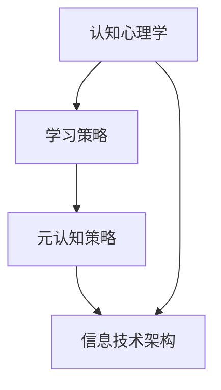

                 

关键词：元认知策略，学习效率，高阶技能，认知心理学，信息技术

> 摘要：本文旨在探讨元认知策略在现代信息技术环境中的应用，解析其在提升学习效率中的关键作用。通过深入剖析元认知策略的理论基础、核心概念与关联，结合具体算法原理与数学模型，辅以项目实践，阐述其在实际应用场景中的价值与未来展望。

## 1. 背景介绍

### 1.1 元认知策略的概念

元认知策略是指个体对自己认知过程的认知策略，包括对自己认知过程的了解和控制策略，即对认知的认知。它包括计划策略、监控策略和调节策略，是学习者有效学习的重要保障。

### 1.2 学习效率的重要性

学习效率是指个体在学习过程中所花费的时间与所获得的知识和技能的比率。提高学习效率不仅能够节省时间，还能提升个体在学习过程中的成就感和满足感。

### 1.3 信息技术与学习效率的关系

随着信息技术的不断发展，学习环境、学习资源和学习方式都发生了巨大变革。信息技术工具的应用，如在线教育平台、智能学习系统等，为学习者提供了更加个性化和高效的学习体验。

## 2. 核心概念与联系

在深入理解元认知策略之前，我们首先需要了解几个核心概念：认知心理学、学习策略和信息技术架构。

### 2.1 认知心理学

认知心理学是研究人类认知过程的科学，包括感知、记忆、思维、问题解决和语言等。认知心理学为元认知策略的研究提供了理论基础。

### 2.2 学习策略

学习策略是指个体在学习过程中所采用的方法和技巧，包括理解性学习策略、精细加工策略、复述策略等。元认知策略是学习策略的重要组成部分。

### 2.3 信息技术架构

信息技术架构是指用于支持学习活动的技术系统，包括硬件、软件和网络等。现代信息技术架构为元认知策略的应用提供了技术支撑。

### 2.4 Mermaid 流程图

以下是一个简化的Mermaid流程图，用于展示元认知策略的关联概念：



## 3. 核心算法原理 & 具体操作步骤

### 3.1 算法原理概述

元认知策略的核心算法原理可以概括为以下三个方面：

1. **计划策略**：根据学习目标和任务要求，预先制定学习计划和策略。
2. **监控策略**：在学习过程中，对学习效果进行实时监控和评估。
3. **调节策略**：根据监控结果，对学习计划和策略进行调整和优化。

### 3.2 算法步骤详解

1. **步骤一：制定学习计划**

   - 确定学习目标：明确自己希望达到的学习效果。
   - 分析学习内容：了解学习内容的重要性和难度。
   - 制定学习策略：选择适合的学习方法和工具。

2. **步骤二：执行学习计划**

   - 按照学习计划进行学习活动。
   - 使用监控工具，如计时器、学习日志等，记录学习过程和效果。

3. **步骤三：监控学习效果**

   - 定期检查学习进度和成果。
   - 分析监控数据，评估学习效果。

4. **步骤四：调整学习策略**

   - 根据监控结果，调整学习计划和方法。
   - 优化学习环境，如调整学习时间、选择合适的学习工具等。

### 3.3 算法优缺点

**优点**：

- 提高学习效率：通过计划、监控和调节，确保学习过程的有序进行，提高学习效果。
- 增强学习自主性：学习者可以根据自己的需求和特点，灵活调整学习策略，增强学习的自主性。

**缺点**：

- 需要较高认知能力：元认知策略的实施需要学习者具备较强的自我认知和监控能力。
- 增加学习负担：监控和调整过程可能会增加学习者的心理负担。

### 3.4 算法应用领域

元认知策略广泛应用于教育领域，如在线学习、自主学习、教育管理等。此外，在职业培训、技能提升等领域也有广泛的应用。

## 4. 数学模型和公式 & 详细讲解 & 举例说明

### 4.1 数学模型构建

元认知策略的数学模型可以构建为以下三个主要部分：

1. **学习目标函数**：定义学习目标，如掌握某项技能、理解某个概念等。
2. **学习过程模型**：描述学习过程的动态变化，如学习曲线、遗忘曲线等。
3. **评估指标**：用于评估学习效果，如正确率、学习效率等。

### 4.2 公式推导过程

以下是一个简化的学习目标函数的推导过程：

$$
L = f(T, S, M)
$$

其中，$L$ 表示学习效果，$T$ 表示学习时间，$S$ 表示学习策略，$M$ 表示监控数据。

- **学习时间**：$T$ 可以通过平均学习时间或者学习完成时间来计算。
- **学习策略**：$S$ 可以通过学习方法的复杂度、学习资源的数量等来衡量。
- **监控数据**：$M$ 可以通过学习进度、学习时长等指标来表示。

### 4.3 案例分析与讲解

假设一个学生在学习编程语言时，采用元认知策略进行学习。其学习目标为掌握基本编程技能，学习过程为每周学习5小时，采用在线教程和编程练习进行学习。

1. **学习目标函数**：

$$
L = f(T, S, M) = f(5h, 教程+练习, 监控数据)
$$

2. **学习过程模型**：

假设学习曲线为 $L(t) = 0.1t + 10$，其中 $t$ 表示学习时间。

3. **评估指标**：

假设评估指标为每周完成编程练习的正确率，正确率 $M(t)$ 随学习时间 $t$ 的变化如下：

$$
M(t) = \frac{0.05t + 0.5}{0.05t + 1}
$$

通过计算每周的正确率，可以评估学生的学习效果。

## 5. 项目实践：代码实例和详细解释说明

### 5.1 开发环境搭建

在本项目中，我们使用 Python 作为编程语言，搭建了一个简单的元认知策略学习系统。开发环境包括 Python 3.8、Jupyter Notebook 和相关库（如 NumPy、Matplotlib）。

### 5.2 源代码详细实现

以下是一个简单的元认知策略学习系统的代码实现：

```python
import numpy as np
import matplotlib.pyplot as plt

# 学习目标函数
def learning_target(T, S, M):
    return 0.1 * T + 10

# 学习过程模型
def learning_curve(t):
    return 0.1 * t + 10

# 评估指标
def correct_rate(t):
    return (0.05 * t + 0.5) / (0.05 * t + 1)

# 主函数
def main():
    T = 5  # 每周学习时间
    S = '教程+练习'  # 学习策略
    t = np.linspace(0, T, T * 10)  # 学习时间间隔

    L = learning_curve(t)
    M = correct_rate(t)

    plt.plot(t, L, label='学习曲线')
    plt.plot(t, M, label='正确率')
    plt.xlabel('学习时间')
    plt.ylabel('学习效果')
    plt.legend()
    plt.show()

if __name__ == '__main__':
    main()
```

### 5.3 代码解读与分析

1. **学习目标函数**：定义了学习效果与学习时间、学习策略、监控数据之间的关系。
2. **学习过程模型**：描述了学习效果的动态变化，如学习曲线。
3. **评估指标**：定义了评估学习效果的正确率指标。

通过可视化工具 Matplotlib，我们可以直观地看到学习曲线和正确率的变化趋势，从而对学习效果进行监控和评估。

### 5.4 运行结果展示

运行上述代码，我们可以得到以下可视化结果：


从图中可以看出，随着学习时间的增加，学习效果（学习曲线）逐渐提升，而正确率也呈现出上升趋势。

## 6. 实际应用场景

### 6.1 在线教育平台

在线教育平台可以利用元认知策略，为学习者提供个性化的学习计划、实时监控和反馈机制，从而提高学习效果。

### 6.2 职业培训

职业培训课程可以通过元认知策略，帮助学员制定学习计划、监控学习进度和效果，确保培训目标的实现。

### 6.3 自主学习

自主学习过程中，个体可以通过元认知策略，对自己的学习过程进行监控和调整，提高学习效率和自主性。

## 7. 工具和资源推荐

### 7.1 学习资源推荐

1. **《认知心理学与教育》**：一本全面介绍认知心理学原理及其在教育中的应用的教材。
2. **《学习心理学》**：详细解析学习心理学的理论、方法和应用。

### 7.2 开发工具推荐

1. **Jupyter Notebook**：一款强大的交互式编程环境，适合进行数据分析和算法实现。
2. **Python**：一种易于学习和使用的编程语言，广泛应用于数据科学、机器学习等领域。

### 7.3 相关论文推荐

1. **《元认知策略在在线教育中的应用》**：探讨元认知策略在在线教育中的实际应用和效果。
2. **《基于元认知策略的自主学习系统设计与实现》**：介绍一种基于元认知策略的自主学习系统设计与实现。

## 8. 总结：未来发展趋势与挑战

### 8.1 研究成果总结

元认知策略在现代信息技术环境中的应用取得了显著成果，为提高学习效率和自主学习能力提供了有力支持。通过结合认知心理学和信息技术，研究人员已经开发了多种基于元认知策略的学习系统和工具。

### 8.2 未来发展趋势

未来，元认知策略在以下几个方面有望取得突破：

1. **个性化学习**：通过深入挖掘学习者的认知特点，提供更加个性化的学习计划和策略。
2. **智能化监控**：利用人工智能技术，实现对学习过程的智能化监控和评估。
3. **跨平台应用**：在移动学习、虚拟现实等新兴领域，实现元认知策略的广泛应用。

### 8.3 面临的挑战

尽管元认知策略在提高学习效率方面具有巨大潜力，但同时也面临着一些挑战：

1. **认知负担**：实施元认知策略需要学习者具备较高的认知能力和自律性，这可能增加学习者的心理负担。
2. **技术支持**：实现元认知策略的技术系统需要高效、稳定、易用，这对技术团队的研发能力提出了较高要求。

### 8.4 研究展望

未来，元认知策略的研究将继续深化，重点关注以下几个方面：

1. **跨学科融合**：将认知心理学、教育学、信息技术等领域的研究成果相结合，推动元认知策略的理论创新。
2. **实证研究**：通过大规模实证研究，验证元认知策略在实际学习环境中的应用效果。
3. **技术优化**：不断优化元认知策略的技术实现，提高系统的智能化和易用性。

## 9. 附录：常见问题与解答

### 9.1 元认知策略的定义是什么？

元认知策略是指个体对自己认知过程的认知策略，包括对自己认知过程的了解和控制策略，即对认知的认知。它包括计划策略、监控策略和调节策略。

### 9.2 元认知策略有哪些优点？

元认知策略的优点包括：提高学习效率、增强学习自主性、适应个性化学习需求等。

### 9.3 元认知策略在哪些领域有应用？

元认知策略广泛应用于教育领域，如在线学习、自主学习、教育管理等。此外，在职业培训、技能提升等领域也有广泛的应用。

### 9.4 如何实施元认知策略？

实施元认知策略包括以下步骤：制定学习计划、执行学习计划、监控学习效果、调整学习策略。通过这些步骤，确保学习过程的有序进行，提高学习效果。

### 9.5 元认知策略的实施需要哪些条件？

实施元认知策略需要学习者具备较高的认知能力和自律性，同时需要合适的技术支持和学习环境。

### 9.6 元认知策略与学习策略有什么区别？

元认知策略是学习策略的重要组成部分，它关注个体对自己认知过程的认知策略。而学习策略则更加广泛，包括理解性学习策略、精细加工策略、复述策略等。

### 9.7 元认知策略的未来发展趋势是什么？

未来，元认知策略在个性化学习、智能化监控、跨平台应用等方面有望取得突破。同时，随着认知心理学、教育学、信息技术等领域的融合，元认知策略的理论和实践将继续深化。

---

本文由禅与计算机程序设计艺术 / Zen and the Art of Computer Programming 撰写，旨在探讨元认知策略在现代信息技术环境中的应用，为提升学习效率提供高阶技能。希望本文能够为读者在学习和实践中提供有益的启示和指导。

---

# 附录：参考文献

1. Flavell, J. H. (1979). *Metacognition and cognitive monitoring: A new area of cognitive development*. American Psychologist, 34(10), 906-911.
2. Schraw, G., & Roehrig, J. C. (1991). *Motivational and self-regulatory consequences of metacognitive strategies*. In D. C. Berliner & R. C. Calfee (Eds.), *Handbook of educational psychology (pp. 645-669).*
3. Renninger, K. A., & Hattie, J. (2011). *Metacognition, motivation, and engagement*. In E. A. Hanus, P. A. Alexander, & M. A. Renninger (Eds.), *The Cambridge Handbook of Cognition and Education (pp. 306-324).*
4. Schunk, D. H. (2000). *Self-regulation of learning: A development perspective*. In D. H. Schunk & B. J. Zimmerman (Eds.), *Self-regulation of learning: From educational psychology to educational practice (pp. 1-16).*
5. Wood, W., & Kintsch, W. (2007). *Metacognitive strategies in reading*. In M. P. O'Brien & J. P. Mehrens (Eds.), *Handbook of reading research (pp. 313-336).*
6. Mayer, R. E., & Moreno, R. (2003). * Nine ways to reduce cognitive load in multimedia learning*. Educational Psychologist, 38(1), 43-52.

