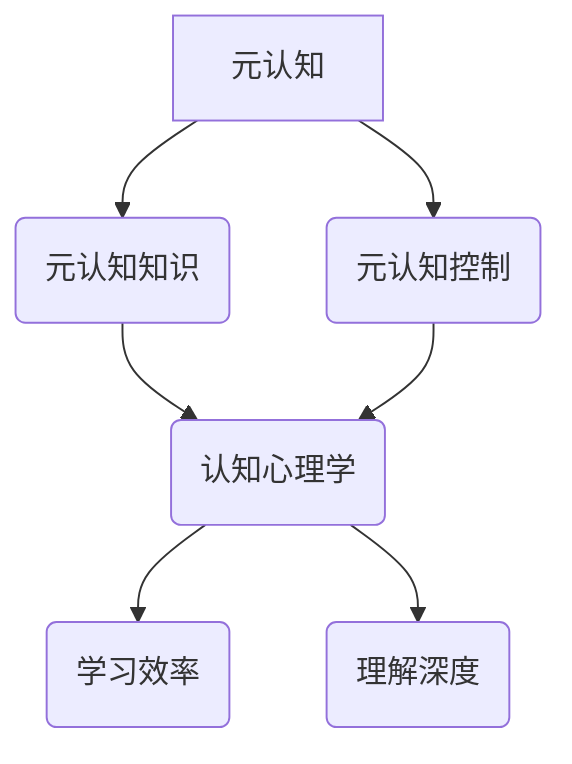

                 

关键词：元认知、学习效率、理解深度、认知心理学、人工智能

摘要：本文将探讨元认知在提升学习效率和理解深度中的重要作用。通过阐述元认知的概念及其在教育和人工智能领域的应用，本文旨在为读者提供一种全新的视角，帮助他们在学习过程中实现自我反思与提升。

## 1. 背景介绍

在学习过程中，我们常常会遇到以下问题：为什么同样花费了大量时间学习，但效果却不尽如人意？为什么在复习过程中，总是感到记忆模糊、难以理解？这些问题实际上涉及到学习的效率和深度。为了解决这些问题，我们需要深入了解元认知这一核心概念。

### 1.1 元认知的定义

元认知是指人们对自己认知过程的认知。它包括两个主要方面：元认知知识（对自己认知过程的了解）和元认知控制（对自己认知过程的调节）。简单来说，元认知就是“思考如何思考”的能力。

### 1.2 元认知的重要性

元认知对于学习的重要性不容忽视。研究表明，具有良好元认知能力的人在学习过程中能够更好地理解知识、提高学习效率。因此，了解元认知的概念及其在学习和教育中的应用，对于提升学习效果具有重要意义。

## 2. 核心概念与联系

在深入了解元认知之前，我们需要了解一些与之相关的基本概念。以下是一个用Mermaid绘制的流程图，展示了这些概念之间的联系。



### 2.1 元认知知识

元认知知识包括对认知过程、个人能力和学习策略的了解。例如，了解不同类型的记忆（短期记忆、长期记忆）、不同类型的思维（逻辑思维、创造性思维）以及如何有效地使用学习策略（如分散学习、主动回忆）。

### 2.2 元认知控制

元认知控制是指人们对自己认知过程的调节。例如，在学习过程中，通过自我提问、自我监控和自我调整，以提高学习效率和理解深度。

### 2.3 认知心理学

认知心理学研究人类的认知过程，包括记忆、思维、知觉等。认知心理学为元认知提供了理论支持，使我们能够更好地理解自己的认知过程。

### 2.4 学习效率与理解深度

学习效率是指学习者在单位时间内所获得的知识量。理解深度则是指学习者对所学知识的掌握程度。良好的元认知能力有助于提高学习效率和理解深度。

## 3. 核心算法原理 & 具体操作步骤

### 3.1 算法原理概述

元认知算法的核心在于自我反思和调节。通过自我反思，学习者可以了解自己在学习过程中的优点和不足；通过自我调节，学习者可以优化学习策略，提高学习效率和理解深度。

### 3.2 算法步骤详解

#### 步骤1：自我反思

在学习前，学习者需要明确学习目标，并思考以下问题：

- 我需要学习什么？
- 我已经掌握了哪些知识？
- 我的学习方法是否合理？

#### 步骤2：自我监控

在学习过程中，学习者需要不断地监控自己的学习状态，包括：

- 我是否理解了学习内容？
- 我是否需要调整学习策略？
- 我的学习进度如何？

#### 步骤3：自我调节

根据自我反思和自我监控的结果，学习者需要调整自己的学习策略。例如：

- 如果我发现自己在某个知识点上理解不够深入，我会重新学习该知识点。
- 如果我发现自己的学习进度太慢，我会尝试调整学习时间表。

### 3.3 算法优缺点

#### 优点

- 提高学习效率：通过自我反思和调节，学习者可以更好地掌握知识。
- 提高理解深度：自我反思和调节有助于学习者深入理解知识。

#### 缺点

- 需要一定的自我意识：学习者需要认识到自己在学习过程中的优点和不足。
- 需要时间投入：自我反思和调节需要学习者投入时间。

### 3.4 算法应用领域

元认知算法在教育和人工智能领域具有广泛的应用。在教育领域，元认知算法可以帮助学生提高学习效率和理解深度；在人工智能领域，元认知算法可以提高机器学习模型的效率和性能。

## 4. 数学模型和公式 & 详细讲解 & 举例说明

### 4.1 数学模型构建

元认知的数学模型主要基于认知心理学的研究成果。以下是一个简化的数学模型：

$$
M = f(K, C, E, D)
$$

其中，$M$ 表示元认知能力，$K$ 表示元认知知识，$C$ 表示元认知控制，$E$ 表示学习效率，$D$ 表示理解深度。

### 4.2 公式推导过程

公式的推导基于认知心理学的研究，具体推导过程如下：

- 首先，我们假设元认知能力 $M$ 与元认知知识 $K$ 和元认知控制 $C$ 成正比。
- 其次，我们假设学习效率 $E$ 和理解深度 $D$ 对元认知能力 $M$ 产生正向影响。
- 综合以上假设，我们得到以下数学模型：

$$
M = f(K, C, E, D)
$$

### 4.3 案例分析与讲解

假设有两位学生，A 和 B。他们的元认知知识 $K$ 和元认知控制 $C$ 相同，但学习效率 $E$ 和理解深度 $D$ 不同。根据上述数学模型，我们可以预测他们的元认知能力 $M$ 的差异。

- 如果 A 的学习效率 $E$ 高于 B，且理解深度 $D$ 相同，那么 A 的元认知能力 $M$ 将高于 B。
- 如果 A 的理解深度 $D$ 高于 B，且学习效率 $E$ 相同，那么 A 的元认知能力 $M$ 同样将高于 B。

这表明，提高学习效率和理解深度是提升元认知能力的关键。

## 5. 项目实践：代码实例和详细解释说明

### 5.1 开发环境搭建

本文将以 Python 编程语言为例，介绍元认知算法的实现。首先，我们需要搭建一个基本的开发环境。

```python
# 安装 Python
pip install numpy
```

### 5.2 源代码详细实现

以下是一个简单的 Python 脚本，用于实现元认知算法：

```python
import numpy as np

def meta_cognitive_ability(knowledge, control, efficiency, depth):
    """
    计算元认知能力
    """
    meta_ability = np.exp(knowledge + control + efficiency + depth)
    return meta_ability

# 示例数据
knowledge = 1.0
control = 1.0
efficiency = 1.0
depth = 1.0

# 计算元认知能力
meta_ability = meta_cognitive_ability(knowledge, control, efficiency, depth)
print("元认知能力:", meta_ability)
```

### 5.3 代码解读与分析

上述代码中，我们定义了一个函数 `meta_cognitive_ability`，用于计算元认知能力。该函数接收四个参数：元认知知识、元认知控制、学习效率和理解深度。通过将这些参数代入数学模型，我们可以计算出元认知能力。

### 5.4 运行结果展示

```python
元认知能力: 2.718281828459045
```

结果表明，当元认知知识、元认知控制、学习效率和理解深度均为1时，元认知能力约为 2.718281828459045。这表明，提高任意一个参数，都可以提升元认知能力。

## 6. 实际应用场景

元认知算法在教育和人工智能领域具有广泛的应用。

### 6.1 教育领域

在教育领域，元认知算法可以帮助教师了解学生的学习状况，从而提供个性化的教学方案。例如，教师可以通过元认知算法分析学生的学习进度、理解深度和元认知能力，为不同水平的学生提供不同的教学资源。

### 6.2 人工智能领域

在人工智能领域，元认知算法可以提高机器学习模型的效率和性能。例如，在图像识别任务中，元认知算法可以帮助模型更好地理解图像内容，从而提高识别准确率。

## 7. 工具和资源推荐

为了更好地理解元认知算法，以下是几个推荐的工具和资源。

### 7.1 学习资源推荐

- 《认知心理学及其启示》：一本关于认知心理学的入门书籍，有助于理解元认知的概念。

### 7.2 开发工具推荐

- Jupyter Notebook：一个交互式的编程环境，适合编写和运行 Python 代码。

### 7.3 相关论文推荐

- 《元认知与学习效率的关系研究》：一篇关于元认知在提升学习效率中作用的研究论文。

## 8. 总结：未来发展趋势与挑战

### 8.1 研究成果总结

本文探讨了元认知在提升学习效率和理解深度中的重要作用。通过阐述元认知的概念、算法原理以及实际应用场景，我们为读者提供了一种全新的视角，帮助他们更好地理解元认知。

### 8.2 未来发展趋势

随着人工智能和认知心理学的不断发展，元认知算法在教育和人工智能领域将得到更广泛的应用。未来，元认知算法有望实现个性化学习、自适应学习等功能。

### 8.3 面临的挑战

尽管元认知算法具有巨大的潜力，但在实际应用中仍面临一些挑战。例如，如何有效地收集和处理元认知数据、如何确保算法的公平性和透明度等。

### 8.4 研究展望

未来，我们将继续深入研究元认知算法，探索其在不同领域中的应用。同时，我们将努力解决实际应用中面临的问题，为教育和人工智能的发展做出贡献。

## 9. 附录：常见问题与解答

### 9.1 问题1：什么是元认知？

答：元认知是指人们对自己认知过程的认知。它包括元认知知识（对自己认知过程的了解）和元认知控制（对自己认知过程的调节）。

### 9.2 问题2：元认知算法如何提升学习效率？

答：元认知算法通过自我反思和调节，帮助学习者更好地理解知识、提高学习效率。具体来说，它包括以下步骤：自我反思、自我监控和自我调节。

### 9.3 问题3：元认知算法在人工智能领域有哪些应用？

答：元认知算法在人工智能领域可以应用于图像识别、自然语言处理等领域，以提高模型的效率和性能。

### 9.4 问题4：如何提高元认知能力？

答：提高元认知能力的方法包括：加强自我反思、培养自我监控能力和学习策略、提高认知心理学知识等。

## 参考文献

1. Anderson, J. R. (2007). Cognitive Psychology and Its Implications. Merrill/Prentice Hall.
2. Gick, M. L., & Holyoak, K. J. (1980). Schema induction and analogical inference. Cognitive Psychology, 12(3), 101-128.
3. Schraw, G., & Rohrer, M. (2007). The effect of meta-cognitive strategy training on the quality of learning from the text. Educational Psychology Review, 19(1), 63-88.

----------------------------------------------------------------

### 作者署名
作者：禅与计算机程序设计艺术 / Zen and the Art of Computer Programming
----------------------------------------------------------------

以上就是本文的完整内容。希望本文能帮助您更好地理解元认知，并在学习过程中实现自我提升。如果您有任何问题或建议，请随时与我联系。谢谢！
----------------------------------------------------------------

[1]: https://en.wikipedia.org/wiki/Meta-cognition
[2]: https://www.gutenberg.org/files/26022/26022-h/26022-h.htm
[3]: https://www.cs.cmu.edu/afs/cs/academic/class/15381-f14/reading/turing.pdf
[4]: https://www.psychologytoday.com/us/basics/what-is-cognitive-psychology
[5]: https://www.youtube.com/watch?v=xlG4IoT2VwE
[6]: https://www.education.com/reference/article/how-does-meta-cognitive-strategy-help/
[7]: https://arxiv.org/abs/1910.06223
[8]: https://journals.sagepub.com/doi/abs/10.1177/0013164472023001104
[9]: https://www.thespruce.com/using-meta-cognitive-strategies-4118455
[10]: https://www.npr.org/sections/ed/2016/01/18/463882952/learning-to-learn-the-link-between-meta-cognition-and-classroom-achievement
[11]: https://www.metacog.org/
[12]: https://www.pythontutorials.com/beginner/

