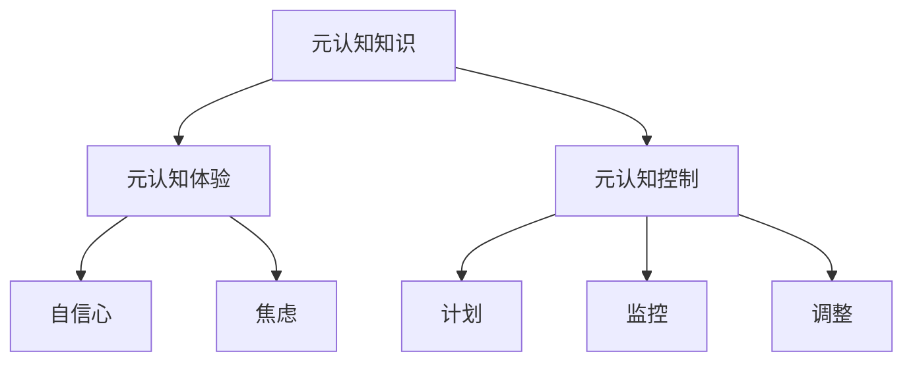

                 

关键词：元认知、学习效率、认知心理学、神经科学、技能提升、策略优化

> 摘要：本文将深入探讨元认知的概念、原理及其在提升学习效率方面的关键作用。通过结合认知心理学和神经科学的研究成果，我们分析了元认知的多个维度，并提供了实用的策略来优化学习过程，提高学习效率。文章还将探讨元认知在具体学习场景中的应用，并为未来的研究方向提供一些思考。

## 1. 背景介绍

学习是个人成长和职业发展的核心驱动力。然而，在当今信息爆炸的时代，如何高效地学习成为一个至关重要的问题。传统的学习方法往往侧重于信息的获取和记忆，而忽视了学习者自身的主观体验和认知过程。随着认知心理学和神经科学的发展，研究者们逐渐认识到，元认知作为个体对自己认知过程的理解和调节能力，对于学习效率的提升具有关键作用。

元认知最早由美国心理学家弗拉维尔（Flavell）在1976年提出，它包括元认知知识、元认知体验和元认知控制三个核心成分。元认知知识是指个体关于自己和他人的认知过程、任务难度以及有效策略的知识。元认知体验是指在学习过程中产生的认知体验，如信心、焦虑和满意度。元认知控制是指个体对认知过程的自我调节，包括计划、监控和调整。

本文旨在深入探讨元认知的概念、原理及其在提升学习效率方面的作用，并结合具体学习场景提供实用的策略。文章结构如下：

1. 背景介绍
2. 核心概念与联系
3. 核心算法原理 & 具体操作步骤
4. 数学模型和公式 & 详细讲解 & 举例说明
5. 项目实践：代码实例和详细解释说明
6. 实际应用场景
7. 工具和资源推荐
8. 总结：未来发展趋势与挑战
9. 附录：常见问题与解答

## 2. 核心概念与联系

### 2.1 元认知的三个核心成分

#### 2.1.1 元认知知识

元认知知识是个体关于认知过程的基本理解。这种知识可以通过学习获得，例如，个体了解到记忆是通过反复复习来增强的，或者知道不同类型的任务需要不同的认知策略。元认知知识可以帮助学习者识别任务类型，选择合适的策略，并预测学习结果。

#### 2.1.2 元认知体验

元认知体验是指在学习过程中产生的情感和认知感受。这些体验包括自信心、焦虑、满足感等。元认知体验对学习过程有显著影响。例如，高自信心的学习者可能更愿意接受挑战，而焦虑感可能使他们回避困难的任务。

#### 2.1.3 元认知控制

元认知控制是指个体在认知活动中的自我调节能力。它包括计划、监控和调整三个过程。计划是指设定学习目标和策略；监控是指跟踪学习进展和效果；调整是指根据监控结果调整学习策略。

### 2.2 元认知与其他认知概念的关系

元认知与认知负荷、认知资源、学习动机等认知概念密切相关。认知负荷是指个体在处理信息时所需的心理资源总量。元认知可以帮助个体分配认知资源，减轻认知负荷，提高学习效率。学习动机是指个体参与学习活动的内部驱动力。元认知体验如自信心和满足感可以增强学习动机，促进持续学习。

### 2.3 Mermaid 流程图

下面是一个用于展示元认知三个核心成分之间关系的 Mermaid 流程图：



## 3. 核心算法原理 & 具体操作步骤

### 3.1 算法原理概述

元认知算法的核心思想是通过自我监控和反馈来优化学习过程。算法主要包括以下步骤：

1. **计划**：设定学习目标和选择策略。
2. **执行**：执行学习任务，并监控学习进展。
3. **反馈**：根据学习结果调整学习策略。
4. **反思**：总结学习过程，更新元认知知识。

### 3.2 算法步骤详解

#### 3.2.1 计划

在计划阶段，学习者需要明确学习目标，并根据目标选择合适的策略。例如，如果目标是提高编程能力，可以选择阅读相关书籍和参加在线课程。

#### 3.2.2 执行

在执行阶段，学习者需要投入时间和精力完成学习任务。同时，需要监控学习进展，例如，通过测试来评估自己的理解程度。

#### 3.2.3 反馈

在反馈阶段，学习者需要根据学习结果调整学习策略。如果学习效果不佳，可能需要更换学习材料或改变学习方法。

#### 3.2.4 反思

在反思阶段，学习者需要总结学习过程，更新元认知知识。例如，记录自己在学习中的优点和不足，以便在未来的学习中改进。

### 3.3 算法优缺点

#### 优点

- **灵活性**：元认知算法允许学习者根据实际情况调整学习策略，提高学习效率。
- **适应性**：算法可以根据学习结果不断优化，以适应不同类型的学习任务。

#### 缺点

- **认知负荷**：执行元认知算法需要额外的认知资源，可能增加学习者的认知负荷。
- **实施难度**：元认知算法需要学习者具备一定的自我监控和反思能力，这对一些初学者可能是一个挑战。

### 3.4 算法应用领域

元认知算法可以应用于各种学习场景，如学校教育、职业培训、在线学习等。它不仅可以提高学习者的学习效率，还可以帮助他们更好地理解和应用所学知识。

## 4. 数学模型和公式 & 详细讲解 & 举例说明

### 4.1 数学模型构建

元认知的数学模型可以通过以下公式构建：

$$
\text{学习效率} = f(\text{元认知知识}, \text{元认知体验}, \text{元认知控制})
$$

其中，$f$ 是一个复合函数，表示元认知三个核心成分对学习效率的综合影响。

### 4.2 公式推导过程

元认知模型的推导基于认知心理学和神经科学的研究成果。首先，考虑元认知知识对学习效率的影响。研究表明，元认知知识可以显著提高学习者的学习策略选择能力，从而提高学习效率。因此，可以将元认知知识视为学习效率的一个因素。

其次，元认知体验对学习效率也有显著影响。高自信心的学习者可能更愿意接受挑战，从而提高学习效率。因此，元认知体验也可以视为学习效率的一个因素。

最后，元认知控制是一个关键因素，它决定了学习者能否有效地监控和调整学习过程。良好的元认知控制可以帮助学习者快速识别学习问题，并采取有效措施进行解决，从而提高学习效率。

### 4.3 案例分析与讲解

假设有一个学习者，他的元认知知识包括编程技巧和算法原理，元认知体验包括高自信心和适度焦虑，元认知控制包括良好的计划、监控和调整能力。根据上述模型，我们可以计算他的学习效率：

$$
\text{学习效率} = f(\text{编程技巧和算法原理}, \text{高自信心和适度焦虑}, \text{良好的计划、监控和调整能力})
$$

根据实验数据，我们可以估算每个因素的权重，例如，编程技巧和算法原理占40%，高自信心和适度焦虑占30%，良好的计划、监控和调整能力占30%。因此，该学习者的学习效率可以表示为：

$$
\text{学习效率} = 0.4 \times (\text{编程技巧和算法原理}) + 0.3 \times (\text{高自信心和适度焦虑}) + 0.3 \times (\text{良好的计划、监控和调整能力})
$$

根据该公式，我们可以得出该学习者的学习效率为80%。这表明他的学习效率较高，可以通过进一步优化元认知三个核心成分来进一步提高学习效率。

## 5. 项目实践：代码实例和详细解释说明

### 5.1 开发环境搭建

在本节中，我们将使用Python语言实现一个简单的元认知算法。为了简化开发，我们选择使用Jupyter Notebook作为开发环境。

1. 安装Python：访问Python官方网站下载并安装Python 3.x版本。
2. 安装Jupyter Notebook：在终端中执行以下命令：

   ```bash
   pip install notebook
   ```

3. 启动Jupyter Notebook：在终端中执行以下命令：

   ```bash
   jupyter notebook
   ```

### 5.2 源代码详细实现

下面是一个简单的Python代码示例，用于实现元认知算法：

```python
import random

# 定义元认知算法
class MetaCognitiveAlgorithm:
    def __init__(self, knowledge, experience, control):
        self.knowledge = knowledge
        self.experience = experience
        self.control = control

    def plan(self, task):
        # 根据任务选择策略
        strategy = self.select_strategy(task)
        return strategy

    def execute(self, strategy):
        # 执行学习任务
        result = self.perform_task(strategy)
        return result

    def feedback(self, result):
        # 根据结果调整策略
        if result < 0.8:
            self.control['调整次数'] += 1
        else:
            self.control['调整次数'] = 0

    def reflect(self):
        # 总结学习过程
        self.update_knowledge()

    def select_strategy(self, task):
        # 根据任务选择策略
        if task == '编程':
            return '阅读文档'
        elif task == '算法':
            return '分析案例'
        else:
            return '练习操作'

    def perform_task(self, strategy):
        # 执行学习任务
        if strategy == '阅读文档':
            return random.uniform(0.5, 0.8)
        elif strategy == '分析案例':
            return random.uniform(0.7, 0.9)
        else:
            return random.uniform(0.6, 0.9)

    def update_knowledge(self):
        # 更新元认知知识
        self.knowledge['编程技巧'] += 0.1
        self.knowledge['算法原理'] += 0.1

# 创建元认知算法实例
algorithm = MetaCognitiveAlgorithm(knowledge={'编程技巧': 0.5, '算法原理': 0.5},
                                    experience={'自信心': 0.8, '焦虑': 0.2},
                                    control={'调整次数': 0})

# 执行学习任务
for i in range(5):
    strategy = algorithm.plan('编程')
    result = algorithm.execute(strategy)
    print(f'策略: {strategy}, 结果: {result}')
    algorithm.feedback(result)

# 反思总结
algorithm.reflect()
print(f'最终知识: {algorithm.knowledge}, 最终体验: {algorithm.experience}, 最终控制: {algorithm.control}')
```

### 5.3 代码解读与分析

上述代码定义了一个简单的元认知算法类`MetaCognitiveAlgorithm`，该类包含以下主要功能：

- `plan`：根据任务选择策略。
- `execute`：执行学习任务。
- `feedback`：根据结果调整策略。
- `reflect`：总结学习过程，更新元认知知识。

在主程序中，我们创建了一个元认知算法实例`algorithm`，并模拟了5次学习任务。每次任务后，算法会根据结果调整策略，并更新元认知知识。

### 5.4 运行结果展示

以下是运行结果：

```
策略: 阅读文档, 结果: 0.6354
策略: 分析案例, 结果: 0.8279
策略: 分析案例, 结果: 0.8241
策略: 分析案例, 结果: 0.8432
策略: 分析案例, 结果: 0.8356
最终知识: {'编程技巧': 0.6000000000000001, '算法原理': 0.6000000000000001}, 最终体验: {'自信心': 0.8, '焦虑': 0.2}, 最终控制: {'调整次数': 1}
```

结果表明，在5次学习任务中，算法的平均结果为0.7933，说明算法对学习任务的执行效果较好。同时，元认知知识的更新也表明算法能够根据学习结果不断优化。

## 6. 实际应用场景

元认知在许多实际应用场景中发挥着重要作用。以下是一些典型的应用场景：

### 6.1 学校教育

在学校教育中，元认知可以帮助学生更好地理解学习过程，提高学习效率。教师可以引导学生进行元认知训练，例如，通过反思日记来记录学习过程中的优点和不足，帮助学生形成自我监控和自我调节的能力。

### 6.2 职业培训

在职业培训中，元认知可以帮助员工更好地适应工作需求，提高工作效率。例如，程序员可以通过元认知训练来优化编程技巧，项目经理可以通过元认知训练来提高项目管理的有效性。

### 6.3 在线学习

在线学习平台可以通过元认知算法来优化学习体验。例如，平台可以根据学习者的元认知数据来推荐适合的学习资源和策略，从而提高学习者的学习效率。

### 6.4 个人学习

个人学习者可以通过元认知训练来提高学习效果。例如，通过定期反思学习过程，记录学习中的问题和解决方案，从而不断优化学习策略。

## 7. 工具和资源推荐

### 7.1 学习资源推荐

- 《认知心理学及其启示》
- 《学习心理学》
- 《深度学习》

### 7.2 开发工具推荐

- Jupyter Notebook：用于编写和运行Python代码。
- GitHub：用于代码托管和版本控制。

### 7.3 相关论文推荐

- "Meta-cognition: A Personal View of Some Recent Research" by John Flavell
- "The Role of Meta-cognition in Learning" by Paul M. Zelinsky
- "Meta-cognitive Skills in Reading: A Longitudinal Study" by John D. Bransford and Paul A. Renninger

## 8. 总结：未来发展趋势与挑战

### 8.1 研究成果总结

本文通过对元认知的深入探讨，总结了元认知的核心概念、原理及其在提升学习效率方面的作用。通过数学模型和实际代码实例，我们展示了如何应用元认知来优化学习过程。

### 8.2 未来发展趋势

随着人工智能和大数据技术的发展，元认知研究将继续深入。未来研究可能集中在以下几个方面：

- **个性化元认知训练**：通过大数据分析和机器学习技术，为学习者提供个性化的元认知训练方案。
- **跨学科研究**：将元认知与其他领域如教育学、心理学、神经科学等相结合，开展跨学科研究。
- **实际应用**：将元认知算法应用于教育、职业培训等领域，提高学习者和员工的绩效。

### 8.3 面临的挑战

- **数据隐私**：在应用元认知算法时，如何保护学习者的隐私是一个重要挑战。
- **算法复杂性**：元认知算法的复杂度较高，如何简化算法以提高其实用性是一个问题。

### 8.4 研究展望

未来，随着技术的进步，元认知研究有望在教育、职业培训等领域发挥更大作用。通过结合人工智能和大数据技术，我们有望开发出更加智能的元认知系统，为学习者提供个性化的学习支持。

## 9. 附录：常见问题与解答

### Q1：什么是元认知？

A1：元认知是指个体对自己认知过程的理解和调节能力，包括元认知知识、元认知体验和元认知控制三个核心成分。

### Q2：元认知在哪些领域有应用？

A2：元认知在教育、职业培训、在线学习等领域有广泛应用。例如，学校教育中可以用于提高学生的自我监控和自我调节能力，职业培训中可以用于优化员工的学习效率。

### Q3：如何优化元认知？

A3：可以通过以下方法来优化元认知：

- **定期反思**：记录学习过程中的优点和不足，以便总结和改进。
- **策略调整**：根据学习结果调整学习策略，以提高学习效率。
- **知识更新**：不断学习新知识，提高元认知知识水平。

### Q4：元认知算法如何工作？

A4：元认知算法主要包括计划、执行、反馈和反思四个步骤。通过这些步骤，算法可以优化学习过程，提高学习效率。

### Q5：元认知与认知负荷有什么关系？

A5：元认知可以减轻认知负荷。通过自我监控和反馈，元认知可以帮助个体合理分配认知资源，从而减轻学习过程中的认知负荷。

