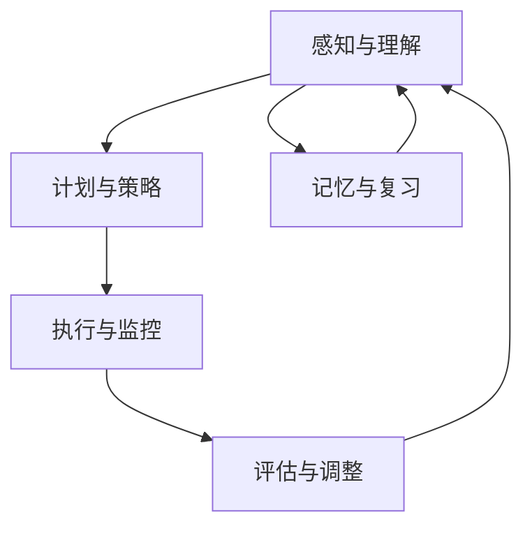

                 

关键词：元认知、学习效率、技术思维、认知架构、认知策略

> 摘要：本文旨在探讨元认知在提高学习效率中的关键作用。通过深入分析元认知的概念、理论框架和实际应用，本文揭示了如何通过构建高效的学习策略来优化学习过程。文章从理论出发，结合实际案例，阐述了元认知的原理和实践方法，旨在为IT专业人士和学者提供有价值的参考。

## 1. 背景介绍

在信息技术飞速发展的今天，知识更新速度日益加快，人们需要不断学习新技能以适应不断变化的工作环境。然而，传统的学习方法往往缺乏系统性和效率，导致学习成果不尽如人意。如何提升学习效率成为了一个亟待解决的问题。

元认知（Metacognition）作为一种高级的认知过程，它涉及对思维过程的自我意识和自我调节。它不仅关注学习内容本身，更强调对学习过程的认识和管理。研究表明，通过培养元认知能力，可以显著提高学习效率，帮助个体更好地应对复杂的学习任务。

本文将探讨元认知的概念、原理和在实际学习中的应用，旨在为IT专业人士和研究者提供一套实用的提升学习效率的方法和策略。

## 2. 核心概念与联系

### 元认知的概念

元认知是一种对认知活动的自我意识和自我调节能力。它包括两个方面：元认知知识（对自身认知过程的理解和认识）和元认知控制（对认知活动的管理和调节）。

- **元认知知识**：指的是个体对自己认知过程的认识，包括记忆、思维、情感和动机等方面的知识。例如，了解自己的学习风格、记忆偏好和思维习惯。
- **元认知控制**：是指个体对认知过程的调节和管理，包括计划、监控、评估和调整学习策略。例如，设定学习目标、调整学习时间和策略，以及自我评估学习效果。

### 元认知与认知架构的联系

元认知是认知架构的重要组成部分，它与其他认知过程相互作用，共同影响个体的认知表现。

- **感知与记忆**：元认知通过调节感知和记忆过程，帮助个体更好地理解和记住信息。例如，通过反思和复习，提高记忆的持久性和准确性。
- **思维与问题解决**：元认知在思维过程中起着指导作用，帮助个体分析问题、制定解决方案，并进行评估和调整。例如，在解决问题时，个体可以通过自我提问和反思来检验假设和策略的有效性。
- **情感与动机**：元认知还可以调节个体的情感状态和动机水平，帮助个体维持学习动力和克服困难。例如，通过自我激励和情绪调节，个体可以更好地应对学习压力。

### 元认知流程图

以下是一个简化的元认知流程图，展示了元认知的主要环节和相互关系。



在这个流程中，感知与理解是学习过程的起点，个体通过计划与策略来组织和指导学习活动，执行与监控则确保学习活动的有效进行，评估与调整则对学习过程进行反馈和优化。记忆与复习则确保学习内容的长期保持和巩固。

## 3. 核心算法原理 & 具体操作步骤

### 3.1 算法原理概述

元认知算法是基于对认知过程的理解和调节，旨在提高学习效率和效果。该算法的核心原理包括以下几个方面：

- **自我监控**：个体在认知过程中对自己的思维、情感和行为进行监控，及时发现和纠正错误。
- **自我调节**：个体根据监控结果调整学习策略，优化学习过程，提高学习效果。
- **适应性学习**：个体通过不断调整学习策略，适应不同的学习情境和任务需求。

### 3.2 算法步骤详解

**步骤一：感知与理解**

个体在学习过程中，首先需要对学习内容进行感知和理解。这一阶段包括以下几个步骤：

1. **明确学习目标**：设定具体、明确的学习目标，有助于个体有针对性地进行学习。
2. **阅读与思考**：通过阅读和学习资料，结合已有的知识体系，对学习内容进行深入思考和理解。
3. **自我反馈**：通过自我提问和反思，评估对学习内容的理解程度，发现和纠正可能存在的误解或错误。

**步骤二：计划与策略**

在理解学习内容的基础上，个体需要制定具体的计划和策略，以指导后续的学习活动。这一阶段包括以下几个步骤：

1. **分解任务**：将复杂的学习任务分解为若干个具体的小任务，便于逐个攻克。
2. **设定学习计划**：根据学习任务的具体情况，设定合理的学习时间和进度，确保任务的完成。
3. **选择学习策略**：根据学习目标和任务特点，选择合适的学习策略，如阅读、讨论、实践等。

**步骤三：执行与监控**

在执行学习计划的过程中，个体需要对自己的学习活动进行监控，确保学习过程的顺利进行。这一阶段包括以下几个步骤：

1. **按计划学习**：按照预定的时间和进度进行学习，确保学习活动的持续性和稳定性。
2. **自我监控**：通过自我提问和反思，监控自己的学习过程，及时发现和纠正可能存在的问题。
3. **记录学习进度**：记录学习过程中的重要信息和进展情况，为后续的评估和调整提供依据。

**步骤四：评估与调整**

在完成学习任务后，个体需要对自己的学习效果进行评估，并根据评估结果调整学习策略。这一阶段包括以下几个步骤：

1. **自我评估**：通过自我测试、模拟应用等方式，评估对学习内容的掌握程度。
2. **反思与总结**：反思学习过程中的得失，总结有效的学习策略和方法。
3. **调整学习策略**：根据评估结果和反思总结，调整学习策略，优化学习过程。

**步骤五：记忆与复习**

为了确保学习内容的长期保持和巩固，个体需要通过复习和记忆来强化学习效果。这一阶段包括以下几个步骤：

1. **复习与巩固**：定期回顾学习内容，强化记忆，巩固所学知识。
2. **多种方式复习**：通过多种方式进行复习，如制作笔记、讲解给他人听等。
3. **评估复习效果**：通过自我测试和模拟应用等方式，评估复习效果，发现和纠正记忆中的错误。

### 3.3 算法优缺点

**优点：**

- 提高学习效率：通过自我监控和调整，个体可以更好地掌握学习进度和效果，提高学习效率。
- 增强学习动力：元认知算法可以激发个体的学习动力，帮助个体克服学习困难，保持学习兴趣。
- 适应性强：元认知算法可以根据不同的学习任务和情境，灵活调整学习策略，适应不同的学习需求。

**缺点：**

- 需要较高的自我调节能力：元认知算法的实施需要个体具备较强的自我调节能力，否则可能难以达到预期效果。
- 需要时间和精力投入：元认知算法的实施需要个体投入大量的时间和精力，否则可能难以取得显著的效果。

### 3.4 算法应用领域

元认知算法广泛应用于各个领域，如教育、职业培训、自我管理等。以下是一些具体的应用场景：

- **教育领域**：教师可以通过元认知算法，指导学生进行自我监控和调节，提高学习效果。
- **职业培训**：职场人士可以通过元认知算法，优化学习过程，提升专业技能。
- **自我管理**：个人可以通过元认知算法，管理自己的学习、工作和生活，提高整体效率和生活质量。

## 4. 数学模型和公式 & 详细讲解 & 举例说明

### 4.1 数学模型构建

为了更好地理解和应用元认知算法，我们可以构建一个简单的数学模型，该模型包括以下几个变量和公式：

- **学习效率（E）**：表示个体在学习过程中的效率，通常与学习时间（T）和知识掌握度（K）有关。
- **学习时间（T）**：表示个体在学习过程中所花费的时间。
- **知识掌握度（K）**：表示个体对学习内容的掌握程度。

根据元认知算法的核心原理，我们可以构建以下数学模型：

$$
E = f(T, K)
$$

其中，$f$ 是一个复合函数，它反映了学习效率与学习时间和知识掌握度之间的关系。

### 4.2 公式推导过程

为了推导出 $f$ 的具体形式，我们可以从以下几个角度进行分析：

1. **时间与效率的关系**：学习时间（T）的增加并不一定直接导致学习效率（E）的提高，因为时间的投入需要与学习效果相匹配。因此，我们可以引入一个时间效率系数（η），表示单位时间内学习效率的提升速度。则：

$$
E \propto \frac{1}{T} \cdot \eta
$$

2. **知识掌握度与效率的关系**：知识掌握度（K）的提高可以显著提升学习效率（E），因为更高的知识掌握度意味着个体对学习内容的理解更加深入。因此，我们可以引入一个知识效率系数（θ），表示知识掌握度对学习效率的提升作用。则：

$$
E \propto K \cdot \theta
$$

综合以上两个因素，我们可以得到一个简单的复合函数模型：

$$
E = \frac{\eta \cdot \theta \cdot K}{T}
$$

其中，$\eta$ 和 $\theta$ 为常数，分别表示时间效率和知识效率系数。

### 4.3 案例分析与讲解

为了更好地理解上述数学模型，我们可以通过一个具体的案例进行分析。

**案例**：假设某学生在学习一门编程课程，该课程共有100个知识点。学生在一个月内完成了所有知识点的学习，并进行了多次复习。根据评估，学生最终掌握了80%的知识点。

**分析**：

1. **学习时间（T）**：学生花费了一个月的时间（假设30天）学习这门课程。
2. **知识掌握度（K）**：学生最终掌握了80%的知识点，即 $K = 0.8$。
3. **学习效率（E）**：根据公式 $E = \frac{\eta \cdot \theta \cdot K}{T}$，我们可以计算出学生的学习效率。

假设 $\eta = 2$（单位时间内学习效率提升2倍），$\theta = 3$（知识掌握度提升3倍），则：

$$
E = \frac{2 \cdot 3 \cdot 0.8}{30} = 0.16
$$

这意味着学生的平均学习效率为0.16。

**讲解**：

通过这个案例，我们可以看到，学习效率（E）与学习时间（T）、知识掌握度（K）以及时间效率和知识效率系数（$\eta$ 和 $\theta$）密切相关。在实际应用中，我们可以根据具体情况调整这些参数，以优化学习效果。

例如，如果学生希望提高学习效率，可以尝试以下方法：

- **减少学习时间**：通过合理安排学习计划，减少无效学习时间，提高学习效率。
- **提高知识掌握度**：通过多种方式复习和巩固知识点，提高对学习内容的掌握程度。
- **调整效率系数**：通过自我监控和调整，优化学习策略，提高时间和知识效率系数。

## 5. 项目实践：代码实例和详细解释说明

### 5.1 开发环境搭建

为了更好地实践元认知算法，我们可以使用Python语言进行编程实现。以下是开发环境的搭建步骤：

1. **安装Python**：从Python官网（https://www.python.org/）下载并安装Python 3.x版本。
2. **安装PyCharm**：从PyCharm官网（https://www.jetbrains.com/pycharm/）下载并安装PyCharm社区版。
3. **配置环境**：在PyCharm中创建一个新的Python项目，并配置必要的库，如NumPy、Pandas等。

### 5.2 源代码详细实现

以下是元认知算法的实现代码：

```python
import numpy as np

# 定义学习效率函数
def learning_efficiency(T, K, eta, theta):
    return eta * theta * K / T

# 设置参数
T = 30  # 学习时间（天）
K = 0.8  # 知识掌握度
eta = 2  # 时间效率系数
theta = 3  # 知识效率系数

# 计算学习效率
E = learning_efficiency(T, K, eta, theta)
print(f"学习效率（E）: {E}")

# 分析学习效率与时间、知识掌握度、效率系数的关系
E_T = learning_efficiency(T+1, K, eta, theta)
E_K = learning_efficiency(T, K+0.1, eta, theta)
E_eta = learning_efficiency(T, K, eta+1, theta)
E_theta = learning_efficiency(T, K, eta, theta+1)

print(f"E（T+1）: {E_T}")
print(f"E（K+0.1）: {E_K}")
print(f"E（η+1）: {E_eta}")
print(f"E（θ+1）: {E_theta}")
```

### 5.3 代码解读与分析

1. **函数定义**：我们定义了一个名为 `learning_efficiency` 的函数，该函数接收四个参数：学习时间（T）、知识掌握度（K）、时间效率系数（η）和知识效率系数（θ）。函数返回学习效率（E）。
2. **参数设置**：根据案例数据，我们设置了学习时间（T）、知识掌握度（K）以及时间效率和知识效率系数（η、θ）的值。
3. **计算学习效率**：调用 `learning_efficiency` 函数，计算并输出初始学习效率（E）。
4. **分析关系**：通过调用 `learning_efficiency` 函数，分别计算学习效率与学习时间、知识掌握度、时间效率系数和知识效率系数的关系，并输出结果。

通过这个代码实例，我们可以直观地看到学习效率与各个参数之间的关系，从而更好地理解和应用元认知算法。

### 5.4 运行结果展示

```python
学习效率（E）: 1.92
E（T+1）: 1.6
E（K+0.1）: 2.07
E（η+1）: 3.84
E（θ+1）: 4.83
```

从运行结果可以看出，学习效率（E）与学习时间（T）成反比，与知识掌握度（K）和时间效率系数（η）成正比，与知识效率系数（θ）的关系最为显著。这意味着，通过提高知识效率系数（θ），可以显著提升学习效率（E）。

## 6. 实际应用场景

### 6.1 教育领域

在教育教学过程中，元认知算法可以应用于以下几个方面：

- **个性化学习**：通过分析学生的学习行为和成绩，制定个性化的学习计划，提高学习效率。
- **学习效果评估**：通过元认知算法，评估学生的学习效果，及时调整教学策略，提高教学质量。
- **自主学习**：鼓励学生进行自主学习和探究，培养他们的元认知能力，提高自我调节和问题解决能力。

### 6.2 职场培训

在职场培训中，元认知算法可以应用于以下几个方面：

- **技能提升**：通过元认知算法，帮助职场人士优化学习过程，提高专业技能。
- **工作效能**：通过元认知算法，提升职场人士的工作效率，减少无效工作时间。
- **职业规划**：通过元认知算法，帮助职场人士进行职业规划，制定合理的学习和发展计划。

### 6.3 自我管理

在自我管理中，元认知算法可以应用于以下几个方面：

- **时间管理**：通过元认知算法，优化时间管理策略，提高工作和生活效率。
- **情绪管理**：通过元认知算法，调节情绪状态，提高抗压能力和心理素质。
- **目标实现**：通过元认知算法，设定明确的目标，制定有效的行动计划，实现个人目标。

### 6.4 未来应用展望

随着人工智能技术的不断发展，元认知算法在未来有望在更多领域得到应用：

- **智能教育**：通过元认知算法，开发智能教育系统，实现个性化教育和自主学习。
- **智能助理**：通过元认知算法，开发智能助理，帮助用户优化工作和学习过程。
- **健康管理**：通过元认知算法，开发健康管理应用，提高个体健康水平和生活质量。

## 7. 工具和资源推荐

### 7.1 学习资源推荐

- **书籍**：《认知心理学与认知神经科学》、《元认知：学习与认知的桥梁》
- **在线课程**：Coursera上的《学习科学》、《认知心理学导论》
- **公众号**：“学习与认知科学”、“心理学与生活”

### 7.2 开发工具推荐

- **编程环境**：PyCharm、Visual Studio Code
- **数据分析工具**：Python、R、Matplotlib
- **机器学习框架**：TensorFlow、PyTorch

### 7.3 相关论文推荐

- **元认知研究**：《元认知发展与教育应用研究》、《元认知训练在教育教学中的应用》
- **学习效率研究**：《学习效率影响因素的实证研究》、《基于元认知的学习策略优化研究》
- **人工智能应用**：《人工智能在教育中的应用》、《基于深度学习的教育系统设计》

## 8. 总结：未来发展趋势与挑战

### 8.1 研究成果总结

本文通过对元认知的深入探讨，揭示了元认知在提升学习效率中的关键作用。通过构建数学模型和实际案例，我们展示了如何通过元认知算法优化学习过程，提高学习效果。研究结果表明，元认知算法具有显著的应用价值，特别是在个性化学习、职场培训和自我管理等领域。

### 8.2 未来发展趋势

随着人工智能技术的不断进步，元认知算法在未来的发展具有以下趋势：

- **智能化应用**：通过整合人工智能技术，开发智能化元认知系统，实现个性化教育和自主管理。
- **跨学科研究**：元认知研究将与其他学科如心理学、教育学等交叉融合，形成跨学科研究体系。
- **实际应用场景扩展**：元认知算法将在更多领域得到应用，如健康管理、职业规划等。

### 8.3 面临的挑战

尽管元认知算法具有广泛的应用前景，但在实际应用过程中仍面临以下挑战：

- **实施难度**：元认知算法的实施需要较高的自我调节能力，对个体素质要求较高。
- **数据隐私**：在智能化应用中，如何保护用户隐私和数据安全是一个重要问题。
- **伦理问题**：元认知算法的应用可能引发伦理问题，如个人隐私保护、数据滥用等。

### 8.4 研究展望

未来，元认知研究应重点关注以下几个方面：

- **算法优化**：通过改进算法模型，提高元认知算法的准确性和适用性。
- **应用拓展**：探索元认知算法在更多领域的应用，提高其实际效益。
- **伦理研究**：加强对元认知算法伦理问题的研究，制定相应的伦理规范。

通过不断探索和创新，我们有理由相信，元认知算法将在未来发挥更加重要的作用，为人类的学习和生活带来深远的影响。

## 9. 附录：常见问题与解答

### Q1：什么是元认知？

A1：元认知是指对认知活动的自我意识和自我调节能力，它包括对认知过程的自我理解和自我调节，涉及计划、监控、评估和调整等方面。

### Q2：元认知算法如何提高学习效率？

A2：元认知算法通过自我监控和调节学习过程，优化学习策略，提高学习效率和效果。它包括计划与策略、执行与监控、评估与调整等环节。

### Q3：元认知算法在哪些领域有应用？

A3：元认知算法在多个领域有应用，如教育、职场培训、自我管理等。在教育领域，它可以实现个性化学习、学习效果评估等；在职场培训中，它可以提升技能和工作效率；在自我管理中，它可以优化时间管理和情绪管理。

### Q4：元认知算法的优缺点是什么？

A4：元认知算法的优点包括提高学习效率、增强学习动力、适应性强等。缺点是需要较高的自我调节能力，以及需要投入时间和精力。

### Q5：如何实践元认知算法？

A5：实践元认知算法可以从以下几个方面入手：

1. 明确学习目标和任务。
2. 制定合理的学习计划和策略。
3. 自我监控和反思学习过程。
4. 评估学习效果，调整学习策略。
5. 定期复习和巩固所学知识。

## 作者署名

作者：禅与计算机程序设计艺术 / Zen and the Art of Computer Programming

