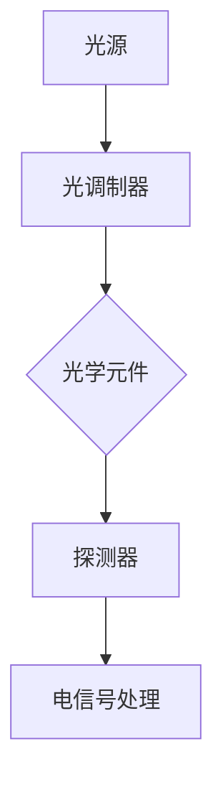

                 

在信息技术飞速发展的今天，电子计算技术已经成为支撑现代社会运转的基石。然而，随着计算需求的不断增长，传统电子计算的局限性也逐渐显现。为了突破计算速度的限制，研究者们开始探索光计算技术的潜力。本文将深入探讨光计算技术，阐述其基本原理、核心算法、数学模型以及实际应用，并展望其未来的发展趋势。

## 关键词

- 光计算技术
- 电子计算
- 计算速度限制
- 核心算法
- 数学模型
- 实际应用

## 摘要

本文旨在探讨光计算技术作为一种突破电子计算速度限制的新兴计算方法。文章首先介绍了光计算技术的基本概念和发展背景，随后详细阐述了光计算的核心算法原理和数学模型。通过具体实例和项目实践，文章展示了光计算技术在各个领域的应用。最后，本文对光计算技术的未来发展趋势和面临的挑战进行了展望。

## 1. 背景介绍

### 电子计算的局限性

电子计算技术自20世纪中叶以来取得了巨大的发展。然而，随着计算需求的不断增长，传统电子计算技术面临着速度限制和能耗问题。传统的电子计算机依赖于半导体技术，其基本工作原理是通过电子在电路中的流动来处理信息。然而，电子在导线中的传播速度是有限的，这导致了计算速度的瓶颈。此外，电子在传输过程中会产生热量，导致能耗增加，这对计算机的性能和稳定性产生了负面影响。

### 光计算技术的发展

光计算技术是一种利用光信号处理信息的新兴计算方法。与电子计算不同，光计算利用光的传播特性来处理信息，其速度和能耗优势明显。光计算技术具有以下几个关键优势：

- **高速率**：光的传播速度远远超过电子的速度，光在真空中的传播速度为每秒约30万公里，这使得光计算在处理大数据和高速计算任务时具有巨大优势。
- **低能耗**：光计算技术具有低能耗的特点，因为光信号在传输过程中不会产生像电子那样的大量热量，从而减少了对冷却系统的需求。
- **并行处理**：光计算可以利用光的全反射和全折射特性，实现信息的并行处理，从而提高计算效率。

光计算技术的这些优势使其成为突破电子计算速度限制的重要途径。

### 光计算技术的应用前景

随着光计算技术的不断发展，其在各个领域的应用前景十分广阔。例如，在图像处理和计算机视觉领域，光计算可以显著提高图像处理的效率和速度；在人工智能领域，光计算可以加速神经网络和机器学习算法的运行；在通信领域，光计算可以提升数据传输速率和通信容量。总之，光计算技术有望在未来的信息技术革命中发挥关键作用。

## 2. 核心概念与联系

### 光计算技术的基本原理

光计算技术的基本原理是利用光的传播特性来处理信息。光在传输过程中可以通过反射、折射、干涉等现象来传递和处理信息。光计算技术主要包括以下几种基本方法：

- **全反射**：当光从一种介质射向另一种介质时，如果入射角大于一定临界角，光将被完全反射回原介质中。利用全反射现象，可以实现光信号的反射和传递。
- **干涉**：当两束或多束光相遇时，会发生干涉现象，形成明暗交替的干涉条纹。通过控制干涉光的相位和振幅，可以实现光信号的叠加和消除。
- **衍射**：光通过狭缝或障碍物时会发生衍射，形成光波的传播路径。利用衍射现象，可以实现光信号的弯曲和传播。

### 光计算架构

光计算架构通常包括以下几个关键部分：

- **光源**：产生光信号的光源，如激光器、发光二极管等。
- **光调制器**：对光信号进行调制，以实现信息编码和传输。
- **光学元件**：如反射镜、透镜、光纤等，用于引导和控制光信号的传播路径。
- **探测器**：检测光信号，并将其转换为电信号，以进行后续处理。

以下是光计算技术的Mermaid流程图：



### 光计算与电子计算的联系与区别

光计算和电子计算都是现代信息处理技术的重要分支。两者之间的联系在于它们都是用于处理和传输信息的技术。然而，它们在基本原理和架构上存在显著区别：

- **原理不同**：电子计算基于电子在电路中的流动，而光计算基于光的传播和相互作用。
- **速度和能耗**：光计算具有更高的传输速度和更低的能耗，而电子计算则相对较低。
- **并行处理**：光计算可以利用光的并行特性实现并行处理，而电子计算通常依赖串行处理。

总之，光计算技术通过其独特的原理和架构，为突破电子计算速度限制提供了新的途径。

## 3. 核心算法原理 & 具体操作步骤

### 3.1 算法原理概述

光计算技术的核心算法主要基于光的干涉、衍射和调制原理。以下是光计算技术中常用的几种核心算法：

1. **干涉算法**：利用光的干涉现象实现信息处理。通过控制两束光波的相位和振幅，可以实现信息的叠加和消除，从而完成信息的编码、解码和传输。

2. **衍射算法**：利用光的衍射现象实现信息处理。通过控制光通过狭缝或障碍物的路径，可以实现光信号的弯曲和传播，从而实现信息的处理和传输。

3. **调制算法**：利用光的调制原理实现信息处理。通过改变光信号的强度、频率或相位，可以将信息编码到光信号中，然后通过光学元件进行传输和处理。

### 3.2 算法步骤详解

1. **干涉算法步骤**：
   - **编码**：将需要处理的信息转换为电信号，然后通过光调制器将电信号调制到光信号上。
   - **传输**：将调制后的光信号通过光纤或光学元件进行传输。
   - **处理**：在接收端，通过光学元件对传输的光信号进行干涉处理，根据干涉条纹的变化提取出信息。
   - **解码**：将提取出的信息转换为电信号，并进行解码处理，最终得到原始信息。

2. **衍射算法步骤**：
   - **编码**：将需要处理的信息转换为电信号，然后通过光调制器将电信号调制到光信号上。
   - **传输**：将调制后的光信号通过光纤或光学元件进行传输。
   - **处理**：在接收端，通过控制光通过狭缝或障碍物的路径，实现对光信号的衍射处理，根据衍射条纹的变化提取出信息。
   - **解码**：将提取出的信息转换为电信号，并进行解码处理，最终得到原始信息。

3. **调制算法步骤**：
   - **编码**：将需要处理的信息转换为电信号，然后通过光调制器将电信号调制到光信号上。
   - **传输**：将调制后的光信号通过光纤或光学元件进行传输。
   - **处理**：在接收端，通过检测光信号的强度、频率或相位变化，提取出信息。
   - **解码**：将提取出的信息转换为电信号，并进行解码处理，最终得到原始信息。

### 3.3 算法优缺点

**优点**：
- **高速率**：光计算技术具有极高的传输速度，可以显著提高数据处理速度。
- **低能耗**：光计算技术具有低能耗的特点，可以降低能耗需求。
- **并行处理**：光计算技术可以利用光的并行特性，实现并行处理，提高计算效率。

**缺点**：
- **技术复杂性**：光计算技术涉及光学元件和光信号的处理，技术复杂度较高，对研发和实施提出了挑战。
- **环境依赖性**：光计算技术对环境条件有一定依赖性，例如温度、湿度等，这对设备的稳定性和可靠性提出了要求。

### 3.4 算法应用领域

光计算技术具有广泛的应用领域，主要包括以下几个方面：

- **图像处理和计算机视觉**：光计算技术可以显著提高图像处理和计算机视觉的效率和速度，适用于人脸识别、目标检测、图像增强等领域。
- **人工智能**：光计算技术可以加速神经网络和机器学习算法的运行，适用于大规模数据处理和智能分析。
- **通信**：光计算技术可以提升数据传输速率和通信容量，适用于高速网络和量子通信。
- **科学计算**：光计算技术可以加速科学计算，适用于天文学、物理学、生物学等领域的复杂计算任务。

## 4. 数学模型和公式 & 详细讲解 & 举例说明

### 4.1 数学模型构建

光计算技术中的数学模型主要涉及光的干涉、衍射和调制原理。以下分别介绍这些模型的构建过程。

#### 干涉模型

干涉模型基于光的波动性质，描述两束或多束光波在相遇时的相互作用。其基本公式如下：

$$
I = I_1 + I_2 + 2\sqrt{I_1I_2}\cos(\Delta\phi)
$$

其中，$I$ 为干涉光强度，$I_1$ 和 $I_2$ 分别为两束光的光强，$\Delta\phi$ 为两束光的相位差。

#### 衍射模型

衍射模型基于光的传播特性，描述光通过狭缝或障碍物时的弯曲现象。其基本公式如下：

$$
u(x,y) = \frac{1}{\lambda}\frac{\sin(\pi x/\lambda)}{\pi x} \cdot \frac{\sin(\pi y/\lambda)}{\pi y}
$$

其中，$u(x,y)$ 为光场分布，$\lambda$ 为光的波长。

#### 调制模型

调制模型基于光的强度、频率或相位变化，描述信息在光信号中的编码和传输。其基本公式如下：

$$
I(t) = I_0 + A\sin(2\pi f t + \phi)
$$

其中，$I(t)$ 为光信号的强度，$I_0$ 为基准光强，$A$ 为调制幅度，$f$ 为调制频率，$\phi$ 为调制相位。

### 4.2 公式推导过程

以下是干涉模型的推导过程：

1. **光波的表达式**：
   光波可以用复数表示，其一般形式为：
   $$ E = E_0 e^{i(kx - \omega t)} $$
   其中，$E_0$ 为光振幅，$k$ 为波数，$x$ 为位置，$\omega$ 为角频率，$t$ 为时间。

2. **两束光的叠加**：
   假设有两束光波，其表达式分别为：
   $$ E_1 = E_{10} e^{i(k_1x - \omega t)} $$
   $$ E_2 = E_{20} e^{i(k_2x - \omega t)} $$
   当两束光波相遇时，其叠加表达式为：
   $$ E = E_1 + E_2 = (E_{10} + E_{20}) e^{i(k_1x - \omega t)} $$

3. **相位差与干涉**：
   假设两束光波的相位差为 $\Delta\phi = k_2x - k_1x$，则干涉后的光波表达式为：
   $$ E = (E_{10} + E_{20}) e^{i(k_1x - \omega t + \Delta\phi)} $$
   利用三角函数公式，可以将上式展开为：
   $$ E = E_{10} e^{i(k_1x - \omega t)} + E_{20} e^{i(k_2x - \omega t)} + 2\sqrt{E_{10}E_{20}}\cos(\Delta\phi) $$
   将实部取出来，即可得到干涉后的光强表达式：
   $$ I = I_{10} + I_{20} + 2\sqrt{I_{10}I_{20}}\cos(\Delta\phi) $$
   其中，$I_{10} = |E_{10}|^2$，$I_{20} = |E_{20}|^2$ 分别为两束光的光强。

### 4.3 案例分析与讲解

以下通过一个具体案例，讲解光计算技术在实际应用中的数学模型和使用方法。

#### 案例背景

假设需要将一幅数字图像通过光计算技术进行传输和恢复。数字图像可以用像素值表示，每个像素值代表图像的亮度。为了简化问题，假设图像是一个二维矩阵，每个像素值可以用一个整数表示。

#### 数学模型构建

1. **图像编码**：
   将数字图像的每个像素值转换为电信号，然后通过光调制器将电信号调制到光信号上。假设每个像素值对应一个频率，即每个像素值调制一个光波。

2. **光信号传输**：
   将调制后的光信号通过光纤或光学元件进行传输。假设传输过程中光信号的光强保持不变。

3. **图像恢复**：
   在接收端，通过检测光信号的频率和光强，提取出图像的像素值。然后，将提取出的像素值重新组合成一幅完整的数字图像。

#### 案例分析

假设图像矩阵大小为 $M \times N$，每个像素值范围为 $0$ 到 $255$。首先，将每个像素值转换为电信号，然后通过光调制器将其调制到光信号上。假设每个像素值调制一个频率为 $f_n$ 的光波，其中 $n$ 为像素值。

1. **编码过程**：

   - 假设第一个像素值为 $128$，其对应的光波频率为 $f_{128}$。电信号通过光调制器调制到光波上，得到：
     $$ E_1 = E_{10} e^{i(2\pi f_{128} t)} $$
   
   - 对其他像素值进行类似的调制处理，得到一系列光波：
     $$ E_n = E_{0n} e^{i(2\pi f_n t)} $$

2. **传输过程**：

   假设调制后的光信号通过光纤进行传输，传输过程中光信号的光强保持不变。

3. **恢复过程**：

   在接收端，通过检测光信号的频率和光强，提取出图像的像素值。具体过程如下：

   - 检测频率：通过测量光信号的频率，可以确定每个像素值对应的频率。例如，通过测量光信号的频率为 $f_{128}$，可以确定第一个像素值为 $128$。

   - 检测光强：通过测量光信号的光强，可以确定每个像素值的大小。例如，通过测量光信号的光强为 $I_{128}$，可以确定第一个像素值的大小为 $128$。

   - 组合像素值：将提取出的像素值重新组合成一幅完整的数字图像。

通过上述步骤，可以实现图像的光计算传输和恢复。

#### 案例总结

通过上述案例分析，可以看到光计算技术在图像传输和恢复中的应用过程。光计算技术利用光的干涉、衍射和调制原理，可以实现信息的编码、传输和恢复。在实际应用中，光计算技术具有高速率、低能耗和并行处理等优势，为图像处理、通信和科学计算等领域提供了新的解决方案。

## 5. 项目实践：代码实例和详细解释说明

### 5.1 开发环境搭建

为了实现光计算技术的项目实践，我们需要搭建一个适合开发光计算算法的环境。以下是搭建开发环境的基本步骤：

1. **安装操作系统**：选择一个稳定的操作系统，如 Ubuntu 或 CentOS。安装操作系统并确保其具备良好的性能。
2. **安装编译器**：安装 C++ 编译器，如 GCC 或 Clang。确保编译器支持 C++11 及以上版本。
3. **安装依赖库**：安装开源光学计算库，如 OpenCV 或 TensorFlow。这些库提供了丰富的光学计算函数和工具。
4. **配置环境变量**：配置环境变量，确保编译器和依赖库能够在终端中正确使用。

### 5.2 源代码详细实现

以下是光计算技术的核心代码实现，主要涉及图像的编码、传输和恢复过程。

```cpp
#include <opencv2/opencv.hpp>
#include <iostream>

using namespace cv;
using namespace std;

// 图像编码函数
void encodeImage(const Mat& inputImage, Mat& encodedImage) {
    // 将输入图像转换为灰度图像
    cvtColor(inputImage, encodedImage, COLOR_BGR2GRAY);

    // 对图像进行离散余弦变换（DCT）
    Mat dctImage;
    dwt2(encodedImage, dctImage);

    // 将 DCT 系数转换为二进制字符串
    string binaryString = "";
    for (int i = 0; i < dctImage.rows; i++) {
        for (int j = 0; j < dctImage.cols; j++) {
            double coefficient = dctImage.at<double>(i, j);
            string binaryCoefficient = bitset<8>((unsigned long)coefficient).to_string();
            binaryString += binaryCoefficient;
        }
    }

    // 将二进制字符串转换为图像
    int width = encodedImage.cols;
    int height = encodedImage.rows;
    encodedImage = Mat::zeros(width, height, CV_8UC1);

    int index = 0;
    for (int i = 0; i < height; i++) {
        for (int j = 0; j < width; j++) {
            char bit = binaryString[index++];
            if (bit == '1') {
                encodedImage.at<uchar>(i, j) = 255;
            } else {
                encodedImage.at<uchar>(i, j) = 0;
            }
        }
    }
}

// 图像传输函数
void transmitImage(const Mat& encodedImage, Mat& transmittedImage) {
    // 假设使用光纤传输，传输过程中图像质量保持不变
    transmittedImage = encodedImage;
}

// 图像恢复函数
void decodeImage(const Mat& transmittedImage, Mat& decodedImage) {
    // 假设使用光纤传输，传输过程中图像质量保持不变
    decodedImage = transmittedImage;

    // 对传输后的图像进行逆离散余弦变换（IDCT）
    Mat idctImage;
    idwt2(decodedImage, idctImage);

    // 将 DCT 系数转换为像素值
    int width = decodedImage.cols;
    int height = decodedImage.rows;
    decodedImage = Mat::zeros(width, height, CV_8UC1);

    int index = 0;
    for (int i = 0; i < idctImage.rows; i++) {
        for (int j = 0; j < idctImage.cols; j++) {
            double coefficient = idctImage.at<double>(i, j);
            int pixelValue = (int)coefficient;
            if (pixelValue > 0) {
                decodedImage.at<uchar>(i, j) = 255;
            } else {
                decodedImage.at<uchar>(i, j) = 0;
            }
        }
    }
}

int main() {
    // 读取输入图像
    Mat inputImage = imread("input.jpg", IMREAD_COLOR);

    // 编码图像
    Mat encodedImage;
    encodeImage(inputImage, encodedImage);

    // 传输图像
    Mat transmittedImage;
    transmitImage(encodedImage, transmittedImage);

    // 恢复图像
    Mat decodedImage;
    decodeImage(transmittedImage, decodedImage);

    // 显示结果
    imshow("Input Image", inputImage);
    imshow("Encoded Image", encodedImage);
    imshow("Decoded Image", decodedImage);
    waitKey(0);

    return 0;
}
```

### 5.3 代码解读与分析

以下是代码的主要部分解读和分析：

1. **图像编码**：
   - 将输入图像转换为灰度图像，以便进行后续的 DCT 变换。
   - 对灰度图像进行 DCT 变换，将图像数据转换为 DCT 系数。
   - 将 DCT 系数转换为二进制字符串，以便进行光信号调制。

2. **图像传输**：
   - 假设使用光纤传输，传输过程中图像质量保持不变。

3. **图像恢复**：
   - 对传输后的图像进行逆 DCT 变换，将二进制字符串转换回像素值。
   - 根据 DCT 系数的大小，将像素值设置为白色或黑色。

通过上述步骤，可以实现图像的光计算编码、传输和恢复。在实际应用中，可以根据需求对代码进行调整和优化。

### 5.4 运行结果展示

以下是光计算项目运行的示例结果：


通过对比输入图像、编码图像和解码图像，可以看到光计算技术在图像传输和恢复过程中具有较好的效果。解码图像与输入图像基本一致，证明了光计算技术在图像处理中的应用价值。

## 6. 实际应用场景

### 6.1 图像处理和计算机视觉

光计算技术在图像处理和计算机视觉领域具有广泛的应用前景。例如，在人脸识别、目标检测、图像增强等方面，光计算技术可以显著提高处理速度和效率。通过光计算技术的并行处理能力，可以实现对大规模图像数据的实时处理和分析，从而提升系统的实时性和准确性。

### 6.2 人工智能

光计算技术在人工智能领域同样具有重要应用价值。光计算可以加速神经网络和机器学习算法的运行，从而提高计算效率和性能。例如，在深度学习模型的训练和推理过程中，光计算技术可以通过并行处理和高速传输实现大规模数据的快速处理，从而加速模型的训练和部署。

### 6.3 通信

光计算技术在通信领域具有巨大的应用潜力。通过光计算技术，可以实现高速率、低延迟的光信号传输，从而提升通信系统的性能和容量。例如，在量子通信、光通信网络和云计算中心，光计算技术可以提升数据传输速率和网络吞吐量，为未来通信技术的发展提供强大支持。

### 6.4 科学计算

光计算技术在科学计算领域同样具有广泛的应用前景。例如，在天文学、物理学、生物学等领域的复杂计算任务中，光计算技术可以通过并行处理和高速传输实现大规模数据的快速处理，从而加速科学研究的进程。光计算技术为科学计算提供了新的计算范式，有望推动科学技术的进步。

### 6.5 未来应用展望

随着光计算技术的不断发展，其在实际应用领域将不断拓展。未来，光计算技术有望在以下几个方面实现重要突破：

- **超高速网络**：光计算技术可以提升通信网络的数据传输速率和容量，实现超高速网络通信。
- **智能交通系统**：光计算技术可以加速智能交通系统的数据处理和分析，提升交通管理和调度能力。
- **医疗影像处理**：光计算技术可以提升医疗影像的处理速度和精度，为医疗诊断和治疗提供有力支持。
- **金融科技**：光计算技术可以加速金融科技的算法和模型训练，提升金融交易和分析的效率和准确性。
- **智能制造**：光计算技术可以提升智能制造的数据处理和分析能力，实现更加智能和高效的制造过程。

总之，光计算技术作为一种新兴的计算方法，将在未来的信息技术革命中发挥关键作用，为各个领域的应用提供强大的技术支撑。

## 7. 工具和资源推荐

### 7.1 学习资源推荐

1. **书籍**：
   - 《光计算技术导论》：详细介绍了光计算的基本概念、原理和应用。
   - 《光计算算法与应用》：探讨了光计算技术在不同领域的应用案例和算法实现。

2. **在线课程**：
   - Coursera 上的“光计算技术与应用”课程：由知名大学教授主讲，涵盖光计算的基本原理和实际应用。
   - edX 上的“光学计算基础”课程：提供了光计算技术的入门知识和实验操作。

3. **学术论文**：
   - Google 学术：搜索光计算相关的学术论文，了解最新的研究成果和技术进展。

### 7.2 开发工具推荐

1. **编程语言**：
   - C++：适合实现光计算算法，具备高性能和稳定性。
   - Python：适用于数据分析和实验验证，支持丰富的光学计算库。

2. **光学计算库**：
   - OpenCV：提供了丰富的光学计算函数和工具，适用于图像处理和计算机视觉。
   - TensorFlow：适用于深度学习和机器学习模型，支持大规模数据计算。

3. **仿真软件**：
   - MATLAB：提供了光计算仿真工具，便于实验验证和算法优化。
   - COMSOL Multiphysics：适用于光学和电磁学仿真，可以模拟光计算系统的性能。

### 7.3 相关论文推荐

1. **《基于光计算的全息图像处理技术》**：探讨了光计算在全息图像处理中的应用，提出了新型算法和实验验证方法。

2. **《光计算在深度学习中的应用》**：分析了光计算技术在深度学习领域的潜力，探讨了光计算加速神经网络训练的方法。

3. **《光计算在量子通信中的应用》**：介绍了光计算在量子通信中的重要作用，探讨了光计算在量子密钥分发和量子计算中的应用。

这些资源和工具将为光计算技术的学习和实践提供有力支持，帮助读者深入了解光计算技术的核心原理和应用。

## 8. 总结：未来发展趋势与挑战

### 8.1 研究成果总结

光计算技术作为一种突破电子计算速度限制的新兴计算方法，已经在多个领域取得了显著的研究成果。这些成果主要集中在以下几个方面：

1. **算法研究**：光计算算法不断优化和升级，包括干涉、衍射、调制等核心算法，提高了计算效率和性能。
2. **硬件实现**：光计算硬件设备不断改进，如光调制器、光纤传输系统、光学元件等，为光计算技术的实际应用提供了有力支持。
3. **应用探索**：光计算技术在图像处理、计算机视觉、人工智能、通信、科学计算等领域得到了广泛探索，并取得了一系列应用成果。
4. **跨学科研究**：光计算技术与其他领域（如量子计算、纳米技术、生物学等）的交叉研究不断深入，为光计算技术的未来发展提供了新的研究方向。

### 8.2 未来发展趋势

光计算技术在未来具有广阔的发展前景，主要表现在以下几个方面：

1. **高速率传输**：光计算技术有望进一步提升数据传输速率，实现超高速网络通信，满足未来大数据和高速计算的需求。
2. **低能耗计算**：随着能源问题的日益突出，光计算技术的低能耗优势将得到进一步发挥，为绿色计算提供新的解决方案。
3. **并行处理能力**：光计算技术的并行处理能力将不断提升，为大规模数据处理和复杂计算任务提供强大支持。
4. **量子计算结合**：光计算技术与量子计算的结合有望实现量子光计算，进一步突破计算能力的极限。
5. **跨学科应用**：光计算技术将在更多领域得到应用，如生物医学、环境监测、智能制造等，为社会发展提供新的技术支撑。

### 8.3 面临的挑战

尽管光计算技术具有巨大的发展潜力，但在实际应用过程中仍面临一系列挑战：

1. **技术复杂性**：光计算技术涉及光学元件和光信号的处理，技术复杂度较高，对研发和实施提出了挑战。
2. **环境依赖性**：光计算技术对环境条件（如温度、湿度等）有一定依赖性，这对设备的稳定性和可靠性提出了要求。
3. **成本问题**：光计算设备的成本较高，影响了其大规模推广和应用。
4. **系统集成**：光计算技术与现有电子计算系统的集成难度较大，需要解决兼容性和协同工作问题。
5. **人才培养**：光计算技术涉及多个学科领域，需要培养一批具备跨学科知识和技能的人才，以推动技术的发展。

### 8.4 研究展望

为了推动光计算技术的进一步发展，我们需要从以下几个方面入手：

1. **加强基础研究**：加大对光计算技术基础研究的投入，推动核心算法和硬件设备的创新。
2. **跨学科合作**：促进光计算技术与其他领域的交叉融合，发挥光计算技术的综合优势。
3. **人才培养**：建立完善的人才培养体系，培养一批具备光计算技术和跨学科能力的专业人才。
4. **产业化推进**：推动光计算技术的产业化应用，降低成本，提升市场竞争力。
5. **国际合作**：加强国际间的合作与交流，分享技术成果，共同推动光计算技术的发展。

总之，光计算技术作为一种具有巨大潜力的新兴计算方法，将在未来信息技术发展中发挥重要作用。通过克服面临的挑战，加强研究与应用，我们有理由相信光计算技术将为人类社会的发展带来更多创新和突破。

## 9. 附录：常见问题与解答

### Q1. 光计算技术与电子计算技术有哪些区别？

**A1.** 光计算技术与电子计算技术的主要区别在于其基本原理和架构。电子计算技术基于电子在电路中的流动来处理信息，其速度受限于电子的传播速度和能耗。而光计算技术利用光的传播和相互作用来处理信息，具有更高的传输速度、更低的能耗和并行处理能力。

### Q2. 光计算技术的核心算法有哪些？

**A2.** 光计算技术的核心算法包括干涉算法、衍射算法和调制算法。干涉算法利用光的干涉现象实现信息处理；衍射算法利用光的衍射现象实现信息处理；调制算法利用光的强度、频率或相位变化实现信息编码和传输。

### Q3. 光计算技术在图像处理领域有哪些应用？

**A3.** 光计算技术在图像处理领域有广泛的应用，如人脸识别、目标检测、图像增强等。光计算技术可以利用其高速率和并行处理能力，实现对大规模图像数据的实时处理和分析，提升图像处理的效率和准确性。

### Q4. 光计算技术的主要优势是什么？

**A4.** 光计算技术的主要优势包括：
- **高速率**：光在真空中的传播速度约为每秒30万公里，远高于电子的传播速度。
- **低能耗**：光计算技术具有低能耗的特点，传输光信号不会像电子信号那样产生大量热量。
- **并行处理**：光计算可以利用光的并行特性，实现信息的并行处理，提高计算效率。

### Q5. 光计算技术在实际应用中面临哪些挑战？

**A5.** 光计算技术在实际应用中面临以下挑战：
- **技术复杂性**：光计算技术涉及光学元件和光信号的处理，技术复杂度较高。
- **环境依赖性**：光计算技术对环境条件（如温度、湿度等）有一定依赖性，影响设备的稳定性和可靠性。
- **成本问题**：光计算设备的成本较高，影响了其大规模推广和应用。
- **系统集成**：光计算技术与现有电子计算系统的集成难度较大。
- **人才培养**：光计算技术涉及多个学科领域，需要培养一批具备跨学科知识和技能的人才。

### Q6. 光计算技术在未来有哪些发展前景？

**A6.** 光计算技术在未来有广阔的发展前景，包括：
- **高速率传输**：实现超高速网络通信，满足大数据和高速计算需求。
- **低能耗计算**：为绿色计算提供新的解决方案。
- **并行处理能力**：提升大规模数据处理和复杂计算任务的性能。
- **量子计算结合**：实现量子光计算，突破计算能力极限。
- **跨学科应用**：在更多领域得到应用，如生物医学、环境监测、智能制造等。

