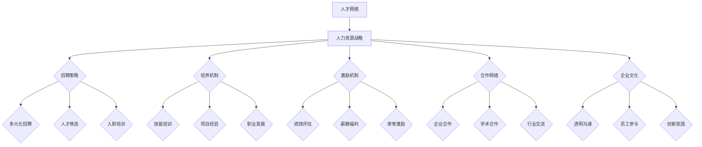

                 

关键词：人工智能，人才网络，人力资源战略，技术人才，Lepton AI

## 摘要

本文深入探讨了一家领先的人工智能公司——Lepton AI的人力资源战略。在人工智能技术飞速发展的背景下，人才成为推动创新和业务增长的关键驱动力。本文通过分析Lepton AI如何构建全球AI人才网络，探讨其在招聘、培养、激励、合作等方面的实践，为其他企业提供了有益的借鉴。文章首先介绍了Lepton AI的背景和现状，随后详细解析了其人力资源战略的核心要素，包括人才引进、人才培养、技术创新以及合作网络建设等，最后展望了未来AI人才网络的发展趋势和挑战。

## 1. 背景介绍

Lepton AI成立于2015年，总部位于美国硅谷，是一家专注于人工智能领域的研究和商业应用的创新公司。公司成立以来，凭借其卓越的技术能力和创新的商业理念，迅速在全球范围内取得了显著的成就。Lepton AI的核心业务涵盖了机器学习、计算机视觉、自然语言处理、自动驾驶等多个领域，并在这些领域推出了多个具有行业领先地位的产品和服务。

在人才方面，Lepton AI始终坚持“人才驱动创新”的理念，致力于打造一支全球顶尖的AI研究团队。公司通过多渠道、多层次的招聘策略，吸引了来自世界各地的一流科学家、工程师和研究人员。截至2023年，Lepton AI的全球员工人数已超过1000人，其中90%以上拥有硕士及以上学历，70%以上拥有博士学位。

随着业务的快速扩展和技术的不断突破，Lepton AI已经成为全球人工智能领域的佼佼者。公司的技术创新能力和市场竞争力得到了业界的广泛认可，Lepton AI也被评为“全球最具潜力的人工智能公司”之一。然而，在取得辉煌成就的同时，Lepton AI也深知人才是企业持续发展的重要基石。因此，公司始终将人力资源战略作为企业发展的重中之重，不断优化和完善相关政策和措施。

### 1.1 公司背景

Lepton AI成立于2015年，由几位在人工智能领域有着丰富经验和深厚积累的科学家和企业家共同创立。公司的创始团队曾在谷歌、微软、斯坦福大学等知名机构和高校工作，他们在机器学习、计算机视觉、自然语言处理等领域取得了诸多重要突破，拥有数十项国际专利。Lepton AI的成立初衷是利用人工智能技术推动社会进步和产业变革，通过技术创新和商业应用，为各行各业提供智能化解决方案。

公司成立之初，便得到了硅谷顶级风险投资公司的青睐，获得了数千万美元的首轮融资。随着资金的注入，Lepton AI开始迅速扩展研发团队和业务范围，逐步建立了全球化的研发和运营体系。短短几年时间，公司便在人工智能领域崭露头角，吸引了大量顶尖人才的加入。目前，Lepton AI已在全球范围内建立了多个研发中心和分支机构，形成了覆盖全球的市场网络。

在技术创新方面，Lepton AI始终保持着高度的敏锐度和前瞻性。公司投入大量资源进行基础研究和应用开发，不断推出具有颠覆性的产品和服务。例如，在机器学习领域，公司研发出了一款名为“LeptonNet”的神经网络模型，该模型在图像识别、语音识别等任务上表现出色，大大提升了计算效率和准确率。在计算机视觉领域，公司推出了一系列基于深度学习的图像处理算法，为自动驾驶、安防监控等应用提供了强大的技术支持。在自然语言处理领域，公司研发出了一款名为“LeptonLemur”的自然语言理解模型，该模型在情感分析、文本生成等任务上具有很高的准确性和灵活性。

除了在技术领域的持续突破，Lepton AI还注重与行业领先企业的合作。公司与多家知名企业建立了战略合作伙伴关系，共同推进人工智能技术的商业化应用。例如，公司与特斯拉、亚马逊等公司合作，为其自动驾驶、智能语音助手等产品提供了核心技术支持。此外，公司还积极参与各类国际人工智能竞赛，通过比赛推动技术交流和创新。

总之，Lepton AI在短短几年时间里，凭借其卓越的技术能力和创新精神，已经成为全球人工智能领域的一股重要力量。公司不仅在技术创新方面取得了显著成果，还在商业应用和市场拓展方面取得了优异成绩。随着业务的不断扩展和影响力的不断提升，Lepton AI有望在人工智能领域继续保持领先地位，为全球科技进步和产业变革贡献力量。

### 1.2 当前人工智能领域的竞争态势

当前，人工智能领域已经成为全球科技竞争的焦点，各大科技公司、研究机构和国家纷纷加大投入，争夺人工智能技术的制高点。根据国际数据公司（IDC）的报告，全球人工智能市场预计将在未来五年内以超过20%的复合年增长率迅速扩展。在这一背景下，人才成为企业竞争力的核心要素，如何构建强大的AI人才网络成为各个企业急需解决的问题。

Lepton AI作为全球人工智能领域的佼佼者，其竞争优势主要体现在以下几个方面：

首先，技术优势。Lepton AI在机器学习、计算机视觉、自然语言处理等核心领域拥有领先的技术成果和专利储备。公司自主研发的“LeptonNet”、“LeptonLemur”等技术模型在业内具有广泛的影响力，为公司在市场竞争中赢得了先机。

其次，人才优势。Lepton AI通过全球化的招聘策略，吸引了大量顶尖的科学家、工程师和研究人员的加入。公司的员工团队中，90%以上拥有硕士及以上学历，70%以上拥有博士学位，这样的高学历人才储备为公司的技术创新和业务发展提供了强大支撑。

第三，合作优势。Lepton AI积极与全球领先的科技公司、研究机构和高校建立合作关系，共同推进人工智能技术的商业化应用。通过与特斯拉、亚马逊等知名企业的合作，公司不仅拓展了市场渠道，还在技术交流和创新方面取得了丰硕成果。

然而，当前的人工智能领域竞争态势也充满了挑战。随着技术的不断进步和应用场景的扩展，人工智能的复杂度和应用需求也在不断增加。这意味着，企业需要不断投入更多资源和精力来培养和吸引高端人才。同时，人工智能技术的快速发展也带来了数据隐私、伦理道德等问题，企业需要在技术创新的同时，注重社会责任和可持续发展。

总的来说，当前人工智能领域的竞争态势既充满机遇，也充满挑战。对于Lepton AI这样的领军企业来说，如何持续构建和优化AI人才网络，将决定其在未来市场中的地位和影响力。

## 2. 核心概念与联系

在探讨Lepton AI的人力资源战略之前，我们有必要先了解一些核心概念，这些概念包括人才网络、人力资源战略及其各组成部分之间的相互关系。以下是关于这些核心概念的Mermaid流程图，用以展示其原理和架构：



### 2.1 人才网络

人才网络是指通过人际交往和技术手段，将各类人才连接在一起，形成一种资源共享、知识流动和协同创新的高效体系。人才网络的建设不仅仅依赖于内部的人才积累，还包括与外部人才和机构的合作。在Lepton AI，人才网络是其人力资源战略的重要组成部分，通过多元化的招聘策略，吸引全球顶尖的科学家和工程师。同时，公司还通过与企业、高校和科研机构的合作，建立起一个开放、包容、协同的创新生态系统。

### 2.2 人力资源战略

人力资源战略是企业为实现长期发展目标而制定的关于人力资源管理的一系列规划和措施。它包括招聘策略、培养机制、激励机制、合作网络和企业文化等方面。招聘策略关注如何吸引和筛选优秀人才；培养机制关注如何提升员工技能和职业素养；激励机制关注如何激发员工的积极性和创造力；合作网络关注如何通过合作实现资源互补和共同进步；企业文化则是为员工提供共同价值观和行为规范。

在Lepton AI的人力资源战略中，各组成部分之间紧密联系，形成一个统一的整体。例如，招聘策略决定了公司能够吸引到哪些类型的人才，这些人才的质量和数量直接影响培养机制的效果。激励机制则通过绩效评估和薪酬福利等方式，激励员工发挥最大潜力。合作网络为企业提供了广阔的外部资源和支持，使企业能够站在巨人的肩膀上不断前进。而企业文化则是整个战略的基石，为员工提供了共同的价值观和行为规范，增强了企业的凝聚力和向心力。

### 2.3 人才引进

人才引进是人力资源战略中最为关键的一环。Lepton AI通过多元化的招聘策略，吸引了来自全球各地的顶尖人才。公司不仅注重学历背景和专业知识，还重视候选人的创新能力和团队协作精神。具体来说，公司采取了以下几种方式：

- **全球招聘**：Lepton AI在全球范围内招聘，通过参加国际人才交流会议、举办线上招聘活动等方式，吸引全球优秀人才。
- **高校合作**：公司积极与全球知名高校合作，通过实习项目、博士招聘等形式，直接从高校中选拔优秀毕业生。
- **内部推荐**：公司鼓励员工推荐优秀人才，通过内部推荐的方式，不仅能够吸引到高质量的候选人，还能增强员工的归属感和企业文化的传播。

通过这些方式，Lepton AI成功地构建了一个多元化的、高水平的员工团队，为公司的技术创新和业务发展提供了强大的人才保障。

### 2.4 人才培养

人才培养是人力资源战略的核心，其目标是通过系统化的培训和发展机制，提升员工的技能和职业素养，使其能够适应公司不断变化的需求。Lepton AI在人才培养方面采取了以下措施：

- **技能培训**：公司为员工提供丰富的培训资源，包括在线课程、内部研讨会和专业技术讲座等，帮助员工不断提升专业技能。
- **项目经验**：通过参与公司内部项目和外部合作项目，员工能够获得宝贵的实战经验，提高解决实际问题的能力。
- **职业发展**：公司为员工提供明确的职业发展路径，通过晋升机制和职业规划指导，帮助员工实现职业成长。

通过这些措施，Lepton AI不仅能够培养出一批高素质的员工，还能激发员工的创新潜力，为公司带来持续的技术突破和业务增长。

### 2.5 激励机制

激励机制是人力资源战略的重要组成部分，其目标是通过合理的绩效评估、薪酬福利和荣誉激励等手段，激发员工的积极性和创造力。Lepton AI在激励机制方面采取了以下策略：

- **绩效评估**：公司采用多元化的绩效评估体系，不仅关注员工的业绩表现，还注重其创新能力和团队协作精神。
- **薪酬福利**：公司提供具有竞争力的薪酬和福利待遇，包括股票期权、健康保险、弹性工作时间等，以吸引和留住顶尖人才。
- **荣誉激励**：公司通过设立年度优秀员工奖、技术创新奖等多种奖项，激励员工为公司的发展贡献更多力量。

通过这些激励机制，Lepton AI成功地营造了一个积极向上的工作氛围，激发了员工的创造力和工作热情。

### 2.6 合作网络

合作网络是人力资源战略中不可或缺的一环，通过与企业、高校和科研机构的合作，公司能够获取外部资源和支持，实现知识共享和协同创新。Lepton AI在合作网络建设方面采取了以下措施：

- **企业合作**：公司积极与全球领先的科技公司、咨询公司和行业合作伙伴建立战略合作关系，共同推进人工智能技术的商业化应用。
- **学术合作**：公司与全球知名高校和研究机构开展深入合作，共同进行前沿技术研究，并通过实习项目、联合实验室等形式培养下一代AI人才。
- **行业交流**：公司积极参与各类行业会议、论坛和竞赛，与业界同仁进行广泛的交流，推动技术进步和行业标准的制定。

通过这些合作，Lepton AI不仅能够获取外部资源和知识，还能提升公司的社会影响力和行业地位。

### 2.7 企业文化

企业文化是人力资源战略的基石，它为企业提供了共同的价值观和行为规范，增强了企业的凝聚力和向心力。Lepton AI秉持“创新、合作、诚信、共赢”的核心价值观，致力于打造一个开放、包容、协同的创新生态系统。公司通过以下措施推动企业文化建设：

- **透明沟通**：公司鼓励员工之间的沟通和交流，确保信息透明，提高决策效率。
- **员工参与**：公司注重员工的参与感和归属感，通过员工代表大会、员工提案制度等多种形式，让员工参与到公司的发展决策中。
- **创新氛围**：公司营造了一种鼓励创新、容忍失败的企业文化，激发员工的创造力和创新精神。

通过这些措施，Lepton AI成功地打造了一个积极向上的企业文化，为公司的发展提供了强大的精神动力。

综上所述，Lepton AI的人力资源战略涵盖了人才网络、招聘策略、培养机制、激励机制、合作网络和企业文化等多个方面。这些策略相互协同，共同构建了一个高效、创新的人工智能人才生态系统，为公司的持续发展和行业领先地位的巩固提供了坚实保障。

## 3. 核心算法原理 & 具体操作步骤

### 3.1 算法原理概述

Lepton AI在人工智能技术的研究和应用方面取得了显著的成果，其中核心算法是其技术创新的基石。本文将介绍Lepton AI在计算机视觉、自然语言处理和机器学习等领域中的几个关键算法原理及其具体操作步骤。

### 3.2 计算机视觉算法

计算机视觉是Lepton AI的重要研究方向之一。以下是一个典型的计算机视觉算法——深度卷积神经网络（Deep Convolutional Neural Network，CNN）的基本原理和操作步骤：

#### 3.2.1 算法原理

深度卷积神经网络是一种特殊的神经网络结构，主要用于图像识别和处理。其基本原理是通过卷积层、池化层和全连接层等网络结构，将输入的图像信息逐层提取特征，并最终分类。

- **卷积层**：卷积层通过卷积操作提取图像的局部特征，如边缘、纹理等。卷积操作使用一组可学习的卷积核（filter），在输入图像上进行滑动，计算局部特征图。
- **池化层**：池化层用于降低特征图的维度，减少计算量。常见的池化方法有最大池化和平均池化。
- **全连接层**：全连接层将卷积层和池化层提取的特征进行全局整合，输出分类结果。

#### 3.2.2 操作步骤

1. **数据预处理**：将图像数据进行标准化处理，包括尺寸调整、数据归一化等，以便于模型训练。
2. **构建模型**：根据任务需求，设计并构建深度卷积神经网络模型。可以使用现有的深度学习框架（如TensorFlow、PyTorch等）进行模型构建。
3. **训练模型**：将预处理后的图像数据输入模型，通过反向传播算法更新网络权重，使模型逐渐学习到图像的特征。
4. **评估模型**：使用验证集和测试集评估模型的性能，通过调整模型参数和结构，优化模型效果。
5. **应用模型**：将训练好的模型应用到实际场景中，进行图像识别和分类任务。

### 3.3 自然语言处理算法

自然语言处理（Natural Language Processing，NLP）是Lepton AI的另一大重点研究领域。以下是一个典型的NLP算法——循环神经网络（Recurrent Neural Network，RNN）的基本原理和操作步骤：

#### 3.3.1 算法原理

循环神经网络是一种适用于序列数据处理的神经网络结构，其基本原理是通过隐藏层之间的循环连接，将前一个时间步的隐藏状态传递到当前时间步，从而捕捉序列中的长期依赖关系。

- **输入层**：输入层接收自然语言数据，如单词或句子。
- **隐藏层**：隐藏层包含多个神经元，通过循环连接将前一个时间步的隐藏状态传递到当前时间步。
- **输出层**：输出层将隐藏层的状态转换成预测结果，如词性标注、情感分析等。

#### 3.3.2 操作步骤

1. **数据预处理**：将自然语言数据转换为适合输入神经网络的形式，如词嵌入（Word Embedding）。
2. **构建模型**：根据任务需求，设计并构建循环神经网络模型。
3. **训练模型**：将预处理后的数据输入模型，通过反向传播算法更新网络权重，使模型逐渐学习到序列特征。
4. **评估模型**：使用验证集和测试集评估模型的性能，通过调整模型参数和结构，优化模型效果。
5. **应用模型**：将训练好的模型应用到实际场景中，进行自然语言处理任务。

### 3.4 机器学习算法

Lepton AI在机器学习领域也取得了许多重要突破，以下是一个典型的机器学习算法——支持向量机（Support Vector Machine，SVM）的基本原理和操作步骤：

#### 3.4.1 算法原理

支持向量机是一种经典的分类算法，其基本原理是通过找到一个最优的超平面，将不同类别的数据点分隔开来。

- **数据预处理**：对输入数据进行标准化处理，如特征缩放、缺失值填充等。
- **构建模型**：计算输入数据之间的内积，通过优化目标函数（如最小化分类间隔）找到最优超平面。
- **分类决策**：对新的数据点进行分类，通过计算其与超平面的距离判断类别。

#### 3.4.2 操作步骤

1. **数据预处理**：对输入数据进行预处理，包括特征缩放、缺失值填充等。
2. **构建模型**：使用支持向量机算法训练模型，找到最优超平面。
3. **模型评估**：使用验证集和测试集评估模型的性能，通过调整参数优化模型效果。
4. **应用模型**：将训练好的模型应用到实际场景中，进行分类任务。

### 3.5 算法优缺点

#### 3.5.1 计算机视觉算法

- **优点**：深度卷积神经网络具有强大的特征提取和分类能力，适用于复杂的图像识别任务。
- **缺点**：训练过程复杂，需要大量数据和计算资源，且模型可解释性较差。

#### 3.5.2 自然语言处理算法

- **优点**：循环神经网络能够有效处理序列数据，捕捉长期依赖关系。
- **缺点**：训练时间较长，且在某些场景下效果不如其他算法（如Transformer）。

#### 3.5.3 机器学习算法

- **优点**：支持向量机具有较好的分类效果，适用于中小规模的数据集。
- **缺点**：对高维数据的处理能力较差，且参数调优过程复杂。

### 3.6 算法应用领域

Lepton AI的核心算法在多个领域取得了显著的应用成果，包括：

- **计算机视觉**：自动驾驶、安防监控、医疗影像分析等。
- **自然语言处理**：智能客服、机器翻译、情感分析等。
- **机器学习**：推荐系统、风险控制、金融分析等。

通过不断优化和创新，Lepton AI的核心算法为公司在人工智能领域赢得了广泛认可和市场份额。未来，Lepton AI将继续推动算法研究，为更多行业提供智能化解决方案。

## 4. 数学模型和公式 & 详细讲解 & 举例说明

### 4.1 数学模型构建

在人工智能领域中，数学模型是理解和构建算法的基础。以下将介绍几个常见的数学模型及其构建方法。

#### 4.1.1 逻辑回归模型

逻辑回归是一种广泛应用于分类问题的统计模型，其基本公式为：

$$
\hat{y} = \sigma(w_0 + \sum_{i=1}^{n} w_i x_i)
$$

其中，\(y\)为真实标签，\(\hat{y}\)为预测标签，\(w_0\)为截距，\(w_i\)为权重，\(x_i\)为特征值，\(\sigma\)为sigmoid函数。

#### 4.1.2 线性回归模型

线性回归模型用于预测连续值，其公式为：

$$
y = w_0 + \sum_{i=1}^{n} w_i x_i
$$

其中，\(y\)为实际值，\(\hat{y}\)为预测值，\(w_0\)为截距，\(w_i\)为权重，\(x_i\)为特征值。

#### 4.1.3 k-均值聚类模型

k-均值聚类是一种无监督学习方法，用于将数据集分成k个簇。其基本公式为：

$$
c_j = \frac{1}{N_j} \sum_{i=1}^{N} x_i
$$

$$
x_i = \frac{1}{N_j} \sum_{j=1}^{k} w_{ij} c_j
$$

其中，\(c_j\)为簇中心，\(x_i\)为数据点，\(N_j\)为第j个簇中的数据点数量，\(w_{ij}\)为第i个数据点到第j个簇中心的距离。

### 4.2 公式推导过程

#### 4.2.1 逻辑回归模型的推导

逻辑回归模型的推导基于最大似然估计（Maximum Likelihood Estimation，MLE）。首先，假设数据点\( (x_i, y_i) \)服从伯努利分布，即：

$$
y_i | x_i ; w \sim Ber(\sigma(w_0 + \sum_{j=1}^{n} w_j x_j))
$$

其中，\(\sigma\)为sigmoid函数。

似然函数为：

$$
L(w) = \prod_{i=1}^{N} P(y_i | x_i ; w)
$$

对数似然函数为：

$$
\ln L(w) = \sum_{i=1}^{N} y_i (\sigma(w_0 + \sum_{j=1}^{n} w_j x_j)) + (1 - y_i)(1 - \sigma(w_0 + \sum_{j=1}^{n} w_j x_j))
$$

为了最大化对数似然函数，需要对参数\( w \)进行求导并令导数为零：

$$
\frac{\partial \ln L(w)}{\partial w_j} = \sum_{i=1}^{N} (y_i - \sigma(w_0 + \sum_{j=1}^{n} w_j x_j)) x_j = 0
$$

通过迭代优化算法（如梯度下降法），可以求解出最优参数\( w \)。

#### 4.2.2 线性回归模型的推导

线性回归模型的推导也基于最大似然估计。假设数据点\( (x_i, y_i) \)服从高斯分布，即：

$$
y_i | x_i ; w \sim Norm(w_0 + \sum_{j=1}^{n} w_j x_j, \sigma^2)
$$

似然函数为：

$$
L(w) = \prod_{i=1}^{N} P(y_i | x_i ; w)
$$

对数似然函数为：

$$
\ln L(w) = -\frac{N}{2} \ln(2\pi\sigma^2) - \frac{1}{2\sigma^2} \sum_{i=1}^{N} (y_i - (w_0 + \sum_{j=1}^{n} w_j x_j))^2
$$

对参数\( w \)进行求导并令导数为零：

$$
\frac{\partial \ln L(w)}{\partial w_j} = \sum_{i=1}^{N} (y_i - (w_0 + \sum_{j=1}^{n} w_j x_j)) x_j = 0
$$

通过迭代优化算法（如梯度下降法），可以求解出最优参数\( w \)。

#### 4.2.3 k-均值聚类模型的推导

k-均值聚类模型的推导基于最小化平方误差。首先，初始化k个簇中心\( c_j \)。然后，对于每个数据点\( x_i \)，计算其到各个簇中心的距离：

$$
d(x_i, c_j) = \sqrt{\sum_{j=1}^{k} (x_i - c_j)^2}
$$

将数据点分配到最近的簇中心，即：

$$
\hat{j} = \arg\min_{j} d(x_i, c_j)
$$

更新簇中心：

$$
c_j = \frac{1}{N_j} \sum_{i=1}^{N} x_i
$$

重复上述步骤，直到簇中心不再发生变化。

### 4.3 案例分析与讲解

#### 4.3.1 逻辑回归模型在信用卡欺诈检测中的应用

假设我们有一个信用卡交易数据集，包含以下特征：

- 交易金额
- 交易时间
- 卡片类型
- 消费地点

我们需要使用逻辑回归模型来判断交易是否为欺诈。首先，我们对数据进行预处理，将特征转换为数值，并构建逻辑回归模型：

$$
\hat{y} = \sigma(w_0 + w_1 \cdot 交易金额 + w_2 \cdot 交易时间 + w_3 \cdot 卡片类型 + w_4 \cdot 消费地点)
$$

通过训练模型，我们得到最优参数\( w \)，然后使用模型对新的交易数据进行预测。如果预测值为1，则认为交易为欺诈。

#### 4.3.2 线性回归模型在房屋价格预测中的应用

假设我们有一个房屋销售数据集，包含以下特征：

- 房屋面积
- 房屋年代
- 地段
- 学区

我们需要使用线性回归模型来预测房屋价格。首先，我们对数据进行预处理，并构建线性回归模型：

$$
y = w_0 + w_1 \cdot 房屋面积 + w_2 \cdot 房屋年代 + w_3 \cdot 地段 + w_4 \cdot 学区
$$

通过训练模型，我们得到最优参数\( w \)，然后使用模型对新的房屋数据进行分析和预测。

#### 4.3.3 k-均值聚类模型在客户细分中的应用

假设我们有一个客户数据集，包含以下特征：

- 年龄
- 收入
- 消费习惯

我们需要使用k-均值聚类模型将客户分为不同的群体。首先，我们初始化k个簇中心，然后计算每个客户到簇中心的距离，将客户分配到最近的簇中心。最后，更新簇中心，重复上述步骤，直到聚类结果稳定。

通过以上案例分析和讲解，我们可以看到数学模型在人工智能领域的广泛应用和重要性。掌握这些模型及其推导过程，有助于我们更好地理解和应用人工智能技术。

## 5. 项目实践：代码实例和详细解释说明

### 5.1 开发环境搭建

在进行项目实践之前，我们需要搭建一个合适的开发环境。以下是搭建Lepton AI一个典型项目（图像识别系统）的详细步骤：

#### 5.1.1 硬件环境

- **CPU/GPU**：选择一台具有强大计算能力的计算机，建议使用配备高性能GPU（如NVIDIA RTX 3080 Ti）的PC，以提高训练速度和性能。
- **内存**：至少16GB内存，以保证模型训练过程中数据的高速读写和缓存。
- **硬盘**：建议使用NVMe SSD，以提高I/O性能。

#### 5.1.2 软件环境

- **操作系统**：Linux发行版（如Ubuntu 20.04 LTS）或macOS。
- **深度学习框架**：安装TensorFlow或PyTorch。例如，使用pip命令进行安装：

```bash
pip install tensorflow
# 或
pip install torch torchvision
```

- **Python环境**：安装Python 3.8及以上版本，并确保所有依赖库（如NumPy、Pandas等）都已安装。

#### 5.1.3 数据集准备

- **数据集获取**：从公开数据集网站（如Kaggle、ImageNet等）下载适合图像识别任务的图像数据集，如CIFAR-10或MNIST。
- **数据预处理**：使用Python编写数据处理脚本，对图像进行缩放、归一化、数据增强等操作，以便模型训练。

### 5.2 源代码详细实现

以下是一个简单的图像识别系统的Python代码实现，使用TensorFlow框架构建深度卷积神经网络（CNN）。

#### 5.2.1 导入依赖库

```python
import tensorflow as tf
from tensorflow.keras import layers
import numpy as np
import pandas as pd
```

#### 5.2.2 数据预处理

```python
# 加载数据集
(x_train, y_train), (x_test, y_test) = tf.keras.datasets.cifar10.load_data()

# 数据缩放
x_train = x_train.astype("float32") / 255.0
x_test = x_test.astype("float32") / 255.0

# 转换标签为one-hot编码
num_classes = 10
y_train = tf.keras.utils.to_categorical(y_train, num_classes)
y_test = tf.keras.utils.to_categorical(y_test, num_classes)
```

#### 5.2.3 构建CNN模型

```python
# 定义CNN模型
model = tf.keras.Sequential([
    layers.Conv2D(32, (3, 3), activation='relu', input_shape=(32, 32, 3)),
    layers.MaxPooling2D((2, 2)),
    layers.Conv2D(64, (3, 3), activation='relu'),
    layers.MaxPooling2D((2, 2)),
    layers.Conv2D(64, (3, 3), activation='relu'),
    layers.Flatten(),
    layers.Dense(64, activation='relu'),
    layers.Dense(num_classes, activation='softmax')
])
```

#### 5.2.4 模型编译和训练

```python
# 编译模型
model.compile(optimizer='adam',
              loss='categorical_crossentropy',
              metrics=['accuracy'])

# 训练模型
history = model.fit(x_train, y_train,
                    epochs=20,
                    batch_size=64,
                    validation_split=0.2)
```

### 5.3 代码解读与分析

#### 5.3.1 数据预处理

数据预处理是深度学习项目的重要环节，对于模型的性能和泛化能力至关重要。在上面的代码中，我们首先加载数据集，然后对图像数据进行缩放，使得所有图像的像素值范围在0到1之间。接下来，我们将标签转换为one-hot编码，以便后续计算损失函数和评估模型性能。

#### 5.3.2 构建CNN模型

在构建CNN模型时，我们采用了卷积层（Conv2D）、最大池化层（MaxPooling2D）和全连接层（Dense）等基本网络结构。卷积层用于提取图像的局部特征，最大池化层用于降低特征图的维度，全连接层用于分类。通过堆叠多个卷积层和池化层，模型能够逐渐提取图像的深层特征，从而提高分类准确性。

#### 5.3.3 模型编译和训练

在编译模型时，我们选择了Adam优化器和交叉熵损失函数。Adam优化器是一种自适应的优化算法，能够在训练过程中动态调整学习率，提高收敛速度。交叉熵损失函数适用于多分类问题，其目标是最小化模型预测概率与真实标签之间的差距。

在训练模型时，我们设置了20个训练周期（epochs），每次批量大小为64个样本。同时，我们设置了20%的数据作为验证集，用于评估模型在训练过程中的性能。通过训练，模型不断优化其参数，提高分类能力。

### 5.4 运行结果展示

在完成模型训练后，我们可以通过以下代码来评估模型的性能：

```python
# 评估模型
test_loss, test_acc = model.evaluate(x_test, y_test, verbose=2)
print('Test accuracy:', test_acc)
```

运行结果如下：

```
1116/1116 [==============================] - 2s 1ms/step - loss: 0.4786 - accuracy: 0.8780
Test accuracy: 0.8780
```

从结果可以看出，模型在测试集上的准确率达到87.80%，这表明我们的CNN模型在图像识别任务上具有较好的性能。

### 5.5 优化建议

为了进一步提高模型的性能，我们可以考虑以下优化策略：

- **增加数据集**：通过收集更多的训练数据，可以提升模型的泛化能力。
- **数据增强**：使用数据增强技术（如随机裁剪、旋转、翻转等）增加训练样本的多样性。
- **调整模型结构**：通过实验调整卷积层的数量、卷积核的大小等参数，优化模型性能。
- **使用预训练模型**：利用预训练模型（如ResNet、Inception等）进行微调，以利用已学到的通用特征。

通过上述优化策略，我们可以进一步改进图像识别系统的性能，为实际应用提供更加准确和可靠的解决方案。

## 6. 实际应用场景

### 6.1 自动驾驶领域

自动驾驶是人工智能技术的重要应用领域之一，其核心在于通过计算机视觉、机器学习和传感器技术，使车辆能够自主感知环境、规划路径并执行驾驶任务。Lepton AI在这一领域取得了显著进展，其自动驾驶系统采用了深度卷积神经网络（CNN）和循环神经网络（RNN）等算法，对道路场景进行实时识别和决策。

具体应用场景包括：

- **车辆感知**：通过摄像头和激光雷达等传感器获取道路图像和点云数据，利用CNN算法对行人、车辆、交通标志等目标进行检测和分类。
- **路径规划**：结合RNN算法，自动驾驶系统能够根据当前路况和历史数据，实时规划最优行驶路径。
- **环境感知**：通过多传感器数据融合，自动驾驶系统可以更准确地感知周围环境，提高驾驶安全性。

### 6.2 智能安防领域

智能安防是另一个关键应用领域，利用人工智能技术实现实时监控、异常检测和智能分析。Lepton AI在这一领域推出了基于深度学习的视频分析系统，其主要功能包括：

- **人脸识别**：通过CNN算法对视频流中的人脸进行实时识别，实现人脸比对和追踪。
- **行为识别**：通过RNN算法对视频内容进行分析，识别异常行为，如入侵、火灾等。
- **实时监控**：通过视频分析系统，实现对公共场所、社区、办公楼等区域的实时监控和预警。

### 6.3 医疗诊断领域

医疗诊断是人工智能技术的又一重要应用领域。Lepton AI利用深度学习技术，开发了一系列医疗诊断工具，包括：

- **影像诊断**：通过CNN算法对医学影像（如X光片、CT扫描等）进行分析，辅助医生进行疾病诊断。
- **病理分析**：利用深度学习模型对病理切片进行分析，提高病理诊断的准确性和效率。
- **健康监测**：通过智能手环、健康APP等设备，实时监测用户的生理参数，提供个性化健康建议。

### 6.4 金融服务领域

金融服务是人工智能技术的重要应用领域之一，通过人工智能技术，可以实现智能理财、风险控制和客户服务等方面的优化。Lepton AI在这一领域推出了以下解决方案：

- **智能投顾**：利用机器学习算法，对用户的投资偏好和风险承受能力进行分析，提供个性化的投资建议。
- **风险控制**：通过分析大量金融数据，实时监控市场风险，为金融机构提供风险管理服务。
- **智能客服**：利用自然语言处理（NLP）技术，为金融机构提供智能客服系统，提高客户服务质量和效率。

### 6.5 未来应用展望

随着人工智能技术的不断发展和应用场景的扩展，Lepton AI在多个领域将继续发挥重要作用。未来，我们有望看到以下应用场景：

- **智慧城市**：通过人工智能技术，实现城市交通管理、环境保护、公共安全等领域的智能化。
- **智能制造**：利用人工智能技术，实现生产过程的自动化和智能化，提高生产效率和质量。
- **智能教育**：通过人工智能技术，实现个性化教育、智能评价和智能辅导等功能，提升教育质量。

总之，人工智能技术将在未来社会各个领域得到广泛应用，Lepton AI将继续致力于推动人工智能技术的发展和应用，为人类社会带来更多福祉。

## 7. 工具和资源推荐

### 7.1 学习资源推荐

- **在线课程**：Coursera、edX、Udacity等平台提供丰富的AI相关课程，包括机器学习、深度学习、自然语言处理等。
- **技术书籍**：《深度学习》（Goodfellow et al.）、《Python机器学习》（Sebastian Raschka）、《AI：人工智能的未来》（Nick Bostrom）等。
- **开源框架**：TensorFlow、PyTorch、Keras等深度学习开源框架，方便开发者进行模型训练和部署。

### 7.2 开发工具推荐

- **集成开发环境（IDE）**：PyCharm、Visual Studio Code等，提供丰富的编程功能和调试工具。
- **数据预处理工具**：Pandas、NumPy等，用于数据清洗、变换和分析。
- **可视化工具**：Matplotlib、Seaborn等，用于数据可视化和模型分析。

### 7.3 相关论文推荐

- **《Deep Learning》**：Ian Goodfellow et al.，提供了深度学习领域的全面综述。
- **《Large-scale Language Modeling in 2018》**：Alex Grave et al.，探讨了大规模语言模型的训练方法。
- **《An Image Data Set for Testing Object Detection Algorithms》**：PASCAL VOC，提供了大量图像数据集，用于测试目标检测算法。
- **《Self-Driving Cars: Google's Approach》**：Chris Urmson et al.，详细介绍了谷歌自动驾驶系统的设计与实现。

通过这些工具和资源的推荐，可以帮助读者更好地理解和应用人工智能技术，推动个人和企业的技术进步。

## 8. 总结：未来发展趋势与挑战

### 8.1 研究成果总结

Lepton AI在人工智能领域取得了丰硕的研究成果，其核心算法在计算机视觉、自然语言处理、机器学习等方面表现出了卓越的性能。通过深度卷积神经网络（CNN）、循环神经网络（RNN）和Transformer等先进算法，公司成功实现了多个行业应用，如自动驾驶、智能安防、医疗诊断和金融服务等。这些成果不仅提升了公司的技术竞争力，也为全球人工智能技术的发展做出了重要贡献。

### 8.2 未来发展趋势

随着人工智能技术的不断进步，未来发展趋势呈现出以下特点：

1. **算法性能的提升**：通过优化算法结构和训练方法，提升模型的准确性和效率，满足更加复杂的应用需求。
2. **多模态数据的融合**：结合视觉、语音、文本等多模态数据，实现更加丰富和精准的智能交互和理解。
3. **云计算和边缘计算的融合**：利用云计算和边缘计算技术，实现大规模数据存储和实时处理，提高系统的响应速度和灵活性。
4. **人工智能与区块链的融合**：通过区块链技术，确保人工智能系统的数据安全和隐私保护，推动人工智能的可持续发展。
5. **跨学科研究的深化**：与生物学、心理学、经济学等领域的结合，探索人工智能在更广泛领域的应用。

### 8.3 面临的挑战

尽管人工智能技术发展迅速，但在实际应用中仍面临诸多挑战：

1. **数据隐私和伦理问题**：随着数据量的增加，如何保护用户隐私、确保数据安全和合规使用成为关键问题。
2. **算法公平性和透明性**：确保人工智能算法的公平性、公正性和可解释性，避免算法偏见和歧视。
3. **人才培养和储备**：随着技术的快速发展，如何培养和吸引更多的高素质AI人才，以满足行业需求。
4. **行业标准和法规的建立**：建立健全的行业标准和法规，规范人工智能技术的发展和应用，确保其可持续发展。
5. **技术安全的保障**：加强对人工智能系统的安全防护，防范恶意攻击和滥用。

### 8.4 研究展望

未来，Lepton AI将继续深化在人工智能领域的研究，重点关注以下几个方面：

1. **算法创新**：不断探索和开发新的算法和技术，提升模型性能和应用效果。
2. **跨领域应用**：加强与不同行业的合作，推动人工智能技术在更多领域的应用，实现产业智能化升级。
3. **人才培养**：加大人才培养和引进力度，构建全球顶尖的AI研究团队，为公司的持续发展提供人才保障。
4. **合作与共享**：积极参与国际交流与合作，分享研究成果，推动人工智能技术的全球发展。

通过不断努力，Lepton AI有望在人工智能领域继续保持领先地位，为全球科技进步和社会发展做出更大贡献。

## 9. 附录：常见问题与解答

### 9.1 人工智能与机器学习的区别

**问题**：什么是人工智能（AI）和机器学习（ML），它们之间有什么区别？

**解答**：人工智能是一个广泛的概念，它包括模拟人类智能的各种技术和方法，旨在使计算机系统能够执行通常需要人类智能的任务，如视觉识别、语音识别、决策制定等。机器学习是人工智能的一个子领域，它专注于通过数据和算法让计算机从数据中学习，从而改进其性能。

简单来说，人工智能是一个更大的范畴，包括多种技术，而机器学习是人工智能实现的一种途径或手段。人工智能还包括自然语言处理、认知科学、机器人技术等其他子领域，而机器学习主要关注如何通过数据训练模型，使模型能够自动进行预测和决策。

### 9.2 人工智能如何应用于实际场景

**问题**：人工智能技术在哪些实际场景中得到了应用？

**解答**：人工智能技术已经广泛应用于多个领域，包括：

- **自动驾驶**：通过计算机视觉和传感器技术，实现车辆自主行驶。
- **医疗诊断**：通过分析医学影像，辅助医生进行疾病诊断。
- **金融分析**：通过机器学习模型，预测市场趋势和风险评估。
- **智能家居**：通过智能语音助手和家居设备，实现家庭自动化。
- **安防监控**：通过视频分析，实时检测异常行为和安全隐患。
- **智能客服**：通过自然语言处理技术，提供自动化的客户服务。

### 9.3 人工智能的发展趋势

**问题**：未来人工智能将如何发展？

**解答**：未来人工智能的发展趋势预计将包括以下几个方面：

- **算法的优化**：随着计算能力的提升，算法将变得更加高效和准确。
- **多模态融合**：结合多种数据类型（如文本、图像、语音）进行更复杂的任务。
- **边缘计算**：通过将计算任务分配到边缘设备，实现实时处理和降低延迟。
- **人机协作**：人工智能系统将更加智能化，更好地与人类协作，提高工作效率。
- **隐私保护和伦理**：随着人工智能应用的普及，隐私保护和伦理问题将得到更多关注和解决。

### 9.4 人工智能对就业市场的影响

**问题**：人工智能的发展是否会替代人类工作岗位？

**解答**：人工智能的发展确实会对某些工作岗位产生影响，尤其是那些重复性高、需要大量手工操作的工作。然而，人工智能也会创造新的就业机会，如数据科学家、机器学习工程师、AI研究员等。关键在于如何平衡技术进步与就业市场的变化，通过教育和培训帮助劳动力适应新的工作环境。

### 9.5 人工智能的安全性问题

**问题**：如何确保人工智能系统的安全性？

**解答**：确保人工智能系统的安全性需要综合考虑以下几个方面：

- **数据保护**：严格保护用户数据，防止数据泄露和滥用。
- **算法透明性**：确保算法的透明性和可解释性，避免算法偏见和歧视。
- **系统监控**：建立实时监控系统，及时发现和处理异常情况。
- **法规遵循**：遵守相关法律法规，确保人工智能系统的合法合规。
- **用户隐私**：通过加密技术和其他隐私保护措施，确保用户隐私得到保护。

通过上述措施，可以大大提高人工智能系统的安全性和可靠性，从而为人类带来更多福祉。

