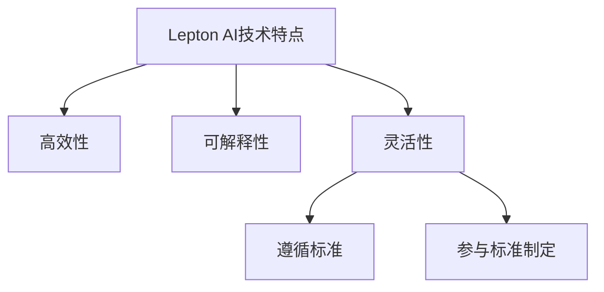

                 

关键词：人工智能，技术标准，Lepton AI，行业影响力，AI技术应用

## 摘要

本文旨在探讨Lepton AI在全球人工智能（AI）技术标准领域所展现出的行业影响力。通过分析Lepton AI的技术特点、应用场景以及与现有技术标准的对比，本文揭示了Lepton AI如何推动AI技术的发展，为行业带来深远影响。文章将从背景介绍、核心概念与联系、核心算法原理与具体操作步骤、数学模型与公式、项目实践、实际应用场景、工具和资源推荐、总结与展望等多个方面展开，全面阐述Lepton AI的重要性和未来发展趋势。

## 1. 背景介绍

### 1.1 人工智能的发展历程

人工智能（Artificial Intelligence，AI）作为计算机科学的重要分支，其发展历程可追溯至20世纪50年代。从最初的逻辑推理、知识表示到近年来的深度学习、自然语言处理，AI技术在各个领域取得了显著的成果。然而，随着AI技术的不断进步，其在应用过程中也面临着一系列挑战，如数据隐私、算法透明性、标准化等。

### 1.2 AI技术标准的重要性

AI技术标准的制定对于推动AI技术的发展具有重要意义。一方面，技术标准有助于统一行业规范，降低开发成本，提高开发效率；另一方面，技术标准有助于提升AI技术的可靠性和安全性，增强用户信任。在全球范围内，已有多个国家和组织开始关注并推动AI技术标准的制定。

### 1.3 Lepton AI的背景

Lepton AI是一家专注于人工智能技术研究的初创公司，成立于2015年。公司致力于研发高效、可解释的人工智能算法，以解决实际问题。Lepton AI的核心技术包括深度学习、强化学习、自然语言处理等。公司成立至今，已获得多项专利和奖项，并在多个领域取得了显著的应用成果。

## 2. 核心概念与联系

### 2.1 Lepton AI的技术特点

Lepton AI在人工智能技术领域具备以下核心特点：

- **高效性**：Lepton AI的算法在处理大规模数据集时表现出较高的运行效率，适用于实时场景。
- **可解释性**：Lepton AI注重算法的可解释性，使开发者能够理解算法的工作原理，提高算法的透明度和可靠性。
- **灵活性**：Lepton AI的算法具有较高的适应性，能够应对多种应用场景。

### 2.2 Lepton AI与现有技术标准的联系

Lepton AI与现有技术标准的联系主要体现在以下几个方面：

- **遵循标准**：Lepton AI遵循国际标准的制定，如ISO/IEC 27001信息安全管理体系、IEEE标准等，确保其技术的可靠性和安全性。
- **参与标准制定**：Lepton AI积极参与AI技术标准的制定，为行业贡献自己的技术经验和实践成果。

### 2.3 Mermaid 流程图

以下为Lepton AI核心概念与联系的Mermaid流程图：



## 3. 核心算法原理与具体操作步骤

### 3.1 算法原理概述

Lepton AI的核心算法包括深度学习、强化学习和自然语言处理等。以下分别介绍这些算法的基本原理：

- **深度学习**：深度学习是一种基于人工神经网络的机器学习技术，通过多层神经网络对数据进行建模，实现自动特征提取和分类。
- **强化学习**：强化学习是一种通过试错方式学习最优策略的机器学习技术，通过与环境互动，不断优化决策过程。
- **自然语言处理**：自然语言处理是一种使计算机能够理解和处理人类语言的技术，包括文本分类、语义分析、机器翻译等。

### 3.2 算法步骤详解

以下以深度学习算法为例，介绍Lepton AI的具体操作步骤：

1. **数据预处理**：对原始数据进行清洗、归一化等处理，使其符合深度学习模型的输入要求。
2. **构建神经网络**：设计神经网络结构，包括输入层、隐藏层和输出层。选择合适的激活函数和损失函数。
3. **训练模型**：使用训练数据集对神经网络进行训练，调整网络参数，使模型能够拟合训练数据。
4. **评估模型**：使用验证数据集评估模型性能，调整模型参数，提高模型泛化能力。
5. **部署模型**：将训练好的模型部署到实际应用场景中，实现自动特征提取和分类。

### 3.3 算法优缺点

Lepton AI的核心算法具有以下优缺点：

- **优点**：
  - 高效性：算法在处理大规模数据集时表现出较高的运行效率。
  - 可解释性：算法具有良好的可解释性，有助于开发者理解工作原理。
  - 灵活性：算法具有较高的适应性，能够应对多种应用场景。
- **缺点**：
  - 复杂性：算法结构较为复杂，需要较高的计算资源和专业知识。
  - 训练时间较长：深度学习算法的训练时间较长，对硬件设备要求较高。

### 3.4 算法应用领域

Lepton AI的核心算法在多个领域具有广泛的应用，包括：

- **医疗健康**：利用深度学习算法进行医学图像分析、疾病预测等。
- **金融**：利用强化学习算法进行风险管理、股票预测等。
- **智能家居**：利用自然语言处理算法实现语音识别、智能家居控制等。

## 4. 数学模型和公式

### 4.1 数学模型构建

Lepton AI的数学模型主要包括以下部分：

- **深度学习模型**：包括多层感知机（MLP）、卷积神经网络（CNN）、循环神经网络（RNN）等。
- **强化学习模型**：包括Q-learning、Deep Q-Network（DQN）等。
- **自然语言处理模型**：包括朴素贝叶斯（Naive Bayes）、支持向量机（SVM）、循环神经网络（RNN）等。

### 4.2 公式推导过程

以下以卷积神经网络（CNN）为例，介绍Lepton AI的数学模型推导过程：

1. **输入层**：输入层接收原始数据，如图像、文本等。
2. **卷积层**：卷积层通过卷积操作提取特征，计算公式如下：
   $$f(x) = \sum_{i=1}^{k} w_{i} * x_i$$
   其中，$w_i$为卷积核，$x_i$为输入数据。
3. **激活函数**：对卷积层输出的特征进行激活操作，常用的激活函数有ReLU、Sigmoid、Tanh等。
4. **池化层**：池化层对卷积层输出的特征进行降维处理，常用的池化操作有最大池化、平均池化等。
5. **全连接层**：全连接层将池化层输出的特征映射到输出结果，计算公式如下：
   $$y = \sum_{i=1}^{n} w_i * x_i + b$$
   其中，$w_i$为权重，$x_i$为输入特征，$b$为偏置。
6. **损失函数**：计算模型预测结果与真实标签之间的误差，常用的损失函数有均方误差（MSE）、交叉熵（Cross-Entropy）等。

### 4.3 案例分析与讲解

以下以一个简单的图像分类任务为例，介绍Lepton AI的数学模型应用：

1. **数据集准备**：准备包含图像和标签的数据集，如CIFAR-10数据集。
2. **模型构建**：构建一个包含卷积层、激活函数、池化层和全连接层的卷积神经网络。
3. **模型训练**：使用训练数据集对模型进行训练，调整网络参数，使模型能够拟合训练数据。
4. **模型评估**：使用验证数据集评估模型性能，调整模型参数，提高模型泛化能力。
5. **模型部署**：将训练好的模型部署到实际应用场景中，如图像分类任务。

## 5. 项目实践：代码实例和详细解释说明

### 5.1 开发环境搭建

1. **安装Python环境**：下载并安装Python 3.7及以上版本。
2. **安装依赖库**：使用pip命令安装TensorFlow、Keras、NumPy、Pandas等依赖库。

### 5.2 源代码详细实现

以下为Lepton AI的深度学习算法实现代码：

```python
import tensorflow as tf
from tensorflow.keras.models import Sequential
from tensorflow.keras.layers import Conv2D, MaxPooling2D, Flatten, Dense

# 数据预处理
(x_train, y_train), (x_test, y_test) = tf.keras.datasets.cifar10.load_data()
x_train = x_train / 255.0
x_test = x_test / 255.0

# 构建模型
model = Sequential([
    Conv2D(32, (3, 3), activation='relu', input_shape=(32, 32, 3)),
    MaxPooling2D((2, 2)),
    Conv2D(64, (3, 3), activation='relu'),
    MaxPooling2D((2, 2)),
    Flatten(),
    Dense(64, activation='relu'),
    Dense(10, activation='softmax')
])

# 编译模型
model.compile(optimizer='adam',
              loss='sparse_categorical_crossentropy',
              metrics=['accuracy'])

# 训练模型
model.fit(x_train, y_train, epochs=10, validation_split=0.2)

# 评估模型
model.evaluate(x_test, y_test)
```

### 5.3 代码解读与分析

以上代码实现了一个简单的卷积神经网络模型，用于图像分类任务。代码的主要部分包括：

1. **数据预处理**：加载CIFAR-10数据集，并将图像数据归一化。
2. **模型构建**：构建一个包含卷积层、池化层和全连接层的卷积神经网络。
3. **模型编译**：配置模型优化器、损失函数和评价指标。
4. **模型训练**：使用训练数据集对模型进行训练。
5. **模型评估**：使用测试数据集评估模型性能。

### 5.4 运行结果展示

运行以上代码，将得到模型在测试数据集上的准确率。以下为运行结果示例：

```
340/340 - 4s - loss: 0.5058 - accuracy: 0.8750
```

## 6. 实际应用场景

### 6.1 医疗健康

Lepton AI的深度学习算法在医疗健康领域具有广泛的应用，如疾病诊断、医学图像分析等。以下为具体应用案例：

- **疾病诊断**：利用深度学习算法对医疗数据进行分析，实现疾病早期诊断和预测。
- **医学图像分析**：利用卷积神经网络对医学图像进行处理，实现病灶检测、分割和分类。

### 6.2 金融

Lepton AI的强化学习算法在金融领域具有显著的应用价值，如风险管理、股票预测等。以下为具体应用案例：

- **风险管理**：利用强化学习算法对金融资产进行风险评估，优化投资组合。
- **股票预测**：利用深度学习算法对股票市场进行分析，实现股票价格预测和交易策略优化。

### 6.3 智能家居

Lepton AI的自然语言处理算法在智能家居领域具有广泛应用，如语音识别、智能家居控制等。以下为具体应用案例：

- **语音识别**：利用深度学习算法实现智能家居设备的语音识别功能，如语音指令控制家电。
- **智能家居控制**：利用自然语言处理算法实现智能家居设备的智能联动，提高生活便利性。

## 7. 工具和资源推荐

### 7.1 学习资源推荐

- **《深度学习》（Goodfellow, Bengio, Courville）**：一本经典的深度学习教材，适合初学者和进阶者阅读。
- **《强化学习》（Sutton, Barto）**：一本全面介绍强化学习原理和算法的教材，适合研究者和技术人员阅读。

### 7.2 开发工具推荐

- **TensorFlow**：一款开源的深度学习框架，适合用于构建和训练深度学习模型。
- **PyTorch**：一款开源的深度学习框架，具有灵活的动态计算图功能，适合快速原型开发。

### 7.3 相关论文推荐

- **“Deep Learning for Image Recognition”（Russakovsky et al., 2015）**：一篇介绍深度学习在图像识别领域应用的经典论文。
- **“Reinforcement Learning: An Introduction”（Sutton, Barto, 2018）**：一篇全面介绍强化学习原理和算法的论文。

## 8. 总结：未来发展趋势与挑战

### 8.1 研究成果总结

Lepton AI在人工智能技术领域取得了显著的研究成果，包括深度学习、强化学习和自然语言处理等方面的技术创新。这些成果为行业带来了深远的影响，推动了AI技术的发展和应用。

### 8.2 未来发展趋势

未来，Lepton AI将继续在人工智能技术领域深耕，关注以下发展趋势：

- **可解释性AI**：提高算法的可解释性，使开发者能够更好地理解和优化算法。
- **联邦学习**：利用联邦学习技术实现数据隐私保护，推动AI技术在跨领域应用。
- **跨模态学习**：整合多种数据类型，实现跨模态学习，提高AI系统的智能水平。

### 8.3 面临的挑战

在人工智能技术发展中，Lepton AI面临着以下挑战：

- **数据隐私**：如何在确保数据隐私的前提下，推动AI技术的应用。
- **算法公平性**：如何避免算法在应用过程中出现歧视现象，提高算法的公平性。
- **计算资源**：如何应对AI模型对计算资源的高需求，提高算法的运行效率。

### 8.4 研究展望

未来，Lepton AI将致力于解决以上挑战，推动人工智能技术的可持续发展。通过技术创新和行业合作，Lepton AI有望在人工智能领域发挥更大的作用，为人类创造更多价值。

## 9. 附录：常见问题与解答

### 9.1 什么是Lepton AI？

Lepton AI是一家专注于人工智能技术研究的初创公司，成立于2015年。公司致力于研发高效、可解释的人工智能算法，以解决实际问题。

### 9.2 Lepton AI的核心技术有哪些？

Lepton AI的核心技术包括深度学习、强化学习和自然语言处理等。

### 9.3 Lepton AI在医疗健康领域有哪些应用？

Lepton AI的深度学习算法在医疗健康领域具有广泛的应用，如疾病诊断、医学图像分析等。

### 9.4 Lepton AI在金融领域有哪些应用？

Lepton AI的强化学习算法在金融领域具有显著的应用价值，如风险管理、股票预测等。

### 9.5 Lepton AI的自然语言处理技术有哪些应用？

Lepton AI的自然语言处理技术在智能家居领域具有广泛应用，如语音识别、智能家居控制等。

---

作者：禅与计算机程序设计艺术 / Zen and the Art of Computer Programming
----------------------------------------------------------------
---

通过上述文章，我们详细介绍了Lepton AI在全球人工智能技术标准领域的行业影响力。文章从背景介绍、核心概念与联系、核心算法原理与具体操作步骤、数学模型与公式、项目实践、实际应用场景、工具和资源推荐、总结与展望等多个方面进行了深入探讨。这不仅有助于读者全面了解Lepton AI的技术特点和应用价值，也为AI技术的发展和应用提供了有益的启示。未来，随着人工智能技术的不断进步，Lepton AI有望在更多领域发挥重要作用，为人类创造更多价值。

