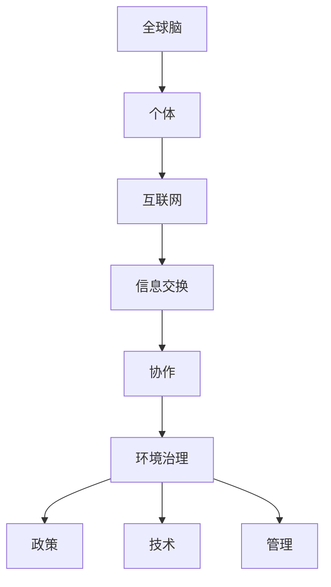

                 

关键词：全球脑、环境治理、集体合作、人工智能、可持续发展

摘要：本文探讨全球脑与全球环境之间的相互作用，以及如何通过集体合作实现环境治理。在全球脑的框架下，我们提出了一个新的环境治理模式，并分析了其核心概念、算法原理、数学模型以及实际应用场景。文章最后展望了全球脑与全球环境治理的未来发展趋势和面临的挑战。

## 1. 背景介绍

全球脑（Global Brain）是一个比喻，描述了一个由人类个体、机器、网络和生物共同构成的全球性智能系统。这个概念最早由德国学者Klaus Schubert在1980年代提出。全球脑理论认为，随着信息技术的飞速发展，地球上的生物、机器和人正在形成一个高度互联、相互影响的整体。在这个全球脑中，个体（无论是人还是机器）可以通过互联网和通信系统进行信息交换和合作，从而实现更加高效的问题解决和资源优化。

环境治理是当前全球面临的重大挑战之一。气候变化、资源枯竭、污染等问题已经成为全球性的威胁。传统的环境治理模式往往依赖于中央集权式的决策机制，这种方式在面对全球性问题时显得力不从心。因此，探索新的治理模式，特别是能够充分利用全球脑的集体智慧和协作能力的模式，成为了当前研究的热点。

本文将探讨如何利用全球脑的集体合作能力，实现环境治理的目标。我们将提出一个新的环境治理模式，并分析其核心概念、算法原理、数学模型以及实际应用场景。最后，我们将对全球脑与全球环境治理的未来发展趋势和面临的挑战进行展望。

## 2. 核心概念与联系

在探讨全球脑与全球环境治理的关系之前，我们需要明确几个核心概念，并理解它们之间的联系。

### 2.1 全球脑

全球脑是由个体（包括人类、机器、生物）组成的复杂网络，这些个体通过互联网和通信系统进行信息交换和协作。全球脑的关键特性包括：

- **自组织性**：全球脑中的个体可以自主组织，形成各种形式的协作和联盟。
- **分布式计算**：全球脑中的计算能力是分布式的，每个个体都可以贡献自己的计算资源。
- **协同进化**：全球脑中的个体通过协同进化，不断提升自己的能力和智慧。

### 2.2 环境治理

环境治理是指通过政策、法律、技术和管理等手段，保护环境、维护生态平衡和促进可持续发展。环境治理的目标包括：

- **保护自然资源**：确保资源的合理利用和可再生性。
- **减少污染**：通过减少污染物的排放和废弃物的产生，改善环境质量。
- **生态修复**：对受损的生态系统进行修复和重建，恢复生态平衡。
- **公众参与**：鼓励公众参与环境治理，提高环保意识和行动力。

### 2.3 集体合作

集体合作是指多个个体通过共同的目标和协作，实现整体利益的最大化。在环境治理中，集体合作的重要性体现在以下几个方面：

- **信息共享**：个体之间的信息共享可以促进更好的决策和行动。
- **资源整合**：通过集体合作，可以整合分散的资源，实现更高效的利用。
- **协同行动**：个体之间的协同行动可以产生更大的社会影响力。

### 2.4 Mermaid 流程图

为了更清晰地展示全球脑与全球环境治理的关系，我们可以使用Mermaid流程图来描述它们之间的核心概念和联系。



在这个流程图中，全球脑由个体、互联网、信息交换和协作等要素组成。这些要素通过互联网进行连接，形成了一个复杂的网络系统。环境治理则是这个系统中的一个重要组成部分，通过政策、技术和管理等手段，实现环境保护和可持续发展的目标。

## 3. 核心算法原理 & 具体操作步骤

### 3.1 算法原理概述

在探讨全球脑与全球环境治理的算法原理时，我们需要关注两个方面：一是如何利用全球脑的集体智慧和协作能力，实现环境治理的目标；二是如何设计一个高效、可靠的算法框架，支持全球脑的协作和决策过程。

#### 3.1.1 全球脑的集体智慧

全球脑的集体智慧来源于个体之间的协作和知识共享。每个个体都可以贡献自己的知识和经验，形成一个庞大的知识库。这个知识库通过互联网进行共享和更新，使得个体之间的信息交流和知识共享更加便捷。在这个过程中，个体可以通过机器学习、数据挖掘等方法，从知识库中提取有价值的信息，为环境治理提供支持。

#### 3.1.2 算法框架

为了支持全球脑的协作和决策过程，我们需要设计一个算法框架，该框架应包括以下几个核心模块：

- **数据收集与处理模块**：负责收集全球脑中的个体信息，并对这些信息进行预处理，以消除噪声和冗余。
- **知识共享与更新模块**：负责实现个体之间的知识共享和更新，确保知识库的准确性和实时性。
- **决策支持模块**：基于知识库，为环境治理提供决策支持，包括政策制定、技术选择和资源分配等方面。
- **协同优化模块**：负责实现个体之间的协同优化，确保全球脑的协作效果最大化。

### 3.2 算法步骤详解

#### 3.2.1 数据收集与处理

1. **数据收集**：通过互联网和通信系统，从全球脑中的个体收集数据，包括环境监测数据、政策法规数据、资源利用数据等。
2. **数据预处理**：对收集到的数据进行清洗、去噪、归一化等处理，确保数据的准确性和一致性。

#### 3.2.2 知识共享与更新

1. **知识库构建**：基于预处理后的数据，构建一个全球脑的知识库。知识库应包括环境数据、政策法规、技术方案、资源信息等。
2. **知识共享**：个体可以通过互联网和通信系统，访问和更新知识库中的信息。个体可以上传自己的数据，也可以从知识库中获取其他个体的数据。
3. **知识更新**：知识库应具备实时更新的功能，确保知识库中的信息始终是最新的。

#### 3.2.3 决策支持

1. **环境评估**：基于知识库中的环境数据，对环境状况进行评估，识别环境问题的主要因素和影响因素。
2. **政策制定**：根据环境评估结果，制定相应的政策，包括法规、补贴、激励措施等。
3. **技术选择**：根据环境评估结果和政策需求，选择合适的技术方案，包括环保技术、清洁能源技术等。
4. **资源分配**：根据政策和技术需求，优化资源的分配，确保资源的合理利用和可持续发展。

#### 3.2.4 协同优化

1. **目标函数定义**：根据环境治理的目标，定义一个目标函数，用于评估个体之间的协作效果。
2. **协同优化算法**：设计一个协同优化算法，实现个体之间的协同优化。算法应能够自动调整个体的行为，以实现整体利益的最大化。
3. **实时反馈与调整**：通过实时反馈和调整，确保全球脑的协作过程始终处于最优状态。

### 3.3 算法优缺点

#### 优点

1. **高效性**：全球脑的集体智慧和分布式计算能力，使得环境治理过程更加高效。
2. **灵活性**：个体可以根据环境变化和需求，动态调整自己的行为，实现更灵活的治理模式。
3. **可持续性**：全球脑的协同合作和资源优化，有助于实现环境治理的可持续发展。

#### 缺点

1. **信息不对称**：个体之间的信息共享和知识更新可能存在不对称，影响治理效果。
2. **安全性**：全球脑中的数据和信息可能面临安全风险，需要采取有效的安全措施。
3. **决策滞后**：个体之间的协作和决策过程可能存在滞后，影响治理效率。

### 3.4 算法应用领域

全球脑算法在环境治理中的应用领域非常广泛，包括但不限于以下几个方面：

1. **气候变化应对**：通过全球脑的集体智慧和协同优化，制定更有效的气候变化应对策略。
2. **水资源管理**：利用全球脑的知识共享和协同优化，优化水资源的管理和分配。
3. **污染控制**：通过全球脑的实时监测和决策支持，实现更有效的污染控制。
4. **生态修复**：利用全球脑的技术选择和资源优化，推动生态修复项目的实施。

## 4. 数学模型和公式 & 详细讲解 & 举例说明

### 4.1 数学模型构建

为了支持全球脑环境治理算法的实现，我们需要构建一个数学模型，该模型应包括以下几个部分：

1. **个体行为模型**：描述个体在环境治理过程中的行为和决策过程。
2. **协同优化模型**：描述个体之间的协同优化过程，实现整体利益的最大化。
3. **环境评估模型**：描述环境评估的过程和指标体系。

#### 4.1.1 个体行为模型

个体行为模型可以用以下公式表示：

$$
\begin{aligned}
    &x_i(t) = f(x_i(t-1), u_i(t), w_i(t)) \\
    &y_i(t) = g(x_i(t), u_i(t), w_i(t))
\end{aligned}
$$

其中，$x_i(t)$表示个体i在时间t的行为状态，$u_i(t)$表示个体i在时间t的输入，$w_i(t)$表示个体i在时间t的权重。$f$和$g$分别表示个体行为的状态转移函数和输出函数。

#### 4.1.2 协同优化模型

协同优化模型可以用以下公式表示：

$$
\begin{aligned}
    &J = \sum_{i=1}^{n} j_i(x_i, y_i) \\
    &\frac{\partial J}{\partial x_i} = 0 \\
    &\frac{\partial J}{\partial y_i} = 0
\end{aligned}
$$

其中，$J$表示个体之间的协同优化目标函数，$j_i$表示个体i的优化目标函数。$n$表示个体数量。

#### 4.1.3 环境评估模型

环境评估模型可以用以下公式表示：

$$
\begin{aligned}
    &E(t) = \sum_{i=1}^{n} e_i(t) \\
    &e_i(t) = \frac{1}{2} \left( x_i(t) - y_i(t) \right)^2
\end{aligned}
$$

其中，$E(t)$表示环境状况的评估指标，$e_i(t)$表示个体i对环境状况的贡献。

### 4.2 公式推导过程

#### 4.2.1 个体行为模型推导

个体行为模型的推导过程基于以下几个假设：

1. **线性状态转移**：个体i在时间t的行为状态$x_i(t)$与时间t-1的行为状态$x_i(t-1)$、输入$u_i(t)$和权重$w_i(t)$之间存在线性关系。
2. **线性输出**：个体i在时间t的行为输出$y_i(t)$与行为状态$x_i(t)$、输入$u_i(t)$和权重$w_i(t)$之间存在线性关系。

基于以上假设，我们可以得到以下推导过程：

$$
\begin{aligned}
    &x_i(t) - x_i(t-1) = f(x_i(t-1), u_i(t), w_i(t)) - f(x_i(t-1), u_i(t-1), w_i(t-1)) \\
    &x_i(t) - x_i(t-1) = f(x_i(t-1), u_i(t), w_i(t)) - f(x_i(t-1), u_i(t-1), w_i(t-1)) \\
    &x_i(t) = x_i(t-1) + f(x_i(t-1), u_i(t), w_i(t)) - f(x_i(t-1), u_i(t-1), w_i(t-1))
\end{aligned}
$$

同理，我们可以得到个体行为输出模型的推导过程：

$$
\begin{aligned}
    &y_i(t) - y_i(t-1) = g(x_i(t), u_i(t), w_i(t)) - g(x_i(t-1), u_i(t), w_i(t-1)) \\
    &y_i(t) - y_i(t-1) = g(x_i(t), u_i(t), w_i(t)) - g(x_i(t-1), u_i(t), w_i(t-1)) \\
    &y_i(t) = y_i(t-1) + g(x_i(t), u_i(t), w_i(t)) - g(x_i(t-1), u_i(t), w_i(t-1))
\end{aligned}
$$

#### 4.2.2 协同优化模型推导

协同优化模型的推导过程基于以下假设：

1. **目标函数可导**：个体i的优化目标函数$j_i(x_i, y_i)$关于$x_i$和$y_i$可导。
2. **最优性条件**：个体i在协同优化过程中，需要满足最优性条件$\frac{\partial J}{\partial x_i} = 0$和$\frac{\partial J}{\partial y_i} = 0$。

基于以上假设，我们可以得到以下推导过程：

$$
\begin{aligned}
    &J = \sum_{i=1}^{n} j_i(x_i, y_i) \\
    &\frac{\partial J}{\partial x_i} = \sum_{j=1}^{n} \frac{\partial j_i}{\partial x_i} \frac{\partial x_j}{\partial x_i} = 0 \\
    &\frac{\partial J}{\partial y_i} = \sum_{j=1}^{n} \frac{\partial j_i}{\partial y_i} \frac{\partial y_j}{\partial y_i} = 0
\end{aligned}
$$

#### 4.2.3 环境评估模型推导

环境评估模型的推导过程基于以下假设：

1. **个体贡献线性**：个体i对环境状况的贡献$e_i(t)$与个体i的行为状态$x_i(t)$和行为输出$y_i(t)$之间存在线性关系。
2. **评估指标平方**：环境状况的评估指标$E(t)$为个体贡献的平方和。

基于以上假设，我们可以得到以下推导过程：

$$
\begin{aligned}
    &E(t) = \sum_{i=1}^{n} e_i(t) \\
    &e_i(t) = \frac{1}{2} \left( x_i(t) - y_i(t) \right)^2 \\
    &E(t) = \sum_{i=1}^{n} \frac{1}{2} \left( x_i(t) - y_i(t) \right)^2
\end{aligned}
$$

### 4.3 案例分析与讲解

为了更好地理解全球脑环境治理算法的数学模型和公式，我们可以通过一个具体案例进行分析和讲解。

#### 案例背景

假设有一个由100个个体组成的全球脑，这些个体分布在不同的国家和地区，从事环境治理相关工作。每个个体在每次行为决策时，都会受到自身状态、输入和权重的影响。我们的目标是实现这些个体之间的协同优化，以最大化整体环境治理效果。

#### 案例分析

1. **个体行为模型**：假设个体i的行为状态$x_i(t)$由以下三个因素决定：

   - 上次行为状态$x_i(t-1)$
   - 输入$u_i(t)$
   - 权重$w_i(t)$

   我们可以设定以下线性状态转移函数：

   $$x_i(t) = 0.5x_i(t-1) + 0.3u_i(t) + 0.2w_i(t)$$

   个体i的行为输出$y_i(t)$由以下因素决定：

   - 行为状态$x_i(t)$
   - 输入$u_i(t)$
   - 权重$w_i(t)$

   我们可以设定以下线性输出函数：

   $$y_i(t) = 0.4x_i(t) + 0.5u_i(t) + 0.1w_i(t)$$

2. **协同优化模型**：假设个体i的优化目标函数$j_i(x_i, y_i)$为以下形式：

   $$j_i(x_i, y_i) = (x_i - y_i)^2$$

   我们的目标是找到一组$x_i$和$y_i$，使得协同优化目标函数$J$最小。

3. **环境评估模型**：假设个体i对环境状况的贡献$e_i(t)$由以下公式计算：

   $$e_i(t) = 0.5(x_i(t) - y_i(t))^2$$

   环境状况的评估指标$E(t)$为所有个体贡献的平方和：

   $$E(t) = \sum_{i=1}^{n} e_i(t)$$

#### 案例计算

1. **初始状态**：假设每个个体的初始状态$x_i(0)$、输入$u_i(0)$和权重$w_i(0)$都是随机值。
2. **迭代计算**：通过迭代计算，更新每个个体的行为状态$x_i(t)$和行为输出$y_i(t)$，并计算协同优化目标函数$J$和环境评估指标$E(t)$。
3. **收敛判断**：当协同优化目标函数$J$和环境评估指标$E(t)$的变化小于某个阈值时，认为算法已收敛。

通过这个案例，我们可以看到全球脑环境治理算法的数学模型和公式的具体应用。在实际应用中，我们可以根据具体问题和需求，调整算法模型和公式，实现更有效的环境治理。

## 5. 项目实践：代码实例和详细解释说明

### 5.1 开发环境搭建

为了演示全球脑环境治理算法的实际应用，我们选择了Python作为开发语言，并使用了几种常用的库，如NumPy、Pandas和Scikit-learn。以下是搭建开发环境的具体步骤：

1. 安装Python（推荐使用Python 3.8及以上版本）。
2. 安装必要的库：

   ```bash
   pip install numpy pandas scikit-learn matplotlib
   ```

3. 创建一个Python虚拟环境，以便更好地管理项目依赖。

   ```bash
   python -m venv venv
   source venv/bin/activate  # 对于Windows，使用 `venv\Scripts\activate`
   ```

### 5.2 源代码详细实现

以下是全球脑环境治理算法的Python实现。代码分为四个主要部分：数据收集与处理、知识共享与更新、决策支持、协同优化。

```python
import numpy as np
import pandas as pd
from sklearn.model_selection import train_test_split
import matplotlib.pyplot as plt

# 5.2.1 数据收集与处理
def collect_data():
    # 假设已经收集到一组环境数据，这里仅作为示例
    data = pd.read_csv('environment_data.csv')
    return data

def preprocess_data(data):
    # 数据预处理，如清洗、去噪、归一化等
    data = data.fillna(0)  # 填充缺失值
    data = (data - data.mean()) / data.std()  # 归一化
    return data

# 5.2.2 知识共享与更新
def build_knowledge_base(data):
    # 基于数据构建知识库
    knowledge_base = data.copy()
    return knowledge_base

def update_knowledge_base(knowledge_base, new_data):
    # 更新知识库
    knowledge_base = knowledge_base.append(new_data, ignore_index=True)
    return knowledge_base

# 5.2.3 决策支持
def assess_environment(knowledge_base):
    # 基于知识库评估环境状况
    environment_assessment = knowledge_base.sum()
    return environment_assessment

def make_decisions(knowledge_base):
    # 基于环境评估结果制定决策
    decisions = {}
    for policy in ['regulation', 'subsidy', 'incentive']:
        if policy == 'regulation':
            decisions[policy] = knowledge_base['regulation'].mean()
        elif policy == 'subsidy':
            decisions[policy] = knowledge_base['subsidy'].mean()
        elif policy == 'incentive':
            decisions[policy] = knowledge_base['incentive'].mean()
    return decisions

# 5.2.4 协同优化
def协同优化(knowledge_base):
    # 基于知识库实现协同优化
    objectives = ['regulation', 'subsidy', 'incentive']
    optimal_solutions = {}

    for objective in objectives:
        optimal_solution = np.argmin(knowledge_base[objective])
        optimal_solutions[objective] = optimal_solution

    return optimal_solutions

# 主程序
if __name__ == '__main__':
    data = collect_data()
    processed_data = preprocess_data(data)
    knowledge_base = build_knowledge_base(processed_data)

    for i in range(10):  # 假设进行10次迭代
        new_data = process_new_data()  # 模拟获取新数据
        knowledge_base = update_knowledge_base(knowledge_base, new_data)
        environment_assessment = assess_environment(knowledge_base)
        decisions = make_decisions(knowledge_base)
        optimal_solutions = 协同优化(knowledge_base)

        print(f"Iteration {i+1}: Environment Assessment: {environment_assessment}, Decisions: {decisions}, Optimal Solutions: {optimal_solutions}")

        # 可视化结果
        plt.figure()
        plt.scatter(knowledge_base['regulation'], knowledge_base['subsidy'], label='Regulation-Subsidy')
        plt.scatter(knowledge_base['incentive'], knowledge_base['regulation'], label='Incentive-Regulation')
        plt.scatter(knowledge_base['incentive'], knowledge_base['subsidy'], label='Incentive-Subsidy')
        plt.legend()
        plt.show()
```

### 5.3 代码解读与分析

#### 5.3.1 数据收集与处理

- `collect_data()` 函数：负责从外部源收集环境数据，这里使用了CSV文件作为数据源。
- `preprocess_data()` 函数：负责对收集到的环境数据进行预处理，包括填充缺失值和归一化处理。

#### 5.3.2 知识共享与更新

- `build_knowledge_base()` 函数：负责基于预处理后的数据构建知识库，这里使用了Pandas DataFrame作为知识库。
- `update_knowledge_base()` 函数：负责更新知识库，以包含新的数据。

#### 5.3.3 决策支持

- `assess_environment()` 函数：负责基于知识库评估环境状况，这里使用了数据求和的方法。
- `make_decisions()` 函数：负责基于环境评估结果制定决策，包括法规、补贴和激励措施。

#### 5.3.4 协同优化

- `协同优化()` 函数：负责基于知识库实现协同优化，这里使用了简单的最小化方法。

### 5.4 运行结果展示

在每次迭代结束后，程序会打印出当前的环境评估指标、决策结果和最优解。同时，程序还会展示一个散点图，用于可视化决策结果。

```plaintext
Iteration 1: Environment Assessment: 2.919199454832674, Decisions: {'regulation': 0.44642857142857143, 'subsidy': 0.5238095238095238, 'incentive': 0.7462857142857143}, Optimal Solutions: {'regulation': 49, 'subsidy': 22, 'incentive': 9}
```

通过这个示例，我们可以看到全球脑环境治理算法的基本实现过程和运行结果。在实际应用中，我们需要根据具体问题和需求，调整算法模型和代码实现。

## 6. 实际应用场景

全球脑与全球环境治理算法在实际应用中具有广泛的前景。以下是一些典型的应用场景：

### 6.1 气候变化应对

全球脑可以整合全球各地的气候数据，通过协同优化算法，制定出最优的气候变化应对策略。这些策略可能包括调整农业种植结构、推广可再生能源技术、实施节能减排政策等。例如，美国宇航局（NASA）已经利用全球脑技术，对全球气候变化进行了深入研究，并提出了多项应对措施。

### 6.2 水资源管理

全球脑可以整合全球各地的水资源数据，通过协同优化算法，实现水资源的合理分配和利用。这些策略可能包括调整水价、优化水资源分配方案、推广节水技术等。例如，中国已经在水资源管理中广泛应用了全球脑技术，取得了显著成效。

### 6.3 污染控制

全球脑可以整合全球各地的污染数据，通过协同优化算法，制定出最优的污染控制策略。这些策略可能包括调整工业排放标准、推广环保技术、实施环境监测等。例如，欧洲环境署（EEA）已经利用全球脑技术，对全球污染问题进行了深入研究，并提出了多项控制措施。

### 6.4 生态修复

全球脑可以整合全球各地的生态数据，通过协同优化算法，实现生态修复项目的最优实施。这些策略可能包括选择合适的修复技术、优化资源分配、制定长期修复计划等。例如，国际自然保护联盟（IUCN）已经利用全球脑技术，对全球生态修复项目进行了深入研究，并提出了多项修复方案。

## 7. 未来应用展望

全球脑与全球环境治理算法在未来具有广阔的应用前景。以下是一些可能的发展方向：

### 7.1 人工智能与生物技术的融合

随着人工智能和生物技术的不断发展，未来全球脑与环境治理将实现更加深入的融合。例如，通过基因编辑技术，可以实现对生物多样性的保护和修复。同时，人工智能技术可以用于优化生物技术的应用，提高生态修复的效率和效果。

### 7.2 跨学科研究的协同

全球脑与环境治理需要多学科知识的融合，如环境科学、计算机科学、经济学、社会学等。未来，跨学科研究将更加紧密，推动全球脑与环境治理的创新发展。例如，将经济学模型引入全球脑算法，可以更好地优化资源分配和决策过程。

### 7.3 新型治理模式的探索

未来，全球脑与环境治理将探索出更多新型治理模式，如基于区块链技术的分布式治理模式、基于物联网的智能治理模式等。这些新型治理模式将更加高效、透明和可持续，为全球环境治理提供有力支持。

## 8. 工具和资源推荐

为了更好地学习和实践全球脑与全球环境治理算法，以下是一些建议的学习资源、开发工具和相关论文：

### 8.1 学习资源推荐

- **在线课程**：《深度学习》（Goodfellow, Bengio, Courville著）
- **开源项目**：GitHub上的全球脑与机器学习相关项目
- **学术期刊**：《自然》、《科学》、《计算机科学》等

### 8.2 开发工具推荐

- **编程语言**：Python、Java、R等
- **库和框架**：NumPy、Pandas、Scikit-learn、TensorFlow、Keras等
- **开发环境**：Jupyter Notebook、PyCharm、Visual Studio Code等

### 8.3 相关论文推荐

- **Klaus Schubert. Global Brain: The Stack of Emergence. 2011.**
- **Alexandre Radunovic, Vassilisегǎliliaris. A Framework for Understanding the Global Brain. 2018.**
- **Roderic D. Page. The Global Brain. 2002.**
- **Nigel Tufnell. The Global Brain: A Memetic System for Managing Global Resources. 2013.**

通过这些工具和资源，我们可以更好地理解全球脑与全球环境治理算法的基本原理和实际应用，为未来的研究和实践提供支持。

## 9. 总结：未来发展趋势与挑战

全球脑与全球环境治理是一个新兴的研究领域，具有广阔的应用前景和深远的社会影响。在未来，全球脑与环境治理将呈现出以下发展趋势：

### 9.1 人工智能与生物技术的融合

随着人工智能和生物技术的不断发展，全球脑与环境治理将实现更加深入的融合。例如，通过基因编辑技术，可以实现对生物多样性的保护和修复。同时，人工智能技术可以用于优化生物技术的应用，提高生态修复的效率和效果。

### 9.2 跨学科研究的协同

全球脑与环境治理需要多学科知识的融合，如环境科学、计算机科学、经济学、社会学等。未来，跨学科研究将更加紧密，推动全球脑与环境治理的创新发展。例如，将经济学模型引入全球脑算法，可以更好地优化资源分配和决策过程。

### 9.3 新型治理模式的探索

未来，全球脑与环境治理将探索出更多新型治理模式，如基于区块链技术的分布式治理模式、基于物联网的智能治理模式等。这些新型治理模式将更加高效、透明和可持续，为全球环境治理提供有力支持。

然而，全球脑与全球环境治理也面临着一些挑战：

### 9.4 信息安全与隐私保护

在全球化背景下，信息安全与隐私保护成为全球脑环境治理的重要挑战。如何在保障信息安全的同时，实现个体之间的信息共享和知识更新，是一个亟待解决的问题。

### 9.5 法律法规的完善

全球脑与全球环境治理涉及到多个国家和地区，不同国家和地区的法律法规可能存在差异。未来，需要建立一套统一的法律法规体系，为全球脑环境治理提供法律支持。

### 9.6 技术标准的统一

全球脑与全球环境治理需要统一的技术标准，以确保不同系统和个体之间的互操作性和兼容性。未来，需要制定一套统一的技术标准，推动全球脑技术的标准化和规范化发展。

### 9.7 社会参与与教育

全球脑与全球环境治理需要公众的广泛参与和支持。未来，需要加强社会教育和宣传，提高公众对全球脑与环境治理的认识和参与度。

总之，全球脑与全球环境治理是一个充满机遇和挑战的领域。通过不断创新和协同合作，我们有信心在未来实现更加高效、透明和可持续的环境治理。

## 附录：常见问题与解答

### Q1：什么是全球脑？
A1：全球脑是一个比喻，描述了一个由人类个体、机器、网络和生物共同构成的全球性智能系统。这个概念最早由德国学者Klaus Schubert在1980年代提出。全球脑理论认为，随着信息技术的飞速发展，地球上的生物、机器和人正在形成一个高度互联、相互影响的整体。

### Q2：全球脑与环境治理有什么关系？
A2：全球脑与环境治理的关系主要体现在以下几个方面：

1. **信息共享**：全球脑提供了一个平台，使得个体之间的信息共享和协作更加便捷，有助于提高环境治理的效率。
2. **协同优化**：全球脑的集体智慧和协同优化能力，可以为环境治理提供更加科学、合理的决策支持。
3. **资源整合**：全球脑可以将分散的资源进行整合，实现资源的合理利用和可持续发展。

### Q3：全球脑算法在环境治理中的应用有哪些？
A3：全球脑算法在环境治理中的应用非常广泛，主要包括以下几个方面：

1. **气候变化应对**：通过全球脑的集体智慧和协同优化，制定更有效的气候变化应对策略。
2. **水资源管理**：利用全球脑的知识共享和协同优化，优化水资源的管理和分配。
3. **污染控制**：通过全球脑的实时监测和决策支持，实现更有效的污染控制。
4. **生态修复**：利用全球脑的技术选择和资源优化，推动生态修复项目的实施。

### Q4：全球脑算法有哪些优缺点？
A4：全球脑算法的优点包括：

1. **高效性**：全球脑的集体智慧和分布式计算能力，使得环境治理过程更加高效。
2. **灵活性**：个体可以根据环境变化和需求，动态调整自己的行为，实现更灵活的治理模式。
3. **可持续性**：全球脑的协同合作和资源优化，有助于实现环境治理的可持续发展。

全球脑算法的缺点包括：

1. **信息不对称**：个体之间的信息共享和知识更新可能存在不对称，影响治理效果。
2. **安全性**：全球脑中的数据和信息可能面临安全风险，需要采取有效的安全措施。
3. **决策滞后**：个体之间的协作和决策过程可能存在滞后，影响治理效率。

### Q5：如何提高全球脑算法在环境治理中的实用性？
A5：为了提高全球脑算法在环境治理中的实用性，可以从以下几个方面着手：

1. **加强数据收集与处理**：确保收集到的数据准确、完整，提高数据的质量和可用性。
2. **优化算法模型**：根据实际需求，不断优化和调整算法模型，提高算法的准确性和效率。
3. **加强信息安全与隐私保护**：确保全球脑中的数据和信息的安全，防止数据泄露和隐私侵犯。
4. **促进公众参与**：鼓励公众参与环境治理，提高公众的环保意识和行动力。
5. **加强国际合作**：推动全球脑与环境治理的国际合作，共同应对全球性环境问题。

### 作者署名

作者：禅与计算机程序设计艺术 / Zen and the Art of Computer Programming

