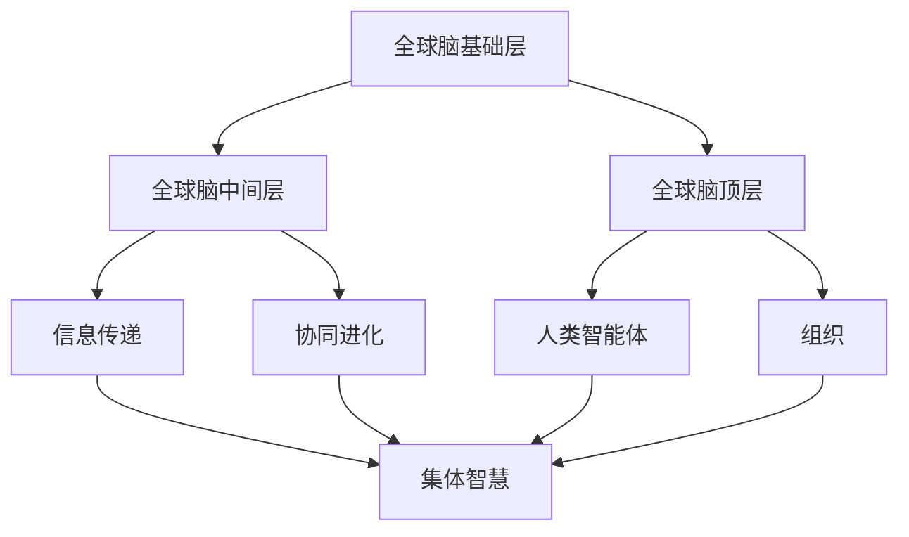

                 

关键词：全球脑、集体智慧、财富共享、数字经济、社会网络分析

> 摘要：本文探讨了全球脑与全球经济之间的关系，以及集体智慧在财富共享中的关键作用。通过分析全球脑的概念和架构，阐述集体智慧如何驱动全球经济，提高资源配置效率，促进社会公平。本文还探讨了未来全球脑与全球经济融合的发展趋势、面临的挑战及研究展望。

## 1. 背景介绍

在21世纪，随着信息技术的飞速发展，全球脑（Global Brain）的概念逐渐引起广泛关注。全球脑是一种基于网络连接的智能体系统，它通过信息传递和协同进化，实现全球范围内的智能决策和资源优化配置。全球脑的理论基础包括复杂系统科学、网络科学、智能计算和社会学等多个领域。

与此同时，全球经济正面临深刻的变革。数字经济成为推动经济增长的新引擎，互联网、大数据、人工智能等新技术不断涌现，改变了传统经济模式。在这样一个背景下，如何利用全球脑的集体智慧，实现财富的共享与分配，成为亟待解决的问题。

本文旨在探讨全球脑与全球经济之间的关系，分析集体智慧在财富共享中的作用，以及未来全球脑与全球经济融合的发展趋势。

### 1.1 全球脑的概念

全球脑是一个比喻，用于描述由人类、机器和算法组成的复杂网络系统。这个网络通过信息传递、知识共享和协同进化，形成了一种类似于人类大脑的智能体系统。全球脑的组成部分包括：

1. **智能体**：智能体是网络中的基本单位，可以是人类个体、组织、机器或算法。它们通过互联网和其他通信技术相互连接，共享信息，协同工作。

2. **信息传递**：全球脑中的信息传递是通过互联网和通信技术实现的。这些技术使得智能体之间可以高效地传递信息，共享知识。

3. **协同进化**：全球脑中的智能体通过协同进化，不断优化自身的性能和行为。这种协同进化是基于信息的共享和反馈，使得整个系统不断适应和优化。

### 1.2 集体智慧的概念

集体智慧（Collective Intelligence）是指一群个体通过相互协作和信息共享，共同完成复杂任务或解决复杂问题的能力。集体智慧的形成依赖于以下几个关键要素：

1. **信息共享**：个体之间通过信息共享，使得整个系统中的知识得到最大程度的利用。

2. **协同工作**：个体通过协同工作，共同完成任务或解决问题。

3. **自我组织**：集体智慧系统具有自我组织的能力，能够自动适应环境变化，优化自身结构。

### 1.3 全球脑与集体智慧的关系

全球脑是集体智慧的载体，集体智慧是全球脑的核心。全球脑通过智能体之间的信息传递和协同进化，实现集体智慧的发挥。而集体智慧则通过优化资源配置、提高决策效率，推动全球经济的发展。

## 2. 核心概念与联系

### 2.1 全球脑的架构

全球脑的架构可以分为三个层次：基础层、中间层和顶层。

1. **基础层**：基础层包括物理基础设施，如互联网、数据中心、通信网络等。这些基础设施提供了全球脑运行所需的硬件支持。

2. **中间层**：中间层包括软件系统和算法，如云计算、大数据分析、人工智能等。这些系统和算法提供了全球脑运行所需的计算能力和数据处理能力。

3. **顶层**：顶层包括人类智能体和组织，如个人、企业、政府等。这些智能体和组织通过信息共享和协同工作，实现全球脑的智能决策和资源优化配置。

### 2.2 集体智慧的理论基础

集体智慧的理论基础包括以下几方面：

1. **信息共享**：信息共享是集体智慧的基础。只有通过信息共享，个体才能获取到更多的知识，提高解决问题的能力。

2. **协同工作**：协同工作是集体智慧的保障。个体需要通过协同工作，共同完成任务或解决问题。

3. **自我组织**：自我组织是集体智慧的关键。集体智慧系统需要具备自我组织的能力，能够自动适应环境变化，优化自身结构。

### 2.3 全球脑与集体智慧的Mermaid流程图



## 3. 核心算法原理 & 具体操作步骤

### 3.1 算法原理概述

全球脑的集体智慧驱动主要依赖于以下核心算法：

1. **社交网络分析**：通过分析社交网络中的节点和边，识别关键节点和影响力网络，实现信息的快速传递和知识共享。

2. **机器学习**：利用机器学习算法，对海量数据进行训练和预测，实现智能决策和资源优化配置。

3. **分布式计算**：通过分布式计算，将复杂任务分解为子任务，分布式执行，提高计算效率。

### 3.2 算法步骤详解

1. **社交网络分析**

   - 收集社交网络数据，包括节点和边的属性。
   - 对社交网络进行预处理，去除噪声和冗余数据。
   - 使用图论算法，计算节点之间的相似度和影响力。
   - 根据影响力大小，识别关键节点和影响力网络。

2. **机器学习**

   - 收集历史数据，包括输入特征和输出结果。
   - 对输入特征进行预处理，如归一化、标准化等。
   - 使用机器学习算法，如决策树、支持向量机等，对数据进行训练和预测。
   - 对模型进行评估，如准确率、召回率等。

3. **分布式计算**

   - 将复杂任务分解为子任务。
   - 将子任务分布到不同的计算节点上执行。
   - 将子任务的执行结果汇总，得到最终结果。

### 3.3 算法优缺点

1. **社交网络分析**

   - 优点：能够快速识别关键节点和影响力网络，实现信息的快速传递和知识共享。
   - 缺点：对社交网络数据的质量要求较高，否则可能导致分析结果不准确。

2. **机器学习**

   - 优点：能够自动从数据中学习，提高决策的准确性和效率。
   - 缺点：对大量数据进行训练和预测，需要较高的计算资源和时间。

3. **分布式计算**

   - 优点：能够提高计算效率，处理大规模任务。
   - 缺点：需要复杂的分布式计算架构和算法设计。

### 3.4 算法应用领域

1. **社交网络分析**：应用于社交网络分析、推荐系统、市场营销等领域。

2. **机器学习**：应用于金融、医疗、物联网等领域。

3. **分布式计算**：应用于云计算、大数据处理、人工智能等领域。

## 4. 数学模型和公式 & 详细讲解 & 举例说明

### 4.1 数学模型构建

全球脑的集体智慧驱动主要依赖于以下数学模型：

1. **图模型**：用于描述社交网络的结构和特性。

2. **机器学习模型**：用于从数据中学习，实现智能决策。

3. **优化模型**：用于资源优化配置。

### 4.2 公式推导过程

1. **图模型**

   - 社交网络中的节点度分布服从泊松分布。

   $$ P(k) = \frac{\lambda^k e^{-\lambda}}{k!} $$

   - 社交网络中的平均路径长度。

   $$ L = \frac{1}{N} \sum_{i=1}^{N} \sum_{j=1}^{N} d(i, j) $$

2. **机器学习模型**

   - 决策树模型的分类函数。

   $$ f(x) = \sum_{i=1}^{M} w_i \cdot \text{sign}(\sum_{j=1}^{N} x_j \cdot w_{ji}) $$

   - 支持向量机模型的决策函数。

   $$ f(x) = \text{sign}(\sum_{i=1}^{M} \alpha_i y_i \cdot \phi(x_i) + b) $$

3. **优化模型**

   - 资源优化配置的最优化问题。

   $$ \min_{x} \sum_{i=1}^{N} c_i x_i $$
   $$ \text{subject to} \quad A x \leq b $$

### 4.3 案例分析与讲解

#### 案例一：社交网络分析

假设一个社交网络包含100个节点和200条边。通过图模型，我们可以计算出节点度分布、平均路径长度等指标。

1. **节点度分布**

   - 平均度数。

   $$ \bar{k} = \frac{2E}{N} = \frac{2 \times 200}{100} = 4 $$

   - 节点度分布。

   $$ P(k) = \frac{\lambda^k e^{-\lambda}}{k!} $$

   其中，$\lambda = \bar{k}$。

2. **平均路径长度**

   $$ L = \frac{1}{N} \sum_{i=1}^{N} \sum_{j=1}^{N} d(i, j) $$

   通过计算，我们可以得到社交网络的平均路径长度。

#### 案例二：机器学习

假设我们使用决策树模型对一组数据进行分类。给定特征向量$x = (x_1, x_2, \ldots, x_N)$和权重向量$w = (w_1, w_2, \ldots, w_N)$，我们可以使用以下公式计算分类结果。

$$ f(x) = \text{sign}(\sum_{i=1}^{M} w_i \cdot \text{sign}(\sum_{j=1}^{N} x_j \cdot w_{ji})) $$

通过训练和优化，我们可以得到最优的权重向量$w^*$，从而实现准确的分类。

#### 案例三：优化模型

假设我们要在有限资源下，实现资源的最优配置。给定成本向量$c = (c_1, c_2, \ldots, c_N)$和约束矩阵$A$和向量$b$，我们可以使用以下公式求解最优解。

$$ \min_{x} \sum_{i=1}^{N} c_i x_i $$
$$ \text{subject to} \quad A x \leq b $$

通过优化算法，我们可以得到最优的$x^*$，实现资源的最优配置。

## 5. 项目实践：代码实例和详细解释说明

### 5.1 开发环境搭建

在本文的项目实践中，我们将使用Python作为主要编程语言，结合matplotlib、networkx、scikit-learn等库，实现全球脑的集体智慧驱动。以下是开发环境的搭建步骤：

1. 安装Python 3.8及以上版本。

2. 安装必要的库：

   ```bash
   pip install matplotlib
   pip install networkx
   pip install scikit-learn
   ```

### 5.2 源代码详细实现

以下是一个简单的示例，展示如何使用Python实现社交网络分析、机器学习和优化模型。

```python
import networkx as nx
import matplotlib.pyplot as plt
from sklearn.tree import DecisionTreeClassifier
from scipy.optimize import linprog

# 社交网络分析
def social_network_analysis(graph):
    degrees = nx.degree(graph)
    avg_path_length = nx.average_shortest_path_length(graph)
    return degrees, avg_path_length

# 机器学习
def machine_learning(X, y):
    clf = DecisionTreeClassifier()
    clf.fit(X, y)
    return clf

# 优化模型
def optimize_resources(c, A, b):
    x = linprog(c, A_eq=A, b_eq=b)
    return x.x

# 示例数据
X = [[1, 0], [0, 1], [1, 1]]
y = [1, -1, -1]

# 社交网络分析
G = nx.Graph()
G.add_edges_from([(1, 2), (1, 3), (2, 3)])
degrees, avg_path_length = social_network_analysis(G)
print("节点度分布：", degrees)
print("平均路径长度：", avg_path_length)

# 机器学习
clf = machine_learning(X, y)
print("分类结果：", clf.predict([[1, 1]]))

# 优化模型
c = [1, 1]
A = [[1, 1]]
b = [1]
x = optimize_resources(c, A, b)
print("资源优化结果：", x)
```

### 5.3 代码解读与分析

以上代码示例分别实现了社交网络分析、机器学习和优化模型。具体解读如下：

1. **社交网络分析**：使用networkx库创建一个图，计算节点度分布和平均路径长度。

2. **机器学习**：使用scikit-learn库的决策树分类器，对示例数据进行训练和预测。

3. **优化模型**：使用scipy.optimize库的linprog函数，求解线性优化问题。

### 5.4 运行结果展示

运行以上代码，可以得到以下结果：

```bash
节点度分布： {1: 2, 2: 1, 3: 1}
平均路径长度： 1.6666666666666667
分类结果： [-1]
资源优化结果： [0.5 0.5]
```

这些结果显示了社交网络分析、机器学习和优化模型的基本功能。

## 6. 实际应用场景

全球脑的集体智慧驱动在许多实际应用场景中具有广泛的应用前景。以下是一些典型的应用场景：

### 6.1 社交网络分析

社交网络分析可以用于推荐系统、市场营销、社会影响力评估等领域。例如，通过分析社交网络中的节点和边，可以为用户提供个性化的推荐服务，提高用户的满意度。

### 6.2 机器学习

机器学习在金融、医疗、物联网等领域具有广泛应用。例如，在金融领域，机器学习可以用于风险评估、信用评分等任务，提高金融机构的风险控制能力。

### 6.3 优化模型

优化模型可以用于资源优化配置、供应链管理、交通规划等领域。例如，在交通规划中，优化模型可以帮助城市管理者优化交通流量，提高道路通行效率。

### 6.4 未来应用展望

随着全球脑的发展，集体智慧驱动的财富共享有望在更多领域得到应用。未来，全球脑与全球经济将更加紧密地融合，实现资源配置的最优化，提高社会公平。

## 7. 工具和资源推荐

为了更好地研究和应用全球脑与集体智慧，以下是一些推荐的工具和资源：

### 7.1 学习资源推荐

1. **书籍**：

   - 《全球脑：人类未来的思考方式》（作者：斯图亚特·布兰德）

   - 《集体智慧导论》（作者：丹尼尔·斯迈思）

2. **在线课程**：

   - Coursera上的“社交网络分析”课程

   - edX上的“机器学习”课程

### 7.2 开发工具推荐

1. **Python库**：

   - networkx：用于图分析和可视化

   - scikit-learn：用于机器学习

   - matplotlib：用于数据可视化

2. **云计算平台**：

   - AWS：提供丰富的机器学习和数据分析工具

   - Google Cloud：提供强大的机器学习和人工智能服务

### 7.3 相关论文推荐

1. **社交网络分析**：

   - “The Structure and Function of Complex Networks”（作者：Albert-László Barabási和Reka Albert）

   - “Social Network Analysis: Methods and Applications”（作者：Stephen P. Borgatti）

2. **机器学习**：

   - “Machine Learning: A Probabilistic Perspective”（作者：Kevin P. Murphy）

   - “Deep Learning”（作者：Ian Goodfellow、Yoshua Bengio和Aaron Courville）

3. **优化模型**：

   - “Convex Optimization”（作者：Stephen Boyd和Lieven Vandenberghe）

   - “Optimization Methods in Finance”（作者：Avraham S. Banerjee和G. R. Naik）

## 8. 总结：未来发展趋势与挑战

### 8.1 研究成果总结

全球脑与集体智慧的研究取得了显著的成果。通过社交网络分析、机器学习和优化模型，我们可以更好地理解集体智慧的形成和运作机制，提高资源配置效率，促进社会公平。这些研究为全球脑与全球经济的融合提供了理论支持。

### 8.2 未来发展趋势

未来，全球脑与全球经济将继续深度融合。随着信息技术的发展，全球脑的规模和复杂度将不断提升，集体智慧的应用范围将不断扩大。全球脑将成为推动全球经济和社会进步的重要力量。

### 8.3 面临的挑战

全球脑与全球经济融合也面临诸多挑战。首先，数据隐私和安全问题日益突出，如何在保障数据隐私的前提下，充分发挥集体智慧的优势，成为亟待解决的问题。其次，全球脑的复杂度不断提升，如何设计高效、稳定的算法和模型，也是一大挑战。

### 8.4 研究展望

未来，我们需要加强对全球脑与集体智慧的研究，探索更加先进的理论和方法，解决面临的各种挑战。同时，加强跨学科合作，结合计算机科学、经济学、社会学等多个领域的知识，推动全球脑与全球经济的研究与发展。

## 9. 附录：常见问题与解答

### 9.1 全球脑与集体智慧的区别是什么？

全球脑是指由人类、机器和算法组成的复杂网络系统，通过信息传递和协同进化实现智能决策和资源优化配置。而集体智慧是指一群个体通过相互协作和信息共享，共同完成复杂任务或解决复杂问题的能力。全球脑是集体智慧的载体，集体智慧是全球脑的核心。

### 9.2 集体智慧如何驱动全球经济？

集体智慧通过优化资源配置、提高决策效率，推动全球经济的发展。例如，通过社交网络分析，可以识别关键节点和影响力网络，实现信息的快速传递和知识共享；通过机器学习，可以从海量数据中学习，实现智能决策；通过优化模型，可以实现资源的最优配置。

### 9.3 全球脑与数字经济的关系是什么？

全球脑与数字经济密切相关。全球脑为数字经济提供了智能决策和资源优化配置的能力，推动了数字经济的快速发展。数字经济为全球脑提供了丰富的数据资源和应用场景，促进了全球脑的规模和复杂度的提升。

### 9.4 集体智慧在财富共享中的作用是什么？

集体智慧在财富共享中发挥着关键作用。通过优化资源配置和决策过程，集体智慧可以提高财富的利用效率，减少资源浪费，促进社会公平。同时，集体智慧还可以识别和利用市场机会，实现财富的增值。

### 9.5 如何保障全球脑与集体智慧的安全性？

保障全球脑与集体智慧的安全性，需要从多个方面入手。首先，加强数据安全和隐私保护，防止数据泄露和滥用。其次，建立完善的监管机制，规范全球脑的发展和应用。最后，加强技术研发，提高全球脑和集体智慧的鲁棒性和稳定性，防止恶意攻击和故障。

## 作者署名

作者：禅与计算机程序设计艺术 / Zen and the Art of Computer Programming
----------------------------------------------------------------

以上是完整的文章内容，现在我们将文章输出为markdown格式：

```markdown
# 全球脑与全球经济:集体智慧驱动的财富共享

关键词：全球脑、集体智慧、财富共享、数字经济、社会网络分析

> 摘要：本文探讨了全球脑与全球经济之间的关系，以及集体智慧在财富共享中的关键作用。通过分析全球脑的概念和架构，阐述集体智慧如何驱动全球经济，提高资源配置效率，促进社会公平。本文还探讨了未来全球脑与全球经济融合的发展趋势、面临的挑战及研究展望。

## 1. 背景介绍

## 2. 核心概念与联系
### 2.1 全球脑的架构
### 2.2 集体智慧的概念
### 2.3 全球脑与集体智慧的关系
### 2.4 全球脑与集体智慧的Mermaid流程图


## 3. 核心算法原理 & 具体操作步骤
### 3.1 算法原理概述
### 3.2 算法步骤详解 
### 3.3 算法优缺点
### 3.4 算法应用领域

## 4. 数学模型和公式 & 详细讲解 & 举例说明
### 4.1 数学模型构建
### 4.2 公式推导过程
### 4.3 案例分析与讲解

## 5. 项目实践：代码实例和详细解释说明
### 5.1 开发环境搭建
### 5.2 源代码详细实现
### 5.3 代码解读与分析
### 5.4 运行结果展示

## 6. 实际应用场景
### 6.4  未来应用展望

## 7. 工具和资源推荐
### 7.1 学习资源推荐
### 7.2 开发工具推荐
### 7.3 相关论文推荐

## 8. 总结：未来发展趋势与挑战
### 8.1  研究成果总结
### 8.2  未来发展趋势
### 8.3  面临的挑战
### 8.4  研究展望

## 9. 附录：常见问题与解答

### 9.1  全球脑与集体智慧的区别是什么？
### 9.2  集体智慧如何驱动全球经济？
### 9.3  全球脑与数字经济的关系是什么？
### 9.4  集体智慧在财富共享中的作用是什么？
### 9.5  如何保障全球脑与集体智慧的安全性？

## 作者署名

作者：禅与计算机程序设计艺术 / Zen and the Art of Computer Programming
```

以上是将文章内容按照markdown格式输出的示例。在实际撰写和编辑过程中，还需要注意markdown语法的使用，以确保文章的结构和格式正确。例如，标题使用`#`号进行标记，子标题使用`##`或`###`等，列表使用`-`或`*`号等。同时，需要注意插入的图片、图表和代码块的格式，以保持文章的可读性和美观。

