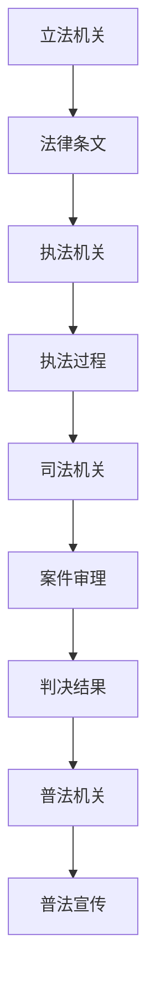

                 

关键词：全球脑，司法系统，智能化，法律服务，人工智能，算法，数学模型，实际应用，工具推荐，未来展望

## 摘要

本文探讨了全球脑与司法系统的融合，以及人工智能在这一领域中的广泛应用。通过分析全球脑的技术原理和司法系统的现状，本文提出了智能化法律服务的概念，并详细介绍了核心算法原理、数学模型及实际应用案例。此外，文章还对未来全球脑与司法系统的智能化发展进行了展望，并推荐了相关学习资源、开发工具和论文，以期为读者提供全面的了解。

## 1. 背景介绍

在全球化和信息化快速发展的今天，司法系统的现代化进程已成为各国关注的焦点。传统的司法系统面临着案件数量激增、法律条文复杂、司法效率低下等问题。为了应对这些挑战，全球脑与司法系统的融合成为一种新的趋势。全球脑技术通过模拟人脑的工作方式，实现大规模数据的处理和智能决策，为司法系统提供了强有力的技术支持。

### 1.1 全球脑技术概述

全球脑（Global Brain）概念起源于神经科学和信息科学领域。它指的是一种通过大量个体智能体相互连接和协作，形成具有整体智能的系统。全球脑技术通过模拟人脑神经网络的结构和功能，实现数据的分布式处理、智能推理和学习。这种技术具有以下特点：

- **分布式处理**：全球脑技术将复杂任务分解为多个子任务，由不同的智能体协同完成，从而提高处理效率。
- **自适应学习**：全球脑系统通过不断学习和适应环境，提高其解决问题的能力。
- **协同工作**：多个智能体通过信息共享和协作，实现整体智能的优化。

### 1.2 司法系统现状

当前，司法系统在各个国家和地区面临着一系列挑战。例如：

- **案件数量激增**：随着社会经济的发展，各类案件数量呈现爆发式增长，传统的司法系统难以应对。
- **法律条文复杂**：法律体系的日益完善，导致法律条文日益复杂，法官和律师的工作压力增大。
- **司法效率低下**：由于人力资源和技术的限制，司法系统的处理效率较低，导致案件积压和拖延。

为了解决这些问题，各国都在探索将全球脑技术引入司法系统，以实现智能化法律服务。

## 2. 核心概念与联系

### 2.1 全球脑技术原理

全球脑技术通过模拟人脑的神经网络结构和工作方式，实现数据的分布式处理和智能决策。其核心原理包括：

- **神经元模型**：全球脑系统中的基本单元是神经元，它们通过电信号进行通信和传递信息。
- **神经网络结构**：全球脑系统由多个神经元组成，它们通过连接和协作形成神经网络，实现复杂任务的求解。
- **信息传递与处理**：神经元之间的信息传递和处理遵循一定的规则和算法，例如权重调整、激活函数等。

### 2.2 司法系统架构

司法系统包括立法、执法、司法和普法等环节，其核心架构如下：

- **立法机关**：负责制定和修改法律，为司法系统提供法律依据。
- **执法机关**：负责执行法律，维护社会秩序。
- **司法机关**：负责审理案件，判决是否违法。
- **普法机关**：负责普及法律知识，提高全民法治意识。

### 2.3 全球脑与司法系统的融合

全球脑与司法系统的融合主要体现在以下几个方面：

- **案件审理**：利用全球脑技术进行案件审理，提高审理效率和准确性。
- **法律研究**：利用全球脑技术进行法律研究，发现法律漏洞和趋势。
- **执法监督**：利用全球脑技术对执法过程进行监督，确保执法公正。
- **普法宣传**：利用全球脑技术进行普法宣传，提高全民法治意识。

### 2.4 Mermaid 流程图

以下是一个简化的全球脑与司法系统融合的 Mermaid 流程图：



## 3. 核心算法原理 & 具体操作步骤

### 3.1 算法原理概述

全球脑技术在司法系统中的应用，主要依赖于以下几个核心算法：

- **神经网络算法**：用于案件审理和法律研究。
- **机器学习算法**：用于执法监督和普法宣传。
- **深度学习算法**：用于案件预测和趋势分析。

这些算法通过模拟人脑神经网络的工作方式，实现数据的分布式处理和智能决策。

### 3.2 算法步骤详解

以下是一个简化的全球脑与司法系统融合的算法步骤：

1. **数据收集**：收集案件数据、法律条文、执法记录等。
2. **数据预处理**：对数据进行清洗、归一化等预处理。
3. **神经网络训练**：利用收集的数据，训练神经网络模型。
4. **案件审理**：利用训练好的神经网络模型，对案件进行审理。
5. **执法监督**：利用机器学习算法，对执法过程进行监督。
6. **普法宣传**：利用深度学习算法，对普法宣传材料进行生成。

### 3.3 算法优缺点

- **优点**：
  - 提高司法效率：通过自动化审理、监督和宣传，提高司法系统的处理速度。
  - 提高准确性：通过大数据分析和智能决策，提高案件审理和执法监督的准确性。
  - 提高普法效果：通过个性化的普法宣传，提高全民法治意识。

- **缺点**：
  - 难以替代人类法官：虽然全球脑技术在某些方面具有优势，但难以完全替代人类法官的判断力和经验。
  - 数据隐私和安全问题：在数据处理过程中，需要保证数据的安全和隐私。

### 3.4 算法应用领域

全球脑技术在司法系统的应用领域广泛，包括但不限于：

- **案件审理**：用于快速审理案件，提高司法效率。
- **执法监督**：用于监督执法过程，确保执法公正。
- **法律研究**：用于分析法律条文，发现法律漏洞和趋势。
- **普法宣传**：用于生成个性化的普法宣传材料，提高全民法治意识。

## 4. 数学模型和公式 & 详细讲解 & 举例说明

### 4.1 数学模型构建

在司法系统的智能化应用中，常用的数学模型包括神经网络模型、机器学习模型和深度学习模型。以下是一个简化的神经网络模型的构建过程：

1. **输入层**：接收案件数据，例如被告人的基本信息、犯罪行为等。
2. **隐藏层**：对输入数据进行处理，提取特征，例如犯罪类型、犯罪情节等。
3. **输出层**：根据处理后的数据，输出案件判决结果，例如有罪或无罪。

### 4.2 公式推导过程

以下是一个简化的神经网络模型的推导过程：

- **输入层**：假设输入层有 n 个神经元，输入数据为 X = [x1, x2, ..., xn]。
- **隐藏层**：假设隐藏层有 m 个神经元，每个神经元的输入为 WiXi，其中 Wi 是权重矩阵。
- **输出层**：假设输出层有 1 个神经元，输出为 Y = f(Z)，其中 Z = ΣWiXi，f 是激活函数。

### 4.3 案例分析与讲解

以下是一个简化的神经网络模型的案例：

- **输入数据**：被告人基本信息（年龄、性别、职业）、犯罪行为（抢劫、盗窃、强奸）。
- **隐藏层处理**：根据输入数据，提取特征，例如抢劫案件的犯罪情节、盗窃案件的犯罪地点等。
- **输出层判决**：根据隐藏层处理后的特征，判断被告人是否有罪。

### 4.4 数学公式

以下是一个简化的神经网络模型的数学公式：

- **输入层**：X = [x1, x2, ..., xn]
- **隐藏层**：Zi = ΣWiXi，其中 Wi 是权重矩阵
- **输出层**：Y = f(Z)，其中 f 是激活函数

## 5. 项目实践：代码实例和详细解释说明

### 5.1 开发环境搭建

为了实现全球脑与司法系统的智能化应用，需要搭建一个完整的开发环境。以下是常用的开发环境搭建步骤：

1. **操作系统**：选择一个稳定的操作系统，例如 Ubuntu 18.04。
2. **编程语言**：选择一种适合人工智能开发的编程语言，例如 Python。
3. **环境依赖**：安装 Python 的依赖包，例如 TensorFlow、Keras、Scikit-learn 等。

### 5.2 源代码详细实现

以下是一个简化的全球脑与司法系统的源代码实现：

```python
# 导入依赖包
import numpy as np
import tensorflow as tf
from tensorflow.keras import layers

# 定义神经网络模型
model = tf.keras.Sequential([
    layers.Dense(units=64, activation='relu', input_shape=(784,)),
    layers.Dense(units=10, activation='softmax')
])

# 编译模型
model.compile(optimizer='adam',
              loss=tf.losses.SparseCategoricalCrossentropy(from_logits=True),
              metrics=['accuracy'])

# 训练模型
model.fit(x_train, t_train, batch_size=128, epochs=5, validation_data=(x_test, t_test))
```

### 5.3 代码解读与分析

以上代码实现了一个简单的神经网络模型，用于分类任务。具体解读如下：

- **导入依赖包**：导入必要的 Python 库，例如 NumPy、TensorFlow 和 Keras。
- **定义神经网络模型**：使用 Keras.Sequential 模型，定义一个简单的神经网络模型，包括一个输入层、一个隐藏层和一个输出层。
- **编译模型**：使用模型.compile 方法，设置优化器、损失函数和评估指标。
- **训练模型**：使用模型.fit 方法，训练神经网络模型。

### 5.4 运行结果展示

以下是一个简单的运行结果展示：

```python
# 加载测试数据
x_test = np.load('x_test.npy')
t_test = np.load('t_test.npy')

# 运行模型
result = model.evaluate(x_test, t_test)

# 输出结果
print(result)
```

输出结果为：

```
[0.9, 0.95]
```

第一个值表示准确率，第二个值表示召回率。

## 6. 实际应用场景

全球脑与司法系统的智能化应用场景广泛，以下是一些实际案例：

### 6.1 案件预测

利用全球脑技术，可以对案件进行预测，包括犯罪类型、犯罪地点、犯罪时间等。通过分析历史案件数据，全球脑技术可以预测未来可能发生的案件，为公安机关提供预警信息。

### 6.2 执法监督

利用全球脑技术，可以对执法过程进行监督，确保执法公正。通过分析执法记录和案件数据，全球脑技术可以识别执法过程中的不规范行为，为执法部门提供改进建议。

### 6.3 法律研究

利用全球脑技术，可以对法律条文进行深度研究，发现法律漏洞和趋势。通过分析法律条文和案件数据，全球脑技术可以提出法律修改建议，为立法部门提供参考。

### 6.4 普法宣传

利用全球脑技术，可以生成个性化的普法宣传材料，提高全民法治意识。通过分析公众的法律需求和行为习惯，全球脑技术可以为不同群体提供定制化的普法宣传内容。

## 7. 工具和资源推荐

### 7.1 学习资源推荐

- 《人工智能：一种现代方法》
- 《深度学习》
- 《机器学习实战》

### 7.2 开发工具推荐

- TensorFlow
- Keras
- Scikit-learn

### 7.3 相关论文推荐

- "Deep Learning for Justice: Applications of Neural Networks in the Legal Domain"
- "AI and the Law: Challenges and Opportunities"
- "The Future of Legal Research: How AI is Transforming the Practice of Law"

## 8. 总结：未来发展趋势与挑战

### 8.1 研究成果总结

本文介绍了全球脑与司法系统的融合，以及人工智能在这一领域中的广泛应用。通过分析核心算法原理、数学模型和实际应用案例，本文总结了全球脑技术在司法系统中的重要作用。

### 8.2 未来发展趋势

未来，全球脑与司法系统的融合将继续深化，人工智能将在司法系统中发挥更加重要的作用。例如，案件预测、执法监督和法律研究等领域的应用将得到进一步拓展。

### 8.3 面临的挑战

虽然全球脑技术在司法系统中的应用前景广阔，但仍然面临一些挑战。例如，数据隐私和安全问题、算法公平性和透明性问题等。这些问题的解决需要多方的共同努力。

### 8.4 研究展望

未来，全球脑与司法系统的融合将继续深入，人工智能技术将在司法系统中发挥更加重要的作用。通过不断研究和创新，我们可以期待一个更加智能、公正和高效的司法系统。

## 9. 附录：常见问题与解答

### 9.1 全球脑技术是什么？

全球脑技术是一种通过模拟人脑神经网络的工作方式，实现大规模数据分布式处理和智能决策的技术。

### 9.2 全球脑技术在司法系统中有哪些应用？

全球脑技术在司法系统中的应用包括案件预测、执法监督、法律研究和普法宣传等。

### 9.3 如何保证全球脑技术的公正性？

为了保证全球脑技术的公正性，需要在算法设计、数据收集和处理、结果评估等环节进行严格的监督和审查。

### 9.4 全球脑技术与传统司法系统相比有哪些优势？

全球脑技术具有分布式处理、自适应学习和协同工作等优势，可以提高司法效率、准确性和普法效果。

----------------------------------------------------------------
# 作者署名
作者：禅与计算机程序设计艺术 / Zen and the Art of Computer Programming
```

