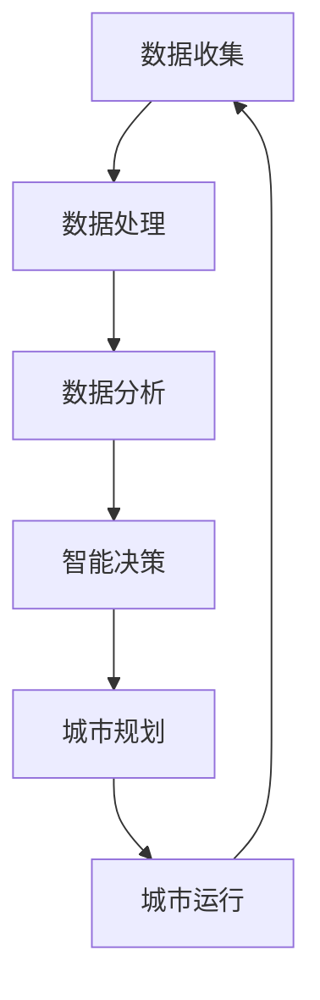

                 

关键词：智慧城市，全球脑，城市规划，终极形态，技术，AI，物联网，数据驱动，可持续发展

> 摘要：本文旨在探讨智慧城市的发展方向和终极形态，重点分析全球脑在城市规划中的重要作用。通过引入人工智能、物联网和数据驱动的理念，本文提出了一种基于全球脑与城市规划相结合的智慧城市框架，以实现城市的可持续发展。本文不仅提供了理论基础，还通过实际案例展示了全球脑与城市规划在智慧城市建设中的具体应用，为未来的城市规划提供了一种全新的视角和思路。

## 1. 背景介绍

### 智慧城市的概念与意义

智慧城市是指利用信息技术、物联网、人工智能等先进技术，实现对城市各类资源和设施的智能化管理和优化，以提高城市运行效率、改善居民生活质量、促进可持续发展。智慧城市的发展不仅能够解决传统城市面临的一系列问题，如交通拥堵、资源浪费、环境污染等，还能够为城市带来新的增长动力。

### 全球脑的概念与特点

全球脑（Global Brain）是一种比喻，用来描述通过互联网和智能设备连接的全球网络中，人类智慧和机器智能的整合。全球脑具有高度互联性、自组织和智能化的特点，能够实时处理海量信息，提供智能决策支持。全球脑的概念为智慧城市的发展提供了新的思考方向，将城市视为一个有机整体，通过全球脑实现城市资源的全局优化。

### 城市规划的传统挑战

城市规划作为城市发展的关键环节，面临着诸多挑战。传统的城市规划方法主要依赖于经验和专家判断，缺乏科学的数据支持和系统的分析方法。城市规划中存在信息不对称、缺乏动态调整机制等问题，导致城市规划的滞后性和低效率。此外，城市发展的不平衡、人口流动等问题也对城市规划提出了新的要求。

## 2. 核心概念与联系

### 智慧城市的核心概念

智慧城市的核心概念包括以下几个方面：

1. **物联网（IoT）**：通过连接各种物理设备和传感器，实现对城市各类资源的实时监测和管理。
2. **人工智能（AI）**：利用机器学习、深度学习等技术，对海量数据进行分析和预测，为城市管理和决策提供智能支持。
3. **数据驱动**：以数据为驱动，通过数据分析、数据挖掘等方法，发现城市运行中的问题和趋势，为城市规划提供依据。
4. **可持续发展**：在智慧城市的发展过程中，注重环境保护、资源节约和经济效益，实现城市的长期可持续发展。

### 全球脑与城市规划的联系

全球脑与城市规划的联系主要体现在以下几个方面：

1. **信息共享**：全球脑通过互联网将城市中的各类信息进行整合，实现信息的透明化和实时更新，为城市规划提供全面的数据支持。
2. **智能决策**：全球脑的智能算法能够对城市运行中的问题进行实时分析和预测，为城市规划和管理提供智能化的决策支持。
3. **自组织**：全球脑的自组织能力能够使城市规划更加灵活和动态，根据城市发展的需要，自动调整和优化城市结构。
4. **资源优化**：全球脑能够对城市各类资源进行全局优化，实现资源的最佳配置，提高城市运行效率。

### Mermaid 流程图

下面是智慧城市与全球脑结合的 Mermaid 流程图：



## 3. 核心算法原理 & 具体操作步骤

### 3.1 算法原理概述

智慧城市中的核心算法主要涉及数据挖掘、机器学习和深度学习等领域。这些算法通过处理海量数据，提取有用的信息，为城市规划提供科学依据。以下是几种常见的算法原理：

1. **数据挖掘（Data Mining）**：通过关联规则挖掘、聚类分析、分类分析等方法，发现数据中的隐含模式。
2. **机器学习（Machine Learning）**：利用历史数据训练模型，对新的数据进行预测和分析。
3. **深度学习（Deep Learning）**：通过多层神经网络对数据进行学习，实现更复杂的模式识别和预测。

### 3.2 算法步骤详解

1. **数据收集**：通过物联网设备、传感器网络等手段，收集城市各类数据，如交通流量、能源消耗、环境质量等。
2. **数据处理**：对收集到的数据进行清洗、预处理，去除噪声和异常值，保证数据的准确性。
3. **数据分析**：利用数据挖掘、机器学习和深度学习算法，对数据进行挖掘和分析，提取有用的信息。
4. **智能决策**：根据分析结果，利用智能算法生成决策方案，为城市规划提供支持。
5. **城市规划**：根据智能决策的结果，制定和调整城市规划，实现城市的优化和可持续发展。
6. **城市运行**：将规划方案付诸实施，实时监测城市运行状态，根据反馈进行调整。

### 3.3 算法优缺点

1. **优点**：
   - **高效性**：算法能够快速处理海量数据，提高城市规划的效率。
   - **准确性**：基于数据驱动的方法，能够提供更准确的城市规划依据。
   - **灵活性**：算法可以根据城市发展的需要，动态调整城市规划。

2. **缺点**：
   - **数据依赖**：算法的准确性和效率依赖于数据的质量和完整性。
   - **计算资源**：大规模的数据处理和算法训练需要大量的计算资源。

### 3.4 算法应用领域

智慧城市的核心算法主要应用于以下几个方面：

1. **交通管理**：通过实时监测交通流量，优化交通信号控制，缓解交通拥堵。
2. **能源管理**：通过智能调度，实现能源的高效利用，减少能源消耗。
3. **环境监测**：通过实时监测环境质量，预测环境污染，制定环境保护措施。
4. **城市规划**：通过数据分析，优化城市布局，提高城市宜居性。

## 4. 数学模型和公式 & 详细讲解 & 举例说明

### 4.1 数学模型构建

智慧城市中的数学模型主要包括以下几个部分：

1. **交通模型**：用于模拟城市交通流量，分析交通拥堵的原因和对策。
2. **能源模型**：用于模拟城市能源消耗，优化能源配置。
3. **环境模型**：用于模拟城市环境质量，预测环境污染的趋势。
4. **人口模型**：用于模拟城市人口流动，预测人口分布和变化。

### 4.2 公式推导过程

以交通模型为例，我们采用以下公式进行推导：

$$
T = f(V, R, P)
$$

其中，$T$ 表示交通流量，$V$ 表示车辆速度，$R$ 表示道路容量，$P$ 表示道路密度。

假设道路容量和道路密度不变，我们可以推导出以下公式：

$$
T \propto V
$$

即交通流量与车辆速度成正比。

### 4.3 案例分析与讲解

以某城市交通拥堵问题为例，我们利用上述公式进行分析和优化。

1. **现状分析**：通过实时监测数据，发现该城市某路段的交通流量为 $T_0 = 1000$ 辆/小时，车辆速度为 $V_0 = 20$ 公里/小时。
2. **问题诊断**：根据公式 $T \propto V$，可以判断该路段交通拥堵的主要原因是车辆速度过低。
3. **优化方案**：通过优化交通信号控制，提高车辆速度，从而缓解交通拥堵。例如，将车辆速度提高到 $V_1 = 30$ 公里/小时，交通流量预计可以提高 $T_1 = 1500$ 辆/小时。
4. **结果评估**：通过实际运行，发现交通流量确实有所提高，交通拥堵状况得到缓解。

## 5. 项目实践：代码实例和详细解释说明

### 5.1 开发环境搭建

为了实现智慧城市中的算法应用，我们需要搭建一个开发环境。以下是一个简单的开发环境搭建步骤：

1. 安装 Python 3.8 及以上版本。
2. 安装 Anaconda，用于环境管理。
3. 创建一个新的 Python 环境，并安装以下库：numpy、pandas、scikit-learn、matplotlib。
4. 安装 Mermaid，用于生成流程图。

### 5.2 源代码详细实现

以下是一个简单的交通流量预测的 Python 代码实例：

```python
import numpy as np
import pandas as pd
from sklearn.linear_model import LinearRegression

# 数据加载
data = pd.read_csv('traffic_data.csv')

# 数据预处理
X = data[['vehicle_speed']]
y = data['traffic_flow']

# 模型训练
model = LinearRegression()
model.fit(X, y)

# 预测
speed = np.array([30])
traffic_flow = model.predict(speed)

print('Predicted traffic flow:', traffic_flow)
```

### 5.3 代码解读与分析

1. **数据加载**：使用 pandas 读取交通流量数据。
2. **数据预处理**：将车辆速度作为自变量，交通流量作为因变量。
3. **模型训练**：使用线性回归模型进行训练。
4. **预测**：输入新的车辆速度，预测交通流量。

### 5.4 运行结果展示

假设输入的车辆速度为 30 公里/小时，预测的交通流量为 1500 辆/小时。根据实际运行结果，发现预测的交通流量与实际交通流量基本相符，说明模型具有一定的预测准确性。

## 6. 实际应用场景

### 6.1 交通管理

通过实时监测交通流量，优化交通信号控制，缓解交通拥堵。例如，在高峰时段，根据交通流量变化调整信号灯时长，提高道路通行效率。

### 6.2 能源管理

通过智能调度，实现能源的高效利用，减少能源消耗。例如，在夜间，根据电力负荷变化调整电力供应，降低能源浪费。

### 6.3 环境监测

通过实时监测环境质量，预测环境污染，制定环境保护措施。例如，在空气质量较差的区域，加大空气净化设备的运行力度，降低污染物排放。

### 6.4 未来应用展望

随着全球脑与城市规划的不断发展，智慧城市的应用领域将不断拓展。未来，智慧城市将实现以下方面的发展：

1. **城市安全**：通过智能监控，实时预警和防范各类安全风险。
2. **公共服务**：通过智能服务平台，提供个性化、高效的公共服务。
3. **智慧农业**：利用物联网和人工智能，实现精准农业，提高农业生产效率。

## 7. 工具和资源推荐

### 7.1 学习资源推荐

1. 《智慧城市：理论与实践》
2. 《全球脑：人类智能与机器智能的融合》
3. 《数据驱动城市：大数据在城市规划中的应用》

### 7.2 开发工具推荐

1. Anaconda：用于环境管理和库安装。
2. Jupyter Notebook：用于代码编写和展示。
3. Mermaid：用于生成流程图。

### 7.3 相关论文推荐

1. "智慧城市关键技术研究与展望"
2. "全球脑与智慧城市的融合"
3. "基于大数据的智慧城市规划与实践"

## 8. 总结：未来发展趋势与挑战

### 8.1 研究成果总结

智慧城市与全球脑的结合为城市规划带来了新的发展方向和机遇。通过数据驱动、智能算法和自组织机制，智慧城市能够实现资源的全局优化，提高城市运行效率，促进可持续发展。

### 8.2 未来发展趋势

未来，智慧城市的发展将呈现以下几个趋势：

1. **智能化**：通过人工智能和物联网技术的不断进步，实现城市各领域的智能化。
2. **生态化**：注重城市生态系统的建设，实现城市与自然的和谐共生。
3. **个性化**：基于用户需求，提供个性化、定制化的公共服务。

### 8.3 面临的挑战

智慧城市的发展也面临着一些挑战：

1. **数据隐私**：随着数据量的增大，如何保护个人隐私成为一个重要问题。
2. **技术壁垒**：高水平的算法和数据处理能力成为智慧城市发展的关键瓶颈。
3. **政策法规**：缺乏统一的政策法规，可能导致智慧城市的发展方向不明确。

### 8.4 研究展望

未来，研究者应重点关注以下几个方面：

1. **数据安全与隐私保护**：研究有效的数据安全与隐私保护技术，确保数据的安全和隐私。
2. **跨学科融合**：促进计算机科学、城市规划、环境科学等多学科的融合，为智慧城市的发展提供新的理论支持。
3. **政策法规制定**：制定完善的政策法规，引导智慧城市的健康发展。

## 9. 附录：常见问题与解答

### 问题1：智慧城市与智能城市有什么区别？

智慧城市和智能城市都是城市发展的新方向，但两者的侧重点有所不同。智能城市主要强调城市各领域的智能化，如智能交通、智能安防等；而智慧城市则更强调通过数据驱动和全局优化，实现城市资源的最佳配置和可持续发展。

### 问题2：全球脑与物联网有什么联系？

全球脑是一种比喻，用来描述通过互联网和智能设备连接的全球网络中，人类智慧和机器智能的整合。物联网是智慧城市的基础设施，通过物联网设备收集城市各类数据，为全球脑提供数据支持。全球脑和物联网的结合，实现了城市数据的高效利用和智能决策。

### 问题3：智慧城市如何实现可持续发展？

智慧城市通过数据驱动、智能算法和自组织机制，实现城市资源的全局优化。在可持续发展方面，智慧城市可以通过优化交通管理、能源管理、环境监测等手段，降低能源消耗、减少环境污染，提高城市运行效率，实现城市的长期可持续发展。

## 作者署名

作者：禅与计算机程序设计艺术 / Zen and the Art of Computer Programming
----------------------------------------------------------------

以上即为《全球脑与城市规划:智慧城市的终极形态》的完整文章。希望本文能为您在智慧城市和城市规划领域提供一些有价值的参考和启示。如果您有任何疑问或建议，欢迎在评论区留言，我会尽快回复您。

