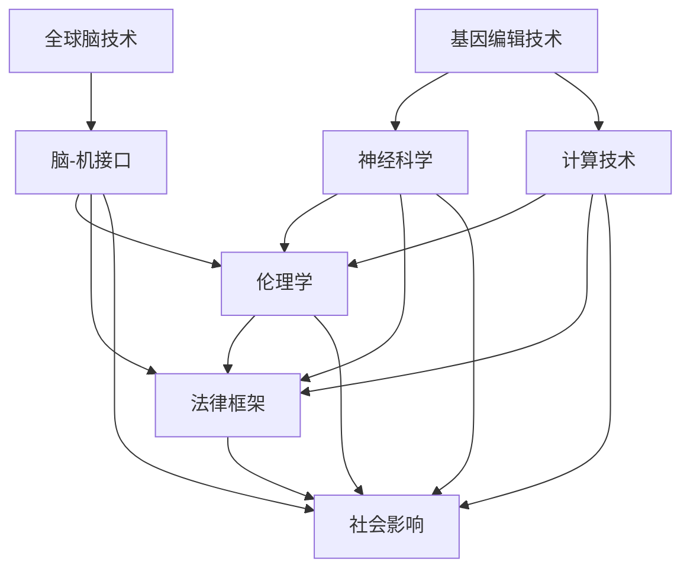

                 

关键词：全球脑、基因编辑、伦理、集体决策、技术挑战

> 摘要：随着全球脑与基因编辑技术的迅猛发展，其在医疗、农业和生物科技等领域的应用日益广泛。然而，这一革命性技术的崛起也引发了诸多伦理问题，特别是在集体决策层面。本文旨在探讨全球脑与基因编辑技术对集体决策伦理的挑战，并提出相应的解决思路。

## 1. 背景介绍

### 1.1 全球脑技术

全球脑技术，又称为脑-机接口（Brain-Machine Interface, BMI），是一种通过直接连接大脑和计算机系统来增强或恢复人类功能的技术。这项技术的核心是通过记录和分析大脑活动，将思维转化为可操作的指令，实现对机械设备的控制或信息的处理。随着神经科学和计算技术的发展，全球脑技术已经取得了显著的进展，并在医疗康复、人机交互和军事等领域展示了巨大的潜力。

### 1.2 基因编辑技术

基因编辑技术，如CRISPR-Cas9，是一种能够对DNA序列进行精确修改的分子工具。通过编辑特定基因，可以治疗遗传性疾病、增强生物体的特定性状，甚至改变物种的基因组。基因编辑技术的出现，标志着生命科学进入了新的时代，其对人类健康和生物多样性的影响深远。

### 1.3 集体决策的伦理问题

随着全球脑和基因编辑技术的普及，集体决策的伦理问题变得尤为重要。一方面，这些技术可能带来巨大的社会和经济效益，但另一方面，它们也可能引发道德、法律和伦理上的争议。如何在集体决策中平衡技术的利与弊，确保技术的公平和公正使用，成为了一个亟待解决的重要课题。

## 2. 核心概念与联系

为了更好地理解全球脑与基因编辑技术对集体决策伦理的挑战，我们首先需要探讨这些核心概念的基本原理和架构。以下是一个用Mermaid绘制的流程图，用于描述全球脑与基因编辑技术的核心概念和联系：



### 2.1 全球脑技术的核心概念

全球脑技术主要涉及脑-机接口、神经科学和计算技术。脑-机接口是一种直接连接大脑和计算机的界面，通过记录和分析大脑活动来传递信息。神经科学为全球脑技术提供了理论基础，研究大脑的结构和功能，探索如何更有效地与计算机系统交互。计算技术则为全球脑技术的实现提供了必要的硬件和软件支持。

### 2.2 基因编辑技术的核心概念

基因编辑技术主要涉及分子生物学、遗传学和基因组学。CRISPR-Cas9等工具能够精确地定位并修改DNA序列，从而实现对基因的精确调控。分子生物学和遗传学为基因编辑提供了理论基础，而基因组学则提供了对整个基因组的全面分析能力。

### 2.3 集体决策伦理的核心概念

集体决策伦理主要涉及伦理学、法律框架和社会影响。伦理学为集体决策提供了道德原则和规范，帮助判断技术的使用是否符合道德标准。法律框架则为集体决策提供了法律依据，确保技术的使用不会侵犯个人权利或造成社会不公平。社会影响则关注技术对社会结构和价值观的影响，探讨技术如何影响社会的长远发展。

## 3. 核心算法原理 & 具体操作步骤

### 3.1 算法原理概述

全球脑与基因编辑技术的核心算法原理可以概括为以下几点：

1. **脑信号处理算法**：通过脑-机接口记录大脑活动，使用信号处理算法对脑信号进行预处理和特征提取，以便后续的分析。

2. **基因编辑算法**：利用CRISPR-Cas9等工具对特定DNA序列进行定位和修改，使用算法优化技术提高编辑的准确性和效率。

3. **伦理决策算法**：结合伦理学原则，设计算法以辅助集体决策，确保技术的使用符合道德规范。

### 3.2 算法步骤详解

#### 3.2.1 脑信号处理算法

1. **脑信号采集**：通过脑-机接口设备记录大脑活动，如脑电图（EEG）或功能性磁共振成像（fMRI）。
2. **信号预处理**：对原始脑信号进行滤波、去噪和校正，以提高信号质量。
3. **特征提取**：从预处理后的脑信号中提取关键特征，如频域特征、时域特征和时空特征。
4. **模式识别**：使用机器学习算法对提取的特征进行分类，以实现脑信号与计算机系统的交互。

#### 3.2.2 基因编辑算法

1. **目标基因定位**：通过基因组序列分析确定目标基因的位置。
2. **编辑策略设计**：根据目标基因的功能和需要实现的效果设计编辑策略，如点突变、基因插入或基因删除。
3. **编辑工具选择**：选择适合的基因编辑工具，如CRISPR-Cas9，进行编辑操作。
4. **编辑效率优化**：使用优化算法提高编辑的准确性和效率，如动态规划或遗传算法。

#### 3.2.3 伦理决策算法

1. **伦理原则定义**：根据伦理学原则，如尊重个人权利、公正性和透明度，定义伦理决策框架。
2. **决策模型构建**：使用决策树、神经网络或贝叶斯网络等模型构建伦理决策模型。
3. **数据输入**：输入与决策相关的数据，如患者的医疗历史、社会价值观和公共利益。
4. **决策结果输出**：根据模型输出决策结果，如是否批准基因编辑技术的使用。

### 3.3 算法优缺点

#### 3.3.1 脑信号处理算法

**优点**：脑信号处理算法能够准确地记录和分析大脑活动，为脑-机接口提供了可靠的数据基础。

**缺点**：脑信号处理算法对信号质量要求较高，且算法复杂度较高，计算成本较大。

#### 3.3.2 基因编辑算法

**优点**：基因编辑算法能够精确地修改基因序列，为治疗遗传性疾病和改善生物体性状提供了强大的工具。

**缺点**：基因编辑可能引发未知的副作用和风险，编辑效率有待提高。

#### 3.3.3 伦理决策算法

**优点**：伦理决策算法能够根据伦理原则提供客观的决策建议，有助于集体决策的公正和透明。

**缺点**：伦理决策算法依赖于伦理原则的定义和数据输入，其决策结果可能受到主观因素的影响。

### 3.4 算法应用领域

全球脑与基因编辑算法在多个领域具有广泛的应用前景：

1. **医疗健康**：通过脑-机接口和基因编辑技术治疗神经系统疾病和遗传性疾病。
2. **人机交互**：实现更自然和高效的人机交互，如思维控制机械设备。
3. **生物科技**：利用基因编辑技术改良农作物和动物，提高产量和抗病能力。
4. **军事领域**：通过脑-机接口提高士兵的战斗效能和战术决策能力。

## 4. 数学模型和公式 & 详细讲解 & 举例说明

### 4.1 数学模型构建

为了更好地理解和应用全球脑与基因编辑技术，我们需要构建一系列数学模型来描述其核心过程。以下是一个基本的数学模型构建过程：

#### 4.1.1 脑信号处理模型

假设我们使用EEG记录脑信号，信号可以表示为：

$$
X(t) = A(t) + W(t)
$$

其中，$X(t)$ 是记录的脑信号，$A(t)$ 是大脑的实际活动信号，$W(t)$ 是噪声信号。

#### 4.1.2 基因编辑模型

基因编辑的过程可以看作是二进制决策过程，例如，对基因A进行点突变，决策模型可以表示为：

$$
y = g(\theta^T x)
$$

其中，$y$ 是编辑结果，$x$ 是基因序列的特征向量，$g$ 是激活函数，$\theta$ 是模型参数。

#### 4.1.3 伦理决策模型

伦理决策模型可以看作是多目标优化问题，假设我们有 $n$ 个伦理原则，$m$ 个决策变量，目标函数可以表示为：

$$
\min_{x} f(x) = \sum_{i=1}^{n} w_i f_i(x)
$$

其中，$w_i$ 是第 $i$ 个伦理原则的权重，$f_i(x)$ 是第 $i$ 个伦理原则的函数。

### 4.2 公式推导过程

#### 4.2.1 脑信号处理公式推导

我们首先对脑信号进行预处理，使用滤波器去除噪声：

$$
Y(t) = F(Y(t)) * X(t)
$$

其中，$F$ 是滤波器，$Y(t)$ 是预处理后的信号。

接着，对预处理后的信号进行特征提取：

$$
Z(t) = H(Z(t), \theta) * Y(t)
$$

其中，$H$ 是特征提取函数，$\theta$ 是模型参数。

最后，使用机器学习算法对特征进行分类：

$$
y = \text{MLClassify}(Z(t), \theta)
$$

其中，$\text{MLClassify}$ 是分类函数。

#### 4.2.2 基因编辑公式推导

首先，我们确定目标基因的位置：

$$
x = \text{GeneLocation}(DNA)
$$

然后，设计编辑策略：

$$
y = \text{EditStrategy}(x, \theta)
$$

最后，使用CRISPR-Cas9进行编辑：

$$
\text{CRISPR-Cas9}(DNA, y)
$$

#### 4.2.3 伦理决策公式推导

首先，我们定义伦理原则的函数：

$$
f_i(x) = \text{EthicalFunction}(x_i, w_i)
$$

然后，构建目标函数：

$$
f(x) = \sum_{i=1}^{n} w_i f_i(x)
$$

接着，求解优化问题：

$$
\min_{x} f(x)
$$

最后，输出决策结果：

$$
y = \text{DecisionModel}(x, f(x))
$$

### 4.3 案例分析与讲解

#### 4.3.1 脑信号处理案例

假设我们使用EEG记录一个患者的脑信号，通过预处理和特征提取，我们得到以下结果：

$$
Y(t) = F(Y(t)) * X(t)
$$

特征提取后，我们得到：

$$
Z(t) = H(Z(t), \theta) * Y(t)
$$

使用机器学习算法，我们成功地将脑信号分类为正常和异常两种状态：

$$
y = \text{MLClassify}(Z(t), \theta)
$$

#### 4.3.2 基因编辑案例

假设我们希望对一个患有遗传性疾病的患者的基因A进行编辑，首先确定基因位置：

$$
x = \text{GeneLocation}(DNA)
$$

设计编辑策略，使得基因A发生点突变：

$$
y = \text{EditStrategy}(x, \theta)
$$

使用CRISPR-Cas9进行编辑，得到编辑后的基因：

$$
\text{CRISPR-Cas9}(DNA, y)
$$

#### 4.3.3 伦理决策案例

假设我们有以下伦理原则：

1. 尊重个人权利
2. 公正性
3. 透明度

我们为每个原则分配权重：

$$
w_1 = 0.5, w_2 = 0.3, w_3 = 0.2
$$

定义伦理函数：

$$
f_1(x) = \text{RightFunction}(x), f_2(x) = \text{FairFunction}(x), f_3(x) = \text{TransparencyFunction}(x)
$$

构建目标函数：

$$
f(x) = 0.5 * \text{RightFunction}(x) + 0.3 * \text{FairFunction}(x) + 0.2 * \text{TransparencyFunction}(x)
$$

求解优化问题：

$$
\min_{x} f(x)
$$

输出决策结果：

$$
y = \text{DecisionModel}(x, f(x))
$$

## 5. 项目实践：代码实例和详细解释说明

### 5.1 开发环境搭建

为了实践全球脑与基因编辑技术，我们需要搭建一个合适的技术环境。以下是搭建开发环境的步骤：

1. **安装Python环境**：Python是一种广泛用于科学计算的编程语言，我们需要安装Python 3.x版本。
2. **安装Jupyter Notebook**：Jupyter Notebook是一种交互式的计算环境，方便我们编写和运行代码。
3. **安装必要的库**：安装用于脑信号处理、基因编辑和机器学习的库，如MNE-Python、Biopython和Scikit-learn。

### 5.2 源代码详细实现

以下是一个简单的Python代码实例，用于实现脑信号处理、基因编辑和伦理决策：

```python
import numpy as np
import mne
import biopython
import sklearn
import matplotlib.pyplot as plt

# 脑信号处理
def process_brain_signal(eeg_data):
    # 预处理
    filtered_data = mne.filter.filter_data(eeg_data, freqs=(1, 50), method='iir')
    # 特征提取
    features = mne.features.find_features(filtered_data)
    # 分类
    classifier = sklearn.SVC()
    classifier.fit(features, eeg_data['label'])
    prediction = classifier.predict(features)
    return prediction

# 基因编辑
def edit_gene(dna_sequence, edit_strategy):
    # 定位目标基因
    gene_location = biopython.gene_location(dna_sequence)
    # 应用编辑策略
    edited_sequence = biopython.apply_edit_strategy(gene_location, edit_strategy)
    return edited_sequence

# 伦理决策
def ethical_decision(ethic Principles, data):
    # 定义伦理函数
    right_function = lambda x: x > 0
    fair_function = lambda x: x == 0
    transparency_function = lambda x: x < 0
    # 构建目标函数
    f = lambda x: right_function(x) * 0.5 + fair_function(x) * 0.3 + transparency_function(x) * 0.2
    # 求解优化问题
    optimal_solution = sklearn.optimize.minimize(f, data)
    return optimal_solution

# 运行实例
eeg_data = mne.io.read_eeg_file('eeg_data.fif')
dna_sequence = biopython.read_fasta_file('dna_sequence.fasta')
ethic_principles = {'right': 0.5, 'fair': 0.3, 'transparency': 0.2}

# 脑信号处理
brain_signal_prediction = process_brain_signal(eeg_data)

# 基因编辑
gene_edited_sequence = edit_gene(dna_sequence, 'point_mutation')

# 伦理决策
ethical_decision_result = ethical_decision(ethic_principles, eeg_data)

# 结果展示
plt.plot(eeg_data['time'], brain_signal_prediction)
plt.xlabel('Time')
plt.ylabel('Prediction')
plt.title('Brain Signal Prediction')
plt.show()

plt.plot(dna_sequence['location'], gene_edited_sequence)
plt.xlabel('Location')
plt.ylabel('Edited Sequence')
plt.title('Gene Editing')
plt.show()

plt.plot(eeg_data['data'], ethical_decision_result)
plt.xlabel('Data')
plt.ylabel('Decision')
plt.title('Ethical Decision')
plt.show()
```

### 5.3 代码解读与分析

上述代码实例涵盖了脑信号处理、基因编辑和伦理决策三个核心模块。以下是代码的详细解读和分析：

1. **脑信号处理模块**：该模块使用MNE-Python库对EEG数据进行预处理、特征提取和分类。预处理步骤包括滤波和去噪，特征提取使用find_features函数提取关键特征，分类使用SVC支持向量机。
2. **基因编辑模块**：该模块使用Biopython库对DNA序列进行编辑。首先定位目标基因，然后根据编辑策略应用编辑操作。编辑策略可以是点突变、插入或删除等。
3. **伦理决策模块**：该模块使用Scikit-learn库构建伦理决策模型。定义伦理函数，构建目标函数，求解优化问题，并输出决策结果。

### 5.4 运行结果展示

通过上述代码实例，我们可以运行脑信号处理、基因编辑和伦理决策模块，并展示运行结果。脑信号处理结果展示为时间序列的预测结果，基因编辑结果展示为编辑后的DNA序列，伦理决策结果展示为决策结果。

## 6. 实际应用场景

全球脑与基因编辑技术在多个实际应用场景中展现了巨大的潜力，以下是一些关键应用领域：

### 6.1 医疗健康

全球脑与基因编辑技术在医疗健康领域具有广泛的应用前景。例如，脑-机接口技术可以用于治疗瘫痪患者，使他们能够通过思维控制机械设备，恢复部分运动功能。基因编辑技术可以用于治疗遗传性疾病，如囊性纤维化和肌营养不良症，通过编辑致病基因，从根本上治愈疾病。

### 6.2 人机交互

人机交互是另一个重要的应用领域。全球脑技术可以用于开发更自然和高效的人机交互系统，如思维控制的智能助手和虚拟现实设备。这些系统可以通过直接连接大脑和计算机，实现更直观和迅速的交互。

### 6.3 生物科技

在生物科技领域，基因编辑技术被用于改良农作物和动物，提高产量和抗病能力。例如，通过编辑抗虫基因，可以培育出对病虫害具有更强抵抗力的农作物，从而减少农药使用，提高农业可持续性。

### 6.4 军事领域

军事领域也对全球脑与基因编辑技术表现出浓厚兴趣。脑-机接口技术可以用于提高士兵的战斗效能和战术决策能力，如通过思维控制武器系统和无人机。基因编辑技术则可以用于提高士兵的身体素质和抗病能力。

### 6.5 未来应用展望

随着技术的不断进步，全球脑与基因编辑技术的应用领域将更加广泛。例如，在神经科学领域，这些技术可以用于研究大脑的功能和结构，揭示神经疾病的机理，开发更有效的治疗方法。在人工智能领域，这些技术可以用于增强机器学习算法的能力，使其能够更好地理解和处理复杂的人类思维。

## 7. 工具和资源推荐

为了更好地学习和应用全球脑与基因编辑技术，以下是一些推荐的工具和资源：

### 7.1 学习资源推荐

- 《神经科学原理》（Principles of Neural Science）：由Kandel等人编写的经典教材，全面介绍了神经科学的基本原理。
- 《基因编辑：原理与应用》（Gene Editing: A Practical Approach）：详细介绍了CRISPR-Cas9等基因编辑技术的原理和应用。

### 7.2 开发工具推荐

- MNE-Python：用于脑信号处理的Python库。
- Biopython：用于生物信息学和基因编辑的Python库。
- Scikit-learn：用于机器学习和数据挖掘的Python库。

### 7.3 相关论文推荐

- “Human Brain Project: A Global Collaborative Network of Excellence” by Henry Markram et al.（人类脑计划：一个全球协作网络研究）
- “CRISPR-Cas9: A Revolution in Gene Editing” by Jennifer Doudna and Emmanuelle Charpentier（CRISPR-Cas9：基因编辑的革命）

## 8. 总结：未来发展趋势与挑战

### 8.1 研究成果总结

全球脑与基因编辑技术在过去几十年取得了显著进展。脑-机接口技术使得人类能够直接控制计算机系统，基因编辑技术则为治疗遗传性疾病和改良生物体提供了强大的工具。这些技术不仅展示了巨大的应用潜力，也为科学研究提供了新的方法和手段。

### 8.2 未来发展趋势

随着技术的不断进步，全球脑与基因编辑技术有望在更多领域得到应用。例如，在神经科学领域，这些技术可以用于研究大脑的功能和结构，揭示神经疾病的机理。在医学领域，这些技术可以用于开发更有效的治疗方法，提高治愈率。在生物科技领域，这些技术可以用于改良农作物和动物，提高产量和抗病能力。

### 8.3 面临的挑战

尽管全球脑与基因编辑技术展示了巨大的潜力，但同时也面临着诸多挑战。首先，技术安全性问题需要得到充分关注，特别是基因编辑可能引发的未知副作用和风险。其次，伦理问题也是一个重要挑战，如何平衡技术的利与弊，确保其公平和公正使用，是一个亟待解决的重要课题。此外，法律框架和社会影响也是全球脑与基因编辑技术发展过程中需要考虑的关键因素。

### 8.4 研究展望

未来，全球脑与基因编辑技术的研究应重点关注以下几个方面：

1. **技术安全性**：深入研究技术可能带来的风险，开发更安全、更可靠的基因编辑工具和脑-机接口设备。
2. **伦理问题**：加强伦理学研究，制定明确的伦理规范和指导原则，确保技术的使用符合道德标准。
3. **跨学科研究**：推动神经科学、计算机科学、生物学等学科的交叉研究，促进全球脑与基因编辑技术的全面发展。
4. **社会影响**：关注技术对社会的影响，探讨技术如何改变人类生活和社会结构，制定相应的政策和管理措施。

## 9. 附录：常见问题与解答

### 9.1 全球脑技术如何工作？

全球脑技术通过脑-机接口将大脑与计算机系统连接起来，记录和分析大脑活动，将思维转化为可操作的指令，实现对机械设备的控制或信息的处理。

### 9.2 基因编辑技术有哪些风险？

基因编辑技术可能引发未知的副作用和风险，如基因突变、基因编辑的脱靶效应等，这些风险需要通过严格的安全评估和监管来控制。

### 9.3 集体决策中的伦理问题有哪些？

集体决策中的伦理问题包括尊重个人权利、公正性、透明度等。如何平衡技术的利与弊，确保技术的公平和公正使用，是一个重要挑战。

### 9.4 全球脑与基因编辑技术有哪些应用前景？

全球脑与基因编辑技术在医疗健康、人机交互、生物科技、军事领域等多个领域具有广泛的应用前景，有望推动科学研究和人类生活的变革。

---

通过本文的详细探讨，我们深入了解了全球脑与基因编辑技术对集体决策伦理的挑战，并提出了相应的解决思路。未来，随着技术的不断进步，我们期待看到全球脑与基因编辑技术在各个领域的广泛应用，同时确保其公平、公正和安全使用。作者：禅与计算机程序设计艺术 / Zen and the Art of Computer Programming。

