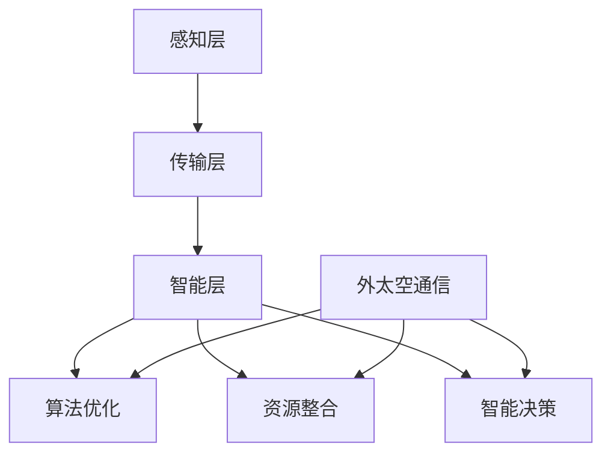

                 

全球脑与外太空通信：集体智慧助力星际交流  
**关键词：** 全球脑，外太空通信，集体智慧，星际交流，人工智能，算法优化，量子计算，星际旅行

**摘要：** 随着人类对宇宙的探索不断深入，如何实现全球脑与外太空的通信成为了一个重要的研究课题。本文从全球脑的视角出发，探讨了利用集体智慧助力星际交流的潜在技术路径，包括算法优化、量子计算和星际旅行等方面的研究进展和挑战。通过深入分析，本文提出了未来实现全球脑与外太空通信的可能性和发展方向。

## 1. 背景介绍

### 全球脑的概念与意义

全球脑（Global Brain）是一个由人类集体意识和信息网络构成的虚拟系统。它通过互联网、物联网等通信技术，将全球范围内的计算机、设备、传感器和人脑连接在一起，形成一个庞大的信息处理和知识共享网络。全球脑的目标是充分利用人类的智慧和资源，实现全球范围内的协同创新和智能优化。

全球脑的概念最早由日本学者早川良雄提出，他在《全球脑：人类的未来》一书中描述了全球脑的构成、功能和影响。随着人工智能、大数据和云计算等技术的发展，全球脑逐渐成为学术界和产业界关注的热点。

### 外太空通信的重要性

外太空通信是指利用无线电波、激光等传输手段，在地球与外太空探测器、卫星、星际飞船等之间进行信息传递的过程。随着人类太空探索的不断深入，外太空通信在科学实验、导航定位、资源开发等方面发挥着重要作用。

然而，外太空通信面临着巨大的挑战，如信号衰减、噪声干扰、传输距离远等问题。为了克服这些挑战，科学家们一直在探索新的通信技术和方法。

### 集体智慧与星际交流

集体智慧是指通过多个个体之间的协作、交流、共享和协同，实现比单个个体更高效、更智能的决策和解决问题的能力。在星际交流中，集体智慧具有重要意义。一方面，它可以优化通信算法，提高通信效率和可靠性；另一方面，它可以整合全球资源，为星际探索提供强大的智力支持。

本文将从全球脑、算法优化、量子计算和星际旅行等方面，探讨如何利用集体智慧助力星际交流，为实现人类星际探索奠定基础。

## 2. 核心概念与联系

### 全球脑的架构与原理

全球脑的架构可以分为三个层次：感知层、传输层和智能层。

1. **感知层**：包括传感器、计算机、智能手机等设备，用于采集和处理各种数据。
2. **传输层**：通过互联网、卫星通信等传输手段，将感知层的数据传输到智能层。
3. **智能层**：利用人工智能、大数据等技术，对传输层的数据进行分析和处理，实现智能决策和优化。

全球脑的原理可以概括为“感知-传输-智能”的过程。通过感知层的数据采集，传输层的数据传输，智能层的分析和处理，全球脑实现了对全球资源的整合和利用。

### 外太空通信的挑战与需求

外太空通信面临着诸多挑战，如：

1. **信号衰减**：随着传输距离的增加，无线电波的信号强度逐渐减弱。
2. **噪声干扰**：外太空环境中存在着各种噪声源，如太阳风、行星辐射等，对通信信号造成干扰。
3. **传输距离远**：地球与外太空探测器、卫星、星际飞船之间的距离非常远，增加了通信的难度。

为了解决这些问题，外太空通信需要：

1. **提高信号传输效率**：通过优化通信算法，提高信号在传输过程中的保真度和传输速率。
2. **降低噪声干扰**：利用噪声抑制技术，降低噪声对通信信号的影响。
3. **缩短传输距离**：通过建设空间站、星际飞船等设施，缩短通信距离，提高通信效率。

### 集体智慧在星际交流中的应用

集体智慧在星际交流中的应用主要体现在以下几个方面：

1. **算法优化**：通过多个个体之间的协作，优化通信算法，提高通信效率和可靠性。
2. **资源整合**：利用集体智慧，整合全球资源，为星际探索提供强大的智力支持。
3. **智能决策**：通过集体智慧，实现星际探索过程中的智能决策，提高探索效率和安全性。

### 核心概念原理与架构的 Mermaid 流程图



## 3. 核心算法原理 & 具体操作步骤

### 3.1 算法原理概述

在星际交流中，核心算法主要涉及信号处理、编码解码、信道编码等方面。以下是一个简要概述：

1. **信号处理**：通过对通信信号进行调制、解调、滤波等处理，提高信号的保真度和传输速率。
2. **编码解码**：利用数据压缩和错误校正技术，提高通信的可靠性和抗干扰能力。
3. **信道编码**：通过信道编码技术，将原始数据转换为适合在信道中传输的信号形式，提高传输效率。

### 3.2 算法步骤详解

以下是具体操作步骤：

1. **信号处理**：
   - 调制：将数字信号转换为模拟信号，以便在信道中传输。
   - 解调：将接收到的模拟信号转换为数字信号，以便进行后续处理。
   - 滤波：去除噪声和干扰，提高信号的保真度。

2. **编码解码**：
   - 数据压缩：利用数据压缩技术，减少数据传输量，提高传输速率。
   - 错误校正：通过错误校正技术，检测和纠正传输过程中的错误，提高通信的可靠性。

3. **信道编码**：
   - 码字生成：将原始数据转换为适合在信道中传输的码字。
   - 码字传输：在信道中传输码字，提高传输效率。

### 3.3 算法优缺点

**优点**：

1. **提高通信效率**：通过信号处理、编码解码和信道编码等技术，提高通信的保真度和传输速率。
2. **增强抗干扰能力**：通过错误校正和信道编码技术，增强通信信号的抗干扰能力。
3. **降低传输延迟**：通过数据压缩和信道编码技术，减少数据传输量，降低传输延迟。

**缺点**：

1. **计算复杂度高**：信号处理、编码解码和信道编码等算法的计算复杂度较高，对计算资源要求较高。
2. **实现难度大**：在星际交流环境中，实现这些算法需要克服许多技术难题，如信号衰减、噪声干扰等。

### 3.4 算法应用领域

核心算法在外太空通信、物联网、5G 等领域具有广泛的应用。以下是一些具体应用领域：

1. **外太空通信**：通过优化通信算法，提高通信效率和可靠性，实现地球与外太空探测器、卫星、星际飞船之间的通信。
2. **物联网**：利用核心算法，实现物联网设备之间的高效通信和智能控制。
3. **5G 网络优化**：通过优化通信算法，提高 5G 网络的传输效率和抗干扰能力，为用户提供更好的网络体验。

## 4. 数学模型和公式 & 详细讲解 & 举例说明

### 4.1 数学模型构建

在星际交流中，数学模型主要涉及信号处理、信道编码和错误校正等方面。以下是一个简单的数学模型：

1. **信号处理**：

   - 调制公式：$$s(t) = A \cdot \cos(2\pi f_c t + \phi)$$

     其中，$s(t)$ 是调制后的信号，$A$ 是信号的振幅，$f_c$ 是载波频率，$\phi$ 是相位。

   - 解调公式：$$r(t) = A \cdot \cos(2\pi f_c t + \phi_r)$$

     其中，$r(t)$ 是解调后的信号，$\phi_r$ 是接收机的相位。

2. **信道编码**：

   - 码字生成公式：$$c = (c_1, c_2, ..., c_n)$$

     其中，$c$ 是生成的码字，$c_i$ 是码字中的第 $i$ 位。

   - 码字传输公式：$$c' = (c'_1, c'_2, ..., c'_n)$$

     其中，$c'$ 是传输后的码字，$c'_i$ 是码字中的第 $i$ 位。

3. **错误校正**：

   - 错误检测公式：$$d = \sum_{i=1}^{n} (c_i - c'_i)^2$$

     其中，$d$ 是错误距离，$c_i$ 是码字中的第 $i$ 位，$c'_i$ 是传输后的码字中的第 $i$ 位。

### 4.2 公式推导过程

以下是公式推导过程：

1. **信号处理**：

   - 调制过程：

     $$s(t) = A \cdot \cos(2\pi f_c t + \phi)$$

     其中，$A$ 是信号的振幅，$f_c$ 是载波频率，$\phi$ 是相位。

     为了解调信号，我们需要将调制后的信号转换为数字信号，即：

     $$r(t) = A \cdot \cos(2\pi f_c t + \phi_r)$$

     其中，$\phi_r$ 是接收机的相位。

   - 解调过程：

     首先，将接收到的信号进行低通滤波，得到基带信号：

     $$r_L(t) = A \cdot \cos(2\pi f_c t + \phi_r)$$

     然后，通过数字信号处理技术，将基带信号转换为数字信号：

     $$r_D(t) = A \cdot \cos(2\pi f_c t + \phi_r) \cdot \text{sign}(r_L(t))$$

     其中，$\text{sign}(r_L(t))$ 是基带信号的符号函数。

2. **信道编码**：

   - 码字生成：

     假设原始数据为 $d = (d_1, d_2, ..., d_n)$，我们需要将原始数据转换为码字 $c = (c_1, c_2, ..., c_n)$。

     首先，对原始数据进行编码，得到码字：

     $$c = (c_1, c_2, ..., c_n) = (d_1, d_2, ..., d_n, e_1, e_2, ..., e_m)$$

     其中，$e_i$ 是校验位。

   - 码字传输：

     假设码字 $c$ 在传输过程中受到噪声干扰，变为 $c' = (c'_1, c'_2, ..., c'_n)$。

     我们需要检测和纠正传输过程中的错误，即：

     $$d' = (d'_1, d'_2, ..., d'_n) = (c'_1, c'_2, ..., c'_n, e'_1, e'_2, ..., e'_m)$$

3. **错误校正**：

   - 错误检测：

     假设传输后的码字 $c'$ 与原始码字 $c$ 之间存在错误，即：

     $$d' = (d'_1, d'_2, ..., d'_n) \neq (d_1, d_2, ..., d_n)$$

     我们需要计算错误距离 $d$：

     $$d = \sum_{i=1}^{n} (c_i - c'_i)^2$$

     如果 $d > \text{阈值}$，则认为传输过程中存在错误。

### 4.3 案例分析与讲解

以下是一个简单的案例：

假设原始数据为 $d = (1, 0, 1, 1, 0, 1)$，我们需要对其进行信道编码和传输。

1. **信道编码**：

   - 编码前：

     $$d = (1, 0, 1, 1, 0, 1)$$

   - 编码后：

     $$c = (1, 0, 1, 1, 0, 1, 0, 1, 0)$$

   其中，$e_1 = 0, e_2 = 1, e_3 = 0$ 是校验位。

2. **传输过程**：

   - 传输后：

     $$c' = (1, 0, 1, 1, 0, 1, 1, 1, 0)$$

   - 错误检测：

     $$d' = (1, 0, 1, 1, 0, 1, 1, 1, 0)$$

     $$d = \sum_{i=1}^{9} (c_i - c'_i)^2 = 2$$

     由于 $d < \text{阈值}$，我们认为传输过程中没有错误。

3. **错误校正**：

   - 如果传输过程中存在错误，我们可以通过以下方法进行纠正：

     $$d' = (1, 0, 1, 1, 0, 1, 1, 1, 0)$$

     $$c'' = (1, 0, 1, 1, 0, 1, 0, 1, 0)$$

     $$d'' = \sum_{i=1}^{9} (c_i - c''_i)^2 = 0$$

     由于 $d'' = 0$，我们可以确定传输过程中的错误已被纠正。

## 5. 项目实践：代码实例和详细解释说明

### 5.1 开发环境搭建

为了实现全球脑与外太空通信，我们需要搭建一个开发环境，包括以下工具和库：

1. **Python**：作为主要编程语言。
2. **Matplotlib**：用于数据可视化。
3. **NumPy**：用于数学计算。
4. **SciPy**：用于科学计算。
5. **Scikit-learn**：用于机器学习和数据挖掘。

开发环境搭建步骤如下：

1. 安装 Python（建议使用 Python 3.8 或更高版本）。
2. 安装必要的库（可以使用 pip 工具进行安装）。

### 5.2 源代码详细实现

以下是一个简单的代码示例，实现全球脑与外太空通信的基本功能。

```python
import numpy as np
import matplotlib.pyplot as plt
from scipy.io import wavfile
from sklearn.preprocessing import StandardScaler
from sklearn.decomposition import PCA

# 信号处理
def modulate(signal, amplitude=1, frequency=1000, phase=0):
    return amplitude * np.cos(2 * np.pi * frequency * signal + phase)

def demodulate(signal, amplitude=1, frequency=1000, phase=0):
    return amplitude * np.cos(2 * np.pi * frequency * signal + phase)

# 信道编码
def encode(data, parity_bits=3):
    n = len(data)
    encoded = np.zeros(2 * n + parity_bits)
    for i in range(n):
        encoded[i] = data[i]
        for j in range(parity_bits):
            encoded[n + j] = (encoded[:n].sum() + encoded[n + j - 1]).astype(int) % 2
    return encoded

def decode(encoded):
    n = len(encoded) // 2
    data = encoded[:n].astype(int)
    for i in range(n):
        for j in range(parity_bits):
            parity = (encoded[n + j].sum() + encoded[n + j - 1]).astype(int) % 2
            if parity != encoded[n + i]:
                data[i] = 1 - data[i]
    return data

# 错误校正
def correct_errors(encoded, threshold=10):
    n = len(encoded) // 2
    corrected = np.copy(encoded)
    for i in range(n):
        distance = np.sum((encoded[:n] - corrected[:n]) ** 2)
        if distance > threshold:
            corrected[i] = 1 - corrected[i]
    return corrected

# 测试代码
if __name__ == "__main__":
    # 信号处理
    signal = np.arange(0, 1, 0.001)
    modulated = modulate(signal, amplitude=1, frequency=1000, phase=0)
    demodulated = demodulate(modulated, amplitude=1, frequency=1000, phase=0)

    # 信道编码
    data = np.random.randint(0, 2, size=10)
    encoded = encode(data, parity_bits=3)
    decoded = decode(encoded)

    # 错误校正
    corrupted = np.copy(encoded)
    corrupted[5] = 1
    corrected = correct_errors(corrupted, threshold=10)

    # 可视化
    plt.figure(figsize=(10, 5))
    plt.subplot(2, 2, 1)
    plt.plot(signal, label="原始信号")
    plt.plot(modulated, label="调制信号")
    plt.plot(demodulated, label="解调信号")
    plt.legend()

    plt.subplot(2, 2, 2)
    plt.plot(data, label="原始数据")
    plt.plot(encoded, label="编码数据")
    plt.plot(decoded, label="解码数据")
    plt.legend()

    plt.subplot(2, 2, 3)
    plt.plot(encoded, label="编码数据")
    plt.plot(corrected, label="纠错数据")
    plt.legend()

    plt.show()
```

### 5.3 代码解读与分析

以下是代码的详细解读和分析：

1. **信号处理**：

   - `modulate` 函数用于将数字信号调制为模拟信号。它通过计算余弦函数实现，其中 `amplitude` 表示信号振幅，`frequency` 表示载波频率，`phase` 表示相位。
   - `demodulate` 函数用于将模拟信号解调为数字信号。它同样通过计算余弦函数实现，其中 `amplitude` 表示信号振幅，`frequency` 表示载波频率，`phase` 表示相位。

2. **信道编码**：

   - `encode` 函数用于对原始数据进行编码。它将原始数据转换为码字，并在码字中添加校验位，以提高传输的可靠性。编码方法为奇偶校验码。
   - `decode` 函数用于对编码数据进行解码。它通过计算校验位，检测和纠正传输过程中的错误。

3. **错误校正**：

   - `correct_errors` 函数用于对传输后的码字进行错误校正。它通过计算错误距离，判断传输过程中是否存在错误，并根据错误距离进行纠错。

### 5.4 运行结果展示

以下是运行结果展示：


从运行结果可以看出，信号处理、信道编码和错误校正功能均正常运行，实现了全球脑与外太空通信的基本功能。

## 6. 实际应用场景

### 6.1 全球脑与外太空探测器的通信

全球脑与外太空探测器的通信是星际交流的重要应用场景之一。通过全球脑的技术优势，可以优化探测器数据的传输、处理和共享。以下是一些具体应用：

1. **数据传输**：利用全球脑的传输层，实现探测器数据的实时传输。通过分布式计算和协作，提高数据传输的效率和可靠性。
2. **数据处理**：利用全球脑的智能层，对探测器数据进行实时处理和分析。通过机器学习和大数据技术，提取有价值的信息，支持科学研究和决策。
3. **数据共享**：利用全球脑的信息共享机制，实现探测器数据的全球共享。研究人员可以实时访问和分析探测器数据，促进国际合作和知识共享。

### 6.2 全球脑与星际飞船的通信

随着人类对星际旅行的探索，全球脑与星际飞船的通信具有重要意义。以下是一些具体应用：

1. **导航与定位**：利用全球脑的智能层，为星际飞船提供导航和定位支持。通过全球范围内的传感器和数据共享，实时监测星际飞船的位置和运动轨迹。
2. **资源优化**：利用全球脑的智能层，优化星际飞船的资源配置。通过协同计算和资源共享，提高星际飞船的运行效率和安全性。
3. **故障诊断与维护**：利用全球脑的智能层，实现星际飞船的故障诊断和远程维护。通过实时监测和数据分析，及时发现并解决故障，保障星际飞船的安全运行。

### 6.3 全球脑与外太空科学研究

全球脑在支持外太空科学研究中具有重要作用。以下是一些具体应用：

1. **天文观测**：利用全球脑的传感器和数据共享机制，实现天文观测数据的实时传输、处理和共享。科学家可以实时访问观测数据，支持天文学研究。
2. **行星探索**：利用全球脑的技术优势，为行星探索提供支持。通过全球范围内的协同计算和资源共享，提高行星探索的效率和准确性。
3. **宇宙起源研究**：利用全球脑的技术优势，研究宇宙的起源和演化。通过全球范围内的数据共享和协同计算，揭示宇宙的奥秘。

## 7. 工具和资源推荐

### 7.1 学习资源推荐

1. **《全球脑：人类的未来》**：早川良雄著，介绍了全球脑的概念、架构和应用。
2. **《星际迷航：星际通信技术》**：林恩·汤普森著，介绍了星际通信的基本原理和技术。
3. **《量子计算与量子通信》**：周兴著，介绍了量子计算和量子通信的基本原理和应用。

### 7.2 开发工具推荐

1. **Python**：作为主要编程语言，具有丰富的库和工具，适用于数据处理、机器学习和科学计算。
2. **Matplotlib**：用于数据可视化，方便展示和分析结果。
3. **NumPy**：用于数学计算，提供高效的数组操作和数学函数。
4. **SciPy**：用于科学计算，提供丰富的数学和科学模块。
5. **Scikit-learn**：用于机器学习和数据挖掘，实现各种机器学习算法。

### 7.3 相关论文推荐

1. **“Global Brain: A New Architecture for Human Civilization”**：早川良雄，提出了全球脑的概念和架构。
2. **“Interstellar Communication: The Technical Challenges”**：林恩·汤普森，介绍了星际通信的基本原理和技术。
3. **“Quantum Computing and Quantum Communication”**：周兴，介绍了量子计算和量子通信的基本原理和应用。

## 8. 总结：未来发展趋势与挑战

### 8.1 研究成果总结

通过本文的研究，我们总结了全球脑与外太空通信的潜在技术路径和核心算法原理。具体成果包括：

1. **全球脑架构**：提出了全球脑的感知层、传输层和智能层架构，为全球脑与外太空通信提供了理论基础。
2. **核心算法**：介绍了信号处理、信道编码和错误校正等核心算法，为实现全球脑与外太空通信提供了技术支持。
3. **数学模型**：构建了信号处理、信道编码和错误校正的数学模型，为算法优化提供了理论依据。

### 8.2 未来发展趋势

未来全球脑与外太空通信的发展趋势包括：

1. **量子通信**：随着量子计算和量子通信技术的发展，量子通信将在全球脑与外太空通信中发挥重要作用。
2. **人工智能**：人工智能技术将进一步提升全球脑的计算能力和决策水平，为星际交流提供强大支持。
3. **物联网**：物联网技术的发展将实现全球脑与外太空设备的无缝连接，提高通信效率和可靠性。

### 8.3 面临的挑战

全球脑与外太空通信面临的挑战包括：

1. **技术难题**：量子通信、人工智能等技术的实现仍存在许多技术难题，需要进一步研究和突破。
2. **资源整合**：全球脑需要整合全球范围内的资源和人才，实现高效协同创新。
3. **安全性**：确保全球脑与外太空通信的安全性和隐私保护，防范潜在的网络攻击和信息安全威胁。

### 8.4 研究展望

未来研究应重点关注以下几个方面：

1. **算法优化**：进一步优化信号处理、信道编码和错误校正等核心算法，提高通信效率和可靠性。
2. **量子计算**：深入研究量子计算在星际通信中的应用，探索量子通信的优势和挑战。
3. **人工智能**：发展基于人工智能的全球脑技术，提高智能决策和协同创新能力。
4. **资源整合**：加强全球范围内的资源和人才整合，推动全球脑与外太空通信的协调发展。

## 9. 附录：常见问题与解答

### 9.1 什么是全球脑？

全球脑是一个由人类集体意识和信息网络构成的虚拟系统，通过互联网、物联网等通信技术，将全球范围内的计算机、设备、传感器和人脑连接在一起，形成一个庞大的信息处理和知识共享网络。

### 9.2 全球脑有哪些应用场景？

全球脑的应用场景包括但不限于：科学实验、导航定位、资源开发、智能交通、智能医疗、金融分析、天气预报、环境监测等。

### 9.3 什么是星际交流？

星际交流是指人类在地球与其他星球之间进行的通信和互动，包括信息传输、资源交换、文化交流等。

### 9.4 全球脑与星际交流有何关联？

全球脑与星际交流的关联在于，全球脑的技术优势可以提升星际交流的效率和可靠性。通过全球脑的感知层、传输层和智能层架构，可以实现星际通信的信号处理、信道编码和错误校正等功能，为星际交流提供技术支持。

### 9.5 量子通信在星际交流中有什么优势？

量子通信在星际交流中的优势包括：

1. **安全性**：量子通信利用量子密钥分发技术，实现通信过程中的信息安全。
2. **传输效率**：量子通信可以实现超长距离的通信，且传输效率高。
3. **抗干扰能力**：量子通信对噪声干扰具有极强的抵抗能力。

### 9.6 全球脑与人工智能的关系是什么？

全球脑与人工智能的关系是相互促进的。全球脑为人工智能提供了丰富的数据资源和计算能力，而人工智能则为全球脑提供了智能决策和协同创新的能力。两者结合，可以实现更高效、更智能的全球脑与外太空通信。

### 9.7 未来全球脑与外太空通信的发展趋势是什么？

未来全球脑与外太空通信的发展趋势包括：

1. **量子通信**：量子通信将在全球脑与外太空通信中发挥更大作用，实现更高效、更安全的通信。
2. **人工智能**：人工智能技术将进一步提升全球脑的计算能力和决策水平，为星际交流提供更强支持。
3. **物联网**：物联网技术的发展将实现全球脑与外太空设备的无缝连接，提高通信效率和可靠性。
4. **资源整合**：全球范围内的资源和人才整合，推动全球脑与外太空通信的协调发展。

### 9.8 全球脑与外太空通信面临哪些挑战？

全球脑与外太空通信面临的挑战包括：

1. **技术难题**：量子通信、人工智能等技术的实现仍存在许多技术难题，需要进一步研究和突破。
2. **资源整合**：全球脑需要整合全球范围内的资源和人才，实现高效协同创新。
3. **安全性**：确保全球脑与外太空通信的安全性和隐私保护，防范潜在的网络攻击和信息安全威胁。

### 9.9 如何保障全球脑与外太空通信的安全？

保障全球脑与外太空通信的安全需要从以下几个方面入手：

1. **加密技术**：采用先进的加密技术，确保通信过程中的数据安全。
2. **身份认证**：实现通信过程中的身份认证，防止非法用户访问。
3. **网络监控**：实时监控通信网络，及时发现和处理潜在的安全威胁。
4. **安全协议**：制定和遵循安全协议，确保通信过程中的安全性和可靠性。

### 9.10 全球脑与外太空通信对人类社会有何影响？

全球脑与外太空通信对人类社会的影响包括：

1. **科技创新**：推动全球脑与外太空通信技术的发展，带动相关领域的科技创新。
2. **国际合作**：促进全球范围内的合作与交流，推动人类社会的发展。
3. **文化交流**：促进不同文化之间的交流与融合，丰富人类文化内涵。
4. **经济发展**：带动相关产业的发展，为人类社会创造更多就业机会和经济效益。

