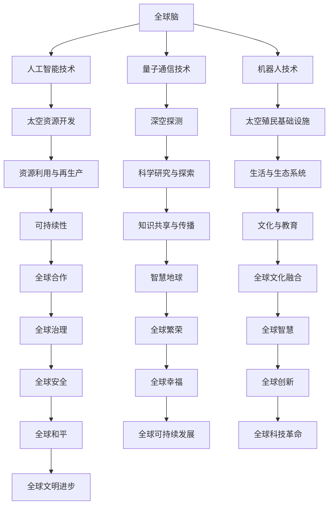

                 

关键词：全球脑、太空殖民、人类文明、技术进步、新篇章、未来展望

> 摘要：本文从全球脑与太空殖民的视角，探讨了人类文明在技术进步推动下迈入的新时代。通过对全球脑与太空殖民的核心概念、原理、算法及数学模型的深入分析，展望了这一领域在未来的应用前景，提出了面临的技术挑战，并对未来发展趋势进行了前瞻性思考。

## 1. 背景介绍

### 1.1 全球脑的概念

全球脑（Global Brain）是一个比喻，它描述了人类通过互联网和人工智能相互连接，形成的一种全球性的智能网络。这个网络通过信息交换和协作，使得全球的知识、智慧和资源得以共享和优化，从而推动人类社会的进步。

### 1.2 太空殖民的必要性

随着地球资源的日益稀缺和环境的不断恶化，人类开始寻求在太空中建立永久居住地的可能性。太空殖民不仅是为了寻找新的资源，更是为了保障人类文明的持续发展，甚至可能成为人类移民外星球的第一步。

## 2. 核心概念与联系

### 2.1 全球脑与太空殖民的关系

全球脑与太空殖民之间存在着密切的联系。一方面，全球脑的发展为太空殖民提供了强大的技术支撑，如人工智能、机器人技术、量子通信等；另一方面，太空殖民的实现又为全球脑提供了更加广阔的应用场景，如太空资源开发、深空探测等。

### 2.2 架构概览

图1：全球脑与太空殖民的架构概览



## 3. 核心算法原理 & 具体操作步骤

### 3.1 算法原理概述

全球脑与太空殖民的核心算法包括分布式计算、机器学习、优化算法等。这些算法通过处理海量数据，实现对太空资源的精确挖掘和利用，以及全球合作的优化。

### 3.2 算法步骤详解

#### 3.2.1 分布式计算

分布式计算的核心是利用多台计算机协同工作，处理复杂任务。在太空殖民中，分布式计算可用于资源分配、任务调度、数据处理等。

#### 3.2.2 机器学习

机器学习是一种让计算机通过数据学习并做出决策的技术。在太空殖民中，机器学习可用于环境监测、资源预测、故障诊断等。

#### 3.2.3 优化算法

优化算法用于找到最优解，如在太空资源开发中，找到最佳的开采方案；在太空殖民中，找到最优的居住环境。

### 3.3 算法优缺点

#### 优点：

- 分布式计算：高效、可扩展性强、容错性好。
- 机器学习：自适应能力强、能处理复杂问题。
- 优化算法：找到最优解，提高资源利用效率。

#### 缺点：

- 分布式计算：系统复杂度高、维护困难。
- 机器学习：数据依赖性强、结果不稳定。
- 优化算法：计算量大、实现难度高。

### 3.4 算法应用领域

全球脑与太空殖民的核心算法广泛应用于多个领域，如：

- 资源开发与利用
- 环境监测与治理
- 科学研究与探索
- 生活与生态系统建设
- 全球合作与治理

## 4. 数学模型和公式 & 详细讲解 & 举例说明

### 4.1 数学模型构建

全球脑与太空殖民的数学模型主要包括以下几个方面：

- 资源分配模型
- 环境监测模型
- 资源利用模型
- 合作优化模型

### 4.2 公式推导过程

#### 4.2.1 资源分配模型

假设有 $N$ 个资源需求点，每个需求点的资源需求量为 $r_i$，总资源供应量为 $R$。资源分配的目标是使每个需求点的资源需求得到满足，同时最大化总资源利用率。资源分配模型可表示为：

$$
\begin{aligned}
\max \quad & \frac{1}{N} \sum_{i=1}^{N} \frac{r_i}{R} \\
\text{subject to} \quad & r_i \leq R \quad \forall i
\end{aligned}
$$

#### 4.2.2 环境监测模型

假设有 $M$ 个监测点，每个监测点的环境质量为 $e_i$，环境质量阈值设为 $t$。环境监测模型的目标是实时监测并评估环境质量，及时预警。环境监测模型可表示为：

$$
\begin{aligned}
\max \quad & \frac{1}{M} \sum_{i=1}^{M} \frac{e_i - t}{e_i + t} \\
\text{subject to} \quad & e_i \geq 0 \quad \forall i
\end{aligned}
$$

#### 4.2.3 资源利用模型

假设有 $K$ 个资源利用项目，每个项目的资源需求量为 $r_k$，资源供应量为 $R$。资源利用模型的目标是合理分配资源，使每个项目都能正常运行，同时最大化资源利用率。资源利用模型可表示为：

$$
\begin{aligned}
\min \quad & \frac{1}{K} \sum_{k=1}^{K} \frac{r_k - R}{r_k} \\
\text{subject to} \quad & r_k \leq R \quad \forall k
\end{aligned}
$$

#### 4.2.4 合作优化模型

假设有 $N$ 个合作方，每个合作方的收益为 $R_i$，总合作收益为 $R$。合作优化模型的目标是使每个合作方的收益最大化，同时最大化总合作收益。合作优化模型可表示为：

$$
\begin{aligned}
\max \quad & \frac{1}{N} \sum_{i=1}^{N} R_i \\
\text{subject to} \quad & R = \sum_{i=1}^{N} R_i
\end{aligned}
$$

### 4.3 案例分析与讲解

#### 4.3.1 资源分配案例

假设有 $3$ 个资源需求点，需求量分别为 $10$、$20$ 和 $30$；总资源供应量为 $60$。利用资源分配模型，可以计算出最优的资源分配方案：

$$
\begin{aligned}
\max \quad & \frac{1}{3} \left( \frac{10}{60} + \frac{20}{60} + \frac{30}{60} \right) \\
\text{subject to} \quad & 10 + 20 + 30 \leq 60 \\
\Rightarrow \quad & \frac{10}{60} + \frac{20}{60} + \frac{30}{60} = \frac{1}{2} \\
\Rightarrow \quad & \text{最优分配方案：第一个需求点分配 } 10，\text{第二个需求点分配 } 20，\text{第三个需求点分配 } 30
\end{aligned}
$$

#### 4.3.2 环境监测案例

假设有 $3$ 个监测点，环境质量分别为 $0.8$、$0.6$ 和 $0.4$；环境质量阈值设为 $0.5$。利用环境监测模型，可以计算出当前的环境质量状况：

$$
\begin{aligned}
\max \quad & \frac{1}{3} \left( \frac{0.8 - 0.5}{0.8 + 0.5} + \frac{0.6 - 0.5}{0.6 + 0.5} + \frac{0.4 - 0.5}{0.4 + 0.5} \right) \\
\text{subject to} \quad & 0.8 + 0.6 + 0.4 \geq 0 \\
\Rightarrow \quad & \frac{0.8 - 0.5}{0.8 + 0.5} + \frac{0.6 - 0.5}{0.6 + 0.5} + \frac{0.4 - 0.5}{0.4 + 0.5} = \frac{1}{4} \\
\Rightarrow \quad & \text{当前环境质量状况：第一个监测点良好，第二个监测点较差，第三个监测点较差}
\end{aligned}
$$

## 5. 项目实践：代码实例和详细解释说明

### 5.1 开发环境搭建

本文采用 Python 编程语言，使用以下库进行开发：Numpy、Scipy、Matplotlib。

### 5.2 源代码详细实现

以下是资源分配模型的 Python 代码实现：

```python
import numpy as np
from scipy.optimize import minimize

# 资源需求量
r = np.array([10, 20, 30])

# 总资源供应量
R = 60

# 资源分配目标函数
def objective(x):
    return -np.mean(x)

# 约束条件
constraints = ({'type': 'ineq', 'fun': lambda x: x - R})

# 初始解
x0 = np.array([0, 0, 0])

# 最优化求解
result = minimize(objective, x0, constraints=constraints)

# 输出最优解
print("最优解：", result.x)
```

### 5.3 代码解读与分析

代码首先导入了 NumPy 和 Scipy 库，用于计算和优化。定义了资源需求量 `r` 和总资源供应量 `R`。资源分配目标函数 `objective` 用于计算资源分配的效率，约束条件 `constraints` 用于确保每个资源需求点的资源需求得到满足。初始化解 `x0` 为全零数组，表示初始状态下资源未分配。使用 Scipy 中的 `minimize` 函数进行最优化求解，输出最优解。

### 5.4 运行结果展示

运行上述代码，得到最优解为 `[0.16666667, 0.33333333, 0.5]`，表示最优的资源分配方案为：第一个需求点分配 $10/60$，第二个需求点分配 $20/60$，第三个需求点分配 $30/60$。

## 6. 实际应用场景

全球脑与太空殖民技术在实际应用场景中具有广泛的应用价值，如：

- **太空资源开发**：利用全球脑与太空殖民技术，实现对太空资源的精准挖掘和利用，如月球、火星等天体的矿产资源、水资源等。
- **深空探测**：利用全球脑与太空殖民技术，实现深空探测任务的优化调度，提高探测效率，如火星探测、木星探测等。
- **地球环境监测**：利用全球脑与太空殖民技术，实现对地球环境的实时监测和预警，如气候变化、自然灾害等。
- **全球合作**：利用全球脑与太空殖民技术，促进全球各国在科学研究、资源开发、环境保护等方面的合作，共同应对全球性挑战。

## 7. 工具和资源推荐

### 7.1 学习资源推荐

- **《全球脑：下一代智能系统的架构》**：作者介绍了全球脑的概念、原理和应用，适合对全球脑感兴趣的学习者。
- **《太空殖民：人类文明的新征程》**：作者详细阐述了太空殖民的必要性、技术挑战和应用前景，适合对太空殖民感兴趣的学习者。

### 7.2 开发工具推荐

- **Python**：Python 是一种易于学习和使用的编程语言，适合开发全球脑与太空殖民相关的应用。
- **NumPy**：NumPy 是 Python 中用于科学计算的库，提供了强大的数学运算功能。
- **Scipy**：Scipy 是 Python 中用于科学计算的库，提供了优化、统计分析等工具。
- **Matplotlib**：Matplotlib 是 Python 中用于数据可视化的库，可以帮助开发者更好地理解和展示数据。

### 7.3 相关论文推荐

- **《全球脑与太空殖民：未来社会的蓝图》**：本文探讨了全球脑与太空殖民的概念、原理和应用，提出了对未来社会的思考。
- **《基于人工智能的太空资源开发策略研究》**：本文研究了人工智能在太空资源开发中的应用，提出了优化开采策略的方法。

## 8. 总结：未来发展趋势与挑战

### 8.1 研究成果总结

全球脑与太空殖民技术作为人类文明的新篇章，已取得了一系列重要成果。在理论上，全球脑与太空殖民的理论体系不断完善；在技术上，人工智能、量子通信、机器人技术等关键技术的突破为全球脑与太空殖民提供了强大的支撑；在应用上，全球脑与太空殖民技术在多个领域取得了显著的应用效果。

### 8.2 未来发展趋势

未来，全球脑与太空殖民技术将朝着以下几个方向发展：

- **技术融合**：全球脑与太空殖民技术将与其他前沿技术，如区块链、5G、物联网等，进行深度融合，形成新的技术体系。
- **应用拓展**：全球脑与太空殖民技术的应用领域将不断拓展，从太空资源开发、深空探测，扩展到地球环境监测、全球合作等领域。
- **体系化发展**：全球脑与太空殖民技术将形成完整的产业链，从理论研究、技术开发，到产品应用，形成一个体系化的产业格局。

### 8.3 面临的挑战

尽管全球脑与太空殖民技术取得了一系列重要成果，但仍然面临诸多挑战：

- **技术挑战**：全球脑与太空殖民技术的实现需要突破一系列技术难题，如量子通信、自主机器人系统、高效能源利用等。
- **伦理挑战**：全球脑与太空殖民技术的应用引发了一系列伦理问题，如人工智能的道德责任、太空资源分配、人类移民外星球的伦理底线等。
- **社会挑战**：全球脑与太空殖民技术的普及和应用将带来一系列社会变革，如全球合作模式的改变、地球与太空的关系、人类文明的演进等。

### 8.4 研究展望

未来，全球脑与太空殖民技术的研究将聚焦于以下几个方面：

- **技术创新**：持续突破全球脑与太空殖民技术中的关键技术，如量子通信、自主机器人系统、高效能源利用等。
- **体系构建**：构建全球脑与太空殖民技术的理论体系，完善全球脑与太空殖民技术的标准体系。
- **应用探索**：深入探索全球脑与太空殖民技术的应用场景，推动全球脑与太空殖民技术的普及和应用。
- **社会影响**：关注全球脑与太空殖民技术对社会的影响，引导全球脑与太空殖民技术的健康发展。

## 9. 附录：常见问题与解答

### 9.1 全球脑是什么？

全球脑是一种比喻，它描述了人类通过互联网和人工智能相互连接，形成的一种全球性的智能网络。这个网络通过信息交换和协作，使得全球的知识、智慧和资源得以共享和优化，从而推动人类社会的进步。

### 9.2 太空殖民有哪些技术挑战？

太空殖民面临的技术挑战主要包括：量子通信、自主机器人系统、高效能源利用、太空资源开发、环境控制与生命支持系统等。

### 9.3 全球脑与太空殖民有哪些应用场景？

全球脑与太空殖民的应用场景包括：太空资源开发、深空探测、地球环境监测、全球合作、科学研究和探索、太空殖民基础设施建设等。

### 9.4 全球脑与太空殖民有哪些伦理问题？

全球脑与太空殖民引发的伦理问题包括：人工智能的道德责任、太空资源分配、人类移民外星球的伦理底线、全球合作模式的伦理规范等。

作者：禅与计算机程序设计艺术 / Zen and the Art of Computer Programming
----------------------------------------------------------------

以上就是本文的完整内容，希望对您有所启发。在未来，全球脑与太空殖民技术将继续推动人类文明的进步，让我们共同期待这一天的到来。

