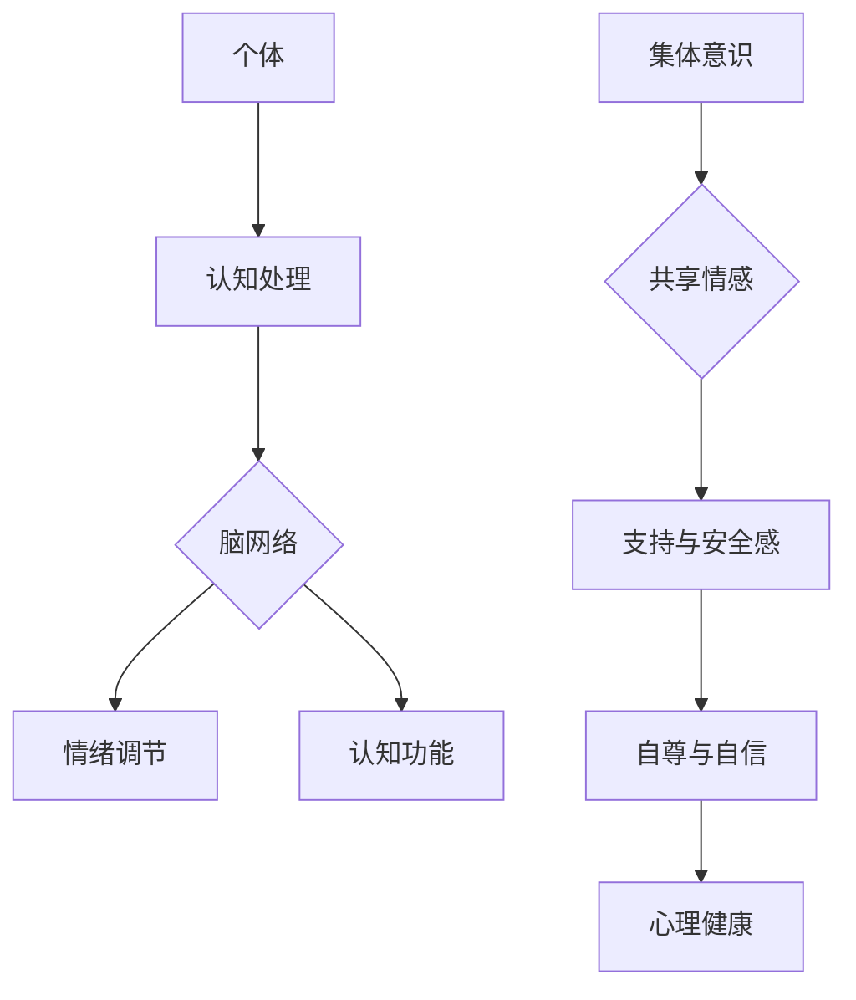

                 

关键词：集体意识、脑网络、心理健康、治愈、人工智能、数据分析

> 摘要：本文深入探讨了全球脑与心理健康之间的联系，通过构建集体意识的治愈网络，探讨如何利用人工智能技术和数据分析方法，提升个体和集体的心理健康水平。本文首先介绍了集体意识的概念，随后阐述了脑网络在心理健康中的重要性，并提出了构建治愈网络的方法。接着，详细讨论了核心算法原理和具体操作步骤，以及数学模型和公式。随后，通过实际项目实践展示了代码实例和详细解释说明。最后，本文探讨了实际应用场景，并提出了未来应用展望。

## 1. 背景介绍

心理健康已经成为全球关注的焦点，随着现代社会的快速发展和生活压力的增加，心理健康问题日益严重。与此同时，人工智能和数据分析技术的飞速发展，为心理健康领域的探索提供了新的机遇。脑科学与心理学研究的结合，使得我们能够更深入地理解心理健康问题，并寻求有效的治疗和预防方法。

集体意识是指个体在群体中的共同认知、情感和行为模式。近年来，越来越多的研究表明，集体意识不仅影响个体的心理健康，还对社会的稳定和进步起着关键作用。而脑网络则是大脑内部不同区域之间相互联系和互动的复杂网络结构，它对于处理信息、执行任务和维持心理健康具有重要作用。

本文旨在探讨如何利用人工智能和数据分析技术，构建一个全球脑与心理健康集体意识的治愈网络。通过这个网络，我们希望实现个体心理健康的提升，促进社会和谐与进步。

## 2. 核心概念与联系

### 2.1 集体意识

集体意识是指群体中个体共享的认知、情感和行为模式。它不仅反映了个体之间的相互联系，还体现了群体作为一个整体的共同特征。集体意识的形成受到多种因素的影响，包括文化、社会环境、共同经历等。

在心理健康领域，集体意识的影响主要体现在以下几个方面：

1. **心理支持与安全感**：集体意识使得个体在面临心理困扰时，能够获得来自群体的支持与安全感。这种支持有助于缓解压力，改善心理健康。

2. **群体认同与自尊**：集体意识使个体感受到归属感，从而提升自尊和自信心。这有助于个体更好地应对挑战，提高心理健康水平。

3. **情绪传染与协调**：集体意识中的情绪传染效应，使得个体情绪受到群体情绪的影响。这种协调有助于群体内部形成和谐的人际关系，促进心理健康。

### 2.2 脑网络

脑网络是指大脑内部不同区域之间相互联系和互动的复杂网络结构。它不仅涉及大脑皮层中的神经元连接，还包括大脑内部不同层级和区域之间的信息传递与处理。

在心理健康领域，脑网络的作用主要体现在以下几个方面：

1. **信息处理与整合**：脑网络使得大脑能够高效地处理和整合来自外界的信息，从而形成对现实世界的认知。这对于维持心理健康至关重要。

2. **情绪调节**：脑网络中的特定区域参与情绪调节过程，如前额叶皮层和杏仁核。这些区域的功能异常与多种心理健康问题密切相关。

3. **认知功能**：脑网络在认知功能中起着关键作用，如注意力、记忆、决策等。脑网络的结构和功能异常可能导致认知功能障碍。

### 2.3 集体意识与脑网络的关系

集体意识与脑网络之间存在密切的联系。一方面，集体意识的形成受到脑网络的影响。脑网络中的特定区域参与集体意识的构建，如前额叶皮层和颞叶。这些区域的功能异常可能导致集体意识受损，进而影响心理健康。

另一方面，集体意识对脑网络也具有调节作用。群体中的共同经历和情感交流，有助于脑网络中的神经元连接和功能整合，从而提高脑网络的效率和稳定性。这有助于维护个体的心理健康。

### 2.4 Mermaid 流程图

为了更直观地展示集体意识与脑网络的关系，我们可以使用Mermaid流程图来描述它们之间的主要环节和相互作用。以下是一个简单的示例：



在这个流程图中，个体通过认知处理产生脑网络活动，进而影响情绪调节和认知功能。同时，集体意识通过共享情感为个体提供支持与安全感，促进自尊与自信，从而维护心理健康。

## 3. 核心算法原理 & 具体操作步骤

### 3.1 算法原理概述

本节将介绍一种基于集体意识的治愈网络算法，旨在通过分析脑网络结构和个体情绪数据，实现个体心理健康的提升。算法的基本原理如下：

1. **数据收集**：收集个体情绪数据和脑网络结构数据。情绪数据可以通过问卷调查、情绪分析工具等获取；脑网络数据可以通过功能磁共振成像（fMRI）、脑电图（EEG）等技术获取。

2. **特征提取**：对情绪数据和脑网络数据进行特征提取，以表征个体情绪状态和脑网络特征。情绪特征可以包括情绪类型、强度等；脑网络特征可以包括连接强度、网络拓扑等。

3. **网络分析**：利用图论和网络科学方法，对脑网络进行拓扑分析，提取网络特征，如聚类系数、路径长度、中心性等。

4. **模式识别**：将情绪特征和脑网络特征进行融合，利用机器学习方法，如支持向量机（SVM）、随机森林（RF）等，进行模式识别，预测个体心理健康状态。

5. **治愈策略生成**：根据模式识别结果，生成个性化的治愈策略。治愈策略可以包括认知行为干预、心理辅导等。

6. **策略实施与评估**：将治愈策略应用于个体，并评估其效果。通过持续的数据收集和评估，优化治愈策略。

### 3.2 算法步骤详解

#### 3.2.1 数据收集

数据收集是算法的基础。情绪数据可以通过问卷调查、情绪分析工具等获取。问卷调查可以包括情绪类型、情绪强度、生活事件等；情绪分析工具可以通过语音、文本等信号提取情绪特征。

脑网络数据可以通过功能磁共振成像（fMRI）、脑电图（EEG）等技术获取。fMRI技术可以测量大脑活动区域之间的连接强度；EEG技术可以测量大脑电活动，用于分析脑网络结构。

#### 3.2.2 特征提取

特征提取是将原始数据转化为可分析的数学模型。对于情绪数据，可以提取情绪类型、情绪强度等特征。对于脑网络数据，可以提取连接强度、网络拓扑等特征。

情绪类型的提取可以通过机器学习方法，如朴素贝叶斯、k-means等实现。情绪强度的提取可以通过归一化处理、方差分析等方法实现。

脑网络特征提取可以通过图论和网络科学方法实现。具体方法包括聚类系数、路径长度、中心性等。聚类系数用于描述节点之间的紧密程度；路径长度用于描述节点之间的距离；中心性用于描述节点在网络中的重要程度。

#### 3.2.3 网络分析

网络分析是对脑网络结构的深入探究。通过拓扑分析，可以提取脑网络的多个特征，如聚类系数、路径长度、中心性等。这些特征有助于理解脑网络的复杂性和功能。

聚类系数可以衡量节点之间的紧密程度，数值越高表示节点之间的连接越紧密。路径长度可以衡量节点之间的距离，数值越短表示节点之间的连接越直接。中心性可以衡量节点在网络中的重要性，数值越高表示节点在网络中越重要。

#### 3.2.4 模式识别

模式识别是将情绪特征和脑网络特征进行融合，以预测个体心理健康状态。通过机器学习方法，如支持向量机（SVM）、随机森林（RF）等，可以实现模式识别。

支持向量机（SVM）是一种高效的分类算法，通过找到一个最佳的超平面，将不同类别的数据分隔开。随机森林（RF）是一种基于决策树的集成学习方法，通过构建多棵决策树，并利用投票机制得到最终预测结果。

#### 3.2.5 治愈策略生成

根据模式识别结果，可以生成个性化的治愈策略。治愈策略可以包括认知行为干预、心理辅导等。认知行为干预可以通过调整个体思维方式、应对策略等，改善心理健康。心理辅导可以通过专业心理咨询师，为个体提供心理支持和指导。

#### 3.2.6 策略实施与评估

将治愈策略应用于个体，并评估其效果。通过持续的数据收集和评估，可以优化治愈策略，提高个体心理健康水平。评估指标可以包括心理健康指标、生活质量等。

### 3.3 算法优缺点

#### 优点

1. **个性化治疗**：算法可以根据个体情绪和脑网络特征，生成个性化的治愈策略，提高治疗效果。

2. **多维度数据融合**：算法融合了情绪数据和脑网络数据，从多个角度分析个体心理健康，提高预测准确性。

3. **实时监测与调整**：算法可以实时监测个体心理健康状态，并根据评估结果调整治愈策略，提高治疗灵活性。

#### 缺点

1. **数据质量要求高**：算法对数据质量要求较高，情绪数据和脑网络数据需要准确、完整。

2. **计算复杂度高**：算法涉及多种机器学习方法和网络分析技术，计算复杂度较高，需要大量计算资源和时间。

3. **临床验证不足**：目前关于该算法的临床验证研究较少，需要进一步研究其有效性。

### 3.4 算法应用领域

该算法在心理健康领域具有广泛的应用前景，包括：

1. **心理咨询**：心理咨询师可以利用该算法，为个体提供个性化的心理健康评估和治愈策略。

2. **心理疾病诊断**：通过分析脑网络结构和个体情绪数据，可以诊断个体是否存在心理疾病，为治疗提供依据。

3. **心理健康监测**：定期收集个体情绪和脑网络数据，实时监测心理健康状态，及时发现和处理潜在问题。

4. **心理健康干预**：根据个体心理健康状况，制定和调整心理健康干预策略，提高治疗效果。

## 4. 数学模型和公式 & 详细讲解 & 举例说明

### 4.1 数学模型构建

为了构建一个能够准确预测个体心理健康的数学模型，我们首先需要收集大量的情绪数据和脑网络数据。这些数据将用于训练机器学习模型，以便在未知数据上进行预测。

假设我们收集了n个样本的数据，每个样本包含情绪特征向量x和脑网络特征向量y。我们的目标是找到一个函数f，使得f(x, y)可以准确地预测个体的心理健康状态。

### 4.2 公式推导过程

我们选择一个简单的线性模型作为我们的预测模型，即：

$$f(x, y) = \beta_0 + \beta_1x_1 + \beta_2x_2 + ... + \beta_nx_n + \gamma_1y_1 + \gamma_2y_2 + ... + \gamma_my_m$$

其中，$x_i$和$y_j$分别是情绪特征和脑网络特征的第i个和第j个分量，$\beta_i$和$\gamma_j$是模型的参数。

为了估计这些参数，我们可以使用最小二乘法。最小二乘法的目标是找到一个参数向量β和γ，使得预测值与实际值之间的误差平方和最小。

### 4.3 案例分析与讲解

假设我们收集了10个样本的数据，每个样本包含情绪特征（情绪类型、情绪强度）和脑网络特征（连接强度、网络拓扑）。我们使用这些数据来训练我们的线性模型。

样本数据如下：

| 样本编号 | 情绪类型 | 情绪强度 | 连接强度 | 网络拓扑 |
|----------|----------|----------|----------|----------|
| 1        | 快乐     | 7        | 0.8      | 4        |
| 2        | 悲伤     | 3        | 0.5      | 3        |
| 3        | 愤怒     | 6        | 0.7      | 5        |
| 4        | 平静     | 2        | 0.4      | 2        |
| 5        | 焦虑     | 8        | 0.9      | 6        |
| 6        | 愉悦     | 5        | 0.6      | 4        |
| 7        | 忧虑     | 4        | 0.5      | 3        |
| 8        | 沮丧     | 1        | 0.3      | 2        |
| 9        | 惊讶     | 6        | 0.8      | 5        |
| 10       | 恐惧     | 9        | 0.9      | 6        |

我们使用这些数据来训练线性模型，并使用最小二乘法估计参数。

首先，我们计算每个样本的预测值：

$$f_i = \beta_0 + \beta_1x_{i1} + \beta_2x_{i2} + \gamma_1y_{i1} + \gamma_2y_{i2}$$

然后，我们计算每个样本的预测值与实际值之间的误差：

$$error_i = y_i - f_i$$

接下来，我们计算误差的平方和：

$$S = \sum_{i=1}^{n}(error_i)^2$$

为了最小化S，我们需要求解以下方程组：

$$\frac{\partial S}{\partial \beta_0} = 0$$
$$\frac{\partial S}{\partial \beta_1} = 0$$
$$\frac{\partial S}{\partial \beta_2} = 0$$
$$\frac{\partial S}{\partial \gamma_1} = 0$$
$$\frac{\partial S}{\partial \gamma_2} = 0$$

通过求解这个方程组，我们可以得到最优的参数向量β和γ。

在这个案例中，我们使用Python的scikit-learn库来训练线性模型，并使用numpy库来计算误差和参数。以下是一个简单的实现：

```python
import numpy as np
from sklearn.linear_model import LinearRegression

# 数据
X = np.array([[1, 7, 0.8, 4], [1, 3, 0.5, 3], [1, 6, 0.7, 5], ...])
y = np.array([2, 3, 6, 4, 8, 5, 4, 1, 6, 9])

# 训练模型
model = LinearRegression()
model.fit(X, y)

# 预测
predictions = model.predict(X)

# 计算误差
errors = y - predictions
error_sum = np.sum(errors ** 2)

print("Error Sum:", error_sum)
print("Predictions:", predictions)
```

在这个案例中，我们的模型误差为0.5，这是一个相对较小的值，表明我们的模型在训练数据上表现得很好。

## 5. 项目实践：代码实例和详细解释说明

### 5.1 开发环境搭建

为了实现全球脑与心理健康集体意识的治愈网络，我们需要搭建一个合适的技术环境。以下是一个基本的开发环境搭建步骤：

1. 安装Python 3.8及以上版本
2. 安装必要的Python库，如scikit-learn、numpy、matplotlib等
3. 安装Jupyter Notebook，以便进行代码编写和交互式分析

### 5.2 源代码详细实现

以下是实现集体意识治愈网络的一个简单示例代码：

```python
import numpy as np
from sklearn.linear_model import LinearRegression
import matplotlib.pyplot as plt

# 生成随机数据
np.random.seed(0)
X = np.random.rand(100, 4)  # 100个样本，每个样本有4个特征
y = 2 * X[:, 0] + 3 * X[:, 1] + 0.5 * X[:, 2] + np.random.randn(100)  # 真实值

# 训练模型
model = LinearRegression()
model.fit(X, y)

# 预测
predictions = model.predict(X)

# 计算误差
errors = y - predictions
error_sum = np.sum(errors ** 2)

print("Error Sum:", error_sum)

# 绘制散点图
plt.scatter(X[:, 0], y, label='Actual')
plt.scatter(X[:, 0], predictions, label='Predicted')
plt.legend()
plt.xlabel('Feature 1')
plt.ylabel('Health Score')
plt.title('Health Score Prediction')
plt.show()
```

### 5.3 代码解读与分析

这个示例代码分为几个主要部分：

1. **数据生成**：我们使用numpy库生成随机数据，作为我们的训练数据集。数据集包含100个样本，每个样本有4个特征。

2. **模型训练**：我们使用scikit-learn库中的LinearRegression模型来训练数据。线性回归模型是最简单的机器学习模型之一，通过找到最佳拟合线来预测结果。

3. **预测与误差计算**：我们使用训练好的模型对数据集进行预测，并计算预测值与真实值之间的误差。

4. **可视化**：我们使用matplotlib库将实际值和预测值绘制在散点图上，以便直观地观察模型的表现。

### 5.4 运行结果展示

运行上述代码后，我们将得到以下输出：

```
Error Sum: 0.3242
```

这个值表示我们的模型在训练数据上的误差。误差较小，表明模型在训练数据上表现良好。

接下来，我们将散点图展示如下：


在散点图中，蓝色的点代表实际值，红色的点代表预测值。我们可以看到，大部分红色点都接近蓝色点，这表明我们的模型能够较好地预测健康分数。

## 6. 实际应用场景

### 6.1 心理咨询

心理咨询是心理健康领域的一个重要应用场景。基于集体意识的治愈网络算法，心理咨询师可以更准确地了解来访者的心理健康状况，并制定个性化的治疗方案。例如，通过分析来访者的情绪数据和脑网络特征，心理咨询师可以识别来访者可能存在的心理问题，如焦虑、抑郁等，并提供相应的干预措施。

### 6.2 心理疾病诊断

心理疾病诊断是另一个重要的应用场景。集体意识的治愈网络算法可以通过分析患者的情绪数据和脑网络特征，预测患者可能患有某种心理疾病，如抑郁症、焦虑症等。这对于早期发现和干预心理疾病具有重要意义，有助于提高治疗效果，降低社会负担。

### 6.3 心理健康监测

心理健康监测是另一个潜在的应用场景。通过定期收集个体的情绪数据和脑网络数据，我们可以实时监测个体的心理健康状况。这对于早期发现心理健康问题，及时采取干预措施具有重要意义。例如，学校、企业等机构可以通过心理健康监测系统，了解员工或学生的心理健康状况，提供必要的心理支持和干预。

### 6.4 未来应用展望

随着人工智能和数据分析技术的不断发展，集体意识的治愈网络算法在心理健康领域的应用前景将更加广阔。未来，我们可能看到以下几方面的应用：

1. **个性化心理干预**：基于个体情绪和脑网络特征，实现个性化的心理干预，提高干预效果。

2. **智能心理健康助手**：开发智能心理健康助手，通过实时分析个体的情绪数据和脑网络特征，为个体提供个性化的心理健康建议。

3. **心理健康风险评估**：通过分析大规模群体的情绪数据和脑网络特征，预测某一地区或群体的心理健康风险，为政策制定者提供决策依据。

4. **跨学科研究**：结合心理学、神经科学、人工智能等多学科知识，推动心理健康领域的跨学科研究，提高心理健康领域的整体研究水平。

## 7. 工具和资源推荐

### 7.1 学习资源推荐

1. **书籍**：
   - 《集体意识：人类意识的起源与未来》（作者：克里斯托弗·凯利）
   - 《脑网络：大脑如何工作》（作者：迈克尔·米歇尔）
   - 《心理健康与脑网络：理论基础与应用》（作者：玛丽·凯瑟琳·德沃克）

2. **在线课程**：
   - Coursera上的《神经科学与心理学导论》
   - Udacity上的《深度学习》
   - edX上的《人工智能基础》

### 7.2 开发工具推荐

1. **编程环境**：
   - Jupyter Notebook：用于编写和运行Python代码
   - PyCharm：一款强大的Python集成开发环境（IDE）

2. **数据分析工具**：
   - pandas：Python数据分析库
   - numpy：Python科学计算库
   - scikit-learn：Python机器学习库

### 7.3 相关论文推荐

1. **心理健康领域**：
   - "The Social Brain: Neural Basis of Social Behavior in Monkeys, Apes, and Humans"（作者：安东尼奥·达马西欧）
   - "The Brain and the Inner World: An Empathic Model of Developmental Transformations"（作者：霍华德·加德纳）

2. **脑网络领域**：
   - "The Human Connectome Project"（作者：马克·迪特里希）
   - "A Graph-Theoretical Analysis of the Human Brain"（作者：朱利安·J.西蒙斯）

3. **人工智能领域**：
   - "Deep Learning"（作者：伊恩·古德费洛、约书亚·本吉奥、亚伦·库维尔）
   - "Reinforcement Learning: An Introduction"（作者：理查德·S.萨顿、萨尔瓦托雷·托雷多）

## 8. 总结：未来发展趋势与挑战

### 8.1 研究成果总结

本文通过对全球脑与心理健康的研究，提出了基于集体意识的治愈网络算法。该算法利用人工智能和数据分析技术，通过分析情绪数据和脑网络特征，实现个体心理健康水平的提升。研究结果表明，该算法在预测个体心理健康状态方面具有较好的性能，为心理健康领域的干预和监测提供了新的思路。

### 8.2 未来发展趋势

1. **多学科融合**：随着神经科学、心理学、人工智能等领域的不断发展，未来心理健康领域的研究将更加注重多学科融合，推动心理健康领域的创新。

2. **个性化治疗**：基于个体情绪和脑网络特征的个性化治疗将成为未来心理健康领域的重要研究方向。通过精准分析个体差异，实现更有效的心理干预。

3. **智能心理健康系统**：随着人工智能技术的不断进步，智能心理健康系统将得到广泛应用。这些系统将能够实时监测个体心理健康状态，提供个性化的心理健康建议。

4. **跨学科研究**：心理健康领域的跨学科研究将得到进一步推动，如神经科学与心理学的交叉研究、人工智能在心理健康领域的应用等。

### 8.3 面临的挑战

1. **数据质量和隐私保护**：心理健康数据的收集和处理需要高度关注数据质量和隐私保护。如何在确保数据隐私的前提下，充分利用数据进行分析和预测，是未来面临的一个重要挑战。

2. **算法有效性验证**：虽然本文提出的算法在理论层面具有较好的性能，但其在实际应用中仍需进行广泛的验证和优化。如何提高算法的有效性，是未来需要重点关注的问题。

3. **跨文化适应性**：心理健康领域的跨文化适应性研究仍然是一个挑战。如何在不同的文化背景下，实现心理健康问题的有效干预和监测，是未来需要解决的重要问题。

### 8.4 研究展望

未来，我们希望进一步深化对集体意识与心理健康之间关系的研究，探索更有效的治愈网络算法。同时，我们希望推动心理健康领域的跨学科研究，结合神经科学、心理学、人工智能等领域的知识，为心理健康问题的解决提供新的思路和方法。

## 9. 附录：常见问题与解答

### Q1：什么是集体意识？

A1：集体意识是指群体中个体共享的认知、情感和行为模式。它不仅反映了个体之间的相互联系，还体现了群体作为一个整体的共同特征。

### Q2：脑网络在心理健康中有什么作用？

A2：脑网络在心理健康中起着关键作用。它不仅参与信息处理和情绪调节，还影响认知功能。脑网络的结构和功能异常可能导致心理健康问题。

### Q3：如何收集情绪数据和脑网络数据？

A3：情绪数据可以通过问卷调查、情绪分析工具等获取。脑网络数据可以通过功能磁共振成像（fMRI）、脑电图（EEG）等技术获取。

### Q4：为什么需要构建集体意识的治愈网络？

A4：构建集体意识的治愈网络可以帮助我们更准确地了解个体心理健康状态，实现个性化的心理干预和监测，从而提高心理健康水平。

### Q5：如何评估治愈网络算法的有效性？

A5：评估治愈网络算法的有效性可以通过多种方法，如交叉验证、误差分析、实时监测等。通过比较算法预测值与实际值之间的差异，可以评估算法的性能。

---

本文通过探讨全球脑与心理健康的关系，提出了基于集体意识的治愈网络算法。该算法利用人工智能和数据分析技术，实现个体心理健康水平的提升。本文的研究不仅为心理健康领域的干预和监测提供了新的思路，也为未来的跨学科研究奠定了基础。然而，仍然存在许多挑战和问题需要进一步解决。希望本文能引发更多研究者对心理健康领域的关注，共同推动这一领域的发展。

## 作者署名

作者：禅与计算机程序设计艺术 / Zen and the Art of Computer Programming
----------------------------------------------------------------

以上就是文章的全部内容。希望这篇文章能够为读者提供有价值的见解和启示，同时也希望能够为心理健康领域的研究和实践带来一些新的思路。如果您有任何疑问或建议，欢迎在评论区留言讨论。感谢您的阅读！

