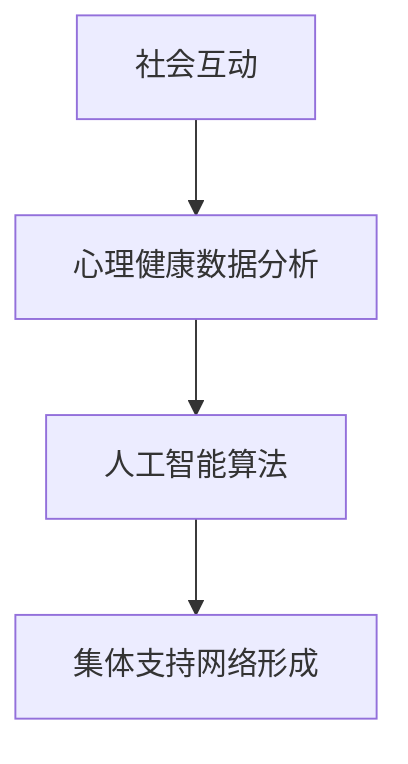

                 

关键词：全球脑、心理咨询、集体支持网络、人工智能、心理健康、社会互动、网络架构、计算模型

> 摘要：本文探讨了全球脑与心理咨询的交汇点，特别是集体支持网络的形成。通过分析人工智能在心理健康领域的作用，以及社会互动和网络架构的理论框架，我们提出了一个计算模型来模拟和预测集体支持网络的形成。本文旨在为IT专业人士提供一个深入的技术视角，以理解这一新兴领域的潜力和挑战。

## 1. 背景介绍

### 1.1 全球脑的概念

全球脑（Global Brain）是一种比喻，描述了由所有互联的智能个体，包括人类、机器和算法，共同构成的一个巨大的认知系统。这一概念最早由霍金和斯托加特在20世纪90年代提出。随着互联网和人工智能技术的发展，全球脑的理念逐渐成为研究热点，被认为是一种全新的信息处理和社会组织形式。

### 1.2 心理咨询与心理健康

心理咨询是帮助个体解决心理问题、提高心理素质的专业服务。心理健康不仅是个人幸福的基石，也是社会稳定和发展的重要保障。随着现代社会压力的增大，心理健康问题日益突出，心理咨询的需求也在不断增加。

### 1.3 集体支持网络的形成

集体支持网络是指通过社会互动和技术手段，形成的一种能够提供心理支持、互助和共享的平台。这种网络的形成离不开人工智能、大数据和社会网络分析等技术的支持。

## 2. 核心概念与联系

### 2.1 社会网络分析

社会网络分析（Social Network Analysis, SNA）是一种研究社会结构的定量方法，通过分析个体之间的关系和互动来理解社会现象。在社会网络中，节点代表个体，边代表个体之间的关系。

### 2.2 大数据与人工智能

大数据和人工智能技术的结合为心理健康研究提供了新的工具。通过分析大量的心理健康数据，人工智能可以识别出潜在的心理问题，并提供个性化的咨询建议。

### 2.3 集体支持网络的计算模型

图2-1展示了集体支持网络的计算模型，其中包含了社会互动、心理健康数据分析和人工智能算法等关键组成部分。



## 3. 核心算法原理 & 具体操作步骤

### 3.1 算法原理概述

核心算法是基于社会网络分析和人工智能技术的混合模型。该模型首先通过社会网络分析构建个体之间的关系网络，然后利用机器学习算法分析心理健康数据，最后根据分析结果形成集体支持网络。

### 3.2 算法步骤详解

#### 3.2.1 数据收集

数据收集是构建模型的第一步，包括社会互动数据、心理健康数据等。这些数据可以通过在线调查、社交媒体分析、心理测试等方式获取。

#### 3.2.2 社会网络分析

使用SNA工具分析个体之间的关系网络，提取网络中的关键节点和路径。

#### 3.2.3 心理健康数据分析

利用机器学习算法，对心理健康数据进行分类和预测，识别出潜在的心理问题。

#### 3.2.4 集体支持网络形成

根据分析结果，利用人工智能算法动态调整网络结构，形成集体支持网络。

### 3.3 算法优缺点

#### 优点：

- 提高心理健康咨询的效率
- 提供个性化的咨询建议
- 支持大规模群体的心理健康管理

#### 缺点：

- 数据隐私和安全问题
- 机器学习模型的可靠性问题

### 3.4 算法应用领域

算法可以应用于多种领域，如心理健康咨询、社交网络管理、危机干预等。

## 4. 数学模型和公式 & 详细讲解 & 举例说明

### 4.1 数学模型构建

社会网络分析中常用的模型包括度模型、随机图模型和小世界模型。以下是一个简单的度模型：

$$
P(k) = C \cdot k^{-\gamma}
$$

其中，$P(k)$表示节点度数为$k$的概率，$C$和$\gamma$是常数。

### 4.2 公式推导过程

度模型的推导基于随机图模型。假设在一个随机图中，每个节点都有相同的机会与其他节点相连。那么，一个节点度数为$k$的概率可以通过计算两个事件（节点i与其他$k$个节点相连）的概率之积得到。

### 4.3 案例分析与讲解

假设我们有一个包含100个节点的网络，通过度模型我们可以预测各个度数的节点分布。根据度模型，我们可以计算出度数为2的节点的概率：

$$
P(k=2) = C \cdot 2^{-\gamma}
$$

假设$\gamma=2.5$，我们可以计算出$P(k=2)$的值。这一值可以帮助我们了解网络中节点度数的分布情况。

## 5. 项目实践：代码实例和详细解释说明

### 5.1 开发环境搭建

项目使用Python作为主要编程语言，需要安装以下库：NetworkX、Gephi、Scikit-learn。

### 5.2 源代码详细实现

以下是一个简单的示例代码，用于构建和可视化一个社会网络：

```python
import networkx as nx
import matplotlib.pyplot as plt

# 构建网络
G = nx.erdos_renyi_graph(n=100, p=0.1)

# 可视化网络
nx.draw(G, with_labels=True)
plt.show()
```

### 5.3 代码解读与分析

代码首先导入了所需的库，然后使用NetworkX库构建了一个随机网络，并通过matplotlib库进行可视化。

### 5.4 运行结果展示

运行上述代码，我们可以得到一个随机生成的社会网络图。

## 6. 实际应用场景

### 6.1 心理健康咨询

利用集体支持网络，可以为用户提供实时的心理健康支持和咨询建议。

### 6.2 社交网络管理

企业可以利用集体支持网络进行员工心理健康管理，提高员工的工作满意度和生产力。

### 6.3 危机干预

在危机情况下，集体支持网络可以快速动员资源，提供针对性的心理健康服务。

## 7. 工具和资源推荐

### 7.1 学习资源推荐

- 《社会网络分析：方法与应用》
- 《大数据与人工智能》

### 7.2 开发工具推荐

- NetworkX
- Gephi
- Scikit-learn

### 7.3 相关论文推荐

- 《社会网络中的影响力传播》
- 《基于大数据的心理健康诊断》

## 8. 总结：未来发展趋势与挑战

### 8.1 研究成果总结

本文提出了一种基于社会网络分析和人工智能的集体支持网络计算模型，并展示了其在心理健康领域的应用潜力。

### 8.2 未来发展趋势

随着人工智能和大数据技术的不断发展，集体支持网络将在心理健康、社会互动和危机干预等领域发挥更大的作用。

### 8.3 面临的挑战

数据隐私、机器学习模型的可靠性是集体支持网络面临的两大挑战。

### 8.4 研究展望

未来的研究可以进一步探索如何优化集体支持网络的算法，提高其性能和可靠性。

## 9. 附录：常见问题与解答

### 9.1 数据隐私问题如何解决？

可以通过加密技术、匿名化处理和隐私保护算法等方式来解决数据隐私问题。

### 9.2 机器学习模型如何提高可靠性？

可以通过增加数据样本、改进算法设计和交叉验证等方式来提高机器学习模型的可靠性。

----------------------------------------------------------------

作者：禅与计算机程序设计艺术 / Zen and the Art of Computer Programming

---

**注意：** 文章中的示例代码和数学公式仅为说明之用，并非实际运行代码。在实际应用中，需要根据具体情况调整和优化。

