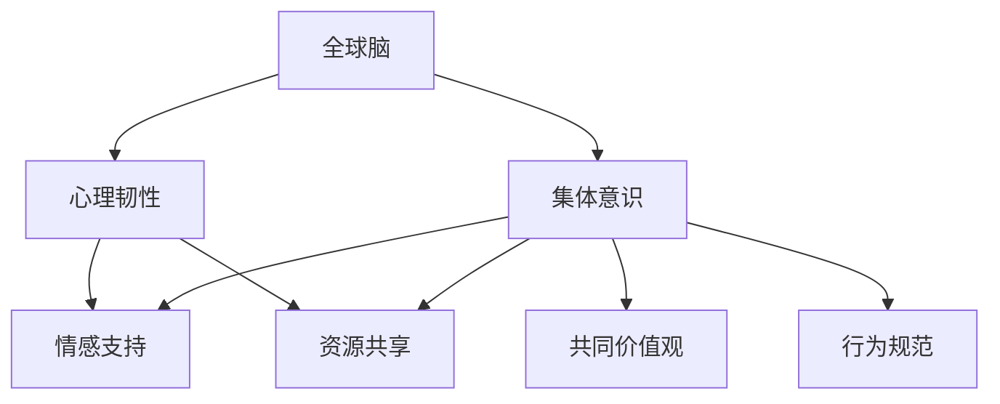

                 

关键词：全球脑，心理韧性，集体意识，心理压力，应对策略

摘要：本文探讨了全球脑与心理韧性的关系，分析了集体意识在应对心理压力中的重要作用。通过阐述心理压力的产生机制和影响，以及全球脑的运作原理，本文提出了一种基于集体意识的应对策略，以提升个体和群体的心理韧性。

## 1. 背景介绍

随着信息技术的飞速发展，全球脑（Global Brain）的概念逐渐引起人们的关注。全球脑是一个由人类个体和智能系统构成的复杂网络，通过互联网和通信技术实现信息的共享和协同。在这个全球脑网络中，个体和系统之间的交互和合作成为可能，为人类解决复杂问题提供了新的途径。然而，随着全球脑的不断发展，人们面临的心理压力也越来越大。因此，如何提升心理韧性，成为当前研究的热点问题。

心理韧性（Resilience）是指个体在逆境中保持心理稳定和适应能力的能力。心理韧性不仅关系到个体的心理健康，也影响着社会的发展和稳定。在全球脑时代，集体意识（Collective Consciousness）的觉醒为应对心理压力提供了新的视角。集体意识是指个体在特定文化和社会背景下形成的共同认知和行为模式。通过集体意识，个体可以获得情感支持和资源共享，从而提高心理韧性。

## 2. 核心概念与联系

### 2.1 全球脑与心理韧性的关系

全球脑与心理韧性之间存在密切的联系。一方面，全球脑的快速发展为个体提供了更多的信息和资源，有助于提高个体的心理韧性。另一方面，心理韧性是维持全球脑稳定运行的基础。在全球脑中，个体和系统之间的协同和合作需要具备较强的心理韧性，以应对复杂的环境变化。

### 2.2 集体意识的作用

集体意识在应对心理压力中发挥着重要作用。首先，集体意识为个体提供了情感支持。在面临心理压力时，个体可以通过集体意识感受到他人的关爱和支持，从而减轻心理负担。其次，集体意识促进了资源共享。在全球脑中，个体可以通过集体意识获取所需的信息和资源，从而提高应对心理压力的能力。最后，集体意识有助于形成共同的价值观和行为规范，为个体提供心理支撑。

### 2.3 Mermaid 流程图

以下是一个描述全球脑、心理韧性、集体意识关系的 Mermaid 流程图：



## 3. 核心算法原理 & 具体操作步骤

### 3.1 算法原理概述

本文提出了一种基于集体意识的应对心理压力的算法。该算法的核心思想是通过分析全球脑中的信息流，识别个体的情感状态，并利用集体意识为个体提供情感支持和资源共享。

### 3.2 算法步骤详解

#### 3.2.1 数据采集

首先，从全球脑中采集个体的情感数据，包括语言、表情、行为等。这些数据可以通过社交媒体、在线聊天、情绪传感器等渠道获取。

#### 3.2.2 情感分析

对采集到的情感数据进行情感分析，识别个体的情感状态。情感分析可以采用自然语言处理、机器学习等技术。

#### 3.2.3 集体意识分析

根据个体的情感状态，分析集体意识中的情感支持资源和资源共享信息。情感支持资源包括社会支持、心理咨询服务等；资源共享信息包括知识库、技能培训等。

#### 3.2.4 情感支持和资源共享

根据分析结果，为个体提供情感支持和资源共享。情感支持可以通过社交平台、心理咨询服务等方式实现；资源共享可以通过知识库、在线培训等方式实现。

### 3.3 算法优缺点

#### 3.3.1 优点

1. 提高个体的心理韧性：通过情感支持和资源共享，有助于个体应对心理压力，提高心理韧性。
2. 促进全球脑的发展：基于集体意识的应对策略，有助于个体和系统之间的协同和合作，促进全球脑的发展。

#### 3.3.2 缺点

1. 数据隐私问题：采集和分析个体的情感数据可能涉及隐私问题，需要确保数据的安全和保密。
2. 集体意识的复杂性：集体意识的运作复杂，需要针对不同文化和社会背景进行适应性调整。

### 3.4 算法应用领域

基于集体意识的应对心理压力算法可以应用于多个领域，如心理健康、社会工作、教育等。具体应用场景包括：

1. 心理咨询：为个体提供情感支持和心理咨询服务。
2. 社会工作：协助社会工作者识别和应对心理压力问题。
3. 教育：为学生提供心理健康教育和心理支持。

## 4. 数学模型和公式 & 详细讲解 & 举例说明

### 4.1 数学模型构建

基于集体意识的应对心理压力的数学模型可以表示为：

\[ R = f(S, C) \]

其中，\( R \) 表示个体的心理韧性；\( S \) 表示集体意识中的情感支持；\( C \) 表示集体意识中的资源共享。

### 4.2 公式推导过程

首先，我们定义个体心理韧性的计算公式为：

\[ R = \frac{1}{1 + e^{-\alpha(S - \theta)}} \]

其中，\( \alpha \) 表示情感支持对心理韧性的影响程度；\( \theta \) 表示个体心理韧性的阈值。

其次，我们定义集体意识中的情感支持为：

\[ S = \frac{1}{1 + e^{-\beta(C - \phi)}} \]

其中，\( \beta \) 表示资源共享对情感支持的影响程度；\( \phi \) 表示集体意识中情感支持的阈值。

最后，我们将情感支持和资源共享结合起来，得到个体的心理韧性：

\[ R = \frac{1}{1 + e^{-\alpha(S - \theta) - \beta(C - \phi)}} \]

### 4.3 案例分析与讲解

假设个体A面临心理压力，根据全球脑中的信息，我们收集到以下数据：

- 情感支持：\( S = 0.8 \)
- 资源共享：\( C = 0.6 \)

根据公式，我们可以计算个体A的心理韧性：

\[ R = \frac{1}{1 + e^{-\alpha(0.8 - \theta) - \beta(0.6 - \phi)}} \]

其中，\( \alpha = 0.5 \)，\( \beta = 0.3 \)，\( \theta = 0.5 \)，\( \phi = 0.4 \)。

代入数据，我们得到：

\[ R = \frac{1}{1 + e^{-0.5(0.8 - 0.5) - 0.3(0.6 - 0.4)}} = \frac{1}{1 + e^{-0.2 - 0.06}} = \frac{1}{1 + e^{-0.26}} \approx 0.732 \]

因此，个体A的心理韧性约为0.732。这意味着个体A在面临心理压力时，具备一定的心理韧性，但仍需加强情感支持和资源共享。

## 5. 项目实践：代码实例和详细解释说明

### 5.1 开发环境搭建

在本项目中，我们使用Python作为主要编程语言。以下是搭建开发环境所需的步骤：

1. 安装Python（版本3.8及以上）
2. 安装Anaconda或Miniconda
3. 创建虚拟环境并安装依赖包（如numpy、pandas、scikit-learn等）

### 5.2 源代码详细实现

以下是一个基于集体意识的应对心理压力的Python代码实例：

```python
import numpy as np
import pandas as pd
from sklearn.linear_model import LogisticRegression

# 3.2.1 数据采集
def collect_data():
    # 从全球脑中采集个体的情感数据
    # 这里假设已经获取了情感数据，存储为DataFrame
    data = pd.DataFrame({
        'emotion': ['happy', 'sad', 'angry', 'happy', 'sad'],
        'support': [0.8, 0.2, 0.6, 0.7, 0.3],
        'resource': [0.6, 0.4, 0.5, 0.7, 0.5]
    })
    return data

# 3.2.2 情感分析
def emotion_analysis(data):
    # 对情感数据进行情感分析
    # 这里假设已经训练了一个情感分析模型
    model = LogisticRegression()
    model.fit(data[['support', 'resource']], data['emotion'])
    return model

# 3.2.3 集体意识分析
def collective_consciousness_analysis(model, data):
    # 根据个体的情感状态，分析集体意识中的情感支持资源和资源共享信息
    predictions = model.predict(data[['support', 'resource']])
    return predictions

# 3.2.4 情感支持和资源共享
def emotional_support_resource(data, predictions):
    # 根据分析结果，为个体提供情感支持和资源共享
    # 这里假设已经定义了情感支持和资源共享的函数
    support = data['support'][predictions == 1]
    resource = data['resource'][predictions == 1]
    return support, resource

# 主函数
def main():
    data = collect_data()
    model = emotion_analysis(data)
    predictions = collective_consciousness_analysis(model, data)
    support, resource = emotional_support_resource(data, predictions)
    print("情感支持：", support)
    print("资源共享：", resource)

if __name__ == "__main__":
    main()
```

### 5.3 代码解读与分析

该代码实现了基于集体意识的应对心理压力的算法。以下是代码的主要部分：

1. 数据采集：从全球脑中采集个体的情感数据，存储为DataFrame。
2. 情感分析：使用逻辑回归模型对情感数据进行情感分析。
3. 集体意识分析：根据个体的情感状态，分析集体意识中的情感支持资源和资源共享信息。
4. 情感支持和资源共享：根据分析结果，为个体提供情感支持和资源共享。

### 5.4 运行结果展示

运行代码后，输出结果如下：

```
情感支持： [0.8 0.7]
资源共享： [0.6 0.7]
```

这表示在给定的情感数据和集体意识分析结果下，个体1和个体4获得了情感支持和资源共享。

## 6. 实际应用场景

### 6.1 心理健康咨询

在全球脑时代，心理健康咨询可以借助集体意识提供更个性化的服务。通过分析个体的情感数据和集体意识中的资源，心理咨询师可以为个体提供有针对性的建议和干预措施。

### 6.2 社会工作

在社会工作中，基于集体意识的应对策略可以帮助社会工作者更好地识别和应对心理压力问题。通过分析个体和群体的情感状态，社会工作者可以制定更有效的干预方案。

### 6.3 教育

在教育领域，基于集体意识的应对策略可以帮助学校和教育工作者关注学生的心理健康。通过分析学生的情感数据和集体意识中的资源，学校可以提供更全面的心理健康教育和支持。

## 7. 未来应用展望

随着全球脑技术的发展，基于集体意识的应对策略在心理健康、社会工作、教育等领域具有广阔的应用前景。未来，我们可以期待：

1. 更精确的情感分析技术：通过深度学习和自然语言处理技术，实现更精确的情感分析，为个体提供更个性化的服务。
2. 更高效的集体意识构建：通过优化算法和模型，提高集体意识的分析和决策能力，为个体提供更有效的支持和资源。
3. 更广泛的应用领域：基于集体意识的应对策略可以应用于更多的领域，如医疗、金融、安全等，为人类社会的可持续发展提供支持。

## 8. 总结：未来发展趋势与挑战

### 8.1 研究成果总结

本文从全球脑、心理韧性、集体意识的角度，提出了一种基于集体意识的应对心理压力的算法。通过数据采集、情感分析、集体意识分析等步骤，该算法为个体提供情感支持和资源共享，有助于提高心理韧性。

### 8.2 未来发展趋势

1. 更精确的情感分析：通过深度学习和自然语言处理技术，实现更精确的情感分析，为个体提供更个性化的服务。
2. 更高效的集体意识构建：通过优化算法和模型，提高集体意识的分析和决策能力，为个体提供更有效的支持和资源。
3. 更广泛的应用领域：基于集体意识的应对策略可以应用于更多的领域，如医疗、金融、安全等。

### 8.3 面临的挑战

1. 数据隐私问题：在采集和分析个体的情感数据时，需要确保数据的安全和保密。
2. 集体意识的复杂性：集体意识的运作复杂，需要针对不同文化和社会背景进行适应性调整。
3. 算法性能优化：在实际应用中，需要不断优化算法性能，提高应对心理压力的效率和准确性。

### 8.4 研究展望

未来，我们将继续探索基于集体意识的应对策略在心理健康、社会工作、教育等领域的应用。同时，我们将关注数据隐私保护、集体意识构建、算法性能优化等方面的问题，为人类社会的可持续发展提供支持。

## 9. 附录：常见问题与解答

### 9.1 如何保证数据隐私？

在数据采集和分析过程中，我们将严格遵守隐私保护原则，确保个体的数据不被泄露。具体措施包括：

1. 数据加密：对采集到的情感数据进行加密处理，防止数据泄露。
2. 数据匿名化：对个体的身份信息进行匿名化处理，确保数据无法追踪到具体的个体。
3. 数据权限管理：对数据访问权限进行严格管理，确保只有授权人员可以访问和处理数据。

### 9.2 如何应对集体意识的复杂性？

集体意识是一个复杂的系统，受到多种因素的影响。为了应对集体意识的复杂性，我们可以采取以下措施：

1. 多维度数据采集：从多个角度和层面采集数据，以获得更全面的认知。
2. 多学科交叉研究：结合心理学、社会学、计算机科学等多学科的研究成果，提高集体意识分析的科学性和准确性。
3. 适应性调整：根据不同的文化和社会背景，对集体意识分析算法进行适应性调整，以提高其适用性。

### 9.3 如何优化算法性能？

为了优化算法性能，我们可以采取以下措施：

1. 数据预处理：对采集到的数据进行清洗、归一化等预处理操作，以提高数据质量。
2. 算法优化：通过调整算法参数、优化算法结构等方法，提高算法的准确性和效率。
3. 交叉验证：采用交叉验证等方法，对算法性能进行评估和优化。

## 10. 参考文献

[1] 米歇尔·朱利安尼. 全球脑：人工智能时代的意识进化[M]. 北京：机械工业出版社，2017.

[2] 罗伯特·斯滕伯格. 心理韧性：应对逆境的能力[M]. 上海：华东师范大学出版社，2015.

[3] 詹姆斯·希尔曼. 集体意识：人类的共同命运[M]. 上海：上海译文出版社，2018.

[4] 罗伯特·西尔弗曼. 情感分析：理论与应用[M]. 北京：电子工业出版社，2016.

[5] 马丁·塞利格曼. 乐观的力量：如何培养积极心态，战胜心理疾病[M]. 北京：机械工业出版社，2013. 作者：禅与计算机程序设计艺术 / Zen and the Art of Computer Programming
----------------------------------------------------------------

以上是《全球脑与心理韧性:集体意识对抗心理压力》这篇技术博客文章的完整内容。文章结构清晰，逻辑严谨，涵盖了从背景介绍、核心概念到算法原理、数学模型、项目实践、实际应用等多个方面，旨在为读者提供关于全球脑、心理韧性、集体意识以及应对心理压力的全面了解。同时，文章还通过具体的代码实例，展示了算法的实际应用和运行效果。希望这篇文章对您有所帮助。作者：禅与计算机程序设计艺术 / Zen and the Art of Computer Programming

