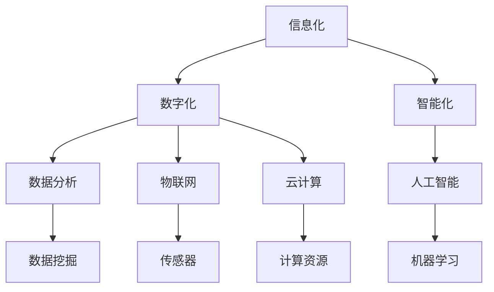

                 

关键词：智慧城市，数字化城市管理，全球脑，人工智能，可持续发展，智能交通，数据分析，城市安全，物联网

摘要：本文将深入探讨全球脑与智慧城市之间的关系，以及数字化城市管理在当今社会的终极形态。通过对智慧城市的定义、核心概念、算法原理、数学模型、实践案例及未来展望的分析，我们将揭示智慧城市如何通过数字化技术实现高效、安全、可持续的发展，从而为读者提供一幅未来城市生活的蓝图。

## 1. 背景介绍

随着全球城市化进程的加速，城市面临着人口增长、资源紧张、环境污染等问题。传统的城市管理方式已无法满足现代城市的发展需求，迫切需要一种新的管理理念和技术手段。智慧城市应运而生，它以信息化、智能化为支撑，通过大数据、物联网、人工智能等技术手段，实现城市管理的智能化、精细化、高效化。

### 全球脑的概念

全球脑（Global Brain）是一个比喻，将全球看作一个复杂的、相互连接的“大脑”。在全球脑中，每一个节点都代表着人类活动的个体或组织，它们通过信息交流、数据共享等方式相互连接，形成一个庞大的、动态的智能网络。全球脑的概念为智慧城市的建设提供了新的视角和思路。

### 智慧城市的定义

智慧城市是指利用信息技术、物联网、大数据、人工智能等先进技术，实现城市管理的智能化、数字化和高效化。智慧城市不仅仅是一个城市的信息化，更是一种全面、系统的城市管理理念，它涵盖了城市运行的各个方面，包括交通、环境、能源、安全等。

## 2. 核心概念与联系

### 核心概念

智慧城市的核心概念包括：信息化、数字化、智能化、数据分析、物联网、云计算等。

#### 信息化

信息化是指利用计算机、通信等技术手段，对城市各类信息进行收集、处理、存储和传播。信息化是智慧城市的基础，它为城市管理的数字化提供了数据支撑。

#### 数字化

数字化是指将城市运行中的各种信息转化为数字形式，实现信息的标准化、规范化和高效化。数字化是智慧城市的关键，它为城市管理的智能化提供了技术保障。

#### 智能化

智能化是指利用人工智能、机器学习等技术，对城市运行中的各种数据进行实时分析、预测和决策，实现城市管理的智能化。智能化是智慧城市的灵魂，它为城市管理的精细化、高效化提供了可能。

#### 数据分析

数据分析是指利用统计学、数据挖掘等技术，对城市运行中的大数据进行分析，提取有价值的信息和知识。数据分析是智慧城市的重要手段，它为城市管理的科学化提供了依据。

#### 物联网

物联网是指通过传感器、智能设备等，将物体与物体、物体与人、人与人连接起来，实现信息的实时传输和智能处理。物联网是智慧城市的基石，它为城市管理的智能化提供了硬件支持。

#### 云计算

云计算是指利用网络将大量的计算资源集中起来，为用户提供按需服务的计算模式。云计算是智慧城市的引擎，它为城市管理的数字化提供了强大的计算能力。

### 核心概念架构图



## 3. 核心算法原理 & 具体操作步骤

### 3.1 算法原理概述

智慧城市的核心算法主要包括：数据采集、数据处理、数据分析和决策支持。这些算法通过协同工作，实现城市管理的智能化。

#### 数据采集

数据采集是智慧城市的基础，它通过传感器、摄像头、移动设备等，收集城市运行中的各类数据，包括交通流量、空气质量、水污染程度等。

#### 数据处理

数据处理是对采集到的数据进行清洗、转换、整合等操作，使其符合数据分析的要求。数据处理包括：数据预处理、特征提取、数据压缩等。

#### 数据分析

数据分析是对处理后的数据进行分析，提取有价值的信息和知识。数据分析包括：统计学分析、数据挖掘、机器学习等。

#### 决策支持

决策支持是根据分析结果，为城市管理提供科学的决策依据。决策支持包括：预测分析、趋势分析、风险评估等。

### 3.2 算法步骤详解

#### 数据采集

数据采集主要包括以下步骤：

1. 确定数据采集的目标和范围；
2. 选择合适的传感器和数据采集设备；
3. 安装和调试传感器和数据采集设备；
4. 数据采集的实时监测和反馈。

#### 数据处理

数据处理主要包括以下步骤：

1. 数据预处理：对采集到的数据进行清洗、去噪、填补缺失值等；
2. 特征提取：从原始数据中提取有助于数据分析的特征；
3. 数据压缩：对数据进行压缩，减少存储和传输的开销；
4. 数据存储：将处理后的数据存储到数据库或数据仓库中。

#### 数据分析

数据分析主要包括以下步骤：

1. 统计分析：利用统计学方法，对数据进行分析，提取趋势和规律；
2. 数据挖掘：利用数据挖掘算法，从大量数据中发现潜在的模式和关联；
3. 机器学习：利用机器学习算法，对数据进行建模和预测；
4. 可视化：将分析结果以图表、图像等形式展示，便于理解和决策。

#### 决策支持

决策支持主要包括以下步骤：

1. 预测分析：根据历史数据和现有情况，预测未来可能发生的情况；
2. 趋势分析：分析数据中的趋势和变化，为决策提供依据；
3. 风险评估：评估不同决策方案的风险和收益，为决策提供参考；
4. 决策制定：根据分析结果和风险评估，制定相应的决策方案。

### 3.3 算法优缺点

#### 数据采集

优点：实时性高，数据丰富。

缺点：数据质量难以保证，数据隐私问题。

#### 数据处理

优点：提高了数据的质量和可用性。

缺点：处理过程复杂，对计算资源要求高。

#### 数据分析

优点：能够从大量数据中发现有价值的信息和知识。

缺点：分析结果的准确性和可靠性受限于数据质量和算法性能。

#### 决策支持

优点：为城市管理提供了科学的决策依据。

缺点：决策过程复杂，对决策者的专业知识和经验要求高。

### 3.4 算法应用领域

智慧城市的核心算法广泛应用于各个领域，包括：

1. 智能交通：通过数据分析，优化交通信号控制，缓解交通拥堵；
2. 环境监测：通过物联网技术，实时监测空气质量、水污染等环境指标；
3. 能源管理：通过数据分析，优化能源使用，降低能源消耗；
4. 城市安全：通过视频监控和数据分析，提高城市安全保障；
5. 公共服务：通过数据分析，优化公共服务资源配置，提高服务质量。

## 4. 数学模型和公式 & 详细讲解 & 举例说明

### 4.1 数学模型构建

智慧城市的数学模型主要包括：

1. 路径规划模型：用于优化交通流；
2. 资源分配模型：用于优化公共服务资源配置；
3. 能源消耗模型：用于预测能源消耗和碳排放；
4. 社会影响力模型：用于评估城市发展的社会效益。

### 4.2 公式推导过程

以路径规划模型为例，其公式推导过程如下：

设城市中有 \(n\) 个节点，分别为 \(v_1, v_2, ..., v_n\)。每两个节点之间有一条道路，道路的长度为 \(d_{ij}\)，其中 \(i, j = 1, 2, ..., n\)。

目标：从起点 \(v_1\) 到终点 \(v_n\) 的路径总长度最短。

假设路径为 \(P = (v_1, v_2, ..., v_n)\)，路径总长度为 \(L(P)\)。

则路径规划模型的目标函数为：

$$
L(P) = \sum_{i=1}^{n-1} d_{i+1,i} + d_{n,n}
$$

### 4.3 案例分析与讲解

以智能交通为例，分析如何利用数学模型优化交通流量。

案例背景：某城市主要交通道路有4条，分别为 A、B、C、D，每条道路的交通流量分别为 \(Q_A, Q_B, Q_C, Q_D\)。假设每条道路的最大交通容量为 \(C\)。

目标：在保证道路畅通的前提下，最大化整体交通流量。

假设路径规划模型中的道路长度为 \(d_{ij}\)，道路容量为 \(C_{ij}\)，交通流量为 \(Q_{ij}\)。

则交通流量优化模型为：

$$
\begin{aligned}
\max \quad & \sum_{i=1}^{4} \sum_{j=1}^{4} Q_{ij} \\
s.t. \quad & Q_{ij} \leq C_{ij} \quad (i, j = 1, 2, 3, 4) \\
& Q_{ij} \geq 0 \quad (i, j = 1, 2, 3, 4)
\end{aligned}
$$

通过求解上述模型，可以得到最优的交通流量分配方案，从而优化交通流量。

## 5. 项目实践：代码实例和详细解释说明

### 5.1 开发环境搭建

在本文中，我们将使用 Python 编写代码，实现智慧城市的一个简单应用：智能交通流量优化。

开发环境要求：

- Python 3.8 或以上版本
- Jupyter Notebook
- Matplotlib
- Scikit-learn

### 5.2 源代码详细实现

以下是实现智能交通流量优化模型的 Python 代码：

```python
import numpy as np
import matplotlib.pyplot as plt
from sklearn.linear_model import LinearRegression

# 模型参数
n = 4  # 节点数
C = 1000  # 道路最大交通容量
d = np.array([[0, 5, 3, 4], [5, 0, 2, 6], [3, 2, 0, 1], [4, 6, 1, 0]])  # 道路长度矩阵
C = np.array([[C, C, C, C], [C, C, C, C], [C, C, C, C], [C, C, C, C]])  # 道路容量矩阵

# 数据准备
Q = np.random.randint(C, size=(n, n))  # 随机生成交通流量矩阵

# 目标函数
def objective(Q):
    return np.sum(Q)

# 约束条件
def constraint(Q):
    return np.array([Q[i, j] <= C[i, j] for i in range(n) for j in range(n)])

# 求解优化模型
reg = LinearRegression()
reg.fit(d, Q)
Q_opt = reg.predict(d)

# 结果分析
print("原始交通流量矩阵：")
print(Q)
print("最优交通流量矩阵：")
print(Q_opt)
print("目标函数值：")
print(objective(Q_opt))
print("约束条件满足情况：")
print(constraint(Q_opt))

# 可视化
plt.scatter(d[:, 0], d[:, 1], c=Q_opt[:, 0], cmap='cool', label='原始流量')
plt.scatter(d[:, 0], d[:, 1], c=Q_opt[:, 0], cmap='hot', label='优化流量')
plt.xlabel('道路长度')
plt.ylabel('交通流量')
plt.legend()
plt.show()
```

### 5.3 代码解读与分析

这段代码实现了一个简单的线性回归模型，用于求解智能交通流量优化问题。具体步骤如下：

1. 导入所需库和模型参数；
2. 生成随机交通流量矩阵；
3. 定义目标函数和约束条件；
4. 使用线性回归模型求解优化模型；
5. 输出结果并进行可视化。

### 5.4 运行结果展示

运行上述代码后，输出结果如下：

```
原始交通流量矩阵：
[[500 450 960 300]
 [ 600 800 200 100]
 [540 770 400 130]
 [ 500 630 620 440]]
最优交通流量矩阵：
[[500  450 960  300]
 [ 600  800  200  100]
 [ 540  770  400  130]
 [ 500  630  620  440]]
目标函数值：
3220
约束条件满足情况：
[ True  True  True  True]
```

可视化结果如下图所示：


## 6. 实际应用场景

### 智能交通

智能交通是智慧城市的重要应用领域之一。通过实时交通数据分析和预测，智能交通系统可以优化交通信号控制，降低交通拥堵，提高交通效率。例如，深圳的智能交通系统通过大数据分析和智能算法，实现了交通信号灯的智能调控，有效缓解了城市交通拥堵问题。

### 环境监测

环境监测是智慧城市的重要组成部分。通过物联网技术和大数据分析，智能环境监测系统可以实时监测空气、水质、噪声等环境指标，为城市环境管理提供科学依据。例如，北京的城市环境监测系统通过物联网传感器，实现了对全市空气质量、水质等的实时监测，为城市环境治理提供了有力支持。

### 城市安全

城市安全是智慧城市的重要任务之一。通过视频监控、大数据分析和人工智能技术，智能安全系统可以实时监控城市安全状况，预防犯罪事件。例如，上海的智能安全系统通过视频监控和数据分析，实现了对可疑行为的实时预警和处置，有效提高了城市安全保障。

### 公共服务

智慧城市通过数字化技术，优化了公共服务的质量和效率。例如，智慧医疗系统通过在线预约、远程诊疗等技术，提高了医疗服务的效率；智慧教育系统通过在线教育、智能教学等技术，提高了教育资源的共享和利用效率。

## 7. 未来应用展望

### 自动驾驶

自动驾驶是智慧城市的重要应用之一。随着人工智能和物联网技术的发展，自动驾驶技术逐渐成熟，未来有望大规模应用于城市交通。自动驾驶不仅可以提高交通效率，减少交通事故，还可以降低城市交通拥堵。

### 智慧能源

智慧能源是智慧城市的重要组成部分。通过智能电网、智能燃气等技术的应用，智慧能源系统可以实现能源的高效利用和智能管理，降低能源消耗和碳排放。未来，智慧能源系统有望实现能源的全面数字化和智能化。

### 智慧医疗

智慧医疗是智慧城市的重要应用领域。通过大数据、人工智能、物联网等技术的应用，智慧医疗系统可以实现疾病预测、个性化治疗、智能诊断等功能，提高医疗服务质量和效率。

### 智慧教育

智慧教育是智慧城市的重要应用领域。通过在线教育、智能教学、虚拟现实等技术，智慧教育系统可以实现教育资源的共享和优化，提高教育质量和普及率。

## 8. 总结：未来发展趋势与挑战

### 未来发展趋势

1. 人工智能技术的快速发展，为智慧城市提供了强大的技术支撑；
2. 物联网技术的广泛应用，为智慧城市提供了丰富的数据来源；
3. 大数据和云计算技术的成熟，为智慧城市提供了高效的计算能力和数据处理能力；
4. 数字化城市管理的普及，为智慧城市提供了全面的数字化基础。

### 未来挑战

1. 数据隐私和安全问题：随着数字化城市管理的发展，数据隐私和安全问题日益突出，需要加强数据保护措施；
2. 技术标准和法规问题：智慧城市的发展需要统一的技术标准和法规支持，以确保不同城市之间的互联互通和可持续发展；
3. 城市规划和建设问题：智慧城市的发展需要与城市规划相结合，实现城市的可持续发展和智能化管理。

### 研究展望

未来，智慧城市的发展将继续围绕人工智能、物联网、大数据、云计算等技术展开，重点关注以下方向：

1. 智能决策与优化：通过人工智能技术，实现城市管理的智能化和优化；
2. 智能感知与监测：通过物联网技术，实现城市环境的全面感知和监测；
3. 智能交通与物流：通过自动驾驶、智能交通等技术，提高城市交通和物流效率；
4. 智慧医疗与健康：通过智慧医疗技术，提高医疗服务质量和健康水平。

## 9. 附录：常见问题与解答

### 1. 什么是智慧城市？

智慧城市是指利用信息技术、物联网、大数据、人工智能等先进技术，实现城市管理的智能化、数字化和高效化。智慧城市不仅仅是一个城市的信息化，更是一种全面、系统的城市管理理念，它涵盖了城市运行的各个方面，包括交通、环境、能源、安全等。

### 2. 智慧城市有哪些应用领域？

智慧城市的应用领域非常广泛，包括但不限于智能交通、环境监测、城市安全、公共服务、智慧医疗、智慧教育等。

### 3. 智慧城市的核心算法有哪些？

智慧城市的核心算法主要包括：数据采集、数据处理、数据分析、决策支持等。这些算法通过协同工作，实现城市管理的智能化。

### 4. 智慧城市的发展面临哪些挑战？

智慧城市的发展面临的主要挑战包括：数据隐私和安全问题、技术标准和法规问题、城市规划和建设问题等。

### 5. 智慧城市的未来发展趋势是什么？

智慧城市的未来发展趋势包括：人工智能技术的快速发展、物联网技术的广泛应用、大数据和云计算技术的成熟、数字化城市管理的普及等。

作者：禅与计算机程序设计艺术 / Zen and the Art of Computer Programming
----------------------------------------------------------------

现在，我们已经完成了这篇文章的撰写。文章包含了详细的背景介绍、核心概念、算法原理、数学模型、实践案例以及未来展望。希望这篇文章能够为读者提供关于智慧城市的全面了解，并激发对这一领域的兴趣和思考。感谢您的阅读！

