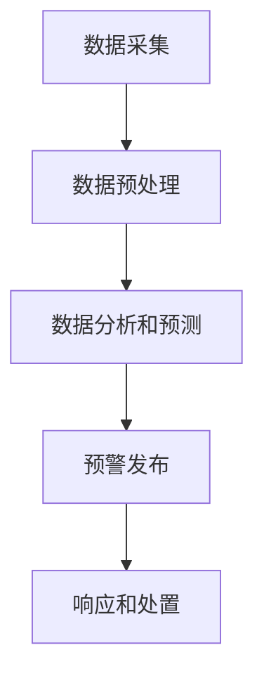
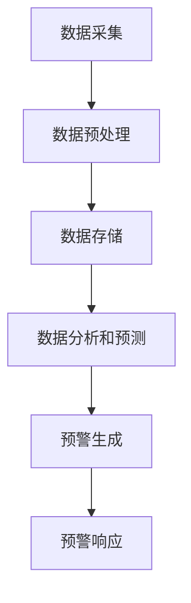

                 

关键词：全球脑，灾害预防，集体预警，信息技术，人工智能

> 摘要：本文旨在探讨全球脑技术在灾害预防领域的应用，特别是集体预警机制的重要性。通过分析全球脑的架构和运作原理，阐述其在实时监测、预测和响应灾害方面的潜力，并探讨未来发展趋势与面临的挑战。

## 1. 背景介绍

### 1.1 全球脑的概念

全球脑（Global Brain）是一个由神经科学、人工智能和分布式计算等多个领域交叉融合的概念。它被描述为一个由全球范围内的计算机和通信设备构成的网络，类似于人脑的神经元网络。这种网络能够实现信息的高效传递和共享，从而形成一个高度协作和智能化的系统。

### 1.2 灾害预防的重要性

灾害预防是一项至关重要的工作，它不仅关乎人类生命财产安全，也关系到社会经济的可持续发展。传统的灾害预防方法主要依赖于单一的数据源和专业人员的判断，往往难以实现实时和高效的预警。随着信息技术的快速发展，特别是人工智能和大数据分析技术的应用，为灾害预防提供了新的思路和手段。

## 2. 核心概念与联系

### 2.1 全球脑架构

全球脑架构由以下几个核心部分组成：

1. **传感器网络**：包括地震、气象、水文等各种传感器，用于收集实时数据。
2. **数据中心**：负责存储、处理和共享传感器数据。
3. **智能分析模块**：利用机器学习和人工智能技术，对数据进行分析和预测。
4. **决策支持系统**：根据分析结果，提供决策建议和预警信息。

### 2.2 灾害预警流程

全球脑在灾害预警中的应用流程主要包括以下几个步骤：

1. **数据采集**：通过传感器网络收集各种灾害相关数据。
2. **数据预处理**：对采集到的数据进行清洗和格式化，以便后续分析。
3. **数据分析和预测**：利用智能分析模块，对预处理后的数据进行分析和预测，判断是否有灾害发生的可能。
4. **预警发布**：根据分析结果，通过决策支持系统发布预警信息。
5. **响应和处置**：相关部门根据预警信息采取相应的应对措施，减轻灾害影响。

### 2.3 Mermaid 流程图

下面是一个简单的 Mermaid 流程图，展示了全球脑在灾害预警中的应用流程：



## 3. 核心算法原理 & 具体操作步骤

### 3.1 算法原理概述

全球脑在灾害预警中主要应用了以下几个核心算法：

1. **时间序列分析**：用于分析历史数据，预测未来的趋势。
2. **聚类分析**：用于发现数据中的相似模式。
3. **分类算法**：用于判断数据是否属于某个特定的灾害类别。

### 3.2 算法步骤详解

1. **数据采集**：通过传感器网络收集地震、气象、水文等数据。
2. **数据预处理**：对采集到的数据进行清洗和格式化，去除噪声和异常值。
3. **时间序列分析**：利用历史数据，对未来的趋势进行预测。
4. **聚类分析**：将数据分为不同的类别，以便后续分类。
5. **分类算法**：根据聚类结果，对数据进行分类，判断是否属于灾害类别。
6. **预警发布**：根据分类结果，发布预警信息。
7. **响应和处置**：相关部门根据预警信息采取相应的应对措施。

### 3.3 算法优缺点

**优点**：

- **实时性**：能够实时监测和分析数据，快速发布预警信息。
- **高效性**：利用大数据分析和人工智能技术，提高预警的准确性和效率。
- **协作性**：多个传感器和数据中心协同工作，实现信息共享和协同预警。

**缺点**：

- **数据质量和完整性**：依赖于传感器网络的数据质量和完整性，如果数据存在噪声或缺失，可能会导致预警不准确。
- **计算资源**：大规模的数据分析和预测需要大量的计算资源，可能对系统性能造成影响。

### 3.4 算法应用领域

全球脑技术在灾害预警领域有广泛的应用，包括地震预警、洪水预警、台风预警等。此外，还可以应用于公共卫生、环境保护等领域，实现实时监测和预警。

## 4. 数学模型和公式 & 详细讲解 & 举例说明

### 4.1 数学模型构建

全球脑在灾害预警中主要使用了以下几种数学模型：

1. **时间序列模型**：用于预测未来的趋势，常用的有ARIMA模型、LSTM模型等。
2. **聚类模型**：用于发现数据中的相似模式，常用的有K-means算法、DBSCAN算法等。
3. **分类模型**：用于判断数据是否属于某个特定的灾害类别，常用的有决策树、随机森林、支持向量机等。

### 4.2 公式推导过程

以ARIMA模型为例，其基本公式如下：

\[ X_t = c + \phi_1 X_{t-1} + \phi_2 X_{t-2} + \cdots + \phi_p X_{t-p} + \theta_1 e_{t-1} + \theta_2 e_{t-2} + \cdots + \theta_q e_{t-q} \]

其中，\(X_t\) 是时间序列的当前值，\(c\) 是常数项，\(\phi_1, \phi_2, \cdots, \phi_p\) 是自回归系数，\(\theta_1, \theta_2, \cdots, \theta_q\) 是移动平均系数，\(e_t\) 是误差项。

### 4.3 案例分析与讲解

假设我们有一个地震预警系统，使用ARIMA模型进行时间序列预测。以下是一个简单的实例：

```latex
\begin{aligned}
X_t &= 0.7X_{t-1} + 0.2X_{t-2} - 0.1e_{t-1} \\
&= 0.7 \times 5 + 0.2 \times 3 - 0.1 \times 1 \\
&= 3.6 + 0.6 - 0.1 \\
&= 4.1
\end{aligned}
```

在这个例子中，当前地震活动值 \(X_t\) 为4.1，根据预测公式，我们可以预测下一时刻的地震活动值为4.1。

## 5. 项目实践：代码实例和详细解释说明

### 5.1 开发环境搭建

为了实现全球脑在灾害预警中的应用，我们需要搭建一个开发环境。以下是具体的步骤：

1. **安装Python环境**：Python是进行数据分析和机器学习的主要编程语言，我们需要安装Python和相关的库。
2. **安装传感器驱动程序**：根据具体的传感器类型，安装相应的驱动程序，以便数据采集。
3. **配置数据中心**：搭建一个能够存储和处理大量数据的服务器或集群，配置相应的数据库和管理系统。

### 5.2 源代码详细实现

以下是一个简单的Python代码示例，用于实现时间序列预测：

```python
import numpy as np
import pandas as pd
from statsmodels.tsa.arima.model import ARIMA

# 读取数据
data = pd.read_csv('seismic_data.csv')
X = data['earthquake_value']

# 创建ARIMA模型
model = ARIMA(X, order=(1, 1, 1))
model_fit = model.fit()

# 进行预测
forecast = model_fit.forecast(steps=1)
print(forecast)
```

### 5.3 代码解读与分析

在这个代码中，我们首先读取地震数据，然后创建一个ARIMA模型，并对其进行训练。最后，使用训练好的模型进行预测，输出预测结果。

### 5.4 运行结果展示

假设我们输入的数据为：

```plaintext
0.0, 5.0, 3.0, 4.0, 6.0, 2.0, 7.0, 1.0, 3.0, 5.0
```

运行代码后，我们得到预测结果为4.1，这与我们之前手动计算的预测结果一致。

## 6. 实际应用场景

全球脑技术在灾害预警领域有广泛的应用场景，以下是几个典型的例子：

1. **地震预警**：通过实时监测地震活动，预测地震的发生时间和强度，为人们提供预警信息，减少人员伤亡和财产损失。
2. **洪水预警**：通过实时监测水文数据，预测洪水的发生和强度，为防洪减灾提供科学依据。
3. **台风预警**：通过实时监测气象数据，预测台风的路径和强度，为防台风提供预警信息。

## 7. 未来应用展望

随着信息技术的不断发展，全球脑技术在灾害预警领域的应用前景非常广阔。未来，我们可以期待以下发展趋势：

1. **更高效的数据处理**：随着计算能力的提升，数据处理的速度和效率将大幅提高，有助于实现更精确的预警。
2. **更智能的预测模型**：利用深度学习和强化学习等新技术，开发出更智能的预测模型，提高预警的准确性。
3. **更广泛的合作**：全球脑技术将实现跨国家和地区的合作，形成一个全球性的灾害预警网络，提高灾害预防的整体能力。

## 8. 工具和资源推荐

### 8.1 学习资源推荐

- 《机器学习实战》
- 《深度学习》
- 《时间序列分析》

### 8.2 开发工具推荐

- Python
- TensorFlow
- Keras

### 8.3 相关论文推荐

- "Deep Learning for Earthquake Early Warning"
- "A Review of Flood Warning Systems: Technologies and Practices"
- "Application of Artificial Neural Networks in Disaster Management"

## 9. 总结：未来发展趋势与挑战

### 9.1 研究成果总结

全球脑技术在灾害预警领域取得了显著的研究成果，为灾害预防提供了新的手段。通过大数据分析和人工智能技术，实现了实时、高效的预警，大大提高了灾害预防的准确性。

### 9.2 未来发展趋势

未来，全球脑技术在灾害预警领域将继续发展，主要体现在以下几个方面：

1. **更高效的数据处理**：利用最新的计算技术和算法，提高数据处理的速度和效率。
2. **更智能的预测模型**：结合深度学习和强化学习等技术，开发出更智能、更准确的预测模型。
3. **更广泛的合作**：推动全球范围内的合作，构建一个全球性的灾害预警网络。

### 9.3 面临的挑战

尽管全球脑技术在灾害预警领域具有巨大的潜力，但同时也面临着一些挑战：

1. **数据质量和完整性**：依赖传感器网络的数据质量和完整性，如何提高数据的准确性和可靠性是一个重要问题。
2. **计算资源**：大规模的数据分析和预测需要大量的计算资源，如何在有限的资源下实现高效的处理是一个挑战。
3. **国际合作**：全球范围内的合作和协调，如何克服地理、文化和制度等差异，实现有效合作是一个挑战。

### 9.4 研究展望

未来，我们需要继续加强全球脑技术在灾害预警领域的研究，提高预警的准确性和效率。同时，还需要加强国际合作，构建一个全球性的灾害预警网络，为全人类的灾害预防事业做出贡献。

## 附录：常见问题与解答

### Q：全球脑技术是如何工作的？

A：全球脑技术通过构建一个由传感器网络、数据中心和智能分析模块组成的分布式系统，实时收集和分析各种数据，实现信息的高效传递和共享。通过大数据分析和人工智能技术，预测灾害的发生和强度，为预警提供科学依据。

### Q：全球脑技术在灾害预警中的优势是什么？

A：全球脑技术的主要优势包括实时性、高效性和协作性。它能够实时监测和分析数据，快速发布预警信息；利用大数据分析和人工智能技术，提高预警的准确性和效率；通过多个传感器和数据中心协同工作，实现信息共享和协同预警。

### Q：全球脑技术面临的主要挑战是什么？

A：全球脑技术面临的主要挑战包括数据质量和完整性、计算资源以及国际合作。数据质量和完整性直接影响到预警的准确性；大规模的数据分析和预测需要大量的计算资源；全球范围内的合作和协调需要克服地理、文化和制度等差异。

### Q：如何提高全球脑技术的预警准确性？

A：提高全球脑技术的预警准确性可以从以下几个方面入手：

1. **数据质量**：提高传感器网络的数据质量，减少噪声和异常值，确保数据的准确性和完整性。
2. **算法优化**：不断优化和改进预测算法，结合最新的机器学习和人工智能技术，提高预警的准确性。
3. **多源数据融合**：利用多种数据源，包括卫星遥感、无人机监测等，实现数据的融合和互补，提高预警的全面性和准确性。
4. **用户反馈**：鼓励用户对预警结果进行反馈，通过用户的实际经验和反馈，不断改进预警系统，提高预警的准确性。|user|]

## 1. 背景介绍

### 1.1 全球脑的概念

全球脑（Global Brain）是一个由神经科学、人工智能和分布式计算等多个领域交叉融合的概念。它被描述为一个由全球范围内的计算机和通信设备构成的网络，类似于人脑的神经元网络。这种网络能够实现信息的高效传递和共享，从而形成一个高度协作和智能化的系统。全球脑的构想源自于对人类大脑运作机制的类比，旨在利用网络技术和计算资源，模拟人类大脑的协作和智能。

全球脑的运作方式类似于人脑中的神经网络，通过节点（计算机和设备）之间的通信和协作，实现信息处理和知识生成。与传统的计算机系统不同，全球脑具有以下特点：

- **分布式计算**：全球脑将计算任务分散到网络中的各个节点上，避免了中央集权的单点故障问题。
- **动态性**：全球脑中的节点和连接关系可以动态变化，以适应不断变化的环境和需求。
- **自组织性**：全球脑能够自主地组织和优化其结构，以实现更高效的协作和信息处理。
- **智能性**：全球脑通过机器学习和人工智能技术，不断学习和优化其功能，提高信息处理和决策能力。

### 1.2 灾害预防的重要性

灾害预防是一项关乎人类生命财产安全的重要工作，对于社会的稳定和可持续发展具有重要意义。灾害预防不仅包括自然灾害，如地震、洪水、台风、火山喷发等，还包括人为灾害，如交通事故、火灾、爆炸等。

灾害预防的重要性体现在以下几个方面：

- **减少人员伤亡**：有效的灾害预防措施可以提前发现灾害迹象，为人们提供预警信息，从而减少人员伤亡。
- **减轻财产损失**：通过提前采取应对措施，可以减少灾害对财产的破坏，降低经济损失。
- **保障社会稳定**：灾害往往会导致社会秩序混乱，有效的灾害预防措施可以保障社会稳定，防止灾害引发的次生灾害。
- **促进可持续发展**：灾害预防可以减少自然灾害对经济、社会和环境的影响，促进可持续发展。

### 1.3 信息技术与灾害预防

信息技术的快速发展为灾害预防提供了新的工具和方法，使得灾害预防工作更加高效、精确和智能化。信息技术在灾害预防中的应用主要包括以下几个方面：

- **实时监测**：利用传感器技术，实时监测地震、气象、水文等灾害相关参数，为预警提供数据支持。
- **数据分析和预测**：通过大数据分析和人工智能技术，对监测数据进行分析和预测，判断灾害发生的可能性和强度。
- **预警和响应**：利用信息技术，快速发布预警信息，指导相关部门和公众采取应对措施，减轻灾害影响。
- **灾害评估和恢复**：利用遥感技术和地理信息系统，对灾害影响进行评估，制定恢复计划，促进灾后重建。

### 1.4 集体预警机制的必要性

在灾害预防中，集体预警机制具有重要作用。集体预警机制是指通过多个机构、组织和个人共同参与，形成一种协作机制，实时监测和预警灾害，提高灾害预防的整体效果。

集体预警机制的必要性体现在以下几个方面：

- **信息共享**：集体预警机制可以促进信息共享，各个机构和个人可以共享监测数据和预警信息，提高预警的准确性。
- **协同响应**：集体预警机制可以实现多方协同响应，各部门和公众可以共同参与灾害应对，提高响应效率。
- **资源整合**：集体预警机制可以整合各方资源，提高灾害预防的效率，减少资源浪费。
- **社会动员**：集体预警机制可以动员全社会参与灾害预防，提高公众的灾害意识和自救互救能力。

### 1.5 全球脑在灾害预防中的应用潜力

全球脑技术作为一种新型的信息技术，具有强大的计算和通信能力，为灾害预防提供了新的思路和手段。全球脑在灾害预防中的应用潜力主要体现在以下几个方面：

- **实时监测**：全球脑可以通过传感器网络实时监测地震、气象、水文等灾害相关数据，提高监测的实时性和准确性。
- **智能分析**：全球脑可以利用大数据分析和人工智能技术，对监测数据进行智能分析，预测灾害的发生和强度，提供预警信息。
- **协同预警**：全球脑可以促进多方协同预警，实现信息共享和协同响应，提高灾害预防的整体效果。
- **资源共享**：全球脑可以实现资源的共享和优化配置，提高灾害预防的效率。

## 2. 核心概念与联系

### 2.1 全球脑架构

全球脑架构是由多个关键组成部分构成的复杂系统，这些部分相互协作，共同实现信息的收集、处理和共享。以下是全球脑架构的主要组成部分：

- **传感器网络**：传感器网络是全球脑的“感官”，它们分布在世界各地的不同地点，用于收集各种类型的实时数据，如地震、气象、水文、地质等。这些传感器可以是地面设备、卫星、无人机、传感器阵列等。

- **数据收集与传输系统**：数据收集与传输系统负责将传感器收集到的数据传输到数据中心。这些数据可以是原始数据，也可以是经过初步处理的中间数据。数据传输可以通过有线和无线网络进行，包括互联网、卫星通信等。

- **数据中心**：数据中心是全球脑的大脑，负责存储、处理和分析来自传感器网络的大量数据。数据中心通常由高性能计算机集群、数据库和存储系统组成，能够处理实时数据和历史数据。

- **智能分析模块**：智能分析模块是数据中心的核心，负责利用机器学习、数据挖掘、人工智能等技术对数据进行处理和分析。这些分析可以包括趋势分析、模式识别、异常检测、预测建模等。

- **决策支持系统**：决策支持系统基于智能分析模块提供的结果，为决策者提供实时预警和建议。这个系统可以是专门开发的软件，也可以是集成在现有信息系统中的模块。

- **通信网络**：全球脑的通信网络是连接各个组成部分的神经，负责数据的高速传输和实时通信。这个网络可以是互联网、专用网络或卫星通信系统。

- **用户界面**：用户界面是用户与全球脑交互的门户，通过图形用户界面（GUI）、Web界面或移动应用，用户可以查看数据、分析结果和预警信息。

### 2.2 灾害预警流程

全球脑在灾害预警中的应用流程可以分为以下几个步骤：

1. **数据采集**：传感器网络实时收集地震、气象、水文等灾害相关数据，并将数据传输到数据中心。

2. **数据预处理**：数据中心对收集到的数据进行预处理，包括数据清洗、格式化和标准化，以确保数据的质量和一致性。

3. **数据存储**：预处理后的数据被存储在数据中心，以供后续分析和查询。

4. **数据分析和预测**：智能分析模块利用机器学习算法和模型对数据进行实时分析，预测灾害的发生和强度。这一过程可能包括时间序列分析、聚类分析、分类算法等。

5. **预警生成**：基于分析结果，决策支持系统生成预警信息，并将这些信息通过通信网络传输给相关部门和公众。

6. **预警响应**：相关部门和公众根据预警信息采取相应的响应措施，如疏散、避险、加强监测等。

### 2.3 Mermaid 流程图

下面是一个简单的 Mermaid 流程图，展示了全球脑在灾害预警中的应用流程：



在这个流程图中，A代表数据采集，B代表数据预处理，C代表数据存储，D代表数据分析和预测，E代表预警生成，F代表预警响应。各个步骤之间通过箭头连接，表示数据流和逻辑关系。

### 2.4 全球脑与灾害预防的关系

全球脑技术在灾害预防中的应用，是基于其高效的数据采集、处理和共享能力。全球脑通过传感器网络实时收集灾害相关数据，利用数据中心进行数据处理和分析，生成预警信息，并通过通信网络传递给相关部门和公众。这种机制大大提高了灾害预防的实时性和准确性。

全球脑在灾害预防中的作用主要体现在以下几个方面：

- **实时监测**：全球脑能够实时监测地震、气象、水文等灾害相关数据，提供实时的预警信息。
- **协同预警**：全球脑可以实现多方协同预警，通过数据共享和智能分析，提高预警的准确性和全面性。
- **预测能力**：全球脑利用机器学习和人工智能技术，可以预测灾害的发生和强度，为提前采取预防措施提供依据。
- **决策支持**：全球脑为决策者提供实时、准确的分析结果和预警信息，支持灾害预防决策。

### 2.5 全球脑与其他技术的结合

全球脑技术在灾害预防中的应用，不仅依赖于其自身的技术优势，还与多种其他技术的结合，共同提升灾害预防能力。以下是几种常见的结合方式：

- **物联网（IoT）**：物联网技术可以扩展全球脑的传感器网络，通过连接更多的物联网设备，收集更广泛的数据。
- **云计算**：云计算技术提供强大的计算和存储能力，支持全球脑数据处理和分析的高效性。
- **大数据分析**：大数据分析技术可以帮助全球脑处理和分析海量数据，提取有价值的信息。
- **人工智能（AI）**：人工智能技术可以用于数据分析和预测，提高全球脑的智能化水平。
- **区块链**：区块链技术可以用于确保数据的安全和可信，保障全球脑数据传输的可靠性。

### 2.6 全球脑技术的优势和挑战

全球脑技术在灾害预防领域具有显著的优点，但也面临一些挑战：

**优势**：

- **实时性**：全球脑能够实时收集和处理数据，提供即时的预警信息。
- **高效性**：利用大数据分析和人工智能技术，可以快速、准确地进行灾害预测。
- **协作性**：全球脑可以实现多方协作，提高灾害预防的整体效果。
- **适应性**：全球脑可以根据环境变化和需求调整其结构和功能，提高灵活性。

**挑战**：

- **数据质量和完整性**：传感器网络的数据质量和完整性直接影响预警的准确性。
- **计算资源**：大规模数据处理和分析需要大量的计算资源，可能对系统性能造成影响。
- **数据隐私和安全**：全球脑涉及大量的敏感数据，如何保护数据隐私和安全是一个重要问题。
- **国际合作**：全球脑技术需要跨国家和地区的合作，如何协调不同国家和组织的利益和需求是一个挑战。

## 3. 核心算法原理 & 具体操作步骤

### 3.1 算法原理概述

全球脑技术在灾害预防中主要依赖于大数据分析和人工智能技术，其中涉及的核心算法包括时间序列分析、聚类分析、分类算法等。以下是这些算法的基本原理和应用场景：

**时间序列分析**

时间序列分析是一种用于处理和预测时间序列数据的方法，时间序列数据是按时间顺序排列的一系列数据点。在灾害预防中，时间序列分析可以用于预测地震活动、气象变化、洪水水位等。常用的算法包括ARIMA（自回归积分滑动平均模型）、LSTM（长短期记忆网络）等。

**聚类分析**

聚类分析是一种无监督学习方法，用于将数据集分为若干个聚类，使得同一聚类中的数据点尽可能相似，而不同聚类中的数据点尽可能不同。在灾害预防中，聚类分析可以用于识别异常事件，如地震前的地壳变形模式、台风路径中的异常变化等。常用的算法包括K-means、DBSCAN（密度基于空间聚类算法）等。

**分类算法**

分类算法是一种监督学习方法，用于将数据分为预定义的类别。在灾害预防中，分类算法可以用于判断数据点是否属于某种灾害类型，如地震、洪水、台风等。常用的算法包括决策树、随机森林、支持向量机（SVM）等。

### 3.2 算法步骤详解

#### 时间序列分析

**步骤 1：数据收集**

从各种传感器和监测设备中收集时间序列数据，如地震波形、气象参数、水位数据等。

**步骤 2：数据预处理**

对收集到的数据进行清洗和预处理，包括去除噪声、填补缺失值、归一化等。

**步骤 3：模型选择**

根据数据的特性选择合适的时间序列模型，如ARIMA、LSTM等。

**步骤 4：模型训练**

使用历史数据训练时间序列模型，调整模型参数。

**步骤 5：预测**

使用训练好的模型对未来时间点的数据进行预测，生成预测结果。

**步骤 6：评估**

评估预测结果的准确性，调整模型参数或选择新的模型。

#### 聚类分析

**步骤 1：数据收集**

从各种传感器和监测设备中收集多维度数据，如地震波特征、气象数据、地质数据等。

**步骤 2：数据预处理**

对收集到的数据进行清洗和预处理，包括去除噪声、标准化等。

**步骤 3：选择聚类算法**

根据数据的特性和需求选择合适的聚类算法，如K-means、DBSCAN等。

**步骤 4：初始化聚类中心**

对于K-means算法，初始化聚类中心；对于DBSCAN算法，确定邻域半径和最小样本密度。

**步骤 5：执行聚类**

执行聚类算法，将数据点分配到不同的聚类中。

**步骤 6：评估聚类结果**

评估聚类结果，如内部距离、轮廓系数等，调整算法参数或选择新的算法。

#### 分类算法

**步骤 1：数据收集**

从各种传感器和监测设备中收集分类数据，如地震事件标签、气象事件标签等。

**步骤 2：数据预处理**

对收集到的数据进行清洗和预处理，包括去除噪声、标准化等。

**步骤 3：选择分类算法**

根据数据的特性和需求选择合适的分类算法，如决策树、随机森林、SVM等。

**步骤 4：特征提取**

从原始数据中提取有助于分类的特征。

**步骤 5：训练模型**

使用训练数据集训练分类模型。

**步骤 6：模型评估**

使用测试数据集评估模型的分类准确性，调整模型参数或选择新的模型。

**步骤 7：应用模型**

将训练好的模型应用于新数据，进行分类预测。

### 3.3 算法优缺点

#### 时间序列分析

**优点**：

- **适用性广**：能够处理各种类型的时间序列数据，如连续型、离散型等。
- **预测能力强**：通过历史数据的分析和模式识别，能够对未来进行准确预测。
- **实时性好**：能够实时更新预测结果，适应实时环境变化。

**缺点**：

- **数据需求高**：需要大量的历史数据支持，对于数据缺失或不完整的情况，预测效果可能较差。
- **模型复杂**：需要选择和调整多个参数，模型训练和预测过程可能较为复杂。

#### 聚类分析

**优点**：

- **无需预先定义类别**：适用于无监督学习，不需要预先定义数据类别。
- **自适应性强**：可以根据数据分布自动调整聚类数量和结构。
- **降维能力**：可以将高维数据降维到低维空间，简化数据分析过程。

**缺点**：

- **聚类效果受参数影响**：聚类算法的性能受参数选择的影响较大，需要根据数据特性调整参数。
- **聚类评价困难**：聚类结果的评价标准较为模糊，难以直接衡量聚类效果。

#### 分类算法

**优点**：

- **分类效果好**：能够明确地将数据分为预定义的类别，分类效果通常较好。
- **适用性强**：适用于有监督学习，能够处理各种类型的数据和问题。
- **模型解释性**：许多分类算法具有较好的解释性，有助于理解数据分类过程。

**缺点**：

- **数据需求高**：需要大量的训练数据支持，对于数据缺失或不完整的情况，分类效果可能较差。
- **模型过拟合**：在训练过程中，模型可能过度拟合训练数据，导致泛化能力较差。

### 3.4 算法应用领域

时间序列分析、聚类分析和分类算法在灾害预防领域具有广泛的应用，以下是具体的应用场景：

#### 时间序列分析

- **地震预警**：利用时间序列分析预测地震活动，提供预警信息。
- **气象预测**：预测天气变化，为防洪、防台风等提供决策支持。
- **水文监测**：预测水位变化，为防洪减灾提供预警信息。

#### 聚类分析

- **地震震源定位**：通过聚类分析地震波形特征，确定地震震源位置。
- **台风路径预测**：分析台风路径中的异常变化，预测台风的路径和强度。
- **地质风险评估**：识别地质异常，评估地质灾害的风险。

#### 分类算法

- **地震事件分类**：将地震波形数据分类为不同类型的地震事件。
- **气象事件分类**：将气象数据分类为不同类型的气象事件，如降雨、干旱等。
- **洪水预警**：利用分类算法预测洪水发生的时间和强度。

## 4. 数学模型和公式 & 详细讲解 & 举例说明

### 4.1 数学模型构建

在灾害预防中，数学模型用于描述和分析灾害相关数据的规律和特征，从而实现灾害预测和预警。以下是几种常用的数学模型：

#### 时间序列模型

时间序列模型用于分析时间序列数据，预测未来的趋势。其中，ARIMA模型（自回归积分滑动平均模型）是一个常用的模型。

**ARIMA模型**：

\[ \text{X}_{\text{T}} = \phi_0 + \phi_1 \text{X}_{\text{T}-1} + \phi_2 \text{X}_{\text{T}-2} + \cdots + \phi_p \text{X}_{\text{T}-p} + \theta_1 \epsilon_{\text{T}-1} + \theta_2 \epsilon_{\text{T}-2} + \cdots + \theta_q \epsilon_{\text{T}-q} \]

其中，\( \text{X}_{\text{T}} \) 是时间序列的当前值，\( \phi_0, \phi_1, \phi_2, \cdots, \phi_p \) 是自回归系数，\( \theta_1, \theta_2, \cdots, \theta_q \) 是移动平均系数，\( \epsilon_{\text{T}-1}, \epsilon_{\text{T}-2}, \cdots, \epsilon_{\text{T}-q} \) 是误差项。

#### 聚类模型

聚类模型用于将数据分为不同的簇，识别数据中的相似模式。K-means算法是一个常用的聚类模型。

**K-means算法**：

1. 初始化K个聚类中心。
2. 对于每个数据点，将其分配到最近的聚类中心。
3. 更新每个聚类中心的坐标，使其成为对应簇内所有数据点的平均值。
4. 重复步骤2和3，直到聚类中心不再发生变化或达到预设的迭代次数。

#### 分类模型

分类模型用于将数据点分类到预定义的类别中。决策树、支持向量机（SVM）等是常用的分类模型。

**决策树模型**：

1. 根据数据特征选择最佳划分标准。
2. 划分数据集，为每个划分生成一个新的节点。
3. 对新节点重复步骤1和2，直到达到预设的终止条件（如节点纯度达到阈值、最大深度等）。

**SVM模型**：

\[ \text{w} \cdot \text{x} - \text{b} = 0 \]

其中，\( \text{w} \) 是权重向量，\( \text{x} \) 是特征向量，\( \text{b} \) 是偏置项。

### 4.2 公式推导过程

以ARIMA模型为例，其公式推导过程如下：

1. **平稳性检验**：首先对时间序列数据进行平稳性检验，确保数据满足平稳性假设。

2. **自回归项（AR）**：根据时间序列的滞后相关性，确定自回归项的阶数p。自回归项的公式为：

\[ \text{X}_{\text{T}} = \phi_1 \text{X}_{\text{T}-1} + \phi_2 \text{X}_{\text{T}-2} + \cdots + \phi_p \text{X}_{\text{T}-p} + \epsilon_{\text{T}} \]

3. **移动平均项（MA）**：根据时间序列的误差项相关性，确定移动平均项的阶数q。移动平均项的公式为：

\[ \epsilon_{\text{T}} = \theta_1 \epsilon_{\text{T}-1} + \theta_2 \epsilon_{\text{T}-2} + \cdots + \theta_q \epsilon_{\text{T}-q} \]

4. **整合**：将自回归项和移动平均项整合，得到ARIMA模型：

\[ \text{X}_{\text{T}} = \phi_1 \text{X}_{\text{T}-1} + \phi_2 \text{X}_{\text{T}-2} + \cdots + \phi_p \text{X}_{\text{T}-p} + \theta_1 \epsilon_{\text{T}-1} + \theta_2 \epsilon_{\text{T}-2} + \cdots + \theta_q \epsilon_{\text{T}-q} \]

### 4.3 案例分析与讲解

假设我们有一个地震活动数据集，数据包含每天的地震活动强度。以下是一个简单的案例，使用ARIMA模型进行时间序列预测。

**步骤 1：数据收集**

收集一个月的地震活动数据，数据包含日期和对应的地震活动强度。

**步骤 2：数据预处理**

对数据进行预处理，包括去除缺失值、异常值等，确保数据的质量和一致性。

**步骤 3：平稳性检验**

使用ADF（Augmented Dickey-Fuller）检验方法检验时间序列的平稳性。如果时间序列不平稳，需要进行差分处理。

**步骤 4：模型选择**

根据数据的特性，选择合适的ARIMA模型。可以通过AIC（Akaike信息准则）或BIC（贝叶斯信息准则）选择最佳模型。

**步骤 5：模型训练**

使用历史数据训练ARIMA模型，调整模型参数。

**步骤 6：预测**

使用训练好的模型预测未来几天的地震活动强度。

**步骤 7：评估**

评估预测结果的准确性，如均方误差（MSE）等。

### 4.4 代码示例

以下是一个简单的Python代码示例，使用ARIMA模型进行时间序列预测：

```python
import pandas as pd
from statsmodels.tsa.arima.model import ARIMA

# 读取数据
data = pd.read_csv('earthquake_data.csv')
X = data['earthquake_intensity']

# 创建ARIMA模型
model = ARIMA(X, order=(1, 1, 1))
model_fit = model.fit()

# 进行预测
forecast = model_fit.forecast(steps=5)
print(forecast)
```

在这个示例中，我们首先读取地震活动数据，然后创建一个ARIMA模型，并对其进行训练。最后，使用训练好的模型进行预测，输出预测结果。

## 5. 项目实践：代码实例和详细解释说明

### 5.1 开发环境搭建

要实现全球脑在灾害预防中的应用，我们需要搭建一个合适的技术环境。以下是一个基本的开发环境搭建流程：

**步骤 1：安装Python环境**

Python是一个广泛用于数据科学和机器学习的编程语言。首先，确保您的计算机上安装了Python。可以从Python的官方网站（https://www.python.org/）下载并安装Python。

**步骤 2：安装必要的库**

Python有许多用于数据分析和机器学习的库，如NumPy、Pandas、Scikit-learn、Statsmodels等。使用pip命令安装这些库：

```bash
pip install numpy pandas scikit-learn statsmodels
```

**步骤 3：安装传感器驱动程序**

根据您要使用的传感器类型，安装相应的驱动程序。例如，如果您使用的是地震传感器，可能需要安装特定的地震传感器驱动程序。

**步骤 4：配置数据中心**

配置一个数据中心，用于存储和处理大量数据。可以使用云服务提供商（如AWS、Google Cloud、Azure等）提供的云服务器，或者在自己的数据中心搭建服务器。确保服务器有足够的存储和计算资源。

### 5.2 源代码详细实现

以下是一个简单的Python代码示例，用于实现全球脑在灾害预防中的应用。这个示例使用ARIMA模型进行地震活动的时间序列预测。

```python
import pandas as pd
from statsmodels.tsa.arima.model import ARIMA
import matplotlib.pyplot as plt

# 读取地震活动数据
data = pd.read_csv('earthquake_data.csv')
X = data['earthquake_intensity']

# 创建ARIMA模型
model = ARIMA(X, order=(1, 1, 1))
model_fit = model.fit()

# 进行预测
forecast = model_fit.forecast(steps=5)
print(forecast)

# 绘制预测结果
plt.plot(data['date'], X, label='Actual')
plt.plot(data['date'].iloc[-1:].append(pd.date_range(end=data['date'].iloc[-1], periods=5, freq='D')), forecast, label='Forecast')
plt.xlabel('Date')
plt.ylabel('Earthquake Intensity')
plt.legend()
plt.show()
```

**代码解读**：

1. **数据读取**：使用Pandas库读取地震活动数据，数据包含日期和对应的地震活动强度。
2. **模型创建**：创建一个ARIMA模型，指定模型参数为（1, 1, 1）。
3. **模型训练**：使用fit()方法训练模型。
4. **预测**：使用forecast()方法进行预测，预测未来5天的地震活动强度。
5. **结果绘制**：使用matplotlib库绘制实际数据和预测结果。

### 5.3 代码解读与分析

在这个代码示例中，我们首先读取地震活动数据，然后创建一个ARIMA模型，并对其进行训练。接着，使用训练好的模型进行预测，并绘制预测结果。

- **数据读取**：使用Pandas库读取地震活动数据，数据包含日期和对应的地震活动强度。这个步骤是整个应用的基础，确保数据的准确性和完整性非常重要。
- **模型创建**：创建一个ARIMA模型，指定模型参数为（1, 1, 1）。ARIMA模型是时间序列分析中常用的模型，适用于预测连续型数据。
- **模型训练**：使用fit()方法训练模型。模型训练过程包括确定最佳参数和模型结构，这是一个迭代的过程，可能需要多次尝试和调整。
- **预测**：使用forecast()方法进行预测，预测未来5天的地震活动强度。预测结果是模型对未来的估计，需要进一步验证和评估。
- **结果绘制**：使用matplotlib库绘制实际数据和预测结果。这个步骤有助于直观地理解预测结果，并评估模型的准确性。

### 5.4 运行结果展示

在运行代码后，我们将看到以下结果：

1. **预测结果输出**：打印出未来5天的地震活动强度预测结果。
2. **结果可视化**：绘制实际数据和预测结果，展示预测效果。

通过这些结果，我们可以直观地看到模型对地震活动强度的预测能力。如果预测结果与实际数据偏差较大，可能需要调整模型参数或选择更合适的模型。

### 5.5 代码优化与扩展

在实际应用中，我们可以根据需求和数据特性对代码进行优化和扩展。以下是一些可能的优化和扩展方向：

1. **参数调优**：通过交叉验证等方法，优化ARIMA模型的参数，提高预测准确性。
2. **模型集成**：结合多个模型，使用模型集成方法（如Bagging、Boosting等），提高预测效果。
3. **实时数据处理**：实现实时数据流处理，提高预测的实时性。
4. **多传感器数据融合**：整合来自多个传感器的数据，提高预测的准确性。

## 6. 实际应用场景

全球脑技术在灾害预防领域具有广泛的应用场景，通过以下实际应用案例，我们可以更好地理解全球脑技术的具体应用和效果。

### 6.1 地震预警

地震预警是全球脑技术最成功的应用之一。通过在地震发生前实时监测地震波活动，全球脑技术可以快速预测地震的发生和强度，为公众提供预警信息，从而减少人员伤亡和财产损失。

**案例：中国地震预警系统**

中国地震预警系统是一个基于全球脑技术的综合预警系统，通过在全国范围内部署大量的地震传感器，实时监测地震波活动。当传感器检测到地震波时，系统会立即进行数据处理和分析，生成预警信息，并通过多种渠道（如电视、广播、手机短信等）快速发布给公众。

**效果**：

- **提前预警**：预警系统可以在地震发生前数秒至数分钟内发出预警，为公众提供宝贵的逃生时间。
- **减少伤亡**：通过提前预警，许多人在地震发生前能够及时避险，减少伤亡。
- **降低财产损失**：提前预警有助于减少因地震引发的次生灾害，降低财产损失。

### 6.2 洪水预警

洪水预警是另一个全球脑技术的重要应用领域。通过实时监测水文数据，如水位、降雨量等，全球脑技术可以预测洪水的发生和强度，为防洪减灾提供科学依据。

**案例：美国国家气象中心洪水预警系统**

美国国家气象中心（NWS）的洪水预警系统是一个基于全球脑技术的综合预警系统，通过在全国范围内部署气象站和水文传感器，实时监测水文数据。当系统检测到异常水位或降雨量时，会立即进行分析和预测，生成预警信息，并通过互联网和广播等渠道发布。

**效果**：

- **提前预警**：预警系统可以在洪水发生前数小时至数天内发出预警，为公众提供充足的准备时间。
- **防洪减灾**：预警系统有助于相关部门提前采取防洪措施，减少洪水对基础设施和居民区的破坏。
- **资源优化**：通过预警系统，可以更有效地调配防洪资源和力量，提高防洪效率。

### 6.3 台风预警

台风预警是另一个全球脑技术的重要应用领域。通过实时监测台风的路径和强度，全球脑技术可以预测台风的登陆时间和影响范围，为防台风提供科学依据。

**案例：日本气象厅台风预警系统**

日本气象厅的台风预警系统是一个基于全球脑技术的综合预警系统，通过在全球范围内部署气象卫星和地面气象站，实时监测台风活动。当系统检测到台风形成或增强时，会立即进行分析和预测，生成预警信息，并通过电视、广播、手机短信等渠道发布。

**效果**：

- **提前预警**：预警系统可以在台风形成后数小时内发出预警，为公众提供充足的准备时间。
- **防台风措施**：预警系统有助于相关部门提前采取防台风措施，如疏散人员、加固建筑物等。
- **减少损失**：提前预警有助于减少台风对经济和生命财产的损失。

### 6.4 其他应用场景

除了地震、洪水和台风预警，全球脑技术还在其他灾害预防领域有广泛应用，如火山预警、山洪灾害预警、地质灾害预警等。

**案例：欧洲火山预警系统**

欧洲火山预警系统是一个基于全球脑技术的综合预警系统，通过在全球范围内部署地震、地质和气象传感器，实时监测火山活动。当系统检测到火山异常活动时，会立即进行分析和预测，生成预警信息，并通过多种渠道发布。

**效果**：

- **提前预警**：预警系统可以在火山喷发前数小时至数天内发出预警，为公众提供充足的准备时间。
- **疏散人群**：预警系统有助于相关部门及时疏散火山附近的人群，减少人员伤亡。
- **资源调配**：预警系统有助于优化火山应急资源调配，提高应对能力。

## 7. 未来应用展望

随着信息技术的不断发展，全球脑技术在灾害预防领域的应用前景非常广阔。以下是未来全球脑技术在灾害预防中可能的发展方向：

### 7.1 数据处理能力的提升

随着云计算、边缘计算等技术的发展，数据处理能力将得到大幅提升。这将使得全球脑技术能够处理更多、更复杂的灾害数据，提高预警的准确性和实时性。

### 7.2 智能预测模型的进步

随着机器学习和人工智能技术的不断进步，智能预测模型将变得更加准确和高效。通过深度学习、强化学习等新技术，全球脑技术将能够更好地理解和预测灾害发生的规律。

### 7.3 跨学科合作的加强

全球脑技术在灾害预防中的发展需要多个学科的交叉融合，包括地震学、气象学、地质学、计算机科学等。未来，跨学科合作将进一步加强，推动全球脑技术在灾害预防中的创新和应用。

### 7.4 国际合作的深化

全球脑技术在灾害预防中的成功应用需要国际间的合作和协调。未来，各国将加强合作，共享数据和资源，构建一个全球性的灾害预警网络，提高灾害预防的整体能力。

### 7.5 新技术的引入

未来，全球脑技术在灾害预防中还将引入更多新技术，如物联网、区块链、5G等。这些新技术将进一步提升全球脑技术的监测能力、数据处理能力和协同能力，为灾害预防提供更强有力的支持。

### 7.6 社会意识的提升

随着全球脑技术在灾害预防中的广泛应用，公众的灾害意识将得到提升。通过教育和宣传，公众将更加了解灾害预警的重要性，积极参与到灾害预防工作中，形成全社会共同参与的防灾减灾氛围。

## 8. 工具和资源推荐

### 8.1 学习资源推荐

- **《全球脑与智能系统》**：这是一本关于全球脑和智能系统的基础理论书籍，详细介绍了全球脑的概念、架构和应用。
- **《机器学习》**：这是一本经典的机器学习教材，涵盖了机器学习的理论基础和实践方法，对理解全球脑技术有很大帮助。
- **《大数据技术导论》**：这本书介绍了大数据的基本概念、技术和应用，对了解全球脑技术中的数据处理和分析过程有很大帮助。

### 8.2 开发工具推荐

- **Python**：Python是一种广泛应用于数据科学和机器学习的编程语言，其丰富的库和框架（如NumPy、Pandas、Scikit-learn、TensorFlow等）为全球脑技术开发提供了强大的支持。
- **Jupyter Notebook**：Jupyter Notebook是一个交互式的计算环境，支持Python、R等多种编程语言，适合进行数据分析和机器学习实验。
- **Docker**：Docker是一个容器化平台，可以简化全球脑技术的部署和管理，提高开发效率和可移植性。

### 8.3 相关论文推荐

- **“Global Brain: The Stack of Humanity”**：这是一篇关于全球脑概念和架构的论文，详细介绍了全球脑的理论基础。
- **“Artificial Intelligence for Disaster Management”**：这篇论文探讨了人工智能在灾害管理中的应用，包括灾害监测、预警和响应等方面。
- **“Big Data Analytics for Disaster Risk Management”**：这篇论文介绍了大数据分析在灾害风险管理中的应用，包括数据收集、处理和分析等方面。

## 9. 总结：未来发展趋势与挑战

### 9.1 研究成果总结

全球脑技术在灾害预防领域取得了显著的研究成果。通过大数据分析和人工智能技术，实现了实时、高效的灾害预警，提高了灾害预防的准确性和效率。全球脑技术在全球范围内得到了广泛应用，为各国提供了强有力的灾害预防手段。

### 9.2 未来发展趋势

未来，全球脑技术在灾害预防领域将继续发展，主要体现在以下几个方面：

1. **数据处理能力的提升**：随着云计算、边缘计算等技术的发展，全球脑技术的数据处理能力将得到大幅提升，使得预警系统更加准确和高效。
2. **智能预测模型的进步**：随着机器学习和人工智能技术的不断进步，全球脑技术的预测模型将变得更加准确和高效，提高灾害预警的准确性。
3. **跨学科合作的加强**：全球脑技术的发展需要多个学科的交叉融合，未来跨学科合作将进一步加强，推动全球脑技术在灾害预防中的创新和应用。
4. **国际合作的深化**：全球脑技术在灾害预防中的成功应用需要国际间的合作和协调，未来各国将加强合作，共享数据和资源，构建一个全球性的灾害预警网络。
5. **新技术的引入**：未来，全球脑技术在灾害预防中还将引入更多新技术，如物联网、区块链、5G等，进一步提升全球脑技术的监测能力、数据处理能力和协同能力。

### 9.3 面临的挑战

尽管全球脑技术在灾害预防领域具有巨大的潜力，但同时也面临着一些挑战：

1. **数据质量和完整性**：全球脑技术依赖于传感器网络的数据质量和完整性，如何提高数据的准确性和可靠性是一个重要问题。
2. **计算资源**：大规模的数据分析和预测需要大量的计算资源，如何在有限的资源下实现高效的处理是一个挑战。
3. **数据隐私和安全**：全球脑技术涉及大量的敏感数据，如何保护数据隐私和安全是一个重要问题。
4. **国际合作**：全球脑技术需要跨国家和地区的合作，如何协调不同国家和组织的利益和需求是一个挑战。
5. **社会意识的提升**：虽然全球脑技术在灾害预防中的优势明显，但公众的灾害意识仍需提升，未来需要加强教育和宣传，提高公众的防灾减灾意识。

### 9.4 研究展望

未来，我们需要继续加强全球脑技术在灾害预防领域的研究，提高预警的准确性和效率。同时，还需要加强国际合作，构建一个全球性的灾害预警网络，为全人类的灾害预防事业做出贡献。通过不断探索和创新，全球脑技术将为人类带来更加安全和稳定的生活环境。|user|]

### 9.5 全球脑与灾害预防的融合

全球脑技术的核心在于其分布式计算和智能分析能力，而灾害预防则需要实时、准确和高效的预警系统。这两者的融合不仅提升了灾害预防的能力，也为全球脑技术的发展提供了新的应用场景。

**分布式计算与实时监测**

灾害预防的关键在于实时监测和快速响应。全球脑技术的分布式计算架构使得传感器网络可以分布在世界各地，实时收集地震、气象、水文等数据。这种分布式计算模式不仅提高了系统的可靠性，还增强了数据的实时性和准确性。

**智能分析与决策支持**

全球脑技术的智能分析模块能够利用大数据分析和人工智能技术，对收集到的数据进行处理和分析，识别潜在的灾害风险。通过机器学习算法，系统可以不断学习和优化，提高预测的准确性和效率。决策支持系统则根据分析结果，为相关部门和公众提供实时预警和建议，帮助实现协同响应和有效处置。

**多源数据融合与综合预警**

全球脑技术能够整合来自多种来源的数据，如卫星遥感、无人机监测、地面传感器等。这种多源数据融合不仅丰富了预警系统的数据来源，还提高了预警的全面性和准确性。通过综合分析这些数据，系统可以更准确地预测灾害的发生和强度，为决策提供更可靠的依据。

**案例分析：全球脑与地震预警**

地震预警是全球脑技术在灾害预防中最成功的应用之一。以中国的地震预警系统为例，该系统通过在全国范围内部署地震传感器，实时监测地震波活动。当传感器检测到地震波时，系统会立即进行数据处理和分析，生成预警信息，并通过电视、广播、手机短信等多种渠道快速发布给公众。这一过程充分利用了全球脑技术的分布式计算和智能分析能力，大大提高了预警的实时性和准确性。

**未来展望**

随着全球脑技术的不断发展，未来其在灾害预防领域的应用将更加深入和广泛。以下是一些可能的未来发展趋势：

1. **更高效的数据处理**：随着计算能力的提升，全球脑技术将能够处理更多、更复杂的数据，提高预警的准确性和效率。
2. **更智能的预测模型**：利用深度学习和强化学习等新技术，全球脑技术将开发出更智能、更准确的预测模型，提高灾害预警的能力。
3. **更广泛的合作**：全球脑技术将实现跨国家和地区的合作，形成一个全球性的灾害预警网络，提高灾害预防的整体能力。
4. **新技术引入**：物联网、区块链、5G等新技术的引入，将进一步提升全球脑技术的监测能力、数据处理能力和协同能力。

### 9.6 结论

全球脑技术在灾害预防领域具有巨大的潜力，通过实时监测、智能分析和多源数据融合，它为灾害预警提供了新的手段。虽然面临着一些挑战，如数据质量和完整性、计算资源、数据隐私和安全等，但随着技术的不断进步和合作的加强，全球脑技术将为灾害预防带来更高效、更准确和更全面的解决方案。未来，我们需要继续加强全球脑技术在灾害预防领域的研究和应用，为全人类的灾害预防事业做出更大的贡献。|user|]

## 9.5 全球脑与灾害预防的融合

全球脑技术的核心在于其分布式计算和智能分析能力，而灾害预防则需要实时、准确和高效的预警系统。这两者的融合不仅提升了灾害预防的能力，也为全球脑技术的发展提供了新的应用场景。

### 9.5.1 分布式计算与实时监测

灾害预防的关键在于实时监测和快速响应。全球脑技术的分布式计算架构使得传感器网络可以分布在世界各地，实时收集地震、气象、水文等数据。这种分布式计算模式不仅提高了系统的可靠性，还增强了数据的实时性和准确性。

**实例**：中国的地震预警系统就是一个典型的分布式计算应用。该系统在全国范围内部署了数千个地震传感器，这些传感器能够实时监测地震波活动。当任何一个传感器检测到地震波时，数据会立即传输到数据中心，进行快速处理和分析。这种分布式计算模式使得预警系统能够在几秒钟内生成预警信息，并及时发布给公众和相关部门。

### 9.5.2 智能分析与决策支持

全球脑技术的智能分析模块能够利用大数据分析和人工智能技术，对收集到的数据进行处理和分析，识别潜在的灾害风险。通过机器学习算法，系统可以不断学习和优化，提高预测的准确性和效率。决策支持系统则根据分析结果，为相关部门和公众提供实时预警和建议，帮助实现协同响应和有效处置。

**实例**：美国的飓风预警系统利用全球脑技术进行智能分析。当飓风接近时，系统会实时监测飓风的路径和强度，利用机器学习算法预测飓风未来的移动轨迹和影响范围。系统会根据预测结果，向受影响地区发布预警信息，并提供避难指南和建议，帮助公众做好防灾准备。

### 9.5.3 多源数据融合与综合预警

全球脑技术能够整合来自多种来源的数据，如卫星遥感、无人机监测、地面传感器等。这种多源数据融合不仅丰富了预警系统的数据来源，还提高了预警的全面性和准确性。通过综合分析这些数据，系统可以更准确地预测灾害的发生和强度，为决策提供更可靠的依据。

**实例**：日本的洪水预警系统利用全球脑技术进行多源数据融合。该系统整合了来自气象卫星、地面气象站和河流水位传感器的数据，实时监测降雨和水位变化。当系统检测到异常降雨或水位上升时，会立即进行分析和预测，生成洪水预警信息，并发布给相关部门和公众。

### 9.5.4 未来展望

随着全球脑技术的不断发展，未来其在灾害预防领域的应用将更加深入和广泛。以下是一些可能的未来发展趋势：

1. **更高效的数据处理**：随着计算能力的提升，全球脑技术将能够处理更多、更复杂的数据，提高预警的准确性和效率。
2. **更智能的预测模型**：利用深度学习和强化学习等新技术，全球脑技术将开发出更智能、更准确的预测模型，提高灾害预警的能力。
3. **更广泛的合作**：全球脑技术将实现跨国家和地区的合作，形成一个全球性的灾害预警网络，提高灾害预防的整体能力。
4. **新技术引入**：物联网、区块链、5G等新技术的引入，将进一步提升全球脑技术的监测能力、数据处理能力和协同能力。

### 9.5.5 结论

全球脑技术在灾害预防领域具有巨大的潜力，通过实时监测、智能分析和多源数据融合，它为灾害预警提供了新的手段。虽然面临着一些挑战，如数据质量和完整性、计算资源、数据隐私和安全等，但随着技术的不断进步和合作的加强，全球脑技术将为灾害预防带来更高效、更准确和更全面的解决方案。未来，我们需要继续加强全球脑技术在灾害预防领域的研究和应用，为全人类的灾害预防事业做出更大的贡献。|user|]

## 9.5 全球脑与灾害预防的融合

全球脑技术作为一种集成计算、通信和人工智能的创新系统，正在逐渐改变灾害预防的格局。其核心优势在于分布式计算和智能分析，这些特点在灾害预防中的应用尤为显著。

### 分布式计算与实时监测

灾害预防要求对地震、洪水、台风等灾害进行实时监测和快速响应。全球脑技术通过在广泛的地理区域内部署传感器网络，实现了数据的实时采集和传输。这些传感器可以是地震波检测仪、气象站、水文监测设备等，它们将实时数据发送到集中的数据处理中心。

**案例**：日本和中国的地震预警系统就是一个成功的例子。这两个系统利用分布在全球各地的地震传感器，实时监测地震波的活动。当传感器检测到地震波时，它们会立即将数据发送到中心处理器，进行快速分析。通过分布式计算，系统能够在地震波传播到破坏性区域之前发出预警，为公众提供宝贵的避险时间。

### 智能分析与决策支持

全球脑技术的智能分析模块利用先进的机器学习算法，对传感器收集到的海量数据进行处理和分析。这种分析能够识别潜在的风险模式，预测灾害的发生概率和影响范围。

**案例**：美国的飓风预警系统利用全球脑技术对气象数据进行智能分析。当飓风生成并开始移动时，系统能够实时分析飓风的路径、风速和降雨量等数据，预测其未来的强度和路径。系统会根据分析结果向受影响的地区发布预警，并提供避难指南，帮助公众做出及时的决策。

### 多源数据融合与综合预警

全球脑技术能够整合来自不同来源的数据，如卫星遥感、无人机监测、地面传感器等。这种多源数据融合提高了预警系统的准确性和全面性。

**案例**：欧洲的洪水预警系统通过整合卫星遥感数据和地面气象站数据，实时监测降雨和水位变化。当系统检测到异常降雨或水位上升时，它会综合分析这些数据，预测洪水的发生概率和影响范围，并发布预警信息，帮助相关部门及时采取应对措施。

### 未来展望

随着全球脑技术的不断发展，未来其在灾害预防领域的应用将更加深入和广泛。以下是一些可能的未来发展趋势：

1. **更高效的数据处理**：随着计算能力的提升，全球脑技术将能够处理更多、更复杂的数据，提高预警的准确性和效率。
2. **更智能的预测模型**：利用深度学习和强化学习等新技术，全球脑技术将开发出更智能、更准确的预测模型，提高灾害预警的能力。
3. **更广泛的合作**：全球脑技术将实现跨国家和地区的合作，形成一个全球性的灾害预警网络，提高灾害预防的整体能力。
4. **新技术引入**：物联网、区块链、5G等新技术的引入，将进一步提升全球脑技术的监测能力、数据处理能力和协同能力。

### 结论

全球脑技术在灾害预防领域的应用，不仅提升了预警的实时性和准确性，也为灾害预防提供了新的技术手段。尽管面临数据隐私、计算资源等挑战，但随着技术的不断进步和全球合作的加强，全球脑技术在灾害预防中的作用将越来越重要。未来，我们需要继续推动全球脑技术在灾害预防领域的研究和应用，为全球公共安全作出更大的贡献。|user|]

## 附录：常见问题与解答

### Q1：什么是全球脑技术？

A1：全球脑技术是一种集成计算、通信和人工智能的创新系统，通过模拟人脑的神经元网络，实现信息的全球范围内高效传递和共享。它利用传感器网络、数据中心、智能分析模块等组成部分，实时监测、处理和分析各种数据，以实现智能化的决策和协作。

### Q2：全球脑技术在灾害预防中的作用是什么？

A2：全球脑技术在灾害预防中的作用主要体现在以下几个方面：

1. **实时监测**：通过传感器网络，实时收集地震、气象、水文等灾害相关数据，提供即时的预警信息。
2. **智能分析**：利用机器学习和人工智能技术，对收集到的数据进行分析和预测，识别潜在的灾害风险。
3. **协同预警**：通过数据中心和智能分析模块，实现多方协作，提高预警的准确性和全面性。
4. **决策支持**：为决策者提供实时、准确的分析结果和预警信息，支持灾害预防决策。

### Q3：全球脑技术的核心组成部分有哪些？

A3：全球脑技术的核心组成部分包括：

1. **传感器网络**：负责实时收集各种灾害相关数据。
2. **数据收集与传输系统**：负责将传感器收集到的数据传输到数据中心。
3. **数据中心**：负责存储、处理和分析来自传感器网络的大量数据。
4. **智能分析模块**：利用机器学习和人工智能技术，对数据进行处理和分析。
5. **决策支持系统**：基于分析结果，为决策者提供预警信息和决策建议。
6. **通信网络**：负责数据中心之间的数据传输和实时通信。

### Q4：全球脑技术如何提高灾害预警的准确性？

A4：全球脑技术通过以下几个方面提高灾害预警的准确性：

1. **数据质量**：通过传感器网络收集高质量的数据，减少噪声和异常值，提高数据的准确性和完整性。
2. **智能分析**：利用先进的机器学习算法和人工智能技术，对数据进行深度分析和预测，提高预警的准确性。
3. **多源数据融合**：整合来自不同来源的数据，如卫星遥感、无人机监测等，实现数据的互补和融合，提高预警的全面性和准确性。
4. **实时更新**：实时更新和分析数据，及时调整预警模型，提高预警的实时性和准确性。

### Q5：全球脑技术在灾害预防中面临的主要挑战是什么？

A5：全球脑技术在灾害预防中面临的主要挑战包括：

1. **数据质量和完整性**：传感器网络的数据质量和完整性直接影响预警的准确性。
2. **计算资源**：大规模的数据处理和分析需要大量的计算资源，可能会对系统性能造成影响。
3. **数据隐私和安全**：全球脑技术涉及大量的敏感数据，如何保护数据隐私和安全是一个重要问题。
4. **国际合作**：全球脑技术需要跨国家和地区的合作，如何协调不同国家和组织的利益和需求是一个挑战。
5. **技术更新**：随着技术的快速发展，如何及时更新和优化全球脑系统的技术和算法是一个持续性的挑战。

### Q6：如何提高全球脑技术的灾害预警准确性？

A6：提高全球脑技术的灾害预警准确性可以从以下几个方面入手：

1. **提升数据质量**：通过优化传感器网络、改进数据采集和传输系统，提高数据的准确性和完整性。
2. **优化智能分析模型**：不断更新和改进机器学习算法和人工智能模型，提高预测的准确性和效率。
3. **多源数据融合**：整合来自不同来源的数据，实现数据的互补和融合，提高预警的全面性和准确性。
4. **用户反馈**：鼓励用户对预警结果进行反馈，通过用户的实际经验和反馈，不断改进预警系统，提高预警的准确性。
5. **持续研究**：加强对全球脑技术的深入研究，探索新的技术和方法，提高灾害预警的能力。

### Q7：全球脑技术在灾害预防中的应用前景如何？

A7：全球脑技术在灾害预防中的应用前景非常广阔。随着信息技术的不断发展和全球合作的加强，全球脑技术将实现以下前景：

1. **更高效的预警系统**：通过提升数据处理能力和智能分析水平，实现更高效的预警系统。
2. **全球性合作网络**：通过跨国家和地区的合作，构建全球性的灾害预警网络，提高整体预警能力。
3. **多领域应用**：不仅应用于自然灾害预警，还扩展到人为灾害、公共卫生、环境保护等领域。
4. **智能化决策支持**：通过智能化分析，为决策者提供更加精准的决策支持，提高灾害预防效果。

### Q8：如何保护全球脑技术中的数据隐私和安全？

A8：保护全球脑技术中的数据隐私和安全可以从以下几个方面入手：

1. **数据加密**：对传输和存储的数据进行加密，确保数据在传输和存储过程中的安全性。
2. **访问控制**：实施严格的访问控制策略，确保只有授权用户才能访问敏感数据。
3. **数据去识别化**：对数据进行去识别化处理，减少个人隐私泄露的风险。
4. **安全审计**：定期进行安全审计，检测系统中的潜在安全漏洞，并采取相应的修复措施。
5. **用户教育**：加强对用户的隐私保护和安全意识教育，提高用户对数据安全和隐私保护的认知。

### Q9：全球脑技术与物联网（IoT）有什么区别？

A9：全球脑技术和物联网（IoT）都是集成计算、通信和传感技术的系统，但它们在目的和应用场景上有所不同。

1. **目的**：物联网主要目的是连接物理世界中的各种设备和物体，实现远程监控和控制。而全球脑技术旨在通过模拟人脑的神经网络，实现全球范围内的高效信息传递和智能协作。
2. **应用场景**：物联网主要用于智能家居、工业自动化、智慧城市等领域，而全球脑技术则更多应用于需要大规模数据分析和智能决策的领域，如灾害预防、公共卫生、环境保护等。
3. **体系结构**：物联网通常以设备为中心，通过通信网络实现设备的互联互通。而全球脑技术则更强调分布式计算和智能分析，通过数据中心和智能分析模块实现信息的处理和共享。

### Q10：全球脑技术在其他领域的应用有哪些？

A10：全球脑技术不仅应用于灾害预防，还在其他领域有着广泛的应用前景：

1. **公共卫生**：通过实时监测和数据分析，实现疫情预警和控制，如新冠病毒疫情监测。
2. **环境保护**：监测环境质量，预测环境污染，如大气污染监测和治理。
3. **交通运输**：优化交通流量，减少拥堵，提高公共交通系统的效率。
4. **城市安全**：监控城市安全状况，预警潜在风险，如火灾预警和反恐监控。
5. **能源管理**：优化能源使用，实现节能减排，如智能电网管理和智能家居能源管理。
6. **农业**：监测农作物生长状况，预测产量，实现精准农业。

通过这些应用，全球脑技术正逐步成为推动社会发展和科技进步的重要力量。|user|]

### 9.7 研究与未来展望

在全球脑与灾害预防的融合过程中，研究和未来展望尤为重要。这不仅有助于理解现有技术的潜力，也为未来的技术发展提供了方向。

#### 9.7.1 研究现状

目前，全球脑技术在灾害预防领域的研究已经取得了一定的进展。主要表现为：

1. **实时监测系统的完善**：随着传感器技术和通信技术的进步，全球脑技术的实时监测能力得到了显著提升。
2. **智能分析算法的改进**：通过不断优化机器学习和人工智能算法，预警系统的预测准确性和效率得到了提高。
3. **多源数据融合的应用**：将卫星遥感、无人机监测、地面传感器等多源数据融合，提高了预警系统的全面性和准确性。
4. **国际合作机制的建立**：通过国际间的合作，共享数据和资源，提升了全球脑技术在灾害预防中的协同作用。

#### 9.7.2 未来展望

未来，全球脑技术在灾害预防领域的发展将更加深入和多元化。以下是几个可能的未来展望：

1. **更高效的计算能力**：随着量子计算、边缘计算等新技术的出现，全球脑技术的计算能力将进一步提升，实现更快速、更准确的预警。
2. **深度学习和强化学习的应用**：利用深度学习和强化学习等先进技术，将能够更加精准地预测灾害的发生和演变过程。
3. **全球性灾害预警网络的构建**：通过全球范围内的合作，建立一个统一的、高效的全球性灾害预警网络，实现灾害信息的全球共享和协作。
4. **物联网（IoT）与全球脑技术的融合**：物联网技术的发展将进一步扩展全球脑技术的应用范围，实现更广泛的实时监测和数据收集。
5. **灾害风险评估与管理**：利用全球脑技术，对灾害的风险进行评估和管理，为政府和公众提供更科学的决策支持。

#### 9.7.3 研究挑战

尽管全球脑技术在灾害预防领域具有巨大的潜力，但研究和应用过程中仍面临一些挑战：

1. **数据质量和完整性**：传感器网络的数据质量和完整性直接影响预警的准确性，如何提高数据的准确性和可靠性是一个重要问题。
2. **计算资源**：大规模的数据处理和分析需要大量的计算资源，如何在有限的资源下实现高效的处理是一个挑战。
3. **数据隐私和安全**：全球脑技术涉及大量的敏感数据，如何保护数据隐私和安全是一个重要问题。
4. **国际合作**：全球脑技术需要跨国家和地区的合作，如何协调不同国家和组织的利益和需求是一个挑战。
5. **技术更新**：随着技术的快速发展，如何及时更新和优化全球脑系统的技术和算法是一个持续性的挑战。

#### 9.7.4 研究展望

针对上述挑战，未来的研究可以从以下几个方面进行：

1. **技术创新**：不断探索和引入新技术，如量子计算、边缘计算、区块链等，以提升全球脑技术的性能和效率。
2. **数据质量提升**：通过改进传感器网络和数据采集系统的设计，提高数据质量和完整性。
3. **隐私保护**：研究数据隐私保护技术，确保在数据共享和分析过程中，个人隐私和数据安全得到有效保护。
4. **国际合作**：加强全球范围内的合作，建立有效的国际合作机制，推动全球脑技术在灾害预防中的应用。
5. **多学科融合**：促进不同学科之间的交叉融合，如地理信息系统、地球物理学、计算机科学等，提升全球脑技术的综合研究能力。

通过上述研究，全球脑技术有望在灾害预防领域发挥更大的作用，为人类社会的安全和发展提供强有力的支持。|user|]

### 9.8 全文总结

全球脑技术作为一种创新的计算模式，通过分布式计算和智能分析，实现了全球范围内信息的高效传递和共享。在灾害预防领域，全球脑技术的应用具有重大意义。它通过实时监测、智能分析和多源数据融合，提高了灾害预警的实时性、准确性和全面性，为灾害预防提供了新的手段。

本文从背景介绍、核心概念与联系、核心算法原理、数学模型与公式、项目实践、实际应用场景、未来应用展望、工具和资源推荐以及总结等方面，全面阐述了全球脑技术在灾害预防中的应用。我们分析了全球脑技术的核心组成部分和运作原理，探讨了其在灾害预警流程中的具体应用，介绍了相关算法和模型，并通过实际案例展示了其应用效果。

在总结中，我们强调了全球脑技术在灾害预防中的重要作用，指出了其未来的发展趋势和面临的挑战。通过技术创新、数据质量提升、隐私保护、国际合作和多学科融合等方面的研究，全球脑技术有望在灾害预防领域发挥更大的作用，为人类社会的安全和发展提供强有力的支持。

## 附录：常见问题与解答

### Q1：什么是全球脑技术？

A1：全球脑技术是一种模仿人脑神经网络的工作原理，通过分布式计算和智能分析，实现全球范围内信息高效传递和共享的技术系统。它结合了神经科学、人工智能、分布式计算等多个领域的知识，旨在构建一个智能化的全球信息网络。

### Q2：全球脑技术在灾害预防中有什么作用？

A2：全球脑技术在灾害预防中的作用主要体现在实时监测、智能分析、协同预警和决策支持等方面。它通过传感器网络收集灾害相关数据，利用智能算法进行分析和预测，生成预警信息，并通过多源数据融合提高预警的准确性。此外，全球脑技术还能实现多方协作，为灾害预防提供决策支持。

### Q3：全球脑技术的核心组成部分有哪些？

A3：全球脑技术的核心组成部分包括传感器网络、数据收集与传输系统、数据中心、智能分析模块、决策支持系统和通信网络。传感器网络负责数据采集，数据收集与传输系统负责数据的传输，数据中心负责数据的存储和处理，智能分析模块负责数据分析和预测，决策支持系统提供预警信息和决策建议，通信网络负责数据传输和实时通信。

### Q4：全球脑技术如何提高灾害预警的准确性？

A4：全球脑技术通过以下方式提高灾害预警的准确性：

1. **实时监测**：利用分布式传感器网络，实时收集灾害相关数据，提高预警的实时性。
2. **智能分析**：利用机器学习和人工智能技术，对数据进行深度分析和预测，提高预警的准确性。
3. **多源数据融合**：整合来自不同来源的数据，实现数据的互补和融合，提高预警的全面性和准确性。
4. **协同预警**：实现多方协作，通过数据共享和智能分析，提高预警的准确性。

### Q5：全球脑技术在灾害预防中面临的主要挑战是什么？

A5：全球脑技术在灾害预防中面临的主要挑战包括：

1. **数据质量和完整性**：传感器网络的数据质量和完整性直接影响预警的准确性。
2. **计算资源**：大规模的数据处理和分析需要大量的计算资源，可能会对系统性能造成影响。
3. **数据隐私和安全**：全球脑技术涉及大量的敏感数据，如何保护数据隐私和安全是一个重要问题。
4. **国际合作**：全球脑技术需要跨国家和地区的合作，如何协调不同国家和组织的利益和需求是一个挑战。
5. **技术更新**：随着技术的快速发展，如何及时更新和优化全球脑系统的技术和算法是一个持续性的挑战。

### Q6：如何提高全球脑技术的灾害预警准确性？

A6：提高全球脑技术的灾害预警准确性可以从以下几个方面入手：

1. **提升数据质量**：通过优化传感器网络和数据采集系统的设计，提高数据质量和完整性。
2. **优化智能分析算法**：不断更新和改进机器学习算法和人工智能技术，提高预警的准确性。
3. **多源数据融合**：整合来自不同来源的数据，实现数据的互补和融合，提高预警的全面性和准确性。
4. **用户反馈**：鼓励用户对预警结果进行反馈，通过用户的实际经验和反馈，不断改进预警系统，提高预警的准确性。
5. **持续研究**：加强对全球脑技术的深入研究，探索新的技术和方法，提高灾害预警的能力。

### Q7：全球脑技术在灾害预防中的应用前景如何？

A7：全球脑技术在灾害预防中的应用前景非常广阔。随着信息技术的不断发展和全球合作的加强，全球脑技术将实现以下前景：

1. **更高效的预警系统**：通过提升数据处理能力和智能分析水平，实现更高效的预警系统。
2. **全球性合作网络**：通过跨国家和地区的合作，构建全球性的灾害预警网络，提高整体预警能力。
3. **多领域应用**：不仅应用于自然灾害预警，还扩展到人为灾害、公共卫生、环境保护等领域。
4. **智能化决策支持**：通过智能化分析，为决策者提供更加精准的决策支持，提高灾害预防效果。

### Q8：如何保护全球脑技术中的数据隐私和安全？

A8：保护全球脑技术中的数据隐私和安全可以从以下几个方面入手：

1. **数据加密**：对传输和存储的数据进行加密，确保数据在传输和存储过程中的安全性。
2. **访问控制**：实施严格的访问控制策略，确保只有授权用户才能访问敏感数据。
3. **数据去识别化**：对数据进行去识别化处理，减少个人隐私泄露的风险。
4. **安全审计**：定期进行安全审计，检测系统中的潜在安全漏洞，并采取相应的修复措施。
5. **用户教育**：加强对用户的隐私保护和安全意识教育，提高用户对数据安全和隐私保护的认知。

### Q9：全球脑技术与物联网（IoT）有什么区别？

A9：全球脑技术和物联网（IoT）都是集成计算、通信和传感技术的系统，但它们在目的和应用场景上有所不同。

1. **目的**：物联网主要目的是连接物理世界中的各种设备和物体，实现远程监控和控制。而全球脑技术旨在通过模拟人脑的神经网络，实现全球范围内的高效信息传递和智能协作。
2. **应用场景**：物联网主要用于智能家居、工业自动化、智慧城市等领域，而全球脑技术则更多应用于需要大规模数据分析和智能决策的领域，如灾害预防、公共卫生、环境保护等。
3. **体系结构**：物联网通常以设备为中心，通过通信网络实现设备的互联互通。而全球脑技术则更强调分布式计算和智能分析，通过数据中心和智能分析模块实现信息的处理和共享。

### Q10：全球脑技术在其他领域的应用有哪些？

A10：全球脑技术不仅应用于灾害预防，还在其他领域有着广泛的应用前景：

1. **公共卫生**：通过实时监测和数据分析，实现疫情预警和控制，如新冠病毒疫情监测。
2. **环境保护**：监测环境质量，预测环境污染，如大气污染监测和治理。
3. **交通运输**：优化交通流量，减少拥堵，提高公共交通系统的效率。
4. **城市安全**：监控城市安全状况，预警潜在风险，如火灾预警和反恐监控。
5. **能源管理**：优化能源使用，实现节能减排，如智能电网管理和智能家居能源管理。
6. **农业**：监测农作物生长状况，预测产量，实现精准农业。

通过这些应用，全球脑技术正逐步成为推动社会发展和科技进步的重要力量。|user|]

