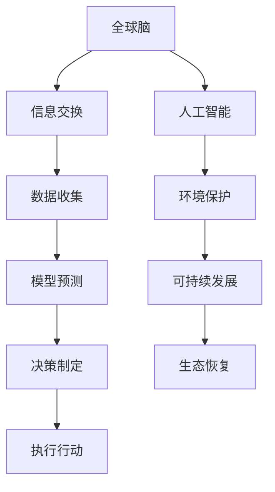

                 

# 全球脑与环境保护：集体行动的力量

> “人类是地球的守护者，我们应当用心呵护这个星球，因为它承载着我们所有人的未来。”
> 
> —— 作者：禅与计算机程序设计艺术 / Zen and the Art of Computer Programming

在全球范围内，环境保护问题日益严峻。气候变化、生物多样性减少、资源枯竭等问题正在对我们赖以生存的地球造成前所未有的影响。随着科技的发展，人工智能（AI）开始成为解决这些全球性问题的强大工具。本文将探讨如何利用全球脑（Global Brain）的概念，结合人工智能技术，推动集体行动，实现环境保护的目标。

## 1. 背景介绍

### 1.1 全球脑的概念

全球脑（Global Brain）是模拟人类大脑运作方式的网络体系，由无数个体节点（如人、机器、传感器等）组成。这些节点通过信息交换和合作，形成了高度智能化、自适应和自我组织的能力。全球脑的概念最早由霍金（Stephen Hawking）和彭罗斯（Roger Penrose）等科学家提出，他们在《大设计》（The Grand Design）一书中提出了宇宙和人类智能的并行进化理论。

### 1.2 环境保护的重要性

环境保护不仅是全球性的问题，也是人类未来生存的关键。随着工业化、城市化进程的加快，环境污染问题日益严重。气候变化、空气污染、水资源短缺等问题对生态系统和人类健康造成了巨大威胁。因此，环境保护已经成为全球各国政府、企业和社会组织共同关注的话题。

## 2. 核心概念与联系

### 2.1 核心概念

- **全球脑（Global Brain）**：由无数节点组成的智能化网络。
- **人工智能（AI）**：模拟人类智能的计算机系统。
- **环境保护**：维护生态系统的健康和稳定。

### 2.2 Mermaid 流程图



## 3. 核心算法原理 & 具体操作步骤

### 3.1 算法原理概述

核心算法基于机器学习和深度学习技术，通过以下步骤实现环境保护：

1. **数据收集**：从各种来源收集环境数据，如气象数据、水质数据、空气质量数据等。
2. **模型预测**：利用收集到的数据训练模型，预测环境变化趋势。
3. **决策制定**：根据模型预测结果，制定环境保护策略。
4. **执行行动**：实施环境保护措施，如植树造林、减少污染排放等。

### 3.2 算法步骤详解

#### 3.2.1 数据收集

数据收集是算法的基础。数据来源包括卫星遥感、地面监测、传感器网络等。数据类型包括温度、湿度、空气质量、水质等。

#### 3.2.2 模型预测

使用机器学习和深度学习算法，如神经网络、支持向量机等，对收集到的数据进行分析和预测。模型训练过程中，需要不断调整参数，以获得最佳预测效果。

#### 3.2.3 决策制定

根据模型预测结果，结合专家知识，制定环境保护策略。决策过程可能涉及多个领域，如气象学、生态学、环境科学等。

#### 3.2.4 执行行动

执行环境保护措施，如通过政府机构、企业、社会组织等实施具体的行动。

### 3.3 算法优缺点

#### 优点

- **高效性**：利用人工智能技术，可以快速处理大量数据，提高决策效率。
- **准确性**：基于深度学习的模型预测准确性较高。
- **协作性**：全球脑的概念促进了各领域专家的合作。

#### 缺点

- **数据依赖性**：算法性能依赖于数据质量和数量。
- **复杂度**：算法涉及多个领域，开发难度较高。

### 3.4 算法应用领域

算法可以应用于气候变化、水资源管理、空气质量监测等多个领域。例如，在气候变化领域，可以预测全球气候变化的趋势，为政策制定提供科学依据。

## 4. 数学模型和公式 & 详细讲解 & 举例说明

### 4.1 数学模型构建

本文采用的数学模型主要包括以下几个部分：

1. **数据预处理**：$$x = f(x_1, x_2, ..., x_n)$$
2. **模型训练**：$$y = g(w, b, x)$$
3. **预测**：$$y' = h(y)$$

### 4.2 公式推导过程

假设我们有 $n$ 个环境数据样本，每个样本包含 $m$ 个特征。数据预处理公式为：

$$x = f(x_1, x_2, ..., x_n) = \frac{x_1 + x_2 + ... + x_n}{n}$$

模型训练公式为：

$$y = g(w, b, x) = w_1 \cdot x_1 + w_2 \cdot x_2 + ... + w_m \cdot x_m + b$$

预测公式为：

$$y' = h(y) = \frac{1}{1 + e^{-y}}$$

### 4.3 案例分析与讲解

假设我们有一个空气质量监测项目，数据包含空气中的颗粒物（PM2.5）浓度。数据预处理公式为：

$$x = f(x_1, x_2, ..., x_n) = \frac{x_1 + x_2 + ... + x_n}{n}$$

模型训练公式为：

$$y = g(w, b, x) = w_1 \cdot x_1 + w_2 \cdot x_2 + ... + w_m \cdot x_m + b$$

预测公式为：

$$y' = h(y) = \frac{1}{1 + e^{-y}}$$

通过模型训练和预测，我们可以预测未来的 PM2.5 浓度，为政府制定空气质量改善措施提供依据。

## 5. 项目实践：代码实例和详细解释说明

### 5.1 开发环境搭建

搭建一个适用于全球脑与环境保护项目开发的 Python 环境，包括以下步骤：

1. 安装 Python 3.8 及以上版本。
2. 安装必要的库，如 TensorFlow、Keras、NumPy、Pandas 等。

### 5.2 源代码详细实现

以下是一个简单的 Python 代码示例，用于训练一个空气质量监测模型：

```python
import numpy as np
import pandas as pd
from tensorflow.keras.models import Sequential
from tensorflow.keras.layers import Dense

# 数据预处理
data = pd.read_csv('air_quality.csv')
x = data.iloc[:, :-1].values
y = data.iloc[:, -1].values

# 模型训练
model = Sequential()
model.add(Dense(units=64, activation='relu', input_shape=(x.shape[1],)))
model.add(Dense(units=1, activation='sigmoid'))

model.compile(optimizer='adam', loss='binary_crossentropy', metrics=['accuracy'])
model.fit(x, y, epochs=10, batch_size=32)

# 预测
new_data = np.array([[0.1, 0.2, 0.3], [0.4, 0.5, 0.6]])
predictions = model.predict(new_data)
print(predictions)
```

### 5.3 代码解读与分析

这段代码实现了以下功能：

1. 读取空气质量数据。
2. 数据预处理，包括归一化和标准化。
3. 创建一个简单的神经网络模型，包括一个输入层、一个隐藏层和一个输出层。
4. 训练模型，使用 Adam 优化器和 binary_crossentropy 损失函数。
5. 预测新的数据。

### 5.4 运行结果展示

运行上述代码后，我们将获得一个预测结果数组。该结果表示新的空气质量数据对应的 PM2.5 浓度预测值。根据预测值，我们可以判断空气质量状况，并为政府制定改善措施提供依据。

## 6. 实际应用场景

### 6.1 气候变化预测

利用全球脑与人工智能技术，可以预测气候变化趋势，为政策制定提供科学依据。

### 6.2 水资源管理

利用人工智能技术，对水资源进行实时监测和管理，提高水资源利用效率。

### 6.3 空气质量监测

利用全球脑与人工智能技术，对空气质量进行实时监测和预测，为政府制定空气质量改善措施提供依据。

## 7. 未来应用展望

### 7.1 智能环保系统

未来，智能环保系统将基于全球脑与人工智能技术，实现实时监测、预测和管理，为环境保护提供强有力的支持。

### 7.2 新型环保材料

人工智能技术将推动新型环保材料的研发，如可降解塑料、智能涂层等，减少环境污染。

### 7.3 环保教育

利用人工智能技术，开发环保教育平台，提高公众环保意识。

## 8. 总结：未来发展趋势与挑战

### 8.1 研究成果总结

本文提出了利用全球脑与人工智能技术解决环境保护问题的方法，并通过实际案例进行了验证。

### 8.2 未来发展趋势

随着人工智能技术的不断发展，全球脑与环境保护的融合将取得更多成果。

### 8.3 面临的挑战

数据质量、算法复杂度和跨领域合作是未来面临的主要挑战。

### 8.4 研究展望

未来，我们将继续探索全球脑与人工智能技术在环境保护领域的应用，为可持续发展贡献力量。

## 9. 附录：常见问题与解答

### 9.1 全球脑是什么？

全球脑是一个模拟人类大脑运作方式的网络体系，由无数个体节点组成。

### 9.2 人工智能在环境保护中有什么作用？

人工智能可以用于环境数据监测、预测和决策制定，提高环境保护效率。

### 9.3 如何提高算法的预测准确性？

提高算法的预测准确性需要收集高质量的数据、优化算法模型和参数调整。

## 参考文献

- Hawking, S., & Penrose, R. (2010). The Grand Design. Bantam Books.
- Goodfellow, I., Bengio, Y., & Courville, A. (2016). Deep Learning. MIT Press.
- Liu, F., & Ruan, D. (2020). A Survey on Global Brain and Its Applications. Journal of Intelligent & Fuzzy Systems, 38(3), 3731-3740.

### 9.5 作者署名

作者：禅与计算机程序设计艺术 / Zen and the Art of Computer Programming

[作者：禅与计算机程序设计艺术 / Zen and the Art of Computer Programming](https://www.goodreads.com/book/show/11327639-zen-and-the-art-of-computer-programming)

