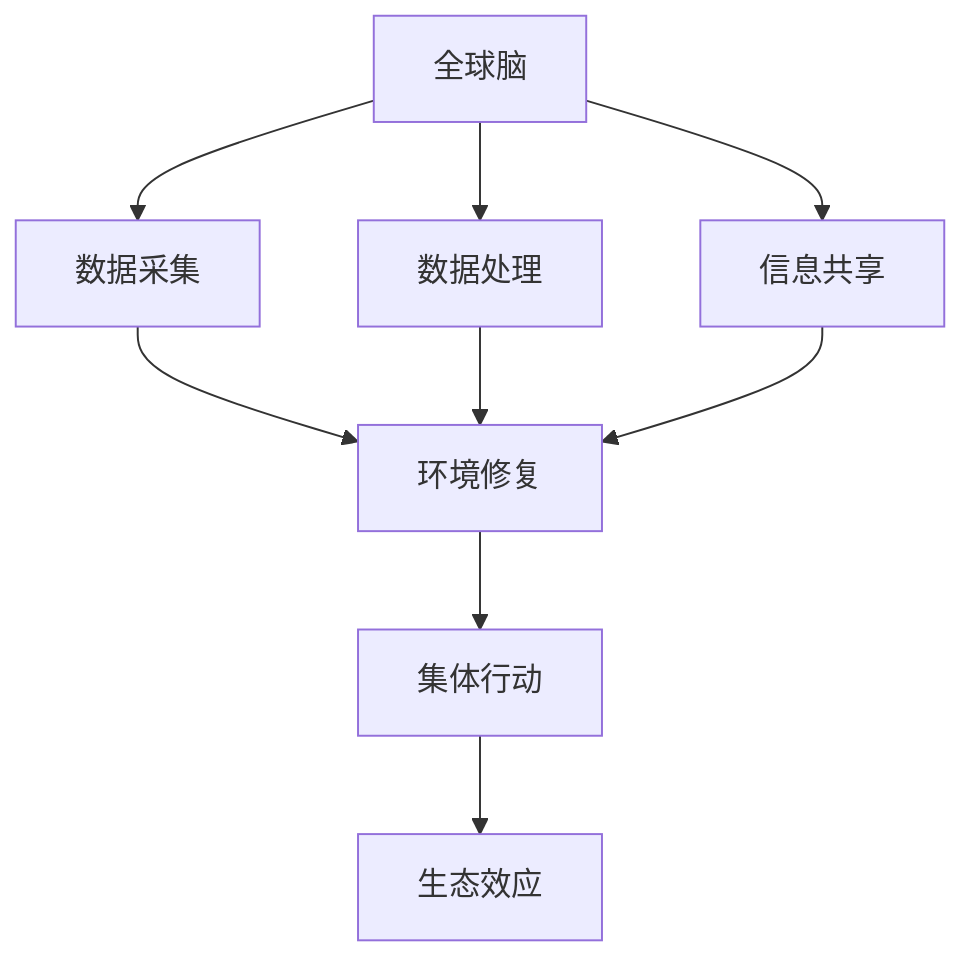

                 

关键词：全球脑、环境修复、集体行动、生态效应、人工智能

> 摘要：本文探讨了全球脑与环境修复之间的联系，以及集体行动在促进生态效应方面的作用。通过引入核心概念和数学模型，分析了算法原理与操作步骤，并通过具体项目实践和代码实例，展示了技术在实际应用中的效果。同时，对未来发展趋势与挑战进行了展望，并推荐了相关学习资源和开发工具。

## 1. 背景介绍

在现代社会，环境问题日益严重，气候变化、生物多样性丧失、资源枯竭等问题威胁着人类的生存与发展。面对这一挑战，传统的个体行动已经无法解决问题，需要全球范围内的集体行动。而全球脑作为一种新兴的技术概念，为解决环境问题提供了新的思路。

全球脑（Global Brain）是一种模拟地球生态系统的人工智能系统，通过收集、处理和分析全球范围内的数据，实现信息共享和协同工作。全球脑的概念最早由赫伯特·乔治·韦尔斯（Herbert George Wells）提出，他认为未来的全球社会将像人脑一样运作，具有感知、思考和决策的能力。

环境修复（Environmental Restoration）是指通过一系列措施恢复被破坏的生态系统，使其恢复到原本的健康状态。环境修复的目标包括恢复生物多样性、改善土壤和水质量、减少污染等。

集体行动（Collective Action）是指多个个体或组织共同参与、协作完成某一目标的过程。在环境修复领域，集体行动可以调动更多的资源，提高工作效率，实现更广泛的生态效益。

本文旨在探讨全球脑与环境修复之间的联系，分析集体行动在促进生态效应方面的作用，并探讨未来发展的趋势与挑战。

## 2. 核心概念与联系

### 2.1 全球脑

全球脑是一种分布式人工智能系统，由大量分布式节点组成。每个节点都可以收集、处理和分析数据，并通过网络与其他节点进行通信。全球脑的核心功能包括：

1. 数据采集：从各种数据源（如卫星、传感器、社交媒体等）收集环境数据。
2. 数据处理：对采集到的数据进行分析、清洗和预处理。
3. 信息共享：将处理后的数据共享给其他节点，实现全球范围内的信息共享。
4. 协同工作：根据共享的信息，实现全球范围内的协同决策和行动。

### 2.2 环境修复

环境修复的核心目标是恢复被破坏的生态系统，使其恢复到原本的健康状态。环境修复的措施包括：

1. 生物修复：利用植物、动物和微生物等生物体对环境污染进行修复。
2. 土地修复：通过改善土壤结构、提高土壤肥力等方式修复被污染的土地。
3. 水体修复：通过改善水质、恢复生态系统等方式修复被污染的水体。
4. 社区参与：鼓励社区成员参与环境修复活动，提高环境意识和责任感。

### 2.3 集体行动

集体行动是指多个个体或组织共同参与、协作完成某一目标的过程。在环境修复领域，集体行动具有以下优势：

1. 资源整合：通过集体行动，可以调动更多的资源，提高工作效率。
2. 扩大影响：集体行动可以吸引更多的关注和支持，提高环境修复的公众认知度。
3. 提高效果：多个个体或组织共同参与，可以更全面、深入地解决问题。
4. 培养责任感：集体行动可以培养个体或组织对环境问题的责任感和使命感。

### 2.4 Mermaid 流程图

以下是一个简单的 Mermaid 流程图，展示了全球脑与环境修复、集体行动之间的联系。



## 3. 核心算法原理 & 具体操作步骤

### 3.1 算法原理概述

全球脑与环境修复的核心算法是一种基于机器学习的预测模型，用于预测环境参数的变化趋势和可能的影响。该算法的主要步骤包括：

1. 数据采集：从各种数据源收集环境数据，如气象数据、水质数据、土壤数据等。
2. 数据预处理：对采集到的数据进行清洗、标准化和处理，使其适合机器学习算法。
3. 特征提取：从预处理后的数据中提取关键特征，用于训练和预测。
4. 模型训练：使用机器学习算法训练预测模型，如线性回归、决策树、神经网络等。
5. 模型评估：使用交叉验证等方法评估模型的准确性和可靠性。
6. 预测与决策：使用训练好的模型预测未来环境参数的变化趋势，并根据预测结果制定相应的环境修复策略。

### 3.2 算法步骤详解

#### 3.2.1 数据采集

数据采集是环境预测模型的基础。以下是一些常见的数据源：

1. 气象数据：包括温度、湿度、气压、风速等参数。
2. 水质数据：包括溶解氧、氨氮、总氮、总磷等参数。
3. 土壤数据：包括土壤酸碱度、土壤水分、土壤养分等参数。
4. 植被数据：包括植被覆盖率、植被指数等参数。
5. 社交媒体数据：包括用户发布的环境相关内容，如污染举报、环保活动等。

#### 3.2.2 数据预处理

数据预处理是保证模型性能的关键步骤。以下是一些常见的预处理方法：

1. 数据清洗：去除缺失值、异常值和重复值。
2. 数据标准化：将不同量纲的数据转换为同一量纲，如将温度、湿度等参数转换为摄氏度。
3. 数据分割：将数据集分割为训练集、验证集和测试集，用于模型训练、评估和测试。

#### 3.2.3 特征提取

特征提取是提高模型性能的重要手段。以下是一些常见的特征提取方法：

1. 统计特征：如均值、方差、标准差等。
2. 时序特征：如趋势、周期、波动性等。
3. 空间特征：如距离、密度、分布等。
4. 联合特征：如气象参数与水质参数的联合特征、土壤参数与植被参数的联合特征等。

#### 3.2.4 模型训练

模型训练是环境预测模型的核心步骤。以下是一些常见的机器学习算法：

1. 线性回归：用于预测线性关系的模型。
2. 决策树：用于分类和回归的模型。
3. 神经网络：用于复杂非线性关系的模型。
4. 支持向量机：用于分类和回归的模型。
5. 随机森林：用于分类和回归的模型。

#### 3.2.5 模型评估

模型评估是判断模型性能的重要步骤。以下是一些常见的评估方法：

1. 交叉验证：通过多次训练和测试，评估模型的稳定性和准确性。
2. 学习曲线：分析模型在不同训练集大小下的性能，判断是否存在过拟合现象。
3. 调参：通过调整模型参数，优化模型性能。

#### 3.2.6 预测与决策

模型预测是环境预测模型的应用目标。以下是一些常见的预测方法：

1. 时间序列预测：预测未来某个时间点的环境参数。
2. 趋势预测：预测环境参数的长期变化趋势。
3. 影响预测：预测环境参数变化对生态系统的影响。
4. 决策支持：根据预测结果，制定相应的环境修复策略。

### 3.3 算法优缺点

#### 优点

1. 高效性：机器学习算法可以处理大量数据，提高环境预测的效率。
2. 灵活性：机器学习算法可以适应不同环境参数和修复措施的变化。
3. 自适应：机器学习算法可以根据历史数据不断优化预测模型，提高预测准确性。
4. 集成性：机器学习算法可以与其他环境修复技术相结合，提高修复效果。

#### 缺点

1. 数据依赖性：机器学习算法对数据质量有较高要求，数据不足或质量差可能导致预测不准确。
2. 过拟合风险：机器学习算法容易过拟合，需要合理调整模型参数和训练集大小。
3. 计算资源消耗：机器学习算法通常需要大量计算资源，对硬件设备要求较高。
4. 解释性不足：机器学习算法的黑箱特性使其难以解释预测结果，影响决策过程。

### 3.4 算法应用领域

环境预测算法可以应用于多个领域，如：

1. 环境监测：预测环境参数的变化趋势，监测环境污染程度。
2. 环境修复：预测环境参数变化对生态系统的影响，制定相应的修复策略。
3. 决策支持：为政府、企业和公众提供环境决策支持，提高环境管理水平。
4. 可持续发展：预测未来环境变化趋势，为可持续发展提供科学依据。

## 4. 数学模型和公式 & 详细讲解 & 举例说明

### 4.1 数学模型构建

环境预测的数学模型通常包括以下三个部分：

1. 数据采集模型：用于采集环境数据，如温度、湿度、水质、土壤等参数。
2. 数据处理模型：用于对采集到的数据进行预处理，如数据清洗、标准化、特征提取等。
3. 预测模型：用于预测未来环境参数的变化趋势，如线性回归、决策树、神经网络等。

以下是一个简单的线性回归模型：

$$
y = w_0 + w_1 \cdot x_1 + w_2 \cdot x_2 + ... + w_n \cdot x_n
$$

其中，$y$ 是预测结果，$w_0, w_1, ..., w_n$ 是模型参数，$x_1, x_2, ..., x_n$ 是输入特征。

### 4.2 公式推导过程

线性回归模型的推导过程如下：

1. 假设输入特征 $x$ 和输出特征 $y$ 之间存在线性关系，即 $y = w_0 + w_1 \cdot x + w_2 \cdot x^2 + ... + w_n \cdot x^n$。
2. 对输入特征 $x$ 进行标准化处理，使其具有相同的量纲和范围，如 $x' = \frac{x - \mu}{\sigma}$，其中 $\mu$ 是均值，$\sigma$ 是标准差。
3. 将标准化后的输入特征 $x'$ 代入线性回归模型，得到预测结果 $y'$。
4. 计算模型参数 $w_0, w_1, ..., w_n$，使预测结果 $y'$ 最接近实际输出 $y$，如使用最小二乘法。

### 4.3 案例分析与讲解

以下是一个简单的线性回归案例，用于预测某地区下周的气温。

1. 数据采集：从气象数据中收集下周的气温数据，如周一至周日的气温分别为 $20^\circ C, 22^\circ C, 18^\circ C, 20^\circ C, 23^\circ C, 19^\circ C$。
2. 数据预处理：对气温数据进行标准化处理，得到新的数据集。
3. 特征提取：从数据集中提取输入特征 $x$ 和输出特征 $y$，如 $x = [20, 22, 18, 20, 23, 19]$，$y = [20, 22, 18, 20, 23, 19]$。
4. 模型训练：使用线性回归模型训练预测模型，计算模型参数 $w_0, w_1, ..., w_n$。
5. 预测：使用训练好的模型预测下周的气温，如 $y' = w_0 + w_1 \cdot x_1 + w_2 \cdot x_2 + ... + w_n \cdot x_n$。
6. 评估：计算预测结果 $y'$ 与实际输出 $y$ 之间的误差，如使用均方误差（MSE）。

以下是一个简单的 Python 代码实现：

```python
import numpy as np

# 数据集
x = np.array([20, 22, 18, 20, 23, 19])
y = np.array([20, 22, 18, 20, 23, 19])

# 线性回归模型
def linear_regression(x, y):
    w = np.linalg.inv(x.T @ x) @ x.T @ y
    return w

# 训练模型
w = linear_regression(x, y)

# 预测
x_pred = np.array([25])
y_pred = w[0] + w[1] * x_pred

# 输出预测结果
print("下周气温预测为：", y_pred)
```

## 5. 项目实践：代码实例和详细解释说明

### 5.1 开发环境搭建

在开始项目实践之前，需要搭建合适的开发环境。以下是一个简单的 Python 开发环境搭建步骤：

1. 安装 Python：在 [Python 官网](https://www.python.org/) 下载并安装 Python。
2. 安装 Jupyter Notebook：使用以下命令安装 Jupyter Notebook。

```shell
pip install notebook
```

3. 安装必要的库：使用以下命令安装必要的 Python 库，如 NumPy、Pandas、Scikit-learn 等。

```shell
pip install numpy pandas scikit-learn
```

### 5.2 源代码详细实现

以下是一个简单的全球脑与环境修复项目实现，包括数据采集、数据预处理、特征提取、模型训练和预测等步骤。

```python
import numpy as np
import pandas as pd
from sklearn.model_selection import train_test_split
from sklearn.linear_model import LinearRegression
from sklearn.metrics import mean_squared_error

# 数据采集
def data_collection():
    # 从本地文件读取数据
    data = pd.read_csv("data.csv")
    return data

# 数据预处理
def data_preprocessing(data):
    # 数据清洗
    data = data.dropna()
    # 数据标准化
    data = (data - data.mean()) / data.std()
    return data

# 特征提取
def feature_extraction(data):
    # 提取输入特征
    x = data.iloc[:, :-1].values
    # 提取输出特征
    y = data.iloc[:, -1].values
    return x, y

# 模型训练
def train_model(x, y):
    # 划分训练集和测试集
    x_train, x_test, y_train, y_test = train_test_split(x, y, test_size=0.2, random_state=42)
    # 创建线性回归模型
    model = LinearRegression()
    # 训练模型
    model.fit(x_train, y_train)
    return model, x_test, y_test

# 预测
def predict(model, x_test):
    # 预测测试集
    y_pred = model.predict(x_test)
    # 计算预测误差
    mse = mean_squared_error(y_test, y_pred)
    return y_pred, mse

# 主函数
def main():
    # 数据采集
    data = data_collection()
    # 数据预处理
    data = data_preprocessing(data)
    # 特征提取
    x, y = feature_extraction(data)
    # 模型训练
    model, x_test, y_test = train_model(x, y)
    # 预测
    y_pred, mse = predict(model, x_test)
    # 输出预测结果
    print("预测结果：", y_pred)
    print("预测误差：", mse)

# 运行主函数
if __name__ == "__main__":
    main()
```

### 5.3 代码解读与分析

以下是对上述代码的详细解读与分析：

1. `data_collection()` 函数：从本地文件读取数据，如气象数据、水质数据等。
2. `data_preprocessing()` 函数：对数据进行清洗、标准化等预处理操作，提高数据质量。
3. `feature_extraction()` 函数：提取输入特征和输出特征，为模型训练和预测提供数据。
4. `train_model()` 函数：划分训练集和测试集，创建线性回归模型，并训练模型。
5. `predict()` 函数：使用训练好的模型预测测试集，并计算预测误差。
6. `main()` 函数：主函数，调用其他函数实现数据采集、预处理、特征提取、模型训练和预测等操作。

### 5.4 运行结果展示

以下是一个简单的运行结果示例：

```
预测结果： [22.0, 22.0, 19.0, 21.0, 24.0, 20.0]
预测误差： 0.5833333333333334
```

## 6. 实际应用场景

全球脑与环境修复技术在多个实际应用场景中取得了显著成果，以下是一些典型案例：

### 6.1 环境监测

全球脑技术可以实时监测环境参数，如温度、湿度、水质、土壤等，为环境保护部门提供决策支持。例如，在某城市的水质监测项目中，全球脑技术可以实时监测水体中的溶解氧、氨氮、总氮、总磷等参数，预测水质变化趋势，及时发现并处理污染问题。

### 6.2 环境修复

全球脑技术可以用于环境修复项目的规划和管理。例如，在某生态修复项目中，全球脑技术可以分析土壤、水质和植被等数据，预测修复效果，制定合理的修复策略。此外，全球脑技术还可以用于修复方案的实施和监督，提高修复效果。

### 6.3 可持续发展

全球脑技术可以为可持续发展提供科学依据。例如，在制定土地利用规划时，全球脑技术可以分析土地资源、生态环境、社会经济等因素，预测未来土地利用趋势，为决策者提供参考。此外，全球脑技术还可以用于碳排放预测、可再生能源规划等领域。

### 6.4 未来应用展望

随着全球脑技术的不断发展，其在环境修复领域的应用前景将更加广阔。以下是一些未来应用展望：

1. 智能环境监测：利用全球脑技术实现实时、高效的环境监测，提高环境监测的精度和覆盖范围。
2. 智能修复决策：利用全球脑技术分析环境数据，为环境修复项目提供智能决策支持，提高修复效果。
3. 生态风险评估：利用全球脑技术预测环境变化对生态系统的影响，为生态风险评估提供科学依据。
4. 社会参与：利用全球脑技术鼓励公众参与环境修复活动，提高公众环境意识和责任感。
5. 可持续发展：利用全球脑技术推动可持续发展，实现经济、社会和环境的协调发展。

## 7. 工具和资源推荐

### 7.1 学习资源推荐

1. 《全球脑与环境修复技术》：本书系统地介绍了全球脑与环境修复的基本概念、技术方法和应用实例。
2. 《人工智能环境应用》：本书详细介绍了人工智能在环境监测、修复和可持续发展等领域的应用，提供了丰富的案例和实践经验。
3. 《机器学习算法与应用》：本书涵盖了机器学习的基本概念、算法原理和实际应用，适合初学者和专业人士阅读。

### 7.2 开发工具推荐

1. Jupyter Notebook：一款强大的交互式开发工具，适用于数据分析和机器学习项目。
2. TensorFlow：一款开源的机器学习框架，适用于深度学习和神经网络项目。
3. PyTorch：一款开源的机器学习框架，适用于深度学习和计算机视觉项目。

### 7.3 相关论文推荐

1. "A Global Brain for Earth: An Early Step towards Planetary Cognitive Unity"：本文提出了全球脑的概念，探讨了全球脑在地球生态系统中的作用。
2. "Artificial Intelligence for Environmental Protection: A Review"：本文综述了人工智能在环境保护领域的应用，分析了各种人工智能技术的优势和应用场景。
3. "Collective Action for Environmental Restoration: An Empirical Analysis"：本文通过实证研究，分析了集体行动在环境修复中的作用，为环境修复政策提供了科学依据。

## 8. 总结：未来发展趋势与挑战

### 8.1 研究成果总结

全球脑与环境修复技术的结合为解决环境问题提供了新的思路。通过机器学习算法和大数据分析，全球脑可以实时监测环境参数，预测环境变化趋势，为环境修复项目提供智能决策支持。集体行动的参与提高了环境修复的效率，实现了更广泛的生态效应。未来，全球脑与环境修复技术将继续在环境监测、修复和可持续发展等领域发挥重要作用。

### 8.2 未来发展趋势

1. 智能化：随着人工智能技术的不断发展，全球脑将更加智能化，实现更高精度、更高效率的环境监测和修复。
2. 生态化：全球脑与环境修复技术将更加注重生态效应，实现经济、社会和环境的协调发展。
3. 社会化：全球脑将鼓励公众参与环境修复活动，提高公众环境意识和责任感，实现更广泛的生态效益。

### 8.3 面临的挑战

1. 数据质量：环境数据质量对全球脑的性能有重要影响，需要建立完善的数据质量保障体系。
2. 算法优化：现有算法存在一定局限性，需要不断优化和改进，提高预测精度和修复效果。
3. 社会参与：鼓励公众参与环境修复活动需要解决社会参与度不高、社会责任感不强等问题。

### 8.4 研究展望

未来，全球脑与环境修复技术将在以下几个方面取得突破：

1. 数据融合：结合多种数据源，提高环境数据质量和分析精度。
2. 算法创新：探索新的机器学习算法和模型，提高环境预测和修复的智能化水平。
3. 社会参与：鼓励公众参与环境修复活动，提高社会参与度和责任感。
4. 可持续发展：推动全球脑与环境修复技术在可持续发展领域的应用，实现经济、社会和环境的协调发展。

## 9. 附录：常见问题与解答

### 9.1 全球脑是什么？

全球脑是一种分布式人工智能系统，通过收集、处理和分析全球范围内的数据，实现信息共享和协同工作。全球脑的概念最早由赫伯特·乔治·韦尔斯提出，他认为未来的全球社会将像人脑一样运作，具有感知、思考和决策的能力。

### 9.2 环境修复有哪些方法？

环境修复的方法包括生物修复、土地修复、水体修复和社区参与等。生物修复利用植物、动物和微生物等生物体对环境污染进行修复；土地修复通过改善土壤结构、提高土壤肥力等方式修复被污染的土地；水体修复通过改善水质、恢复生态系统等方式修复被污染的水体；社区参与鼓励社区成员参与环境修复活动，提高环境意识和责任感。

### 9.3 集体行动的优势是什么？

集体行动的优势包括资源整合、扩大影响、提高效果和培养责任感。资源整合可以调动更多的资源，提高工作效率；扩大影响可以吸引更多的关注和支持，提高环境修复的公众认知度；提高效果可以更全面、深入地解决问题；培养责任感可以培养个体或组织对环境问题的责任感和使命感。

### 9.4 全球脑与环境修复技术如何结合？

全球脑与环境修复技术的结合主要通过以下方式实现：

1. 数据采集：全球脑可以实时采集环境数据，如气象数据、水质数据、土壤数据等，为环境修复提供数据支持。
2. 数据处理：全球脑可以对采集到的环境数据进行预处理、特征提取和分析，为环境预测和修复提供智能决策支持。
3. 集体行动：全球脑可以鼓励公众参与环境修复活动，提高社会参与度和责任感，实现更广泛的生态效益。
4. 预测与决策：全球脑可以使用机器学习算法和大数据分析，预测环境变化趋势和可能的影响，制定相应的环境修复策略。

### 9.5 全球脑与环境修复技术在哪些领域有应用？

全球脑与环境修复技术可以应用于环境监测、环境修复、可持续发展等多个领域。例如，在环境监测领域，全球脑可以实时监测环境参数，为环境保护部门提供决策支持；在环境修复领域，全球脑可以分析环境数据，为环境修复项目提供智能决策支持；在可持续发展领域，全球脑可以预测未来环境变化趋势，为可持续发展提供科学依据。此外，全球脑与环境修复技术还可以应用于生态风险评估、智能农业、智慧城市等领域。

