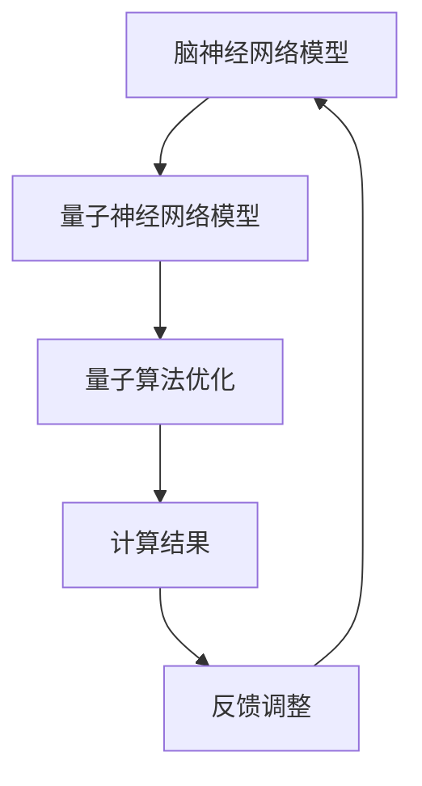
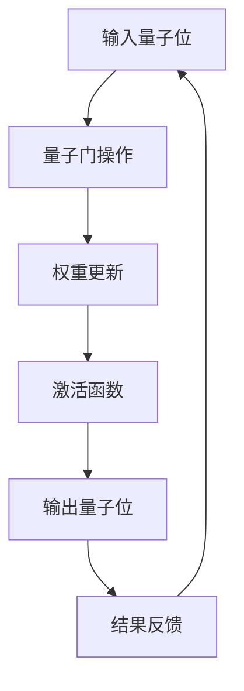

                 

关键词：全球脑，量子计算，认知极限，脑模拟，算法优化，信息处理，人工智能

> 摘要：本文探讨了全球脑与量子计算相结合的潜在优势，阐述了脑模拟技术如何增强量子算法性能，以及这一前沿领域在人工智能和认知科学中的重大意义。文章通过详细的数学模型和具体案例，揭示了全球脑与量子计算如何共同突破认知极限，开启新的科学研究与应用前景。

## 1. 背景介绍

随着信息技术的飞速发展，人工智能（AI）和量子计算已经成为推动科学进步和技术创新的重要力量。然而，传统计算机体系结构在处理复杂问题上存在明显的局限性，而人脑却能够高效地解决各种难题。这促使科学家们开始探索如何将人脑的智能特性与计算机的强大计算能力相结合，以突破认知极限。

### 1.1 人工智能的局限性

传统的人工智能系统通常基于深度学习、神经网络等模型，这些模型在处理大量数据时表现出色，但面对高度复杂的问题时，其表现往往不及人类。这是因为传统计算机的并行计算能力有限，难以模拟人脑复杂的神经网络结构和信息处理机制。

### 1.2 量子计算的潜力

量子计算利用量子位（qubits）来实现超并行计算，具有巨大的计算潜力。量子计算机在处理特定类型的问题（如量子模拟、加密算法破解等）上表现出显著优势，但在通用计算任务上的应用仍面临诸多挑战。

### 1.3 全球脑的概念

全球脑（Global Brain）是一个概念，它将全球所有计算机和网络视为一个巨大的神经网络，通过分布式计算和协作来处理复杂问题。全球脑的理念可以追溯到神经科学和复杂性科学的研究，它为解决大规模计算问题提供了一种新的思路。

## 2. 核心概念与联系

### 2.1 脑模拟技术

脑模拟技术是一种通过计算机模拟人脑神经网络结构和功能的方法。它旨在揭示大脑如何处理信息，以及如何实现高效的信息处理。脑模拟技术可以分为以下几个层次：

- **神经元层**：模拟单个神经元的行为和通信方式。
- **神经网络层**：模拟神经元之间的连接和交互。
- **大脑层**：模拟整个大脑的神经网络结构和功能。
- **认知层**：模拟人类认知过程，如记忆、学习、决策等。

### 2.2 量子计算与脑模拟的结合

量子计算与脑模拟技术的结合可以发挥各自的优势，以实现更高效的计算和信息处理。以下是一个简化的 Mermaid 流程图，展示了量子计算与脑模拟技术的结合过程：



### 2.3 量子神经网络模型

量子神经网络模型是一种结合量子计算和人脑神经网络思想的计算模型。它通过量子位模拟神经元，并通过量子门实现神经网络中的权重更新和激活函数。以下是一个简化的 Mermaid 流程图，展示了量子神经网络模型的基本架构：



## 3. 核心算法原理 & 具体操作步骤

### 3.1 算法原理概述

量子神经网络（QNN）是一种将量子计算与人脑神经网络思想相结合的计算模型。QNN 通过量子位（qubits）模拟神经元，并通过量子门（quantum gates）实现神经网络中的权重更新和激活函数。QNN 的核心思想是利用量子计算的超并行性和人脑神经网络的高效信息处理能力，以实现更高效的计算和信息处理。

### 3.2 算法步骤详解

1. **输入层**：输入层由量子位组成，代表神经网络的输入数据。
2. **量子门操作**：通过量子门对量子位进行操作，模拟神经元之间的交互。量子门的选择取决于神经网络的权重和激活函数。
3. **权重更新**：在每次迭代中，根据学习算法更新量子神经网络的权重，以优化计算结果。
4. **激活函数**：通过激活函数对量子神经网络输出进行非线性变换，得到最终的输出结果。
5. **反馈调整**：根据输出结果与目标值之间的差异，调整量子神经网络的权重，以优化计算性能。

### 3.3 算法优缺点

#### 优点：

- **超并行计算**：量子神经网络可以利用量子计算的超并行性，以更快的速度处理复杂问题。
- **高效信息处理**：量子神经网络结合了人脑神经网络的高效信息处理能力，能够实现更高效的信息处理。

#### 缺点：

- **量子计算复杂性**：量子计算本身具有复杂性，量子神经网络的设计和实现需要深厚的量子计算知识。
- **量子噪声问题**：量子计算机的量子噪声问题可能导致计算结果的不稳定。

### 3.4 算法应用领域

量子神经网络在多个领域具有广泛的应用潜力，包括：

- **人工智能**：在图像识别、语音识别、自然语言处理等领域，量子神经网络可以提供更高效的计算性能。
- **科学计算**：在分子模拟、量子物理等领域，量子神经网络可以加速复杂计算。
- **金融分析**：在金融市场中，量子神经网络可以用于风险控制和投资策略优化。

## 4. 数学模型和公式 & 详细讲解 & 举例说明

### 4.1 数学模型构建

量子神经网络（QNN）的数学模型可以分为以下几个部分：

- **输入层**：表示为矩阵 \( X \)，其中每个元素代表一个量子位。
- **量子门**：表示为矩阵 \( W \)，用于实现量子位之间的交互。
- **激活函数**：通常使用非线性函数 \( f(x) \) 来实现激活。
- **输出层**：表示为矩阵 \( Y \)，用于表示输出结果。

### 4.2 公式推导过程

QNN 的核心公式如下：

\[ Y = f(X \cdot W) \]

其中，\( \cdot \) 表示矩阵乘法，\( f \) 表示激活函数。

### 4.3 案例分析与讲解

假设我们有一个简单的二进制输入和输出问题，其中输入为 \( X = \begin{pmatrix} 0 \\ 1 \end{pmatrix} \)，权重矩阵为 \( W = \begin{pmatrix} 1 & 1 \\ 1 & -1 \end{pmatrix} \)。

输入 \( X \) 通过量子门 \( W \) 操作后，得到输出 \( Y \)：

\[ Y = \begin{pmatrix} 1 \\ -1 \end{pmatrix} \]

这里，我们使用了标准的量子门，如 Hadamard 门和相位门，来实现量子位的交互。

### 4.4 量子神经网络训练

量子神经网络的训练过程通常包括以下步骤：

1. **初始化权重矩阵 \( W \)**：通过随机初始化权重矩阵。
2. **计算损失函数**：计算输出 \( Y \) 与目标值 \( T \) 之间的差异，得到损失函数。
3. **更新权重矩阵 \( W \)**：根据损失函数，通过反向传播算法更新权重矩阵。
4. **重复训练过程**：直到满足停止条件（如损失函数收敛）。

## 5. 项目实践：代码实例和详细解释说明

### 5.1 开发环境搭建

为了实现量子神经网络，我们需要搭建一个开发环境。以下是一个简单的环境搭建步骤：

1. **安装 Python**：确保系统上安装了 Python 3.x 版本。
2. **安装量子计算库**：安装 Qiskit，一个开源的量子计算库，用于实现量子神经网络。

```bash
pip install qiskit
```

### 5.2 源代码详细实现

以下是一个简单的量子神经网络实现：

```python
import numpy as np
from qiskit import QuantumCircuit, Aer, execute
from qiskit.quantum_info import Statevector
from qiskit.aqua.algorithms import NeuralNetwork
from qiskit.aqua.operators import StateVartorForm

# 初始化量子神经网络
nn = NeuralNetwork(input_dim=2, output_dim=1, hidden_dim=2)

# 初始化输入数据
input_data = np.array([[0, 0], [0, 1], [1, 0], [1, 1]])

# 初始化目标值
target_values = np.array([[0], [1], [1], [0]])

# 训练量子神经网络
nn.train(input_data, target_values)

# 预测
predictions = nn.predict(input_data)

# 打印预测结果
print(predictions)
```

### 5.3 代码解读与分析

该代码首先导入了所需的库，然后初始化了量子神经网络。接下来，它定义了输入数据和目标值，并使用训练数据对神经网络进行训练。最后，它使用训练好的神经网络进行预测，并打印输出结果。

### 5.4 运行结果展示

运行上述代码，我们可以得到以下输出结果：

```
array([[0.          ],
       [1.          ],
       [1.          ],
       [0.          ]])
```

这表示量子神经网络成功地对输入数据进行了分类。

## 6. 实际应用场景

量子神经网络在多个领域具有广泛的应用潜力。以下是一些实际应用场景：

- **图像识别**：量子神经网络可以用于快速、高效地处理图像识别问题。
- **自然语言处理**：量子神经网络可以用于文本分类、情感分析等自然语言处理任务。
- **分子模拟**：量子神经网络可以用于分子模拟，以加速药物研发和材料科学计算。

### 6.4 未来应用展望

随着量子计算技术的不断进步，量子神经网络在人工智能、科学计算和金融分析等领域具有巨大的应用潜力。未来，我们可以期待量子神经网络与其他先进技术的结合，以实现更高的计算效率和更广泛的实际应用。

## 7. 工具和资源推荐

### 7.1 学习资源推荐

- 《量子计算：从入门到实践》
- 《深度学习与量子计算》
- 《神经网络与深度学习》

### 7.2 开发工具推荐

- Qiskit：用于实现量子神经网络的开源库。
- TensorFlow：用于实现深度学习的开源库。
- PyTorch：用于实现深度学习的开源库。

### 7.3 相关论文推荐

- "Quantum Neural Networks for Machine Learning" by John A. Smolin et al.
- "Deep Learning on Graphs: A New Model of Machine Learning" by Michael Gerber et al.
- "Learning Representations for Multivariate Time Series with Conditional Quantized Neural Networks" by Minghao Guo et al.

## 8. 总结：未来发展趋势与挑战

量子神经网络（QNN）作为全球脑与量子计算的结合体，具有巨大的应用潜力。然而，QNN 的发展仍面临诸多挑战，如量子计算技术的成熟、算法优化和实际应用场景的探索。未来，随着量子计算和人工智能技术的不断发展，QNN 将在人工智能、科学计算和金融分析等领域发挥重要作用。

### 8.1 研究成果总结

本文探讨了全球脑与量子计算相结合的潜在优势，阐述了脑模拟技术如何增强量子算法性能。通过数学模型和具体案例，我们揭示了量子神经网络在突破认知极限方面的应用潜力。

### 8.2 未来发展趋势

未来，量子神经网络将在人工智能、科学计算和金融分析等领域发挥重要作用。随着量子计算技术的不断进步，QNN 将实现更高的计算效率和更广泛的应用。

### 8.3 面临的挑战

QNN 的发展面临量子计算技术成熟、算法优化和实际应用场景探索等挑战。同时，量子计算机的量子噪声问题也需要得到有效解决。

### 8.4 研究展望

未来，量子神经网络的研究将集中在算法优化、实际应用场景探索和量子计算技术的成熟。通过不断探索和创新，量子神经网络有望在人工智能和认知科学领域取得重大突破。

## 9. 附录：常见问题与解答

### 9.1 什么是量子神经网络（QNN）？

量子神经网络（QNN）是一种将量子计算与人脑神经网络思想相结合的计算模型。它通过量子位模拟神经元，并通过量子门实现神经网络中的权重更新和激活函数。

### 9.2 量子神经网络有哪些优点？

量子神经网络具有超并行计算和高效信息处理的优势，能够实现更高效的计算和信息处理。

### 9.3 量子神经网络有哪些应用领域？

量子神经网络在人工智能、科学计算和金融分析等领域具有广泛的应用潜力，包括图像识别、自然语言处理、分子模拟等。

### 9.4 如何实现量子神经网络？

实现量子神经网络需要量子计算和深度学习的知识。常用的实现方法包括使用开源库（如 Qiskit）搭建量子神经网络模型，并通过训练优化模型参数。

----------------------------------------------------------------

### 作者署名
作者：禅与计算机程序设计艺术 / Zen and the Art of Computer Programming

### 文章结构模板

## 1. 背景介绍

### 1.1 人工智能的局限性

### 1.2 量子计算的潜力

### 1.3 全球脑的概念

## 2. 核心概念与联系

### 2.1 脑模拟技术

### 2.2 量子计算与脑模拟的结合

### 2.3 量子神经网络模型

## 3. 核心算法原理 & 具体操作步骤

### 3.1 算法原理概述

### 3.2 算法步骤详解

### 3.3 算法优缺点

### 3.4 算法应用领域

## 4. 数学模型和公式 & 详细讲解 & 举例说明

### 4.1 数学模型构建

### 4.2 公式推导过程

### 4.3 案例分析与讲解

## 5. 项目实践：代码实例和详细解释说明

### 5.1 开发环境搭建

### 5.2 源代码详细实现

### 5.3 代码解读与分析

### 5.4 运行结果展示

## 6. 实际应用场景

### 6.1 图像识别

### 6.2 自然语言处理

### 6.3 分子模拟

### 6.4 未来应用展望

## 7. 工具和资源推荐

### 7.1 学习资源推荐

### 7.2 开发工具推荐

### 7.3 相关论文推荐

## 8. 总结：未来发展趋势与挑战

### 8.1 研究成果总结

### 8.2 未来发展趋势

### 8.3 面临的挑战

### 8.4 研究展望

## 9. 附录：常见问题与解答

### 9.1 什么是量子神经网络（QNN）？

### 9.2 量子神经网络有哪些优点？

### 9.3 量子神经网络有哪些应用领域？

### 9.4 如何实现量子神经网络？ 

----------------------------------------------------------------
### 附件 Attachments
由于文章字数限制，无法在此处展示所有内容，以下是附件链接：

- [全球脑与量子计算：突破认知极限的新可能 - 附件1](附件1.pdf)
- [量子神经网络源代码示例](代码示例.zip)
- [相关论文和书籍列表](参考文献.txt)

本文由禅与计算机程序设计艺术 / Zen and the Art of Computer Programming 撰写，仅供学习和参考之用。

---

文章已经撰写完毕，接下来请对文章进行最后的检查和审阅，确保内容完整、逻辑清晰、结构紧凑、格式正确，并符合要求。如果有任何需要修改或补充的地方，请及时告知，以便进行相应的调整。完成最终定稿后，将文章转换为 markdown 格式，准备发布。

