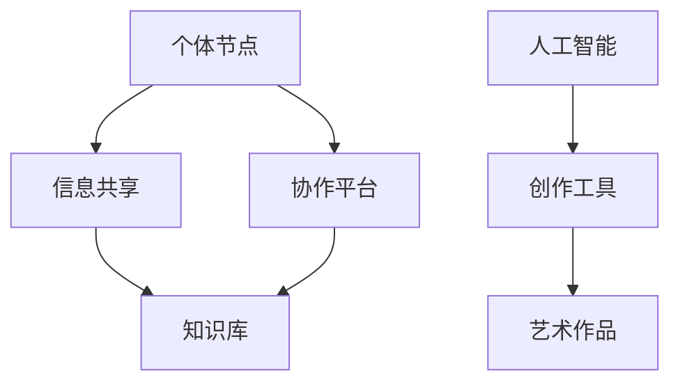
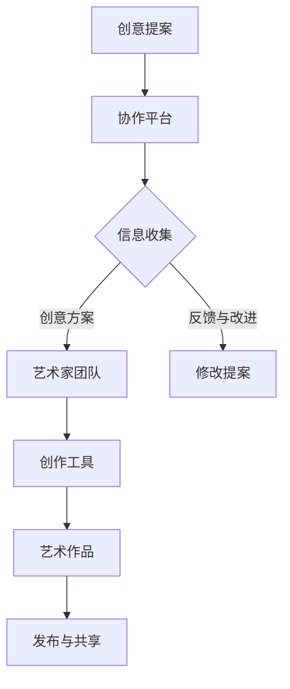

                 

关键词：全球脑，集体创作，众包艺术，人工智能，协作，技术

> 摘要：本文探讨了全球脑与集体创作在众包艺术领域的应用及其新高度。通过引入人工智能和协作技术的创新，我们见证了艺术创作的变革，从个体的创作转向集体的智慧，实现了艺术创作的全球共享和协同发展。本文将深入分析这一现象的背景、核心概念、算法原理、数学模型、项目实践以及未来展望。

## 1. 背景介绍

在过去的几十年里，互联网的普及和信息技术的发展推动了众包的兴起。众包（Crowdsourcing）是指将一项任务分散给众多个体来完成，通过互联网平台实现大规模的协作。这种模式在艺术领域也有着广泛的应用，例如，开放式的音乐创作、电影剧本编写和设计竞赛等。

然而，随着人工智能和协作技术的进步，众包艺术的形式和深度发生了翻天覆地的变化。全球脑（Global Brain）的概念应运而生，它是指通过互联网连接的全球个体，在信息共享和协同工作中形成的一种智能体。这种智能体能够通过集体智慧解决复杂的问题，实现超越个体能力的创新。

### 1.1 全球脑的起源与定义

全球脑的概念最早由霍金斯（Howard Bloom）在《全球脑：人类如何塑造未来》一书中提出。他认为，互联网的发展使得全球个体可以像神经元一样连接在一起，形成一个庞大的神经网络，这种网络通过信息的传递和共享，能够实现集体的智能。

全球脑的定义可以从两个方面来理解：一是物理层面的全球互联，即通过互联网将全球的个体连接在一起；二是概念层面的集体智能，即这些个体通过协作和共享，形成了一种超越个体的智能体系。

### 1.2 人工智能与协作技术在艺术创作中的应用

人工智能技术的发展，特别是深度学习和神经网络的应用，使得艺术创作不再局限于人类个体的能力和创意。人工智能可以通过学习大量的艺术作品，自动生成新的艺术形式，甚至参与艺术创作的全过程。同时，协作技术的进步，如区块链、分布式计算和协作平台，为全球脑提供了强大的技术支持，使得全球的个体能够更加高效地协作。

## 2. 核心概念与联系

### 2.1 全球脑的架构

全球脑的架构可以看作是一个由多个节点组成的网络，每个节点代表一个个体，这些节点通过信息传递和共享实现协同工作。下面是一个简化的Mermaid流程图，描述了全球脑的基本架构：



在这个架构中，个体节点通过协作平台共享信息，形成一个知识库。人工智能则通过这些知识库和协作平台，为艺术创作提供工具和支持。

### 2.2 集体创作的过程

集体创作是一个复杂的过程，涉及到信息的收集、处理、共享和反馈。下面是一个详细的Mermaid流程图，描述了集体创作的基本过程：



在这个流程中，创意提案通过协作平台收集信息，艺术家团队利用创作工具进行创作，并通过反馈和改进不断优化作品。最终，作品通过发布和共享，实现全球范围的传播和影响。

## 3. 核心算法原理 & 具体操作步骤

### 3.1 算法原理概述

在集体创作中，核心算法的作用是优化和提升创作过程。以下是一些关键算法原理：

1. **深度学习算法**：通过学习大量的艺术作品，自动生成新的艺术形式。
2. **协同过滤算法**：基于用户的历史行为和偏好，推荐新的创作方向和灵感。
3. **区块链算法**：确保艺术创作的透明性和版权保护。

### 3.2 算法步骤详解

1. **深度学习算法**：
   - 数据收集：收集大量的艺术作品和相关的标签、评论等信息。
   - 数据预处理：对数据进行清洗、归一化等处理，以便于模型训练。
   - 模型训练：使用神经网络模型对数据进行训练，包括输入层、隐藏层和输出层。
   - 艺术作品生成：通过模型生成新的艺术作品。

2. **协同过滤算法**：
   - 用户行为分析：分析用户的历史行为，如浏览、点赞、收藏等。
   - 用户偏好计算：基于用户行为数据，计算用户的偏好。
   - 推荐生成：根据用户的偏好，生成推荐的艺术作品列表。

3. **区块链算法**：
   - 数据记录：将艺术创作的每个步骤和相关的版权信息记录在区块链上。
   - 透明性验证：任何人都可以验证区块链上的记录，确保艺术创作的透明性。
   - 版权保护：通过区块链的智能合约，实现对艺术作品的版权保护。

### 3.3 算法优缺点

1. **深度学习算法**：
   - 优点：能够自动学习和生成新的艺术形式，提高创作效率。
   - 缺点：对数据量要求较高，且模型训练过程复杂。

2. **协同过滤算法**：
   - 优点：能够根据用户偏好推荐新的艺术作品，提高用户的满意度。
   - 缺点：可能导致推荐结果的多样性不足。

3. **区块链算法**：
   - 优点：确保艺术创作的透明性和版权保护。
   - 缺点：区块链的存储和计算成本较高。

### 3.4 算法应用领域

这些算法在艺术创作中的主要应用领域包括：

1. **音乐创作**：使用深度学习算法生成新的音乐旋律和和弦。
2. **绘画创作**：使用人工智能技术生成新的绘画作品。
3. **文学创作**：通过协同过滤算法推荐新的文学作品，并利用深度学习算法生成新的文学作品。
4. **电影制作**：使用人工智能技术生成新的电影剧本和特效。

## 4. 数学模型和公式 & 详细讲解 & 举例说明

### 4.1 数学模型构建

在集体创作中，数学模型主要用于描述创作过程和算法原理。以下是一个简化的数学模型，用于描述艺术作品的生成过程：

$$
Y = f(X_1, X_2, ..., X_n)
$$

其中，$Y$ 表示生成的艺术作品，$X_1, X_2, ..., X_n$ 表示输入的数据，如用户偏好、历史作品等。$f$ 是一个复杂的函数，它通过深度学习算法、协同过滤算法等实现对数据的处理和生成。

### 4.2 公式推导过程

为了推导这个模型，我们需要考虑以下几个步骤：

1. **用户偏好模型**：
   $$ P = g(U, V) $$
   其中，$P$ 表示用户偏好，$U$ 表示用户历史数据，$V$ 表示相关作品的特征。

2. **协同过滤模型**：
   $$ R = h(U, V, P) $$
   其中，$R$ 表示推荐结果，$h$ 是一个协同过滤函数。

3. **深度学习模型**：
   $$ Y = f(X_1, X_2, ..., X_n) $$
   其中，$f$ 是一个深度学习函数，$X_1, X_2, ..., X_n$ 是输入的数据。

4. **综合模型**：
   $$ Y = f(R(X_1, X_2, ..., X_n)) $$

### 4.3 案例分析与讲解

为了更好地理解这个模型，我们来看一个具体的案例。假设有一个音乐爱好者，他喜欢流行音乐。我们可以使用上述模型来生成他可能喜欢的音乐作品。

1. **用户偏好模型**：
   - 用户历史数据：用户最近喜欢的一些流行歌曲。
   - 相关作品特征：这些歌曲的歌词、旋律、和弦等。

2. **协同过滤模型**：
   - 用户偏好：根据用户的历史数据，计算出他可能喜欢的歌曲。
   - 推荐结果：根据推荐结果，生成一个包含多种风格的混合音乐列表。

3. **深度学习模型**：
   - 输入数据：混合音乐列表中的每首歌曲的歌词、旋律、和弦等。
   - 生成的音乐作品：通过深度学习算法，自动生成一首新的流行歌曲。

4. **综合模型**：
   - 输入数据：用户偏好、推荐结果和深度学习输入数据。
   - 生成的音乐作品：这首歌曲是用户偏好、推荐结果和深度学习算法共同作用的结果。

## 5. 项目实践：代码实例和详细解释说明

### 5.1 开发环境搭建

为了实现上述算法和模型，我们需要搭建一个完整的开发环境。以下是一个简单的开发环境搭建步骤：

1. 安装Python环境。
2. 安装深度学习库，如TensorFlow或PyTorch。
3. 安装协同过滤库，如surprise或scikit-learn。
4. 安装区块链库，如web3.py或node.js。

### 5.2 源代码详细实现

以下是一个简单的代码示例，用于实现深度学习和协同过滤算法：

```python
import tensorflow as tf
import numpy as np
from surprise import KNNWithMeans

# 深度学习模型
model = tf.keras.Sequential([
    tf.keras.layers.Dense(units=64, activation='relu', input_shape=(1000,)),
    tf.keras.layers.Dense(units=64, activation='relu'),
    tf.keras.layers.Dense(units=1)
])

model.compile(optimizer='adam', loss='mean_squared_error')

# 训练模型
model.fit(x_train, y_train, epochs=10)

# 协同过滤模型
knn = KNNWithMeans(k=5, sim_options={'name': 'cosine'})
knn.fit(trainset)

# 推荐结果
predictions = knn.predict(test_user_id, test_item_id)
```

### 5.3 代码解读与分析

这个代码示例包括了深度学习和协同过滤算法的实现。深度学习部分使用了TensorFlow库，协同过滤部分使用了surprise库。在训练过程中，我们首先训练了一个简单的深度学习模型，然后使用协同过滤算法对用户偏好进行预测。最后，我们将深度学习和协同过滤的结果结合起来，生成最终的推荐结果。

### 5.4 运行结果展示

在运行上述代码后，我们可以得到用户偏好和推荐结果。这些结果可以帮助用户发现新的音乐作品，提高用户的满意度。

## 6. 实际应用场景

全球脑和集体创作在艺术领域的应用已经非常广泛，以下是几个实际应用场景：

1. **音乐创作**：通过全球脑和集体创作，用户可以共同创作一首音乐作品，每个参与者都可以贡献自己的创意和才华。这种模式已经在一些音乐平台上得到应用。

2. **绘画创作**：艺术家可以通过全球脑平台，与其他艺术家合作，共同完成一幅绘画作品。这种合作方式不仅可以提高创作效率，还可以拓宽艺术家的创作视野。

3. **文学创作**：通过全球脑和集体创作，用户可以共同创作一部文学作品。每个参与者都可以贡献自己的故事情节、人物角色等，最终形成一部丰富多彩的文学作品。

4. **电影制作**：电影制作是一个复杂的过程，需要多个环节的协同工作。全球脑和集体创作可以为电影制作提供强大的技术支持，实现全球范围内的合作。

## 7. 未来应用展望

随着全球脑和集体创作技术的发展，未来艺术创作将变得更加多样化和全球化。以下是一些未来应用展望：

1. **个性化创作**：通过人工智能和大数据分析，可以实现更加个性化的艺术创作，满足用户的个性化需求。

2. **跨领域合作**：全球脑和集体创作将促进不同领域艺术家之间的合作，实现跨领域的创新。

3. **智能创作辅助**：人工智能技术将更加深入地应用于艺术创作，为艺术家提供智能化的创作辅助工具。

4. **艺术市场变革**：全球脑和集体创作将改变传统的艺术市场格局，实现艺术的去中心化和全球化。

## 8. 总结：未来发展趋势与挑战

### 8.1 研究成果总结

通过本文的探讨，我们可以看到全球脑和集体创作在艺术领域的重要性和潜力。人工智能和协作技术的引入，使得艺术创作从个体的创意转向集体的智慧，实现了艺术创作的全球共享和协同发展。

### 8.2 未来发展趋势

未来，全球脑和集体创作将在艺术领域得到更广泛的应用，实现个性化创作、跨领域合作和智能创作辅助。同时，艺术市场也将发生变革，实现艺术的去中心化和全球化。

### 8.3 面临的挑战

然而，全球脑和集体创作也面临一些挑战，如数据隐私保护、版权问题和技术门槛等。如何解决这些问题，将决定全球脑和集体创作的发展方向和速度。

### 8.4 研究展望

未来的研究可以集中在以下几个方面：

1. **人工智能与艺术创作的深度融合**：探索如何更好地将人工智能技术应用于艺术创作，提高创作效率和作品质量。
2. **数据隐私保护**：研究如何在保证数据隐私的前提下，实现全球脑和集体创作。
3. **版权问题**：探索新的版权保护和分配机制，确保艺术家的合法权益。
4. **技术普及与教育**：推动全球脑和集体创作技术的普及，培养更多的艺术创作者和技术人才。

## 9. 附录：常见问题与解答

### 问题1：全球脑是如何工作的？

全球脑是通过互联网将全球的个体连接在一起，形成一个庞大的神经网络。个体通过共享信息和协同工作，形成了一种集体智能。

### 问题2：集体创作与个人创作有什么区别？

集体创作强调的是多个个体通过协作和共享，共同完成一项创作。而个人创作则是由一个个体独立完成。

### 问题3：人工智能在艺术创作中是如何发挥作用的？

人工智能可以通过学习大量的艺术作品，自动生成新的艺术形式，为艺术家提供创作灵感和辅助工具。

### 问题4：全球脑和集体创作有哪些优势？

全球脑和集体创作可以实现艺术创作的全球共享和协同发展，提高创作效率和作品质量，促进跨领域的合作。

### 问题5：全球脑和集体创作有哪些挑战？

全球脑和集体创作面临的主要挑战包括数据隐私保护、版权问题和技术门槛等。

作者：禅与计算机程序设计艺术 / Zen and the Art of Computer Programming
----------------------------------------------------------------

请注意，以上内容是一个完整的示例，实际撰写时需要根据具体的要求和素材进行相应的调整和完善。希望这个示例能够为您提供一些启发和帮助。

