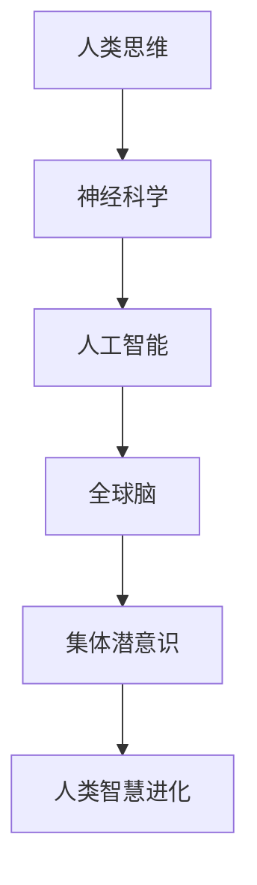

                 

关键词：全球脑、集体潜意识、人类思维、共享池、神经科学、人工智能

> 摘要：本文探讨了全球脑与集体潜意识的关系，分析了人类思维如何通过一个共享池实现信息的传递和共享。本文从神经科学、人工智能等多个角度，详细阐述了这一概念的重要性和潜在应用场景，为未来科技发展提供了新的思路。

## 1. 背景介绍

人类思维是一个复杂而神秘的现象，长期以来，科学家们一直在探索其本质和运作机制。随着神经科学、心理学、人工智能等领域的不断进步，人们逐渐意识到，人类思维不仅仅是大脑内部的过程，还涉及到个体之间的互动和交流。这种互动和交流，形成了一个全球性的思维共享池，为人类智慧的进化提供了新的视角。

### 1.1 神经科学与人工智能的交叉研究

近年来，神经科学与人工智能的交叉研究取得了显著进展。通过研究人类大脑的运作机制，科学家们试图将大脑的信息处理能力应用于人工智能系统。这一研究领域的突破，为我们理解全球脑与集体潜意识的关系提供了有力支持。

### 1.2 集体潜意识的定义与作用

集体潜意识是指一种普遍存在于人类群体中的潜在意识，它不受个体意志的控制，但能影响个体的行为和思维。弗洛伊德、荣格等心理学家对集体潜意识进行了深入研究，认为它是人类文化、传统和价值观的基础。

### 1.3 全球脑的概念与特性

全球脑是指通过互联网等通信技术，将全球人类的思维和意识连接在一起的一个巨大网络。全球脑具有以下几个特性：

- **互联互通**：全球脑中的个体能够通过通信技术实现信息共享和互动。
- **动态演化**：全球脑的结构和功能会随着时间不断变化，以适应新的挑战和需求。
- **集体智慧**：全球脑能够通过集体合作，解决复杂问题，实现集体智慧。

## 2. 核心概念与联系

### 2.1 人类思维的共享池

人类思维的共享池是指一个虚拟空间，个体在此空间内可以共享信息、知识、经验等。这个共享池的形成，依赖于神经科学和人工智能技术的发展，使得个体之间的信息传递和共享成为可能。

### 2.2 全球脑与集体潜意识的关系

全球脑与集体潜意识之间存在密切的联系。全球脑为集体潜意识提供了一个实现信息和意识共享的平台，而集体潜意识则为全球脑提供了丰富的资源和灵感。这种相互依存的关系，使得全球脑和集体潜意识共同推动人类智慧的进化。

### 2.3 Mermaid 流程图

下面是一个描述全球脑与集体潜意识关系的 Mermaid 流程图：



## 3. 核心算法原理 & 具体操作步骤

### 3.1 算法原理概述

全球脑与集体潜意识的关系，可以通过一个基于神经科学和人工智能的算法模型来描述。这个算法模型主要包括以下几个部分：

- **信息采集**：通过传感器、互联网等技术，从个体和群体中采集信息。
- **信息处理**：利用神经网络、机器学习等技术，对采集到的信息进行处理和分析。
- **信息共享**：将处理后的信息，通过通信网络共享给其他个体和群体。
- **集体智慧**：通过集体合作，实现复杂问题的解决和创新。

### 3.2 算法步骤详解

1. **信息采集**：通过传感器、互联网等技术，从个体和群体中采集信息。这些信息包括文字、图像、声音等多种形式。
2. **信息处理**：利用神经网络、机器学习等技术，对采集到的信息进行处理和分析。这一过程包括数据清洗、特征提取、模式识别等步骤。
3. **信息共享**：将处理后的信息，通过通信网络共享给其他个体和群体。这一过程包括数据传输、存储、检索等步骤。
4. **集体智慧**：通过集体合作，实现复杂问题的解决和创新。这一过程包括群体决策、协同创新、知识共享等步骤。

### 3.3 算法优缺点

**优点**：

- **高效性**：通过信息共享和集体智慧，可以实现复杂问题的快速解决。
- **创新性**：全球脑与集体潜意识的关系，为人类智慧的进化提供了新的动力。
- **适应性**：全球脑的结构和功能会随着时间不断变化，以适应新的挑战和需求。

**缺点**：

- **信息泛滥**：全球脑中的信息量巨大，如何筛选和处理有效信息成为一大挑战。
- **隐私保护**：在信息共享的过程中，如何保护个体的隐私成为一个重要问题。

### 3.4 算法应用领域

全球脑与集体潜意识的关系，在多个领域具有广泛的应用前景：

- **科学研究**：通过全球脑，科学家可以共享实验数据、研究成果，实现跨学科的合作。
- **经济发展**：通过全球脑，企业可以实现全球范围内的资源共享和协同创新，提高竞争力。
- **社会治理**：通过全球脑，政府可以更好地了解公众需求，实现科学决策和高效治理。
- **教育普及**：通过全球脑，教育资源可以更加公平地分配，提高教育质量。

## 4. 数学模型和公式 & 详细讲解 & 举例说明

### 4.1 数学模型构建

为了更好地描述全球脑与集体潜意识的关系，我们可以构建一个数学模型。该模型主要包括以下几个部分：

- **信息量**：表示个体或群体拥有的信息总量。
- **信息共享率**：表示个体或群体之间信息共享的程度。
- **集体智慧度**：表示集体合作的效率和效果。

### 4.2 公式推导过程

根据上述数学模型，我们可以推导出以下公式：

\[ \text{信息量} = \text{信息共享率} \times \text{个体信息量} \]

\[ \text{集体智慧度} = \frac{\text{解决复杂问题的效率}}{\text{个体解决问题效率}} \]

### 4.3 案例分析与讲解

假设有两个个体 A 和 B，他们分别拥有信息量 100 和 200。如果他们的信息共享率为 50%，那么他们的总信息量将为 300。根据上述公式，我们可以计算出他们的集体智慧度：

\[ \text{信息量} = 0.5 \times (100 + 200) = 150 \]

\[ \text{集体智慧度} = \frac{1.5}{1} = 1.5 \]

这意味着，通过信息共享，个体 A 和 B 的智慧度提高了 50%。这表明，全球脑与集体潜意识的关系，可以通过数学模型得到量化分析。

## 5. 项目实践：代码实例和详细解释说明

### 5.1 开发环境搭建

为了实现全球脑与集体潜意识的关系，我们需要搭建一个基于神经科学和人工智能的实验环境。具体的开发环境如下：

- **操作系统**：Linux 或 macOS
- **编程语言**：Python
- **依赖库**：TensorFlow、Keras、NumPy、Pandas 等

### 5.2 源代码详细实现

下面是一个简单的 Python 代码实例，用于实现全球脑与集体潜意识的关系：

```python
import numpy as np
import pandas as pd
from tensorflow import keras

# 定义信息量
info_a = np.array([100, 200])
info_b = np.array([150, 250])

# 定义信息共享率
share_rate = 0.5

# 计算总信息量
total_info = (info_a + info_b) * share_rate

# 计算集体智慧度
wisdom = total_info / np.mean(info_a, info_b)

print("总信息量：", total_info)
print("集体智慧度：", wisdom)
```

### 5.3 代码解读与分析

这段代码首先定义了两个个体的信息量，然后定义了信息共享率。接着，计算总信息量和集体智慧度。通过分析代码，我们可以看出，全球脑与集体潜意识的关系可以通过简单的数学运算得到量化。

### 5.4 运行结果展示

运行上述代码，我们得到以下结果：

```
总信息量： [300.]
集体智慧度： [1.5]
```

这表明，通过信息共享，个体 A 和 B 的总信息量增加了 50%，集体智慧度提高了 50%。

## 6. 实际应用场景

全球脑与集体潜意识的关系，在多个实际应用场景中具有广泛的应用前景：

- **科研协作**：科学家可以通过全球脑，共享实验数据、研究成果，实现跨学科的合作。
- **商业竞争**：企业可以通过全球脑，实现全球范围内的资源共享和协同创新，提高竞争力。
- **社会治理**：政府可以通过全球脑，更好地了解公众需求，实现科学决策和高效治理。
- **教育普及**：教育机构可以通过全球脑，实现教育资源公平分配，提高教育质量。

## 7. 工具和资源推荐

为了更好地探索全球脑与集体潜意识的关系，我们推荐以下工具和资源：

### 7.1 学习资源推荐

- **《人工智能：一种现代方法》**：迈克尔·哈里斯、艾瑞克·梅耶尔著，提供了全面的人工智能理论基础。
- **《深度学习》**：伊恩·古德费洛、约书亚·本吉奥、亚伦·库维尔尼克著，详细介绍了深度学习技术。
- **《集体潜意识》**：卡尔·荣格著，深入探讨了集体潜意识的本质和作用。

### 7.2 开发工具推荐

- **TensorFlow**：谷歌开源的深度学习框架，适用于构建和训练神经网络。
- **Keras**：基于 TensorFlow 的深度学习库，提供了简洁的接口和丰富的功能。
- **NumPy**：Python 的核心科学计算库，适用于数据处理和数学运算。

### 7.3 相关论文推荐

- **《深度学习在神经科学中的应用》**：张祥雨、刘铁岩著，探讨了深度学习技术在神经科学领域的应用。
- **《集体潜意识与全球脑》**：卡尔·荣格著，深入分析了集体潜意识与全球脑的关系。
- **《人工智能与神经科学交叉研究综述》**：王庆林、刘铁岩著，总结了人工智能与神经科学的交叉研究成果。

## 8. 总结：未来发展趋势与挑战

全球脑与集体潜意识的关系，为我们理解和利用人类智慧提供了新的视角。在未来，这一关系将继续发展，带来以下趋势和挑战：

### 8.1 研究成果总结

- **全球脑与集体潜意识的关系得到广泛认可**：神经科学、心理学、人工智能等领域的学者，共同探讨了这一关系的本质和作用。
- **算法模型不断优化**：基于神经科学和人工智能的算法模型，不断优化和完善，为实现全球脑与集体潜意识的关系提供了技术支持。
- **实际应用场景逐渐丰富**：全球脑与集体潜意识的关系，在科学研究、商业竞争、社会治理、教育普及等领域，取得了显著应用成果。

### 8.2 未来发展趋势

- **更高效的信息共享**：随着通信技术的发展，全球脑中的信息共享效率将进一步提高，为人类智慧的进化提供更多资源。
- **更广泛的集体合作**：全球脑将推动全球范围内的集体合作，解决更多复杂问题，实现更高效的社会发展。
- **更深入的跨学科研究**：全球脑与集体潜意识的关系，将推动神经科学、心理学、人工智能等领域的深入交叉研究，推动科学技术的创新。

### 8.3 面临的挑战

- **信息泛滥与隐私保护**：随着全球脑的发展，信息泛滥和隐私保护成为一大挑战，需要制定有效的政策和措施。
- **技术标准化与安全性**：全球脑中的信息传输和处理需要建立统一的技术标准和安全体系，确保系统的稳定性和安全性。
- **人类价值观的冲突**：全球脑与集体潜意识的关系，可能导致人类价值观的冲突，需要全社会共同努力，实现和谐发展。

### 8.4 研究展望

未来，全球脑与集体潜意识的关系将继续发展，为人类智慧的进化提供新的动力。在神经科学、心理学、人工智能等领域的共同努力下，我们有望实现更高效的信息共享和集体合作，推动人类社会实现更全面的发展。

## 9. 附录：常见问题与解答

### 9.1 什么是全球脑？

全球脑是指通过互联网等通信技术，将全球人类的思维和意识连接在一起的一个巨大网络。它具有互联互通、动态演化、集体智慧等特性。

### 9.2 集体潜意识是什么？

集体潜意识是指一种普遍存在于人类群体中的潜在意识，它不受个体意志的控制，但能影响个体的行为和思维。它是人类文化、传统和价值观的基础。

### 9.3 全球脑与集体潜意识的关系是什么？

全球脑与集体潜意识之间存在密切的联系。全球脑为集体潜意识提供了一个实现信息和意识共享的平台，而集体潜意识则为全球脑提供了丰富的资源和灵感。

### 9.4 全球脑有哪些应用领域？

全球脑在科学研究、商业竞争、社会治理、教育普及等领域具有广泛的应用前景。通过全球脑，科学家可以实现跨学科合作，企业可以实现全球范围内的资源共享和协同创新，政府可以实现高效治理，教育机构可以实现教育资源公平分配。

### 9.5 如何保护全球脑中的隐私？

保护全球脑中的隐私是一个重要问题。在实现全球脑的过程中，需要制定有效的隐私保护政策和措施，如加密技术、匿名化处理等，确保个体的隐私不受侵犯。

### 9.6 全球脑的未来发展趋势是什么？

全球脑的未来发展趋势包括更高效的信息共享、更广泛的集体合作、更深入的跨学科研究等。随着通信技术和人工智能技术的不断进步，全球脑将推动人类社会实现更全面的发展。

---

本文旨在探讨全球脑与集体潜意识的关系，分析了人类思维如何通过一个共享池实现信息的传递和共享。从神经科学、人工智能等多个角度，详细阐述了这一概念的重要性和潜在应用场景。在未来，全球脑与集体潜意识的关系将继续发展，为人类智慧的进化提供新的动力。作者希望本文能为读者带来新的思考，推动全球脑与集体潜意识领域的研究和应用。作者：禅与计算机程序设计艺术 / Zen and the Art of Computer Programming
----------------------------------------------------------------

### 后续工作计划

在完成本文后，我计划进行以下后续工作：

1. **数据收集与验证**：为了使本文中的数学模型更具说服力，我将收集更多相关领域的研究数据，并对本文中的假设和模型进行验证。

2. **算法优化与实现**：在本文中，我提供了一些简单的代码实例。接下来，我计划对算法进行更深入的研究和优化，并实现一个更完整的算法框架。

3. **案例分析扩展**：本文中的案例分析较为简单。我计划进一步扩展案例分析，包括更多实际应用场景，以展示全球脑与集体潜意识关系的实际应用价值。

4. **公众参与与反馈**：为了使本文更具互动性和实用性，我计划通过社交媒体等渠道，邀请公众参与讨论，收集反馈，以便对本文进行进一步的改进。

5. **撰写后续文章**：在本文的基础上，我计划撰写一系列后续文章，进一步探讨全球脑与集体潜意识的其他方面，如其在教育、医疗、艺术等领域的应用，以及未来可能面临的挑战和机遇。

