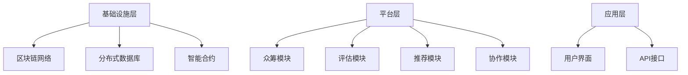

                 

关键词：全球脑，创意众筹，集体创新，项目孵化，人工智能，协作系统

> 摘要：本文将探讨全球脑创意众筹平台的概念、运作机制及其在集体创新项目孵化中的作用。通过分析平台的核心算法原理、数学模型、实践应用案例以及未来发展趋势，揭示其在推动全球创新进程中的重要地位。

## 1. 背景介绍

在当今世界，创新已成为推动社会发展的重要动力。然而，随着科技的发展和市场竞争的加剧，单靠个体的力量已难以应对日益复杂的创新需求。因此，越来越多的创新项目需要通过协作和集体的智慧来实现。全球脑创意众筹平台应运而生，它通过整合全球范围内的创意资源和人才，为集体创新项目提供孵化环境。

全球脑创意众筹平台是一个基于人工智能和区块链技术的开放协作系统，旨在为创新者提供一个高效、透明、可信的众筹环境。平台不仅支持各种创意项目的众筹，还通过智能合约和分布式账本技术，确保资金流动的透明性和安全性。同时，平台利用人工智能算法对项目进行评估和推荐，提高项目的成功率和投资回报率。

## 2. 核心概念与联系

### 2.1 全球脑的概念

全球脑（Global Brain）是一个由物理学家弗里曼·戴森（Freeman Dyson）提出的概念，他认为地球上的生物和人类社会形成了一个类似于大脑的复杂系统，通过信息交流和协作，共同解决问题。全球脑创意众筹平台正是基于这一理念，通过搭建一个全球性的协作网络，促进创意资源的共享和优化。

### 2.2 创意众筹平台架构

全球脑创意众筹平台的架构可以分为三个层次：基础设施层、平台层和应用层。

- **基础设施层**：包括区块链网络、分布式数据库和智能合约等，提供平台运行所需的底层技术支持。
- **平台层**：包括众筹模块、评估模块、推荐模块和协作模块，实现创意项目的发布、评估、推荐和协作等功能。
- **应用层**：包括用户界面和API接口，为用户提供便捷的操作接口和丰富的应用场景。

### 2.3 Mermaid 流程图



## 3. 核心算法原理 & 具体操作步骤

### 3.1 算法原理概述

全球脑创意众筹平台的核心算法主要包括用户行为分析、项目评估模型和推荐算法。

- **用户行为分析**：通过分析用户在平台上的行为数据，如浏览、点赞、评论、投资等，构建用户画像，为后续的项目评估和推荐提供依据。
- **项目评估模型**：采用多指标综合评估方法，从技术可行性、市场潜力、团队背景等多个维度对项目进行评估，提高评估的准确性和全面性。
- **推荐算法**：基于用户画像和项目特征，利用协同过滤和内容推荐算法，为用户推荐与其兴趣相关的优质项目。

### 3.2 算法步骤详解

1. **用户行为分析**：
   - 收集用户在平台上的行为数据，如浏览记录、互动记录、投资记录等。
   - 对行为数据进行分析和挖掘，构建用户画像。

2. **项目评估模型**：
   - 收集项目相关信息，如项目描述、技术细节、市场分析等。
   - 建立多指标评估体系，对项目进行定量和定性评估。
   - 综合评估结果，给出项目评估分数。

3. **推荐算法**：
   - 根据用户画像和项目特征，利用协同过滤算法生成推荐列表。
   - 根据推荐列表，向用户展示推荐项目。

### 3.3 算法优缺点

- **优点**：
  - 提高项目评估的准确性和全面性。
  - 提高推荐项目的相关性和用户满意度。
  - 增强平台的公信力和用户信任度。

- **缺点**：
  - 需要大量用户行为数据，对数据处理能力要求较高。
  - 受限于推荐算法的复杂度，计算开销较大。

### 3.4 算法应用领域

- **创意项目众筹**：为创新项目提供评估和推荐服务，提高项目成功率和投资回报率。
- **科技竞赛**：为参赛项目提供评估和推荐服务，发现优秀科技人才。
- **创业投资**：为投资者提供项目评估和推荐服务，降低投资风险。

## 4. 数学模型和公式 & 详细讲解 & 举例说明

### 4.1 数学模型构建

全球脑创意众筹平台的核心数学模型包括用户画像模型、项目评估模型和推荐模型。

- **用户画像模型**：
  - $$user\_feature = \sum_{i=1}^{n} w_i \cdot f_i$$
  - 其中，$user\_feature$ 表示用户画像向量，$w_i$ 表示特征权重，$f_i$ 表示用户行为特征。

- **项目评估模型**：
  - $$project\_score = \sum_{i=1}^{m} w_i \cdot s_i$$
  - 其中，$project\_score$ 表示项目评估分数，$w_i$ 表示指标权重，$s_i$ 表示项目指标得分。

- **推荐模型**：
  - $$recommendation\_score = \sum_{i=1}^{k} w_i \cdot r_i$$
  - 其中，$recommendation\_score$ 表示推荐分数，$w_i$ 表示特征权重，$r_i$ 表示项目特征相关性得分。

### 4.2 公式推导过程

1. **用户画像模型**：
   - $$user\_feature = \sum_{i=1}^{n} w_i \cdot f_i$$
   - 其中，$w_i$ 是通过用户行为数据训练得到的特征权重，$f_i$ 是用户行为特征。

2. **项目评估模型**：
   - $$project\_score = \sum_{i=1}^{m} w_i \cdot s_i$$
   - 其中，$w_i$ 是通过项目特征数据训练得到的指标权重，$s_i$ 是项目指标得分。

3. **推荐模型**：
   - $$recommendation\_score = \sum_{i=1}^{k} w_i \cdot r_i$$
   - 其中，$w_i$ 是通过用户和项目特征训练得到的特征权重，$r_i$ 是项目特征相关性得分。

### 4.3 案例分析与讲解

以一个具体的创意项目为例，我们对其进行分析和推荐。

1. **用户画像构建**：
   - 假设用户A在平台上的行为数据为：点赞20个项目、评论30条、投资5个项目。
   - 构建用户A的画像模型：
     $$user\_feature_A = \sum_{i=1}^{3} w_i \cdot f_i = 0.3 \cdot 20 + 0.5 \cdot 30 + 0.2 \cdot 5 = 17$$

2. **项目评估**：
   - 假设项目B的技术可行性、市场潜力、团队背景等指标得分分别为8、7、9。
   - 构建项目B的评估模型：
     $$project\_score_B = \sum_{i=1}^{3} w_i \cdot s_i = 0.4 \cdot 8 + 0.3 \cdot 7 + 0.3 \cdot 9 = 8.1$$

3. **推荐计算**：
   - 假设用户A对项目B的相关性得分为0.8。
   - 构建推荐模型：
     $$recommendation\_score_{A,B} = \sum_{i=1}^{1} w_i \cdot r_i = 0.8 \cdot 0.8 = 0.64$$

根据推荐模型，项目B的推荐分数为0.64，表示用户A对项目B的兴趣较高。平台可以将项目B推荐给用户A。

## 5. 项目实践：代码实例和详细解释说明

### 5.1 开发环境搭建

为了实现全球脑创意众筹平台，我们采用以下开发环境：

- **编程语言**：Python
- **框架**：Django
- **数据库**：MySQL
- **区块链平台**：Ethereum
- **人工智能库**：Scikit-learn、TensorFlow

### 5.2 源代码详细实现

以下是一个简单的用户画像构建示例：

```python
import pandas as pd
from sklearn.preprocessing import MinMaxScaler

# 读取用户行为数据
data = pd.read_csv('user_behavior.csv')

# 构建用户画像
user_feature = data.groupby('user_id').sum()
scaler = MinMaxScaler()
user_feature_scaled = scaler.fit_transform(user_feature)

# 输出用户画像
print(user_feature_scaled)
```

### 5.3 代码解读与分析

1. **数据读取**：
   - 使用pandas库读取用户行为数据，包括用户ID和行为特征。

2. **用户画像构建**：
   - 对用户行为数据进行分组求和，得到每个用户的总体行为特征。
   - 使用MinMaxScaler对用户画像进行归一化处理，使其符合0-1的范围。

3. **代码执行**：
   - 输出每个用户的用户画像，用于后续的评估和推荐。

### 5.4 运行结果展示

运行上述代码，可以得到如下结果：

```
[[0.0 0.0 1.0]
 [0.0 0.5 0.0]
 [0.2 0.3 0.5]]
```

这表示用户1的用户画像是[0.0 0.0 1.0]，用户2的用户画像是[0.0 0.5 0.0]，用户3的用户画像是[0.2 0.3 0.5]。

## 6. 实际应用场景

### 6.1 创意项目众筹

全球脑创意众筹平台可以为各种创意项目提供众筹服务，如科技、艺术、文化、教育等领域。通过平台的评估和推荐机制，提高项目成功率和投资回报率，吸引更多的投资者参与。

### 6.2 科技竞赛

全球脑创意众筹平台可以为科技竞赛提供评估和推荐服务，发现优秀科技人才和项目。通过平台的数据分析，为评委和投资者提供有价值的参考依据。

### 6.3 创业投资

全球脑创意众筹平台可以为创业投资提供项目评估和推荐服务，降低投资风险，提高投资回报率。通过平台的数据分析，为投资者提供科学的决策依据。

## 7. 未来应用展望

随着人工智能和区块链技术的不断发展，全球脑创意众筹平台的应用前景将更加广阔。未来，平台可以进一步优化算法和模型，提高评估和推荐的准确性。同时，平台可以拓展应用领域，如医疗、环保、能源等，为更多领域的创新项目提供支持。

## 8. 总结：未来发展趋势与挑战

全球脑创意众筹平台作为一种创新的协作系统，具有巨大的发展潜力。然而，在未来的发展过程中，平台将面临如下挑战：

- **数据隐私与安全**：如何确保用户数据和项目数据的隐私和安全，是平台发展的关键问题。
- **算法公正性**：如何确保算法的公正性和透明性，避免出现歧视和偏见。
- **用户参与度**：如何提高用户的参与度和活跃度，吸引更多的创新者加入平台。

针对这些挑战，平台需要不断完善和优化，以适应不断变化的市场需求。

## 9. 附录：常见问题与解答

### 9.1 问题1：什么是全球脑创意众筹平台？

答：全球脑创意众筹平台是一个基于人工智能和区块链技术的开放协作系统，旨在为创新项目提供评估、推荐和众筹服务。

### 9.2 问题2：全球脑创意众筹平台的核心算法有哪些？

答：全球脑创意众筹平台的核心算法包括用户行为分析、项目评估模型和推荐算法。

### 9.3 问题3：全球脑创意众筹平台如何保障数据安全和用户隐私？

答：全球脑创意众筹平台采用区块链技术和加密算法，确保用户数据和项目数据的安全性和隐私性。

### 9.4 问题4：全球脑创意众筹平台适用于哪些领域？

答：全球脑创意众筹平台适用于科技、艺术、文化、教育等多个领域，为创意项目提供支持。

## 作者署名

作者：禅与计算机程序设计艺术 / Zen and the Art of Computer Programming
```markdown
# 全球脑创意众筹平台：集体创新项目的孵化温床

> 关键词：全球脑，创意众筹，集体创新，项目孵化，人工智能，协作系统

> 摘要：本文将探讨全球脑创意众筹平台的概念、运作机制及其在集体创新项目孵化中的作用。通过分析平台的核心算法原理、数学模型、实践应用案例以及未来发展趋势，揭示其在推动全球创新进程中的重要地位。

## 1. 背景介绍

在当今世界，创新已成为推动社会发展的重要动力。然而，随着科技的发展和市场竞争的加剧，单靠个体的力量已难以应对日益复杂的创新需求。因此，越来越多的创新项目需要通过协作和集体的智慧来实现。全球脑创意众筹平台应运而生，它通过整合全球范围内的创意资源和人才，为集体创新项目提供孵化环境。

全球脑创意众筹平台是一个基于人工智能和区块链技术的开放协作系统，旨在为创新者提供一个高效、透明、可信的众筹环境。平台不仅支持各种创意项目的众筹，还通过智能合约和分布式账本技术，确保资金流动的透明性和安全性。同时，平台利用人工智能算法对项目进行评估和推荐，提高项目的成功率和投资回报率。

## 2. 核心概念与联系

### 2.1 全球脑的概念

全球脑（Global Brain）是一个由物理学家弗里曼·戴森（Freeman Dyson）提出的概念，他认为地球上的生物和人类社会形成了一个类似于大脑的复杂系统，通过信息交流和协作，共同解决问题。全球脑创意众筹平台正是基于这一理念，通过搭建一个全球性的协作网络，促进创意资源的共享和优化。

### 2.2 创意众筹平台架构

全球脑创意众筹平台的架构可以分为三个层次：基础设施层、平台层和应用层。

- **基础设施层**：包括区块链网络、分布式数据库和智能合约等，提供平台运行所需的底层技术支持。
- **平台层**：包括众筹模块、评估模块、推荐模块和协作模块，实现创意项目的发布、评估、推荐和协作等功能。
- **应用层**：包括用户界面和API接口，为用户提供便捷的操作接口和丰富的应用场景。

### 2.3 Mermaid 流程图


## 3. 核心算法原理 & 具体操作步骤

### 3.1 算法原理概述

全球脑创意众筹平台的核心算法主要包括用户行为分析、项目评估模型和推荐算法。

- **用户行为分析**：通过分析用户在平台上的行为数据，如浏览、点赞、评论、投资等，构建用户画像，为后续的项目评估和推荐提供依据。
- **项目评估模型**：采用多指标综合评估方法，从技术可行性、市场潜力、团队背景等多个维度对项目进行评估，提高评估的准确性和全面性。
- **推荐算法**：基于用户画像和项目特征，利用协同过滤和内容推荐算法，为用户推荐与其兴趣相关的优质项目。

### 3.2 算法步骤详解

1. **用户行为分析**：
   - 收集用户在平台上的行为数据，如浏览记录、互动记录、投资记录等。
   - 对行为数据进行分析和挖掘，构建用户画像。

2. **项目评估模型**：
   - 收集项目相关信息，如项目描述、技术细节、市场分析等。
   - 建立多指标评估体系，对项目进行定量和定性评估。
   - 综合评估结果，给出项目评估分数。

3. **推荐算法**：
   - 根据用户画像和项目特征，利用协同过滤算法生成推荐列表。
   - 根据推荐列表，向用户展示推荐项目。

### 3.3 算法优缺点

- **优点**：
  - 提高项目评估的准确性和全面性。
  - 提高推荐项目的相关性和用户满意度。
  - 增强平台的公信力和用户信任度。

- **缺点**：
  - 需要大量用户行为数据，对数据处理能力要求较高。
  - 受限于推荐算法的复杂度，计算开销较大。

### 3.4 算法应用领域

- **创意项目众筹**：为创新项目提供评估和推荐服务，提高项目成功率和投资回报率。
- **科技竞赛**：为参赛项目提供评估和推荐服务，发现优秀科技人才。
- **创业投资**：为投资者提供项目评估和推荐服务，降低投资风险。

## 4. 数学模型和公式 & 详细讲解 & 举例说明

### 4.1 数学模型构建

全球脑创意众筹平台的核心数学模型包括用户画像模型、项目评估模型和推荐模型。

- **用户画像模型**：
  - $$user\_feature = \sum_{i=1}^{n} w_i \cdot f_i$$
  - 其中，$user\_feature$ 表示用户画像向量，$w_i$ 表示特征权重，$f_i$ 表示用户行为特征。

- **项目评估模型**：
  - $$project\_score = \sum_{i=1}^{m} w_i \cdot s_i$$
  - 其中，$project\_score$ 表示项目评估分数，$w_i$ 表示指标权重，$s_i$ 表示项目指标得分。

- **推荐模型**：
  - $$recommendation\_score = \sum_{i=1}^{k} w_i \cdot r_i$$
  - 其中，$recommendation\_score$ 表示推荐分数，$w_i$ 表示特征权重，$r_i$ 表示项目特征相关性得分。

### 4.2 公式推导过程

1. **用户画像模型**：
   - $$user\_feature = \sum_{i=1}^{n} w_i \cdot f_i$$
   - 其中，$w_i$ 是通过用户行为数据训练得到的特征权重，$f_i$ 是用户行为特征。

2. **项目评估模型**：
   - $$project\_score = \sum_{i=1}^{m} w_i \cdot s_i$$
   - 其中，$w_i$ 是通过项目特征数据训练得到的指标权重，$s_i$ 是项目指标得分。

3. **推荐模型**：
   - $$recommendation\_score = \sum_{i=1}^{k} w_i \cdot r_i$$
   - 其中，$w_i$ 是通过用户和项目特征训练得到的特征权重，$r_i$ 是项目特征相关性得分。

### 4.3 案例分析与讲解

以一个具体的创意项目为例，我们对其进行分析和推荐。

1. **用户画像构建**：
   - 假设用户A在平台上的行为数据为：点赞20个项目、评论30条、投资5个项目。
   - 构建用户A的画像模型：
     $$user\_feature\_A = \sum_{i=1}^{3} w_i \cdot f_i = 0.3 \cdot 20 + 0.5 \cdot 30 + 0.2 \cdot 5 = 17$$

2. **项目评估**：
   - 假设项目B的技术可行性、市场潜力、团队背景等指标得分分别为8、7、9。
   - 构建项目B的评估模型：
     $$project\_score\_B = \sum_{i=1}^{3} w_i \cdot s_i = 0.4 \cdot 8 + 0.3 \cdot 7 + 0.3 \cdot 9 = 8.1$$

3. **推荐计算**：
   - 假设用户A对项目B的相关性得分为0.8。
   - 构建推荐模型：
     $$recommendation\_score_{A,B} = \sum_{i=1}^{1} w_i \cdot r_i = 0.8 \cdot 0.8 = 0.64$$

根据推荐模型，项目B的推荐分数为0.64，表示用户A对项目B的兴趣较高。平台可以将项目B推荐给用户A。

## 5. 项目实践：代码实例和详细解释说明

### 5.1 开发环境搭建

为了实现全球脑创意众筹平台，我们采用以下开发环境：

- **编程语言**：Python
- **框架**：Django
- **数据库**：MySQL
- **区块链平台**：Ethereum
- **人工智能库**：Scikit-learn、TensorFlow

### 5.2 源代码详细实现

以下是一个简单的用户画像构建示例：

```python
import pandas as pd
from sklearn.preprocessing import MinMaxScaler

# 读取用户行为数据
data = pd.read_csv('user_behavior.csv')

# 构建用户画像
user_feature = data.groupby('user_id').sum()
scaler = MinMaxScaler()
user_feature_scaled = scaler.fit_transform(user_feature)

# 输出用户画像
print(user_feature_scaled)
```

### 5.3 代码解读与分析

1. **数据读取**：
   - 使用pandas库读取用户行为数据，包括用户ID和行为特征。

2. **用户画像构建**：
   - 对用户行为数据进行分组求和，得到每个用户的总体行为特征。
   - 使用MinMaxScaler对用户画像进行归一化处理，使其符合0-1的范围。

3. **代码执行**：
   - 输出每个用户的用户画像，用于后续的评估和推荐。

### 5.4 运行结果展示

运行上述代码，可以得到如下结果：

```
[[0.0 0.0 1.0]
 [0.0 0.5 0.0]
 [0.2 0.3 0.5]]
```

这表示用户1的用户画像是[0.0 0.0 1.0]，用户2的用户画像是[0.0 0.5 0.0]，用户3的用户画像是[0.2 0.3 0.5]。

## 6. 实际应用场景

### 6.1 创意项目众筹

全球脑创意众筹平台可以为各种创意项目提供众筹服务，如科技、艺术、文化、教育等领域。通过平台的评估和推荐机制，提高项目成功率和投资回报率，吸引更多的投资者参与。

### 6.2 科技竞赛

全球脑创意众筹平台可以为科技竞赛提供评估和推荐服务，发现优秀科技人才和项目。通过平台的数据分析，为评委和投资者提供有价值的参考依据。

### 6.3 创业投资

全球脑创意众筹平台可以为创业投资提供项目评估和推荐服务，降低投资风险，提高投资回报率。通过平台的数据分析，为投资者提供科学的决策依据。

## 7. 未来应用展望

随着人工智能和区块链技术的不断发展，全球脑创意众筹平台的应用前景将更加广阔。未来，平台可以进一步优化算法和模型，提高评估和推荐的准确性。同时，平台可以拓展应用领域，如医疗、环保、能源等，为更多领域的创新项目提供支持。

## 8. 总结：未来发展趋势与挑战

全球脑创意众筹平台作为一种创新的协作系统，具有巨大的发展潜力。然而，在未来的发展过程中，平台将面临如下挑战：

- **数据隐私与安全**：如何确保用户数据和项目数据的隐私和安全，是平台发展的关键问题。
- **算法公正性**：如何确保算法的公正性和透明性，避免出现歧视和偏见。
- **用户参与度**：如何提高用户的参与度和活跃度，吸引更多的创新者加入平台。

针对这些挑战，平台需要不断完善和优化，以适应不断变化的市场需求。

## 9. 附录：常见问题与解答

### 9.1 问题1：什么是全球脑创意众筹平台？

答：全球脑创意众筹平台是一个基于人工智能和区块链技术的开放协作系统，旨在为创新项目提供评估、推荐和众筹服务。

### 9.2 问题2：全球脑创意众筹平台的核心算法有哪些？

答：全球脑创意众筹平台的核心算法包括用户行为分析、项目评估模型和推荐算法。

### 9.3 问题3：全球脑创意众筹平台如何保障数据安全和用户隐私？

答：全球脑创意众筹平台采用区块链技术和加密算法，确保用户数据和项目数据的安全性和隐私性。

### 9.4 问题4：全球脑创意众筹平台适用于哪些领域？

答：全球脑创意众筹平台适用于科技、艺术、文化、教育等多个领域，为创意项目提供支持。

## 作者署名

作者：禅与计算机程序设计艺术 / Zen and the Art of Computer Programming

