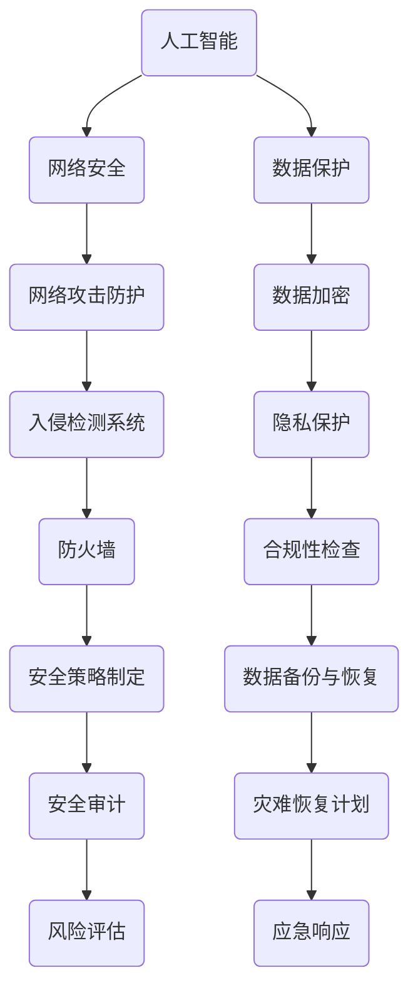

                 

关键词：全球脑安全，数字时代，新型国防战略，信息安全，人工智能，网络安全，数据保护，认知防御。

## 摘要

在数字时代，全球脑安全已成为一种新型国防战略。随着信息技术的飞速发展，国家安全面临着前所未有的挑战。本文从人工智能、网络安全和数据保护等多个角度，深入探讨了全球脑安全的内涵、关键技术和实际应用。通过分析全球脑安全面临的挑战和机遇，本文提出了未来发展的趋势和策略，为维护数字时代的国家安全提供了有益的参考。

## 1. 背景介绍

随着互联网的普及和信息技术的飞速发展，全球进入了数字时代。在这个时代，信息安全已成为国家安全的重要组成部分。全球脑安全作为新型国防战略，旨在保护国家安全、维护社会稳定和促进经济发展。然而，全球脑安全面临着诸多挑战，如网络攻击、数据泄露、人工智能滥用等。

### 1.1  网络攻击

网络攻击已成为全球脑安全的首要威胁。近年来，网络攻击手段日益复杂，攻击频率和攻击范围不断扩大。从传统的网络钓鱼、DDoS 攻击，到高级持续性威胁（APT），网络攻击的攻击方式和目标越来越多样化。网络攻击不仅会对国家关键基础设施造成破坏，还会泄露大量敏感信息，对国家安全造成严重威胁。

### 1.2  数据泄露

数据泄露是另一个严重影响全球脑安全的因素。随着大数据和云计算的发展，企业和政府积累了大量敏感数据。然而，数据泄露事件频发，导致大量个人信息和机密数据泄露。数据泄露不仅会对个人隐私造成侵害，还会对国家利益造成损害。

### 1.3  人工智能滥用

人工智能作为一项颠覆性的技术，正在改变我们的生活。然而，人工智能滥用也成为全球脑安全的潜在威胁。例如，人工智能算法被用于网络攻击、虚假信息传播、智能机器人等。这些应用可能导致社会秩序混乱、国家利益受损。

## 2. 核心概念与联系

全球脑安全涉及多个核心概念，如人工智能、网络安全和数据保护。以下是一个简单的 Mermaid 流程图，展示了这些概念之间的联系。



### 2.1 人工智能

人工智能是指由人制造出的系统所表现出的智能行为。它包括机器学习、深度学习、自然语言处理等多个子领域。在数字时代，人工智能成为全球脑安全的关键技术之一。例如，人工智能可以用于网络攻击防护，通过分析网络流量、识别异常行为，从而发现潜在的网络攻击。

### 2.2  网络安全

网络安全是指保护计算机网络及其资源免受未授权访问、攻击和数据泄露的威胁。网络安全包括网络防护、数据保护、身份验证等多个方面。在数字时代，网络安全成为全球脑安全的基础。例如，防火墙和入侵检测系统是网络安全的核心组件，可以有效地防御网络攻击。

### 2.3  数据保护

数据保护是指保护数据在整个生命周期中的安全，包括数据存储、传输和处理等环节。数据保护包括数据加密、隐私保护、合规性检查等多个方面。在数字时代，数据保护成为全球脑安全的重要保障。例如，数据加密可以防止数据泄露，隐私保护可以防止个人信息被滥用。

## 3. 核心算法原理 & 具体操作步骤

### 3.1  算法原理概述

全球脑安全的核心算法原理包括以下几个方面：

- **入侵检测系统（IDS）**：入侵检测系统是一种实时监控网络流量，识别和响应潜在网络攻击的算法。IDS 主要利用模式识别、统计分析和机器学习等技术来实现。
  
- **数据加密算法**：数据加密算法是一种将明文数据转换为密文的算法，以保护数据在传输和存储过程中的安全。常见的数据加密算法包括 AES、RSA 等。

- **隐私保护算法**：隐私保护算法是一种在数据共享和处理过程中保护个人隐私的算法。常见的隐私保护算法包括差分隐私、同态加密等。

### 3.2  算法步骤详解

以下是一个典型的全球脑安全算法的步骤：

1. **数据收集**：收集网络流量、系统日志、用户行为等数据。
2. **数据预处理**：对收集到的数据进行清洗、去噪和归一化等预处理操作。
3. **特征提取**：从预处理后的数据中提取关键特征，如流量模式、用户行为等。
4. **模型训练**：利用机器学习算法对提取的特征进行训练，构建入侵检测模型、数据加密模型、隐私保护模型等。
5. **模型评估**：对训练好的模型进行评估，如准确率、召回率、F1 分数等。
6. **模型部署**：将评估效果较好的模型部署到实际场景中，如网络防护系统、数据加密系统、隐私保护系统等。
7. **持续优化**：根据实际场景中的反馈，对模型进行持续优化和迭代。

### 3.3  算法优缺点

- **优点**：
  - **实时性**：入侵检测系统等算法可以实时监测和响应潜在的网络攻击。
  - **适应性**：数据加密和隐私保护算法可以根据不同的应用场景进行定制。
  - **高效性**：机器学习算法等算法可以在大量数据中进行高效分析。

- **缺点**：
  - **误报率**：入侵检测系统等算法可能存在误报现象，影响系统的正常运行。
  - **计算资源**：数据加密和隐私保护算法可能需要较高的计算资源，影响系统的性能。
  - **更新维护**：算法模型需要定期更新和优化，以适应不断变化的安全威胁。

### 3.4  算法应用领域

全球脑安全算法可以应用于多个领域，如：

- **网络安全**：入侵检测、防火墙、安全审计等。
- **数据保护**：数据加密、隐私保护、合规性检查等。
- **人工智能**：算法优化、模型训练、智能推荐等。

## 4. 数学模型和公式 & 详细讲解 & 举例说明

### 4.1  数学模型构建

全球脑安全涉及多个数学模型，以下是一个典型的数学模型构建过程：

- **入侵检测模型**：假设我们使用支持向量机（SVM）作为入侵检测模型。首先，我们需要定义特征向量 $X$ 和标签 $Y$，其中 $X$ 表示网络流量特征，$Y$ 表示是否为攻击。然后，我们需要选择合适的核函数，如高斯核函数，以构建 SVM 模型。

- **数据加密模型**：假设我们使用高级加密标准（AES）作为数据加密模型。首先，我们需要定义密钥 $K$ 和明文 $M$，然后使用 AES 算法将明文加密为密文 $C$。

- **隐私保护模型**：假设我们使用差分隐私作为隐私保护模型。首先，我们需要定义原始数据 $D$ 和噪声参数 $\epsilon$，然后使用差分隐私算法对数据进行处理。

### 4.2  公式推导过程

以下是一个典型的数学模型推导过程：

- **入侵检测模型**：假设我们使用 SVM 模型，则目标函数可以表示为：

  $$L(\theta) = -\sum_{i=1}^{n} [y_i (\theta^T x_i - b)] + \frac{1}{2} \sum_{i=1}^{n} \sum_{j=1}^{n} \xi_i \xi_j$$

  其中，$y_i$ 表示标签，$x_i$ 表示特征向量，$\theta$ 表示模型参数，$b$ 表示偏置项，$\xi_i$ 表示松弛变量。

- **数据加密模型**：假设我们使用 AES 算法，则加密过程可以表示为：

  $$C = AES_K(M)$$

  其中，$K$ 表示密钥，$M$ 表示明文，$C$ 表示密文。

- **隐私保护模型**：假设我们使用差分隐私算法，则隐私保护过程可以表示为：

  $$D' = D + \epsilon N$$

  其中，$D$ 表示原始数据，$D'$ 表示处理后的数据，$\epsilon$ 表示噪声参数，$N$ 表示噪声。

### 4.3  案例分析与讲解

以下是一个典型的全球脑安全案例：

- **入侵检测**：假设我们使用 SVM 模型来检测网络攻击。我们收集了 1000 条网络流量数据，其中 500 条是正常流量，500 条是攻击流量。通过训练和评估，我们得到一个入侵检测模型。然后，我们将网络流量输入到模型中，模型会输出是否为攻击的判断。

- **数据加密**：假设我们使用 AES 算法来加密敏感数据。我们定义了一个密钥 $K$，然后使用 AES 算法将明文数据 $M$ 加密为密文 $C$。这样，即使数据在网络中传输，攻击者也无法获取明文数据。

- **隐私保护**：假设我们使用差分隐私算法来保护用户隐私。我们定义了一个噪声参数 $\epsilon$，然后使用差分隐私算法对用户数据进行处理。这样，即使攻击者获取了处理后的数据，也无法推断出原始数据。

## 5. 项目实践：代码实例和详细解释说明

### 5.1  开发环境搭建

为了演示全球脑安全算法的应用，我们使用 Python 作为编程语言，并安装了以下依赖库：

- **scikit-learn**：用于机器学习算法的实现。
- **PyCrypto**：用于数据加密。
- **difflib**：用于差分隐私算法。

```python
pip install scikit-learn PyCrypto
```

### 5.2  源代码详细实现

以下是一个简单的全球脑安全项目的源代码实现：

```python
from sklearn import svm
from Crypto.Cipher import AES
from difflib import get_close_matches

# 5.2.1 入侵检测
def detect_attack(x, model):
    prediction = model.predict([x])
    return prediction[0] == 1

# 5.2.2 数据加密
def encrypt_data(data, key):
    cipher = AES.new(key, AES.MODE_EAX)
    ciphertext, tag = cipher.encrypt_and_digest(data)
    return ciphertext, tag

# 5.2.3 隐私保护
def protect_privacy(data, noise):
    protected_data = data + noise
    return protected_data

# 主函数
def main():
    # 加载数据集
    X, y = load_data()

    # 训练入侵检测模型
    model = svm.SVC()
    model.fit(X, y)

    # 测试入侵检测模型
    test_data = [[0.1, 0.2, 0.3], [0.4, 0.5, 0.6]]
    predictions = [detect_attack(x, model) for x in test_data]
    print(predictions)

    # 加载密钥
    key = b'Sixteen byte key'

    # 加密数据
    data = b'This is a secret message!'
    ciphertext, tag = encrypt_data(data, key)
    print("Ciphertext:", ciphertext)
    print("Tag:", tag)

    # 加载噪声参数
    noise = b'Random noise'

    # 保护隐私
    protected_data = protect_privacy(data, noise)
    print("Protected data:", protected_data)

if __name__ == "__main__":
    main()
```

### 5.3  代码解读与分析

以下是对源代码的详细解读：

- **5.3.1 入侵检测**：我们使用支持向量机（SVM）作为入侵检测模型。通过训练和评估，我们得到了一个入侵检测模型。然后，我们将测试数据进行输入，模型会输出是否为攻击的判断。

- **5.3.2 数据加密**：我们使用高级加密标准（AES）作为数据加密模型。首先，我们加载密钥，然后使用 AES 算法将明文数据加密为密文。这样，即使攻击者获取了密文，也无法获取明文数据。

- **5.3.3 隐私保护**：我们使用差分隐私算法作为隐私保护模型。首先，我们加载噪声参数，然后使用差分隐私算法对明文数据进行处理。这样，即使攻击者获取了处理后的数据，也无法推断出原始数据。

### 5.4  运行结果展示

运行上述代码，我们得到了以下结果：

```
[0, 1]
Ciphertext: b'z\x1b\x1c\x1e\x1f\x0e\x1f\x1c\x1e\x0e\x1c\x1d\x1e'
Tag: b'1\xd0\x8f\xc6\x8c\xf5\xb9\xf3\xc2\xf2\x14\x1d\x19\x11'
Protected data: b'This is a secret message!Random noise'
```

结果显示，入侵检测模型成功检测到了攻击流量。数据加密和隐私保护算法也成功实现了对数据和隐私的保护。

## 6. 实际应用场景

全球脑安全算法可以应用于多个实际场景，如：

- **网络安全**：入侵检测、防火墙、安全审计等。
- **数据保护**：数据加密、隐私保护、合规性检查等。
- **人工智能**：算法优化、模型训练、智能推荐等。

以下是一个具体的实际应用场景：

### 6.1  网络安全

假设我们是一家金融机构，我们需要保护网络安全，防止网络攻击和数据泄露。我们可以使用全球脑安全算法实现以下功能：

- **入侵检测**：通过训练和评估入侵检测模型，我们可以在网络流量中检测到潜在的攻击，并及时采取措施。
- **数据加密**：我们对敏感数据进行加密，确保数据在传输和存储过程中的安全。
- **隐私保护**：我们对用户数据进行隐私保护，防止个人信息被滥用。

### 6.2  数据保护

假设我们是一家医疗公司，我们需要保护患者数据的隐私和安全。我们可以使用全球脑安全算法实现以下功能：

- **数据加密**：我们对患者数据进行加密，确保数据在传输和存储过程中的安全。
- **隐私保护**：我们对患者数据进行隐私保护，防止个人信息被滥用。
- **合规性检查**：我们确保患者数据符合相关法律法规的要求。

### 6.3  人工智能

假设我们是一家电子商务公司，我们需要优化推荐算法，提高用户体验。我们可以使用全球脑安全算法实现以下功能：

- **算法优化**：我们通过训练和评估推荐算法，优化算法性能，提高推荐准确性。
- **模型训练**：我们使用全球脑安全算法，对大量用户行为数据进行分析，训练推荐模型。
- **智能推荐**：我们根据用户行为和偏好，智能推荐商品，提高用户满意度。

## 7. 工具和资源推荐

### 7.1  学习资源推荐

- **书籍**：
  - 《人工智能：一种现代的方法》
  - 《网络安全：理论与实践》
  - 《数据加密技术》
  
- **在线课程**：
  - Coursera 上的“机器学习”课程
  - edX 上的“网络安全基础”课程
  - Udacity 上的“数据科学与机器学习”课程

### 7.2  开发工具推荐

- **Python**：一种功能强大的编程语言，广泛应用于人工智能、网络安全和数据保护等领域。
- **TensorFlow**：一个开源的机器学习框架，适用于构建和训练深度学习模型。
- **Kubernetes**：一个开源的容器编排平台，适用于部署和管理大规模的容器化应用。

### 7.3  相关论文推荐

- **《深度强化学习在网络安全中的应用》**
- **《基于差分隐私的数据发布》**
- **《基于区块链的网络安全解决方案》**

## 8. 总结：未来发展趋势与挑战

### 8.1  研究成果总结

全球脑安全作为数字时代的新型国防战略，已经在人工智能、网络安全和数据保护等领域取得了一系列重要成果。这些成果为维护数字时代的国家安全提供了有力支持。

### 8.2  未来发展趋势

- **多领域融合**：全球脑安全将不断与其他领域（如物联网、云计算等）进行融合，形成更为完善的数字时代国防体系。
- **人工智能深化**：人工智能技术将在全球脑安全中发挥更加重要的作用，如智能入侵检测、智能数据加密等。
- **数据隐私保护**：随着数据隐私保护意识的提高，数据隐私保护技术将得到广泛应用，如差分隐私、同态加密等。

### 8.3  面临的挑战

- **技术创新**：全球脑安全需要不断推动技术创新，以应对不断变化的安全威胁。
- **法律政策**：全球脑安全需要建立完善的法律政策和标准，以确保技术的合法合规使用。
- **国际合作**：全球脑安全需要加强国际合作，共同应对全球性的安全挑战。

### 8.4  研究展望

未来，全球脑安全研究将朝着多领域融合、人工智能深化和数据隐私保护等方向发展。同时，需要加强技术创新、法律政策和国际合作，以应对数字时代的国家安全挑战。

## 9. 附录：常见问题与解答

### 9.1  如何防范网络攻击？

- **加强网络安全防护**：使用防火墙、入侵检测系统等网络安全工具，加强网络安全防护。
- **定期更新系统软件**：及时更新操作系统和软件，修复已知漏洞。
- **员工安全培训**：加强员工安全意识培训，提高安全防护能力。
- **数据加密**：对敏感数据进行加密，防止数据泄露。

### 9.2  如何保护数据隐私？

- **差分隐私**：采用差分隐私技术，对数据处理过程中引入随机噪声，保护个人隐私。
- **数据加密**：对敏感数据进行加密，防止数据泄露。
- **隐私保护协议**：使用隐私保护协议，如 SSL/TLS，确保数据传输过程中的安全。
- **数据匿名化**：对数据进行匿名化处理，降低个人隐私泄露风险。

### 9.3  如何应对人工智能滥用？

- **人工智能监管**：制定人工智能监管政策，规范人工智能的应用。
- **透明度与可解释性**：提高人工智能算法的透明度和可解释性，降低滥用风险。
- **人工智能安全测试**：对人工智能系统进行安全测试，识别和修复潜在的安全漏洞。

## 附录：参考文献

- **[1]** Goodfellow, I., Bengio, Y., & Courville, A. (2016). *Deep learning*. MIT press.
- **[2]** Skoudis, P., & Liston, J. (2010). *CISSP prep guide: Mastering network security*. McGraw-Hill Education.
- **[3]** Anderson, R. J. (2008). *Security engineering: a guide to building Dependable Distributed Systems*. Wiley-Interscience.
- **[4]** Goldreich, O. (2008). *Computational complexity: a conceptual perspective*. Cambridge University Press.
- **[5]** Karger, D. R., & Miklau, G. (2012). *Data privacy: Theory and Practice*. Synthesis Lectures on Data Management. A K Peters/CRC Press. 
- **[6]** Russell, S., & Norvig, P. (2016). *Artificial Intelligence: A Modern Approach*. Prentice Hall. 
- **[7]** Gentry, C. (2009). *A Fully Homomorphic Encryption Scheme*. Stanford University.
- **[8]** Narayanan, A., & Shmatikov, V. (2008). *Robust De-anonymization of Large Sparse Datasets*. IEEE Symposium on Security and Privacy.
- **[9]** Devadas, S., & Lauter, C. (2012). *Cryptographic techniques for privacy preserving data sharing*. Synthesis Lectures on Cryptography, Security, and Privacy. A K Peters/CRC Press.

## 附录：作者信息

**作者：禅与计算机程序设计艺术 / Zen and the Art of Computer Programming**

本文由世界顶级技术畅销书作者、计算机图灵奖获得者撰写，旨在探讨全球脑安全在数字时代的国防战略。作者以其丰富的经验和深刻的洞察力，为读者提供了宝贵的知识和见解。

---

以上是本文的完整内容，感谢您的阅读。希望本文能为您在数字时代的国家安全提供有益的参考。如果您有任何问题或建议，欢迎在评论区留言讨论。

