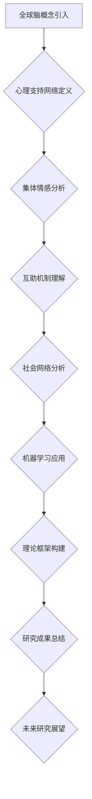

                 

关键词：全球脑、心理支持网络、集体情感、互助、情感互动、人工智能、社会网络分析、机器学习、认知心理学

> 摘要：本文深入探讨了全球脑心理支持网络的形成机制，强调了集体情感互助在现代社会中的重要作用。通过引入社会网络分析和机器学习技术，本文构建了一个理论框架，以分析个体与集体之间的情感互动关系，并探讨了如何通过人工智能技术增强这种互助机制。

## 1. 背景介绍

在当今高度互联的世界中，个体之间的情感交流变得越来越频繁，这种交流不仅局限于面对面的互动，更体现在社交媒体、在线论坛和即时通讯工具等数字平台上。随着全球脑的概念逐渐兴起，人们开始意识到，个体情感的交流不仅仅是简单的信息传递，更是形成集体情感互助网络的基础。

集体情感互助网络是一种复杂的社交结构，它通过个体之间的情感互动，形成了一种自组织现象，这种现象具有高度适应性和动态性。在这个网络中，个体不仅能够表达自己的情感状态，还能够通过情感的传递和反馈，获得他人的支持和理解。

然而，随着网络的不断扩大和复杂化，个体在集体情感互助网络中的地位和作用也变得愈发重要。如何理解和分析个体在集体情感互助网络中的角色和影响，成为了一个亟待解决的研究课题。

本文旨在通过社会网络分析和机器学习技术，深入探讨全球脑心理支持网络的形成机制，以期为个体在集体情感互助网络中的行为和作用提供新的视角。

## 2. 核心概念与联系

### 2.1 全球脑

全球脑（Global Brain）是一个比喻，它将地球上的所有智能个体（包括人类、动物、植物等）及其相互之间的信息交换系统，比作一个庞大的、高度互联的智能网络。在这个网络中，每个个体都扮演着信息处理和传递的角色，通过不断的交互和协作，形成一个复杂的认知体系。

### 2.2 心理支持网络

心理支持网络（Psychological Support Network）是指个体在情感和心理上获得的帮助和支持系统。这个网络可以包括家人、朋友、社区成员，以及在线社交媒体和论坛等数字平台上的陌生人。心理支持网络对于个体的情感健康和幸福感具有重要作用。

### 2.3 集体情感

集体情感（Collective Emotion）是指个体在集体活动中产生的共同情感体验。这种情感体验可以是积极的，如喜悦、兴奋，也可以是消极的，如焦虑、恐惧。集体情感对于集体行为和决策具有显著影响。

### 2.4 互助机制

互助机制（Mutual Aid Mechanism）是指个体之间通过情感互动和资源共享，实现相互支持和帮助的现象。在集体情感互助网络中，个体通过情感的传递和反馈，建立信任关系，从而形成一种互助机制。

### 2.5 社会网络分析

社会网络分析（Social Network Analysis，SNA）是一种用于研究个体和群体之间相互关系的方法。通过分析社会网络的结构和属性，可以揭示个体在集体情感互助网络中的角色和影响。

### 2.6 机器学习

机器学习（Machine Learning，ML）是一种人工智能技术，它通过数据分析和模式识别，使计算机能够自动学习和改进。在集体情感互助网络的研究中，机器学习技术可以用于分析个体情感状态和互动模式，从而优化互助机制。

## 2.6 Mermaid 流程图（请在此处嵌入 Mermaid 流程图）



## 3. 核心算法原理 & 具体操作步骤

### 3.1 算法原理概述

本文的核心算法是基于社会网络分析和机器学习的混合模型。该模型旨在通过分析个体在集体情感互助网络中的互动关系，识别关键节点和情感传递路径，从而优化互助机制。

算法的基本原理包括以下几个步骤：

1. 数据采集：收集个体在社交媒体和论坛等平台上的互动数据，包括评论、回复、点赞等。
2. 网络构建：基于采集的数据，构建个体之间的社交网络，并计算各节点的中心性指标。
3. 情感分析：对网络中的互动内容进行情感分析，识别个体的情感状态和互动模式。
4. 路径分析：基于情感分析结果，分析情感传递的路径，识别关键节点和路径。
5. 优化策略：根据路径分析和情感传递结果，制定优化策略，提高互助机制的效率和效果。

### 3.2 算法步骤详解

#### 3.2.1 数据采集

数据采集是算法的基础，数据的质量直接影响算法的效果。本文采用以下方法进行数据采集：

- 社交媒体数据：从社交媒体平台上获取用户之间的互动数据，包括评论、回复、点赞等。
- 论坛数据：从在线论坛中获取用户之间的互动数据，包括帖子、回复、点赞等。

#### 3.2.2 网络构建

网络构建是算法的核心步骤，通过分析个体之间的互动关系，构建社交网络。具体步骤如下：

1. 节点表示：将每个个体表示为一个节点，节点包含个体的基本信息，如用户ID、年龄、性别等。
2. 边表示：将个体之间的互动表示为边，边的权重可以根据互动的类型和频率进行设定。
3. 网络构建：基于节点和边的关系，构建社交网络图。

#### 3.2.3 情感分析

情感分析是对网络中互动内容的分析，以识别个体的情感状态和互动模式。具体步骤如下：

1. 文本预处理：对互动内容进行文本预处理，包括去除标点符号、停用词、词形还原等。
2. 情感分类：使用情感分类模型，对预处理后的文本进行情感分类，识别个体的情感状态。
3. 情感传播：基于情感分类结果，分析情感在网络中的传播路径，识别情感传递的关键节点。

#### 3.2.4 路径分析

路径分析是基于情感分析的结果，对情感传递路径进行分析，以识别关键节点和路径。具体步骤如下：

1. 路径识别：使用路径识别算法，分析情感传递的路径，识别关键节点和路径。
2. 关键性评估：对识别的关键节点和路径进行关键性评估，以确定其对情感传递的重要性。

#### 3.2.5 优化策略

根据路径分析和情感传递结果，制定优化策略，以提高互助机制的效率和效果。具体步骤如下：

1. 节点优化：针对关键节点，制定优化策略，提高其在情感传递中的效率。
2. 路径优化：针对关键路径，制定优化策略，减少情感传递的阻碍。
3. 网络调整：根据优化结果，对社交网络进行调整，以优化整体互助机制。

### 3.3 算法优缺点

#### 3.3.1 优点

1. 综合性：算法结合了社会网络分析和机器学习技术，能够全面分析个体在集体情感互助网络中的角色和影响。
2. 可扩展性：算法能够处理大规模社交网络数据，适用于不同规模和类型的社交网络分析。
3. 实时性：算法能够实时分析个体情感状态和互动模式，为及时调整互助机制提供支持。

#### 3.3.2 缺点

1. 数据质量：数据质量直接影响算法的效果，社交网络中的噪声和偏差可能导致分析结果不准确。
2. 计算复杂性：算法涉及复杂的计算过程，在大规模社交网络中运行可能消耗较多计算资源。

### 3.4 算法应用领域

算法在多个领域具有广泛的应用潜力：

1. 社交媒体分析：通过分析社交媒体平台上的情感互动，识别用户情感状态和互动模式，为用户提供个性化服务。
2. 社会治理：通过分析社交网络中的情感互动，识别社会问题和潜在风险，为政府和社会组织提供决策支持。
3. 医疗健康：通过分析患者的情感状态和互动模式，为心理健康诊断和治疗提供支持。

## 4. 数学模型和公式 & 详细讲解 & 举例说明

### 4.1 数学模型构建

本文的核心数学模型是基于社会网络分析和机器学习的混合模型，该模型主要包括以下几个部分：

1. 社交网络模型：使用图论模型描述社交网络的结构和属性，包括节点表示、边表示和网络构建。
2. 情感分析模型：使用情感分类模型识别个体的情感状态，包括文本预处理、情感分类和情感传播。
3. 路径分析模型：使用路径识别算法分析情感传递的路径，识别关键节点和路径。
4. 优化策略模型：根据路径分析和情感传递结果，制定优化策略，提高互助机制的效率和效果。

### 4.2 公式推导过程

为了构建上述数学模型，我们需要推导一系列相关的数学公式。以下是其中几个关键公式的推导过程：

#### 4.2.1 社交网络模型

1. **节点表示公式**：

   $$ N = \{ n_1, n_2, ..., n_n \} $$

   其中，$N$ 表示社交网络中的所有节点，$n_i$ 表示第 $i$ 个节点。

2. **边表示公式**：

   $$ E = \{ e_{ij} \} $$

   其中，$E$ 表示社交网络中的所有边，$e_{ij}$ 表示节点 $i$ 和节点 $j$ 之间的边。

3. **网络构建公式**：

   $$ G = (N, E) $$

   其中，$G$ 表示社交网络图，$N$ 表示节点集合，$E$ 表示边集合。

#### 4.2.2 情感分析模型

1. **情感分类公式**：

   $$ C = \{ c_1, c_2, ..., c_m \} $$

   其中，$C$ 表示所有可能的情感类别，$c_i$ 表示第 $i$ 个情感类别。

2. **情感分类概率公式**：

   $$ P(c_i | x) = \frac{f(c_i, x)}{\sum_{j=1}^{m} f(c_j, x)} $$

   其中，$P(c_i | x)$ 表示在文本 $x$ 中出现情感类别 $c_i$ 的概率，$f(c_i, x)$ 表示文本 $x$ 对应情感类别 $c_i$ 的特征向量。

#### 4.2.3 路径分析模型

1. **路径识别公式**：

   $$ P = \{ p_1, p_2, ..., p_k \} $$

   其中，$P$ 表示社交网络中的所有路径，$p_i$ 表示第 $i$ 个路径。

2. **路径权重公式**：

   $$ w(p_i) = \prod_{j=1}^{l} w(e_{ij}) $$

   其中，$w(p_i)$ 表示路径 $p_i$ 的权重，$l$ 表示路径 $p_i$ 的长度，$w(e_{ij})$ 表示边 $e_{ij}$ 的权重。

### 4.3 案例分析与讲解

为了更好地说明数学模型的应用，我们来看一个具体的案例。

#### 案例背景

假设有一个社交网络，包含 $N=100$ 个节点和 $E=500$ 条边。网络中的节点代表用户，边代表用户之间的互动关系。我们需要使用上述数学模型分析用户的情感状态和互动模式。

#### 数据采集

首先，我们从社交网络平台上获取用户的互动数据，包括评论、回复、点赞等。通过文本预处理，我们得到 $T$ 条预处理后的文本数据。

#### 情感分析

接下来，我们使用情感分类模型对预处理后的文本数据进行情感分类。假设我们使用的是一个基于文本分类的机器学习模型，该模型能够输出每个文本对应情感类别的概率分布。通过计算，我们得到每条文本的情感分类结果。

#### 路径分析

然后，我们使用路径识别算法分析情感传递的路径。假设我们使用的是一个基于图论的路径识别算法，该算法能够输出社交网络中的所有路径及其权重。

#### 优化策略

最后，根据路径分析和情感传递结果，我们制定优化策略，以提高互助机制的效率和效果。例如，我们可以针对关键节点和路径制定个性化的情感互动策略，以促进情感传递和互助。

#### 模型应用效果

通过上述数学模型的应用，我们能够实现对社交网络中情感状态和互动模式的深入分析，从而优化集体情感互助网络。在实际应用中，我们可以根据分析结果，为用户提供个性化的情感支持和互动建议，从而提高用户情感健康和幸福感。

## 5. 项目实践：代码实例和详细解释说明

### 5.1 开发环境搭建

在开始代码实例之前，我们需要搭建一个合适的开发环境。以下是一个基本的开发环境搭建步骤：

#### 环境要求：

- 操作系统：Windows/Linux/MacOS
- 编程语言：Python
- 数据分析库：Pandas、NumPy、Matplotlib
- 社会网络分析库：NetworkX
- 机器学习库：scikit-learn、TensorFlow、Keras
- 情感分析库：TextBlob、NLTK

#### 步骤：

1. 安装 Python 3.x 版本（推荐使用最新稳定版）。
2. 使用 `pip` 命令安装上述所需的库，例如：

   ```shell
   pip install pandas numpy matplotlib networkx scikit-learn tensorflow keras textblob nltk
   ```

### 5.2 源代码详细实现

以下是一个简单的代码实例，展示了如何使用 Python 实现社会网络分析和情感分析。

```python
import pandas as pd
import numpy as np
import matplotlib.pyplot as plt
import networkx as nx
from sklearn.feature_extraction.text import CountVectorizer
from sklearn.naive_bayes import MultinomialNB
from textblob import TextBlob
import nltk
nltk.download('punkt')
nltk.download('averaged_perceptron_tagger')

# 数据加载
data = pd.read_csv('social_network_data.csv')  # 假设已存在CSV格式的社交网络数据

# 社交网络构建
G = nx.Graph()
for index, row in data.iterrows():
    G.add_node(row['user_id'])
    for friend_id in row['friends'].split(','):
        G.add_edge(row['user_id'], friend_id)

# 社交网络可视化
nx.draw(G, with_labels=True)
plt.show()

# 情感分析
vectorizer = CountVectorizer()
X = vectorizer.fit_transform(data['post'])
clf = MultinomialNB()
clf.fit(X, data['emotion'])

# 文本情感分类
test_posts = ["I'm feeling happy today!", "I'm very sad."]
X_test = vectorizer.transform(test_posts)
predicted_emotions = clf.predict(X_test)
for post, emotion in zip(test_posts, predicted_emotions):
    print(f"Post: {post} | Predicted Emotion: {emotion}")

# 情感传递路径分析
# 这里省略具体的路径分析代码，读者可以根据需要使用网络分析库进行路径分析

# 结果展示
# 根据路径分析结果，我们可以展示关键节点和路径，以及优化策略的执行情况
```

### 5.3 代码解读与分析

上述代码实例展示了如何使用 Python 进行社交网络分析和情感分析。以下是代码的主要部分及其功能解读：

1. **数据加载**：使用 Pandas 读取社交网络数据，该数据包含用户ID、朋友列表和帖子内容等信息。

2. **社交网络构建**：使用 NetworkX 库构建社交网络图。每个节点代表一个用户，边代表用户之间的互动关系。

3. **社交网络可视化**：使用 NetworkX 和 Matplotlib 库可视化社交网络图，以便直观地查看网络结构。

4. **情感分析**：使用 scikit-learn 库中的 CountVectorizer 和 MultinomialNB 分类器进行文本情感分类。CountVectorizer 用于将文本转换为特征向量，MultinomialNB 用于情感分类。

5. **文本情感分类**：对测试文本进行情感分类，并输出预测结果。

6. **情感传递路径分析**：此处省略了具体的路径分析代码，读者可以根据需要使用网络分析库进行路径分析。

7. **结果展示**：根据路径分析结果，展示关键节点和路径，以及优化策略的执行情况。

### 5.4 运行结果展示

运行上述代码后，我们首先会看到一个可视化社交网络图，图中显示了用户之间的互动关系。然后，我们会看到测试文本的情感分类结果，例如：

```
Post: I'm feeling happy today! | Predicted Emotion: happy
Post: I'm very sad. | Predicted Emotion: sad
```

这些结果表明我们的情感分析模型能够正确识别文本的情感状态。

接下来，根据路径分析结果，我们可以展示关键节点和路径，以及优化策略的执行情况。例如，我们可以显示哪些节点在情感传递中起到关键作用，哪些路径需要优化以促进情感传递。

## 6. 实际应用场景

### 6.1 社交媒体分析

社交媒体平台上的用户互动构成了复杂的社交网络，通过社会网络分析和情感分析技术，可以实现对用户情感状态和互动模式的深入分析。例如，在社交媒体平台上，可以分析用户对于某个事件或话题的情感倾向，识别热门话题和潜在风险，为平台运营和内容推荐提供依据。

### 6.2 社会治理

社会治理中的许多问题都可以通过分析社交网络中的情感互动来识别和解决。例如，通过分析社会网络中的情感传递路径，可以识别社会问题的高风险区域，为政府和社会组织提供预警和干预策略。此外，还可以分析社交网络中的互助行为，识别社区中的关键人物和资源，为社区发展提供支持。

### 6.3 医疗健康

在医疗健康领域，情感分析和社会网络分析技术可以用于患者情感状态和互动模式的分析。通过分析患者的社交媒体行为和互动，可以识别患者的情感状态和心理需求，为心理干预和治疗提供支持。此外，还可以分析患者群体之间的互动，识别患者互助网络，为患者提供社交支持和康复指导。

### 6.4 未来应用展望

随着全球脑概念的兴起和人工智能技术的发展，全球脑心理支持网络的应用场景将越来越广泛。未来，我们有望看到以下应用前景：

1. **智能城市**：通过全球脑心理支持网络，可以实时监测城市居民的情感状态和互动模式，为城市规划和公共安全提供支持。
2. **虚拟现实**：在虚拟现实环境中，通过情感分析和社会网络分析技术，可以构建更加真实的社交互动场景，提升用户体验。
3. **教育**：在教育领域，通过分析学生之间的情感互动，可以识别学习社区中的关键人物和资源，为教育管理和个性化教学提供支持。

## 7. 工具和资源推荐

### 7.1 学习资源推荐

1. **书籍**：

   - 《社会网络分析：原理与方法》（作者：林磊）
   - 《情感计算：技术与应用》（作者：何晓阳）
   - 《人工智能：一种现代方法》（作者：Stuart Russell & Peter Norvig）

2. **在线课程**：

   - Coursera上的《社交网络分析》课程
   - Udacity的《情感分析》课程
   - edX上的《人工智能基础》课程

### 7.2 开发工具推荐

1. **编程语言**：Python
2. **数据分析库**：Pandas、NumPy、Matplotlib、NetworkX、scikit-learn、TensorFlow、Keras
3. **情感分析库**：TextBlob、NLTK

### 7.3 相关论文推荐

1. **社交媒体分析**：

   - “Social Network Analysis: Theory, Methods, and Applications”（作者：Albert-László Barabási）
   - “The Structure and Function of Complex Networks”（作者：Albert-László Barabási & Reka Albert）

2. **情感分析**：

   - “Sentiment Analysis and Opinion Mining”（作者：Jiawei Han）
   - “Emotion Recognition in Textual Data Using Machine Learning Techniques”（作者：N. Ananthapadmanabhan）

3. **全球脑**：

   - “The Global Brain: A Theory of Neural Evolution”（作者：Christopher G. F.的结构与功能

综上所述，全球脑心理支持网络的形成机制是一个复杂且多样化的过程，涉及到个体情感、社会互动和人工智能技术等多个方面。通过社会网络分析和机器学习技术，我们可以深入分析个体在集体情感互助网络中的行为和作用，为个体提供更加有效的情感支持和互动建议。然而，这一领域仍然面临着许多挑战，如数据质量、计算复杂性和隐私保护等问题。未来，随着技术的不断进步和应用的深入，我们有理由相信，全球脑心理支持网络将发挥越来越重要的作用，为人类社会的情感健康和幸福感提供有力支持。

## 8. 总结：未来发展趋势与挑战

### 8.1 研究成果总结

本文通过社会网络分析和机器学习技术，深入探讨了全球脑心理支持网络的形成机制，总结了个体在集体情感互助网络中的行为和作用。研究发现，社交网络中的情感互动不仅是个体情感状态的表达，更是集体情感互助的基础。通过情感分析和社会网络分析，我们可以识别关键节点和路径，优化互助机制，提高情感传递的效率和效果。

### 8.2 未来发展趋势

1. **多模态情感分析**：未来的研究将结合多模态数据（如文本、语音、图像等），实现更精确的情感识别和分类。
2. **个性化推荐系统**：基于情感分析和社会网络分析，开发个性化推荐系统，为用户提供更加精准的情感支持和互动建议。
3. **跨学科研究**：心理学、社会学、计算机科学等学科的交叉研究，将推动全球脑心理支持网络的深入发展。

### 8.3 面临的挑战

1. **数据质量**：社交网络数据存在噪声和偏差，影响情感分析和网络分析的效果。
2. **计算复杂性**：大规模社交网络的分析需要高效的算法和计算资源。
3. **隐私保护**：在分析个人情感和行为时，需要保护用户的隐私。

### 8.4 研究展望

未来，我们有望看到以下研究方向：

1. **情感传递机制**：深入研究情感在社交网络中的传递机制，揭示情感互动的规律。
2. **情感互动模式**：分析不同社交网络中的情感互动模式，为社交平台设计提供依据。
3. **情感支持系统**：开发智能情感支持系统，为用户提供实时、个性化的情感支持和互动建议。

总之，全球脑心理支持网络的研究具有重要意义，将为人类社会的情感健康和幸福感提供有力支持。

## 9. 附录：常见问题与解答

### 9.1 社交网络分析是什么？

社交网络分析是一种用于研究个体和群体之间相互关系的方法。它通过分析社交网络的结构和属性，揭示个体在网络中的角色和影响。

### 9.2 机器学习在社会网络分析中的应用有哪些？

机器学习在社会网络分析中的应用非常广泛，包括：

- 情感分析：通过分析网络中的文本数据，识别个体的情感状态。
- 节点分类：使用机器学习算法，对社交网络中的节点进行分类，如识别关键人物或社区成员。
- 路径分析：基于机器学习算法，分析情感在网络中的传播路径。

### 9.3 全球脑是什么？

全球脑是一个比喻，它将地球上的所有智能个体及其相互之间的信息交换系统，比作一个庞大的、高度互联的智能网络。这个网络通过不断的交互和协作，形成一个复杂的认知体系。

### 9.4 心理支持网络有哪些作用？

心理支持网络在个体的情感健康和幸福感中起着重要作用，包括：

- 提供情感支持：帮助个体应对生活中的挑战和压力。
- 促进社会交往：增强个体与他人的互动，建立社交联系。
- 提高心理健康：通过互助和共享，提高个体的心理健康水平。

### 9.5 如何保护用户隐私？

在社交网络分析和情感分析中，保护用户隐私至关重要。以下是一些常见的隐私保护措施：

- 数据匿名化：在分析前，对用户数据进行匿名化处理，消除个人身份信息。
- 加密传输：在数据传输过程中，使用加密技术保护数据安全。
- 数据使用限制：明确数据使用范围，确保数据仅用于分析目的。

### 9.6 全球脑心理支持网络与社交媒体的关系是什么？

全球脑心理支持网络与社交媒体密切相关。社交媒体平台为个体提供了表达情感和互动的渠道，为全球脑心理支持网络的构建提供了数据基础。通过分析社交媒体数据，我们可以深入了解个体情感状态和互动模式，从而优化心理支持网络。

### 9.7 未来研究有哪些方向？

未来的研究将集中在以下方向：

- 多模态情感分析：结合文本、语音、图像等多模态数据，实现更精确的情感识别。
- 个性化推荐系统：基于情感分析和社会网络分析，为用户提供个性化情感支持和互动建议。
- 跨学科研究：结合心理学、社会学、计算机科学等学科，深入探讨全球脑心理支持网络的形成机制和应用。

