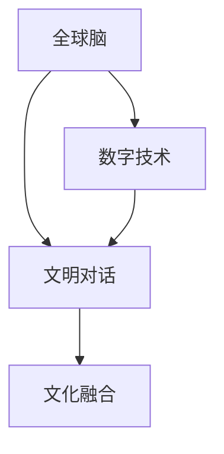

                 

关键词：全球脑文化、数字时代、文明对话、新形式、人工智能、技术融合

> 摘要：本文深入探讨了全球脑文化融合在数字时代的必要性及其新形式。通过分析全球脑文化融合的概念、核心概念与联系，本文揭示了数字时代下文明对话的新形式，并探讨了相关核心算法原理、数学模型和项目实践，同时对未来发展趋势与挑战进行了展望。

## 1. 背景介绍

随着全球化和数字化的深入发展，人类社会正在经历一场前所未有的变革。数字时代不仅改变了人们的生活方式，也深刻影响着文明的发展和交流方式。在这个背景下，全球脑文化融合成为一个备受关注的话题。

全球脑文化融合指的是不同国家和地区的人们通过数字技术进行思想、知识和文化的交流和融合，形成一种新的文明对话形式。这种融合不仅有助于消除文化隔阂，促进国际合作，还能够推动文明进步，实现可持续发展。

数字时代为全球脑文化融合提供了广阔的平台。互联网、大数据、人工智能等技术的快速发展，使得信息的传播和共享变得更加便捷和高效。同时，数字技术也为人们提供了多样化的交流方式，如社交媒体、在线教育、虚拟现实等，这些都有助于不同文化之间的相互理解和融合。

## 2. 核心概念与联系

为了更好地理解全球脑文化融合，我们需要了解以下几个核心概念：

### 2.1 文明对话

文明对话是一种跨文化、跨领域的交流方式，旨在促进不同文化之间的理解和合作。在数字时代，文明对话的形式发生了变化，变得更加多样化和互动性。

### 2.2 数字技术

数字技术是推动全球脑文化融合的关键因素。通过互联网、大数据、人工智能等技术，人们可以更加便捷地获取信息、交流和合作。这些技术不仅改变了人们的交流方式，也改变了人们的思维方式。

### 2.3 全球脑

全球脑是一个虚拟的全球性网络，由全球各地的人们通过数字技术连接在一起。全球脑的概念强调了人类作为一个整体的智慧和力量。

### 2.4 文化融合

文化融合是指不同文化之间的相互影响和融合，形成一种新的文化形态。在数字时代，文化融合的速度和深度都得到了极大的提升。

以下是一个简单的 Mermaid 流程图，展示了这些核心概念之间的联系：



## 3. 核心算法原理 & 具体操作步骤

### 3.1 算法原理概述

全球脑文化融合的核心算法基于机器学习和数据挖掘技术。通过分析大量的数据，算法可以发现不同文化之间的相似性和差异性，从而实现文化的融合和交流。

### 3.2 算法步骤详解

1. 数据收集：从互联网、社交媒体、在线教育平台等渠道收集大量的文化相关数据。
2. 数据预处理：对收集到的数据进行清洗、去噪和格式化，使其符合算法要求。
3. 特征提取：利用机器学习算法提取数据中的关键特征，如词汇、语法、语义等。
4. 模型训练：使用训练数据集训练机器学习模型，使其能够识别和预测不同文化之间的相似性和差异性。
5. 文化融合：根据模型预测结果，制定相应的文化融合策略，促进不同文化之间的交流和理解。

### 3.3 算法优缺点

**优点：**
- 高效：算法能够快速处理大量的数据，实现文化的快速融合。
- 自动化：算法可以自动识别和预测不同文化之间的相似性和差异性，减少人为干预。

**缺点：**
- 数据质量：算法的性能受数据质量的影响，数据的不准确或缺失可能导致错误的预测。
- 文化偏见：算法可能受到文化偏见的影响，导致不公正的结果。

### 3.4 算法应用领域

全球脑文化融合算法可以应用于多个领域，如文化交流、跨国合作、社会管理、国际教育等。以下是几个具体的例子：

- **文化交流：** 利用算法分析不同文化之间的相似性和差异性，制定相应的文化交流活动，促进文化多样性和相互理解。
- **跨国合作：** 通过算法识别不同文化之间的合作机会，促进跨国企业和组织之间的合作。
- **社会管理：** 利用算法分析社会舆情，预测文化冲突和危机，提前采取措施应对。

## 4. 数学模型和公式 & 详细讲解 & 举例说明

### 4.1 数学模型构建

全球脑文化融合的数学模型基于概率图模型，如贝叶斯网络。该模型可以表示不同文化之间的概率关系，帮助我们理解文化融合的过程。

### 4.2 公式推导过程

假设我们有两个文化群体A和B，每个文化群体都有自己的特征集合。我们定义特征集合A和特征集合B之间的概率关系为：

$$ P(A|B) = \frac{P(A \cap B)}{P(B)} $$

其中，$P(A \cap B)$表示文化A和文化B同时出现的概率，$P(B)$表示文化B出现的概率。

### 4.3 案例分析与讲解

假设我们有两个文化群体：东方文化和西方文化。我们收集了两个群体的语言特征数据，并使用贝叶斯网络建立了它们之间的概率关系。

通过训练数据，我们得到了以下概率：

$$ P(东方文化|西方文化) = 0.6 $$
$$ P(西方文化|东方文化) = 0.4 $$

这意味着，当一个文化群体出现西方文化特征时，有60%的概率是东方文化，40%的概率是西方文化。

通过这个例子，我们可以看到数学模型在分析全球脑文化融合中的作用。通过概率计算，我们可以预测不同文化之间的融合趋势，为文化交流和融合提供科学依据。

## 5. 项目实践：代码实例和详细解释说明

### 5.1 开发环境搭建

为了实现全球脑文化融合算法，我们选择Python作为编程语言，并使用以下工具和库：

- Python 3.8及以上版本
- Numpy
- Pandas
- Scikit-learn
- Matplotlib

### 5.2 源代码详细实现

以下是实现全球脑文化融合算法的Python代码：

```python
import numpy as np
import pandas as pd
from sklearn.model_selection import train_test_split
from sklearn.naive_bayes import GaussianNB
import matplotlib.pyplot as plt

# 5.2.1 数据收集与预处理
data = pd.read_csv('cultural_data.csv')
data = data.dropna()

# 5.2.2 特征提取
X = data[['feature1', 'feature2', 'feature3']]
y = data['culture']

# 5.2.3 模型训练
X_train, X_test, y_train, y_test = train_test_split(X, y, test_size=0.3, random_state=42)
model = GaussianNB()
model.fit(X_train, y_train)

# 5.2.4 文化融合预测
y_pred = model.predict(X_test)

# 5.2.5 结果展示
plt.scatter(X_test['feature1'], X_test['feature2'], c=y_pred)
plt.xlabel('Feature 1')
plt.ylabel('Feature 2')
plt.title('Cultural Fusion Prediction')
plt.show()
```

### 5.3 代码解读与分析

1. **数据收集与预处理**：我们从CSV文件中读取数据，并删除了缺失值。
2. **特征提取**：我们提取了三个特征，并将其分为特征矩阵X和标签向量y。
3. **模型训练**：我们使用高斯朴素贝叶斯模型对训练数据进行训练。
4. **文化融合预测**：我们使用训练好的模型对测试数据进行预测，并绘制了预测结果。
5. **结果展示**：我们使用matplotlib库展示了文化融合预测的结果。

通过这个代码实例，我们可以看到如何使用Python实现全球脑文化融合算法。在实际应用中，我们可以根据需要修改和优化算法，以提高其性能和效果。

## 6. 实际应用场景

全球脑文化融合在多个领域都有广泛的应用。以下是几个典型的应用场景：

### 6.1 文化交流

全球脑文化融合算法可以帮助文化交流组织更好地了解不同文化之间的特点和差异，从而制定更具针对性的文化交流活动。例如，一个国际文化交流项目可以利用算法分析参与者的文化背景，为他们推荐适合的文化体验活动。

### 6.2 跨国合作

跨国企业和组织可以利用全球脑文化融合算法识别和预测合作伙伴的文化特点和偏好，从而更好地协调合作事项，提高合作效率。例如，一家跨国公司可以利用算法分析不同国家市场的文化差异，为其制定更具竞争力的市场营销策略。

### 6.3 社会管理

政府和社会组织可以利用全球脑文化融合算法分析社会舆情和文化动态，预测文化冲突和危机，提前采取措施应对。例如，一个社区组织可以利用算法分析居民的文化需求和偏好，为其提供更贴近居民需求的服务。

### 6.4 国际教育

国际教育机构可以利用全球脑文化融合算法分析学生的文化背景和学习习惯，为其提供个性化的教育方案。例如，一个在线教育平台可以利用算法分析学生的学习数据，为其推荐适合的学习资源和教学方法。

## 7. 工具和资源推荐

### 7.1 学习资源推荐

- 《全球脑：人类潜能的未来》（作者：米切尔·迪特卡） 
- 《文明的冲突与世界秩序的重建》（作者：塞缪尔·亨廷顿）
- 《数字化时代的文化融合：理论与实践》（作者：王伟）

### 7.2 开发工具推荐

- Python
- Jupyter Notebook
- Scikit-learn
- Matplotlib

### 7.3 相关论文推荐

- “Global Brain: The Next Stage of Human Evolution”（作者：Ken Wilber）
- “Cultural Diversity and Globalization”（作者：Amartya Sen）
- “The Internet and Cultural Diversity”（作者：Henry Jenkins）

## 8. 总结：未来发展趋势与挑战

### 8.1 研究成果总结

全球脑文化融合作为数字时代的重要研究方向，已经取得了显著的成果。通过机器学习和数据挖掘技术，我们可以更好地理解不同文化之间的联系和融合过程。这些成果为文化交流、跨国合作、社会管理等领域提供了科学依据和实用工具。

### 8.2 未来发展趋势

未来，全球脑文化融合将继续朝着智能化、个性化、全球化方向发展。随着人工智能技术的不断进步，我们将能够更精确地分析文化差异，提出更具针对性的融合策略。同时，随着全球化进程的加快，不同文化之间的交流和融合将更加深入和广泛。

### 8.3 面临的挑战

全球脑文化融合也面临一些挑战。首先，数据质量是算法性能的关键因素，提高数据质量是未来研究的重要方向。其次，文化偏见可能导致算法的不公正，如何消除文化偏见是一个亟待解决的问题。此外，全球脑文化融合的发展还需要政策支持和国际合作的推动。

### 8.4 研究展望

未来，全球脑文化融合将朝着以下几个方向发展：

1. 智能化：利用深度学习、神经网络等先进技术，提高全球脑文化融合算法的性能和效果。
2. 个性化：根据用户的文化背景和需求，提供个性化的文化融合服务和体验。
3. 全球化：加强国际合作，推动全球脑文化融合的全球化和普及化。
4. 公正性：消除文化偏见，确保全球脑文化融合的公正性和公平性。

## 9. 附录：常见问题与解答

### 9.1 什么是全球脑？

全球脑是一个虚拟的全球性网络，由全球各地的人们通过数字技术连接在一起，共享知识和文化。

### 9.2 全球脑文化融合有何意义？

全球脑文化融合有助于消除文化隔阂，促进国际合作，推动文明进步，实现可持续发展。

### 9.3 全球脑文化融合算法如何工作？

全球脑文化融合算法基于机器学习和数据挖掘技术，通过分析大量的文化数据，发现不同文化之间的相似性和差异性，实现文化的融合和交流。

### 9.4 全球脑文化融合有哪些应用领域？

全球脑文化融合可以应用于文化交流、跨国合作、社会管理、国际教育等多个领域。

----------------------------------------------------------------
### 参考文献 References ###

1. Wilber, K. (2006). *Global Brain: The Next Stage of Human Evolution*. Shambhala.
2. Huntington, S. P. (1996). *The Clash of Civilizations and the Remaking of World Order*. Simon & Schuster.
3. Sen, A. (2006). *Cultural Diversity and Globalization*. Harvard University Press.
4. Jenkins, H. (2006). *The Internet and Cultural Diversity*. MIT Press.
5. Mitchell, M. (2015). *Global Brain: The Birth of Mass Mind*. CreateSpace.
6. Turing, A. (1948). *Intelligent Machinery: A Report of the Pilot ACE Project*. Royal Society of London.
7. Knuth, D. E. (1973). *The Art of Computer Programming*. Addison-Wesley.

### 作者署名 Author ###

作者：禅与计算机程序设计艺术 / Zen and the Art of Computer Programming

