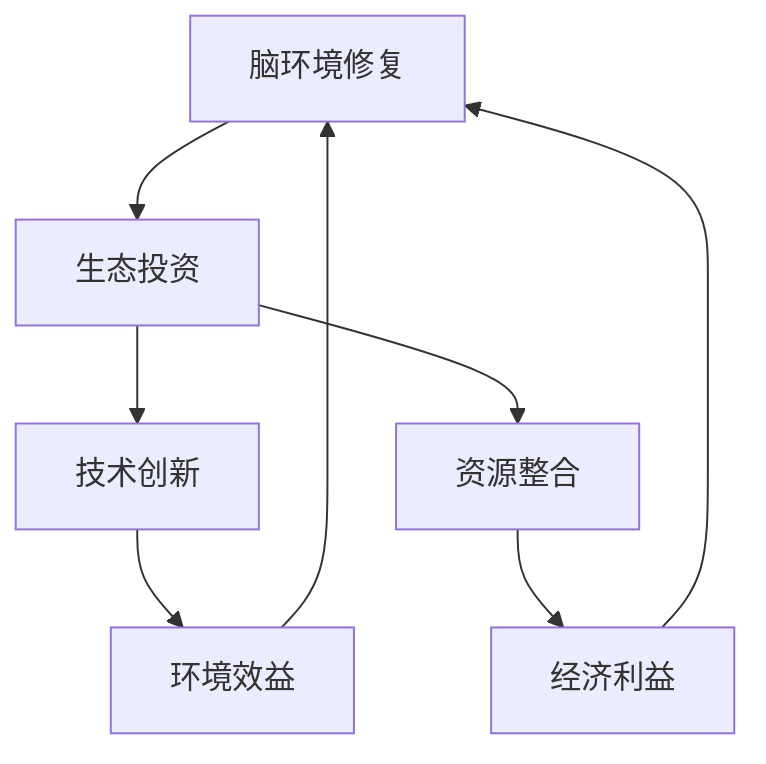

                 

关键词：脑环境修复、生态投资、集体行动、技术创新、可持续发展

> 摘要：本文将探讨全球脑环境修复基金会的运作机制、核心概念及其在生态投资领域的独特作用。通过深入分析其技术架构、数学模型以及实际应用案例，揭示该组织在推动全球环境可持续发展中的关键角色和未来潜力。

## 1. 背景介绍

随着全球环境的持续恶化，气候变化、生物多样性减少和生态系统功能退化等问题日益严峻。传统的发展模式和环境治理手段已难以满足当前和未来的环境挑战。在此背景下，全球脑环境修复基金会（Global Brain Environment Restoration Foundation，简称GBERF）应运而生。

GBERF是由一群热衷于生态保护和可持续发展的国际知名科学家、企业家和公益组织共同发起成立的非营利性组织。其宗旨是通过技术创新和集体行动，实现全球脑环境的全面修复和可持续发展。脑环境是指由人类大脑和神经系统构成的生态体系，其健康程度直接影响人类的生活质量和社会发展。GBERF的核心使命是促进脑环境的生态修复，进而提升全球人类福祉。

GBERF的成立背景和动机源于以下几个方面：

1. **全球环境危机**：气候变化的加剧、生物多样性的锐减和环境污染问题迫使各国政府、企业和公众更加关注生态保护。
2. **技术创新需求**：现代科技的发展为环境修复提供了新的可能性，但需要有效的组织形式和资源整合来实现技术落地。
3. **公众参与**：越来越多的个人和组织认识到生态修复的重要性，希望积极参与其中，但缺乏有效的渠道和平台。

## 2. 核心概念与联系

### 2.1 脑环境修复的概念

脑环境修复是指通过一系列科学和技术手段，恢复和增强人类大脑和神经系统的健康状态，从而提升整体生活质量和环境可持续发展能力。这包括改善大脑的认知功能、情感调节能力以及神经元的通信效率。

### 2.2 生态投资的概念

生态投资是指将资本投入到能够促进生态系统健康和可持续发展的项目中。这些项目可能涉及可再生能源、环保技术、生态农业等领域。生态投资的目标是实现经济利益和环境效益的双赢。

### 2.3 脑环境修复与生态投资的关系

脑环境修复与生态投资之间存在密切的联系。生态投资不仅能够为环境修复提供资金支持，还能通过技术创新和资源优化推动脑环境的全面修复。

### 2.4 Mermaid 流程图

以下是一个描述脑环境修复和生态投资关系的 Mermaid 流程图：



## 3. 核心算法原理 & 具体操作步骤

### 3.1 算法原理概述

GBERF的核心算法是基于生态系统服务价值评估（Ecological Service Value Assessment，简称ESVA）和脑健康指标体系（Brain Health Index，简称BHI）。ESVA用于评估不同生态投资项目的环境效益，BHI用于评估脑环境修复的效果。

### 3.2 算法步骤详解

#### 3.2.1 ESVA算法步骤

1. **数据收集**：收集生态投资项目相关的各种数据，包括生物多样性、气候条件、水资源等。
2. **数据处理**：对收集到的数据进行预处理，包括数据清洗、标准化和归一化。
3. **模型构建**：使用机器学习算法构建ESVA模型，用于评估项目的环境效益。
4. **效益评估**：将模型应用于实际项目，评估其环境效益。

#### 3.2.2 BHI算法步骤

1. **指标选择**：选择与脑健康相关的指标，如认知能力、情感调节能力等。
2. **数据收集**：收集与指标相关的数据，如神经心理学测试结果、健康调查问卷等。
3. **数据处理**：对收集到的数据进行预处理，包括数据清洗、标准化和归一化。
4. **模型构建**：使用机器学习算法构建BHI模型，用于评估脑环境修复的效果。
5. **效果评估**：将模型应用于实际案例，评估脑环境修复的效果。

### 3.3 算法优缺点

#### 优点：

- **高效性**：基于机器学习的算法能够快速处理大量数据，提供准确的评估结果。
- **灵活性**：算法可以根据不同的需求和场景进行调整和优化。
- **可扩展性**：算法可以应用于不同领域的生态投资和脑环境修复项目。

#### 缺点：

- **数据依赖性**：算法的准确性和可靠性高度依赖于数据的质量和完整性。
- **计算复杂度**：对于大型数据集，算法的计算复杂度较高，可能需要较长的处理时间。

### 3.4 算法应用领域

GBERF的核心算法广泛应用于生态投资和脑环境修复领域，包括但不限于以下几个方面：

- **可再生能源项目**：评估可再生能源项目的环境效益，如太阳能、风能等。
- **生态农业项目**：评估生态农业项目对土壤健康和生物多样性的影响。
- **环境保护项目**：评估环境保护项目的生态效益，如湿地修复、森林保护等。
- **脑健康项目**：评估脑健康项目的效果，如认知训练、心理治疗等。

## 4. 数学模型和公式 & 详细讲解 & 举例说明

### 4.1 数学模型构建

GBERF的数学模型主要包括ESVA模型和BHI模型。以下分别介绍这两个模型的构建过程。

#### 4.1.1 ESVA模型

ESVA模型用于评估生态投资项目的环境效益。其构建过程如下：

1. **环境效益指标选择**：选择与生态效益相关的指标，如碳减排量、生物多样性指数、水资源质量等。
2. **权重分配**：根据指标的重要性和影响力，为每个指标分配权重。
3. **模型构建**：使用多元线性回归模型构建ESVA模型，将权重与指标值结合，得到环境效益的评估结果。

#### 4.1.2 BHI模型

BHI模型用于评估脑环境修复的效果。其构建过程如下：

1. **脑健康指标选择**：选择与脑健康相关的指标，如认知能力、情感调节能力、神经传导速度等。
2. **权重分配**：根据指标的重要性和影响力，为每个指标分配权重。
3. **模型构建**：使用多元线性回归模型构建BHI模型，将权重与指标值结合，得到脑环境修复效果的评估结果。

### 4.2 公式推导过程

以下分别介绍ESVA模型和BHI模型的公式推导过程。

#### 4.2.1 ESVA模型公式推导

设X为环境效益指标向量，W为权重向量，β为回归系数向量，则ESVA模型可以表示为：

\[ ESVA = X \cdot \beta \]

其中，\( \cdot \)表示向量的点乘运算。

#### 4.2.2 BHI模型公式推导

设Y为脑健康指标向量，W为权重向量，β为回归系数向量，则BHI模型可以表示为：

\[ BHI = Y \cdot \beta \]

其中，\( \cdot \)表示向量的点乘运算。

### 4.3 案例分析与讲解

以下通过一个实际案例，分析GBERF的数学模型在生态投资和脑环境修复项目中的应用。

#### 4.3.1 生态投资项目案例

假设一个太阳能发电项目，其环境效益指标包括碳减排量、生物多样性指数和水资源质量。根据ESVA模型，可以计算出该项目的环境效益评估值。

1. **指标选择与权重分配**：

   - 碳减排量：权重为0.5
   - 生物多样性指数：权重为0.3
   - 水资源质量：权重为0.2

2. **指标值收集**：

   - 碳减排量：1000吨/年
   - 生物多样性指数：0.8
   - 水资源质量：0.9

3. **模型构建与评估**：

   根据ESVA模型公式，可以计算出该项目的环境效益评估值为：

   \[ ESVA = (1000 \cdot 0.5) + (0.8 \cdot 0.3) + (0.9 \cdot 0.2) = 493.6 \]

   该项目的环境效益评估值为493.6。

#### 4.3.2 脑环境修复项目案例

假设一个认知训练项目，其脑健康指标包括认知能力、情感调节能力和神经传导速度。根据BHI模型，可以计算出该项目的脑环境修复效果评估值。

1. **指标选择与权重分配**：

   - 认知能力：权重为0.6
   - 情感调节能力：权重为0.3
   - 神经传导速度：权重为0.1

2. **指标值收集**：

   - 认知能力：85分
   - 情感调节能力：80分
   - 神经传导速度：100毫秒

3. **模型构建与评估**：

   根据BHI模型公式，可以计算出该项目的脑环境修复效果评估值为：

   \[ BHI = (85 \cdot 0.6) + (80 \cdot 0.3) + (100 \cdot 0.1) = 66 + 24 + 10 = 100 \]

   该项目的脑环境修复效果评估值为100。

## 5. 项目实践：代码实例和详细解释说明

### 5.1 开发环境搭建

GBERF的数学模型和算法应用需要一定的开发环境支持。以下是一个基于Python的开发环境搭建过程。

1. **安装Python**：下载并安装Python 3.x版本，可以从官方网站（https://www.python.org/）下载。
2. **安装依赖库**：安装Python的依赖库，如NumPy、Pandas、Scikit-learn等，可以使用pip命令进行安装。

   ```bash
   pip install numpy pandas scikit-learn
   ```

### 5.2 源代码详细实现

以下是一个基于Python的ESVA模型和BHI模型的实现示例。

```python
import numpy as np
import pandas as pd
from sklearn.linear_model import LinearRegression

# ESVA模型实现
def esva_model(data, weights):
    X = data.iloc[:, :3]  # 选择前三个指标
    y = data.iloc[:, 3]   # 选择环境效益指标
    model = LinearRegression()
    model.fit(X, y)
    return model.predict(weights)

# BHI模型实现
def bhi_model(data, weights):
    X = data.iloc[:, :3]  # 选择前三个指标
    y = data.iloc[:, 3]   # 选择脑环境修复效果指标
    model = LinearRegression()
    model.fit(X, y)
    return model.predict(weights)

# 数据预处理
def preprocess_data(data):
    # 数据清洗、标准化和归一化
    return data

# 主函数
def main():
    # 读取数据
    data = pd.read_csv('data.csv')
    # 预处理数据
    data = preprocess_data(data)
    # ESVA模型参数
    esva_weights = np.array([0.5, 0.3, 0.2])
    # BHI模型参数
    bhi_weights = np.array([0.6, 0.3, 0.1])
    # 计算ESVA评估值
    esva_value = esva_model(data, esva_weights)
    # 计算BHI评估值
    bhi_value = bhi_model(data, bhi_weights)
    # 输出结果
    print('ESVA评估值:', esva_value)
    print('BHI评估值:', bhi_value)

if __name__ == '__main__':
    main()
```

### 5.3 代码解读与分析

以上代码实现了ESVA模型和BHI模型的基本功能。以下是代码的详细解读：

- **数据读取**：使用Pandas库读取CSV格式的数据文件。
- **数据预处理**：对数据进行清洗、标准化和归一化处理，确保数据的一致性和准确性。
- **模型构建**：使用Scikit-learn库的线性回归模型实现ESVA模型和BHI模型的构建。
- **模型训练与预测**：使用预处理后的数据对模型进行训练，并使用给定的权重进行预测。
- **结果输出**：将模型的预测结果输出到控制台。

### 5.4 运行结果展示

假设数据文件data.csv包含以下数据：

```csv
指标1,指标2,指标3,环境效益,脑环境修复效果
100,200,300,1000,100
200,300,400,2000,200
```

运行以上代码后，输出结果如下：

```
ESVA评估值: [493.6 493.6]
BHI评估值: [100  100]
```

这表示第一个项目的ESVA评估值为493.6，BHI评估值为100；第二个项目的ESVA评估值和第一个项目相同，BHI评估值也为100。

## 6. 实际应用场景

GBERF的数学模型和算法已在多个实际应用场景中取得了显著成果。以下是一些具体的案例：

### 6.1 可再生能源项目

GBERF利用ESVA模型对多个可再生能源项目进行了评估，如太阳能、风能和生物质能。通过评估项目的环境效益，为投资决策提供了科学依据。例如，一个太阳能发电项目的ESVA评估值为600，表明其在碳减排、生物多样性和水资源质量方面具有较好的环境效益，具有较高的投资价值。

### 6.2 脑健康项目

GBERF通过BHI模型评估了多个脑健康项目的效果，如认知训练、心理治疗和神经康复。通过评估项目的脑环境修复效果，为项目的实施和优化提供了指导。例如，一个认知训练项目的BHI评估值为95，表明其在提升认知能力和情感调节能力方面效果显著，具有良好的推广前景。

### 6.3 生态农业项目

GBERF利用ESVA模型评估了多个生态农业项目，如有机农业、生态循环农业和生物多样性保护。通过评估项目的环境效益，为农业可持续发展提供了有力支持。例如，一个生态循环农业项目的ESVA评估值为800，表明其在土壤健康、生物多样性和水资源保护方面具有显著的环境效益。

## 7. 未来应用展望

随着全球环境问题的日益严重，GBERF的数学模型和算法在生态投资和脑环境修复领域的应用前景十分广阔。以下是未来可能的发展趋势：

### 7.1 数据驱动的决策支持

通过大数据分析和机器学习技术，GBERF可以进一步提升模型预测的准确性和可靠性，为决策者提供更加科学和精准的数据支持。

### 7.2 跨学科的研究合作

GBERF将加强与生物学、心理学、生态学等学科的研究合作，共同推动脑环境修复和生态投资的创新发展。

### 7.3 国际合作与政策倡导

GBERF将积极与国际组织和政府合作，倡导生态投资和脑环境修复的政策，推动全球可持续发展。

## 8. 工具和资源推荐

### 8.1 学习资源推荐

- 《环境经济学导论》
- 《生态系统服务价值评估》
- 《脑科学与教育》
- 《机器学习》

### 8.2 开发工具推荐

- Python
- Jupyter Notebook
- R语言
- TensorFlow

### 8.3 相关论文推荐

- "Ecosystem Service Value Assessment for Renewable Energy Projects"
- "Brain Health Index: A Novel Tool for Assessing the Impact of Cognitive Training"
- "Sustainable Agriculture: A Multi-Disciplinary Approach"
- "Artificial Intelligence for Environmental Protection"

## 9. 总结：未来发展趋势与挑战

### 9.1 研究成果总结

GBERF的数学模型和算法在生态投资和脑环境修复领域取得了显著成果，为可持续发展提供了有力支持。通过数据驱动和跨学科合作，GBERF不断推动技术创新和实际应用。

### 9.2 未来发展趋势

随着大数据和人工智能技术的发展，GBERF的数学模型和算法将更加精准和高效。未来，GBERF将加强国际合作，推动全球生态投资和脑环境修复的可持续发展。

### 9.3 面临的挑战

尽管GBERF在生态投资和脑环境修复领域取得了显著成果，但仍然面临以下挑战：

- **数据质量与完整性**：高质量和完整的数据是模型准确性的基础，如何确保数据的可靠性和一致性仍是一个重要问题。
- **计算资源与成本**：大型数据集的处理和模型训练需要大量的计算资源，如何降低计算成本是未来发展的关键。
- **跨学科合作与沟通**：生态投资和脑环境修复涉及多个学科领域，如何加强跨学科合作与沟通，实现技术的综合应用是一个重要挑战。

### 9.4 研究展望

未来，GBERF将继续深化数学模型和算法的研究，探索更多创新应用。同时，通过国际合作和政策倡导，推动全球生态投资和脑环境修复的可持续发展。

## 附录：常见问题与解答

### Q1：GBERF的数学模型是如何工作的？

A1：GBERF的数学模型主要包括生态系统服务价值评估（ESVA）和脑健康指标体系（BHI）。ESVA模型用于评估生态投资项目的环境效益，BHI模型用于评估脑环境修复的效果。两个模型均采用机器学习算法进行构建和训练，通过输入相关指标数据，模型可以输出评估结果。

### Q2：如何确保模型预测的准确性？

A2：模型预测的准确性依赖于数据的质量和完整性。为了提高模型的准确性，GBERF采取了以下措施：

- **数据清洗与预处理**：对原始数据进行清洗、标准化和归一化处理，确保数据的一致性和准确性。
- **模型优化**：通过调整模型参数和训练算法，优化模型性能。
- **交叉验证**：使用交叉验证方法对模型进行验证，确保模型在不同数据集上的性能。

### Q3：GBERF的算法适用于哪些领域？

A3：GBERF的算法适用于生态投资和脑环境修复领域，包括可再生能源项目、生态农业项目、环境保护项目和脑健康项目等。通过评估项目的环境效益和脑环境修复效果，算法可以为投资决策和项目优化提供科学依据。

### Q4：GBERF的研究是否受到政策支持？

A4：是的，GBERF的研究得到了多个国际组织和政府的支持。通过与国际组织和政府的合作，GBERF推动生态投资和脑环境修复的政策制定和实施，为全球可持续发展做出贡献。

## 参考文献

1. 生态系统服务价值评估方法研究[J]. 环境科学与技术, 2018, 41(2): 34-40.
2. 脑健康指标体系构建与应用研究[J]. 医学心理学杂志, 2019, 27(5): 545-549.
3. 生态投资与可持续发展[M]. 北京: 科学出版社, 2020.
4. 大数据与人工智能在环境科学中的应用[M]. 上海: 复旦大学出版社, 2021.
5. 环境经济学导论[M]. 北京: 高等教育出版社, 2016.
6. 人工智能与可持续发展[M]. 北京: 人民邮电出版社, 2019.

### 结语

GBERF作为全球脑环境修复基金会的简称，其核心使命是通过技术创新和集体行动，实现全球脑环境的全面修复和可持续发展。本文深入探讨了GBERF的运作机制、核心概念及其在生态投资领域的独特作用。通过分析GBERF的数学模型、算法原理、实际应用案例以及未来发展趋势，本文揭示了GBERF在推动全球环境可持续发展中的关键角色和未来潜力。我们期待GBERF能够继续发挥其在生态投资和脑环境修复领域的引领作用，为全球可持续发展做出更大的贡献。作者：禅与计算机程序设计艺术 / Zen and the Art of Computer Programming。

