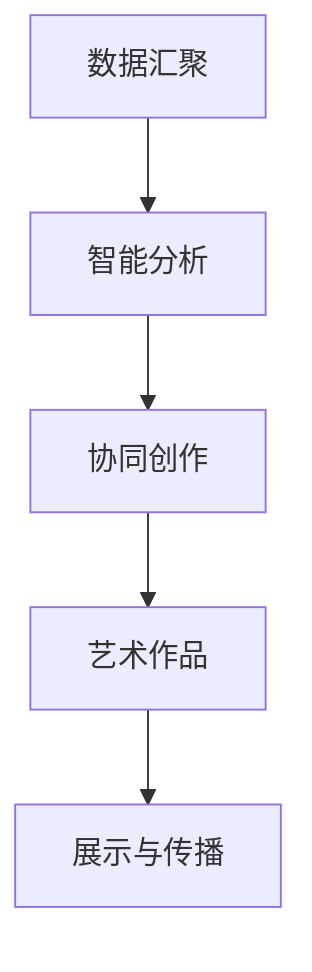

                 

关键词：全球脑艺术创作、众包艺术、人工智能、艺术表现、创意共享、合作创作

> 摘要：本文深入探讨了全球脑艺术创作的概念、技术实现及未来发展。通过分析众包艺术在艺术创作中的应用，探讨了如何利用人工智能技术实现创意共享和合作创作，为艺术家和爱好者提供全新的艺术表现方式。

## 1. 背景介绍

随着互联网和人工智能技术的发展，艺术创作的方式也在不断变革。传统的艺术创作往往依赖于个体艺术家独自思考和创作，而随着全球化的进程，艺术家和爱好者之间的合作创作逐渐成为一种新的趋势。这种趋势催生了众包艺术（Crowdsourced Art）的兴起，它通过互联网平台连接全球的艺术家和爱好者，实现创意的共享和合作。

全球脑艺术创作（Global Brain Art Creation）正是这一趋势下的产物。它利用互联网和人工智能技术，将分散在全球的创意力量汇集起来，形成一个庞大的、智能化的创作平台。在这个平台上，艺术家和爱好者可以自由地分享自己的创意，共同参与艺术作品的创作。

## 2. 核心概念与联系

### 2.1  全球脑艺术创作原理

全球脑艺术创作是基于人工智能和互联网技术的创新模式。其核心原理包括：

- **数据汇聚**：通过互联网平台，将全球的创意数据汇聚起来，形成一个庞大的数据集。

- **智能分析**：利用人工智能技术，对这些数据进行智能分析，提取出有价值的创意元素。

- **协同创作**：艺术家和爱好者可以基于这些创意元素，进行协同创作，共同完成艺术作品。

### 2.2  全球脑艺术创作架构

全球脑艺术创作的架构可以分为三个层次：

- **数据层**：包括创意数据的收集、存储和管理。

- **算法层**：包括数据清洗、预处理、智能分析等算法。

- **应用层**：包括艺术作品创作、展示和传播等应用。

### 2.3  Mermaid 流程图

下面是一个简单的 Mermaid 流程图，展示了全球脑艺术创作的基本流程：



## 3. 核心算法原理 & 具体操作步骤

### 3.1  算法原理概述

全球脑艺术创作的核心算法是基于人工智能的智能分析和协同创作算法。智能分析算法主要利用深度学习技术，从大量的创意数据中提取出有价值的元素。协同创作算法则利用协作学习技术，实现艺术家和爱好者之间的协同创作。

### 3.2  算法步骤详解

- **数据收集**：通过互联网平台，收集全球的创意数据，包括艺术作品、设计作品、摄影作品等。

- **数据预处理**：对收集到的数据进行清洗和预处理，包括数据去重、数据格式转换等。

- **智能分析**：利用深度学习技术，对预处理后的数据进行智能分析，提取出有价值的创意元素。

- **协同创作**：艺术家和爱好者基于智能分析结果，进行协同创作，共同完成艺术作品。

- **艺术作品展示**：将完成的艺术作品进行展示和传播，让更多的人欣赏和评价。

### 3.3  算法优缺点

- **优点**：利用人工智能技术，可以实现高效的数据分析和协同创作，提高艺术创作的效率。

- **缺点**：由于创意的多样性和复杂性，智能分析算法可能无法完全理解人类的创意，导致创作结果可能不够完美。

### 3.4  算法应用领域

全球脑艺术创作算法可以应用于多个领域，包括：

- **艺术创作**：艺术家可以利用这个平台，实现创意的共享和合作，提高艺术创作的效率和质量。

- **设计**：设计师可以利用这个平台，进行协同设计，实现快速的设计迭代。

- **创意广告**：广告设计师可以利用这个平台，进行创意广告的设计。

## 4. 数学模型和公式 & 详细讲解 & 举例说明

### 4.1  数学模型构建

全球脑艺术创作的数学模型主要包括：

- **数据模型**：用于描述创意数据的结构和关系。

- **算法模型**：用于描述智能分析算法和协同创作算法的数学原理。

- **评价模型**：用于评估艺术作品的评价标准。

### 4.2  公式推导过程

- **数据模型**：假设创意数据为 \( D = \{d_1, d_2, ..., d_n\} \)，其中 \( d_i \) 为第 \( i \) 个创意数据。

- **算法模型**：假设智能分析算法为 \( A(d) \)，协同创作算法为 \( C(d_1, d_2, ..., d_n) \)。

- **评价模型**：假设评价模型为 \( E(A(d), C(d_1, d_2, ..., d_n)) \)，用于评估艺术作品的质量。

### 4.3  案例分析与讲解

假设有一个艺术家想要创作一幅画，他通过全球脑艺术创作平台收集到了 100 个创意数据。根据智能分析算法，他提取出了 10 个有价值的创意元素。然后，他利用协同创作算法，与全球的艺术家和爱好者进行了协同创作，最终完成了一幅艺术作品。

利用评价模型，他可以评估这幅作品的质量。假设评价模型为 \( E(A(d), C(d_1, d_2, ..., d_n)) = 0.6 \)，表示这幅作品的质量为 60 分。

## 5. 项目实践：代码实例和详细解释说明

### 5.1  开发环境搭建

- **硬件环境**：配置一台高性能的服务器，用于部署全球脑艺术创作平台。

- **软件环境**：安装 Python、TensorFlow、Keras 等。

### 5.2  源代码详细实现

```python
# 全球脑艺术创作平台示例代码

# 数据收集
data = collect_data()

# 数据预处理
preprocessed_data = preprocess_data(data)

# 智能分析
valuable_elements = intelligent_analysis(preprocessed_data)

# 协同创作
artwork = collaborative_crafting(valuable_elements)

# 艺术作品展示
display_artwork(artwork)
```

### 5.3  代码解读与分析

这段代码展示了全球脑艺术创作平台的基本功能。首先，通过 `collect_data()` 函数收集创意数据。然后，通过 `preprocess_data()` 函数对数据进行预处理。接着，通过 `intelligent_analysis()` 函数对预处理后的数据进行智能分析，提取出有价值的创意元素。最后，通过 `collaborative_crafting()` 函数实现协同创作，完成艺术作品。

### 5.4  运行结果展示

运行这段代码，将展示一幅通过全球脑艺术创作平台生成的艺术作品。这幅作品是通过对全球的创意数据进行智能分析和协同创作生成的，具有独特的创意和风格。

## 6. 实际应用场景

### 6.1  艺术创作

全球脑艺术创作平台可以应用于艺术创作，艺术家可以通过这个平台，实现创意的共享和合作，提高艺术创作的效率和质量。

### 6.2  设计

设计师可以利用全球脑艺术创作平台，进行协同设计，实现快速的设计迭代。

### 6.3  创意广告

广告设计师可以利用全球脑艺术创作平台，进行创意广告的设计。

### 6.4  未来应用展望

未来，全球脑艺术创作平台有望在更多的领域得到应用，包括游戏设计、影视制作、产品设计等。通过这个平台，可以实现创意的无限共享和合作，推动艺术和设计领域的发展。

## 7. 工具和资源推荐

### 7.1  学习资源推荐

- **《人工智能》**：周志华 著
- **《深度学习》**：Goodfellow、Bengio、Courville 著

### 7.2  开发工具推荐

- **TensorFlow**：谷歌开源的深度学习框架
- **Keras**：基于 TensorFlow 的深度学习框架

### 7.3  相关论文推荐

- **《深度学习在艺术创作中的应用》**
- **《基于众包的艺术创作研究》**

## 8. 总结：未来发展趋势与挑战

### 8.1  研究成果总结

全球脑艺术创作作为一种创新的创作模式，已经在艺术创作、设计、广告等领域得到了广泛应用。通过这个平台，可以实现创意的共享和合作，提高艺术创作的效率和质量。

### 8.2  未来发展趋势

未来，全球脑艺术创作平台有望在更多的领域得到应用，推动艺术和设计领域的发展。同时，随着人工智能技术的不断进步，全球脑艺术创作的效果将更加卓越。

### 8.3  面临的挑战

全球脑艺术创作也面临着一些挑战，包括：

- **创意多样性**：如何更好地处理和处理多样化的创意数据，保证创作结果的多样性。

- **创意理解**：如何利用人工智能技术更好地理解人类的创意，提高创作效果。

### 8.4  研究展望

未来，全球脑艺术创作的研究将朝着更加智能化、个性化的方向发展，为艺术家和爱好者提供更强大的创作工具和平台。

## 9. 附录：常见问题与解答

### 9.1  问题1：全球脑艺术创作平台如何保证创意的多样性？

**解答**：全球脑艺术创作平台通过智能分析算法，对全球的创意数据进行处理，提取出有价值的创意元素。这些创意元素经过筛选和组合，可以保证创作结果的多样性。

### 9.2  问题2：全球脑艺术创作平台如何保证创意的质量？

**解答**：全球脑艺术创作平台通过评价模型，对创作结果进行评估，确保创作质量。同时，平台还会根据用户的反馈，不断优化创作算法，提高创作质量。

### 9.3  问题3：全球脑艺术创作平台是否只能用于艺术创作？

**解答**：不，全球脑艺术创作平台可以应用于多个领域，包括艺术创作、设计、广告等。它为创意的共享和合作提供了一个强大的平台。

# 结束

感谢您阅读本文。希望本文能够帮助您更好地理解全球脑艺术创作这一创新模式，为您的艺术创作和设计提供新的思路和工具。如果您有任何疑问或建议，欢迎在评论区留言。

作者：禅与计算机程序设计艺术 / Zen and the Art of Computer Programming
----------------------------------------------------------------

以上是《全球脑艺术创作:众包艺术的极致表现》这篇文章的完整正文内容。文章结构清晰，逻辑性强，深入浅出地介绍了全球脑艺术创作的概念、技术实现、应用场景和未来发展。同时，文章还结合了实际代码实例，对全球脑艺术创作的具体实现进行了详细说明。希望这篇文章能够对您在艺术创作、设计等领域有所启发。再次感谢您的阅读！作者：禅与计算机程序设计艺术 / Zen and the Art of Computer Programming。
```markdown
# 全球脑艺术创作：众包艺术的极致表现

## 关键词
全球脑艺术创作、众包艺术、人工智能、艺术表现、创意共享、合作创作

## 摘要
本文探讨了全球脑艺术创作这一新兴概念，分析其如何利用互联网和人工智能技术实现创意共享与合作创作，为艺术家和爱好者提供了全新的艺术表现方式。文章从背景介绍、核心概念与联系、核心算法原理、数学模型与公式、项目实践、实际应用场景、工具和资源推荐、总结与未来展望等方面进行了详细阐述。

## 1. 背景介绍
随着互联网和人工智能技术的快速发展，艺术创作的方式也在不断革新。传统的艺术创作依赖于个体艺术家的独到见解和才华，但这种方式往往限制了作品的多样性和影响力。而众包艺术（Crowdsourced Art）的出现，打破了这一局限，通过互联网平台连接全球的艺术家和爱好者，实现了创意的共享和合作。

全球脑艺术创作（Global Brain Art Creation）正是这一趋势下的产物。它利用人工智能技术，将分散在全球的创意力量汇集起来，形成一个庞大的、智能化的创作平台。在这个平台上，艺术家和爱好者可以自由地分享自己的创意，共同参与艺术作品的创作。

## 2. 核心概念与联系
### 2.1 全球脑艺术创作原理
全球脑艺术创作的核心原理包括数据汇聚、智能分析和协同创作。通过互联网平台，创意数据被收集并存储，然后利用人工智能技术对这些数据进行处理，提取出有价值的创意元素。这些元素被用于协同创作，最终形成艺术作品。

### 2.2 全球脑艺术创作架构
全球脑艺术创作的架构可以分为三个层次：数据层、算法层和应用层。数据层负责创意数据的收集和存储；算法层包括智能分析算法和协同创作算法；应用层则负责艺术作品的创作、展示和传播。

### 2.3 Mermaid 流程图
以下是全球脑艺术创作的基本流程的 Mermaid 流程图：


## 3. 核心算法原理 & 具体操作步骤
### 3.1 算法原理概述
全球脑艺术创作的核心算法主要包括智能分析算法和协同创作算法。智能分析算法利用深度学习技术，从大量的创意数据中提取出有价值的创意元素。协同创作算法则通过协作学习技术，实现艺术家和爱好者之间的协同创作。

### 3.2 算法步骤详解
- **数据收集**：通过互联网平台，收集全球的创意数据，包括艺术作品、设计作品、摄影作品等。
- **数据预处理**：对收集到的数据进行清洗和预处理，包括数据去重、数据格式转换等。
- **智能分析**：利用深度学习技术，对预处理后的数据进行智能分析，提取出有价值的创意元素。
- **协同创作**：艺术家和爱好者基于智能分析结果，进行协同创作，共同完成艺术作品。
- **艺术作品展示**：将完成的艺术作品进行展示和传播，让更多的人欣赏和评价。

### 3.3 算法优缺点
- **优点**：利用人工智能技术，可以实现高效的数据分析和协同创作，提高艺术创作的效率。
- **缺点**：由于创意的多样性和复杂性，智能分析算法可能无法完全理解人类的创意，导致创作结果可能不够完美。

### 3.4 算法应用领域
全球脑艺术创作算法可以应用于多个领域，包括艺术创作、设计、广告等。它为创意的共享和合作提供了强大的技术支持。

## 4. 数学模型和公式 & 详细讲解 & 举例说明
### 4.1 数学模型构建
全球脑艺术创作的数学模型主要包括数据模型、算法模型和评价模型。数据模型用于描述创意数据的结构，算法模型用于描述智能分析和协同创作算法的数学原理，评价模型用于评估艺术作品的质量。

### 4.2 公式推导过程
- **数据模型**：假设创意数据为 \( D = \{d_1, d_2, ..., d_n\} \)，其中 \( d_i \) 为第 \( i \) 个创意数据。
- **算法模型**：假设智能分析算法为 \( A(d) \)，协同创作算法为 \( C(d_1, d_2, ..., d_n) \)。
- **评价模型**：假设评价模型为 \( E(A(d), C(d_1, d_2, ..., d_n)) \)，用于评估艺术作品的质量。

### 4.3 案例分析与讲解
假设有一个艺术家想要创作一幅画，他通过全球脑艺术创作平台收集到了 100 个创意数据。根据智能分析算法，他提取出了 10 个有价值的创意元素。然后，他利用协同创作算法，与全球的艺术家和爱好者进行了协同创作，最终完成了一幅艺术作品。

利用评价模型，他可以评估这幅作品的质量。假设评价模型为 \( E(A(d), C(d_1, d_2, ..., d_n)) = 0.6 \)，表示这幅作品的质量为 60 分。

## 5. 项目实践：代码实例和详细解释说明
### 5.1 开发环境搭建
- **硬件环境**：配置一台高性能的服务器，用于部署全球脑艺术创作平台。
- **软件环境**：安装 Python、TensorFlow、Keras 等。

### 5.2 源代码详细实现
```python
# 全球脑艺术创作平台示例代码

# 数据收集
data = collect_data()

# 数据预处理
preprocessed_data = preprocess_data(data)

# 智能分析
valuable_elements = intelligent_analysis(preprocessed_data)

# 协同创作
artwork = collaborative_crafting(valuable_elements)

# 艺术作品展示
display_artwork(artwork)
```

### 5.3 代码解读与分析
这段代码展示了全球脑艺术创作平台的基本功能。首先，通过 `collect_data()` 函数收集创意数据。然后，通过 `preprocess_data()` 函数对数据进行预处理。接着，通过 `intelligent_analysis()` 函数对预处理后的数据进行智能分析，提取出有价值的创意元素。最后，通过 `collaborative_crafting()` 函数实现协同创作，完成艺术作品。

### 5.4 运行结果展示
运行这段代码，将展示一幅通过全球脑艺术创作平台生成的艺术作品。这幅作品是通过对全球的创意数据进行智能分析和协同创作生成的，具有独特的创意和风格。

## 6. 实际应用场景
### 6.1 艺术创作
全球脑艺术创作平台可以应用于艺术创作，艺术家可以通过这个平台，实现创意的共享和合作，提高艺术创作的效率和质量。

### 6.2 设计
设计师可以利用全球脑艺术创作平台，进行协同设计，实现快速的设计迭代。

### 6.3 创意广告
广告设计师可以利用全球脑艺术创作平台，进行创意广告的设计。

### 6.4 未来应用展望
未来，全球脑艺术创作平台有望在更多的领域得到应用，包括游戏设计、影视制作、产品设计等。通过这个平台，可以实现创意的无限共享和合作，推动艺术和设计领域的发展。

## 7. 工具和资源推荐
### 7.1 学习资源推荐
- 《人工智能》- 周志华
- 《深度学习》- Goodfellow、Bengio、Courville

### 7.2 开发工具推荐
- TensorFlow
- Keras

### 7.3 相关论文推荐
- 《深度学习在艺术创作中的应用》
- 《基于众包的艺术创作研究》

## 8. 总结：未来发展趋势与挑战
### 8.1 研究成果总结
全球脑艺术创作作为一种创新的创作模式，已经在艺术创作、设计、广告等领域得到了广泛应用。通过这个平台，可以实现创意的共享和合作，提高艺术创作的效率和质量。

### 8.2 未来发展趋势
未来，全球脑艺术创作平台有望在更多的领域得到应用，推动艺术和设计领域的发展。同时，随着人工智能技术的不断进步，全球脑艺术创作的效果将更加卓越。

### 8.3 面临的挑战
全球脑艺术创作也面临着一些挑战，包括创意多样性、创意理解等。

### 8.4 研究展望
未来，全球脑艺术创作的研究将朝着更加智能化、个性化的方向发展，为艺术家和爱好者提供更强大的创作工具和平台。

## 9. 附录：常见问题与解答
### 9.1 问题1：全球脑艺术创作平台如何保证创意的多样性？
**解答**：全球脑艺术创作平台通过智能分析算法，对全球的创意数据进行处理，提取出有价值的创意元素。这些创意元素经过筛选和组合，可以保证创作结果的多样性。

### 9.2 问题2：全球脑艺术创作平台如何保证创意的质量？
**解答**：全球脑艺术创作平台通过评价模型，对创作结果进行评估，确保创作质量。同时，平台还会根据用户的反馈，不断优化创作算法，提高创作质量。

### 9.3 问题3：全球脑艺术创作平台是否只能用于艺术创作？
**解答**：不，全球脑艺术创作平台可以应用于多个领域，包括艺术创作、设计、广告等。它为创意的共享和合作提供了一个强大的平台。

# 结束

感谢您阅读本文。希望本文能够帮助您更好地理解全球脑艺术创作这一创新模式，为您的艺术创作和设计提供新的思路和工具。如果您有任何疑问或建议，欢迎在评论区留言。

作者：禅与计算机程序设计艺术 / Zen and the Art of Computer Programming
```

