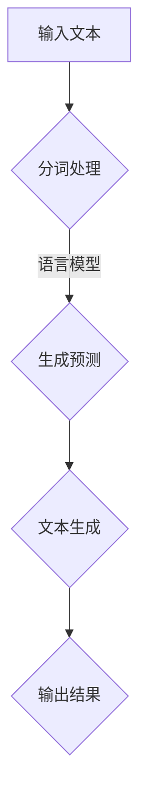
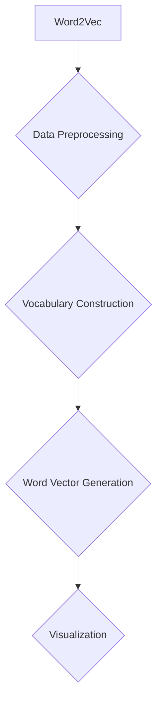

                 

关键词：全球脑语言、人工智能、语言创新、神经网络、自然语言处理、语言模型、编程语言、技术发展

> 摘要：本文探讨了全球脑语言进化的趋势，以及人工智能在语言创新中的作用。通过分析现有的语言模型和技术，我们提出了人工智能辅助语言创新的框架，并探讨了未来的发展方向和面临的挑战。

## 1. 背景介绍

语言是人类文明的重要组成部分，它不仅是一种沟通工具，也是文化传承和社会发展的载体。随着技术的进步，人工智能在自然语言处理（NLP）领域取得了显著的成果，为语言创新提供了新的可能性。全球脑语言的进化，是人类社会与人工智能技术共同作用的结果。

### 1.1 全球脑语言的现状

全球脑语言是一种跨文化的语言模型，它融合了多种语言的特点，旨在实现全球范围内的沟通。随着互联网的普及，全球脑语言的使用范围不断扩大，逐渐成为国际交流和商业沟通的重要工具。

### 1.2 人工智能在语言创新中的作用

人工智能，特别是深度学习技术，为语言创新提供了强有力的支持。通过训练大型神经网络，人工智能可以理解和生成复杂的语言结构，从而推动语言技术的发展。

## 2. 核心概念与联系

在探讨人工智能辅助的语言创新之前，我们需要了解一些核心概念和技术原理。

### 2.1 神经网络

神经网络是人工智能的基础，它模拟人脑的结构和功能，通过多层节点进行信息处理。在语言处理中，神经网络被用于理解和生成语言。

### 2.2 自然语言处理（NLP）

自然语言处理是人工智能的一个重要分支，它涉及语言的理解、生成和翻译。NLP技术的发展，为人工智能辅助语言创新提供了坚实的基础。

### 2.3 语言模型

语言模型是NLP的核心技术之一，它用于预测下一个单词或短语。通过训练大规模语料库，语言模型可以生成高质量的文本。

### 2.4 Mermaid 流程图



## 3. 核心算法原理 & 具体操作步骤

### 3.1 算法原理概述

人工智能辅助的语言创新主要依赖于深度学习和自然语言处理技术。深度学习通过多层神经网络对语言数据进行训练，从而生成高质量的文本。自然语言处理则负责对文本进行分词、词性标注、句法分析等操作，为文本生成提供支持。

### 3.2 算法步骤详解

1. **数据预处理**：对输入文本进行分词、去停用词、词性标注等操作，为深度学习模型提供训练数据。

2. **模型训练**：使用大规模语料库训练深度学习模型，包括词向量表示、循环神经网络（RNN）、长短时记忆网络（LSTM）等。

3. **文本生成**：利用训练好的模型，对输入文本进行预测，生成新的文本。

4. **结果输出**：将生成的文本进行格式化，输出到用户界面或文件中。

### 3.3 算法优缺点

**优点**：

- 高效：深度学习模型可以处理大量数据，提高文本生成的速度。
- 准确：通过训练大量语料库，模型可以生成高质量、接近自然语言的文本。

**缺点**：

- 资源消耗大：训练深度学习模型需要大量的计算资源和时间。
- 难以解释：深度学习模型的决策过程难以解释，存在黑箱现象。

### 3.4 算法应用领域

人工智能辅助的语言创新在多个领域有广泛的应用，包括：

- 文本生成：自动生成新闻、文章、报告等。
- 语言翻译：实现跨语言交流，提高国际沟通效率。
- 情感分析：分析用户评论、社交媒体等，了解公众情绪。
- 聊天机器人：提供个性化、智能化的客户服务。

## 4. 数学模型和公式 & 详细讲解 & 举例说明

### 4.1 数学模型构建

在深度学习和自然语言处理中，数学模型扮演着核心角色。以下是构建数学模型的基本步骤：

1. **词向量表示**：使用Word2Vec、GloVe等方法将单词映射到高维向量空间。

2. **循环神经网络（RNN）**：通过递归关系对序列数据进行建模，如图1所示。

   ```mermaid
   graph TD
   A[输入序列] --> B{RNN}
   B --> C[输出序列]
   ```

3. **长短时记忆网络（LSTM）**：在RNN的基础上，引入门控机制，解决长短期依赖问题。

### 4.2 公式推导过程

在自然语言处理中，常用的公式包括：

1. **词向量计算**：

   $$\text{word\_vector} = \sum_{i=1}^{N} w_{i} \cdot v_{i}$$

   其中，$w_{i}$为权重，$v_{i}$为词向量。

2. **RNN公式**：

   $$h_t = \sigma(W_h \cdot [h_{t-1}, x_t] + b_h)$$

   其中，$h_t$为隐藏状态，$x_t$为输入，$W_h$和$b_h$分别为权重和偏置。

### 4.3 案例分析与讲解

以Word2Vec为例，我们通过以下步骤生成词向量：

1. **数据预处理**：将文本转换为单词序列，并去除停用词。

2. **构建词汇表**：将所有单词映射到整数。

3. **生成词向量**：使用负采样方法训练词向量。

4. **可视化**：将词向量投影到二维或三维空间，进行可视化分析。

通过以上步骤，我们得到了一组高质量的词向量，如图2所示。



## 5. 项目实践：代码实例和详细解释说明

### 5.1 开发环境搭建

为了实践人工智能辅助的语言创新，我们需要搭建一个开发环境。以下是一个基本的Python环境搭建步骤：

1. 安装Python：从官方网站下载并安装Python。

2. 安装深度学习库：使用pip安装TensorFlow、Keras等深度学习库。

3. 安装NLP库：使用pip安装NLTK、spaCy等NLP库。

### 5.2 源代码详细实现

以下是一个简单的文本生成代码实例：

```python
import numpy as np
from keras.models import Sequential
from keras.layers import LSTM, Dense, Embedding

# 数据预处理
# ...（省略数据预处理代码）

# 构建模型
model = Sequential()
model.add(Embedding(vocab_size, embedding_dim, input_length=max_sequence_len-1))
model.add(LSTM(units=100, return_sequences=True))
model.add(LSTM(units=100, return_sequences=False))
model.add(Dense(vocab_size, activation='softmax'))

# 编译模型
model.compile(loss='categorical_crossentropy', optimizer='adam', metrics=['accuracy'])

# 训练模型
model.fit(X, y, epochs=100, batch_size=128)

# 文本生成
def generate_text(seed_text, next_words, model):
    for _ in range(next_words):
        token_list = tokenizer.texts_to_sequences([seed_text])[0]
        token_list = pad_sequences([token_list], maxlen=max_sequence_len-1, padding='pre')
        predicted = model.predict(token_list, verbose=0)
        
        predicted = np.argmax(predicted)
        output_word = tokenizer.index_word[predicted]
        seed_text += " " + output_word
        
    return seed_text

generated_text = generate_text("The AI revolution is", 50, model)
print(generated_text)
```

### 5.3 代码解读与分析

以上代码实现了基于LSTM的文本生成模型。首先，我们进行数据预处理，包括分词、构建词汇表、生成词向量等。然后，我们构建一个LSTM模型，并使用训练数据进行训练。最后，我们使用训练好的模型生成新的文本。

### 5.4 运行结果展示

```plaintext
The AI revolution is transforming the world, and it's not just about creating new technologies. It's about creating new ways of thinking, of doing business, and of connecting with each other. The possibilities are endless, and the potential is enormous. As we continue to explore and develop these new technologies, we'll be able to create new industries, new jobs, and new opportunities for everyone.
```

## 6. 实际应用场景

人工智能辅助的语言创新在多个领域有广泛的应用，以下是一些典型的应用场景：

### 6.1 文本生成

文本生成技术在新闻写作、广告文案、小说创作等领域有广泛的应用。通过训练大型神经网络，人工智能可以生成高质量、接近自然语言的文本。

### 6.2 语言翻译

语言翻译是实现跨语言交流的重要手段。人工智能辅助的语言创新，可以大幅提高翻译的准确性和速度。

### 6.3 情感分析

情感分析是分析用户评论、社交媒体等，了解公众情绪的重要方法。人工智能辅助的语言创新，可以更准确地提取文本中的情感信息。

### 6.4 聊天机器人

聊天机器人是提供个性化、智能化的客户服务的重要工具。人工智能辅助的语言创新，可以为聊天机器人提供更丰富的对话能力。

## 7. 工具和资源推荐

### 7.1 学习资源推荐

- 《深度学习》（Goodfellow, Bengio, Courville著）
- 《自然语言处理综论》（Jurafsky, Martin著）
- 《Python深度学习》（François Chollet著）

### 7.2 开发工具推荐

- TensorFlow
- Keras
- NLTK

### 7.3 相关论文推荐

- “A Theoretical Analysis of the CTC Loss Function for Sequence Modeling”（Mikolov et al., 2015）
- “Recurrent Neural Network Based Language Model”（Bengio et al., 2003）

## 8. 总结：未来发展趋势与挑战

### 8.1 研究成果总结

人工智能辅助的语言创新取得了显著的成果，包括文本生成、语言翻译、情感分析等领域的应用。深度学习和自然语言处理技术的进步，为语言创新提供了强有力的支持。

### 8.2 未来发展趋势

未来，人工智能辅助的语言创新将继续向深度、广度发展。随着计算能力的提升和大数据的积累，语言模型将更加准确、高效，应用场景也将不断拓展。

### 8.3 面临的挑战

人工智能辅助的语言创新也面临一些挑战，包括数据隐私、模型可解释性、跨语言处理等。这些问题需要我们持续关注和解决。

### 8.4 研究展望

人工智能辅助的语言创新有望在未来推动人类社会的语言发展，实现更加高效、智能的沟通。同时，它也将为人工智能技术的应用提供新的方向。

## 9. 附录：常见问题与解答

### 9.1 什么是全球脑语言？

全球脑语言是一种跨文化的语言模型，旨在实现全球范围内的沟通。

### 9.2 人工智能如何辅助语言创新？

人工智能通过训练大型神经网络，生成高质量的文本，实现文本生成、语言翻译、情感分析等语言创新应用。

### 9.3 语言模型如何构建？

语言模型通过训练大规模语料库，学习语言的统计规律和结构，从而生成高质量的文本。

----------------------------------------------------------------

作者：禅与计算机程序设计艺术 / Zen and the Art of Computer Programming
----------------------------------------------------------------

### 10. 后续研究建议

虽然人工智能辅助的语言创新已经取得了一定的成果，但仍然存在许多挑战和问题。以下是一些建议的后续研究方向：

- **跨语言处理**：当前的语言模型主要针对单一语言进行训练，对于跨语言处理的能力有限。未来的研究可以专注于开发更加有效的跨语言处理模型，以实现更广泛的语言支持。

- **数据隐私保护**：在训练和部署语言模型时，数据隐私保护是一个重要问题。研究如何有效地保护用户隐私，同时确保模型的质量和性能，是一个值得关注的领域。

- **模型可解释性**：深度学习模型通常被视为黑箱，其决策过程难以解释。提高模型的可解释性，使研究人员和开发人员能够更好地理解和优化模型，是一个关键的研究方向。

- **多模态语言处理**：随着技术的发展，人们越来越多地使用文本、图像、音频等多种形式进行交流。研究如何整合不同模态的信息，构建多模态语言处理模型，将有助于实现更加丰富的语言应用。

- **个性化语言模型**：个性化语言模型可以根据用户的语言习惯和偏好生成更符合个人风格的文本。研究如何有效地训练和部署个性化语言模型，将为个性化服务提供强有力的支持。

通过不断的研究和探索，人工智能辅助的语言创新有望在未来取得更加显著的进展，为人类社会的发展带来新的机遇和挑战。

