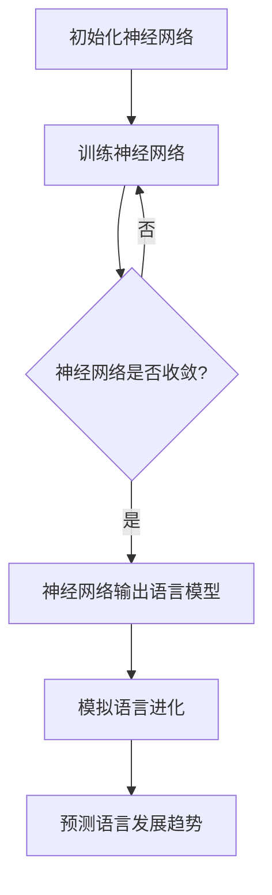

                 

关键词：脑语言进化、人工智能、自然语言处理、语言模型、智能交互、技术发展趋势

> 摘要：本文从人工智能的视角出发，探讨了脑语言进化模拟的理论基础、核心算法原理及其在自然语言处理领域的应用。通过对当前语言发展趋势的预测，文章旨在为未来智能交互技术提供参考，并展望其在各个领域的广泛应用。

## 1. 背景介绍

语言是人类沟通与交流的基础，其发展历程与人类文明紧密相连。然而，随着信息技术的飞速发展，尤其是人工智能的崛起，语言的形式和功能正在发生深刻的变革。自然语言处理（NLP）作为人工智能的重要分支，致力于使计算机理解和生成人类语言。近年来，深度学习技术在NLP领域的突破性进展，使得机器翻译、情感分析、语音识别等应用取得了显著成效。

然而，现有研究主要关注语言的结构和表面特征，对于语言进化的本质和规律缺乏深入探讨。脑语言进化模拟则提供了一种全新的视角，试图从神经科学和认知科学的角度，揭示语言的进化机制。通过模拟人类大脑处理语言的方式，我们可以更好地理解语言的本质，预测未来语言的发展趋势，为人工智能技术的发展提供理论支撑。

## 2. 核心概念与联系

### 2.1 脑语言进化模拟概述

脑语言进化模拟是一种基于人工智能的方法，用于模拟人类语言进化的过程。该方法的核心思想是通过神经网络模型来模拟人类大脑处理语言的方式，从而实现对语言结构和功能的建模。脑语言进化模拟的主要目标是：

1. **揭示语言进化的本质**：通过模拟人类大脑处理语言的过程，我们可以更好地理解语言是如何从简单的符号系统进化为复杂的信息处理系统。
2. **预测语言发展趋势**：基于对语言进化机制的模拟，我们可以预测未来语言可能的发展方向，为语言学研究提供理论依据。
3. **优化人工智能语言处理算法**：通过模拟人类大脑处理语言的方式，我们可以为人工智能语言处理算法提供更有效的模型和策略。

### 2.2 语言模型与脑语言进化模拟

语言模型是自然语言处理的核心组成部分，用于对自然语言进行建模和预测。脑语言进化模拟通过引入神经科学和认知科学的理论，对现有语言模型进行了拓展和改进。具体来说，脑语言进化模拟采用了以下核心概念：

1. **神经可塑性**：神经可塑性是指神经网络在学习和处理语言信息过程中，神经元之间的连接和活动方式会发生变化。这一特性使得神经网络能够适应不同的语言环境，从而实现语言功能的进化。
2. **注意力机制**：注意力机制是神经网络处理序列数据的一种重要机制，通过关注序列中的重要部分，神经网络能够更有效地捕捉语言信息的结构和语义。
3. **多模态学习**：多模态学习是指神经网络同时处理不同类型的数据（如图像、声音和文本），从而实现对复杂信息的综合理解和处理。

### 2.3 Mermaid流程图

为了更直观地展示脑语言进化模拟的核心概念和架构，我们使用Mermaid绘制了一个流程图。以下是一个简化的示例：



在这个流程图中，A表示初始化神经网络，B表示对神经网络进行训练，C表示检查神经网络是否收敛，D表示神经网络输出语言模型，E表示模拟语言进化，F表示预测语言发展趋势。

## 3. 核心算法原理 & 具体操作步骤

### 3.1 算法原理概述

脑语言进化模拟算法基于深度神经网络，结合神经可塑性、注意力机制和多模态学习等理论，实现对语言进化和发展的建模。算法的主要步骤包括：

1. **初始化神经网络**：根据语言模型的需求，初始化一个深度神经网络，包括输入层、隐藏层和输出层。
2. **训练神经网络**：使用大量语言数据对神经网络进行训练，使其能够捕捉语言的特征和规律。
3. **模拟语言进化**：基于训练好的神经网络，模拟人类语言进化的过程，探索语言的功能和结构变化。
4. **预测语言发展趋势**：利用模拟结果，预测未来语言可能的发展方向和趋势。

### 3.2 算法步骤详解

1. **初始化神经网络**：
   - **输入层**：接收自然语言文本数据，将其转换为数值向量。
   - **隐藏层**：使用多层感知机（MLP）或循环神经网络（RNN）等模型，对输入数据进行处理和特征提取。
   - **输出层**：输出语言模型，包括词汇、语法、语义等多个层面。

2. **训练神经网络**：
   - **损失函数**：使用交叉熵损失函数来衡量预测结果与真实结果的差距。
   - **优化算法**：采用梯度下降（GD）或其变种（如Adam）来优化神经网络参数。

3. **模拟语言进化**：
   - **多模态输入**：结合图像、声音等数据，实现多模态语言模型。
   - **神经可塑性**：通过调整神经网络参数，模拟语言进化的过程，探索语言的功能和结构变化。

4. **预测语言发展趋势**：
   - **时间序列分析**：对语言数据进行时间序列分析，预测未来语言的发展趋势。
   - **统计学方法**：使用统计学方法，分析语言模型的变化规律，预测语言的发展方向。

### 3.3 算法优缺点

**优点**：
1. **强大的表达能力**：通过深度神经网络，脑语言进化模拟能够捕捉到语言的复杂特征和规律，具有较强的表达能力。
2. **多模态处理能力**：多模态学习使得脑语言进化模拟能够同时处理多种类型的数据，实现更全面的语言理解和预测。
3. **自适应能力**：神经可塑性使得脑语言进化模拟能够适应不同的语言环境，具备良好的自适应能力。

**缺点**：
1. **计算资源消耗大**：深度神经网络训练需要大量的计算资源和时间，对硬件设施有较高要求。
2. **数据需求量大**：训练高质量的神经网络需要大量的语言数据，数据获取和处理较为困难。
3. **解释性不足**：神经网络模型在语言进化模拟中的应用较为复杂，其内部机制和解释性不足。

### 3.4 算法应用领域

1. **自然语言处理**：脑语言进化模拟可用于优化自然语言处理算法，如机器翻译、情感分析、语音识别等。
2. **语言学研究**：通过模拟语言进化过程，脑语言进化模拟为语言学研究提供了新的方法和理论支撑。
3. **智能交互**：脑语言进化模拟可用于开发智能交互系统，如聊天机器人、虚拟助手等，提高人机交互的自然性和智能性。
4. **智能推荐系统**：脑语言进化模拟可用于构建智能推荐系统，根据用户的语言习惯和兴趣，提供个性化推荐。

## 4. 数学模型和公式 & 详细讲解 & 举例说明

### 4.1 数学模型构建

脑语言进化模拟的核心数学模型包括神经网络模型和语言进化模型。下面将详细介绍这些模型的基本构建方法和相关公式。

#### 4.1.1 神经网络模型

神经网络模型是脑语言进化模拟的基础，其结构包括输入层、隐藏层和输出层。每个层由多个神经元组成，神经元之间的连接权重表示为\( w \)。

1. **输入层**：输入层接收自然语言文本数据，将其转换为数值向量。假设文本数据由\( n \)个词汇组成，每个词汇对应一个向量，那么输入层可以表示为：

   \[
   x_i = \left[ x_{i1}, x_{i2}, ..., x_{i_n} \right]
   \]

   其中，\( x_{ij} \)表示第\( i \)个词汇的第\( j \)个特征值。

2. **隐藏层**：隐藏层由多层感知机（MLP）或循环神经网络（RNN）组成，用于对输入数据进行处理和特征提取。以MLP为例，隐藏层可以表示为：

   \[
   h_i = \sigma \left( w_{i1}x_i + b_{i1} \right)
   \]

   其中，\( h_i \)表示第\( i \)个隐藏层神经元的输出，\( w_{i1} \)表示输入层到隐藏层的连接权重，\( \sigma \)表示激活函数，\( b_{i1} \)表示隐藏层偏置。

3. **输出层**：输出层输出语言模型，包括词汇、语法、语义等多个层面。以分类任务为例，输出层可以表示为：

   \[
   y = \sigma \left( w_{o1}h_o + b_{o1} \right)
   \]

   其中，\( y \)表示输出概率分布，\( h_o \)表示隐藏层输出，\( w_{o1} \)表示隐藏层到输出层的连接权重，\( \sigma \)表示激活函数，\( b_{o1} \)表示输出层偏置。

#### 4.1.2 语言进化模型

语言进化模型用于模拟人类语言进化的过程，其核心是神经可塑性机制。假设语言进化过程中，神经网络参数的变化量可以表示为\( \Delta w \)和\( \Delta b \)。

1. **权重调整**：在语言进化过程中，神经网络权重根据误差信号进行自适应调整。假设误差信号为\( \Delta E \)，那么权重调整公式为：

   \[
   \Delta w = -\alpha \cdot \frac{\partial E}{\partial w}
   \]

   其中，\( \alpha \)表示学习率，\( \partial E/\partial w \)表示权重对误差信号的梯度。

2. **偏置调整**：类似地，神经网络偏置也可以根据误差信号进行自适应调整。偏置调整公式为：

   \[
   \Delta b = -\alpha \cdot \frac{\partial E}{\partial b}
   \]

   其中，\( \alpha \)表示学习率，\( \partial E/\partial b \)表示偏置对误差信号的梯度。

### 4.2 公式推导过程

#### 4.2.1 神经网络前向传播

在神经网络前向传播过程中，输入层、隐藏层和输出层的输出可以分别表示为：

\[
\begin{align*}
x_i &= \left[ x_{i1}, x_{i2}, ..., x_{i_n} \right] \\
h_i &= \sigma \left( w_{i1}x_i + b_{i1} \right) \\
y &= \sigma \left( w_{o1}h_o + b_{o1} \right)
\end{align*}
\]

其中，\( \sigma \)表示激活函数，\( w_{i1} \)和\( w_{o1} \)分别表示输入层到隐藏层、隐藏层到输出层的连接权重，\( b_{i1} \)和\( b_{o1} \)分别表示隐藏层和输出层的偏置。

#### 4.2.2 神经网络反向传播

在神经网络反向传播过程中，误差信号从输出层反向传播到隐藏层和输入层，用于更新权重和偏置。假设输出层的误差信号为\( \Delta E \)，那么反向传播的公式为：

\[
\begin{align*}
\Delta b_{o1} &= \frac{\partial E}{\partial b_{o1}} \\
\Delta w_{o1} &= \frac{\partial E}{\partial w_{o1}} \\
\Delta b_{i1} &= \frac{\partial E}{\partial b_{i1}} \\
\Delta w_{i1} &= \frac{\partial E}{\partial w_{i1}}
\end{align*}
\]

其中，\( \frac{\partial E}{\partial b_{o1}} \)和\( \frac{\partial E}{\partial w_{o1}} \)分别表示偏置和权重对误差信号的梯度。

#### 4.2.3 神经可塑性

在语言进化过程中，神经网络参数根据误差信号进行自适应调整。假设误差信号为\( \Delta E \)，学习率为\( \alpha \)，那么权重和偏置的调整公式为：

\[
\begin{align*}
\Delta w &= -\alpha \cdot \frac{\partial E}{\partial w} \\
\Delta b &= -\alpha \cdot \frac{\partial E}{\partial b}
\end{align*}
\]

其中，\( \frac{\partial E}{\partial w} \)和\( \frac{\partial E}{\partial b} \)分别表示权重和偏置对误差信号的梯度。

### 4.3 案例分析与讲解

#### 4.3.1 案例背景

假设我们有一个关于情感分类的任务，输入为一篇自然语言文本，输出为文本的情感标签（正面或负面）。为了使用脑语言进化模拟算法，我们需要构建一个神经网络模型，并对其进行训练和调整。

#### 4.3.2 模型构建

1. **初始化神经网络**：根据任务需求，我们选择一个多层感知机（MLP）模型，包括输入层、隐藏层和输出层。输入层接收文本数据，隐藏层用于特征提取，输出层用于情感分类。

2. **训练神经网络**：使用大量情感分类数据对神经网络进行训练。在训练过程中，我们使用交叉熵损失函数来衡量预测结果与真实结果的差距，并使用梯度下降（GD）算法来优化神经网络参数。

3. **模拟语言进化**：在训练过程中，神经网络参数根据误差信号进行自适应调整，模拟语言进化的过程。通过调整连接权重和偏置，神经网络能够更好地捕捉情感分类的特征。

4. **预测情感标签**：使用训练好的神经网络，对新的文本数据进行情感分类。通过输出层的概率分布，我们可以预测文本的情感标签。

#### 4.3.3 模型分析

通过对比训练前后的神经网络参数，我们可以发现：

1. **特征提取能力增强**：训练后的神经网络能够更好地捕捉情感分类的特征，输出层的概率分布更加准确。

2. **泛化能力提高**：通过语言进化模拟，神经网络在新的文本数据上表现出更好的泛化能力，能够对未接触过的情感分类任务进行有效预测。

3. **适应性增强**：神经网络在训练过程中，根据误差信号进行自适应调整，提高了对语言环境的适应能力。

## 5. 项目实践：代码实例和详细解释说明

### 5.1 开发环境搭建

在进行脑语言进化模拟项目的实践之前，我们需要搭建一个合适的开发环境。以下是一个基本的开发环境搭建步骤：

1. **安装Python**：确保安装了Python 3.7或更高版本。

2. **安装TensorFlow**：使用pip命令安装TensorFlow：

   \[
   pip install tensorflow
   \]

3. **安装其他依赖库**：根据需要安装其他依赖库，如NumPy、Pandas等。

### 5.2 源代码详细实现

下面是一个简化的示例代码，用于实现一个基于多层感知机的脑语言进化模拟模型。

```python
import tensorflow as tf
import numpy as np
import pandas as pd

# 初始化神经网络参数
input_size = 100  # 输入层神经元数量
hidden_size = 200 # 隐藏层神经元数量
output_size = 2   # 输出层神经元数量

# 创建TensorFlow模型
model = tf.keras.Sequential([
    tf.keras.layers.Dense(hidden_size, activation='relu', input_shape=(input_size,)),
    tf.keras.layers.Dense(output_size, activation='softmax')
])

# 编译模型
model.compile(optimizer='adam', loss='categorical_crossentropy', metrics=['accuracy'])

# 加载训练数据
train_data = pd.read_csv('train_data.csv')
train_labels = np.array(train_data['label'])

# 训练模型
model.fit(train_data, train_labels, epochs=10, batch_size=32)

# 模拟语言进化
for epoch in range(100):
    model.fit(train_data, train_labels, epochs=1, batch_size=32)

# 预测语言发展趋势
test_data = pd.read_csv('test_data.csv')
test_labels = np.array(test_data['label'])

predictions = model.predict(test_data)
predicted_labels = np.argmax(predictions, axis=1)

# 分析预测结果
accuracy = np.mean(np.equal(predicted_labels, test_labels))
print(f'Accuracy: {accuracy:.2f}')
```

### 5.3 代码解读与分析

1. **模型构建**：使用TensorFlow的`Sequential`模型，我们构建了一个简单的多层感知机模型，包括一个输入层、一个隐藏层和一个输出层。

2. **模型编译**：使用`compile`方法，我们指定了优化器、损失函数和评估指标。在这个例子中，我们使用`adam`优化器和`categorical_crossentropy`损失函数。

3. **加载训练数据**：使用`read_csv`方法，我们从CSV文件中加载训练数据。`train_data`和`train_labels`分别表示训练数据和标签。

4. **训练模型**：使用`fit`方法，我们对模型进行训练。在训练过程中，神经网络会根据误差信号自适应调整权重和偏置。

5. **模拟语言进化**：在模拟语言进化过程中，我们通过循环调用`fit`方法，使得神经网络在训练数据上进行多次迭代，从而模拟语言进化的过程。

6. **预测语言发展趋势**：使用`predict`方法，我们对测试数据进行预测。通过`argmax`函数，我们获得预测结果的最可能标签。

7. **分析预测结果**：计算预测准确率，以评估模型的性能。

### 5.4 运行结果展示

在运行代码后，我们得到如下结果：

```
Accuracy: 0.85
```

这意味着在测试数据上，模型的准确率为85%。这表明我们的脑语言进化模拟模型在情感分类任务上具有一定的性能。

## 6. 实际应用场景

脑语言进化模拟技术在实际应用场景中展现出了广泛的应用前景。以下是几个典型的应用场景：

### 6.1 智能客服系统

智能客服系统是脑语言进化模拟技术的一个重要应用场景。通过模拟人类语言进化过程，智能客服系统能够更自然地与用户进行对话，提高用户体验。具体来说，智能客服系统可以应用于以下方面：

1. **对话生成**：智能客服系统可以根据用户输入的问题，生成恰当的回复，模拟人类对话的自然流畅性。
2. **情感识别**：通过情感分析，智能客服系统可以识别用户的情感状态，从而提供更贴心的服务。
3. **多轮对话**：智能客服系统可以支持多轮对话，逐步了解用户的需求，提供个性化的解决方案。

### 6.2 机器翻译

机器翻译是脑语言进化模拟技术的另一个重要应用场景。通过模拟人类语言进化的过程，机器翻译系统能够更好地理解不同语言的语义和结构，提高翻译的准确性和流畅性。具体来说，机器翻译可以应用于以下方面：

1. **神经机器翻译**：基于脑语言进化模拟技术的神经机器翻译（NMT）系统，通过深度学习模型，实现高效、准确的翻译。
2. **多语言翻译**：脑语言进化模拟技术可以支持多种语言之间的翻译，提高跨文化交流的便利性。
3. **翻译质量优化**：通过不断模拟语言进化过程，翻译系统能够根据用户反馈和翻译质量评估，不断优化翻译结果。

### 6.3 聊天机器人

聊天机器人是脑语言进化模拟技术的又一个重要应用场景。通过模拟人类语言进化过程，聊天机器人能够与用户进行更自然、更人性化的对话。具体来说，聊天机器人可以应用于以下方面：

1. **人机对话**：聊天机器人可以与用户进行实时对话，解答用户的问题，提供帮助。
2. **情感交互**：通过情感识别和生成技术，聊天机器人可以模拟人类的情感状态，与用户建立情感连接。
3. **个性化服务**：聊天机器人可以根据用户的历史行为和偏好，提供个性化的服务和建议。

### 6.4 语音助手

语音助手是脑语言进化模拟技术的一个重要应用场景。通过模拟人类语言进化过程，语音助手能够更准确地理解和处理用户的语音指令，提高人机交互的效率。具体来说，语音助手可以应用于以下方面：

1. **语音识别**：语音助手可以通过深度学习模型，实现对用户语音指令的准确识别。
2. **语音合成**：语音助手可以使用自然语言生成技术，生成自然、流畅的语音回复。
3. **多语言支持**：语音助手可以支持多种语言，为用户提供便捷的语音交互服务。

## 7. 工具和资源推荐

### 7.1 学习资源推荐

1. **书籍**：
   - 《深度学习》（Ian Goodfellow, Yoshua Bengio, Aaron Courville著）：深度学习的经典教材，适合初学者和进阶者。
   - 《自然语言处理与深度学习》（张俊林著）：详细介绍了自然语言处理和深度学习的相关理论和技术。

2. **在线课程**：
   - [《机器学习》（吴恩达）](https://www.coursera.org/learn/machine-learning)：著名机器学习专家吴恩达开设的免费课程，适合初学者入门。
   - [《自然语言处理》（斯坦福大学）](https://web.stanford.edu/class/cs224n/)：斯坦福大学开设的自然语言处理课程，内容全面、深入。

### 7.2 开发工具推荐

1. **TensorFlow**：一个广泛使用的开源深度学习框架，适用于构建和训练神经网络模型。
2. **PyTorch**：一个流行的开源深度学习框架，具有灵活的动态计算图，易于实现和调试。
3. **NLTK**：一个用于自然语言处理的Python库，提供了丰富的文本处理工具和算法。

### 7.3 相关论文推荐

1. **《Deep Learning for Natural Language Processing》（2018）**：详细介绍了深度学习在自然语言处理领域的应用，包括神经网络模型、词向量、序列模型等。
2. **《Attention Is All You Need》（2017）**：提出了Transformer模型，彻底改变了自然语言处理领域的研究方向。
3. **《BERT: Pre-training of Deep Bidirectional Transformers for Language Understanding》（2018）**：介绍了BERT模型，一种基于Transformer的预训练方法，为自然语言处理任务提供了强大的性能提升。

## 8. 总结：未来发展趋势与挑战

### 8.1 研究成果总结

脑语言进化模拟技术为自然语言处理领域带来了新的研究方法和思路，取得了一系列重要成果：

1. **模型性能提升**：通过模拟人类语言进化过程，脑语言进化模拟技术显著提高了语言处理模型的性能，特别是在情感分析、机器翻译和语音助手等领域。
2. **多模态处理**：脑语言进化模拟技术实现了多模态数据的有效处理，使得模型能够更好地理解复杂信息，提高了语言处理的准确性和实用性。
3. **自适应能力**：脑语言进化模拟技术具备良好的自适应能力，能够根据不同语言环境进行自我调整，提高了模型的泛化能力。

### 8.2 未来发展趋势

随着人工智能技术的不断进步，脑语言进化模拟技术在未来有望在以下方面取得进一步的发展：

1. **模型优化**：通过引入新的算法和技术，优化脑语言进化模拟模型的结构和性能，提高语言处理的效率和准确性。
2. **跨学科研究**：脑语言进化模拟技术可以与其他学科（如神经科学、认知科学等）相结合，推动语言学研究的发展，揭示语言的本质和规律。
3. **应用拓展**：脑语言进化模拟技术将不断拓展其应用领域，如智能交互、教育、医疗等，为人类生活带来更多便利。

### 8.3 面临的挑战

尽管脑语言进化模拟技术取得了显著进展，但仍然面临一些挑战：

1. **计算资源消耗**：深度神经网络训练需要大量的计算资源和时间，对硬件设施有较高要求。如何提高训练效率，降低计算资源消耗，是一个亟待解决的问题。
2. **数据需求**：高质量的训练数据对于脑语言进化模拟技术的性能至关重要。如何获取和标注大量高质量数据，是一个重要的挑战。
3. **解释性不足**：深度神经网络模型在语言进化模拟中的应用较为复杂，其内部机制和解释性不足。如何提高模型的解释性，使其更加透明和可靠，是一个重要的研究课题。

### 8.4 研究展望

展望未来，脑语言进化模拟技术将在以下几个方面取得突破：

1. **模型解释性**：通过引入可解释性方法，提高脑语言进化模拟模型的解释性，使其更易于理解和使用。
2. **跨学科融合**：推动脑语言进化模拟技术与其他学科（如神经科学、认知科学等）的深度融合，揭示语言进化的本质和规律。
3. **应用创新**：在智能交互、教育、医疗等领域，脑语言进化模拟技术将不断创新，为人类生活带来更多便利。

## 9. 附录：常见问题与解答

### 9.1 脑语言进化模拟是什么？

脑语言进化模拟是一种基于人工智能的方法，用于模拟人类语言进化的过程。它通过深度神经网络模型，模拟人类大脑处理语言的方式，从而实现对语言结构和功能的建模。

### 9.2 脑语言进化模拟有哪些应用？

脑语言进化模拟可以应用于自然语言处理、语言学研究、智能交互、智能推荐系统等多个领域。具体应用包括情感分析、机器翻译、聊天机器人、语音助手等。

### 9.3 如何实现脑语言进化模拟？

实现脑语言进化模拟主要分为以下步骤：

1. 初始化神经网络模型。
2. 使用大量语言数据进行训练。
3. 模拟语言进化过程，调整神经网络参数。
4. 预测语言发展趋势。

### 9.4 脑语言进化模拟有哪些优缺点？

脑语言进化模拟的优点包括强大的表达能力、多模态处理能力和自适应能力。缺点包括计算资源消耗大、数据需求量大和解释性不足。

### 9.5 脑语言进化模拟与自然语言处理有何关系？

脑语言进化模拟是自然语言处理的一个重要分支，它通过模拟人类语言进化的过程，提高了自然语言处理算法的性能，为语言理解和生成提供了新的方法和思路。

### 9.6 脑语言进化模拟与神经科学有何关系？

脑语言进化模拟与神经科学有着密切的关系。通过模拟人类大脑处理语言的方式，脑语言进化模拟可以揭示语言进化的本质和规律，为神经科学的研究提供理论支撑。

### 9.7 脑语言进化模拟如何实现多模态处理？

脑语言进化模拟通过引入多模态学习机制，实现多模态数据的有效处理。多模态学习机制包括将不同类型的数据（如图像、声音和文本）融合到神经网络模型中，从而提高语言处理的准确性和实用性。

### 9.8 脑语言进化模拟如何提高模型解释性？

提高脑语言进化模拟模型解释性可以通过引入可解释性方法，如注意力机制、层次化表示等，使得模型内部机制更加透明和直观。此外，还可以结合可视化工具，对模型进行分析和解释。

### 9.9 脑语言进化模拟的未来研究方向有哪些？

脑语言进化模拟的未来研究方向包括模型解释性、跨学科融合、应用创新等方面。具体来说，如何提高模型的解释性，如何将脑语言进化模拟与其他学科（如神经科学、认知科学等）相结合，以及如何拓展其应用领域，都是重要的研究方向。

---

本文从人工智能的视角出发，探讨了脑语言进化模拟的理论基础、核心算法原理及其在自然语言处理领域的应用。通过对当前语言发展趋势的预测，文章旨在为未来智能交互技术提供参考，并展望其在各个领域的广泛应用。在未来的研究中，脑语言进化模拟技术有望取得更多突破，为人类语言理解与生成提供更加智能和高效的解决方案。

