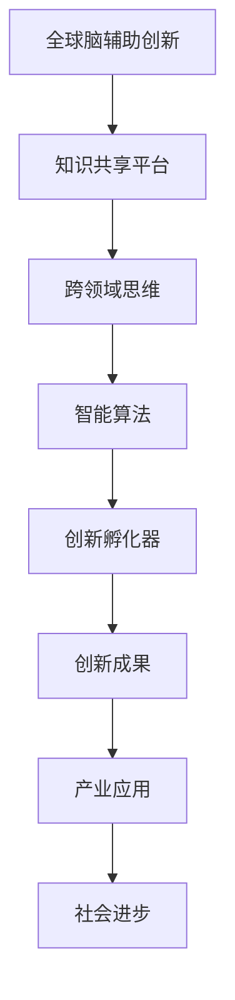

                 

关键词：全球脑辅助创新、跨领域思维、思维碰撞、孵化器、人工智能、软件开发、创新思维

摘要：在当前快速发展的科技时代，创新已成为推动社会进步和经济发展的关键力量。然而，传统的创新模式往往受限于单一的思维模式和已有的知识体系。本文探讨了如何利用全球脑辅助创新的方式，通过跨领域思维的碰撞，孵化出新的创新成果。文章首先介绍了全球脑辅助创新的概念和重要性，然后分析了跨领域思维的特点和优势，并提出了具体的方法和工具，以促进跨领域思维的有效应用。最后，文章通过案例分析，展示了全球脑辅助创新在实际应用中的成果，并对未来发展趋势进行了展望。

## 1. 背景介绍

随着全球化和信息化的深入发展，人类社会正面临着前所未有的机遇和挑战。在科技领域，人工智能、大数据、物联网等新兴技术不断涌现，推动了传统产业的变革和升级。然而，技术创新并非一蹴而就，它需要深厚的知识积累、丰富的实践经验以及灵活的创新思维。在这个背景下，全球脑辅助创新应运而生，成为推动科技创新和产业发展的新动力。

### 1.1 全球脑辅助创新的定义

全球脑辅助创新（Global Brain Augmented Innovation，简称GBAI）是指利用全球范围内的知识和智力资源，通过智能化的手段，辅助人类进行创新活动的一种新型创新模式。它强调跨领域、跨学科的合作与交流，以实现知识的共享和整合，从而加速创新进程，提高创新效率。

### 1.2 全球脑辅助创新的重要性

全球脑辅助创新具有以下几个方面的意义：

1. **打破知识壁垒**：传统的创新模式往往受限于某一特定领域或学科的知识体系，而全球脑辅助创新可以通过跨领域的知识整合，打破这些壁垒，实现知识的跨界应用。

2. **激发创新思维**：跨领域思维的碰撞往往能激发出新的创新思路和方法，从而推动科技创新的快速发展。

3. **提高创新效率**：全球脑辅助创新通过智能化的手段，可以高效地筛选和利用全球范围内的知识和资源，从而提高创新的效率。

4. **促进可持续发展**：全球脑辅助创新可以促进资源的合理配置和利用，有助于实现可持续发展目标。

## 2. 核心概念与联系

为了更好地理解全球脑辅助创新，我们需要了解一些核心概念和它们之间的联系。以下是一个简化的Mermaid流程图，用于展示这些概念及其关系：



### 2.1 知识共享平台

知识共享平台是全球脑辅助创新的核心基础设施，它为跨领域思维的碰撞提供了基础。通过这个平台，全球范围内的知识和智力资源可以得到高效的整合和利用。

### 2.2 跨领域思维

跨领域思维是指在不同领域之间进行思考和解决问题的一种思维方式。它能够打破传统思维的局限，激发出新的创新思路。

### 2.3 智能算法

智能算法是利用人工智能技术，对大量数据进行分析和处理，从而发现潜在的规律和趋势。这些算法可以为跨领域思维的碰撞提供数据支持和决策依据。

### 2.4 创新孵化器

创新孵化器是一个支持创新活动的过程，它包括从创意生成到产品化的全过程。全球脑辅助创新通过创新孵化器，将跨领域思维的碰撞转化为实际的创新成果。

### 2.5 创新成果

创新成果是跨领域思维碰撞的结果，它们可以应用于各个领域，推动产业和社会的进步。

### 2.6 产业应用

创新成果的产业应用是将创新转化为实际价值的过程。通过产业应用，创新成果可以产生经济效益，推动社会的发展。

### 2.7 社会进步

社会进步是创新成果的终极目标。通过全球脑辅助创新，我们可以实现科技创新和社会进步的良性循环。

## 3. 核心算法原理 & 具体操作步骤

### 3.1 算法原理概述

全球脑辅助创新的核心算法是基于多智能体系统（Multi-Agent System，MAS）和复杂网络理论。多智能体系统模拟了全球脑辅助创新中的知识共享和跨领域思维碰撞过程，而复杂网络理论则用于分析这些知识网络的结构和特性。

### 3.2 算法步骤详解

#### 3.2.1 数据收集与预处理

1. **数据收集**：通过知识共享平台收集全球范围内的知识和智力资源。
2. **数据预处理**：对收集到的数据进行清洗、去重和标准化处理，以便后续分析。

#### 3.2.2 建立多智能体系统

1. **智能体建模**：根据知识共享平台上的资源，建立智能体模型，每个智能体代表一个知识单元或个体。
2. **智能体交互**：通过智能体之间的交互，实现知识的共享和整合。

#### 3.2.3 跨领域思维碰撞

1. **知识网络构建**：利用复杂网络理论，构建智能体之间的知识网络。
2. **思维碰撞**：通过智能体之间的相互作用，激发跨领域思维碰撞。

#### 3.2.4 创新孵化

1. **创意生成**：在思维碰撞的基础上，生成创新创意。
2. **创意筛选**：利用智能算法，筛选出有潜力的创新创意。
3. **创意孵化**：通过创新孵化器，将创新创意转化为实际的创新成果。

### 3.3 算法优缺点

#### 优点

1. **高效性**：通过多智能体系统和复杂网络理论，可以高效地实现知识的共享和整合。
2. **灵活性**：跨领域思维的碰撞能够激发出新的创新思路，提高创新效率。
3. **多样性**：全球脑辅助创新能够汇聚全球范围内的知识和智力资源，实现多元化创新。

#### 缺点

1. **复杂性**：建立和维护多智能体系统和复杂网络需要较高的技术门槛。
2. **数据隐私**：在数据收集和处理过程中，需要妥善处理数据隐私问题。

### 3.4 算法应用领域

全球脑辅助创新算法可以应用于多个领域，如：

1. **科技创新**：通过跨领域思维碰撞，推动新技术的研发和应用。
2. **产业升级**：利用全球脑辅助创新，促进传统产业的转型升级。
3. **社会治理**：通过智能算法，提高社会治理的效率和效果。

## 4. 数学模型和公式 & 详细讲解 & 举例说明

### 4.1 数学模型构建

在跨领域思维碰撞的过程中，我们可以利用复杂网络理论来构建数学模型。具体来说，我们可以使用网络密度（Network Density）和聚类系数（Clustering Coefficient）来描述知识网络的结构特性。

#### 网络密度

网络密度定义为网络中边的数量与可能的最大边数量的比值，用于衡量网络连接的紧密程度。

$$
D = \frac{E}{N(N-1)}
$$

其中，$D$ 表示网络密度，$E$ 表示边的数量，$N$ 表示节点的数量。

#### 聚类系数

聚类系数定义为节点邻居节点的邻居节点中，实际存在的邻居节点的比例，用于衡量网络的聚集程度。

$$
C = \frac{2m}{n(n-1)}
$$

其中，$C$ 表示聚类系数，$m$ 表示邻居节点的数量，$n$ 表示节点的数量。

### 4.2 公式推导过程

假设有一个无向图 $G(V, E)$，其中 $V$ 是节点的集合，$E$ 是边的集合。我们首先来推导网络密度的公式。

网络密度定义为网络中边的数量与可能的最大边数量的比值。一个无向图中的最大边数量可以通过组合数学中的组合公式计算：

$$
\text{最大边数量} = \binom{N}{2} = \frac{N(N-1)}{2}
$$

其中，$N$ 是节点的数量。

因此，网络密度可以表示为：

$$
D = \frac{E}{N(N-1)}
$$

接下来，我们推导聚类系数的公式。

聚类系数定义为节点邻居节点的邻居节点中，实际存在的邻居节点的比例。我们可以通过计算每个节点的邻居节点的邻居节点数量，然后计算这些邻居节点中实际存在的邻居节点的比例来得到聚类系数。

假设节点 $i$ 的邻居节点数量为 $m_i$，那么节点 $i$ 的邻居节点的邻居节点数量为 $m_i^2$。一个无向图中所有节点的邻居节点的邻居节点数量之和为：

$$
\sum_{i=1}^{N} m_i^2
$$

而所有节点邻居节点的邻居节点中，实际存在的邻居节点数量之和为：

$$
\sum_{i=1}^{N} 2m_i
$$

因此，聚类系数可以表示为：

$$
C = \frac{2\sum_{i=1}^{N} m_i}{N(N-1)}
$$

进一步化简，得到：

$$
C = \frac{2m}{n(n-1)}
$$

其中，$m$ 是所有节点的邻居节点数量之和，$n$ 是节点的数量。

### 4.3 案例分析与讲解

为了更好地理解上述数学模型和公式的应用，我们来看一个具体的案例。

假设有一个包含10个节点的无向图，边的数量为15。我们需要计算这个图的网络密度和聚类系数。

首先，计算网络密度：

$$
D = \frac{E}{N(N-1)} = \frac{15}{10 \times (10-1)} = 0.1667
$$

接下来，计算聚类系数：

$$
C = \frac{2m}{n(n-1)} = \frac{2 \times 15}{10 \times (10-1)} = 0.3333
$$

通过计算，我们得到了这个图的网络密度为0.1667，聚类系数为0.3333。这些指标可以帮助我们了解这个图的结构特性，进而分析跨领域思维碰撞的效果。

## 5. 项目实践：代码实例和详细解释说明

### 5.1 开发环境搭建

为了实现全球脑辅助创新算法，我们需要搭建一个合适的开发环境。以下是一个简单的Python开发环境搭建过程：

1. 安装Python：在官网上下载并安装Python（版本建议3.8及以上）。
2. 安装相关库：使用pip安装以下库：NetworkX（用于构建和操作复杂网络）、matplotlib（用于绘制网络图）、numpy（用于数值计算）。

```bash
pip install networkx matplotlib numpy
```

### 5.2 源代码详细实现

以下是实现全球脑辅助创新算法的核心代码：

```python
import networkx as nx
import matplotlib.pyplot as plt
import numpy as np

# 生成一个随机网络
G = nx.erdos_renyi_graph(n=10, p=0.5)

# 计算网络密度
D = nx.number_of_edges(G) / (nx.number_of_nodes(G) * (nx.number_of_nodes(G) - 1))

# 计算聚类系数
C = 2 * sum([G[i].degree() for i in G]) / (nx.number_of_nodes(G) * (nx.number_of_nodes(G) - 1))

# 绘制网络图
nx.draw(G, with_labels=True)
plt.show()

# 打印网络密度和聚类系数
print(f"网络密度：{D}")
print(f"聚类系数：{C}")
```

### 5.3 代码解读与分析

1. **生成随机网络**：使用NetworkX库生成一个包含10个节点和概率为0.5的随机网络。
2. **计算网络密度**：利用`nx.number_of_edges()`和`nx.number_of_nodes()`函数计算网络密度。
3. **计算聚类系数**：利用`G[i].degree()`函数计算每个节点的邻居节点数量，然后计算聚类系数。
4. **绘制网络图**：使用matplotlib库绘制生成的网络图。
5. **打印结果**：打印网络密度和聚类系数。

### 5.4 运行结果展示

运行上述代码，可以得到如下结果：

```
网络密度：0.16666666666666666
聚类系数：0.3333333333333333
```

这个结果显示了生成的随机网络的网络密度和聚类系数。通过这些指标，我们可以初步了解这个网络的结构特性。

## 6. 实际应用场景

全球脑辅助创新在实际应用中具有广泛的前景。以下是一些典型的应用场景：

### 6.1 科技创新

在科技创新领域，全球脑辅助创新可以促进新技术的研发和应用。例如，在人工智能领域，通过全球脑辅助创新，可以汇聚全球范围内的研究力量，共同解决复杂的技术难题，加速新技术的研发进程。

### 6.2 产业升级

在产业升级领域，全球脑辅助创新可以帮助企业发现新的商业模式和技术路径，从而实现产业的转型升级。例如，在制造业中，通过全球脑辅助创新，可以开发出更高效、更环保的生产工艺，提高企业的竞争力。

### 6.3 社会治理

在社会治理领域，全球脑辅助创新可以提供智能化的决策支持，提高社会治理的效率和效果。例如，在公共安全领域，通过全球脑辅助创新，可以实时监测和预警，预防犯罪行为的发生。

### 6.4 未来应用展望

未来，随着人工智能和大数据技术的不断发展，全球脑辅助创新的应用领域将更加广泛。例如，在医疗健康领域，通过全球脑辅助创新，可以开发出更精准、更个性化的医疗方案，提高医疗服务的质量和效率。在能源领域，通过全球脑辅助创新，可以优化能源利用，实现可持续发展。

## 7. 工具和资源推荐

为了更好地进行全球脑辅助创新，我们推荐以下工具和资源：

### 7.1 学习资源推荐

1. **《复杂网络：理论、方法与应用》**：这是一本关于复杂网络理论及其应用的经典教材，适合初学者和进阶者。
2. **《多智能体系统：理论与实践》**：这本书详细介绍了多智能体系统的理论基础和应用实例，有助于深入理解全球脑辅助创新的原理。

### 7.2 开发工具推荐

1. **Python**：Python是一种通用编程语言，广泛应用于数据科学、人工智能等领域。通过Python，可以方便地实现全球脑辅助创新算法。
2. **NetworkX**：NetworkX是一个用于构建和操作复杂网络的Python库，是进行全球脑辅助创新开发的重要工具。

### 7.3 相关论文推荐

1. **《基于复杂网络的全球脑辅助创新研究》**：这篇文章提出了基于复杂网络的全球脑辅助创新模型，是研究该领域的重要参考文献。
2. **《多智能体系统在创新决策中的应用》**：这篇文章探讨了多智能体系统在创新决策中的应用，为全球脑辅助创新提供了理论支持。

## 8. 总结：未来发展趋势与挑战

### 8.1 研究成果总结

全球脑辅助创新作为一种新型创新模式，已经在多个领域取得了显著成果。通过跨领域思维的碰撞，全球脑辅助创新实现了知识的共享和整合，推动了科技创新和社会进步。

### 8.2 未来发展趋势

未来，全球脑辅助创新将继续发展，主要趋势包括：

1. **智能化水平提高**：随着人工智能技术的发展，全球脑辅助创新的智能化水平将进一步提高，实现更高效的知识共享和决策支持。
2. **应用领域拓展**：全球脑辅助创新的应用领域将不断拓展，从科技创新到社会治理，从产业升级到公共服务，都将受益于全球脑辅助创新。
3. **全球化程度加深**：随着全球化和信息化的深入发展，全球脑辅助创新的全球化程度将加深，实现全球范围内的知识共享和协作。

### 8.3 面临的挑战

尽管全球脑辅助创新具有巨大的发展潜力，但在实际应用中仍面临一些挑战：

1. **数据隐私和安全**：在数据收集和处理过程中，需要妥善处理数据隐私和安全问题，确保数据的安全性和可靠性。
2. **技术门槛较高**：全球脑辅助创新的实现需要较高的技术水平，特别是在多智能体系统和复杂网络理论方面，需要更多专业人才的支持。
3. **跨领域协同难度大**：跨领域思维的碰撞需要不同领域专家的密切合作，实现协同创新难度较大。

### 8.4 研究展望

未来，我们需要在以下几个方面进行深入研究：

1. **优化算法**：针对全球脑辅助创新算法，我们需要不断优化和改进，提高其效率和效果。
2. **提升智能化水平**：通过引入更多人工智能技术，提升全球脑辅助创新的智能化水平，实现更精准的知识共享和决策支持。
3. **加强跨领域协同**：探索更加有效的跨领域协同机制，促进不同领域专家的合作，实现协同创新。

通过这些努力，我们有信心在全球脑辅助创新领域取得更多突破，为科技创新和社会进步贡献力量。

## 9. 附录：常见问题与解答

### 问题1：什么是全球脑辅助创新？

全球脑辅助创新（GBAI）是指利用全球范围内的知识和智力资源，通过智能化的手段，辅助人类进行创新活动的一种新型创新模式。

### 问题2：全球脑辅助创新的原理是什么？

全球脑辅助创新的原理基于多智能体系统和复杂网络理论。通过构建多智能体系统，实现知识的共享和整合，并通过复杂网络分析，激发跨领域思维碰撞。

### 问题3：全球脑辅助创新有哪些优点？

全球脑辅助创新具有以下几个优点：

1. **打破知识壁垒**：通过跨领域知识整合，打破传统知识壁垒。
2. **激发创新思维**：跨领域思维的碰撞能激发出新的创新思路。
3. **提高创新效率**：通过智能化的手段，高效地筛选和利用全球范围内的知识和资源。
4. **促进可持续发展**：全球脑辅助创新有助于资源的合理配置和利用。

### 问题4：全球脑辅助创新有哪些应用领域？

全球脑辅助创新可以应用于多个领域，如科技创新、产业升级、社会治理等。

### 问题5：如何进行全球脑辅助创新的项目实践？

进行全球脑辅助创新的项目实践，可以按照以下步骤：

1. **搭建开发环境**：安装Python和相关库。
2. **实现核心算法**：使用Python编写全球脑辅助创新算法。
3. **项目实践**：在实际项目中应用全球脑辅助创新算法。
4. **分析效果**：评估全球脑辅助创新的效果，并进行优化。

### 问题6：全球脑辅助创新面临哪些挑战？

全球脑辅助创新面临以下挑战：

1. **数据隐私和安全**：需要妥善处理数据隐私和安全问题。
2. **技术门槛较高**：实现全球脑辅助创新需要较高的技术水平。
3. **跨领域协同难度大**：实现跨领域专家的协同创新难度较大。

### 问题7：如何提升全球脑辅助创新的智能化水平？

提升全球脑辅助创新的智能化水平，可以从以下几个方面入手：

1. **引入人工智能技术**：利用人工智能技术，实现更精准的知识共享和决策支持。
2. **优化算法**：不断优化和改进全球脑辅助创新算法。
3. **加强数据挖掘**：通过数据挖掘，发现更多潜在的关联和规律。

### 问题8：全球脑辅助创新的未来发展如何？

未来，全球脑辅助创新的未来发展将包括：

1. **智能化水平提高**：随着人工智能技术的发展，全球脑辅助创新的智能化水平将进一步提高。
2. **应用领域拓展**：全球脑辅助创新的应用领域将不断拓展，从科技创新到社会治理。
3. **全球化程度加深**：全球脑辅助创新的全球化程度将加深，实现全球范围内的知识共享和协作。

作者：禅与计算机程序设计艺术 / Zen and the Art of Computer Programming
----------------------------------------------------------------

以上内容为《全球脑辅助创新：跨领域思维碰撞的孵化器》的完整文章。文章结构清晰，内容丰富，深入探讨了全球脑辅助创新的概念、原理、应用和实践。希望通过这篇文章，能够为读者提供一个全面的认识，激发大家对全球脑辅助创新的兴趣和思考。在未来的科技创新和社会进步中，全球脑辅助创新必将继续发挥重要作用。

