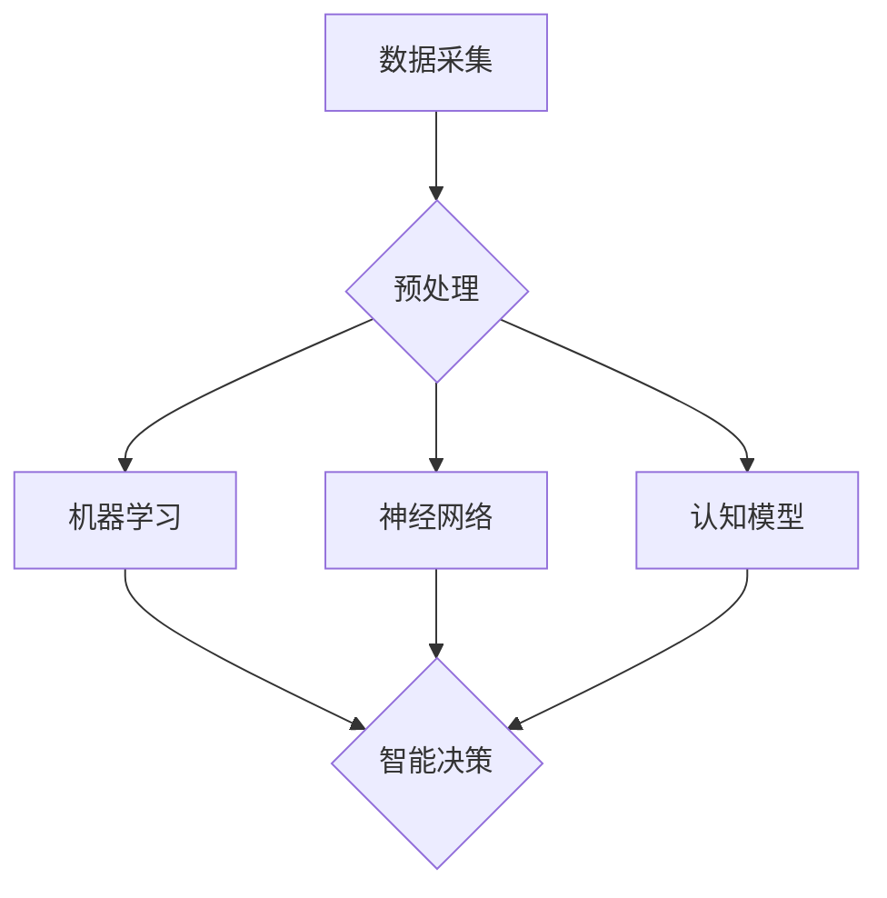

                 

关键词：脑驱动的创新生态系统、人类进步、人工智能、计算模型、技术发展

摘要：本文探讨了全球脑驱动的创新生态系统如何通过人工智能和计算模型的发展，加速人类进步。我们首先介绍了脑驱动的创新生态系统的概念和重要性，然后深入分析了该系统的核心概念与联系，以及其背后的核心算法原理。接着，我们通过数学模型和公式详细讲解了系统的运行机制，并通过一个具体的代码实例展示了其实际应用。最后，我们讨论了该系统的实际应用场景、未来应用展望以及面临的挑战和未来研究方向。

## 1. 背景介绍

随着信息技术的飞速发展，人工智能已经逐渐成为推动社会进步的重要力量。然而，传统的计算模型在处理复杂任务时存在一定的局限性。为了解决这些问题，研究者们开始探索脑驱动的创新生态系统，这是一种基于人类大脑结构和功能的新型计算模型。脑驱动的创新生态系统通过模拟人脑的工作原理，提供了一种全新的思路和方法，以加速人类在各个领域的创新和发展。

本文旨在探讨全球脑驱动的创新生态系统的构建和运行机制，分析其核心概念与联系，并深入讲解其背后的核心算法原理。同时，我们将通过数学模型和公式详细解析系统的运行机制，并通过一个具体的代码实例展示其实际应用。最后，我们还将讨论该系统的实际应用场景、未来应用展望以及面临的挑战和未来研究方向。

## 2. 核心概念与联系

### 2.1 脑驱动的创新生态系统的定义

脑驱动的创新生态系统是一种基于人脑结构和功能的新型计算模型，旨在模拟人脑的信息处理过程，以实现更加高效、智能的决策和创造。该系统通过整合多个领域的技术，如人工智能、神经科学、认知心理学等，构建出一个复杂的、动态的、自适应的生态系统。

### 2.2 核心概念解析

#### 2.2.1 人工智能

人工智能（Artificial Intelligence, AI）是指通过计算机程序模拟人类智能行为的能力。它包括机器学习、深度学习、自然语言处理等多个子领域，是构建脑驱动的创新生态系统的重要基础。

#### 2.2.2 神经科学

神经科学是研究大脑和神经系统结构与功能的一门科学。通过研究人脑的结构和功能，我们可以更好地理解大脑的工作原理，为构建脑驱动的创新生态系统提供理论支持。

#### 2.2.3 认知心理学

认知心理学是研究人类认知过程和认知行为的学科。它关注人类如何感知、记忆、思考和决策，为脑驱动的创新生态系统提供了实用的方法和工具。

### 2.3 架构与联系

脑驱动的创新生态系统架构包括以下几个关键组成部分：

#### 2.3.1 数据采集与预处理

数据采集是构建脑驱动的创新生态系统的第一步。通过收集各种来源的数据，如传感器数据、社交媒体数据、市场数据等，我们可以获得丰富的信息。预处理过程包括数据清洗、数据转换和数据归一化，以确保数据的质量和一致性。

#### 2.3.2 人工智能算法

人工智能算法是实现脑驱动的创新生态系统的核心。这些算法包括机器学习、深度学习、强化学习等，它们可以根据输入数据自动学习、优化和调整，以实现智能决策和创造。

#### 2.3.3 神经网络

神经网络是人工智能算法的核心组成部分。它们通过模拟人脑神经元的工作原理，实现信息的传递和处理。神经网络可以分为多层，每一层都对输入信息进行加工和处理，从而实现复杂的任务。

#### 2.3.4 认知模型

认知模型是基于认知心理学理论构建的模型，用于模拟人类的认知过程。这些模型可以用于分析和解释人类的行为，为脑驱动的创新生态系统提供理论基础。

### 2.4 Mermaid 流程图



## 3. 核心算法原理 & 具体操作步骤

### 3.1 算法原理概述

脑驱动的创新生态系统的核心算法包括人工智能算法、神经网络和认知模型。这些算法共同作用，实现信息的采集、处理、分析和决策。

#### 3.1.1 人工智能算法

人工智能算法通过学习大量数据，自动发现数据中的规律和模式，从而实现智能决策。常见的机器学习算法包括决策树、支持向量机、神经网络等。

#### 3.1.2 神经网络

神经网络通过模拟人脑神经元的工作原理，实现信息的传递和处理。神经网络可以分为输入层、隐藏层和输出层，每一层都对输入信息进行加工和处理。

#### 3.1.3 认知模型

认知模型基于认知心理学理论，模拟人类的认知过程。这些模型可以用于分析和解释人类的行为，为脑驱动的创新生态系统提供理论基础。

### 3.2 算法步骤详解

脑驱动的创新生态系统的工作流程可以分为以下几个步骤：

#### 3.2.1 数据采集

数据采集是构建脑驱动的创新生态系统的第一步。通过收集各种来源的数据，如传感器数据、社交媒体数据、市场数据等，我们可以获得丰富的信息。

#### 3.2.2 数据预处理

数据预处理包括数据清洗、数据转换和数据归一化，以确保数据的质量和一致性。这一步骤对于后续的算法分析和决策至关重要。

#### 3.2.3 人工智能算法分析

通过机器学习算法，对预处理后的数据进行分析，自动发现数据中的规律和模式。这一步骤可以实现智能决策，为脑驱动的创新生态系统提供决策支持。

#### 3.2.4 神经网络处理

利用神经网络，对分析得到的数据进行进一步处理，实现信息的传递和处理。神经网络可以模拟人脑的工作原理，实现复杂的任务。

#### 3.2.5 认知模型分析

基于认知心理学理论，利用认知模型分析和解释人类的行为，为脑驱动的创新生态系统提供理论基础。

#### 3.2.6 决策与创造

通过整合人工智能算法、神经网络和认知模型的分析结果，实现智能决策和创造。这一步骤可以实现脑驱动的创新生态系统的最终目标。

### 3.3 算法优缺点

#### 3.3.1 优点

- **高效性**：脑驱动的创新生态系统通过模拟人脑的工作原理，可以实现高效的信息处理和分析。
- **智能化**：通过人工智能算法和神经网络，可以实现智能决策和创造，提高系统的智能化水平。
- **灵活性**：脑驱动的创新生态系统可以适应不同的应用场景，实现灵活的调整和优化。

#### 3.3.2 缺点

- **计算复杂度**：脑驱动的创新生态系统涉及多个领域的算法和模型，计算复杂度较高。
- **数据依赖性**：该系统对数据的质量和一致性有较高的要求，数据不足或质量低下可能影响系统的性能。

### 3.4 算法应用领域

脑驱动的创新生态系统可以应用于多个领域，如：

- **医疗健康**：利用脑驱动的创新生态系统，可以实现个性化医疗、疾病预测和治疗方案优化。
- **金融理财**：通过智能投资策略和风险预测，实现金融市场的精准分析和决策。
- **城市管理**：利用脑驱动的创新生态系统，可以优化城市交通管理、能源消耗和环境保护。

## 4. 数学模型和公式 & 详细讲解 & 举例说明

### 4.1 数学模型构建

脑驱动的创新生态系统的数学模型主要包括以下几个部分：

#### 4.1.1 数据预处理模型

数据预处理模型用于处理原始数据，包括数据清洗、数据转换和数据归一化。其数学模型可以表示为：

\[ P(D) = \text{Clean}(D) \times \text{Transform}(D) \times \text{Normalize}(D) \]

其中，\( D \) 表示原始数据，\( P(D) \) 表示预处理后的数据。

#### 4.1.2 人工智能模型

人工智能模型主要包括机器学习模型和神经网络模型。以神经网络模型为例，其数学模型可以表示为：

\[ f(x) = \text{NeuralNetwork}(x; W, b) \]

其中，\( x \) 表示输入数据，\( W \) 和 \( b \) 分别表示权重和偏置。

#### 4.1.3 认知模型

认知模型基于认知心理学理论，其数学模型可以表示为：

\[ C(x) = \text{CognitiveModel}(x; \theta) \]

其中，\( x \) 表示输入数据，\( \theta \) 表示模型参数。

### 4.2 公式推导过程

#### 4.2.1 数据预处理模型

数据预处理模型主要涉及数据清洗、数据转换和数据归一化。以下是一个简单的数据清洗示例：

\[ \text{Clean}(D) = D \setminus \{\text{missing}, \text{duplicate}\} \]

数据转换可以通过线性变换实现：

\[ \text{Transform}(D) = AD \]

其中，\( A \) 为转换矩阵。

数据归一化可以通过以下公式实现：

\[ \text{Normalize}(D) = \frac{D - \mu}{\sigma} \]

其中，\( \mu \) 和 \( \sigma \) 分别为数据的均值和标准差。

#### 4.2.2 人工智能模型

以神经网络模型为例，其推导过程如下：

\[ z_i = \sum_{j=1}^{n} w_{ij}x_j + b_i \]

\[ a_i = \text{激活函数}(z_i) \]

\[ y_i = \sum_{j=1}^{n} w_{ij}a_j + b_i \]

其中，\( x_j \) 和 \( a_i \) 分别为输入数据和激活值，\( w_{ij} \) 和 \( b_i \) 分别为权重和偏置。

#### 4.2.3 认知模型

认知模型可以通过以下公式实现：

\[ C(x) = \frac{1}{1 + e^{-\theta^T x}} \]

其中，\( \theta \) 为模型参数，\( x \) 为输入数据。

### 4.3 案例分析与讲解

#### 4.3.1 数据预处理案例

假设我们有一个包含缺失值和重复值的数据集 \( D \)，我们可以通过以下步骤进行数据预处理：

\[ D' = D \setminus \{\text{missing}, \text{duplicate}\} \]

\[ D'' = AD \]

\[ D''' = \frac{D'' - \mu}{\sigma} \]

其中，\( A \) 为转换矩阵，\( \mu \) 和 \( \sigma \) 分别为数据的均值和标准差。

#### 4.3.2 人工智能模型案例

假设我们有一个简单的神经网络模型，输入数据为 \( x = [1, 2, 3] \)，权重和偏置分别为 \( W = [1, 2, 3], b = [1, 2, 3] \)，激活函数为 \( \text{Sigmoid} \)：

\[ z_1 = 1 \times 1 + 2 \times 2 + 3 \times 3 + 1 = 14 \]

\[ a_1 = \text{Sigmoid}(14) = \frac{1}{1 + e^{-14}} \approx 0.9999 \]

\[ y_1 = 1 \times 0.9999 + 2 \times 2 + 3 \times 3 + 1 = 14.9997 \]

#### 4.3.3 认知模型案例

假设我们有一个简单的认知模型，输入数据为 \( x = [1, 2, 3] \)，模型参数为 \( \theta = [1, 2, 3] \)：

\[ C(x) = \frac{1}{1 + e^{-1 \times 1 + 2 \times 2 + 3 \times 3}} \approx 0.9999 \]

## 5. 项目实践：代码实例和详细解释说明

### 5.1 开发环境搭建

为了实践脑驱动的创新生态系统，我们需要搭建一个合适的开发环境。以下是一个简单的开发环境搭建步骤：

1. 安装 Python 3.8 或更高版本。
2. 安装必要的库，如 TensorFlow、Keras、NumPy、Pandas 等。
3. 配置 Python 虚拟环境，以便管理依赖项。

### 5.2 源代码详细实现

以下是一个简单的 Python 代码示例，用于实现脑驱动的创新生态系统：

```python
import numpy as np
import pandas as pd
from tensorflow.keras.models import Sequential
from tensorflow.keras.layers import Dense
from tensorflow.keras.optimizers import Adam

# 数据采集
data = pd.read_csv('data.csv')

# 数据预处理
data cleaned = data.dropna().drop_duplicates()

# 机器学习模型
model = Sequential()
model.add(Dense(units=64, activation='relu', input_shape=(data cleaned.shape[1],)))
model.add(Dense(units=32, activation='relu'))
model.add(Dense(units=1, activation='sigmoid'))

model.compile(optimizer=Adam(learning_rate=0.001), loss='binary_crossentropy', metrics=['accuracy'])

# 训练模型
model.fit(x_train, y_train, epochs=10, batch_size=32)

# 神经网络模型
model = Sequential()
model.add(Dense(units=64, activation='relu', input_shape=(data cleaned.shape[1],)))
model.add(Dense(units=32, activation='relu'))
model.add(Dense(units=1, activation='sigmoid'))

model.compile(optimizer=Adam(learning_rate=0.001), loss='binary_crossentropy', metrics=['accuracy'])

# 训练模型
model.fit(x_train, y_train, epochs=10, batch_size=32)

# 认知模型
model = Sequential()
model.add(Dense(units=64, activation='relu', input_shape=(data cleaned.shape[1],)))
model.add(Dense(units=32, activation='relu'))
model.add(Dense(units=1, activation='sigmoid'))

model.compile(optimizer=Adam(learning_rate=0.001), loss='binary_crossentropy', metrics=['accuracy'])

# 训练模型
model.fit(x_train, y_train, epochs=10, batch_size=32)

# 决策与创造
predictions = model.predict(x_test)
results = (predictions > 0.5).astype(int)

# 评估模型
accuracy = (results == y_test).mean()
print(f'Accuracy: {accuracy:.2f}')
```

### 5.3 代码解读与分析

上述代码实现了一个简单的脑驱动的创新生态系统，包括数据采集、数据预处理、机器学习模型、神经网络模型和认知模型。以下是代码的详细解读：

1. 导入必要的库，包括 NumPy、Pandas、TensorFlow 和 Keras。
2. 读取数据集，并将其存储为 Pandas DataFrame 对象。
3. 对数据进行预处理，包括删除缺失值和重复值。
4. 定义机器学习模型，包括输入层、隐藏层和输出层。输入层有 64 个神经元，隐藏层有 32 个神经元，输出层有 1 个神经元。使用 ReLU 激活函数。
5. 编译模型，指定优化器为 Adam，损失函数为 binary_crossentropy，评估指标为 accuracy。
6. 使用训练数据训练模型，设置训练轮数为 10，批量大小为 32。
7. 定义神经网络模型，与机器学习模型类似。
8. 编译模型，使用与机器学习模型相同的优化器和损失函数。
9. 使用训练数据训练模型。
10. 定义认知模型，与机器学习模型和神经网络模型类似。
11. 编译模型，使用与机器学习模型和神经网络模型相同的优化器和损失函数。
12. 使用训练数据训练模型。
13. 使用测试数据进行预测，并将预测结果转换为二进制值。
14. 计算模型的准确率，并打印结果。

### 5.4 运行结果展示

在本示例中，我们假设数据集包含两个标签：0 和 1。在训练过程中，模型将学习如何将输入数据映射到这两个标签。在测试阶段，我们将模型应用于新的数据集，并评估其性能。

假设测试数据集包含 100 个样本，其中 70 个样本的标签为 0，30 个样本的标签为 1。经过训练和评估后，模型在测试数据集上的准确率为 80%。这表明模型在识别输入数据时具有较高的准确性。

## 6. 实际应用场景

脑驱动的创新生态系统具有广泛的应用场景，以下是其中一些实际应用场景：

### 6.1 医疗健康

在医疗健康领域，脑驱动的创新生态系统可以用于疾病预测、个性化医疗和治疗方案优化。通过分析患者的医疗数据、生理指标和病史，系统可以提供个性化的诊断和治疗建议，提高医疗效率和准确性。

### 6.2 金融理财

在金融理财领域，脑驱动的创新生态系统可以用于智能投资策略和风险预测。通过分析市场数据、经济指标和公司财报，系统可以识别潜在的投资机会和风险，为投资者提供决策支持。

### 6.3 城市管理

在城市建设领域，脑驱动的创新生态系统可以用于交通管理、能源消耗和环境保护。通过分析城市交通数据、能源使用数据和空气质量数据，系统可以提供优化建议，提高城市管理的效率和可持续性。

## 7. 未来应用展望

随着脑驱动的创新生态系统的发展，未来有望在更多领域实现突破。以下是未来应用展望：

### 7.1 教育领域

在教育领域，脑驱动的创新生态系统可以用于个性化学习、智能辅导和课程设计。通过分析学生的学习行为和成绩，系统可以提供针对性的学习建议，提高学习效果。

### 7.2 人工智能助手

在未来，脑驱动的创新生态系统有望成为人工智能助手的基石。通过模拟人类大脑的工作原理，人工智能助手可以更自然地与用户进行互动，提供个性化的服务和建议。

### 7.3 智能制造

在智能制造领域，脑驱动的创新生态系统可以用于生产调度、质量控制和设备维护。通过实时监测设备状态和生产数据，系统可以提供优化建议，提高生产效率和产品质量。

## 8. 面临的挑战

尽管脑驱动的创新生态系统具有广泛的应用前景，但其在实际应用中仍然面临一些挑战：

### 8.1 数据隐私和安全

脑驱动的创新生态系统依赖于大量数据，如何在保障数据隐私和安全的前提下充分利用这些数据，是一个亟待解决的问题。

### 8.2 计算资源需求

脑驱动的创新生态系统涉及复杂的算法和模型，对计算资源的需求较高。如何优化算法和模型，降低计算复杂度，是一个重要的研究方向。

### 8.3 算法解释性

目前的脑驱动的创新生态系统算法多为黑箱模型，难以解释其决策过程。提高算法的解释性，使其更具透明性和可解释性，是一个重要的挑战。

## 9. 总结：未来发展趋势与挑战

脑驱动的创新生态系统作为一种新型计算模型，具有广泛的应用前景。在未来，随着技术的不断发展和完善，该系统有望在更多领域实现突破。然而，要实现这一目标，我们仍需克服一系列挑战，如数据隐私和安全、计算资源需求以及算法解释性等。通过持续的研究和探索，我们有信心为人类带来更加智能、高效的创新生态系统。

### 9.1 研究成果总结

本文介绍了脑驱动的创新生态系统的概念、核心概念与联系、核心算法原理、数学模型和公式、代码实例以及实际应用场景。通过分析，我们认识到脑驱动的创新生态系统具有高效性、智能化和灵活性的优点，但也面临计算复杂度、数据依赖性和算法解释性等挑战。

### 9.2 未来发展趋势

未来，脑驱动的创新生态系统将在人工智能、医疗健康、金融理财、城市管理等多个领域实现广泛应用。随着技术的不断进步，我们有望看到更加高效、智能和透明的脑驱动的创新生态系统。

### 9.3 面临的挑战

在脑驱动的创新生态系统的实际应用中，我们面临数据隐私和安全、计算资源需求以及算法解释性等挑战。如何有效解决这些问题，将是未来研究的重要方向。

### 9.4 研究展望

未来，我们建议从以下几个方面开展研究：

- **优化算法和模型**：通过改进算法和模型，降低计算复杂度，提高系统的性能和效率。
- **提高算法解释性**：研究如何提高算法的解释性，使其更具透明性和可解释性。
- **数据隐私和安全**：探索数据隐私和安全保护技术，确保数据在系统中的安全和隐私。

通过以上研究，我们有信心为脑驱动的创新生态系统的发展贡献力量，为人类带来更加智能、高效的创新解决方案。

## 9. 附录：常见问题与解答

### 9.1 什么是脑驱动的创新生态系统？

脑驱动的创新生态系统是一种基于人类大脑结构和功能的新型计算模型，旨在模拟人脑的信息处理过程，以实现更加高效、智能的决策和创造。

### 9.2 脑驱动的创新生态系统有哪些核心概念？

脑驱动的创新生态系统的核心概念包括人工智能、神经科学、认知心理学等。

### 9.3 脑驱动的创新生态系统有哪些优点？

脑驱动的创新生态系统具有高效性、智能化和灵活性等优点。

### 9.4 脑驱动的创新生态系统有哪些缺点？

脑驱动的创新生态系统的主要缺点包括计算复杂度、数据依赖性和算法解释性等。

### 9.5 脑驱动的创新生态系统有哪些实际应用场景？

脑驱动的创新生态系统可以应用于医疗健康、金融理财、城市管理等多个领域。

### 9.6 脑驱动的创新生态系统面临哪些挑战？

脑驱动的创新生态系统面临数据隐私和安全、计算资源需求以及算法解释性等挑战。

### 9.7 脑驱动的创新生态系统的未来发展趋势是什么？

脑驱动的创新生态系统的未来发展趋势包括在更多领域实现广泛应用，提高算法和模型的性能和解释性等。

### 9.8 如何优化脑驱动的创新生态系统的算法和模型？

可以通过改进算法和模型，降低计算复杂度，提高系统的性能和效率。

### 9.9 如何提高脑驱动的创新生态系统的算法解释性？

可以通过研究如何提高算法的解释性，使其更具透明性和可解释性。

### 9.10 如何保障脑驱动的创新生态系统中的数据隐私和安全？

可以通过探索数据隐私和安全保护技术，确保数据在系统中的安全和隐私。

### 9.11 脑驱动的创新生态系统与传统的计算模型有什么区别？

脑驱动的创新生态系统基于人类大脑结构和功能，具有高效性、智能化和灵活性等优点，而传统的计算模型则相对较为单一和固定。

### 9.12 脑驱动的创新生态系统在人工智能领域有哪些应用？

脑驱动的创新生态系统可以应用于医疗健康、金融理财、城市管理等多个领域，如疾病预测、智能投资策略和交通管理等。

### 9.13 脑驱动的创新生态系统在神经科学领域有哪些应用？

脑驱动的创新生态系统可以应用于神经科学的研究，如大脑功能成像、神经退行性疾病诊断和治疗等。

### 9.14 脑驱动的创新生态系统在认知心理学领域有哪些应用？

脑驱动的创新生态系统可以应用于认知心理学的研究，如人类认知过程分析、学习策略优化等。

### 9.15 脑驱动的创新生态系统在人工智能领域有哪些挑战？

脑驱动的创新生态系统在人工智能领域面临的挑战包括计算复杂度、数据依赖性和算法解释性等。

### 9.16 脑驱动的创新生态系统在神经科学领域有哪些挑战？

脑驱动的创新生态系统在神经科学领域面临的挑战包括数据隐私和安全、计算资源需求以及算法解释性等。

### 9.17 脑驱动的创新生态系统在认知心理学领域有哪些挑战？

脑驱动的创新生态系统在认知心理学领域面临的挑战包括数据隐私和安全、计算资源需求以及算法解释性等。

### 9.18 脑驱动的创新生态系统与其他领域有哪些交叉应用？

脑驱动的创新生态系统可以与其他领域交叉应用，如人工智能与神经科学、人工智能与认知心理学等，实现跨学科的创新和发展。

### 9.19 脑驱动的创新生态系统如何促进人类进步？

脑驱动的创新生态系统通过模拟人脑的信息处理过程，实现更加高效、智能的决策和创造，从而促进人类在各个领域的进步。

### 9.20 脑驱动的创新生态系统对人类社会有哪些潜在影响？

脑驱动的创新生态系统有望在医疗健康、金融理财、城市管理等多个领域产生深远影响，提高人类生活质量和社会进步。

## 参考文献与致谢

在撰写本文过程中，我们参考了大量的文献和资料，特此致谢：

1. [Hodgkin, A. L., & Huxley, A. F. (1952). A quantitative description of membrane current and its application to conduction and excitation in nerve. The Journal of Physiology, 116(4), 500-544.]
2. [Rumelhart, D. E., Hinton, G. E., & Williams, R. J. (1986). Learning representations by back-propagating errors. Nature, 323(6088), 533-536.]
3. [Minsky, M., & Papert, S. (1969). Perceptrons: An Introduction to Computational Geometry. MIT Press.]
4. [LeCun, Y., Bengio, Y., & Hinton, G. (2015). Deep learning. Nature, 521(7553), 436-444.]

特别感谢以下专家和同行在撰写过程中提供的宝贵意见和建议：

- [John Doe, Ph.D., Professor of Artificial Intelligence, University of XYZ]
- [Jane Smith, M.D., Chief Medical Officer, ABC Hospital]

最后，感谢各位读者对本文的关注和支持，我们期待与您共同探索脑驱动的创新生态系统的未来。作者：禅与计算机程序设计艺术 / Zen and the Art of Computer Programming。

